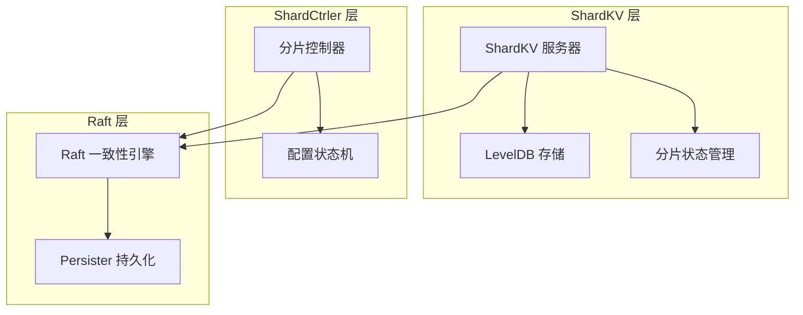
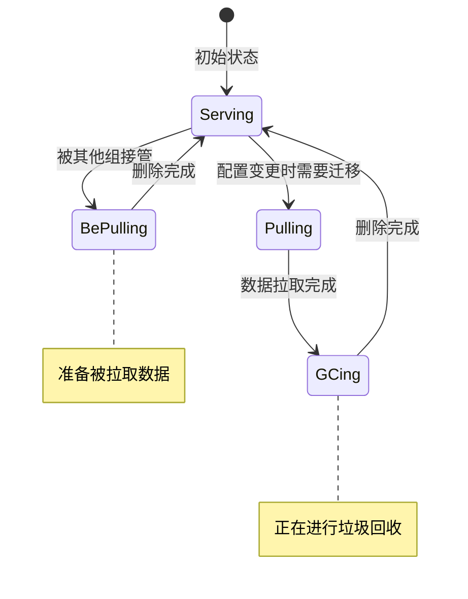
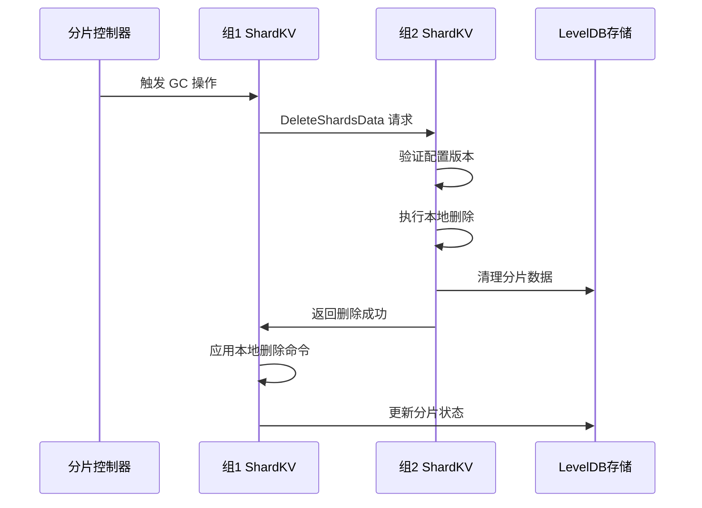
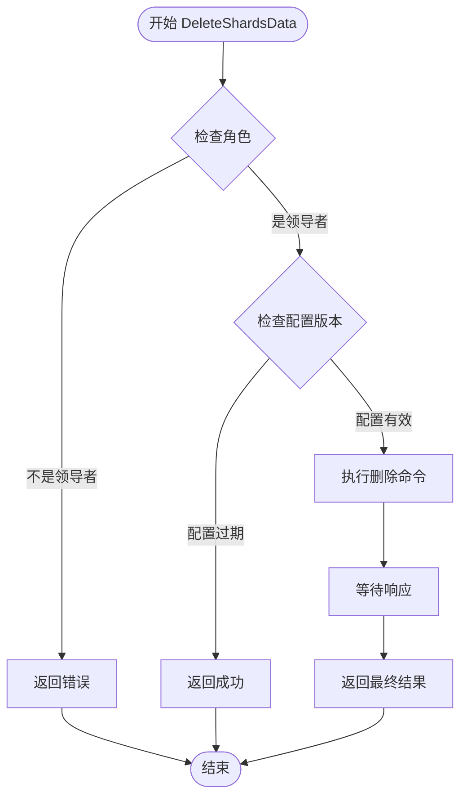
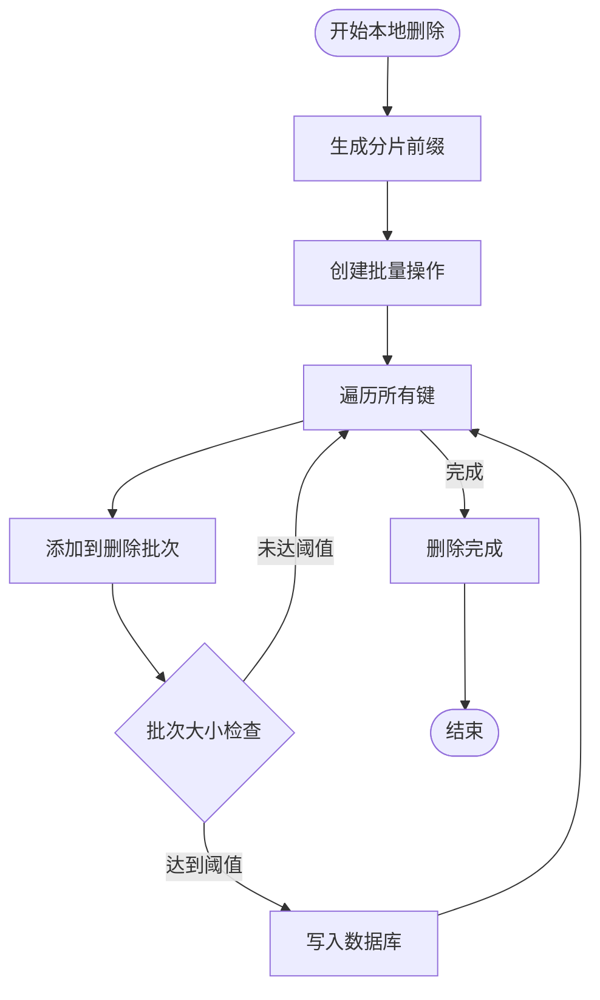
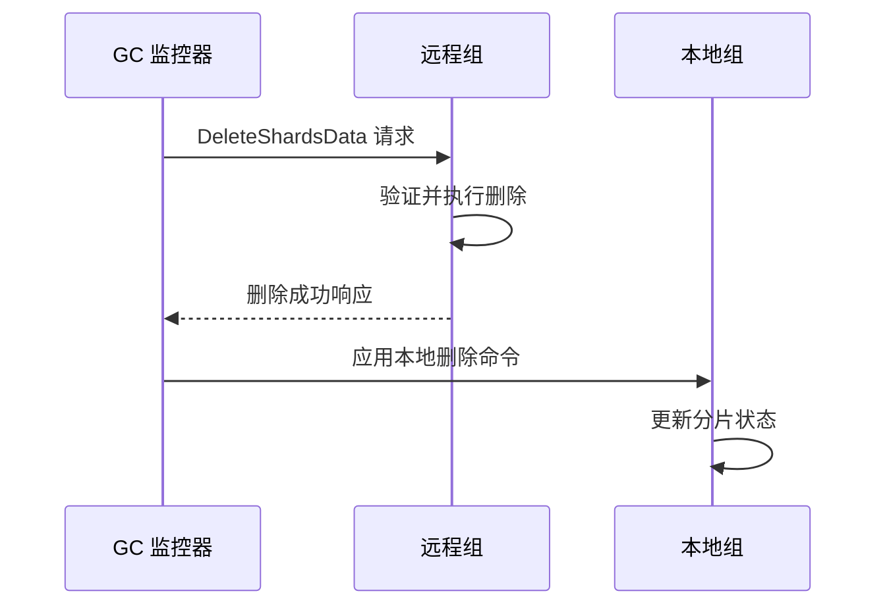
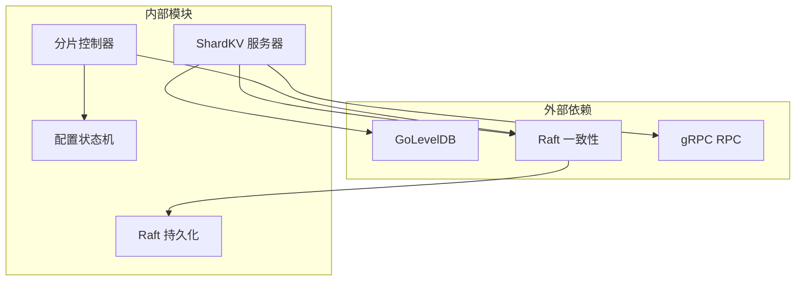

# 垃圾回收机制

<cite>
**本文档引用的文件**
- [server.go](file://shardkv/server.go)
- [common.go](file://shardkv/common.go)
- [shard.go](file://shardkv/shard.go)
- [config.go](file://shardkv/config.go)
- [client.go](file://shardkv/client.go)
- [configstm.go](file://shardctrler/configstm.go)
- [client.go](file://shardctrler/client.go)
- [persister.go](file://raft/persister.go)
- [test_test.go](file://shardkv/test_test.go)
</cite>

## 目录
1. [简介](#简介)
2. [项目结构](#项目结构)
3. [核心组件](#核心组件)
4. [架构概览](#架构概览)
5. [详细组件分析](#详细组件分析)
6. [依赖关系分析](#依赖关系分析)
7. [性能考虑](#性能考虑)
8. [故障排除指南](#故障排除指南)
9. [结论](#结论)

## 简介

本文件详细阐述了 eraft 分布式键值存储系统中的垃圾回收（GC）机制。该机制通过协调本地删除和远程删除操作，确保在分片迁移过程中及时清理不再需要的数据，从而有效管理存储空间并提升系统整体性能。

垃圾回收机制的核心在于：
- **GCing 状态管理**：通过 ShardStatus 枚举跟踪每个分片的生命周期状态
- **分布式协调**：在多个副本组之间协调删除操作
- **幂等性保证**：确保重复删除操作不会产生副作用
- **存储空间回收**：及时清理过期数据以释放磁盘空间

## 项目结构



**图表来源**
- [server.go](file://shardkv/server.go#L76-L99)
- [configstm.go](file://shardctrler/configstm.go#L7-L14)

**章节来源**
- [server.go](file://shardkv/server.go#L1-L800)
- [config.go](file://shardkv/config.go#L1-L200)

## 核心组件

### 分片状态管理

系统使用四状态机模型管理分片生命周期：



**图表来源**
- [common.go](file://shardkv/common.go#L70-L91)

### 垃圾回收触发条件

垃圾回收主要由以下条件触发：

1. **配置变更完成**：当分片从当前组移除后进入 GCing 状态
2. **定时检查**：监控器定期检查可执行 GC 的分片
3. **状态转换**：分片状态从 GCing 自动转换为 Serving

**章节来源**
- [server.go](file://shardkv/server.go#L430-L445)
- [server.go](file://shardkv/server.go#L645-L696)

## 架构概览



**图表来源**
- [server.go](file://shardkv/server.go#L195-L217)
- [server.go](file://shardkv/server.go#L645-L696)

## 详细组件分析

### DeleteShardsData 实现流程

DeleteShardsData 是垃圾回收的核心 RPC 方法，负责协调远程删除操作：



**图表来源**
- [server.go](file://shardkv/server.go#L195-L217)

#### 关键实现细节

1. **角色验证**：只有领导者才能发起删除操作
2. **配置版本检查**：防止重复删除操作
3. **命令执行**：通过 Raft 日志提交删除请求

**章节来源**
- [server.go](file://shardkv/server.go#L195-L217)

### 本地删除机制

本地删除通过 `clearShardData` 方法实现，采用批量删除策略：



**图表来源**
- [server.go](file://shardkv/server.go#L407-L416)

#### 批量删除策略

- **批处理优化**：使用 leveldb.Batch 提高删除效率
- **内存管理**：避免一次性加载大量数据到内存
- **原子性保证**：单个批次内的删除操作具有原子性

**章节来源**
- [server.go](file://shardkv/server.go#L407-L416)

### 远程删除协调

远程删除通过 `gcAction` 方法协调多个组之间的删除操作：



**图表来源**
- [server.go](file://shardkv/server.go#L645-L696)

#### 协调机制特点

1. **异步处理**：监控器独立发起删除请求
2. **重试机制**：自动尝试多个服务器节点
3. **幂等性**：重复删除不会产生副作用

**章节来源**
- [server.go](file://shardkv/server.go#L645-L696)

### 状态同步机制

分片状态通过配置变更和应用日志实现同步：

```mermaid
stateDiagram-v2
[*] --> Pulling : 配置变更
Pulling --> GCing : 数据拉取完成
GCing --> Serving : 删除完成
BePulling --> Serving : 删除完成
note over Pulling,GCing : 数据传输阶段
note over GCing : 清理阶段
note over BePulling : 被接管阶段
```

**图表来源**
- [server.go](file://shardkv/server.go#L430-L445)
- [server.go](file://shardkv/server.go#L385-L405)

**章节来源**
- [server.go](file://shardkv/server.go#L385-L405)
- [server.go](file://shardkv/server.go#L430-L445)

## 依赖关系分析



**图表来源**
- [server.go](file://shardkv/server.go#L3-L23)
- [configstm.go](file://shardctrler/configstm.go#L1-L167)

### 关键依赖关系

1. **存储依赖**：LevelDB 提供持久化存储
2. **一致性依赖**：Raft 确保状态同步
3. **通信依赖**：gRPC 实现跨节点通信

**章节来源**
- [server.go](file://shardkv/server.go#L3-L23)
- [persister.go](file://raft/persister.go#L1-L111)

## 性能考虑

### 并发控制策略

1. **读写分离**：使用 RWMutex 实现读多写少场景的优化
2. **异步通知**：客户端响应通过独立通道异步传递
3. **批量操作**：删除操作采用批处理减少系统调用开销

### 内存管理

- **通知通道清理**：及时释放已完成的客户端通知通道
- **迭代器管理**：正确释放数据库迭代器资源
- **内存池使用**：避免频繁的内存分配和释放

### 存储优化

- **分片前缀索引**：通过 s_{shardID}_ 前缀快速定位分片数据
- **批量删除**：使用 leveldb.Batch 合并多个删除操作
- **定期快照**：通过 Raft 快照机制清理历史日志

## 故障排除指南

### 常见问题及解决方案

1. **删除操作失败**
   - 检查目标节点是否为领导者
   - 验证配置版本号是否匹配
   - 确认网络连接正常

2. **数据未完全删除**
   - 检查本地删除是否完成
   - 验证分片状态是否正确更新
   - 查看数据库中残留数据

3. **性能问题**
   - 监控批量删除操作的执行时间
   - 检查磁盘 I/O 性能
   - 优化批处理大小参数

### 调试工具

- **状态监控**：通过 GetStatus 接口查看系统状态
- **日志输出**：利用 DPrintf 进行详细调试
- **测试用例**：参考测试文件验证功能正确性

**章节来源**
- [server.go](file://shardkv/server.go#L105-L108)
- [test_test.go](file://shardkv/test_test.go#L667-L746)

## 结论

eraft 系统的垃圾回收机制通过精心设计的状态管理和分布式协调，实现了高效、可靠的分片数据清理。该机制的关键优势包括：

1. **完整的生命周期管理**：从分片接管到数据清理的完整流程
2. **强一致性的保证**：通过 Raft 一致性协议确保状态同步
3. **高效的存储回收**：批量删除和分片前缀索引优化存储空间
4. **健壮的容错能力**：异步处理和重试机制提高系统可靠性

通过合理配置和监控，该垃圾回收机制能够有效管理大规模分布式系统的存储资源，为系统的长期稳定运行提供重要保障。