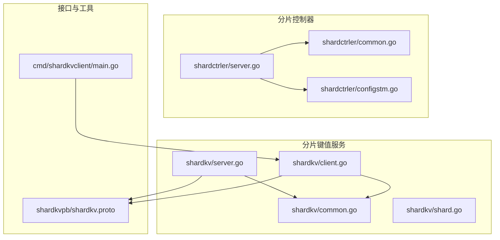
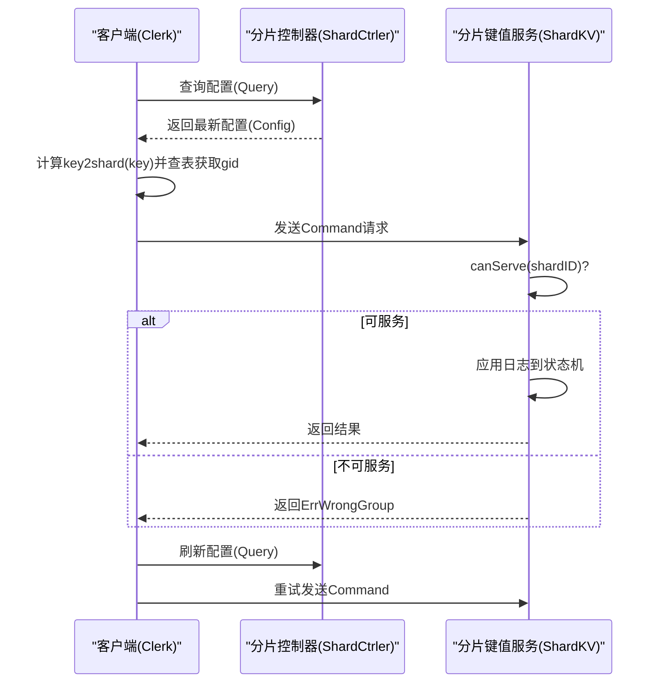
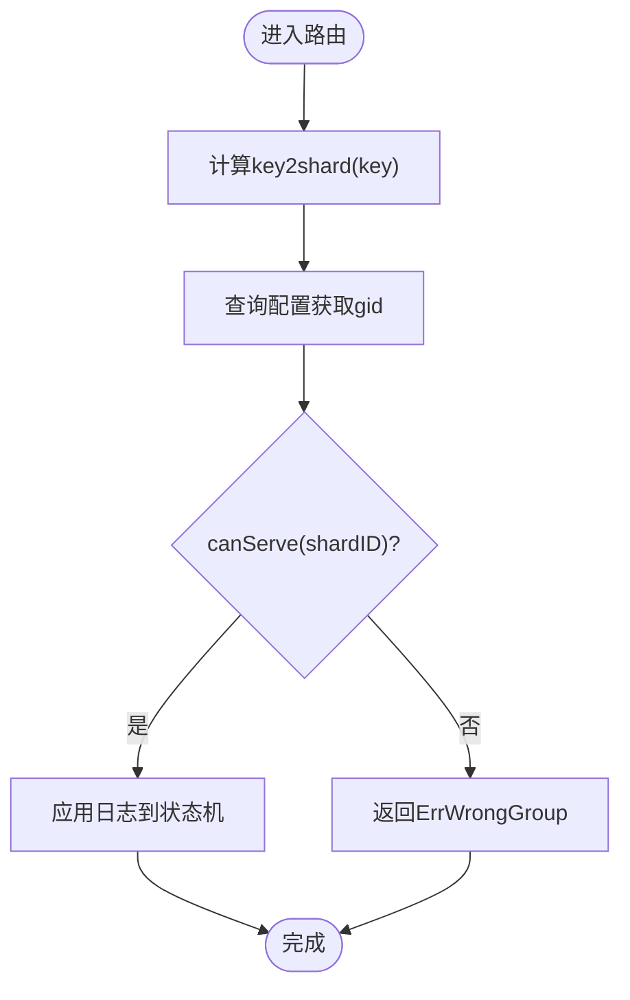
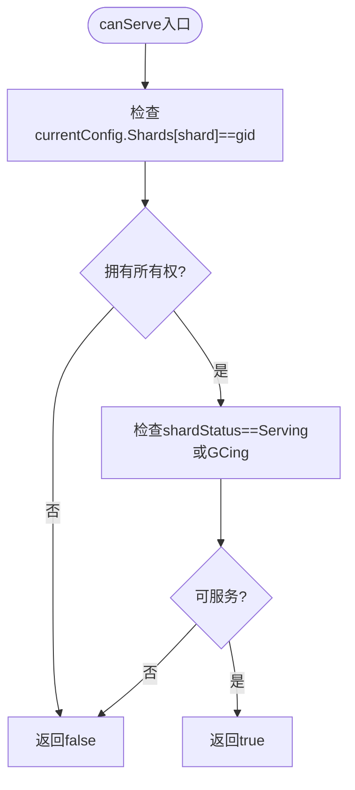
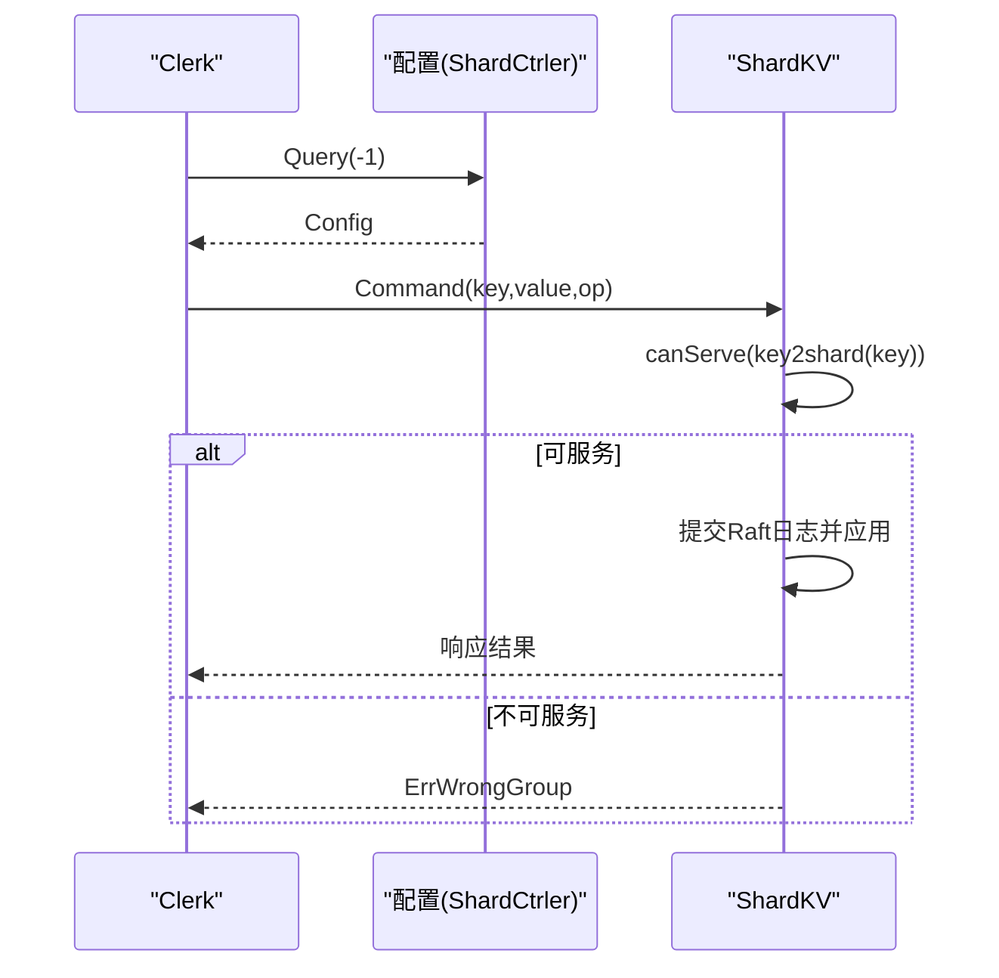
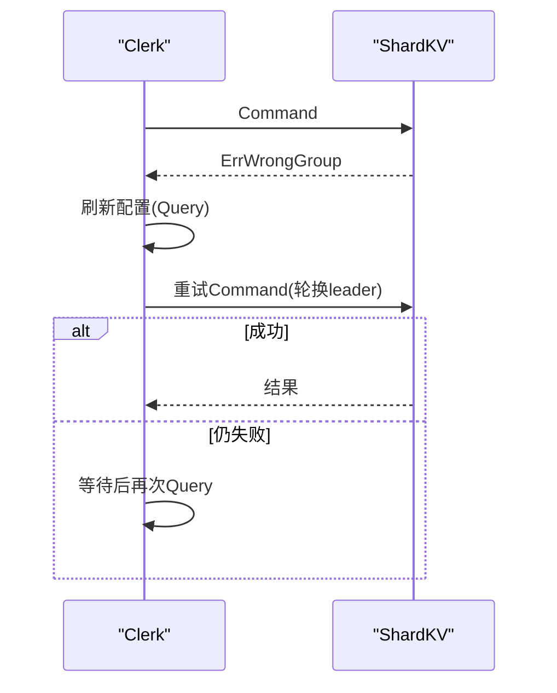
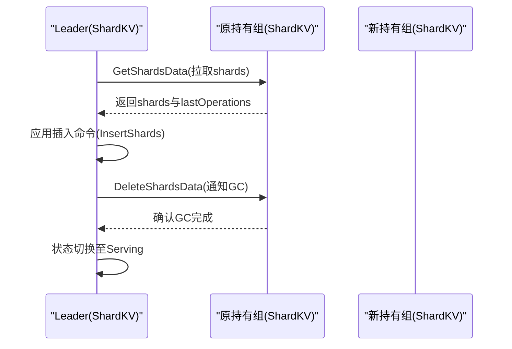
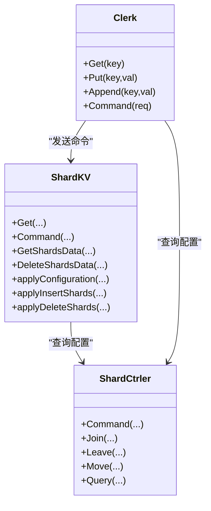

# 数据路由策略

<cite>
**本文引用的文件列表**
- [shardkv/server.go](file://shardkv/server.go)
- [shardkv/client.go](file://shardkv/client.go)
- [shardkv/common.go](file://shardkv/common.go)
- [shardkv/shard.go](file://shardkv/shard.go)
- [shardctrler/server.go](file://shardctrler/server.go)
- [shardctrler/common.go](file://shardctrler/common.go)
- [shardctrler/configstm.go](file://shardctrler/configstm.go)
- [shardkvpb/shardkv.proto](file://shardkvpb/shardkv.proto)
- [cmd/shardkvclient/main.go](file://cmd/shardkvclient/main.go)
</cite>

## 目录
1. [简介](#简介)
2. [项目结构](#项目结构)
3. [核心组件](#核心组件)
4. [架构总览](#架构总览)
5. [详细组件分析](#详细组件分析)
6. [依赖关系分析](#依赖关系分析)
7. [性能考量](#性能考量)
8. [故障排查指南](#故障排查指南)
9. [结论](#结论)
10. [附录](#附录)

## 简介
本文件围绕分片键值存储系统的“数据路由策略”进行深入技术说明，重点覆盖以下主题：
- 键到分片的映射算法与路由决策
- canServe 方法的实现逻辑与路由控制
- 数据访问路径、分片查找流程与路由优化策略
- ErrWrongGroup 错误的成因与客户端重试机制
- 路由缓存策略、热点分片处理与路由表更新机制
- 跨分片事务处理与路由一致性保证
- 路由性能优化技巧与常见问题诊断方法

## 项目结构
本项目采用按功能模块划分的组织方式，核心模块包括：
- shardkv：分片键值服务（含分片状态机、Raft 集成、迁移与 GC）
- shardctrler：分片控制器（负责配置管理与负载均衡）
- shardkvpb：gRPC 接口定义
- cmd/shardkvclient：命令行客户端示例
- 其他通用模块（raft、labrpc 等）

图表来源
- [shardkv/server.go](file://shardkv/server.go#L760-L799)
- [shardkv/client.go](file://shardkv/client.go#L165-L188)
- [shardctrler/server.go](file://shardctrler/server.go#L324-L343)
- [shardkvpb/shardkv.proto](file://shardkvpb/shardkv.proto#L60-L66)

章节来源
- [shardkv/server.go](file://shardkv/server.go#L760-L799)
- [shardkv/client.go](file://shardkv/client.go#L165-L188)
- [shardctrler/server.go](file://shardctrler/server.go#L324-L343)

## 核心组件
- 分片控制器（ShardCtrler）：维护配置（Config），提供 Join/Leave/Move/Query 操作，负责分片到组的映射与负载均衡。
- 分片键值服务（ShardKV）：基于 Raft 的状态机，维护当前/上一配置、分片状态（Serving/Pulling/BePulling/GCing）、本地存储与迁移任务。
- 客户端（Clerk）：根据当前配置将请求路由到正确的组，处理 ErrWrongGroup 并触发重试与配置刷新。
- gRPC 接口（shardkvpb）：定义 Command、GetShardsData、DeleteShardsData、GetStatus 等 RPC。

章节来源
- [shardctrler/server.go](file://shardctrler/server.go#L17-L26)
- [shardkv/server.go](file://shardkv/server.go#L76-L99)
- [shardkv/client.go](file://shardkv/client.go#L151-L159)
- [shardkvpb/shardkv.proto](file://shardkvpb/shardkv.proto#L13-L65)

## 架构总览
下图展示了从客户端到分片控制器再到分片键值服务的数据流与路由决策点。

图表来源
- [shardkv/client.go](file://shardkv/client.go#L206-L265)
- [shardkv/server.go](file://shardkv/server.go#L110-L127)
- [shardctrler/server.go](file://shardctrler/server.go#L153-L159)

## 详细组件分析

### 键到分片映射与路由决策
- 映射算法：key2shard 将 key 的首字节作为基础索引，再对分片总数取模，得到 shardID。
- 路由决策：客户端根据当前配置查询 gid；服务端在处理前调用 canServe 判断是否对该 shard 有所有权且处于可服务状态。

图表来源
- [shardkv/client.go](file://shardkv/client.go#L29-L36)
- [shardkv/server.go](file://shardkv/server.go#L226-L230)

章节来源
- [shardkv/client.go](file://shardkv/client.go#L29-L36)
- [shardkv/server.go](file://shardkv/server.go#L226-L230)

### canServe 方法与路由控制
- 作用：判断当前组是否拥有某 shard 的所有权且处于可服务状态（Serving 或 GCing）。
- 实现要点：仅当 currentConfig 中该 shard 对应 gid 等于当前组 gid，且 shardStatus 为 Serving 或 GCing 时才允许服务。

图表来源
- [shardkv/server.go](file://shardkv/server.go#L226-L230)

章节来源
- [shardkv/server.go](file://shardkv/server.go#L226-L230)

### 数据访问路径与分片查找流程
- 客户端侧：先查询配置，计算 key2shard，定位 gid 与服务器列表，向 leader 发送请求。
- 服务端侧：在 Get/Command 处理前先 canServe，若不可服务则直接返回 ErrWrongGroup；否则提交到 Raft 并应用到状态机。

图表来源
- [shardkv/client.go](file://shardkv/client.go#L206-L265)
- [shardkv/server.go](file://shardkv/server.go#L110-L127)

章节来源
- [shardkv/client.go](file://shardkv/client.go#L206-L265)
- [shardkv/server.go](file://shardkv/server.go#L110-L127)

### ErrWrongGroup 错误与客户端重试机制
- 成因：服务端发现请求的 key 所属 shard 当前不属于本组，或状态不处于可服务。
- 客户端处理：收到 ErrWrongGroup 后刷新配置并重试；在同组内轮换 leader；若遍历完仍失败则等待一段时间后再次查询配置。

图表来源
- [shardkv/client.go](file://shardkv/client.go#L246-L264)
- [shardkv/server.go](file://shardkv/server.go#L119-L124)

章节来源
- [shardkv/client.go](file://shardkv/client.go#L246-L264)
- [shardkv/server.go](file://shardkv/server.go#L119-L124)

### 路由缓存策略、热点分片处理与路由表更新
- 路由缓存：客户端在单次请求周期内复用已解析的 gid 与服务器列表，避免重复查询配置。
- 热点分片：通过配置控制器的负载均衡策略（最小化最大值差）尽量均匀分配分片，减少热点。
- 路由表更新：服务端周期性轮询配置控制器，发现新配置后提交配置命令到 Raft，应用后更新 currentConfig 与 shardStatus。

章节来源
- [shardkv/client.go](file://shardkv/client.go#L210-L230)
- [shardkv/server.go](file://shardkv/server.go#L549-L570)
- [shardctrler/configstm.go](file://shardctrler/configstm.go#L26-L53)

### 迁移与 GC 流程（Pulling/GCing）
- 状态机：服务端维护每个分片的状态（Serving/Pulling/BePulling/GCing），用于协调迁移与清理。
- 迁移动作：当发现新配置使本组成为某 shard 新所有者时，状态切换为 Pulling，发起 GetShardsData 拉取数据，应用后置为 GCing。
- 清理动作：确认迁移后，向原持有组发起 DeleteShardsData 请求，随后本地将状态置为 Serving。

图表来源
- [shardkv/server.go](file://shardkv/server.go#L572-L643)
- [shardkv/server.go](file://shardkv/server.go#L645-L696)
- [shardkv/server.go](file://shardkv/server.go#L360-L383)

章节来源
- [shardkv/server.go](file://shardkv/server.go#L572-L643)
- [shardkv/server.go](file://shardkv/server.go#L645-L696)
- [shardkv/server.go](file://shardkv/server.go#L360-L383)

### 跨分片事务处理与路由一致性保证
- 一致性模型：系统基于 Raft 保证每组内的线性一致；跨分片事务不在本仓库的单体实现范围内，需在上层业务或客户端侧设计两阶段提交等协议。
- 路由一致性：通过配置控制器的有序配置变更与服务端的配置命令应用，确保各组在相同时间点对同一 shard 的归属达成一致。

章节来源
- [shardctrler/server.go](file://shardctrler/server.go#L250-L264)
- [shardkv/server.go](file://shardkv/server.go#L348-L358)

## 依赖关系分析
- 客户端依赖配置控制器查询最新路由表；服务端依赖 Raft 与本地存储；迁移与 GC 通过 gRPC 在组间交互。
- 关键类型与接口：Command/CommandRequest/CommandResponse、ShardOperationRequest/ShardOperationResponse、Err/WrongGroup 等。

图表来源
- [shardkv/server.go](file://shardkv/server.go#L110-L127)
- [shardkv/client.go](file://shardkv/client.go#L194-L204)
- [shardctrler/server.go](file://shardctrler/server.go#L179-L215)

章节来源
- [shardkv/server.go](file://shardkv/server.go#L110-L127)
- [shardkv/client.go](file://shardkv/client.go#L194-L204)
- [shardctrler/server.go](file://shardctrler/server.go#L179-L215)

## 性能考量
- 路由开销：key2shard 与配置查询均为常数级；建议客户端在一次请求周期内复用 gid 与 leader 选择结果。
- 并发与吞吐：服务端在提交 Raft 日志时不持锁，通过通知通道异步唤醒响应，降低阻塞。
- 迁移成本：Pulling/GCing 阶段涉及网络传输与批量写入，建议合理设置监控间隔与批处理大小。
- 超时与重试：客户端对单次请求设置超时，遇到 ErrWrongGroup 时快速刷新配置并轮换 leader，避免长时间阻塞。

章节来源
- [shardkv/common.go](file://shardkv/common.go#L21-L27)
- [shardkv/client.go](file://shardkv/client.go#L242-L258)
- [shardkv/server.go](file://shardkv/server.go#L129-L157)

## 故障排查指南
- ErrWrongGroup 高频出现
  - 现象：客户端反复收到 ErrWrongGroup 并不断刷新配置。
  - 排查：确认配置控制器是否频繁变更；检查服务端 canServe 判定条件是否正确；验证迁移流程是否卡在 Pulling/GCing。
- 超时与无响应
  - 现象：客户端请求超时或服务端未返回。
  - 排查：检查 ExecuteTimeout 设置；确认服务端 applier 是否正常运行；查看 Raft 日志提交与应用进度。
- 迁移失败或数据不一致
  - 现象：Pulling 完成但 GC 未触发，或 GC 后仍有残留数据。
  - 排查：核对 InsertShards/ApplyDeleteShards 的状态转换；检查 gRPC 连接与序列化；确认配置号匹配。

章节来源
- [shardkv/client.go](file://shardkv/client.go#L246-L264)
- [shardkv/server.go](file://shardkv/server.go#L144-L149)
- [shardkv/server.go](file://shardkv/server.go#L360-L404)

## 结论
本路由策略以“配置驱动 + 状态机协同”的方式实现了稳定的键到分片路由与跨组迁移。通过 canServe 的严格判定、ErrWrongGroup 的重试机制以及周期性的配置轮询，系统在动态拓扑变化下保持一致性与可用性。结合合理的缓存与迁移策略，可在高并发场景下获得良好的吞吐与延迟表现。

## 附录
- 命令行客户端示例：支持 get/put/append/status/bench 等命令，便于性能测试与状态观测。

章节来源
- [cmd/shardkvclient/main.go](file://cmd/shardkvclient/main.go#L14-L106)