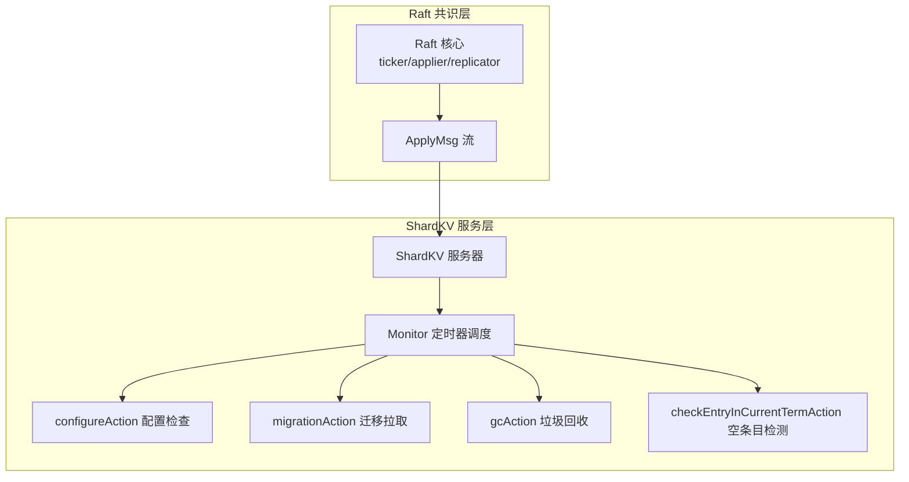
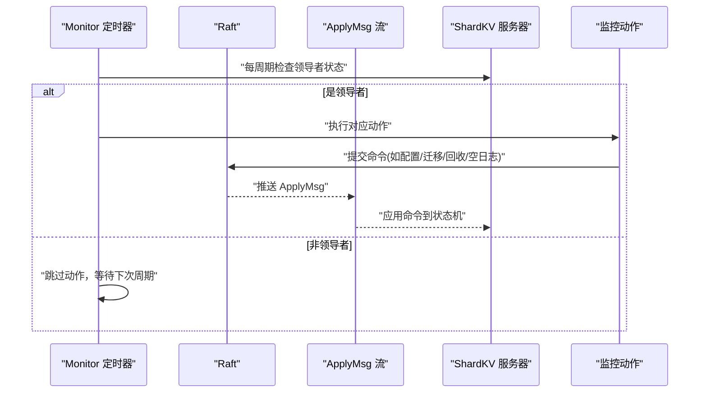
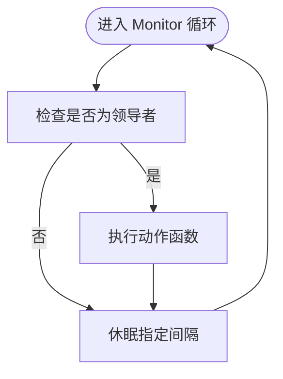
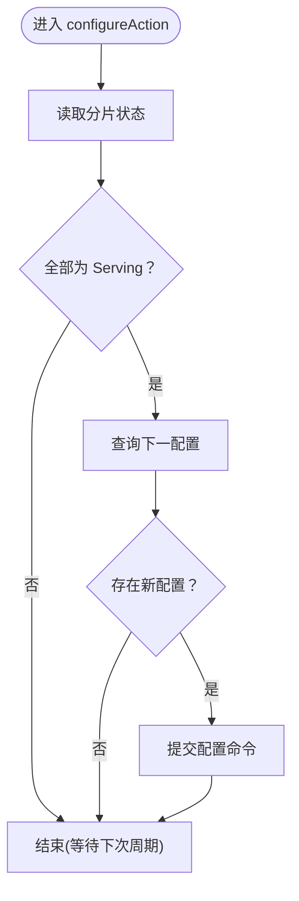
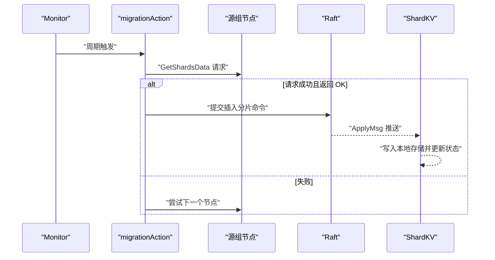
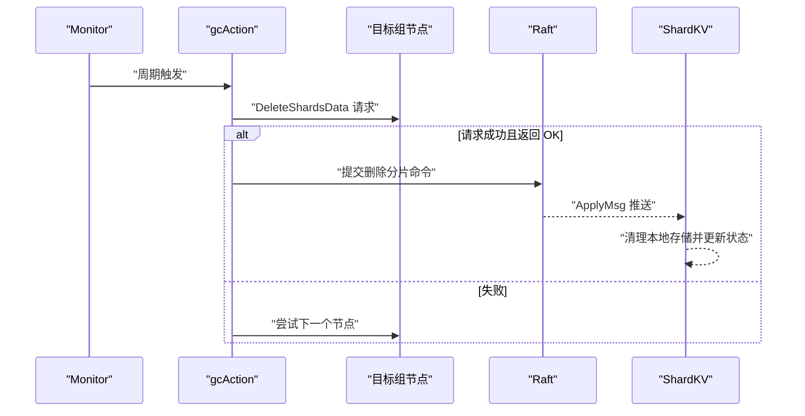
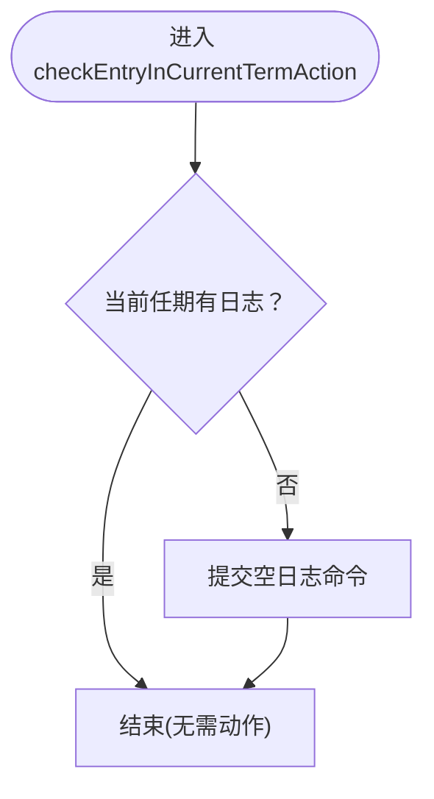
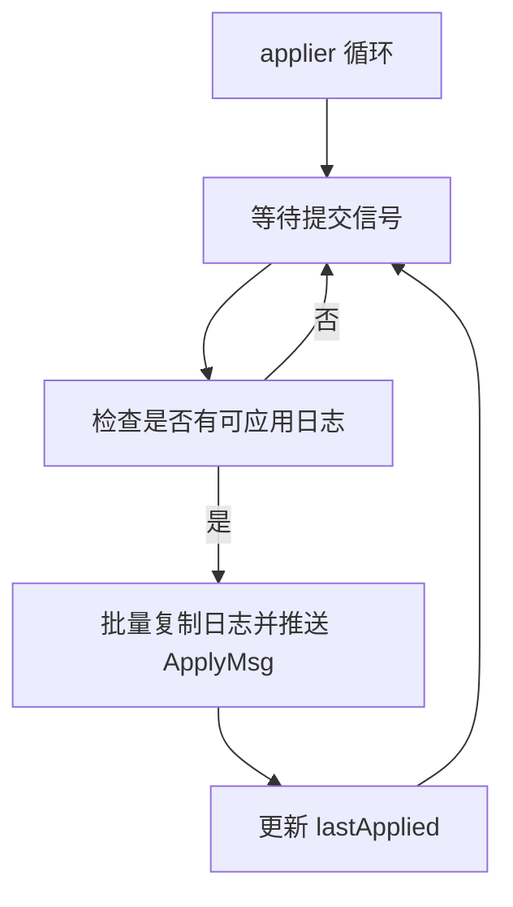
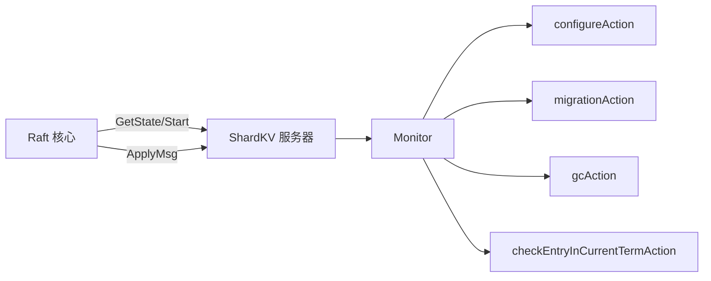

# 监控任务调度

**本文档引用的文件**
- [raft.go](file://raft/raft.go)
- [util.go](file://raft/util.go)
- [config.go](file://raft/config.go)
- [server.go](file://shardkv/server.go)
- [common.go](file://shardkv/common.go)

## 目录
1. [简介](#简介)
2. [项目结构](#项目结构)
3. [核心组件](#核心组件)
4. [架构总览](#架构总览)
5. [详细组件分析](#详细组件分析)
6. [依赖关系分析](#依赖关系分析)
7. [性能考虑](#性能考虑)
8. [故障排查指南](#故障排查指南)
9. [结论](#结论)

## 简介
本文件聚焦于监控任务调度的设计与实现，围绕以下目标展开：  
- 深入解释 Monitor 方法的实现原理、定时任务调度机制与任务执行策略  
- 详细分析 configureAction、migrationAction、gcAction 与 checkEntryInCurrentTermAction 的功能与触发条件  
- 解释任务超时控制、任务并发执行与任务优先级管理  
- 提供任务执行状态监控、失败处理与重试机制  
- 给出性能调优、资源消耗控制与调度优化建议，并覆盖错误处理与异常恢复策略  

## 项目结构
该仓库采用分层模块化组织，Raft 共识层位于 raft 子目录，分片键值存储服务位于 shardkv 子目录。监控任务调度主要在 shardkv 的服务器端实现，通过 Raft 的 ApplyMsg 流水线将命令应用到状态机。

图表来源
- [raft.go](file://raft/raft.go#L616-L635)
- [raft.go](file://raft/raft.go#L638-L664)
- [server.go](file://shardkv/server.go#L724-L731)
- [server.go](file://shardkv/server.go#L548-L570)
- [server.go](file://shardkv/server.go#L571-L643)
- [server.go](file://shardkv/server.go#L644-L696)
- [server.go](file://shardkv/server.go#L718-L722)

章节来源
- [raft.go](file://raft/raft.go#L616-L635)
- [raft.go](file://raft/raft.go#L638-L664)
- [server.go](file://shardkv/server.go#L724-L731)
- [server.go](file://shardkv/server.go#L548-L570)
- [server.go](file://shardkv/server.go#L571-L643)
- [server.go](file://shardkv/server.go#L644-L696)
- [server.go](file://shardkv/server.go#L718-L722)

## 核心组件
- Monitor 定时器调度器：基于时间间隔循环执行传入动作，仅在领导者状态下运行，避免非领导者节点产生无意义工作负载。
- 四类监控动作：
  - configureAction：当所有分片均处于服务状态时，尝试从配置控制器查询下一配置并提交配置更新日志。
  - migrationAction：对处于“拉取中”状态的分片，向源组发起数据拉取请求，成功后提交插入分片数据的日志。
  - gcAction：对处于“待回收”状态的分片，先在远端组删除对应分片数据，再在本地提交删除分片日志。
  - checkEntryInCurrentTermAction：若当前任期内未有新日志，追加一条空日志以推进提交进度，避免活锁。
- Raft 应用流水线：applier 负责从已提交日志批量推送 ApplyMsg 到服务层，确保每个日志仅应用一次。

章节来源
- [server.go](file://shardkv/server.go#L724-L731)
- [server.go](file://shardkv/server.go#L548-L570)
- [server.go](file://shardkv/server.go#L571-L643)
- [server.go](file://shardkv/server.go#L644-L696)
- [server.go](file://shardkv/server.go#L718-L722)
- [raft.go](file://raft/raft.go#L638-L664)

## 架构总览
下图展示从 Raft 到 ShardKV 的监控任务调度路径，以及各监控动作的触发条件与执行流程。

图表来源
- [server.go](file://shardkv/server.go#L724-L731)
- [raft.go](file://raft/raft.go#L638-L664)
- [server.go](file://shardkv/server.go#L548-L570)
- [server.go](file://shardkv/server.go#L571-L643)
- [server.go](file://shardkv/server.go#L644-L696)
- [server.go](file://shardkv/server.go#L718-L722)

## 详细组件分析

### Monitor 定时器调度器
- 实现要点
  - 循环检查领导者状态；仅在领导者状态下执行动作。
  - 使用固定休眠间隔驱动下一轮执行，形成“周期性轮询 + 条件执行”的调度模型。
  - 通过 goroutine 并行启动多个 Monitor 实例，分别负责不同动作。
- 关键行为
  - 保证非领导者节点不执行任何动作，降低无效开销。
  - 通过统一的休眠间隔实现“粗粒度”时间控制，便于统一调参。

图表来源
- [server.go](file://shardkv/server.go#L724-L731)

章节来源
- [server.go](file://shardkv/server.go#L724-L731)

### configureAction 动作
- 功能概述
  - 当所有分片均处于“服务中”状态时，查询下一配置编号并提交配置更新日志。
- 触发条件
  - 所有分片状态均为 Serving。
  - 由 Monitor 以配置监控间隔周期性触发。
- 执行策略
  - 读取当前配置号，向配置控制器查询下一个配置。
  - 若存在可应用的新配置，则封装为配置命令并通过 Raft 提交。

图表来源
- [server.go](file://shardkv/server.go#L548-L570)

章节来源
- [server.go](file://shardkv/server.go#L548-L570)

### migrationAction 动作
- 功能概述
  - 对处于“拉取中”的分片，向源组发起数据拉取请求；成功后提交插入分片数据的日志。
- 触发条件
  - 存在处于 Pulling 状态的分片。
  - 由 Monitor 以迁移监控间隔周期性触发。
- 并发策略
  - 对每个源组的分片集合使用 goroutine 并行拉取，提升吞吐。
  - 使用 WaitGroup 等待所有并行任务完成后再返回。
- 失败处理
  - 单个源节点失败会继续尝试其他节点，直至成功或耗尽重试。
  - 成功后将远端响应转换为内部结构并提交插入日志。

图表来源
- [server.go](file://shardkv/server.go#L571-L643)

章节来源
- [server.go](file://shardkv/server.go#L571-L643)

### gcAction 动作
- 功能概述
  - 对处于“待回收”状态的分片，先在远端组删除对应分片数据，再在本地提交删除分片日志。
- 触发条件
  - 存在处于 GCing 状态的分片。
  - 由 Monitor 以垃圾回收监控间隔周期性触发。
- 并发策略
  - 对每个目标组的分片集合使用 goroutine 并行删除，提升吞吐。
  - 使用 WaitGroup 等待所有并行任务完成后再返回。
- 失败处理
  - 单个目标节点失败会继续尝试其他节点，直至成功或耗尽重试。
  - 成功后在本地提交删除分片命令，确保一致性。

图表来源
- [server.go](file://shardkv/server.go#L644-L696)

章节来源
- [server.go](file://shardkv/server.go#L644-L696)

### checkEntryInCurrentTermAction 动作
- 功能概述
  - 若当前任期内未发现任何日志，追加一条空日志，以推进提交进度，避免活锁。
- 触发条件
  - Raft 层检测到当前任期无新增日志。
  - 由 Monitor 以空条目检测间隔周期性触发。
- 执行策略
  - 通过 Raft 的 Start 提交一条空操作日志，从而唤醒提交与应用流程。

图表来源
- [server.go](file://shardkv/server.go#L718-L722)

章节来源
- [server.go](file://shardkv/server.go#L718-L722)

### Raft 应用流水线（applier）
- 职责
  - 在领导者提交后，按序从已提交日志批量生成 ApplyMsg 并推送到服务层。
  - 使用条件变量在没有可应用日志时让出 CPU，避免忙等。
- 并发与一致性
  - 保证每个日志仅被应用一次，避免重复执行。
  - 通过 lastApplied 与 commitIndex 的配合，确保顺序与原子性。

图表来源
- [raft.go](file://raft/raft.go#L638-L664)

章节来源
- [raft.go](file://raft/raft.go#L638-L664)

## 依赖关系分析
- ShardKV 服务器依赖 Raft 提供的领导者状态查询、日志提交与 ApplyMsg 推送能力。
- Monitor 依赖 Raft 的领导者判定与日志提交接口，以保证动作只在领导者上执行。
- 各监控动作通过 Raft 提交命令，最终由 applier 推送 ApplyMsg，驱动状态机更新。

图表来源
- [raft.go](file://raft/raft.go#L616-L635)
- [raft.go](file://raft/raft.go#L638-L664)
- [server.go](file://shardkv/server.go#L724-L731)
- [server.go](file://shardkv/server.go#L548-L570)
- [server.go](file://shardkv/server.go#L571-L643)
- [server.go](file://shardkv/server.go#L644-L696)
- [server.go](file://shardkv/server.go#L718-L722)

章节来源
- [raft.go](file://raft/raft.go#L616-L635)
- [raft.go](file://raft/raft.go#L638-L664)
- [server.go](file://shardkv/server.go#L724-L731)
- [server.go](file://shardkv/server.go#L548-L570)
- [server.go](file://shardkv/server.go#L571-L643)
- [server.go](file://shardkv/server.go#L644-L696)
- [server.go](file://shardkv/server.go#L718-L722)

## 性能考虑
- 任务超时控制
  - Monitor 采用固定休眠间隔，统一了各动作的触发节奏，避免频繁检查带来的 CPU 开销。
  - 各动作内部的网络请求未显式设置超时，建议在实际部署中为 gRPC/HTTP 请求增加合理超时与重试上限，防止阻塞。
- 任务并发执行
  - migrationAction 与 gcAction 对每个源组/目标组内的分片集合使用 goroutine 并行处理，显著提升吞吐。
  - 建议根据集群规模与网络状况调整并行度，避免过度并发导致拥塞。
- 任务优先级管理
  - 当前实现未显式区分动作优先级；可通过引入队列或令牌桶机制实现动态优先级调度。
- 资源消耗控制
  - Monitor 循环在非领导者状态下直接休眠，避免不必要的系统调用与内存占用。
  - 建议限制单次迁移/回收的分片数量，结合背压策略防止瞬时峰值。
- 调度优化
  - 可将 Monitor 的休眠间隔参数化并支持动态调整，依据集群健康状态自适应。
  - 对频繁失败的动作可引入退避策略（指数退避）降低重试频率。

## 故障排查指南
- 任务未执行
  - 检查领导者状态：Monitor 仅在领导者状态下执行动作。
  - 检查 Monitor 循环是否仍在运行（未被杀死）。
- 迁移/回收失败
  - 检查源/目标节点可达性与认证配置。
  - 查看动作内部的错误分支与返回码映射，定位具体失败原因。
- 提交停滞
  - 检查 checkEntryInCurrentTermAction 是否正常触发并提交空日志。
  - 确认 Raft 的 applier 正常运行，ApplyMsg 能够及时推送。
- 日志膨胀
  - 结合 Raft 的快照与日志裁剪策略，避免日志无限增长。
  - 监控 Raft 状态大小与快照触发频率。

章节来源
- [server.go](file://shardkv/server.go#L724-L731)
- [server.go](file://shardkv/server.go#L548-L570)
- [server.go](file://shardkv/server.go#L571-L643)
- [server.go](file://shardkv/server.go#L644-L696)
- [server.go](file://shardkv/server.go#L718-L722)
- [raft.go](file://raft/raft.go#L638-L664)

## 结论
该监控任务调度方案以 Monitor 为核心，通过固定周期与领导者状态约束，实现了对配置变更、分片迁移、垃圾回收与空日志推进的自动化管理。配合 Raft 的应用流水线，保证了动作执行的一致性与顺序性。为进一步增强鲁棒性与性能，建议引入请求超时、重试上限、动态优先级与自适应调度策略，并对关键路径进行可观测性埋点与告警。