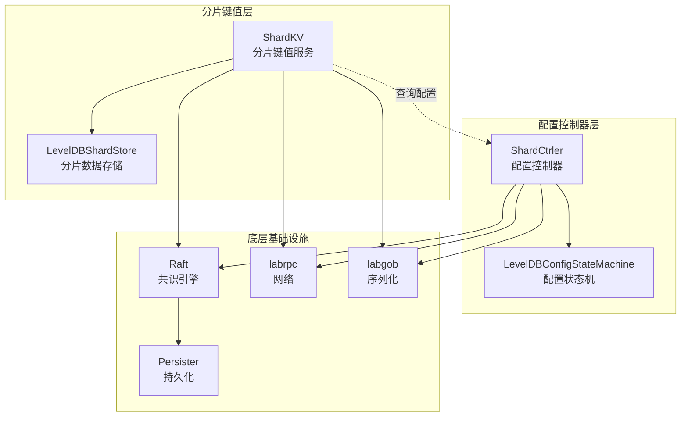
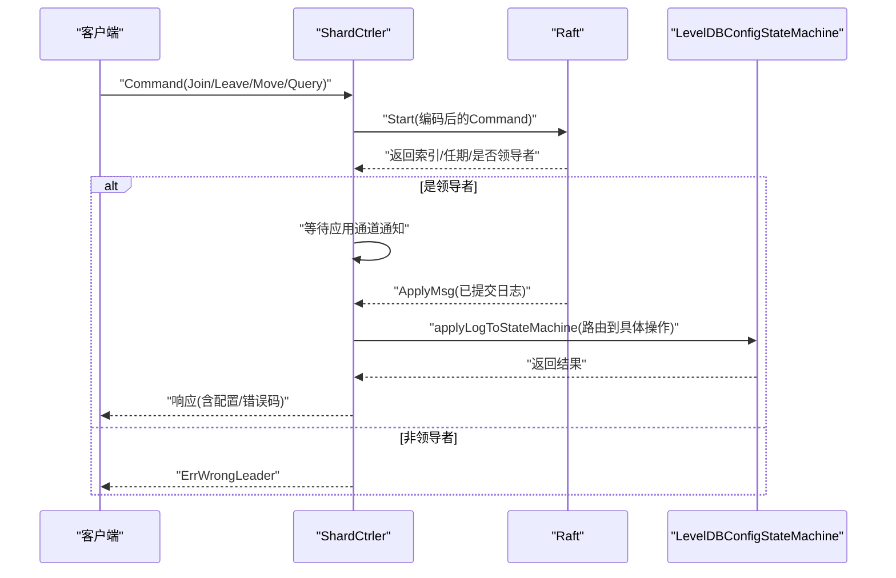
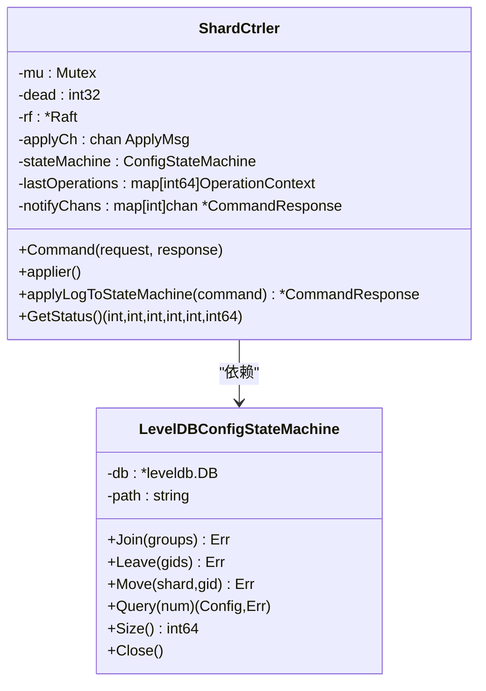
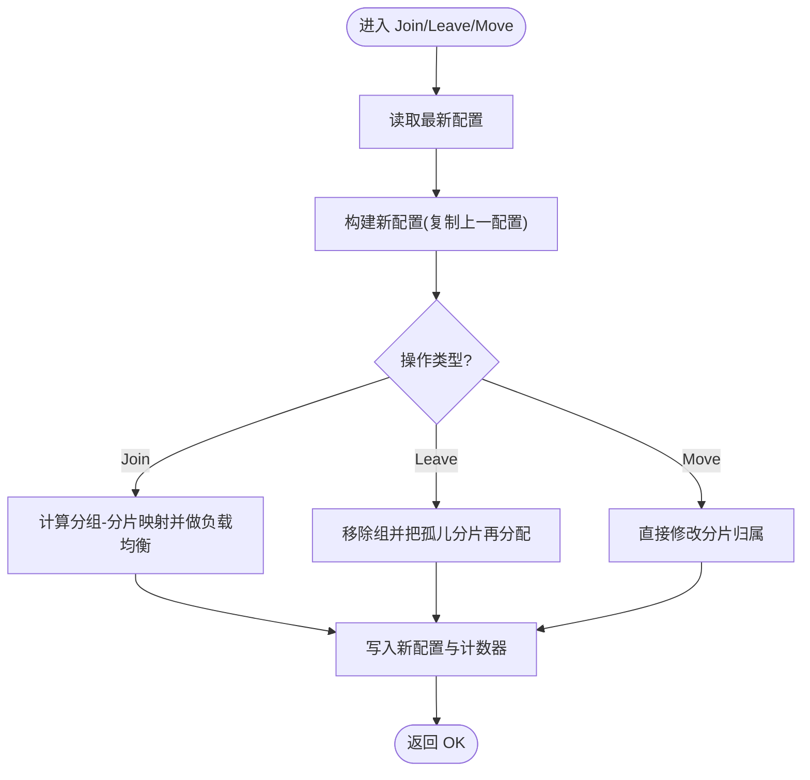
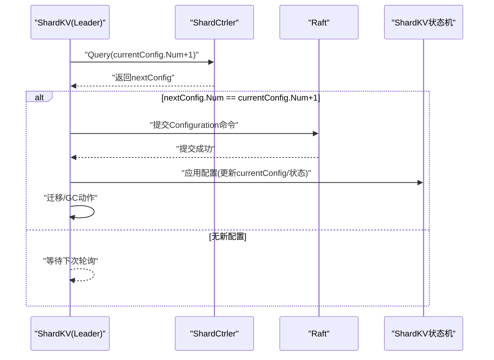
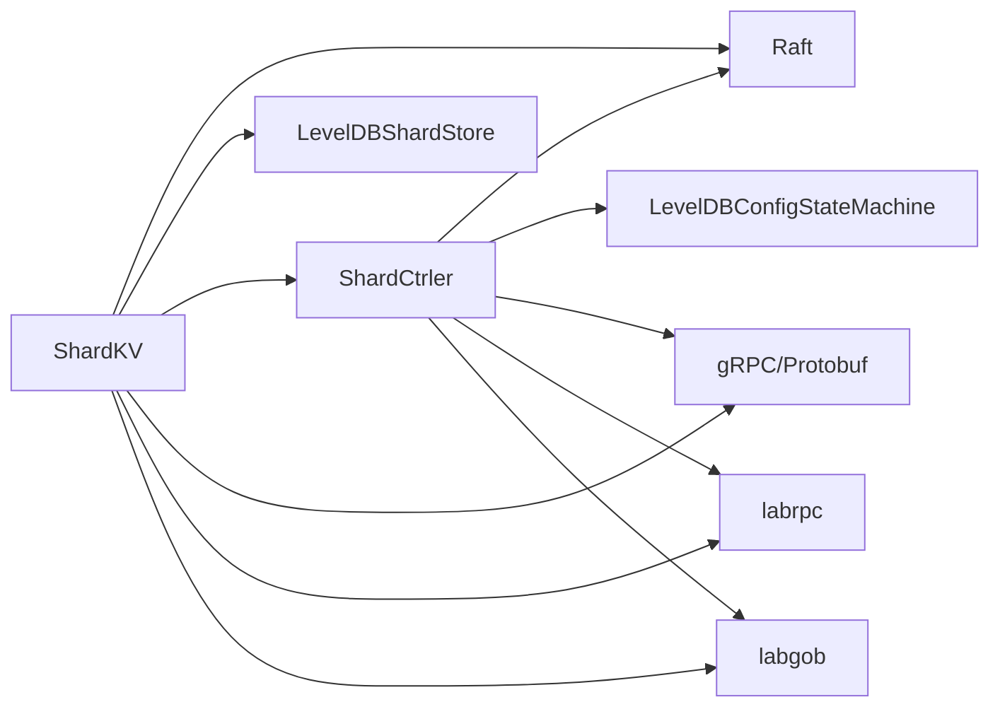

# 配置管理

<cite>
**本文引用的文件**
- [shardctrler/server.go](file://shardctrler/server.go)
- [shardctrler/configstm.go](file://shardctrler/configstm.go)
- [shardctrler/common.go](file://shardctrler/common.go)
- [shardctrler/grpc_server.go](file://shardctrler/grpc_server.go)
- [shardctrler/client.go](file://shardctrler/client.go)
- [shardkv/server.go](file://shardkv/server.go)
- [shardkv/common.go](file://shardkv/common.go)
- [shardkv/config.go](file://shardkv/config.go)
- [raft/raft.go](file://raft/raft.go)
- [raft/persister.go](file://raft/persister.go)
- [raft/rpc.go](file://raft/rpc.go)
- [raft/util.go](file://raft/util.go)
- [raft/grp_client.go](file://raft/grp_client.go)
- [raft/grp_server.go](file://raft/grp_server.go)
- [labrpc/labrpc.go](file://labrpc/labrpc.go)
- [labgob/labgob.go](file://labgob/labgob.go)
- [shardctrlerpb/shardctrler.pb.go](file://shardctrlerpb/shardctrler.pb.go)
- [shardctrlerpb/shardctrler_grpc.pb.go](file://shardctrlerpb/shardctrler_grpc.pb.go)
- [shardkvpb/shardkv.pb.go](file://shardkvpb/shardkv.pb.go)
- [shardkvpb/shardkv_grpc.pb.go](file://shardkvpb/shardkv_grpc.pb.go)
- [README.md](file://README.md)
- [README_cn.md](file://README_cn.md)
</cite>

## 目录
1. [简介](#简介)
2. [项目结构](#项目结构)
3. [核心组件](#核心组件)
4. [架构总览](#架构总览)
5. [详细组件分析](#详细组件分析)
6. [依赖分析](#依赖分析)
7. [性能考量](#性能考量)
8. [故障排查指南](#故障排查指南)
9. [结论](#结论)
10. [附录](#附录)

## 简介
本文件聚焦于配置管理子系统，围绕分片配置控制器（shardctrler）与分片键值服务（shardkv）之间的配置协作展开，系统性阐述以下主题：
- 配置控制器的作用与职责
- 配置版本管理与一致性保障
- Join、Leave、Move、Query 操作的实现原理与配置变更流程
- 配置状态机的实现与持久化
- 配置传播机制与跨节点一致性
- 冲突检测、回滚与恢复策略
- 最佳实践、影响分析与监控方法
- 高可用性设计与持久化存储

## 项目结构
本项目采用按功能域划分的模块化组织方式，配置管理相关的核心目录与文件如下：
- shardctrler：配置控制器，负责维护全局分片配置，提供 Join/Leave/Move/Query 接口，并通过 Raft 实现日志复制与状态机更新。
- shardkv：分片键值服务，周期性从配置控制器查询最新配置，基于配置进行分片迁移与垃圾回收，确保数据一致性。
- raft：通用 Raft 实现，提供日志复制、领导者选举、快照与持久化等能力。
- shardctrlerpb/shardkvpb：gRPC 定义与生成代码，用于客户端与服务端通信。
- labrpc/labgob：网络与序列化工具，支撑 RPC 与状态持久化。

**图表来源**
- [shardctrler/server.go](file://shardctrler/server.go#L17-L343)
- [shardkv/server.go](file://shardkv/server.go#L76-L799)
- [raft/raft.go](file://raft/raft.go)
- [raft/persister.go](file://raft/persister.go)
- [labrpc/labrpc.go](file://labrpc/labrpc.go)
- [labgob/labgob.go](file://labgob/labgob.go)

**章节来源**
- [shardctrler/server.go](file://shardctrler/server.go#L1-L344)
- [shardkv/server.go](file://shardkv/server.go#L1-L800)
- [raft/raft.go](file://raft/raft.go)
- [raft/persister.go](file://raft/persister.go)
- [labrpc/labrpc.go](file://labrpc/labrpc.go)
- [labgob/labgob.go](file://labgob/labgob.go)

## 核心组件
- 配置控制器（ShardCtrler）
  - 职责：接收客户端请求，通过 Raft 复制命令日志，驱动配置状态机更新，提供查询接口。
  - 关键字段：Raft 实例、应用通道、配置状态机、去重上下文、通知通道。
  - 关键方法：Command（处理请求）、applier（应用日志到状态机）、applyLogToStateMachine（路由到具体操作）。
- 配置状态机（LevelDBConfigStateMachine）
  - 职责：在 LevelDB 中持久化配置历史，支持 Join/Leave/Move/Query。
  - 关键方法：Join/Leave/Move/Query、保存配置、读取最新配置、统计存储大小。
- 分片键值服务（ShardKV）
  - 职责：根据配置决定是否可服务某分片；周期性检查最新配置并触发迁移；在迁移过程中维护分片状态机（Pulling/BePulling/GCing/Serving）。
  - 关键方法：configureAction（查询并提交新配置）、migrationAction（拉取数据）、gcAction（远程删除并本地GC）、applier（应用配置/插入/删除/空条目）。
- Raft 与持久化
  - Raft 提供日志复制与领导者一致性；Persister 负责持久化状态与快照；应用通道将已提交日志传递给上层状态机。
- 客户端与 gRPC
  - 客户端封装请求与重试；gRPC 服务端将 pb 请求转换为内部结构并调用控制器逻辑；GetStatus 支持运行态监控。

**章节来源**
- [shardctrler/server.go](file://shardctrler/server.go#L17-L343)
- [shardctrler/configstm.go](file://shardctrler/configstm.go#L1-L167)
- [shardkv/server.go](file://shardkv/server.go#L76-L799)
- [raft/raft.go](file://raft/raft.go)
- [raft/persister.go](file://raft/persister.go)
- [shardctrler/grpc_server.go](file://shardctrler/grpc_server.go#L1-L71)
- [shardctrler/client.go](file://shardctrler/client.go#L1-L215)

## 架构总览
配置管理采用“控制器 + 多副本状态机”的架构：
- 客户端通过 gRPC 或 labrpc 向配置控制器提交 Join/Leave/Move/Query 请求。
- 控制器将请求编码为命令并通过 Raft 复制到多数派节点，提交后由应用协程应用到配置状态机。
- 分片键值服务周期性查询最新配置，若发现新配置则提交配置命令到自身 Raft，随后进入迁移阶段：拉取新增分片数据、本地GC清理旧分片。
- 所有配置变更均以日志形式持久化，结合快照与持久化实现高可用与崩溃恢复。

**图表来源**
- [shardctrler/server.go](file://shardctrler/server.go#L179-L215)
- [shardctrler/server.go](file://shardctrler/server.go#L250-L264)
- [shardctrler/grpc_server.go](file://shardctrler/grpc_server.go#L18-L58)
- [shardctrlerpb/shardctrler_grpc.pb.go](file://shardctrlerpb/shardctrler_grpc.pb.go#L37-L53)

**章节来源**
- [shardctrler/server.go](file://shardctrler/server.go#L179-L343)
- [shardctrler/grpc_server.go](file://shardctrler/grpc_server.go#L1-L71)
- [shardctrlerpb/shardctrler.pb.go](file://shardctrlerpb/shardctrler.pb.go#L66-L419)

## 详细组件分析

### 配置控制器（ShardCtrler）
- 去重与通知
  - 使用客户端ID到最大已应用命令ID的映射避免重复执行；通过索引到通知通道映射异步通知客户端。
- 应用流程
  - 将请求编码为命令，交由 Raft Start 提交；在应用协程中解码命令并路由到状态机；仅在当前任期且为领导者时通知客户端。
- 状态机接口
  - 通过 ConfigStateMachine 抽象，支持内存与 LevelDB 两种实现；默认使用 LevelDB 实现以持久化配置历史。

**图表来源**
- [shardctrler/server.go](file://shardctrler/server.go#L17-L343)
- [shardctrler/configstm.go](file://shardctrler/configstm.go#L28-L167)

**章节来源**
- [shardctrler/server.go](file://shardctrler/server.go#L179-L343)
- [shardctrler/configstm.go](file://shardctrler/configstm.go#L1-L167)

### 配置状态机（LevelDBConfigStateMachine）
- Join/Leave/Move/Query 的实现
  - Join：复制上一配置，加入新组并做负载均衡（尽量平衡各组分片数量），生成新配置并持久化。
  - Leave：移除指定组，将孤儿分片重新分配至剩余组，保持负载均衡。
  - Move：直接修改单一分片归属，生成新配置并持久化。
  - Query：按编号返回配置，越界时返回最新配置。
- 持久化策略
  - 使用 LevelDB 存储配置对象与计数器，保证崩溃后可恢复；提供 Size 方法统计存储占用。

**图表来源**
- [shardctrler/configstm.go](file://shardctrler/configstm.go#L26-L151)
- [shardctrler/server.go](file://shardctrler/server.go#L46-L82)

**章节来源**
- [shardctrler/configstm.go](file://shardctrler/configstm.go#L26-L151)
- [shardctrler/server.go](file://shardctrler/server.go#L46-L82)

### 分片键值服务（ShardKV）
- 配置查询与提交
  - configureAction：当所有分片均处于 Serving 状态时，向配置控制器查询下一配置；若存在新配置，则提交配置命令到自身 Raft 并应用。
- 迁移与GC
  - migrationAction：对处于 Pulling 的分片，从原持有组拉取数据，提交插入命令；应用时将状态切换为 GCing。
  - gcAction：对处于 GCing 的分片，通知原持有组删除对应分片数据，本地再执行删除并切换为 Serving。
- 状态机与一致性
  - 维护分片状态数组（Serving/Pulling/BePulling/GCing），严格按配置号顺序应用，拒绝过期配置与重复操作；通过 lastApplied 防止回滚。

**图表来源**
- [shardkv/server.go](file://shardkv/server.go#L549-L570)
- [shardkv/server.go](file://shardkv/server.go#L347-L358)
- [shardkv/server.go](file://shardkv/server.go#L572-L643)
- [shardkv/server.go](file://shardkv/server.go#L645-L696)

**章节来源**
- [shardkv/server.go](file://shardkv/server.go#L549-L696)
- [shardkv/common.go](file://shardkv/common.go#L70-L130)

### 配置传播与一致性
- 配置传播
  - 配置控制器通过 Raft 将 Join/Leave/Move/Query 编码为日志条目复制到多数派节点；分片键值服务通过周期性查询与提交配置命令，形成最终一致的全局视图。
- 冲突检测与处理
  - 分片键值服务在应用配置时比较配置编号，拒绝过期配置；在应用插入/删除分片时校验状态机状态，避免重复执行。
- 回滚与恢复
  - 通过 lastApplied 与快照机制防止回滚；崩溃重启后从快照与日志恢复状态，确保配置与数据一致性。

**章节来源**
- [shardkv/server.go](file://shardkv/server.go#L247-L326)
- [shardkv/server.go](file://shardkv/server.go#L463-L516)
- [raft/persister.go](file://raft/persister.go)

### Join/Leave/Move/Query 操作详解
- Join
  - 控制器侧：复制上一配置，加入新组，做负载均衡，生成新配置并持久化。
  - 键值侧：查询到新配置后提交配置命令，触发迁移（Pulling）。
- Leave
  - 控制器侧：移除指定组，孤儿分片再分配，保持均衡。
  - 键值侧：触发GC（BePulling->GCing->Serving），并通知原持有组删除数据。
- Move
  - 控制器侧：直接修改单一分片归属，生成新配置并持久化。
  - 键值侧：按配置变更触发迁移与GC。
- Query
  - 控制器侧：按编号返回配置，越界返回最新配置。
  - 键值侧：作为迁移与GC的触发条件之一。

**章节来源**
- [shardctrler/configstm.go](file://shardctrler/configstm.go#L26-L151)
- [shardkv/server.go](file://shardkv/server.go#L549-L696)
- [shardctrler/common.go](file://shardctrler/common.go#L108-L141)

## 依赖分析
- 组件耦合
  - ShardCtrler 依赖 Raft 与 LevelDBConfigStateMachine；ShardKV 依赖 Raft、LevelDBShardStore 与 ShardCtrler 客户端。
- 外部依赖
  - gRPC 用于客户端与服务端通信；labrpc 用于测试环境；labgob 用于序列化；LevelDB 用于持久化。
- 循环依赖
  - 未见循环依赖；模块边界清晰。

**图表来源**
- [shardctrler/server.go](file://shardctrler/server.go#L324-L343)
- [shardkv/server.go](file://shardkv/server.go#L759-L799)
- [shardctrlerpb/shardctrler_grpc.pb.go](file://shardctrlerpb/shardctrler_grpc.pb.go#L123-L141)
- [shardkvpb/shardkv_grpc.pb.go](file://shardkvpb/shardkv_grpc.pb.go)

**章节来源**
- [shardctrler/server.go](file://shardctrler/server.go#L324-L343)
- [shardkv/server.go](file://shardkv/server.go#L759-L799)
- [shardctrlerpb/shardctrler.pb.go](file://shardctrlerpb/shardctrler.pb.go#L66-L419)
- [shardkvpb/shardkv.pb.go](file://shardkvpb/shardkv.pb.go)

## 性能考量
- 去重与通知优化
  - 客户端ID+命令ID去重减少重复执行；通知通道异步释放降低内存占用。
- 应用协程与锁粒度
  - 应用协程串行处理已提交日志，避免并发竞争；读写锁分离提升吞吐。
- 快照与持久化
  - 达到阈值时触发快照，减少日志长度与恢复时间；持久化状态与快照原子写入。
- 迁移与GC
  - 并发拉取与GC，缩短迁移窗口；状态机严格顺序推进，避免重复工作。

[本节为通用性能讨论，不直接分析具体文件]

## 故障排查指南
- 常见错误码
  - ErrWrongLeader：非领导者节点返回；客户端应轮询其他节点。
  - ErrTimeout：请求超时；检查网络与服务健康。
  - ErrOutDated：过期配置或重复操作；检查配置编号与状态机状态。
- 排查步骤
  - 使用 GetStatus 获取节点状态、任期、提交索引与存储大小，定位异常。
  - 检查 Raft 日志与快照大小，确认是否存在过长日志导致性能问题。
  - 观察分片状态机状态（Serving/Pulling/BePulling/GCing），判断迁移是否卡住。
  - 核对配置控制器日志，确认 Join/Leave/Move 是否正确提交与应用。

**章节来源**
- [shardctrler/common.go](file://shardctrler/common.go#L88-L106)
- [shardkv/common.go](file://shardkv/common.go#L38-L68)
- [shardctrler/server.go](file://shardctrler/server.go#L319-L322)
- [shardkv/server.go](file://shardkv/server.go#L105-L108)

## 结论
本配置管理方案通过“配置控制器 + 多副本状态机 + 周期性协调”的组合，实现了分片配置的强一致与可扩展的数据迁移。控制器侧以 Raft 保证日志复制与持久化，键值服务侧以状态机与迁移/GC流程确保数据一致性与可用性。配合去重、快照与监控手段，整体具备良好的高可用性与可观测性。

[本节为总结性内容，不直接分析具体文件]

## 附录
- 配置迁移流程（参考说明）
  - 参考文档描述了从配置更新到数据拉取、集成与GC的完整过程，与代码实现一致。

**章节来源**
- [README.md](file://README.md#L130-L139)
- [README_cn.md](file://README_cn.md#L130-L139)