# LevelDB 集成方案

**本文档引用的文件**
- [kvraft/server.go](file://kvraft/server.go)
- [shardkv/server.go](file://shardkv/server.go)
- [shardctrler/server.go](file://shardctrler/server.go)
- [cmd/kvserver/main.go](file://cmd/kvserver/main.go)
- [cmd/shardkvserver/main.go](file://cmd/shardkvserver/main.go)
- [cmd/shardctrler/main.go](file://cmd/shardctrler/main.go)
- [raft/persister.go](file://raft/persister.go)
- [kvraft/common.go](file://kvraft/common.go)
- [shardkv/common.go](file://shardkv/common.go)
- [shardctrler/common.go](file://shardctrler/common.go)
- [wiki/Storage-and-RPC.md](file://wiki/Storage-and-RPC.md)

## 目录
1. [简介](#简介)
2. [项目结构](#项目结构)
3. [核心组件](#核心组件)
4. [架构概览](#架构概览)
5. [详细组件分析](#详细组件分析)
6. [依赖关系分析](#依赖关系分析)
7. [性能考虑](#性能考虑)
8. [故障排除指南](#故障排除指南)
9. [结论](#结论)
10. [附录](#附录)

## 简介

eRaft 项目采用 LevelDB 作为底层存储引擎，实现了高性能、持久化的键值存储系统。本方案详细介绍了 LevelDB 在 eRaft 中的集成方式，包括 LevelDBKV 和 LevelDBShardStore 的实现细节，以及完整的数据库连接管理、文件路径配置和初始化流程。

LevelDB 集成方案的核心目标是：
- 提供可靠的持久化存储能力
- 支持高并发访问控制
- 实现高效的数据库连接池管理
- 提供完整的错误处理机制
- 支持配置参数调优和最佳实践

## 项目结构

eRaft 项目的 LevelDB 集成涉及以下关键模块：

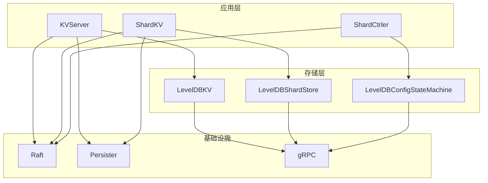

**图表来源**
- [kvraft/server.go](file://kvraft/server.go#L88-L100)
- [shardkv/server.go](file://shardkv/server.go#L76-L99)
- [shardctrler/server.go](file://shardctrler/server.go#L17-L26)

**章节来源**
- [kvraft/server.go](file://kvraft/server.go#L1-L342)
- [shardkv/server.go](file://shardkv/server.go#L1-L800)
- [shardctrler/server.go](file://shardctrler/server.go#L1-L344)

## 核心组件

### LevelDBKV 组件

LevelDBKV 是单分片键值存储的核心实现，提供了完整的 CRUD 操作支持：

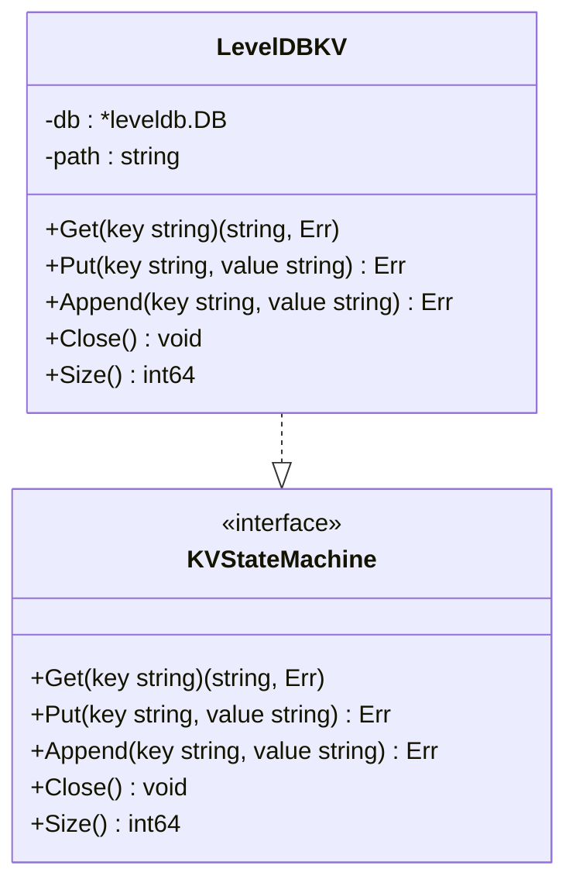

**图表来源**
- [kvraft/server.go](file://kvraft/server.go#L17-L28)

### LevelDBShardStore 组件

LevelDBShardStore 是分片键值存储的专用实现，支持按分片 ID 组织数据：

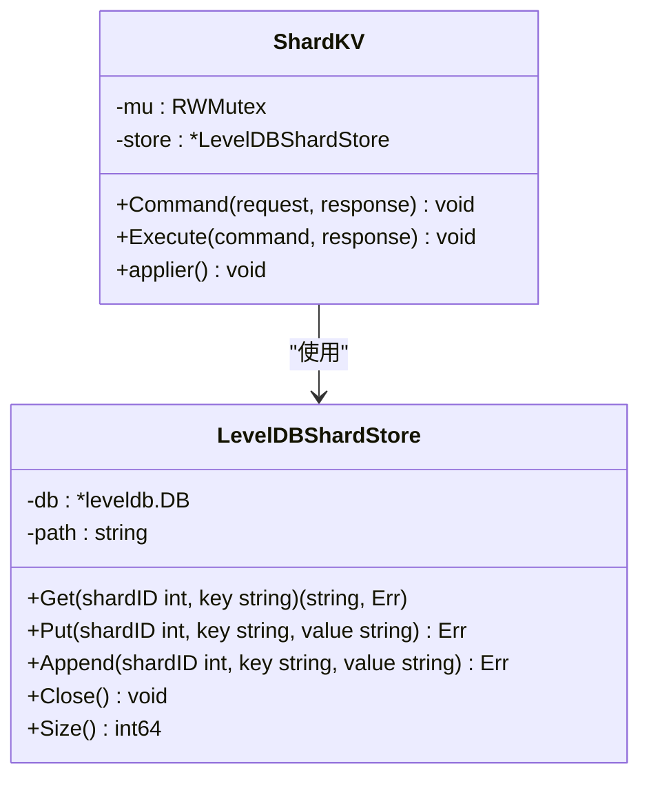

**图表来源**
- [shardkv/server.go](file://shardkv/server.go#L25-L36)
- [shardkv/server.go](file://shardkv/server.go#L76-L99)

### LevelDBConfigStateMachine 组件

LevelDBConfigStateMachine 负责配置状态机的持久化存储：

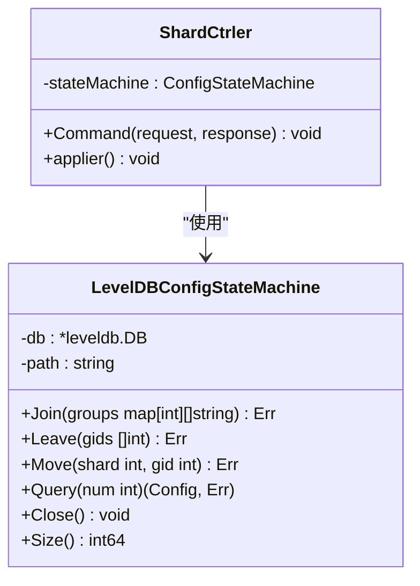

**图表来源**
- [shardctrler/server.go](file://shardctrler/server.go#L28-L31)
- [shardctrler/server.go](file://shardctrler/server.go#L17-L26)

**章节来源**
- [kvraft/server.go](file://kvraft/server.go#L25-L86)
- [shardkv/server.go](file://shardkv/server.go#L25-L74)
- [shardctrler/server.go](file://shardctrler/server.go#L28-L177)

## 架构概览

eRaft 的 LevelDB 集成架构采用分层设计，确保了良好的可维护性和扩展性：

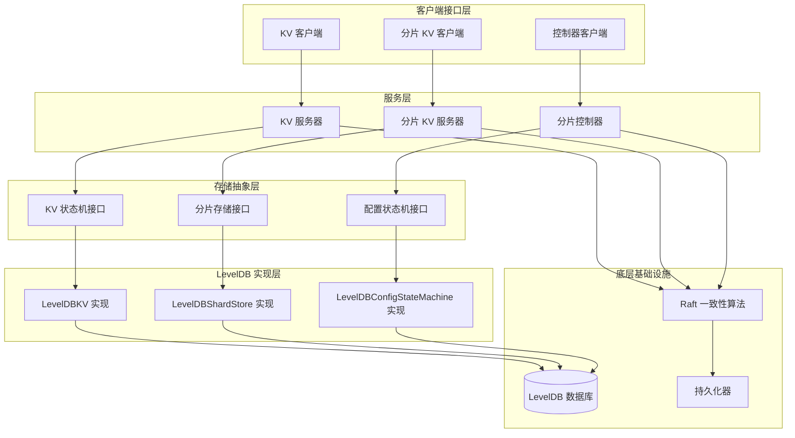

**图表来源**
- [kvraft/server.go](file://kvraft/server.go#L88-L100)
- [shardkv/server.go](file://shardkv/server.go#L76-L99)
- [shardctrler/server.go](file://shardctrler/server.go#L17-L26)

## 详细组件分析

### 数据库连接管理

#### 初始化流程

LevelDB 数据库的初始化采用延迟加载策略，确保在首次访问时才建立连接：

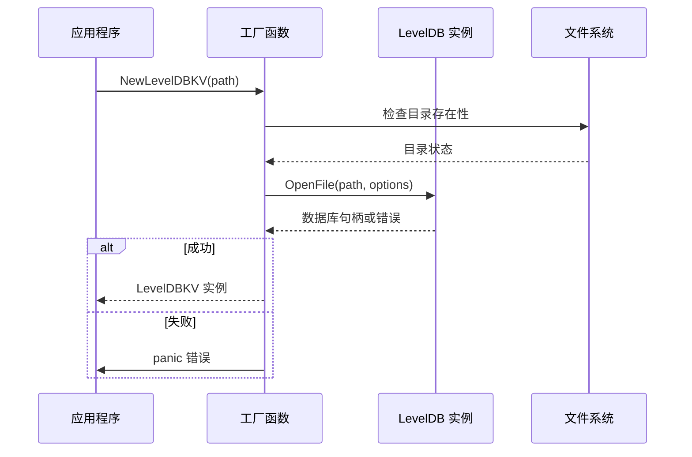

**图表来源**
- [kvraft/server.go](file://kvraft/server.go#L30-L36)
- [shardkv/server.go](file://shardkv/server.go#L30-L36)
- [shardctrler/server.go](file://shardctrler/server.go#L33-L44)

#### 连接池管理

由于 LevelDB 本身不提供连接池功能，eRaft 通过以下方式实现连接管理：

1. **单实例模式**：每个存储组件维护一个 LevelDB 实例
2. **线程安全**：LevelDB 实例内部已实现线程安全
3. **资源管理**：通过 Close 方法统一释放资源

**章节来源**
- [kvraft/server.go](file://kvraft/server.go#L30-L36)
- [shardkv/server.go](file://shardkv/server.go#L30-L36)
- [shardctrler/server.go](file://shardctrler/server.go#L33-L44)

### 文件路径配置

#### 路径管理策略

eRaft 采用灵活的路径配置策略，支持不同的部署场景：

| 组件类型 | 默认路径格式 | 说明 |
|---------|-------------|------|
| KVServer | `kvserver-data` | 单分片 KV 服务默认数据目录 |
| ShardKV | `data/shardkv_{gid}_{id}` | 分片 KV 服务，包含组 ID 和节点 ID |
| ShardCtrler | `data/shardctrler_{id}` | 分片控制器，包含节点 ID |

#### 路径解析流程

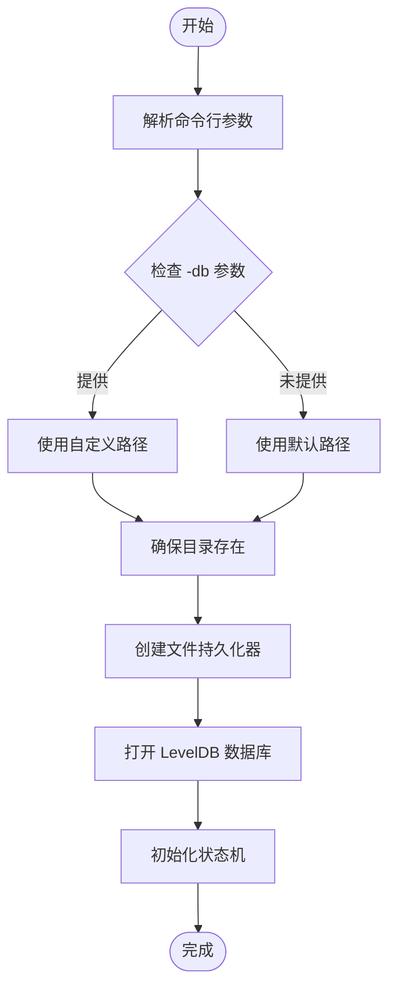

**图表来源**
- [cmd/kvserver/main.go](file://cmd/kvserver/main.go#L17-L20)
- [cmd/shardkvserver/main.go](file://cmd/shardkvserver/main.go#L21-L24)
- [cmd/shardctrler/main.go](file://cmd/shardctrler/main.go#L19-L22)

**章节来源**
- [cmd/kvserver/main.go](file://cmd/kvserver/main.go#L17-L41)
- [cmd/shardkvserver/main.go](file://cmd/shardkvserver/main.go#L21-L43)
- [cmd/shardctrler/main.go](file://cmd/shardctrler/main.go#L19-L39)

### 基本操作封装

#### Get 操作实现

Get 操作实现了完整的错误处理机制：

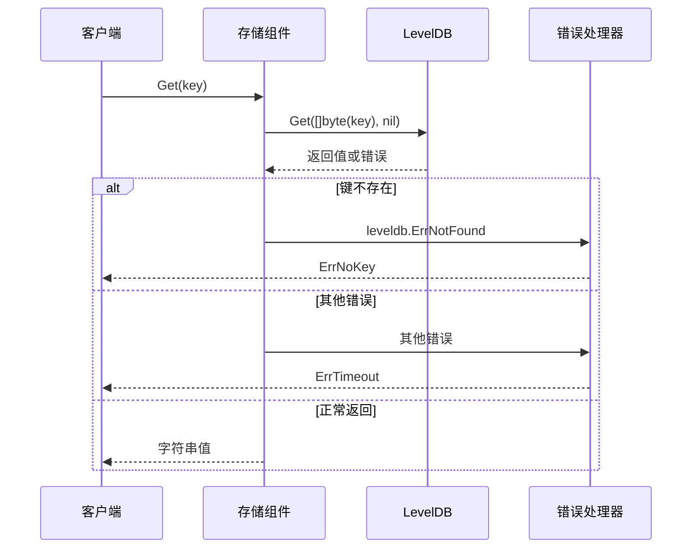

**图表来源**
- [kvraft/server.go](file://kvraft/server.go#L38-L47)
- [shardkv/server.go](file://shardkv/server.go#L38-L44)

#### Put 操作实现

Put 操作提供了原子性的数据写入：

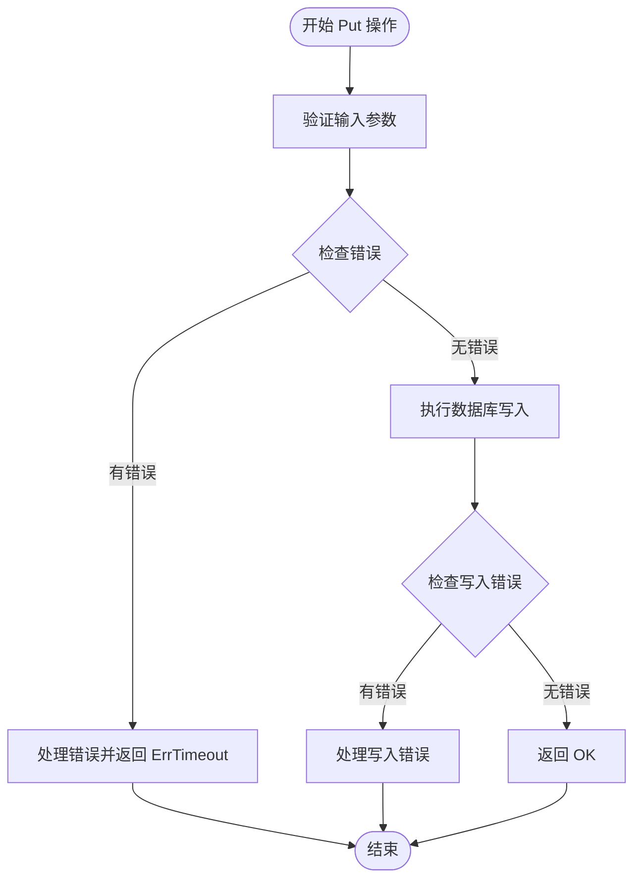

**图表来源**
- [kvraft/server.go](file://kvraft/server.go#L49-L55)
- [shardkv/server.go](file://shardkv/server.go#L46-L49)

#### Append 操作实现

Append 操作实现了原子性的字符串追加：

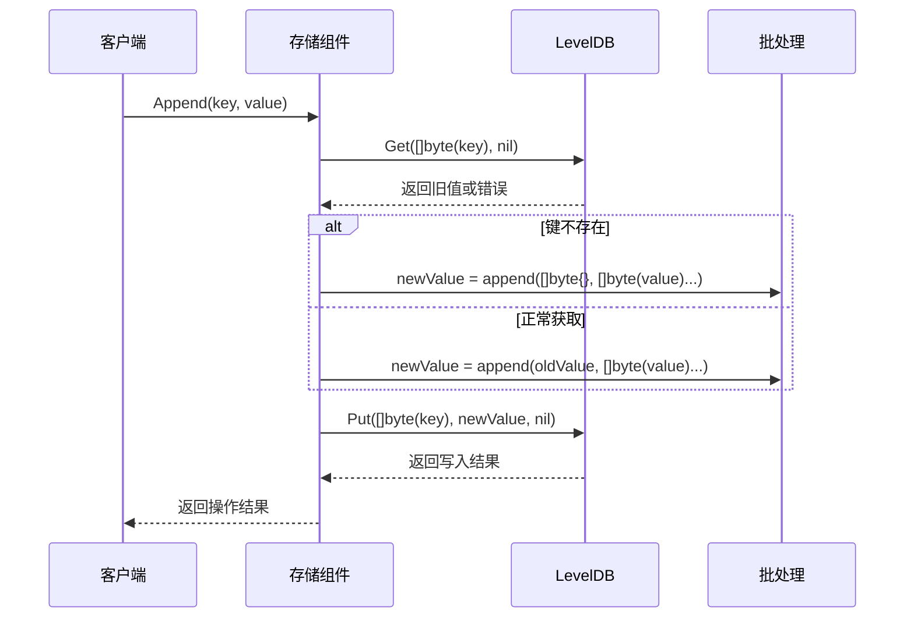

**图表来源**
- [kvraft/server.go](file://kvraft/server.go#L57-L68)
- [shardkv/server.go](file://shardkv/server.go#L51-L56)

**章节来源**
- [kvraft/server.go](file://kvraft/server.go#L38-L68)
- [shardkv/server.go](file://shardkv/server.go#L38-L56)

### 并发访问控制

#### 读写锁机制

eRaft 使用读写锁实现高效的并发控制：

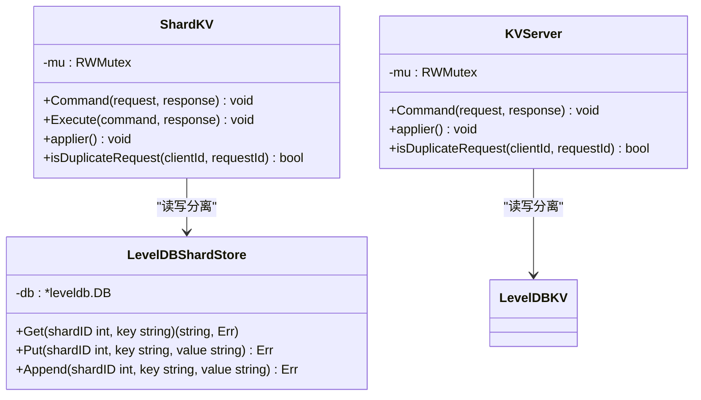

**图表来源**
- [shardkv/server.go](file://shardkv/server.go#L76-L99)
- [kvraft/server.go](file://kvraft/server.go#L88-L100)

#### 并发访问模式

1. **只读操作**：使用 RLock 实现共享访问
2. **写入操作**：使用 Lock 实现独占访问
3. **异步通知**：避免阻塞客户端请求

**章节来源**
- [shardkv/server.go](file://shardkv/server.go#L110-L157)
- [kvraft/server.go](file://kvraft/server.go#L102-L139)

### 错误处理机制

#### 错误类型定义

eRaft 定义了完整的错误处理体系：

| 错误类型 | 值 | 描述 | 处理策略 |
|---------|----|------|---------|
| OK | 0 | 操作成功 | 直接返回 |
| ErrNoKey | 1 | 键不存在 | 返回空值 |
| ErrWrongLeader | 2 | 领导者错误 | 重试其他节点 |
| ErrTimeout | 3 | 操作超时 | 重试或失败 |
| ErrWrongGroup | 4 | 分组错误 | 获取新配置后重试 |
| ErrOutDated | 5 | 配置过期 | 重新获取配置 |
| ErrNotReady | 6 | 服务未就绪 | 等待后重试 |

#### 错误传播流程

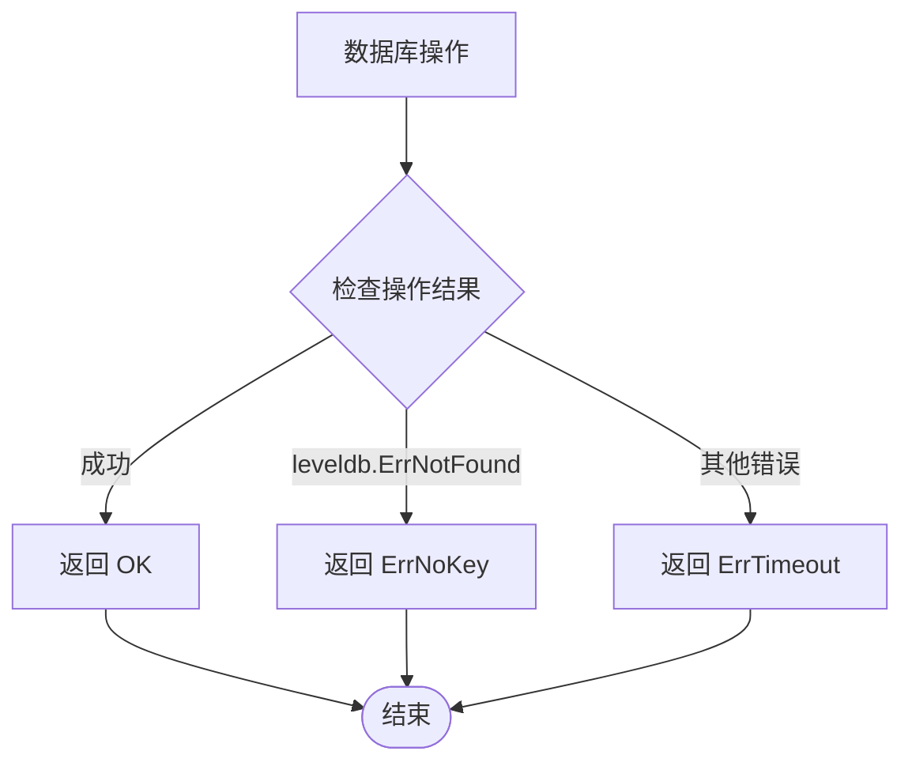

**图表来源**
- [kvraft/common.go](file://kvraft/common.go#L49-L70)
- [shardkv/common.go](file://shardkv/common.go#L38-L68)
- [shardctrler/common.go](file://shardctrler/common.go#L88-L106)

**章节来源**
- [kvraft/common.go](file://kvraft/common.go#L49-L70)
- [shardkv/common.go](file://shardkv/common.go#L38-L68)
- [shardctrler/common.go](file://shardctrler/common.go#L88-L106)

## 依赖关系分析

### 外部依赖

eRaft 的 LevelDB 集成主要依赖以下外部组件：

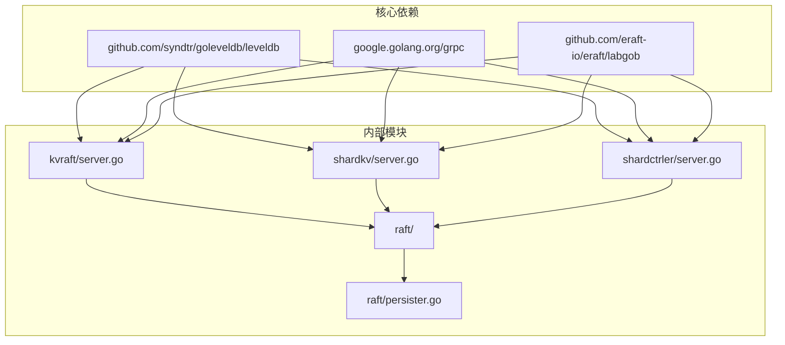

**图表来源**
- [kvraft/server.go](file://kvraft/server.go#L3-L15)
- [shardkv/server.go](file://shardkv/server.go#L3-L23)
- [shardctrler/server.go](file://shardctrler/server.go#L3-L15)

### 内部耦合关系

#### 接口设计

eRaft 采用了清晰的接口分离设计：

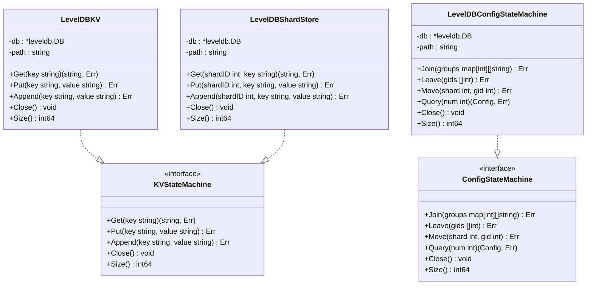

**图表来源**
- [kvraft/server.go](file://kvraft/server.go#L17-L28)
- [shardkv/server.go](file://shardkv/server.go#L25-L36)
- [shardctrler/server.go](file://shardctrler/server.go#L28-L31)

**章节来源**
- [kvraft/server.go](file://kvraft/server.go#L17-L28)
- [shardkv/server.go](file://shardkv/server.go#L25-L36)
- [shardctrler/server.go](file://shardctrler/server.go#L28-L31)

## 性能考虑

### 配置参数调优

#### LevelDB 配置选项

| 参数 | 类型 | 默认值 | 说明 |
|------|------|--------|------|
| blockSize | int | 4KB | 数据块大小 |
| writeBufferSize | int | 4MB | 写缓冲区大小 |
| cacheSize | int | 8MB | 缓存大小 |
| compactionStyle | int | 2 | 合并策略 |
| compression | int | 1 | 压缩级别 |

#### 性能优化建议

1. **内存配置**：根据硬件条件调整 writeBufferSize 和 cacheSize
2. **I/O 优化**：使用 SSD 存储设备提升性能
3. **并发控制**：合理设置读写锁粒度
4. **批处理**：利用 LevelDB 的批量写入功能

### 最佳实践

#### 数据组织策略

1. **键空间设计**：避免键分布不均
2. **数据压缩**：启用合适的压缩算法
3. **定期维护**：执行定期的数据库整理
4. **监控指标**：建立完善的性能监控体系

#### 容错机制

1. **自动重试**：实现智能的失败重试机制
2. **健康检查**：定期检查数据库健康状态
3. **备份策略**：制定完善的数据备份计划
4. **故障转移**：实现快速的故障检测和恢复

## 故障排除指南

### 常见问题诊断

#### 数据库连接问题

**症状**：应用程序启动时无法连接到 LevelDB

**诊断步骤**：
1. 检查数据库路径是否存在
2. 验证文件权限设置
3. 确认磁盘空间充足
4. 查看系统资源使用情况

**解决方案**：
```go
// 示例：数据库连接错误处理
db, err := leveldb.OpenFile(path, nil)
if err != nil {
    log.Printf("Failed to open LevelDB: %v", err)
    // 实施降级策略或重启机制
}
```

#### 性能问题排查

**症状**：数据库操作响应时间过长

**诊断方法**：
1. 监控数据库大小和碎片率
2. 检查磁盘 I/O 性能
3. 分析查询模式和索引使用
4. 评估内存使用情况

**优化措施**：
```go
// 示例：性能监控
func (lk *LevelDBKV) Size() int64 {
    var size int64
    filepath.Walk(lk.path, func(_ string, info os.FileInfo, err error) error {
        if err != nil {
            return err
        }
        if !info.IsDir() {
            size += info.Size()
        }
        return nil
    })
    return size
}
```

#### 并发冲突问题

**症状**：出现数据竞争或死锁现象

**解决策略**：
1. 确保正确的锁使用顺序
2. 避免在持有锁的情况下进行阻塞操作
3. 实施超时机制防止无限等待
4. 使用更细粒度的锁策略

**章节来源**
- [kvraft/server.go](file://kvraft/server.go#L74-L86)
- [shardkv/server.go](file://shardkv/server.go#L62-L74)
- [shardctrler/server.go](file://shardctrler/server.go#L165-L177)

## 结论

eRaft 的 LevelDB 集成方案展现了现代分布式系统中存储层设计的最佳实践。通过精心设计的架构和完善的错误处理机制，该方案实现了高性能、可靠的数据存储服务。

### 主要优势

1. **模块化设计**：清晰的接口分离和职责划分
2. **性能优化**：合理的缓存策略和并发控制
3. **可靠性保障**：完整的错误处理和故障恢复机制
4. **可扩展性**：支持水平扩展和动态配置

### 技术亮点

- **零配置启动**：提供合理的默认配置
- **智能错误处理**：区分不同类型的错误并采取相应策略
- **资源管理**：完善的生命周期管理和资源清理
- **监控集成**：内置性能指标和健康检查

该集成方案为构建大规模分布式键值存储系统提供了坚实的基础，既满足了教学演示的需求，也为生产环境部署做好了充分准备。

## 附录

### 配置示例

#### 基本使用示例

```go
// 创建 KVServer 实例
kvServer := kvraft.StartKVServer(peers, id, persister, -1, "kvserver-data")

// 创建 ShardKV 实例
shardKV := shardkv.StartServer(peers, id, persister, -1, gid, ctrlers, nil, dbPath)

// 创建 ShardCtrler 实例
shardCtrler := shardctrler.StartServer(peers, id, persister, dbPath)
```

#### 高级配置示例

```go
// 自定义数据库路径
dbPath := flag.String("db", "custom/path", "自定义 LevelDB 路径")

// 设置最大 Raft 状态大小
maxRaftState := flag.Int("maxraftstate", 1000, "最大 Raft 状态大小")

// 启用调试模式
debug := flag.Bool("debug", false, "启用调试输出")
```

### 监控指标

| 指标类型 | 指标名称 | 描述 | 更新频率 |
|---------|---------|------|---------|
| 存储指标 | 数据库大小 | LevelDB 数据库总大小 | 实时 |
| 性能指标 | 操作延迟 | Get/Put/Append 操作延迟 | 实时 |
| 系统指标 | 内存使用 | 进程内存使用量 | 每秒 |
| 网络指标 | 连接数 | gRPC 连接数量 | 实时 |

### 故障恢复流程

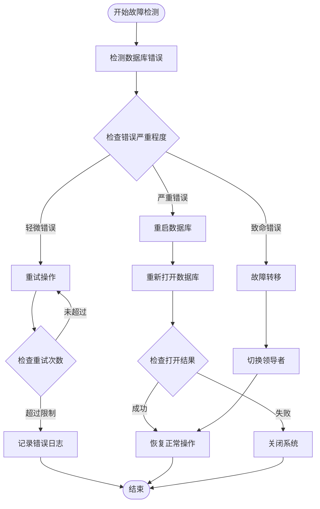