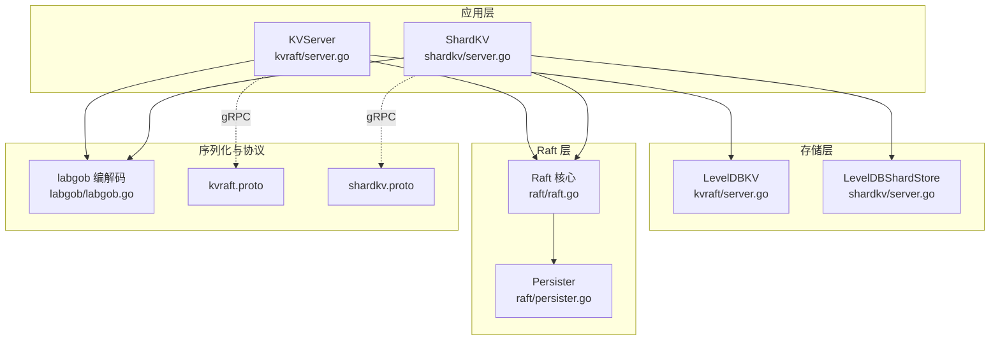
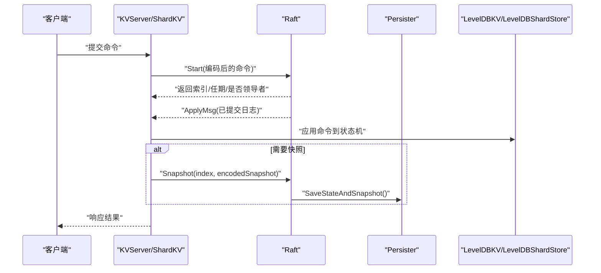
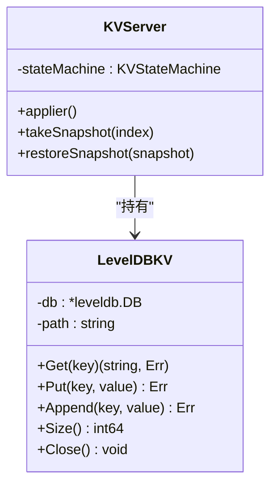
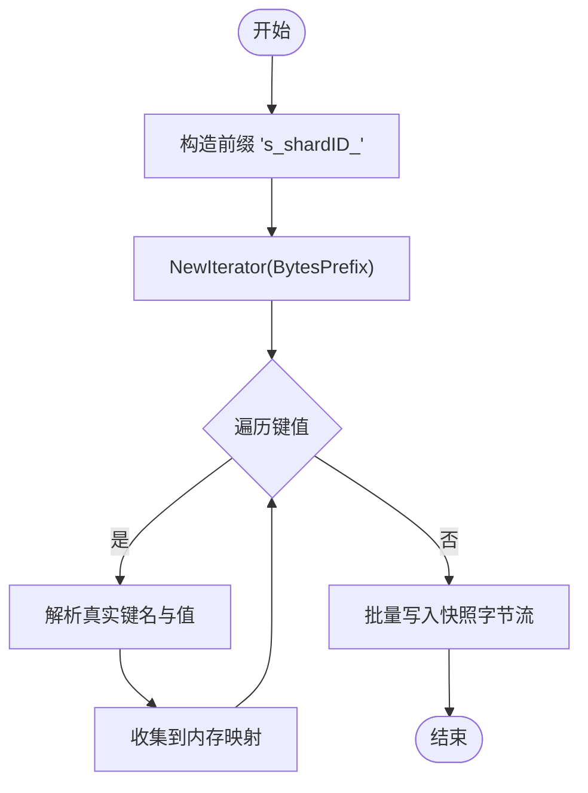
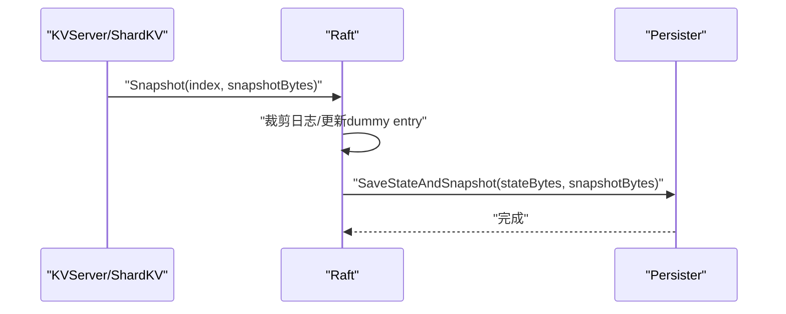
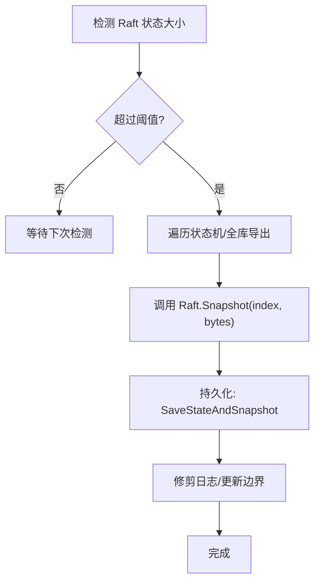
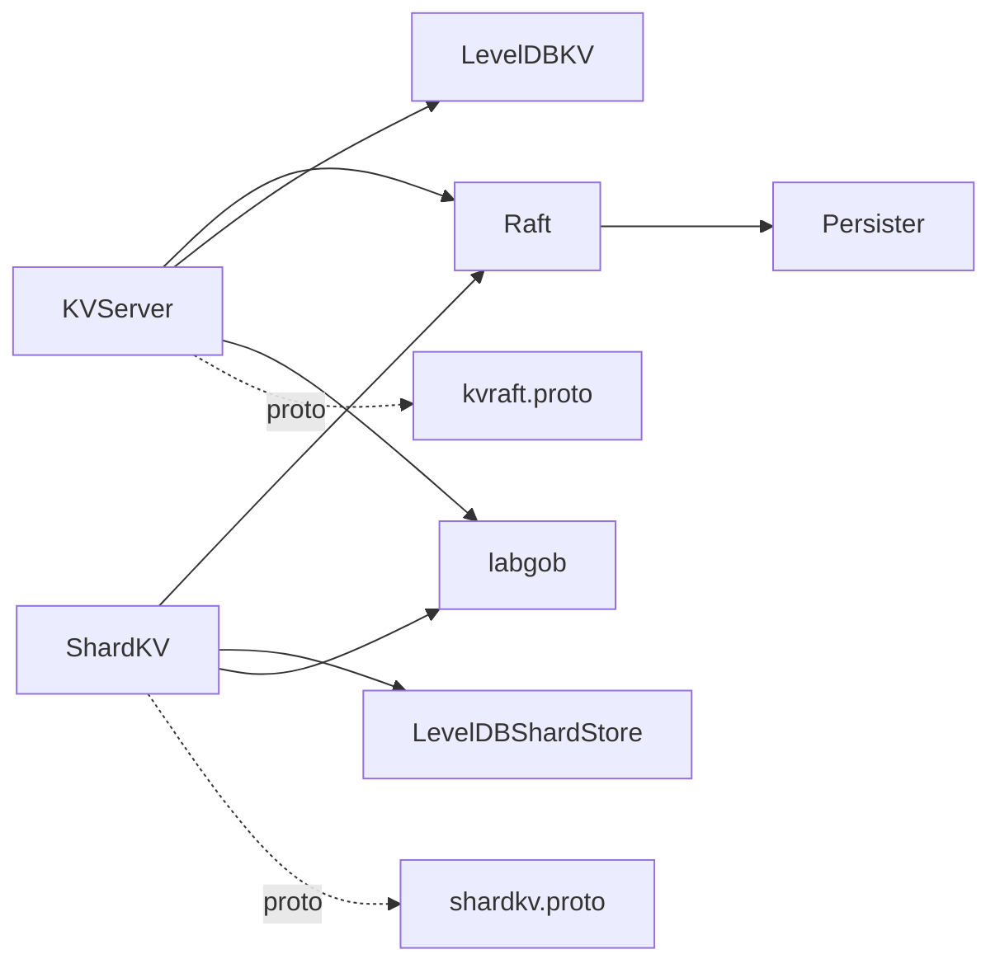

# 存储引擎集成

<cite>
**本文引用的文件**
- [raft/persister.go](file://raft/persister.go)
- [raft/raft.go](file://raft/raft.go)
- [raft/config.go](file://raft/config.go)
- [kvraft/server.go](file://kvraft/server.go)
- [shardkv/server.go](file://shardkv/server.go)
- [kvraft/common.go](file://kvraft/common.go)
- [shardkv/common.go](file://shardkv/common.go)
- [labgob/labgob.go](file://labgob/labgob.go)
- [cmd/kvserver/main.go](file://cmd/kvserver/main.go)
- [cmd/shardkvserver/main.go](file://cmd/shardkvserver/main.go)
- [wiki/Storage-and-RPC.md](file://wiki/Storage-and-RPC.md)
- [kvraftpb/kvraft.proto](file://kvraftpb/kvraft.proto)
- [shardkvpb/shardkv.proto](file://shardkvpb/shardkv.proto)
</cite>

## 目录
1. [简介](#简介)
2. [项目结构](#项目结构)
3. [核心组件](#核心组件)
4. [架构总览](#架构总览)
5. [详细组件分析](#详细组件分析)
6. [依赖关系分析](#依赖关系分析)
7. [性能考量](#性能考量)
8. [故障排查指南](#故障排查指南)
9. [结论](#结论)
10. [附录](#附录)

## 简介
本文件面向 eRaft 的存储引擎集成，系统性阐述 LevelDB 在 kvraft 与 shardkv 中的集成方案、数据持久化策略、快照与 Raft 日志的协同、以及性能优化与运维要点。文档以代码为依据，结合架构图与流程图，帮助读者从接口设计、数据组织、序列化与压缩、缓存策略到监控与容量规划形成完整认知。

## 项目结构
eRaft 将存储层与 Raft 协议解耦：Raft 负责日志复制与快照元信息管理，状态机（KV）使用 LevelDB 实现键值数据的持久化；应用层通过 gRPC 提供服务接口，内部仍兼容 labrpc 测试框架。

图表来源
- [kvraft/server.go](file://kvraft/server.go#L25-L86)
- [shardkv/server.go](file://shardkv/server.go#L25-L74)
- [raft/raft.go](file://raft/raft.go#L37-L60)
- [raft/persister.go](file://raft/persister.go#L17-L22)
- [labgob/labgob.go](file://labgob/labgob.go#L24-L58)
- [kvraftpb/kvraft.proto](file://kvraftpb/kvraft.proto#L1-L41)
- [shardkvpb/shardkv.proto](file://shardkvpb/shardkv.proto#L1-L66)

章节来源
- [wiki/Storage-and-RPC.md](file://wiki/Storage-and-RPC.md#L1-L19)
- [cmd/kvserver/main.go](file://cmd/kvserver/main.go#L16-L47)
- [cmd/shardkvserver/main.go](file://cmd/shardkvserver/main.go#L18-L58)

## 核心组件
- LevelDBKV：单机 KV 的状态机实现，封装 leveldb 操作，提供 Get/Put/Append/Size/Close。
- LevelDBShardStore：分片 KV 的状态机实现，按“分片ID_键”前缀组织数据，支持批量删除与增量迁移。
- KVServer/ShardKV：应用层状态机，负责请求去重、日志应用、快照触发与恢复、通知通道管理。
- Raft：提供日志、快照元信息与持久化接口，协调状态机与存储层。
- Persister：Raft 状态与快照的文件持久化抽象，保证原子写入。
- labgob：统一的结构化编码/解码工具，确保跨进程传输与持久化的类型安全。
- gRPC 服务：对外暴露 KV 与 ShardKV 接口，内部兼容 labrpc 测试。

章节来源
- [kvraft/server.go](file://kvraft/server.go#L17-L86)
- [shardkv/server.go](file://shardkv/server.go#L25-L74)
- [raft/raft.go](file://raft/raft.go#L37-L116)
- [raft/persister.go](file://raft/persister.go#L17-L111)
- [labgob/labgob.go](file://labgob/labgob.go#L24-L68)

## 架构总览
下图展示 KV 与 ShardKV 如何通过 Raft 与 LevelDB 协同工作，并在 gRPC 层暴露服务。

图表来源
- [kvraft/server.go](file://kvraft/server.go#L102-L139)
- [shardkv/server.go](file://shardkv/server.go#L129-L157)
- [raft/raft.go](file://raft/raft.go#L150-L164)
- [raft/persister.go](file://raft/persister.go#L90-L98)

## 详细组件分析

### LevelDBKV（单机 KV）
- 接口设计
  - Get/Put/Append：直接映射到 leveldb 的 Get/Put，Append 基于读取旧值后拼接再写入。
  - Size：遍历目录统计磁盘占用。
  - Close：关闭数据库句柄。
- 数据组织
  - 键值直接存储，无额外前缀；适合单机场景。
- 序列化与压缩
  - 序列化：应用层使用 labgob 对命令进行编码；LevelDB 内部采用 LSM-Tree 结构与压缩策略（由 leveldb 驱动）。
- 快照机制
  - KVServer 在满足条件时遍历状态机全量导出为快照字节流，交由 Raft 进行持久化。

图表来源
- [kvraft/server.go](file://kvraft/server.go#L25-L86)
- [kvraft/server.go](file://kvraft/server.go#L242-L279)

章节来源
- [kvraft/server.go](file://kvraft/server.go#L25-L86)
- [kvraft/server.go](file://kvraft/server.go#L242-L279)

### LevelDBShardStore（分片 KV）
- 接口设计
  - Get/Put/Append：键名格式为“s_{shardID}_{key}”，实现按分片隔离。
  - Size：统计目录大小。
  - Close：关闭数据库。
- 数据组织与索引
  - 使用复合键前缀实现分片内迭代与范围扫描；支持按分片批量删除（ClearShardData）。
- 快照机制
  - 全库遍历导出所有键值、分片状态、最后操作上下文与配置信息，用于恢复。

图表来源
- [shardkv/server.go](file://shardkv/server.go#L177-L185)
- [shardkv/server.go](file://shardkv/server.go#L467-L484)

章节来源
- [shardkv/server.go](file://shardkv/server.go#L25-L74)
- [shardkv/server.go](file://shardkv/server.go#L407-L416)
- [shardkv/server.go](file://shardkv/server.go#L467-L516)

### Raft 与持久化（Persister）
- 持久化内容
  - Raft 状态：当前任期、投票记录、日志条目。
  - 快照：应用层生成的快照字节流。
- 原子写入
  - SaveStateAndSnapshot：保证 Raft 状态与快照同时落盘，避免不一致。
- 快照安装
  - CondInstallSnapshot：在满足条件时裁剪日志并更新快照边界，随后保存。

图表来源
- [raft/raft.go](file://raft/raft.go#L150-L164)
- [raft/raft.go](file://raft/raft.go#L120-L144)
- [raft/persister.go](file://raft/persister.go#L90-L98)

章节来源
- [raft/persister.go](file://raft/persister.go#L17-L111)
- [raft/raft.go](file://raft/raft.go#L85-L116)
- [raft/raft.go](file://raft/raft.go#L120-L164)

### 序列化与压缩
- labgob
  - 统一注册结构体，编码/解码命令与配置，避免字段命名导致的传输问题。
- LevelDB
  - LSM-Tree + 多级压缩（由 leveldb 驱动），自动合并与清理过期版本。
- 建议
  - 对大对象可考虑外部压缩（如 Snappy/LZ4）后再入库，或利用 leveldb 选项控制压缩级别与块大小。

章节来源
- [labgob/labgob.go](file://labgob/labgob.go#L24-L68)
- [kvraft/server.go](file://kvraft/server.go#L115-L118)
- [shardkv/server.go](file://shardkv/server.go#L132-L135)

### 缓存策略
- 应用层缓存
  - lastOperations：基于客户端ID与最大已应用命令ID，快速去重，减少不必要的状态机访问。
- 磁盘缓存
  - 利用 OS 文件系统页缓存；LevelDB 自身也有块缓存与过滤器。
- 建议
  - 对热点键可引入 LRU 缓存（需注意与 Raft 一致性边界）；或在应用层维护轻量只读缓存。

章节来源
- [kvraft/server.go](file://kvraft/server.go#L98-L100)
- [kvraft/server.go](file://kvraft/server.go#L143-L146)
- [shardkv/server.go](file://shardkv/server.go#L96-L98)
- [shardkv/server.go](file://shardkv/server.go#L221-L224)

### 快照与日志垃圾回收
- 触发条件
  - 当 Raft 状态大小超过阈值（maxRaftState）时触发快照。
- 快照内容
  - KV：状态机数据映射与 lastOperations。
  - ShardKV：全库键值、分片状态、lastOperations、当前/上一配置。
- 日志修剪
  - 快照成功后，Raft 修剪日志至新快照索引，释放磁盘空间。

图表来源
- [kvraft/server.go](file://kvraft/server.go#L238-L240)
- [kvraft/server.go](file://kvraft/server.go#L242-L258)
- [shardkv/server.go](file://shardkv/server.go#L463-L465)
- [shardkv/server.go](file://shardkv/server.go#L467-L484)
- [raft/raft.go](file://raft/raft.go#L150-L164)

章节来源
- [kvraft/server.go](file://kvraft/server.go#L238-L258)
- [shardkv/server.go](file://shardkv/server.go#L463-L484)
- [raft/raft.go](file://raft/raft.go#L150-L164)

### 与 Raft 日志的集成与一致性
- 请求路径
  - 客户端 → KVServer/ShardKV → Raft.Start → 日志复制 → ApplyMsg → 应用到状态机 → 响应。
- 去重与幂等
  - 基于 lastOperations 记录每个客户端的最大已应用命令ID，重复请求直接返回上次响应。
- 快照恢复
  - 重启后从 Persister 读取快照，重建状态机与 lastOperations，确保一致性。

章节来源
- [kvraft/server.go](file://kvraft/server.go#L102-L139)
- [kvraft/server.go](file://kvraft/server.go#L202-L210)
- [shardkv/server.go](file://shardkv/server.go#L110-L127)
- [shardkv/server.go](file://shardkv/server.go#L333-L342)

## 依赖关系分析
- 组件耦合
  - KVServer/ShardKV 依赖 Raft 提供的日志与快照接口；状态机实现独立于 Raft。
  - Persister 仅处理字节流的读写，不关心内容结构。
- 外部依赖
  - LevelDB：键值存储与迭代。
  - labgob：结构化编解码。
  - gRPC：服务暴露与客户端通信。

图表来源
- [kvraft/server.go](file://kvraft/server.go#L324-L341)
- [shardkv/server.go](file://shardkv/server.go#L770-L799)
- [raft/raft.go](file://raft/raft.go#L37-L60)
- [raft/persister.go](file://raft/persister.go#L17-L22)
- [labgob/labgob.go](file://labgob/labgob.go#L24-L68)
- [kvraftpb/kvraft.proto](file://kvraftpb/kvraft.proto#L37-L40)
- [shardkvpb/shardkv.proto](file://shardkvpb/shardkv.proto#L60-L65)

章节来源
- [kvraft/server.go](file://kvraft/server.go#L324-L341)
- [shardkv/server.go](file://shardkv/server.go#L770-L799)
- [raft/raft.go](file://raft/raft.go#L37-L60)

## 性能考量
- I/O 优化
  - 批量写入：ShardKV 在清理分片数据时使用 leveldb.Batch 减少写放大。
  - 迭代器：分片扫描使用 BytesPrefix 进行范围查询，避免全表扫描。
- 序列化开销
  - labgob 编解码在快照与配置传输中使用，建议尽量减少大对象频繁序列化。
- 并发与吞吐
  - KVServer/ShardKV 在非关键路径（如快照期间）允许 Raft 继续提交日志，提升整体吞吐。
- 磁盘与内存
  - 利用 OS 页缓存与 LevelDB 块缓存；合理设置 maxRaftState 以平衡日志长度与快照频率。

章节来源
- [shardkv/server.go](file://shardkv/server.go#L409-L416)
- [shardkv/server.go](file://shardkv/server.go#L177-L185)
- [kvraft/server.go](file://kvraft/server.go#L114-L118)
- [shardkv/server.go](file://shardkv/server.go#L132-L135)

## 故障排查指南
- 快照失败
  - 现象：恢复快照后状态异常或日志不一致。
  - 排查：确认 labgob 解码顺序与字段类型一致；检查 CondInstallSnapshot 条件（索引/任期）。
- 数据丢失/重复
  - 现象：客户端收到错误或重复响应。
  - 排查：核对 lastOperations 去重逻辑；确认 lastApplied 不回退。
- 磁盘空间不足
  - 现象：节点无法继续提交或快照失败。
  - 排查：监控 KVServer/ShardKV 的 Size 返回值；调整 maxRaftState 降低日志长度。
- 网络分区与快照安装
  - 现象：落后节点无法安装快照。
  - 排查：确认 InstallSnapshot RPC 正常；检查快照索引与任期是否有效。

章节来源
- [kvraft/server.go](file://kvraft/server.go#L260-L279)
- [shardkv/server.go](file://shardkv/server.go#L487-L516)
- [raft/raft.go](file://raft/raft.go#L120-L144)
- [raft/config.go](file://raft/config.go#L186-L236)

## 结论
eRaft 通过将 LevelDB 作为状态机存储，结合 Raft 的快照与日志修剪机制，实现了高可靠、可扩展的数据持久化方案。应用层通过 labgob 统一序列化、gRPC 暴露服务，并在关键路径上采用去重与批处理优化吞吐。运维侧可通过监控存储大小与日志长度、合理设置快照阈值与日志保留策略，保障系统稳定运行。

## 附录

### 配置选项与参数调优
- 启动参数（示例）
  - KV 服务器：节点ID、节点地址列表、LevelDB 数据目录。
  - 分片 KV 服务器：组ID、节点ID、集群地址列表、控制器地址列表、LevelDB 前缀路径。
- 关键运行参数
  - maxRaftState：当 Raft 状态大小达到该阈值时触发快照；-1 表示禁用快照。
  - ExecuteTimeout：客户端执行超时时间。
  - 监控周期：配置/迁移/GC/空条目探测的周期参数。
- 建议
  - 将 maxRaftState 设置为“日均新增 Raft 状态大小 × N 天”的保守值。
  - 对高频写入场景，适当提高快照频率以缩短日志长度。

章节来源
- [cmd/kvserver/main.go](file://cmd/kvserver/main.go#L16-L32)
- [cmd/shardkvserver/main.go](file://cmd/shardkvserver/main.go#L18-L43)
- [kvraft/common.go](file://kvraft/common.go#L9-L18)
- [shardkv/common.go](file://shardkv/common.go#L21-L27)

### 监控指标
- 节点状态：节点ID、角色、任期、lastApplied、commitIndex。
- 存储用量：KVServer/ShardKV 的 Size 返回值（状态机大小 + Raft 状态大小）。
- 日志规模：Raft 状态大小（Persister）。
- 建议采集
  - 每秒一次上报上述指标，结合阈值告警与自动扩容策略。

章节来源
- [kvraft/server.go](file://kvraft/server.go#L171-L174)
- [shardkv/server.go](file://shardkv/server.go#L105-L108)
- [raft/raft.go](file://raft/raft.go#L76-L80)

### 备份与恢复
- 备份
  - 停机备份：直接复制 LevelDB 数据目录与 Raft 状态文件。
  - 在线备份：通过快照机制导出状态，配合 Raft 状态文件进行恢复。
- 恢复
  - 启动时从 Persister 读取快照并重建状态机；校验 lastApplied 与日志边界。
- 注意
  - 快照与 Raft 状态必须原子恢复，避免不一致。

章节来源
- [raft/persister.go](file://raft/persister.go#L90-L110)
- [raft/raft.go](file://raft/raft.go#L120-L144)
- [kvraft/server.go](file://kvraft/server.go#L335-L341)
- [shardkv/server.go](file://shardkv/server.go#L785-L799)