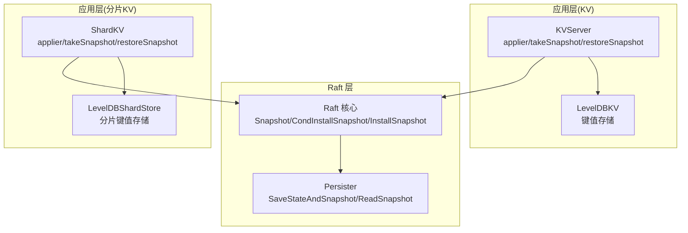
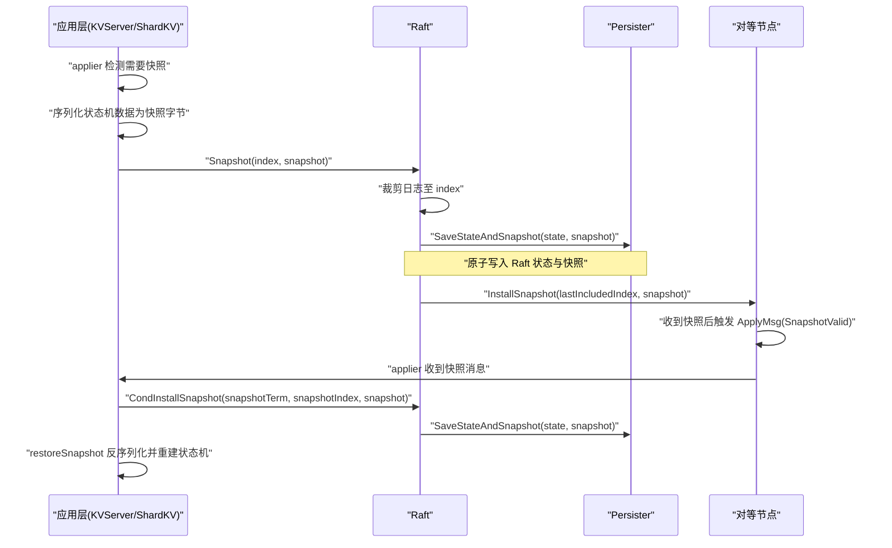
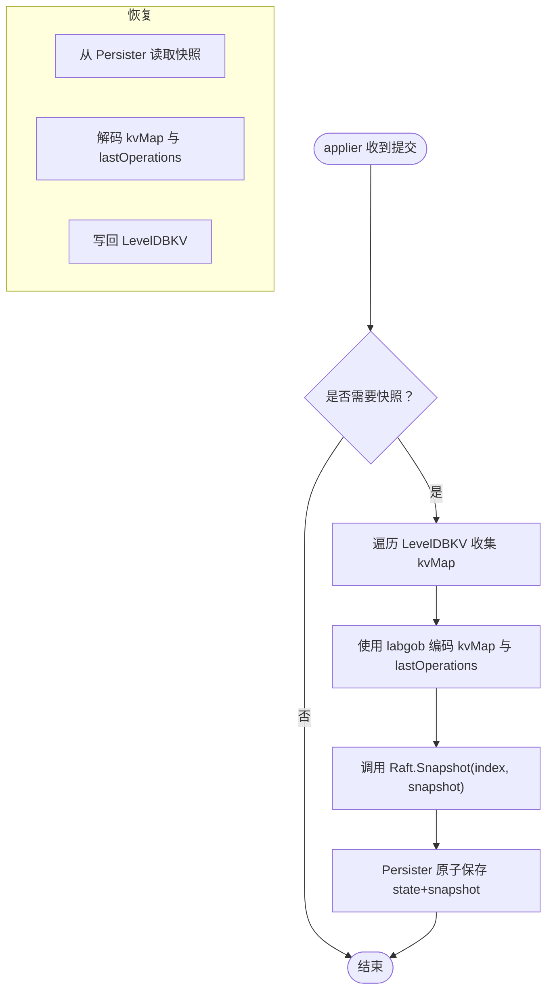
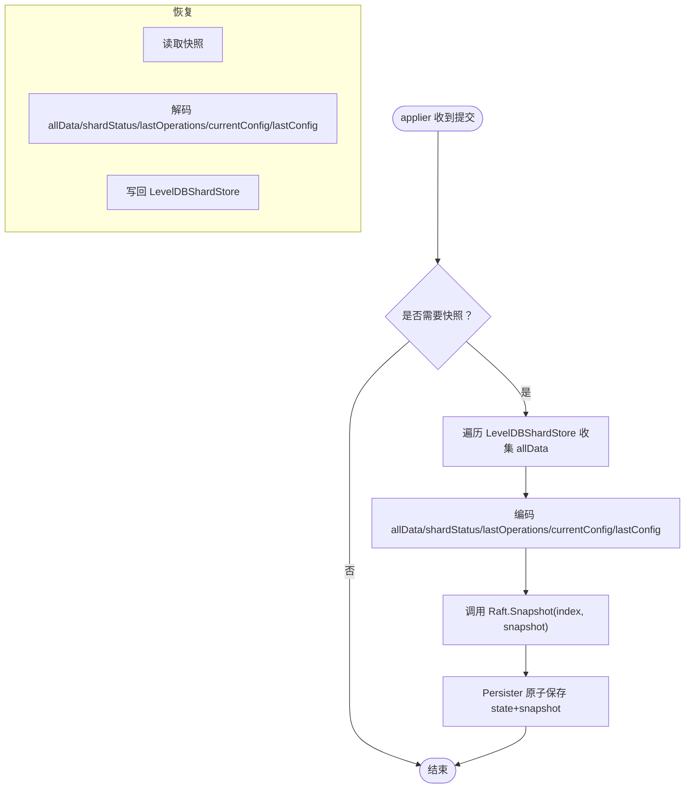
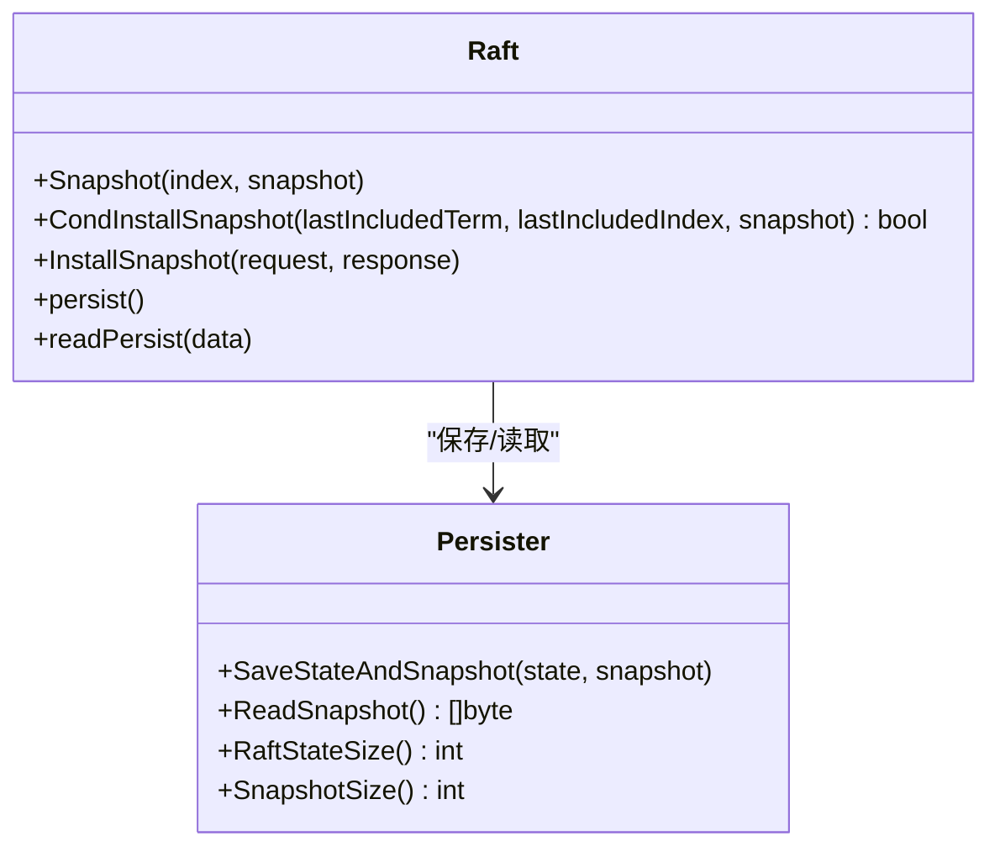
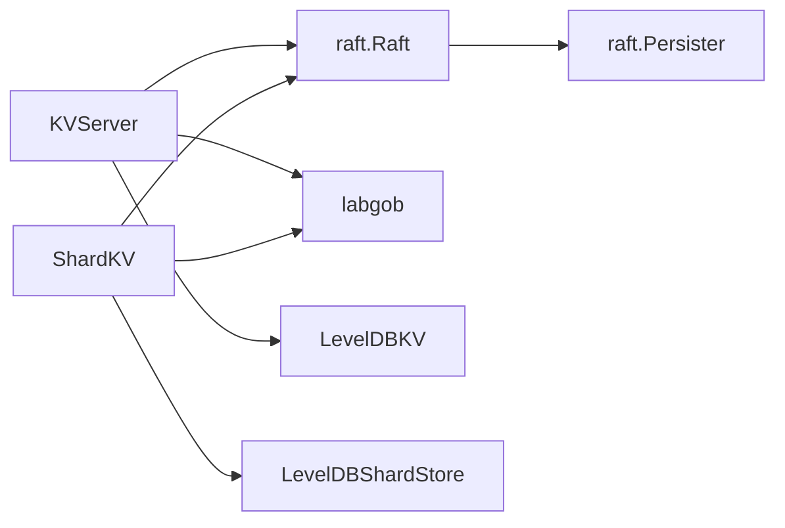

# 快照机制实现

**本文引用的文件**
- [raft/raft.go](file://raft/raft.go)
- [raft/persister.go](file://raft/persister.go)
- [kvraft/server.go](file://kvraft/server.go)
- [shardkv/server.go](file://shardkv/server.go)
- [labgob/labgob.go](file://labgob/labgob.go)
- [raft/config.go](file://raft/config.go)
- [kvraft/config.go](file://kvraft/config.go)
- [shardkv/config.go](file://shardkv/config.go)

## 目录
1. [简介](#简介)
2. [项目结构](#项目结构)
3. [核心组件](#核心组件)
4. [架构总览](#架构总览)
5. [详细组件分析](#详细组件分析)
6. [依赖关系分析](#依赖关系分析)
7. [性能考量](#性能考量)
8. [故障排查指南](#故障排查指南)
9. [结论](#结论)
10. [附录](#附录)

## 简介
本文件系统性阐述 eRaft 中的快照机制实现，覆盖快照创建、存储与恢复流程；深入解析 KVServer 与 ShardKV 的 takeSnapshot 与 restoreSnapshot 方法；说明快照数据结构、序列化格式与存储位置；分析快照触发条件、时机选择与性能优化策略；并讨论快照压缩、增量快照与并发处理、配置参数、监控指标、故障处理以及与日志清理的关系与生命周期管理。

## 项目结构
- 快照核心位于 raft 层：Raft 提供 Snapshot 与 CondInstallSnapshot 接口，Persister 负责持久化状态与快照的原子写入。
- 应用层（KVServer/ShardKV）在应用提交后根据阈值触发快照，将状态机数据与元信息序列化为快照字节，调用 Raft.Snapshot 完成落盘。
- 恢复阶段通过 InstallSnapshot RPC 将快照下发给落后节点，应用层再调用 CondInstallSnapshot 并触发本地恢复逻辑。

图表来源
- [raft/raft.go](file://raft/raft.go#L146-L164)
- [raft/raft.go](file://raft/raft.go#L118-L144)
- [raft/raft.go](file://raft/raft.go#L243-L275)
- [raft/persister.go](file://raft/persister.go#L90-L104)
- [kvraft/server.go](file://kvraft/server.go#L238-L279)
- [shardkv/server.go](file://shardkv/server.go#L463-L516)

章节来源
- [raft/raft.go](file://raft/raft.go#L1-L726)
- [raft/persister.go](file://raft/persister.go#L1-L111)
- [kvraft/server.go](file://kvraft/server.go#L1-L342)
- [shardkv/server.go](file://shardkv/server.go#L1-L800)

## 核心组件
- Raft 快照接口
  - Snapshot(index, snapshot)：服务端在满足条件时调用，将当前 Raft 日志裁剪到 index，并持久化新的快照。
  - CondInstallSnapshot(lastIncludedTerm, lastIncludedIndex, snapshot)：服务端在收到 InstallSnapshot 后，校验有效性并更新本地状态机与日志。
  - InstallSnapshot RPC：领导者向落后节点发送快照。
- Persister 原子持久化
  - SaveStateAndSnapshot(state, snapshot)：原子保存 Raft 状态与快照，避免状态与快照不一致。
  - ReadSnapshot()：读取上次保存的快照。
- 应用层快照
  - KVServer/ShardKV 在 applier 中检测是否需要快照，生成快照字节并调用 Raft.Snapshot。
  - 恢复时从 Persister 读取快照并反序列化回状态机。

章节来源
- [raft/raft.go](file://raft/raft.go#L118-L164)
- [raft/raft.go](file://raft/raft.go#L243-L275)
- [raft/persister.go](file://raft/persister.go#L90-L104)
- [kvraft/server.go](file://kvraft/server.go#L238-L279)
- [shardkv/server.go](file://shardkv/server.go#L463-L516)

## 架构总览
快照在 eRaft 中贯穿“应用层触发—Raft 裁剪—持久化—网络传输—应用层恢复”的完整链路。

图表来源
- [raft/raft.go](file://raft/raft.go#L146-L164)
- [raft/raft.go](file://raft/raft.go#L118-L144)
- [raft/raft.go](file://raft/raft.go#L243-L275)
- [raft/persister.go](file://raft/persister.go#L90-L104)
- [kvraft/server.go](file://kvraft/server.go#L217-L236)
- [shardkv/server.go](file://shardkv/server.go#L308-L326)

## 详细组件分析

### KVServer 快照实现
- 触发条件
  - 当 Raft 已持久化的状态大小超过阈值 maxRaftState 时触发快照。
- 快照内容
  - KV 映射表 kvMap：遍历 LevelDBKV 数据库，收集所有键值。
  - lastOperations：客户端去重上下文，记录每个客户端最大已应用命令 ID 与最后一次响应。
- 序列化与落盘
  - 使用 labgob 编码器将 kvMap 与 lastOperations 写入缓冲区，得到快照字节，调用 Raft.Snapshot(index, snapshot)。
- 恢复流程
  - 从 Persister 读取快照字节，解码为 kvMap 与 lastOperations。
  - 将 kvMap 写回 LevelDBKV，恢复状态机；lastOperations 用于去重判断。

图表来源
- [kvraft/server.go](file://kvraft/server.go#L238-L279)
- [kvraft/server.go](file://kvraft/server.go#L318-L341)
- [labgob/labgob.go](file://labgob/labgob.go#L24-L58)

章节来源
- [kvraft/server.go](file://kvraft/server.go#L238-L279)
- [kvraft/server.go](file://kvraft/server.go#L318-L341)
- [labgob/labgob.go](file://labgob/labgob.go#L24-L58)

### ShardKV 快照实现
- 触发条件
  - 与 KVServer 类似，基于 maxRaftState 阈值触发。
- 快照内容
  - 全量键值映射 allData：遍历 LevelDBShardStore 收集所有键值。
  - shardStatus：各分片的状态机，用于迁移与回收阶段的状态跟踪。
  - lastOperations：客户端去重上下文。
  - currentConfig/lastConfig：配置状态，确保跨组一致性。
- 序列化与落盘
  - 使用 labgob 编码 allData、shardStatus、lastOperations、currentConfig、lastConfig，调用 Raft.Snapshot。
- 恢复流程
  - 从 Persister 读取快照，解码后写回 LevelDBShardStore，并恢复状态机与配置。

图表来源
- [shardkv/server.go](file://shardkv/server.go#L463-L516)
- [shardkv/server.go](file://shardkv/server.go#L759-L799)
- [labgob/labgob.go](file://labgob/labgob.go#L24-L58)

章节来源
- [shardkv/server.go](file://shardkv/server.go#L463-L516)
- [shardkv/server.go](file://shardkv/server.go#L759-L799)
- [labgob/labgob.go](file://labgob/labgob.go#L24-L58)

### Raft 快照接口与持久化
- Snapshot(index, snapshot)
  - 将日志裁剪到 index，保留 dummy entry（首条日志），设置其 Index/Term 为 lastIncludedIndex/lastIncludedTerm。
  - 调用 Persister.SaveStateAndSnapshot 以原子方式保存新状态与快照。
- CondInstallSnapshot(lastIncludedTerm, lastIncludedIndex, snapshot)
  - 校验 snapshot 是否仍有效（lastIncludedIndex > commitIndex）。
  - 若需要，扩展日志数组；否则裁剪日志到指定索引，更新 dummy entry。
  - 更新 lastApplied/commitIndex，并保存 state+snapshot。
- InstallSnapshot RPC
  - 领导者在复制进度落后时，通过 InstallSnapshot 请求将快照发送给跟随者。
  - 跟随者收到后，通过 applyCh 发送 ApplyMsg(SnapshotValid)，触发上层恢复。

图表来源
- [raft/raft.go](file://raft/raft.go#L146-L164)
- [raft/raft.go](file://raft/raft.go#L118-L144)
- [raft/raft.go](file://raft/raft.go#L243-L275)
- [raft/persister.go](file://raft/persister.go#L90-L110)

章节来源
- [raft/raft.go](file://raft/raft.go#L118-L164)
- [raft/raft.go](file://raft/raft.go#L243-L275)
- [raft/persister.go](file://raft/persister.go#L90-L110)

### 快照数据结构与序列化格式
- KVServer 快照结构
  - kvMap: map[string]string
  - lastOperations: map[int64]OperationContext
- ShardKV 快照结构
  - allData: map[string]string
  - shardStatus: [NShards]ShardStatus
  - lastOperations: map[int64]OperationContext
  - currentConfig/lastConfig: shardctrler.Config
- 序列化工具
  - labgob 编码器/解码器负责结构体字段大写检查与默认值警告，确保跨进程/持久化安全。

章节来源
- [kvraft/server.go](file://kvraft/server.go#L242-L279)
- [shardkv/server.go](file://shardkv/server.go#L467-L516)
- [labgob/labgob.go](file://labgob/labgob.go#L24-L58)

### 存储位置与生命周期
- 存储位置
  - Persister 维护 raftstate 与 snapshot 两块内存缓存，并在磁盘上分别保存 .state 与 .snapshot 文件。
- 生命周期
  - 创建：应用层生成快照字节后调用 Raft.Snapshot，随后 Persister 原子写入。
  - 清理：快照成功后，Raft 日志被裁剪到 lastIncludedIndex，减少磁盘占用。
  - 恢复：重启或 InstallSnapshot 后，应用层恢复状态机并更新 lastApplied。

章节来源
- [raft/persister.go](file://raft/persister.go#L28-L54)
- [raft/raft.go](file://raft/raft.go#L146-L164)

### 触发条件、时机与性能优化
- 触发条件
  - KVServer/ShardKV 在 applier 中每轮处理完一条已提交日志后，检查 Raft 已持久化状态大小是否超过 maxRaftState。
- 时机选择
  - 在应用层处理提交时触发，避免阻塞 Raft 的日志复制路径；同时允许 Raft 在快照后继续提交新日志。
- 性能优化
  - 仅在必要时触发快照，避免频繁序列化与 IO。
  - 使用原子持久化 SaveStateAndSnapshot，降低竞态风险。
  - 测试中采用固定间隔触发快照（如 SnapShotInterval），便于评估日志大小与快照效果。

章节来源
- [kvraft/server.go](file://kvraft/server.go#L217-L223)
- [shardkv/server.go](file://shardkv/server.go#L308-L314)
- [raft/config.go](file://raft/config.go#L183-L236)

### 并发快照处理
- 应用层并发
  - applier 单独 goroutine 处理 ApplyMsg，takeSnapshot 与应用日志并行执行，但通过锁保护状态机与通知通道。
- Raft 层并发
  - Snapshot 与 CondInstallSnapshot 在 Raft 内部通过互斥锁保护共享状态，避免竞态。
- 网络层面
  - InstallSnapshot 由领导者异步触发，跟随者通过 applyCh 异步接收快照消息，避免阻塞主循环。

章节来源
- [kvraft/server.go](file://kvraft/server.go#L177-L236)
- [shardkv/server.go](file://shardkv/server.go#L248-L326)
- [raft/raft.go](file://raft/raft.go#L243-L275)

### 快照一致性保证与数据完整性
- 一致性
  - 快照包含状态机在某时刻的一致视图（KVServer 为 KV 映射与去重上下文；ShardKV 还包含分片状态与配置）。
- 完整性
  - 通过 labgob 的字段大写检查与默认值警告，减少跨进程/持久化异常。
  - CondInstallSnapshot 对 lastIncludedIndex/commitIndex 进行严格校验，防止过期快照覆盖当前状态。
- 恢复错误处理
  - 解码失败时记录日志并跳过恢复，避免破坏现有状态。

章节来源
- [labgob/labgob.go](file://labgob/labgob.go#L70-L115)
- [kvraft/server.go](file://kvraft/server.go#L259-L279)
- [shardkv/server.go](file://shardkv/server.go#L487-L516)
- [raft/raft.go](file://raft/raft.go#L118-L144)

### 快照与日志清理的关系
- 日志裁剪
  - Snapshot 成功后，Raft 将日志裁剪到 lastIncludedIndex，dummy entry 记录该索引与任期。
- 生命周期
  - 快照建立后，旧日志可被安全删除，从而控制磁盘空间增长。
- 与 InstallSnapshot 的配合
  - 当跟随者落后过多时，通过 InstallSnapshot 下发快照，避免逐条复制历史日志。

章节来源
- [raft/raft.go](file://raft/raft.go#L146-L164)
- [raft/raft.go](file://raft/raft.go#L243-L275)

## 依赖关系分析
- KVServer 依赖
  - 依赖 raft.Raft 提供快照接口与 ApplyMsg 通道。
  - 依赖 labgob 进行序列化。
  - 依赖 LevelDBKV 作为状态机存储。
- ShardKV 依赖
  - 同样依赖 raft.Raft、labgob、LevelDBShardStore。
  - 额外依赖分片控制器配置（shardctrler）以维护配置状态。
- Persister 依赖
  - 提供原子持久化能力，保障 Raft 状态与快照一致性。

图表来源
- [kvraft/server.go](file://kvraft/server.go#L1-L342)
- [shardkv/server.go](file://shardkv/server.go#L1-L800)
- [raft/raft.go](file://raft/raft.go#L1-L726)
- [raft/persister.go](file://raft/persister.go#L1-L111)
- [labgob/labgob.go](file://labgob/labgob.go#L1-L178)

章节来源
- [kvraft/server.go](file://kvraft/server.go#L1-L342)
- [shardkv/server.go](file://shardkv/server.go#L1-L800)
- [raft/raft.go](file://raft/raft.go#L1-L726)
- [raft/persister.go](file://raft/persister.go#L1-L111)
- [labgob/labgob.go](file://labgob/labgob.go#L1-L178)

## 性能考量
- 快照频率与阈值
  - maxRaftState 控制触发快照的阈值，过大导致日志膨胀，过小导致频繁快照与 IO。
- 序列化成本
  - KVServer/ShardKV 需要遍历数据库进行快照，建议在低峰期或批量操作后触发。
- 并发与吞吐
  - applier 与 Raft 主循环并行，避免阻塞日志复制。
- 磁盘与网络
  - InstallSnapshot 适合大规模快照传输，避免逐条复制历史日志。

## 故障排查指南
- 快照解码失败
  - 现象：恢复日志提示失败。
  - 排查：确认 labgob 注册的结构体类型与版本一致；检查快照字节是否损坏。
- 过期快照拒绝
  - 现象：CondInstallSnapshot 返回 false。
  - 排查：确认 lastIncludedIndex > commitIndex；检查快照是否来自更早任期。
- 磁盘空间异常
  - 现象：日志与快照总和超出预期。
  - 排查：核对 maxRaftState 设置；确认快照是否成功裁剪日志。

章节来源
- [kvraft/server.go](file://kvraft/server.go#L259-L279)
- [shardkv/server.go](file://shardkv/server.go#L487-L516)
- [raft/raft.go](file://raft/raft.go#L118-L144)

## 结论
eRaft 的快照机制通过应用层触发、Raft 裁剪与 Persister 原子持久化形成闭环，结合 InstallSnapshot 实现跨节点快速同步。KVServer 与 ShardKV 分别针对简单 KV 与分片 KV 场景定制快照内容，利用 labgob 提供稳定的序列化能力。通过合理的触发阈值、并发处理与错误处理，快照在保证一致性的同时显著降低了日志膨胀与恢复成本。

## 附录
- 配置参数
  - maxraftstate：触发快照的 Raft 已持久化状态大小阈值；-1 表示禁用快照。
  - SnapShotInterval：测试中用于周期性触发快照的间隔（固定值）。
- 监控指标
  - LogSize/SnapshotSize：通过测试配置统计各节点日志与快照大小。
- 快照压缩
  - 当前实现未内置压缩算法；可通过外部压缩库在应用层对快照字节进行压缩后再持久化（需自行扩展）。

章节来源
- [kvraft/config.go](file://kvraft/config.go#L88-L109)
- [raft/config.go](file://raft/config.go#L183-L236)
- [shardkv/config.go](file://shardkv/config.go#L95-L110)