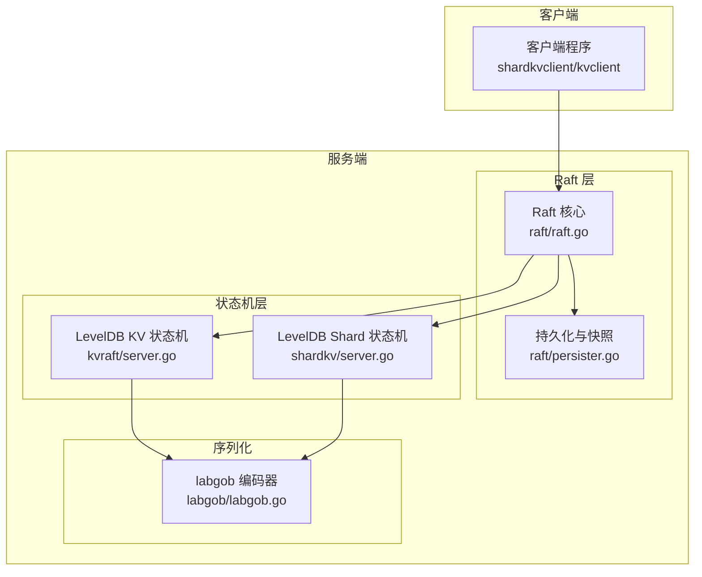
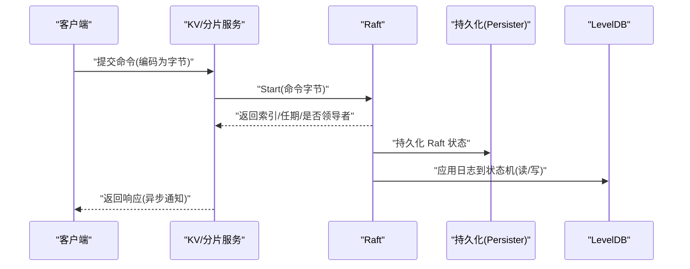
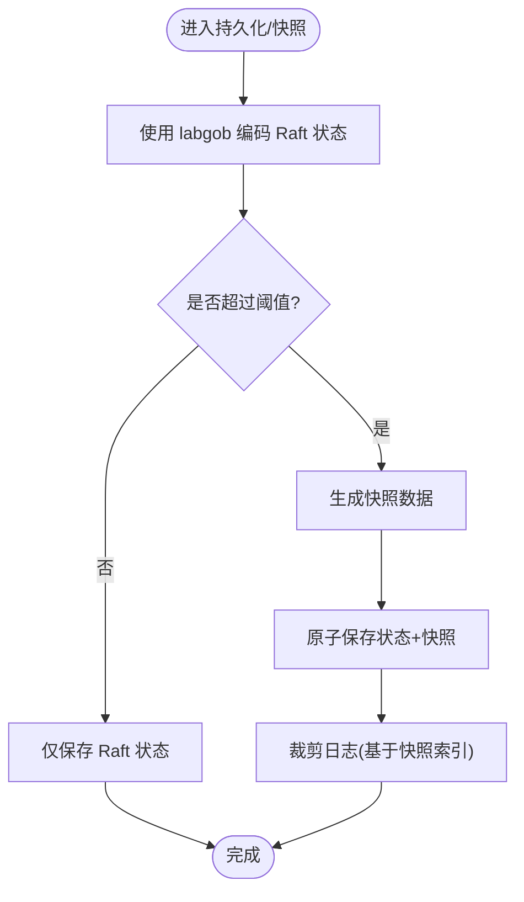
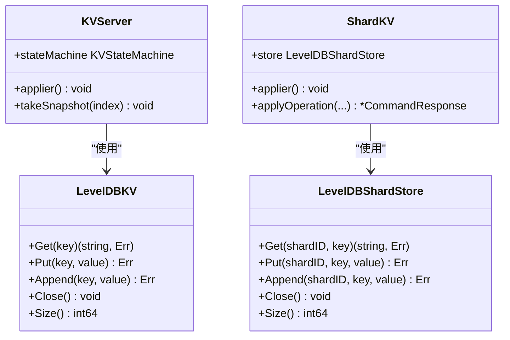
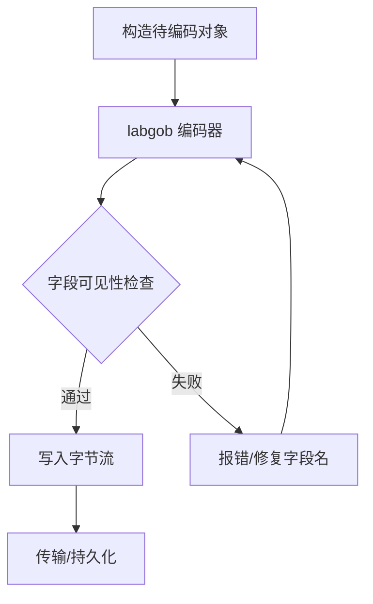
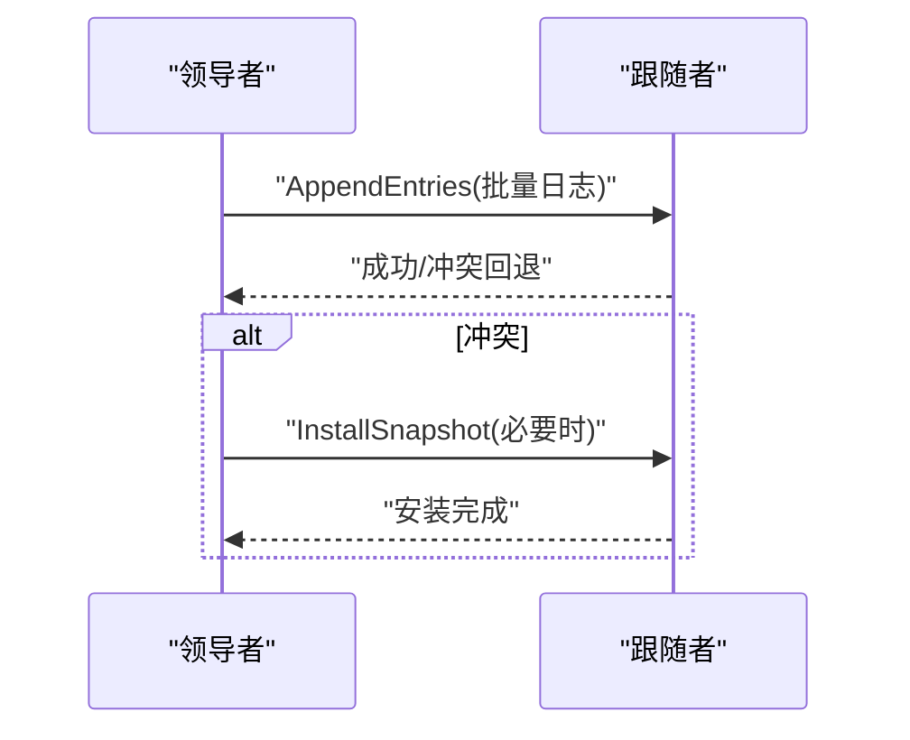
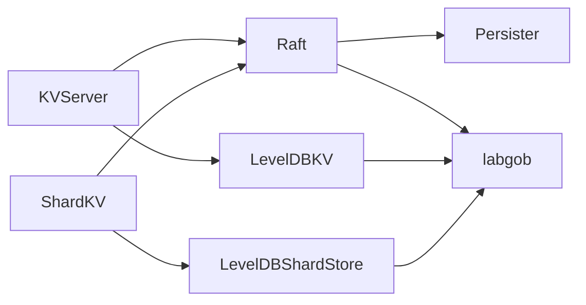

# 性能优化策略

**本文引用的文件**
- [README.md](file://README.md)
- [Benchmark.md](file://wiki/Benchmark.md)
- [raft/persister.go](file://raft/persister.go)
- [raft/config.go](file://raft/config.go)
- [labgob/labgob.go](file://labgob/labgob.go)
- [raft/raft.go](file://raft/raft.go)
- [shardkv/server.go](file://shardkv/server.go)
- [shardkv/config.go](file://shardkv/config.go)
- [kvraft/server.go](file://kvraft/server.go)
- [kvraft/config.go](file://kvraft/config.go)

## 目录
1. [简介](#简介)
2. [项目结构](#项目结构)
3. [核心组件](#核心组件)
4. [架构总览](#架构总览)
5. [详细组件分析](#详细组件分析)
6. [依赖关系分析](#依赖关系分析)
7. [性能考量与优化建议](#性能考量与优化建议)
8. [故障排查指南](#故障排查指南)
9. [结论](#结论)
10. [附录](#附录)

## 简介
本文件面向 eRaft 存储子系统，系统性梳理并总结其在存储性能方面的优化策略与实现要点，覆盖以下主题：
- LevelDB 性能调优参数（缓存大小、写缓冲区、压缩策略）与应用方式
- 数据序列化优化：使用 labgob 编码器降低序列化开销与错误风险
- 批量操作优化、预写日志（WAL）配置与磁盘 I/O 优化
- 内存管理策略、并发控制优化与锁粒度调整
- 性能监控指标、瓶颈识别方法与调优建议
- 存储容量规划、I/O 压力测试与性能基准测试方法
- 不同工作负载下的优化策略与最佳实践

## 项目结构
eRaft 采用分层模块化设计，存储性能优化主要集中在以下模块：
- Raft 持久化与快照：raft/persister.go、raft/raft.go
- KV 与 ShardKV 状态机：kvraft/server.go、shardkv/server.go
- 序列化工具：labgob/labgob.go
- 测试与基准：raft/config.go、shardkv/config.go、kvraft/config.go、wiki/Benchmark.md

**图表来源**
- [raft/raft.go](file://raft/raft.go#L36-L116)
- [raft/persister.go](file://raft/persister.go#L17-L110)
- [kvraft/server.go](file://kvraft/server.go#L25-L100)
- [shardkv/server.go](file://shardkv/server.go#L25-L100)
- [labgob/labgob.go](file://labgob/labgob.go#L24-L68)

**章节来源**
- [README.md](file://README.md#L6-L22)

## 核心组件
- Raft 持久化与快照
  - 使用 labgob 对 Raft 状态进行编码/解码，持久化到磁盘；支持原子保存 Raft 状态与快照。
  - 提供快照触发阈值（maxraftstate），避免日志无限增长。
- LevelDB 状态机
  - KVServer 与 ShardKVServer 将数据落盘至 LevelDB，提供 Get/Put/Append 接口与目录遍历统计存储大小。
- 序列化优化
  - labgob 在编码前对字段可见性进行检查，避免因小写字段导致的 RPC/持久化异常；统一使用 labgob 进行状态与命令序列化。

**章节来源**
- [raft/persister.go](file://raft/persister.go#L17-L110)
- [raft/raft.go](file://raft/raft.go#L85-L116)
- [kvraft/server.go](file://kvraft/server.go#L25-L100)
- [shardkv/server.go](file://shardkv/server.go#L25-L100)
- [labgob/labgob.go](file://labgob/labgob.go#L24-L68)

## 架构总览
下图展示从客户端请求到持久化的完整链路，以及关键性能优化点：

**图表来源**
- [raft/raft.go](file://raft/raft.go#L85-L116)
- [raft/persister.go](file://raft/persister.go#L71-L98)
- [kvraft/server.go](file://kvraft/server.go#L102-L139)
- [shardkv/server.go](file://shardkv/server.go#L110-L157)

## 详细组件分析

### 组件一：Raft 持久化与快照（Persister 与 Snapshot）
- 关键点
  - 使用 labgob 编码 Raft 状态（currentTerm、votedFor、logs），并以原子方式保存 Raft 状态与快照。
  - 快照触发条件：当 Raft 状态大小达到阈值（maxraftstate）时触发快照，随后裁剪日志。
  - 通过复制持久化对象，避免重启后旧实例覆盖新实例的状态。
- 性能影响
  - 快照可显著降低日志长度与持久化体积，提升稳定性与恢复速度。
  - 原子保存避免状态与快照不一致问题。

**图表来源**
- [raft/raft.go](file://raft/raft.go#L85-L116)
- [raft/raft.go](file://raft/raft.go#L150-L164)
- [raft/persister.go](file://raft/persister.go#L90-L98)

**章节来源**
- [raft/persister.go](file://raft/persister.go#L71-L110)
- [raft/raft.go](file://raft/raft.go#L85-L116)
- [raft/raft.go](file://raft/raft.go#L150-L164)

### 组件二：KV/分片状态机（LevelDB）
- 关键点
  - KVServer/分片服务均使用 LevelDB 作为底层存储，提供 Get/Put/Append 接口。
  - 通过迭代器遍历统计存储目录大小，用于容量监控与规划。
- 性能影响
  - LevelDB 的 LSM-Tree 结构适合高写入场景；结合快照与日志裁剪，可有效控制磁盘占用。
  - 迭代器扫描用于统计大小，注意在大目录上可能产生 I/O 压力。

**图表来源**
- [kvraft/server.go](file://kvraft/server.go#L25-L100)
- [shardkv/server.go](file://shardkv/server.go#L25-L100)
- [kvraft/server.go](file://kvraft/server.go#L176-L236)
- [shardkv/server.go](file://shardkv/server.go#L247-L326)

**章节来源**
- [kvraft/server.go](file://kvraft/server.go#L25-L100)
- [shardkv/server.go](file://shardkv/server.go#L25-L100)
- [kvraft/server.go](file://kvraft/server.go#L176-L236)
- [shardkv/server.go](file://shardkv/server.go#L247-L326)

### 组件三：序列化优化（labgob）
- 关键点
  - labgob 在编码/解码前后进行字段可见性检查与默认值警告，避免因小写字段导致的 RPC/持久化异常。
  - 统一使用 labgob 对 Raft 状态、快照、命令等进行序列化。
- 性能影响
  - 预防性检查减少运行期崩溃与回退重试，间接提升整体吞吐。
  - 通过集中式编码器，降低序列化成本与维护复杂度。

**图表来源**
- [labgob/labgob.go](file://labgob/labgob.go#L70-L115)
- [labgob/labgob.go](file://labgob/labgob.go#L34-L58)
- [raft/raft.go](file://raft/raft.go#L85-L116)

**章节来源**
- [labgob/labgob.go](file://labgob/labgob.go#L24-L68)
- [labgob/labgob.go](file://labgob/labgob.go#L70-L115)
- [raft/raft.go](file://raft/raft.go#L85-L116)

### 组件四：批量操作与复制优化
- 关键点
  - Raft 复制流程中，领导者通过心跳或批量日志复制，减少网络往返。
  - 分片迁移阶段，拉取/插入/删除分片数据时，使用迭代器批量读取与写入。
- 性能影响
  - 批量复制降低 RPC 次数与网络开销。
  - 分片拉取阶段按前缀迭代，减少不必要的键扫描。

**图表来源**
- [raft/raft.go](file://raft/raft.go#L353-L397)
- [raft/raft.go](file://raft/raft.go#L243-L275)

**章节来源**
- [raft/raft.go](file://raft/raft.go#L353-L397)
- [raft/raft.go](file://raft/raft.go#L243-L275)

## 依赖关系分析
- 组件耦合
  - KV/分片服务依赖 Raft 层提供的日志复制与快照能力。
  - Raft 层依赖 Persister 完成状态与快照的持久化。
  - 状态机依赖 LevelDB 实现数据读写。
  - labgob 作为统一序列化工具贯穿状态机与 Raft。
- 并发与锁
  - Raft 使用读写锁保护共享状态；KV/分片服务在执行命令时尽量避免持有锁，提高吞吐。
  - 通知通道按索引管理，异步释放以降低内存占用。

**图表来源**
- [kvraft/server.go](file://kvraft/server.go#L318-L341)
- [shardkv/server.go](file://shardkv/server.go#L263-L273)
- [raft/raft.go](file://raft/raft.go#L36-L116)
- [raft/persister.go](file://raft/persister.go#L71-L98)

**章节来源**
- [kvraft/server.go](file://kvraft/server.go#L318-L341)
- [shardkv/server.go](file://shardkv/server.go#L263-L273)
- [raft/raft.go](file://raft/raft.go#L36-L116)
- [raft/persister.go](file://raft/persister.go#L71-L98)

## 性能考量与优化建议

### LevelDB 性能调优参数与配置
- 缓存大小
  - 建议根据可用内存设置块缓存大小，优先保证热点数据驻留，减少磁盘随机读放大。
- 写缓冲区（Write Buffer）
  - 合理增大写缓冲可减少小写放大，但需平衡内存占用与刷盘频率。
- 压缩策略
  - 默认压缩已较高效；在高写入场景可考虑禁用或降低压缩级别以换取更低 CPU 开销。
- 文件级优化
  - 调整 SSTable 大小、层级压缩比例，避免过多层级导致读放大。
- 注意事项
  - 以上参数通常通过 LevelDB 选项配置；在当前代码中直接使用默认配置，如需调优可在初始化 LevelDB 时传入自定义选项。

### 数据序列化优化（labgob）
- 使用 labgob 编码器统一序列化 Raft 状态、快照与命令，避免手动拼装带来的错误与性能损失。
- 字段可见性检查可提前发现潜在问题，减少运行期崩溃与回退。

**章节来源**
- [labgob/labgob.go](file://labgob/labgob.go#L24-L68)
- [labgob/labgob.go](file://labgob/labgob.go#L70-L115)
- [raft/raft.go](file://raft/raft.go#L85-L116)

### 批量操作优化与 WAL 配置
- 批量复制
  - 利用 AppendEntries 批量发送日志条目，减少 RPC 次数与网络延迟。
- WAL 行为
  - LevelDB 本身具备 WAL 机制；确保同步写入策略与刷盘策略匹配业务一致性需求。
- I/O 优化
  - 合理设置刷盘策略（如批量刷盘）以提升写入吞吐；同时关注数据安全与崩溃恢复时间。

### 内存管理与并发控制
- 锁粒度
  - KV/分片服务在处理客户端请求时不长期持锁，仅在必要时加锁，提高并发吞吐。
  - 通知通道按索引管理并异步释放，降低内存占用。
- 快照与日志裁剪
  - 当 Raft 状态大小超过阈值时触发快照，随后裁剪日志，避免内存与磁盘压力持续增长。

**章节来源**
- [kvraft/server.go](file://kvraft/server.go#L102-L139)
- [shardkv/server.go](file://shardkv/server.go#L110-L157)
- [kvraft/server.go](file://kvraft/server.go#L238-L258)
- [raft/raft.go](file://raft/raft.go#L150-L164)

### 性能监控指标与瓶颈识别
- 指标
  - Raft 日志大小、快照大小、存储目录大小、RPC 数量、请求吞吐（ops/s）、最大日志索引等。
- 工具
  - 使用内置基准工具进行写入吞吐测试，并结合集群状态输出进行观测。
- 方法
  - 逐步增加并发与负载，观察日志大小增长速率、快照触发频率与磁盘 I/O 压力，定位瓶颈。

**章节来源**
- [raft/config.go](file://raft/config.go#L567-L581)
- [kvraft/config.go](file://kvraft/config.go#L422-L433)
- [shardkv/config.go](file://shardkv/config.go#L390-L395)
- [Benchmark.md](file://wiki/Benchmark.md#L8-L26)

### 存储容量规划与 I/O 压力测试
- 规划
  - 基于快照间隔与日志增长速率估算磁盘占用；预留快照与日志空间余量。
- 压力测试
  - 使用 bench 命令进行顺序写入压力测试，记录吞吐与延迟；在不同硬件（SSD/HDD）上对比表现。
- 基准测试
  - 在稳定拓扑下重复运行基准，统计平均吞吐与稳定性，作为调优依据。

**章节来源**
- [Benchmark.md](file://wiki/Benchmark.md#L8-L26)
- [kvraft/config.go](file://kvraft/config.go#L367-L398)
- [shardkv/config.go](file://shardkv/config.go#L350-L395)

### 不同工作负载下的优化策略
- 高写入/低读取
  - 增大写缓冲、适度放宽刷盘策略、启用快照与日志裁剪，降低写放大。
- 随机读写
  - 提升块缓存大小、合理设置压缩策略，平衡 CPU 与 I/O。
- 分片迁移
  - 控制拉取/插入/删除批次大小，避免一次性写入造成磁盘压力峰值。

## 故障排查指南
- 常见问题
  - 快照过期或落后：检查快照触发阈值与日志裁剪逻辑，确保快照安装正确。
  - 序列化异常：确认所有导出字段命名规范，避免小写字段导致的编码/解码失败。
  - 并发锁争用：检查是否在长时间持有锁，必要时缩短锁持有时间或拆分锁粒度。
- 排查步骤
  - 查看日志与状态输出，确认快照索引、最后应用索引与日志长度。
  - 使用基准工具复现问题，逐步缩小范围。

**章节来源**
- [raft/raft.go](file://raft/raft.go#L120-L164)
- [labgob/labgob.go](file://labgob/labgob.go#L70-L115)
- [kvraft/server.go](file://kvraft/server.go#L176-L236)
- [shardkv/server.go](file://shardkv/server.go#L247-L326)

## 结论
eRaft 在存储性能方面通过“快照+日志裁剪”、“统一序列化”、“批量复制”与“细粒度并发控制”等策略，实现了高吞吐与高可靠性的平衡。结合合理的 LevelDB 参数与 I/O 策略，可在不同工作负载下获得稳定性能。建议在生产环境中持续监控关键指标，按需调整快照阈值与 LevelDB 选项，并通过基准测试验证优化效果。

## 附录
- 快照触发条件
  - 当 Raft 状态大小达到阈值（maxraftstate）时触发快照。
- 监控接口
  - 通过配置对象的统计函数获取运行时指标，辅助性能分析与容量规划。

**章节来源**
- [kvraft/server.go](file://kvraft/server.go#L238-L258)
- [raft/config.go](file://raft/config.go#L567-L581)
- [shardkv/config.go](file://shardkv/config.go#L95-L110)