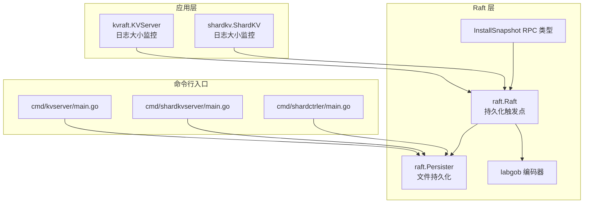
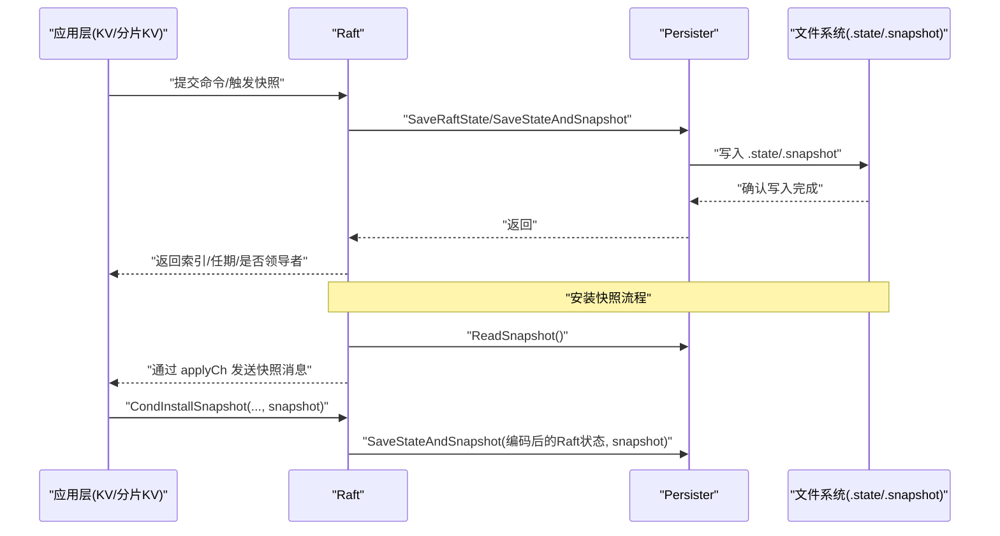
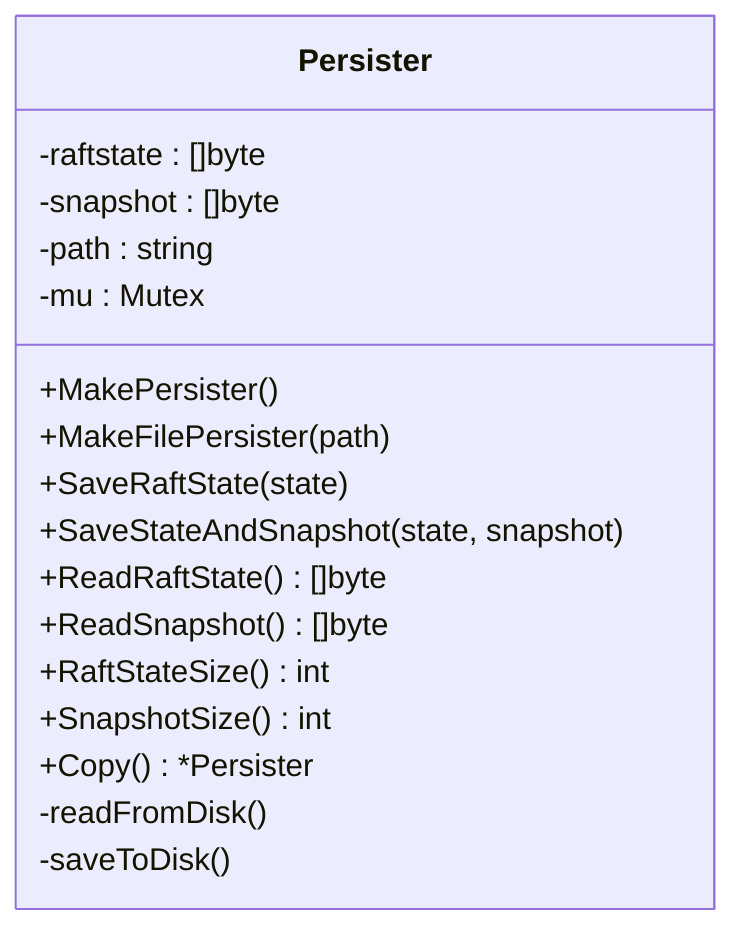
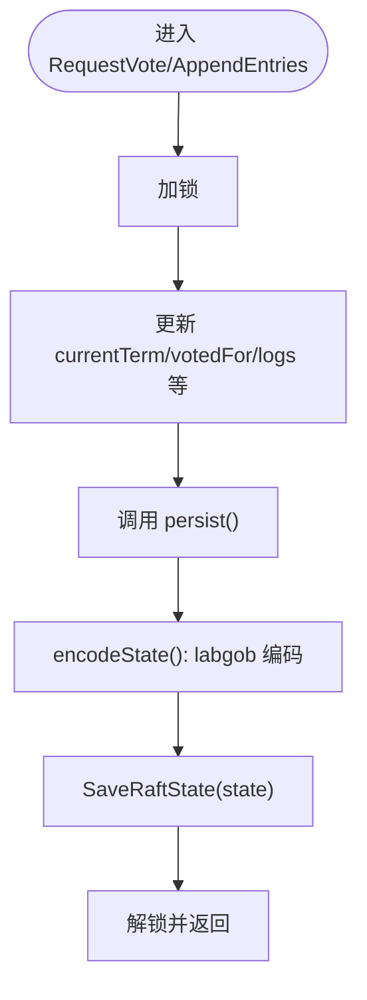
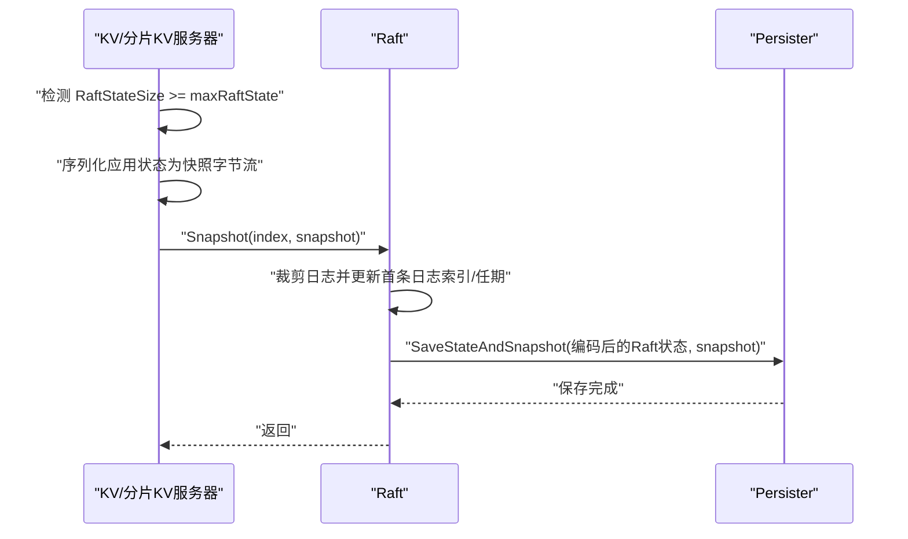
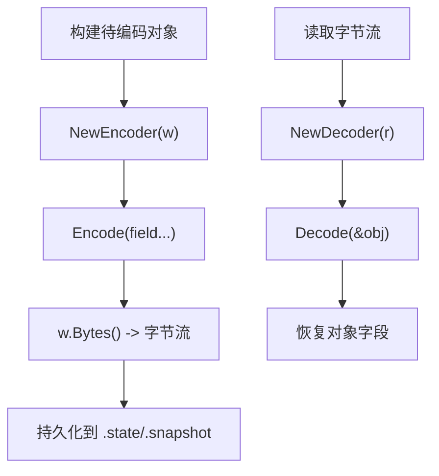
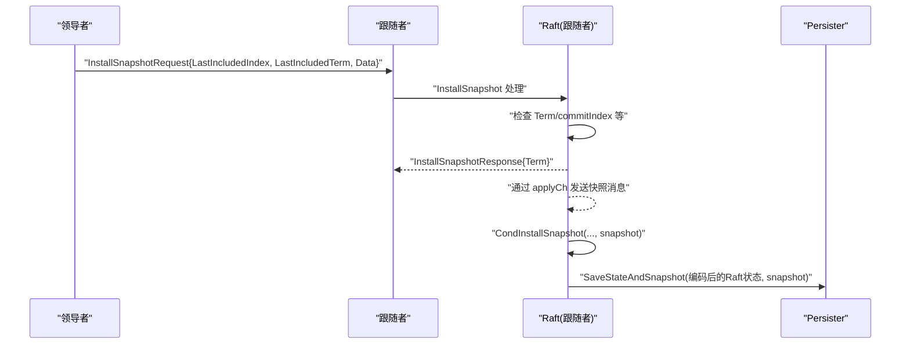
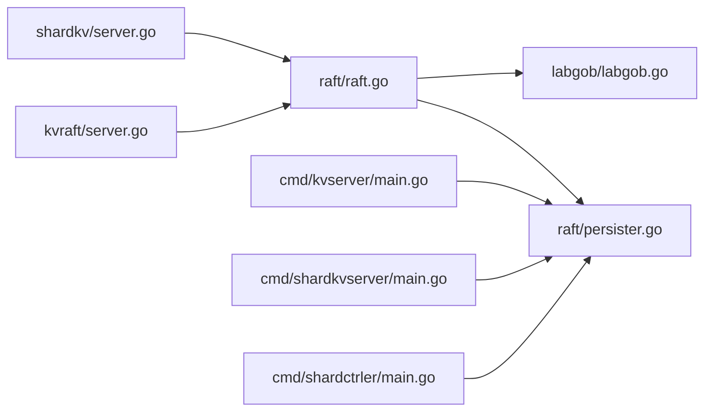

# 数据持久化策略

<cite>
**本文引用的文件**
- [raft/persister.go](file://raft/persister.go)
- [raft/raft.go](file://raft/raft.go)
- [labgob/labgob.go](file://labgob/labgob.go)
- [raft/config.go](file://raft/config.go)
- [kvraft/server.go](file://kvraft/server.go)
- [shardkv/server.go](file://shardkv/server.go)
- [cmd/kvserver/main.go](file://cmd/kvserver/main.go)
- [cmd/shardkvserver/main.go](file://cmd/shardkvserver/main.go)
- [cmd/shardctrler/main.go](file://cmd/shardctrler/main.go)
- [raft/rpc.go](file://raft/rpc.go)
</cite>

## 目录
1. [引言](#引言)
2. [项目结构](#项目结构)
3. [核心组件](#核心组件)
4. [架构总览](#架构总览)
5. [详细组件分析](#详细组件分析)
6. [依赖关系分析](#依赖关系分析)
7. [性能考量](#性能考量)
8. [故障排查指南](#故障排查指南)
9. [结论](#结论)
10. [附录](#附录)

## 引言
本文件系统性阐述 eRaft 中的数据持久化策略，覆盖 Raft 状态持久化与应用状态（快照）持久化两大层面。重点解析 Persister 接口的设计与实现、状态与快照的保存机制、labgob 编码器在序列化/反序列化中的作用、持久化触发条件与时机选择、磁盘空间管理与文件组织、备份与恢复策略、配置项与监控指标，以及一致性保障、崩溃恢复与数据完整性检查机制。

## 项目结构
围绕持久化的核心代码分布在以下模块：
- raft 层：Raft 核心状态、持久化接口 Persister、labgob 编码器、RPC 快照请求/响应类型
- 应用层：KV/分片 KV 服务器对 Raft 日志大小阈值的监控与触发快照
- 命令行入口：为每个节点创建带路径的文件型持久化器

图表来源
- [raft/raft.go](file://raft/raft.go#L85-L116)
- [raft/persister.go](file://raft/persister.go#L17-L111)
- [labgob/labgob.go](file://labgob/labgob.go#L24-L68)
- [raft/rpc.go](file://raft/rpc.go#L49-L67)
- [kvraft/server.go](file://kvraft/server.go#L93-L238)
- [shardkv/server.go](file://shardkv/server.go#L463-L485)
- [cmd/kvserver/main.go](file://cmd/kvserver/main.go#L30-L31)
- [cmd/shardkvserver/main.go](file://cmd/shardkvserver/main.go#L41-L42)
- [cmd/shardctrler/main.go](file://cmd/shardctrler/main.go#L37-L38)

章节来源
- [raft/raft.go](file://raft/raft.go#L85-L116)
- [raft/persister.go](file://raft/persister.go#L17-L111)
- [labgob/labgob.go](file://labgob/labgob.go#L24-L68)
- [raft/rpc.go](file://raft/rpc.go#L49-L67)
- [kvraft/server.go](file://kvraft/server.go#L93-L238)
- [shardkv/server.go](file://shardkv/server.go#L463-L485)
- [cmd/kvserver/main.go](file://cmd/kvserver/main.go#L30-L31)
- [cmd/shardkvserver/main.go](file://cmd/shardkvserver/main.go#L41-L42)
- [cmd/shardctrler/main.go](file://cmd/shardctrler/main.go#L37-L38)

## 核心组件
- Persister：封装 Raft 状态与快照的读写、复制与原子保存，支持基于路径的磁盘持久化。
- Raft：负责在关键事件后调用 Persister 持久化；通过 labgob 对状态进行编码/解码；处理安装快照 RPC 并协调上层应用。
- labgob：提供安全的 Gob 编码/解码，强制字段首字母大写以避免 RPC/持久化错误。
- KV/分片 KV 服务器：监控 Raft 日志大小，达到阈值时触发快照，将应用状态序列化到快照中。

章节来源
- [raft/persister.go](file://raft/persister.go#L17-L111)
- [raft/raft.go](file://raft/raft.go#L85-L116)
- [labgob/labgob.go](file://labgob/labgob.go#L24-L68)
- [kvraft/server.go](file://kvraft/server.go#L93-L238)
- [shardkv/server.go](file://shardkv/server.go#L463-L485)

## 架构总览
下图展示从应用层到 Raft 再到持久化的完整链路，以及快照安装流程。

图表来源
- [raft/raft.go](file://raft/raft.go#L85-L116)
- [raft/persister.go](file://raft/persister.go#L71-L110)
- [raft/raft.go](file://raft/raft.go#L146-L164)
- [raft/raft.go](file://raft/raft.go#L243-L275)

## 详细组件分析

### Persister 接口设计与实现
- 结构与职责
  - 存储 Raft 状态字节流与快照字节流，提供线程安全的读写与复制方法。
  - 支持基于路径的磁盘读取/写入，初始化时自动从磁盘加载历史状态。
- 关键方法
  - SaveRaftState：更新内存状态并落盘。
  - SaveStateAndSnapshot：原子保存 Raft 状态与快照，避免两者不同步。
  - ReadRaftState/ReadSnapshot：读取持久化内容。
  - RaftStateSize/SnapshotSize：查询持久化体积。
  - Copy：深拷贝当前持久化器，用于测试或重启时隔离旧实例。
- 线程安全
  - 使用互斥锁保护所有读写操作，确保并发安全。
- 文件组织
  - 当指定了路径时，持久化文件名为“路径.state”和“路径.snapshot”。

图表来源
- [raft/persister.go](file://raft/persister.go#L17-L111)

章节来源
- [raft/persister.go](file://raft/persister.go#L17-L111)

### Raft 状态持久化与序列化
- 触发点
  - RequestVote/AppendEntries 处理后统一调用 persist，确保关键元数据（当前任期、投票对象、日志）持久化。
  - 启动阶段从 Persister 读取上次持久化的 Raft 状态并初始化。
- 编码/解码
  - 使用 labgob 编码器将 currentTerm、votedFor、logs 等字段序列化为字节流。
  - 反序列化时逐字段解码，失败则记录调试信息。
- 一致性保障
  - 每次关键状态变更后立即持久化，结合日志裁剪与快照，保证崩溃后能恢复到一致状态。

图表来源
- [raft/raft.go](file://raft/raft.go#L166-L193)
- [raft/raft.go](file://raft/raft.go#L85-L116)

章节来源
- [raft/raft.go](file://raft/raft.go#L85-L116)
- [raft/raft.go](file://raft/raft.go#L89-L106)

### 应用状态持久化（快照）
- 触发条件
  - KV/分片 KV 服务器监控 Raft 日志大小，当超过阈值（maxRaftState）时触发快照。
  - 快照内容包含应用状态（如 KV 数据、分片状态、最后操作上下文等），由 labgob 编码。
- 保存流程
  - 生成快照字节流后调用 Raft.Snapshot(index, snapshot)，内部裁剪日志并调用 Persister.SaveStateAndSnapshot，确保状态与快照原子保存。
- 安装快照
  - 领导者通过 InstallSnapshot RPC 将快照发送给落后节点；落后节点通过 applyCh 通知上层，上层调用 Raft.CondInstallSnapshot 完成本地安装与状态恢复。

图表来源
- [kvraft/server.go](file://kvraft/server.go#L217-L238)
- [shardkv/server.go](file://shardkv/server.go#L463-L485)
- [raft/raft.go](file://raft/raft.go#L146-L164)
- [raft/raft.go](file://raft/raft.go#L90-L106)

章节来源
- [kvraft/server.go](file://kvraft/server.go#L93-L238)
- [shardkv/server.go](file://shardkv/server.go#L463-L485)
- [raft/raft.go](file://raft/raft.go#L146-L164)

### labgob 编码器与数据转换
- 设计目标
  - 强制结构体字段首字母大写，避免 RPC 或持久化时出现不可预期行为。
  - 在 Decode 前后进行默认值检查，防止覆盖非默认字段导致的错误。
- 使用方式
  - Raft 状态编码：encodeState 使用 labgob.NewEncoder 写入 currentTerm、votedFor、logs。
  - 快照编码：KV/分片 KV 服务器使用 labgob 编码应用状态。
  - 快照解码：上层在安装快照时使用 labgob 解码恢复应用状态。

图表来源
- [labgob/labgob.go](file://labgob/labgob.go#L24-L68)
- [raft/raft.go](file://raft/raft.go#L109-L116)
- [kvraft/server.go](file://kvraft/server.go#L217-L238)
- [shardkv/server.go](file://shardkv/server.go#L463-L485)

章节来源
- [labgob/labgob.go](file://labgob/labgob.go#L24-L68)
- [raft/raft.go](file://raft/raft.go#L109-L116)
- [kvraft/server.go](file://kvraft/server.go#L217-L238)
- [shardkv/server.go](file://shardkv/server.go#L463-L485)

### 快照安装与一致性校验
- 安装流程
  - 领导者检测落后节点日志缺失，构造 InstallSnapshotRequest 并发送。
  - 落后节点通过 applyCh 通知上层，上层调用 Raft.CondInstallSnapshot 进行合法性检查与状态更新。
- 合法性检查
  - 若快照包含的日志索引已落后于 commitIndex，则拒绝。
  - 更新日志数组与首条日志的索引/任期，随后原子保存状态与快照。
- 一致性保障
  - 仅当快照对应的索引/任期在当前任期中有效时才接受，避免过期快照破坏一致性。

图表来源
- [raft/raft.go](file://raft/raft.go#L243-L275)
- [raft/raft.go](file://raft/raft.go#L118-L144)
- [raft/rpc.go](file://raft/rpc.go#L49-L67)

章节来源
- [raft/raft.go](file://raft/raft.go#L243-L275)
- [raft/raft.go](file://raft/raft.go#L118-L144)
- [raft/rpc.go](file://raft/rpc.go#L49-L67)

### 磁盘空间管理、文件组织与备份恢复
- 文件组织
  - 每个节点以“路径.state”和“路径.snapshot”命名持久化文件，便于按节点区分。
- 空间管理
  - 通过 maxRaftState 配置控制日志增长阈值，达到阈值即触发快照，减少日志长度与 .state 文件体积。
  - 快照安装后裁剪日志，释放磁盘空间。
- 备份与恢复
  - 测试框架在节点崩溃时复制 Persister 的内容，重启后传入 Make() 初始化 Raft，从而恢复状态。
  - 支持在不覆盖新实例持久化内容的前提下，安全地传递最后持久化状态。

章节来源
- [raft/persister.go](file://raft/persister.go#L28-L54)
- [raft/config.go](file://raft/config.go#L109-L139)
- [raft/config.go](file://raft/config.go#L238-L287)
- [kvraft/server.go](file://kvraft/server.go#L93-L238)
- [shardkv/server.go](file://shardkv/server.go#L463-L485)

### 配置选项、监控指标与故障恢复
- 配置选项
  - maxRaftState：应用层快照触发阈值（字节）。-1 表示禁用快照。
  - Snapshot 间隔：测试框架中通过固定周期触发快照（例如每 10 条日志一次）。
- 监控指标
  - RaftStateSize：当前持久化状态大小，用于判断是否需要快照。
  - 日志大小：测试框架提供 LogSize 统计最大日志大小。
- 故障恢复
  - 节点崩溃后重启：使用 MakeFilePersister 创建持久化器并自动读取磁盘状态；测试框架在重启前复制旧实例的持久化内容，避免覆盖新状态。
  - 快照安装：落后节点通过 CondInstallSnapshot 安装最新快照，快速追赶。

章节来源
- [kvraft/server.go](file://kvraft/server.go#L93-L238)
- [shardkv/server.go](file://shardkv/server.go#L463-L485)
- [raft/config.go](file://raft/config.go#L183-L236)
- [raft/config.go](file://raft/config.go#L583-L593)
- [raft/config.go](file://raft/config.go#L109-L139)
- [raft/config.go](file://raft/config.go#L238-L287)

## 依赖关系分析
- 组件耦合
  - Raft 依赖 Persister 进行状态持久化；依赖 labgob 进行编码/解码。
  - KV/分片 KV 服务器依赖 Raft 的快照接口与日志大小监控。
  - 命令行入口负责为每个节点创建文件型 Persister。
- 外部依赖
  - labgob 提供 Gob 编解码与字段命名检查。
  - 测试框架提供网络模拟、崩溃/重启与统计功能。

图表来源
- [kvraft/server.go](file://kvraft/server.go#L93-L238)
- [shardkv/server.go](file://shardkv/server.go#L463-L485)
- [raft/raft.go](file://raft/raft.go#L85-L116)
- [raft/persister.go](file://raft/persister.go#L17-L111)
- [labgob/labgob.go](file://labgob/labgob.go#L24-L68)
- [cmd/kvserver/main.go](file://cmd/kvserver/main.go#L30-L31)
- [cmd/shardkvserver/main.go](file://cmd/shardkvserver/main.go#L41-L42)
- [cmd/shardctrler/main.go](file://cmd/shardctrler/main.go#L37-L38)

章节来源
- [kvraft/server.go](file://kvraft/server.go#L93-L238)
- [shardkv/server.go](file://shardkv/server.go#L463-L485)
- [raft/raft.go](file://raft/raft.go#L85-L116)
- [raft/persister.go](file://raft/persister.go#L17-L111)
- [labgob/labgob.go](file://labgob/labgob.go#L24-L68)
- [cmd/kvserver/main.go](file://cmd/kvserver/main.go#L30-L31)
- [cmd/shardkvserver/main.go](file://cmd/shardkvserver/main.go#L41-L42)
- [cmd/shardctrler/main.go](file://cmd/shardctrler/main.go#L37-L38)

## 性能考量
- 持久化频率与开销
  - RequestVote/AppendEntries 后立即持久化，确保关键元数据安全；但频繁写盘可能带来 I/O 压力。
  - 建议通过合理的 maxRaftState 阈值平衡快照频率与日志长度。
- 快照与日志裁剪
  - 快照可显著降低日志长度，减少后续持久化与网络传输成本。
  - 安装快照时通过 CondInstallSnapshot 原子保存状态与快照，避免不一致。
- 编解码效率
  - labgob 编解码在应用层触发，建议避免在高频路径中重复编码大对象。
- 并发与锁粒度
  - Persister 使用细粒度互斥锁；Raft 在持久化前后加锁，注意避免长时间持有锁。

[本节为通用性能讨论，无需特定文件来源]

## 故障排查指南
- 常见问题
  - 字段命名小写导致的持久化/RPC 错误：labgob 会在编解码时发出警告或错误，需确保结构体字段首字母大写。
  - 快照过期：CondInstallSnapshot 会拒绝落后于 commitIndex 的快照，需检查日志追平逻辑。
  - I/O 失败：磁盘写入失败会导致持久化失败，应检查磁盘权限与空间。
- 调试建议
  - 使用 DPrintf 输出持久化前后状态，定位异常点。
  - 在测试框架中观察 LogSize 与快照触发频率，评估阈值设置是否合理。
  - 检查崩溃重启后是否正确读取 .state/.snapshot。

章节来源
- [labgob/labgob.go](file://labgob/labgob.go#L70-L115)
- [raft/raft.go](file://raft/raft.go#L118-L144)
- [raft/config.go](file://raft/config.go#L583-L593)

## 结论
eRaft 的持久化策略以 Persister 为核心，结合 labgob 编解码与 Raft 的关键事件持久化，实现了可靠的崩溃恢复与一致性保障。应用层通过阈值驱动的快照机制进一步优化了长期运行的稳定性与性能。通过合理的配置与监控，可在生产环境中获得稳健的数据持久化体验。

[本节为总结性内容，无需特定文件来源]

## 附录
- 关键 API 路径参考
  - Persister 方法：[raft/persister.go](file://raft/persister.go#L71-L110)
  - Raft 持久化与快照：[raft/raft.go](file://raft/raft.go#L85-L116), [raft/raft.go](file://raft/raft.go#L146-L164), [raft/raft.go](file://raft/raft.go#L118-L144)
  - labgob 编解码：[labgob/labgob.go](file://labgob/labgob.go#L24-L68)
  - 应用层快照触发：[kvraft/server.go](file://kvraft/server.go#L217-L238), [shardkv/server.go](file://shardkv/server.go#L463-L485)
  - 命令行入口持久化器创建：[cmd/kvserver/main.go](file://cmd/kvserver/main.go#L30-L31), [cmd/shardkvserver/main.go](file://cmd/shardkvserver/main.go#L41-L42), [cmd/shardctrler/main.go](file://cmd/shardctrler/main.go#L37-L38)