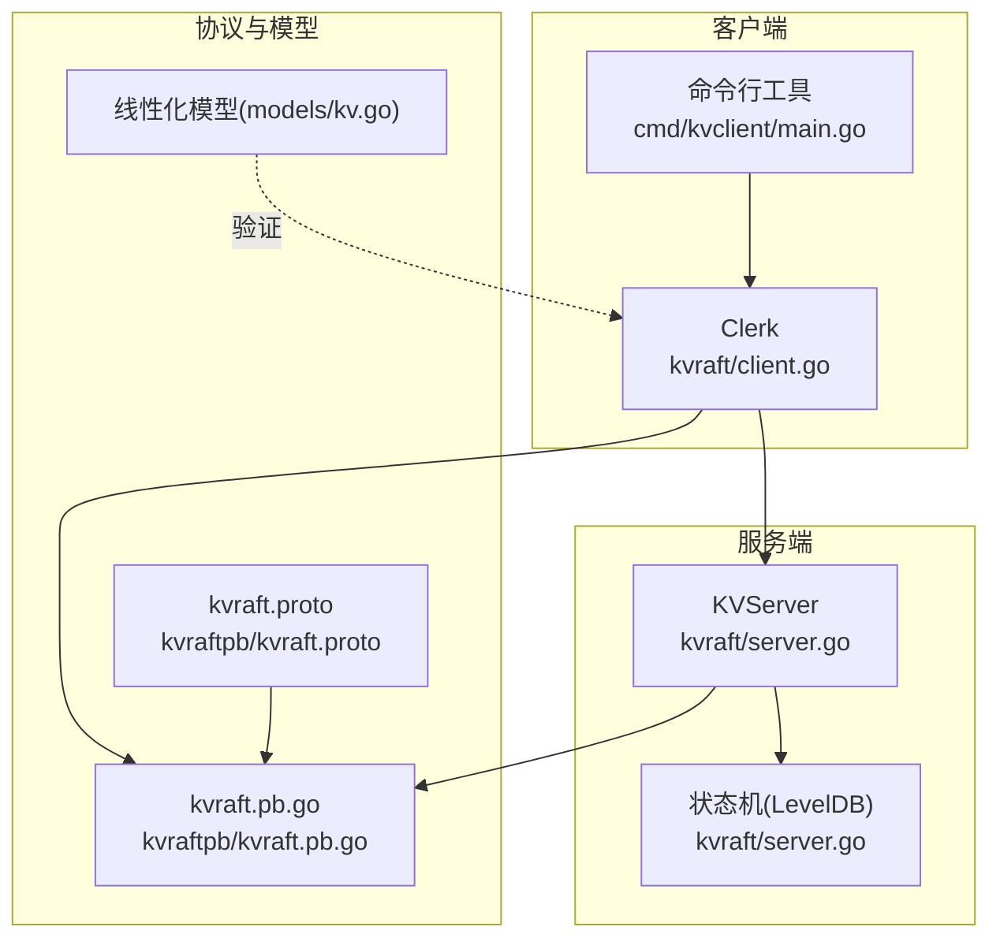
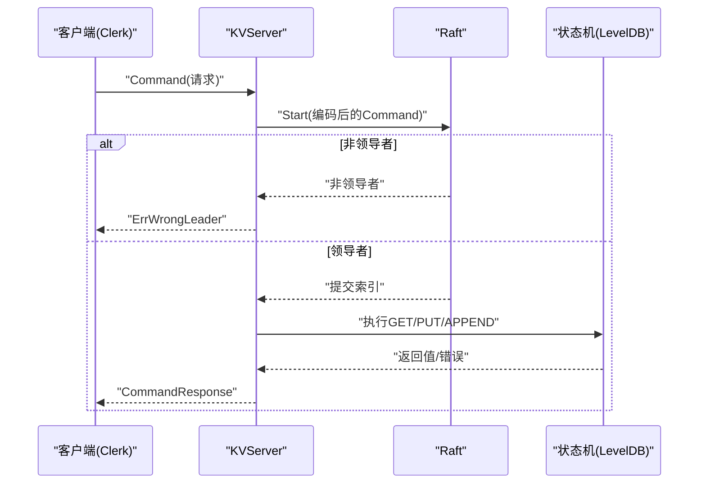
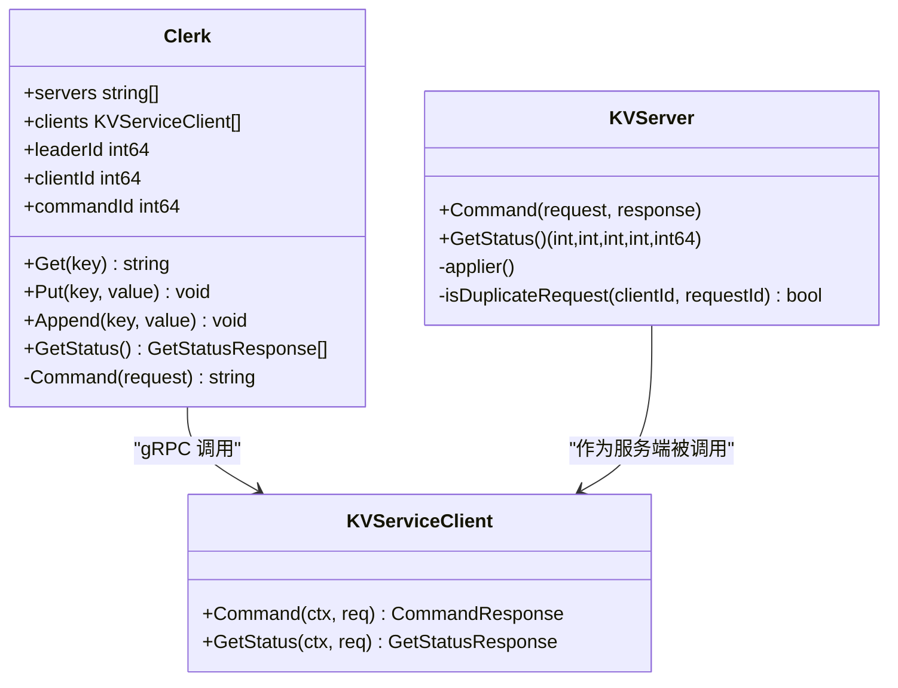

# KV 客户端

**本文引用的文件**
- [kvraft/client.go](file://kvraft/client.go)
- [cmd/kvclient/main.go](file://cmd/kvclient/main.go)
- [kvraft/common.go](file://kvraft/common.go)
- [kvraft/config.go](file://kvraft/config.go)
- [kvraft/server.go](file://kvraft/server.go)
- [kvraftpb/kvraft.proto](file://kvraftpb/kvraft.proto)
- [kvraftpb/kvraft.pb.go](file://kvraftpb/kvraft.pb.go)
- [models/kv.go](file://models/kv.go)
- [kvraft/test_test.go](file://kvraft/test_test.go)

## 目录
1. [简介](#简介)
2. [项目结构](#项目结构)
3. [核心组件](#核心组件)
4. [架构总览](#架构总览)
5. [组件详解](#组件详解)
6. [依赖关系分析](#依赖关系分析)
7. [性能与优化](#性能与优化)
8. [故障排查指南](#故障排查指南)
9. [结论](#结论)
10. [附录：命令行工具与参数](#附录命令行工具与参数)

## 简介
本文件面向 eRaft 项目中的 KV 客户端，提供从初始化、连接管理、基本操作（GET、PUT、APPEND）、状态查询到重试机制、错误处理、超时设置、命令行工具使用、性能优化与最佳实践的完整说明。读者可据此快速上手 KV 客户端，并在生产环境中安全地集成与调优。

## 项目结构
KV 客户端位于 kvraft 包中，通过 gRPC 与 KV 服务交互；同时提供一个命令行工具 kvclient 用于快速验证与演示。KV 服务端实现 Raft 状态机，负责持久化存储与线性一致性保障。

图表来源
- [kvraft/client.go](file://kvraft/client.go#L16-L46)
- [cmd/kvclient/main.go](file://cmd/kvclient/main.go#L11-L46)
- [kvraft/server.go](file://kvraft/server.go#L88-L100)
- [kvraftpb/kvraft.proto](file://kvraftpb/kvraft.proto#L1-L41)
- [kvraftpb/kvraft.pb.go](file://kvraftpb/kvraft.pb.go#L72-L200)
- [models/kv.go](file://models/kv.go#L20-L72)

章节来源
- [kvraft/client.go](file://kvraft/client.go#L1-L144)
- [cmd/kvclient/main.go](file://cmd/kvclient/main.go#L1-L47)
- [kvraft/server.go](file://kvraft/server.go#L1-L200)
- [kvraftpb/kvraft.proto](file://kvraftpb/kvraft.proto#L1-L41)
- [kvraftpb/kvraft.pb.go](file://kvraftpb/kvraft.pb.go#L1-L200)
- [models/kv.go](file://models/kv.go#L1-L73)

## 核心组件
- Clerk 客户端：封装连接、请求发送、重试与幂等控制。
- KVService gRPC 接口：定义 Command 与 GetStatus 两个 RPC。
- KVServer 服务端：基于 Raft 的状态机，负责日志提交、应用与响应。
- 线性化模型：用于验证历史操作的线性一致性。

章节来源
- [kvraft/client.go](file://kvraft/client.go#L16-L46)
- [kvraftpb/kvraft.proto](file://kvraftpb/kvraft.proto#L37-L40)
- [kvraft/server.go](file://kvraft/server.go#L88-L100)
- [models/kv.go](file://models/kv.go#L20-L72)

## 架构总览
KV 客户端通过 gRPC 连接多个 KV 服务端实例，内部维护 leaderId 指针与自增的 commandId，以支持幂等与领导者切换。服务端通过 Raft 提交日志到状态机，返回结果或错误码。

图表来源
- [kvraft/client.go](file://kvraft/client.go#L121-L143)
- [kvraft/server.go](file://kvraft/server.go#L102-L139)
- [kvraftpb/kvraft.proto](file://kvraftpb/kvraft.proto#L13-L24)

章节来源
- [kvraft/client.go](file://kvraft/client.go#L121-L143)
- [kvraft/server.go](file://kvraft/server.go#L102-L139)
- [kvraftpb/kvraft.proto](file://kvraftpb/kvraft.proto#L13-L24)

## 组件详解

### 1) 客户端初始化与连接管理
- 初始化参数
  - 服务器地址列表：字符串切片，形如 "host:port" 列表。
  - 内部生成唯一 clientId，每个请求携带 (clientId, commandId) 唯一标识一次操作。
  - leaderId 默认从 0 开始，按顺序轮询尝试。
- 连接管理
  - gRPC 客户端：对每个地址建立连接并缓存为 KVServiceClient。
  - 实验模式：支持 labrpc 客户端包装，便于测试网络环境。
- 关键函数
  - MakeClerk：根据地址列表创建 Clerk。
  - MakeLabrpcClerk：基于 labrpc ClientEnd 创建 Clerk。
  - GetStatus：向所有后端并发查询状态，带短超时。

章节来源
- [kvraft/client.go](file://kvraft/client.go#L30-L46)
- [kvraft/client.go](file://kvraft/client.go#L74-L87)
- [kvraft/client.go](file://kvraft/client.go#L100-L113)

### 2) 基本操作：GET、PUT、APPEND
- GET：构造 OpGet 请求，返回当前值。
- PUT：构造 OpPut 请求，写入新值。
- APPEND：构造 OpAppend 请求，追加到现有值末尾。
- 幂等与去重
  - 每个 Clerk 维护自增的 commandId，服务端通过 clientId 和 commandId 去重。
  - 服务端记录每个客户端的最大已应用 commandId，重复请求直接返回上次响应。

章节来源
- [kvraft/client.go](file://kvraft/client.go#L89-L98)
- [kvraft/common.go](file://kvraft/common.go#L72-L87)
- [kvraft/server.go](file://kvraft/server.go#L102-L146)

### 3) 状态查询：GetStatus
- 功能：并发向所有后端节点发起 GetStatus 请求，汇总节点状态。
- 超时：每个请求使用短超时上下文，避免阻塞。
- 返回字段：节点 ID、角色、任期、最后应用索引、提交索引、存储大小等。

章节来源
- [kvraft/client.go](file://kvraft/client.go#L100-L113)
- [kvraftpb/kvraft.proto](file://kvraftpb/kvraft.proto#L26-L35)

### 4) 重试机制与错误处理
- 重试策略
  - 当收到 ErrWrongLeader 或 ErrTimeout，客户端切换到下一个后端（循环轮询）。
  - 每次切换等待短暂延迟，避免紧循环。
- 错误类型
  - OK：成功。
  - ErrNoKey：键不存在（GET）。
  - ErrWrongLeader：当前节点不是领导者。
  - ErrTimeout：请求超时或等待响应超时。
- 超时设置
  - 执行超时：客户端侧对单次 Command 请求设置超时。
  - 状态查询超时：GetStatus 对每个后端单独设置短超时。

章节来源
- [kvraft/client.go](file://kvraft/client.go#L121-L143)
- [kvraft/common.go](file://kvraft/common.go#L49-L70)
- [kvraft/common.go](file://kvraft/common.go#L9)
- [kvraft/server.go](file://kvraft/server.go#L126-L131)

### 5) 服务端处理流程
- 去重检查：若非 GET 且命中重复请求，直接返回上次响应。
- 日志提交：将编码后的 Command 发送给 Raft，获取提交索引。
- 非领导者：立即返回 ErrWrongLeader。
- 响应等待：通过通知通道等待应用结果；超时则返回 ErrTimeout。
- 通知通道回收：异步清理过期通知通道，降低内存占用。

章节来源
- [kvraft/server.go](file://kvraft/server.go#L102-L139)

### 6) 协议与数据模型
- KVService 接口
  - Command：执行键值操作。
  - GetStatus：查询节点状态。
- 数据结构
  - CommandRequest/CommandResponse：包含键、值、操作类型、客户端与命令序号。
  - GetStatusResponse：包含节点元信息与存储统计。

章节来源
- [kvraftpb/kvraft.proto](file://kvraftpb/kvraft.proto#L13-L35)
- [kvraftpb/kvraft.pb.go](file://kvraftpb/kvraft.pb.go#L72-L200)

### 7) 测试与线性化模型
- 测试用例：封装了 Get/Put/Append 的计数与时间戳，便于性能评估与线性化检查。
- 线性化模型：按键分区，定义初始状态、步骤转移与描述，用于验证历史操作序列是否满足线性一致性。

章节来源
- [kvraft/test_test.go](file://kvraft/test_test.go#L44-L92)
- [models/kv.go](file://models/kv.go#L20-L72)

## 依赖关系分析

图表来源
- [kvraft/client.go](file://kvraft/client.go#L16-L46)
- [kvraft/server.go](file://kvraft/server.go#L88-L100)
- [kvraftpb/kvraft.pb.go](file://kvraftpb/kvraft.pb.go#L72-L200)

章节来源
- [kvraft/client.go](file://kvraft/client.go#L16-L46)
- [kvraft/server.go](file://kvraft/server.go#L88-L100)
- [kvraftpb/kvraft.pb.go](file://kvraftpb/kvraft.pb.go#L72-L200)

## 性能与优化
- 连接复用：客户端对每个后端地址建立一次 gRPC 连接并复用，减少握手开销。
- 并发状态查询：GetStatus 对所有后端并发查询，缩短整体等待时间。
- 通知通道回收：服务端异步释放过期通知通道，降低内存占用。
- 去重与幂等：通过 (clientId, commandId) 去重，避免重复提交带来的额外负载。
- 超时与退避：客户端在错误或超时时轮询下一个后端，并有短暂延迟，避免 CPU 空转。
- 线性化验证：使用线性化模型对历史操作进行验证，确保系统行为正确。

章节来源
- [kvraft/client.go](file://kvraft/client.go#L100-L113)
- [kvraft/server.go](file://kvraft/server.go#L126-L139)
- [models/kv.go](file://models/kv.go#L20-L72)

## 故障排查指南
- 常见错误
  - ErrWrongLeader：当前节点不是领导者，客户端会自动切换到下一个后端重试。
  - ErrTimeout：请求或等待响应超时，建议检查网络连通性与服务端负载。
  - ErrNoKey：键不存在（GET），需确认键是否存在或是否已被删除。
- 排查步骤
  - 使用命令行工具 status 查看各节点状态，定位离线或异常节点。
  - 检查客户端地址列表是否正确、端口可达、证书/加密配置一致。
  - 观察服务端日志与 Raft 状态，确认领导者选举与日志提交情况。
- 调试技巧
  - 启用 Debug 输出（如需要）观察请求/响应路径。
  - 在高并发场景下，适当增加客户端数量与后端节点数，观察吞吐与延迟变化。
  - 使用线性化模型对历史操作进行验证，定位并发问题。

章节来源
- [kvraft/common.go](file://kvraft/common.go#L49-L70)
- [kvraft/client.go](file://kvraft/client.go#L121-L143)
- [cmd/kvclient/main.go](file://cmd/kvclient/main.go#L31-L42)

## 结论
eRaft 的 KV 客户端提供了简洁而健壮的键值访问能力：通过 gRPC 与 Raft 服务端协作，结合幂等与去重机制，保证在领导者切换与网络波动下的可靠性。配合命令行工具与线性化模型，开发者可以快速完成集成、验证与优化。

## 附录：命令行工具与参数
- 工具名称：kvclient
- 主要参数
  - -addrs：逗号分隔的服务器地址列表，默认示例地址。
  - -op：操作类型，支持 get、put、append、status。
  - -key：键名。
  - -value：值（仅 put/append 使用）。
- 使用示例
  - 获取键值：kvclient -addrs "localhost:5001,localhost:5002,localhost:5003" -op get -key foo
  - 写入键值：kvclient -addrs "localhost:5001,localhost:5002,localhost:5003" -op put -key foo -value bar
  - 追加键值：kvclient -addrs "localhost:5001,localhost:5002,localhost:5003" -op append -key foo -value baz
  - 查询集群状态：kvclient -addrs "localhost:5001,localhost:5002,localhost:5003" -op status

章节来源
- [cmd/kvclient/main.go](file://cmd/kvclient/main.go#L11-L46)