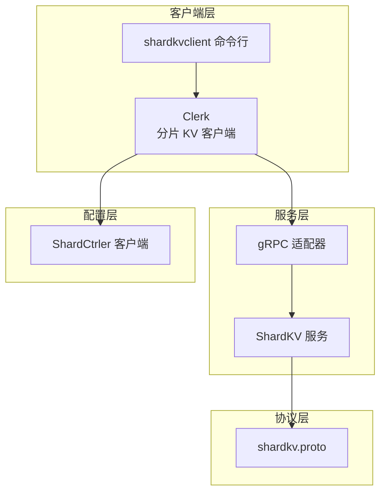
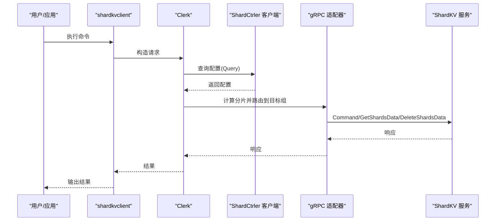
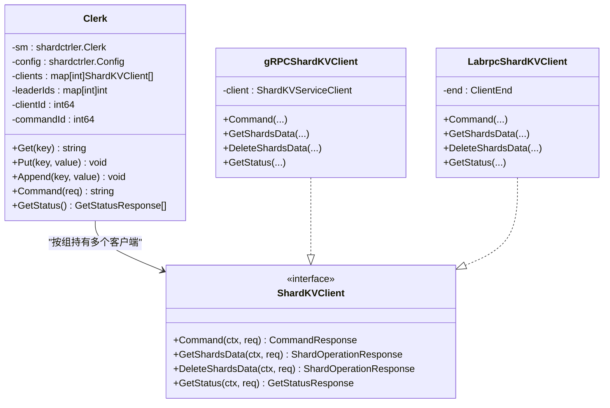
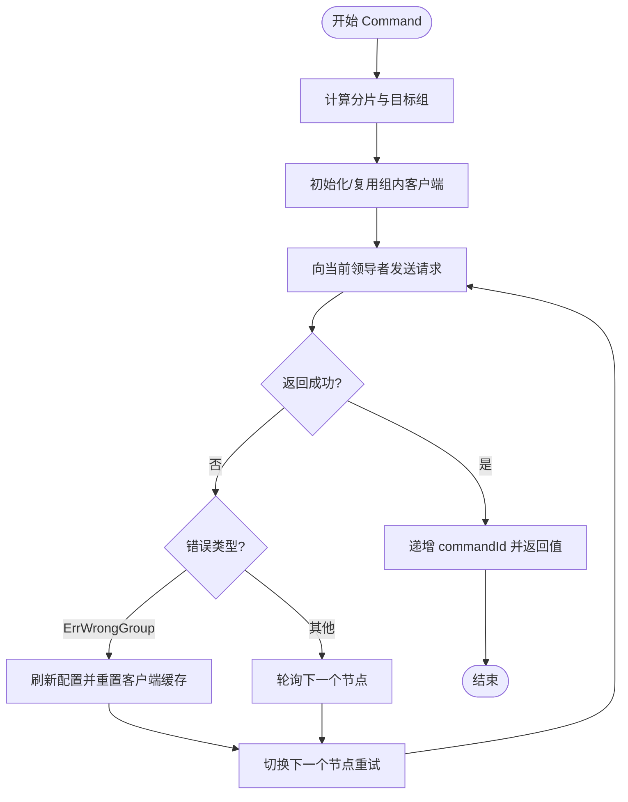
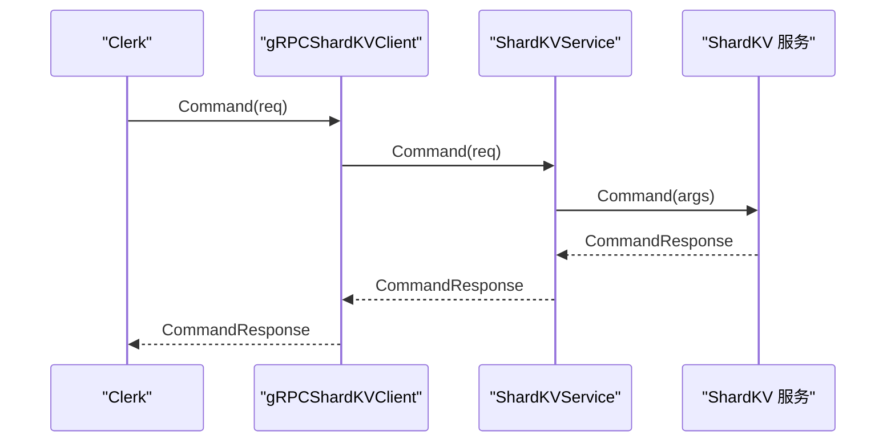
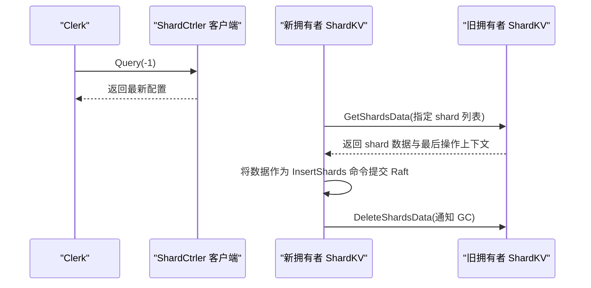
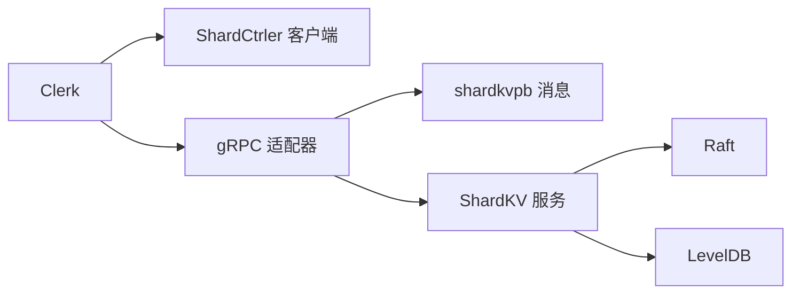

# 分片 KV 客户端

**本文引用的文件**
- [shardkv/client.go](file://shardkv/client.go)
- [cmd/shardkvclient/main.go](file://cmd/shardkvclient/main.go)
- [shardkv/common.go](file://shardkv/common.go)
- [shardkv/config.go](file://shardkv/config.go)
- [shardkv/grpc_server.go](file://shardkv/grpc_server.go)
- [shardkv/server.go](file://shardkv/server.go)
- [shardctrler/client.go](file://shardctrler/client.go)
- [shardkvpb/shardkv.proto](file://shardkvpb/shardkv.proto)
- [README.md](file://README.md)
- [wiki/Sharding-Mechanism.md](file://wiki/Sharding-Mechanism.md)
- [wiki/Architecture.md](file://wiki/Architecture.md)

## 目录
1. [简介](#简介)
2. [项目结构](#项目结构)
3. [核心组件](#核心组件)
4. [架构总览](#架构总览)
5. [详细组件分析](#详细组件分析)
6. [依赖关系分析](#依赖关系分析)
7. [性能与调优](#性能与调优)
8. [故障排查指南](#故障排查指南)
9. [结论](#结论)
10. [附录：使用示例与最佳实践](#附录使用示例与最佳实践)

## 简介
本文件面向开发者与运维人员，系统性介绍 eRaft 分片 KV 客户端（ShardKV Clerk）的设计与使用。内容覆盖：
- 分布式键值操作、分片路由与配置查询
- 客户端如何感知分片、自动路由与故障转移
- 完整的使用示例（命令行工具与基本 API）
- 配置项、连接池管理与性能调优建议
- 分布式事务支持与一致性保证
- 集成指南与常见问题排查

## 项目结构
本仓库采用按领域模块划分的组织方式，分片 KV 客户端位于 shardkv 子目录，配套有配置控制器（shardctrler）、Raft 实现、gRPC 协议定义等。命令行入口位于 cmd 目录，文档位于 wiki 目录。

图表来源
- [shardkv/client.go](file://shardkv/client.go#L151-L310)
- [cmd/shardkvclient/main.go](file://cmd/shardkvclient/main.go#L1-L106)
- [shardkv/grpc_server.go](file://shardkv/grpc_server.go#L1-L98)
- [shardkvpb/shardkv.proto](file://shardkvpb/shardkv.proto#L1-L66)

章节来源
- [README.md](file://README.md#L1-L139)

## 核心组件
- Clerk：分片 KV 客户端，负责根据键计算分片、查询配置、路由到正确的组、执行操作、处理错误与重试。
- ShardCtrler 客户端：用于查询当前或历史配置、发起加入/离开/迁移等控制命令。
- gRPC 适配器：将内部请求/响应转换为 protobuf 消息，供客户端与服务端通信。
- ShardKV 服务：存储层，维护分片状态、持久化与 Raft 应用逻辑。
- 命令行工具：shardkvclient 提供 get/put/append/status/bench 等常用操作。

章节来源
- [shardkv/client.go](file://shardkv/client.go#L151-L310)
- [shardkv/common.go](file://shardkv/common.go#L21-L229)
- [shardkv/grpc_server.go](file://shardkv/grpc_server.go#L1-L98)
- [shardkv/server.go](file://shardkv/server.go#L76-L108)
- [shardctrler/client.go](file://shardctrler/client.go#L21-L200)
- [shardkvpb/shardkv.proto](file://shardkvpb/shardkv.proto#L1-L66)

## 架构总览
下图展示了从客户端到服务端的关键交互路径，以及配置控制器在其中的作用。

图表来源
- [cmd/shardkvclient/main.go](file://cmd/shardkvclient/main.go#L14-L95)
- [shardkv/client.go](file://shardkv/client.go#L165-L265)
- [shardctrler/client.go](file://shardctrler/client.go#L125-L197)
- [shardkv/grpc_server.go](file://shardkv/grpc_server.go#L18-L97)

## 详细组件分析

### Clerk 组件（分片感知与自动路由）
Clerk 是分片 KV 客户端的核心，负责：
- 键到分片映射：通过 key2shard 计算 shardID
- 配置查询：向 ShardCtrler 查询当前配置
- 连接池管理：按组维护 gRPC 或 labrpc 客户端
- 负载均衡与故障转移：轮询组内不同节点，遇到错误时切换下一个节点
- 重试与超时：对 ErrWrongGroup、网络异常等进行重试与超时控制

图表来源
- [shardkv/client.go](file://shardkv/client.go#L45-L175)
- [shardkv/client.go](file://shardkv/client.go#L52-L149)

章节来源
- [shardkv/client.go](file://shardkv/client.go#L190-L265)

### 分片路由与重试流程
当客户端收到 ErrWrongGroup 时，会刷新配置并重新选择正确的组，同时重置该组的客户端缓存，确保后续请求能命中正确节点。

图表来源
- [shardkv/client.go](file://shardkv/client.go#L206-L265)

### gRPC 适配器与服务端交互
gRPC 适配器负责将内部请求/响应结构转换为 protobuf，并与 ShardKV 服务交互；服务端再将请求交由 Raft 层处理。

图表来源
- [shardkv/grpc_server.go](file://shardkv/grpc_server.go#L18-L32)
- [shardkvpb/shardkv.proto](file://shardkvpb/shardkv.proto#L13-L24)

### 配置查询与分片迁移
- 配置查询：Clerk 在每次操作前或状态查询时，通过 ShardCtrler 客户端查询最新配置。
- 分片迁移：当配置变更时，新拥有者会拉取旧拥有者的分片数据，提交到 Raft 日志后应用到存储；随后通知旧拥有者删除已迁移的数据。

图表来源
- [shardkv/client.go](file://shardkv/client.go#L267-L309)
- [shardkv/grpc_server.go](file://shardkv/grpc_server.go#L34-L84)
- [wiki/Sharding-Mechanism.md](file://wiki/Sharding-Mechanism.md#L8-L14)

## 依赖关系分析
- Clerk 依赖 shardctrler.Clerk 进行配置查询，依赖 gRPC 或 labrpc 客户端与服务端通信。
- gRPC 适配器依赖 shardkvpb 定义的 protobuf 消息。
- 服务端依赖 Raft 层进行共识与日志应用，依赖 LevelDB 进行持久化。

图表来源
- [shardkv/client.go](file://shardkv/client.go#L151-L188)
- [shardkv/grpc_server.go](file://shardkv/grpc_server.go#L1-L98)
- [shardkvpb/shardkv.proto](file://shardkvpb/shardkv.proto#L1-L66)
- [shardkv/server.go](file://shardkv/server.go#L76-L99)

章节来源
- [shardkv/config.go](file://shardkv/config.go#L56-L74)
- [shardkv/server.go](file://shardkv/server.go#L25-L74)

## 性能与调优
- 超时参数
  - ExecuteTimeout：客户端执行超时，默认约 500ms，用于避免阻塞等待。
  - ConfigureMonitorTimeout/MigrationMonitorTimeout/GCMonitorTimeout：服务端监控周期，用于检测配置变化与迁移进度。
- 连接池管理
  - 按组维护多客户端实例，按需建立 gRPC 连接或 labrpc 端点。
  - 当配置变更导致组内成员变化时，会重建该组的客户端列表。
- 负载均衡与故障转移
  - 同一组内节点间轮询领导者，遇到错误（如 ErrWrongGroup、网络异常）自动切换下一个节点。
- 建议
  - 对高并发场景，建议使用 gRPC 客户端以获得更好的吞吐与稳定性。
  - 合理设置 ExecuteTimeout，避免过短导致频繁重试，过长导致请求堆积。
  - 在大规模迁移期间，关注 GetStatus 输出，观察 GCing 状态与存储大小变化。

章节来源
- [shardkv/common.go](file://shardkv/common.go#L21-L27)
- [shardkv/client.go](file://shardkv/client.go#L206-L265)
- [shardkv/grpc_server.go](file://shardkv/grpc_server.go#L86-L97)

## 故障排查指南
- 常见错误码
  - OK/ErrNoKey：正常返回
  - ErrWrongGroup：键所属分片不在当前组，需刷新配置并重试
  - ErrWrongLeader：当前节点非领导者，客户端会轮询下一个节点
  - ErrOutDated/ErrTimeout/ErrNotReady：表示配置过期、超时或未就绪，通常需要重试或等待
- 排查步骤
  - 使用 status 命令查看各节点状态、任期、已应用索引、提交索引与存储大小
  - 若出现 ErrWrongGroup，检查配置是否已更新，确认分片映射是否符合预期
  - 若出现 ErrWrongLeader，确认集群领导者选举是否稳定
  - 若出现 ErrNotReady，等待配置生效后再重试
- 命令行辅助
  - bench 命令可用于快速验证吞吐与延迟
  - get/put/append 可用于最小化复现问题

章节来源
- [shardkv/common.go](file://shardkv/common.go#L38-L68)
- [cmd/shardkvclient/main.go](file://cmd/shardkvclient/main.go#L54-L95)

## 结论
eRaft 的分片 KV 客户端通过键到分片的映射、配置查询与动态路由，实现了高效的分布式键值访问。结合 Raft 的强一致性和 ShardCtrler 的配置管理，系统在故障转移、负载均衡与数据迁移方面具备良好的鲁棒性。通过合理的超时与连接池策略，可在生产环境中获得稳定的性能表现。

## 附录：使用示例与最佳实践

### 基本使用
- 启动配置集群与数据集群（参考 README 快速开始）
- 使用 shardkvclient 执行基本操作：
  - 获取值：get <key>
  - 写入值：put <key> <value>
  - 追加值：append <key> <value>
  - 查看状态：status
  - 压力测试：bench <num_requests>

章节来源
- [README.md](file://README.md#L100-L128)
- [cmd/shardkvclient/main.go](file://cmd/shardkvclient/main.go#L14-L95)

### 复杂查询与集成
- 动态配置变更
  - 通过 shardctrlerclient 发起 join/leave/move 等命令，触发分片迁移
  - 使用 status 观察迁移过程中的 Pulling/BePulling/GCing 状态
- 事务与一致性
  - 客户端通过 (clientId, commandId) 元组去重，保证幂等
  - 服务端在 canServe 检查中直接返回 ErrWrongGroup，促使客户端刷新配置并重试
- 最佳实践
  - 在高并发写入场景中，尽量将 key 的首字母随机化，以均匀分布到不同分片
  - 对于批量操作，建议在应用层做重试与指数退避，避免瞬时抖动影响
  - 定期使用 status 监控集群健康度，关注存储大小与 GC 进度

章节来源
- [shardkv/client.go](file://shardkv/client.go#L190-L265)
- [shardkv/server.go](file://shardkv/server.go#L110-L127)
- [wiki/Sharding-Mechanism.md](file://wiki/Sharding-Mechanism.md#L8-L20)