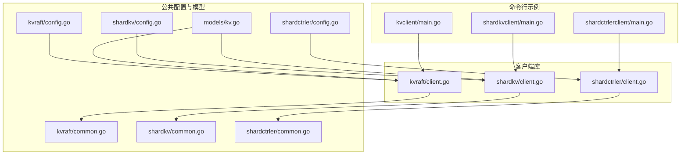
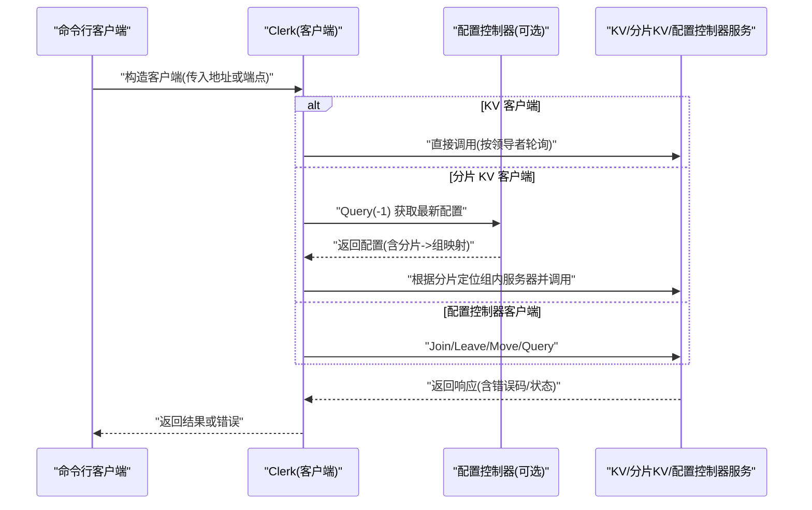
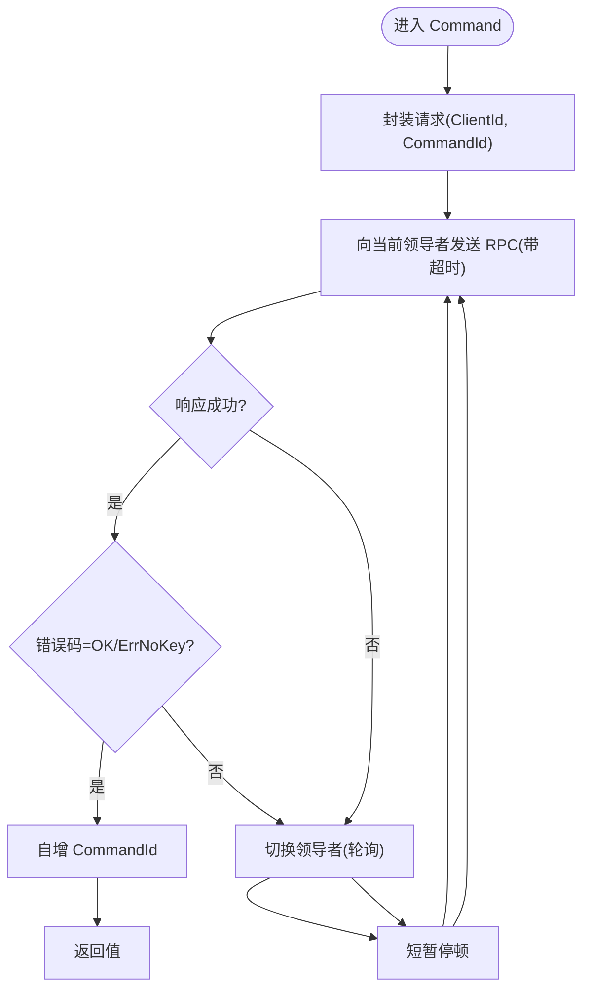
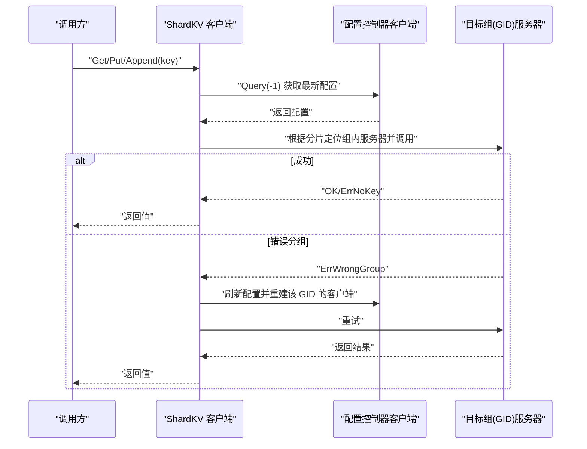
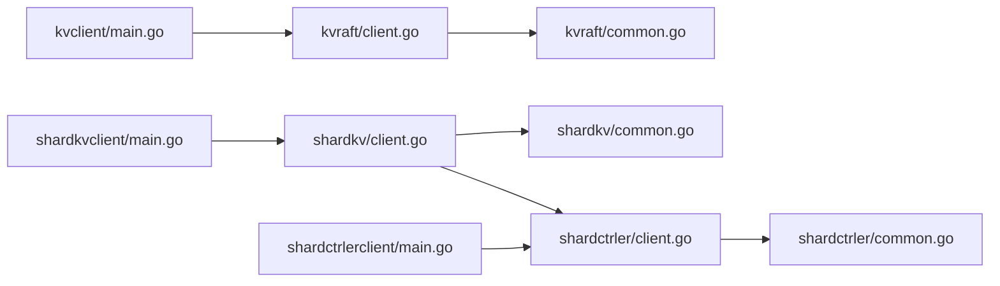

# 客户端实现

**本文引用的文件**
- [cmd/kvclient/main.go](file://cmd/kvclient/main.go)
- [cmd/shardkvclient/main.go](file://cmd/shardkvclient/main.go)
- [cmd/shardctrlerclient/main.go](file://cmd/shardctrlerclient/main.go)
- [kvraft/client.go](file://kvraft/client.go)
- [shardkv/client.go](file://shardkv/client.go)
- [shardctrler/client.go](file://shardctrler/client.go)
- [kvraft/common.go](file://kvraft/common.go)
- [shardkv/common.go](file://shardkv/common.go)
- [shardctrler/common.go](file://shardctrler/common.go)
- [kvraft/config.go](file://kvraft/config.go)
- [shardkv/config.go](file://shardkv/config.go)
- [shardctrler/config.go](file://shardctrler/config.go)
- [models/kv.go](file://models/kv.go)
- [README.md](file://README.md)

## 目录
1. [简介](#简介)
2. [项目结构](#项目结构)
3. [核心组件](#核心组件)
4. [架构总览](#架构总览)
5. [组件详解](#组件详解)
6. [依赖关系分析](#依赖关系分析)
7. [性能与优化](#性能与优化)
8. [故障排查与重试](#故障排查与重试)
9. [结论](#结论)
10. [附录：使用示例与最佳实践](#附录使用示例与最佳实践)

## 简介
本文件面向开发者与运维人员，系统性梳理 eRaft 的三类客户端实现：KV 客户端、分片 KV 客户端与配置控制器客户端。内容覆盖：
- 各客户端的功能差异与适用场景
- API 使用方法、参数配置与错误处理
- 连接管理、负载均衡与故障转移策略
- 性能优化、批量与并发控制
- 超时设置与安全机制
- 实际使用案例与最佳实践
- 集成指南与调试方法

## 项目结构
客户端相关代码主要分布在以下模块：
- kvraft：单体键值存储客户端（基于 gRPC）
- shardkv：分片键值存储客户端（通过配置控制器发现分片归属）
- shardctrler：配置控制器客户端（管理分片到副本组的映射）
- cmd/*client：命令行示例程序，演示如何使用各客户端
- 公共常量与错误类型定义位于各模块 common.go 中
- 测试配置与网络适配位于各模块 config.go 中
- 模型定义用于正确性验证（如线性一致性模型）

图表来源
- [cmd/kvclient/main.go](file://cmd/kvclient/main.go#L1-L47)
- [cmd/shardkvclient/main.go](file://cmd/shardkvclient/main.go#L1-L106)
- [cmd/shardctrlerclient/main.go](file://cmd/shardctrlerclient/main.go#L1-L103)
- [kvraft/client.go](file://kvraft/client.go#L1-L144)
- [shardkv/client.go](file://shardkv/client.go#L1-L310)
- [shardctrler/client.go](file://shardctrler/client.go#L1-L215)
- [kvraft/common.go](file://kvraft/common.go#L1-L92)
- [shardkv/common.go](file://shardkv/common.go#L1-L229)
- [shardctrler/common.go](file://shardctrler/common.go#L1-L141)
- [kvraft/config.go](file://kvraft/config.go#L1-L434)
- [shardkv/config.go](file://shardkv/config.go#L1-L396)
- [shardctrler/config.go](file://shardctrler/config.go#L1-L364)
- [models/kv.go](file://models/kv.go#L1-L73)

章节来源
- [README.md](file://README.md#L1-L139)

## 核心组件
- KV 客户端（kvraft）：面向单体键值服务，直接向已知服务器列表发起 gRPC 请求；内置领导者轮询与超时重试。
- 分片 KV 客户端（shardkv）：先查询配置控制器，确定 key 所属分片与副本组，再向对应组内的服务器发起请求；支持配置变更后的自动重试与客户端缓存重建。
- 配置控制器客户端（shardctrler）：维护分片到副本组的映射；提供 join、leave、move、query 等管理接口。

章节来源
- [kvraft/client.go](file://kvraft/client.go#L16-L46)
- [shardkv/client.go](file://shardkv/client.go#L151-L188)
- [shardctrler/client.go](file://shardctrler/client.go#L21-L60)

## 架构总览
客户端与服务端交互的关键路径如下：

图表来源
- [kvraft/client.go](file://kvraft/client.go#L121-L143)
- [shardkv/client.go](file://shardkv/client.go#L206-L265)
- [shardctrler/client.go](file://shardctrler/client.go#L159-L196)

## 组件详解

### KV 客户端（单体键值）
- 功能与适用场景
  - 适用于无需分片、对一致性和延迟敏感的小规模键值存储。
  - 通过领导者轮询实现基本的容错与高可用。
- 关键 API
  - 构造：接收服务器地址列表，建立 gRPC 客户端连接。
  - 操作：Get/Put/Append；内部统一封装为 Command 请求。
  - 状态：GetStatus 支持快速探测各节点状态。
- 连接与重试
  - 以 leaderId 作为当前首选服务器索引，失败时轮询下一个。
  - 每次调用使用统一执行超时；若返回“错误领导者”或“超时”，切换领导者并等待短暂退避。
- 错误处理
  - 常见错误：OK、ErrNoKey、ErrWrongLeader、ErrTimeout。
  - 返回值中包含错误码与值，调用方需根据错误码决定是否重试或报错。

图表来源
- [kvraft/client.go](file://kvraft/client.go#L121-L143)
- [kvraft/common.go](file://kvraft/common.go#L49-L70)

章节来源
- [kvraft/client.go](file://kvraft/client.go#L89-L143)
- [kvraft/common.go](file://kvraft/common.go#L20-L92)

### 分片 KV 客户端（ShardKV）
- 功能与适用场景
  - 适用于大规模数据与高并发场景，按分片路由请求至对应副本组。
  - 自动感知配置变化，动态更新分片到服务器的映射。
- 关键 API
  - 构造：接收配置控制器地址列表，内部创建配置控制器客户端。
  - 操作：Get/Put/Append；内部根据 key 计算分片，查询配置，定位组内服务器并调用。
  - 状态：GetStatus 支持遍历所有组与服务器，汇总状态。
- 连接与重试
  - 对每个 GID 维护 leaderId 与客户端连接池；同一 GID 内部领导者轮询。
  - 若返回“错误分组”，表示配置已变更，主动刷新配置并重试。
- 错误处理
  - 常见错误：OK、ErrNoKey、ErrWrongGroup、ErrWrongLeader、ErrOutDated、ErrTimeout、ErrNotReady。
  - 针对 ErrWrongGroup，客户端会主动重新查询配置并重建该 GID 的客户端连接。

图表来源
- [shardkv/client.go](file://shardkv/client.go#L206-L265)
- [shardctrler/client.go](file://shardctrler/client.go#L125-L127)

章节来源
- [shardkv/client.go](file://shardkv/client.go#L190-L309)
- [shardkv/common.go](file://shardkv/common.go#L38-L100)

### 配置控制器客户端（ShardCtrler）
- 功能与适用场景
  - 管理分片到副本组的映射；提供集群管理能力（加入、离开、移动分片、查询配置）。
- 关键 API
  - Join：注册新的副本组。
  - Leave：移除指定副本组。
  - Move：将某个分片从当前组迁移到目标组。
  - Query：查询指定编号或最新配置。
  - GetStatus：获取控制器节点状态。
- 连接与重试
  - 与 KV 客户端类似，采用领导者轮询与超时控制。
- 错误处理
  - 常见错误：OK、ErrWrongLeader、ErrTimeout。

章节来源
- [shardctrler/client.go](file://shardctrler/client.go#L125-L197)
- [shardctrler/common.go](file://shardctrler/common.go#L88-L141)

## 依赖关系分析
- 客户端与服务端
  - KV 客户端直接依赖 KVService gRPC 接口。
  - 分片 KV 客户端依赖 ShardKVService gRPC 接口，并依赖 ShardCtrlerService 查询配置。
  - 配置控制器客户端依赖 ShardCtrlerService。
- 错误与常量
  - 各模块均在 common.go 中定义错误码与操作类型，确保客户端与服务端语义一致。
- 测试与网络
  - 各模块的 config.go 提供了基于 labrpc 的测试网络抽象，便于模拟分区、断开/连接客户端等场景。

图表来源
- [cmd/kvclient/main.go](file://cmd/kvclient/main.go#L1-L47)
- [cmd/shardkvclient/main.go](file://cmd/shardkvclient/main.go#L1-L106)
- [cmd/shardctrlerclient/main.go](file://cmd/shardctrlerclient/main.go#L1-L103)
- [kvraft/client.go](file://kvraft/client.go#L1-L144)
- [shardkv/client.go](file://shardkv/client.go#L1-L310)
- [shardctrler/client.go](file://shardctrler/client.go#L1-L215)
- [kvraft/common.go](file://kvraft/common.go#L1-L92)
- [shardkv/common.go](file://shardkv/common.go#L1-L229)
- [shardctrler/common.go](file://shardctrler/common.go#L1-L141)

章节来源
- [kvraft/config.go](file://kvraft/config.go#L194-L258)
- [shardkv/config.go](file://shardkv/config.go#L123-L147)
- [shardctrler/config.go](file://shardctrler/config.go#L167-L231)

## 性能与优化
- 超时与重试
  - 执行超时：各模块均定义统一的执行超时常量，避免阻塞导致的请求堆积。
  - 重试策略：领导者轮询 + 短暂退避；分片 KV 在 ErrWrongGroup 时主动刷新配置并重建连接。
- 并发与批量
  - 客户端内部未提供原生批量 API；建议上层并发调用多个请求并行化。
  - 对于写放大风险，建议合并小写入或使用服务端提供的批量接口（如存在）。
- 连接复用
  - gRPC 客户端在构造时建立连接；分片 KV 为每个 GID 维护连接池，减少重复拨号开销。
- 监控与可观测性
  - GetStatus 可用于快速检查节点健康；建议在生产环境定期采集并告警离线节点。

章节来源
- [kvraft/common.go](file://kvraft/common.go#L9)
- [shardkv/common.go](file://shardkv/common.go#L21-L27)
- [shardctrler/common.go](file://shardctrler/common.go#L45)
- [kvraft/client.go](file://kvraft/client.go#L100-L113)
- [shardkv/client.go](file://shardkv/client.go#L267-L309)

## 故障排查与重试
- 常见问题与对策
  - ErrWrongLeader：领导者切换期间的正常现象，客户端会自动轮询下一个领导者。
  - ErrTimeout：网络抖动或领导者过载，建议增加重试次数与指数退避。
  - ErrWrongGroup：配置变更后，分片 KV 会自动刷新配置；若仍失败，检查配置控制器状态。
  - ErrNotReady/ErrOutDated：服务端尚未就绪或配置落后，建议等待后重试。
- 调试建议
  - 使用 GetStatus 查看节点状态与指标（任期、提交索引、存储大小等）。
  - 在测试环境中利用 labrpc 网络模拟分区与断连，验证客户端的容错行为。
  - 结合 models/kv 的线性一致性模型验证读写序列的正确性。

章节来源
- [shardkv/client.go](file://shardkv/client.go#L246-L258)
- [shardctrler/client.go](file://shardctrler/client.go#L190-L193)
- [models/kv.go](file://models/kv.go#L20-L72)

## 结论
- KV 客户端适合简单、低延迟场景；分片 KV 客户端适合高并发、大规模数据场景；配置控制器客户端负责集群治理。
- 客户端普遍采用领导者轮询与超时控制，具备基础的容错能力；在复杂场景下建议结合上层重试与监控体系。
- 生产部署应关注超时、重试与连接复用，配合健康检查与配置控制器状态观测，确保稳定运行。

## 附录：使用示例与最佳实践

### 快速开始与命令行示例
- 启动配置控制器集群与分片 KV 集群后，使用命令行客户端进行读写与基准测试。
- 示例命令与参数详见各命令行入口文件。

章节来源
- [README.md](file://README.md#L51-L128)
- [cmd/kvclient/main.go](file://cmd/kvclient/main.go#L11-L46)
- [cmd/shardkvclient/main.go](file://cmd/shardkvclient/main.go#L14-L105)
- [cmd/shardctrlerclient/main.go](file://cmd/shardctrlerclient/main.go#L12-L102)

### API 与参数配置清单
- KV 客户端
  - 构造：传入服务器地址列表；内部建立 gRPC 客户端。
  - 操作：Get(key)、Put(key, value)、Append(key, value)。
  - 状态：GetStatus() 返回各节点状态。
- 分片 KV 客户端
  - 构造：传入配置控制器地址列表；内部创建配置控制器客户端。
  - 操作：Get/Put/Append；内部根据 key 计算分片并路由。
  - 状态：GetStatus() 返回所有组与服务器的状态。
- 配置控制器客户端
  - Join(gid -> 服务器列表)
  - Leave(gid 列表)
  - Move(分片, 目标 gid)
  - Query(配置编号或最新)
  - Status：查看控制器节点状态

章节来源
- [kvraft/client.go](file://kvraft/client.go#L30-L46)
- [shardkv/client.go](file://shardkv/client.go#L165-L188)
- [shardctrler/client.go](file://shardctrler/client.go#L125-L139)

### 安全与超时
- 默认使用明文 gRPC；生产环境建议启用 TLS 并配置认证。
- 超时设置：各模块提供统一的执行超时常量，可根据网络与负载调整。

章节来源
- [kvraft/client.go](file://kvraft/client.go#L33)
- [shardkv/client.go](file://shardkv/client.go#L220)
- [shardctrler/client.go](file://shardctrler/client.go#L39-L45)
- [kvraft/common.go](file://kvraft/common.go#L9)
- [shardkv/common.go](file://shardkv/common.go#L22-L27)
- [shardctrler/common.go](file://shardctrler/common.go#L45)

### 最佳实践
- 并发控制：使用 goroutine 并发调用，结合上下文取消与超时控制。
- 重试策略：指数退避 + 最大重试次数；对 ErrWrongGroup 与 ErrTimeout 建议单独处理。
- 连接管理：长连接复用；在配置变更频繁的场景，适当降低刷新频率。
- 监控与日志：定期采集 GetStatus，记录错误分布与延迟直方图。