# 配置控制器客户端

**本文档引用的文件**
- [shardctrler/client.go](file://shardctrler/client.go)
- [shardctrler/common.go](file://shardctrler/common.go)
- [shardctrler/config.go](file://shardctrler/config.go)
- [shardctrler/server.go](file://shardctrler/server.go)
- [shardctrler/grpc_server.go](file://shardctrler/grpc_server.go)
- [shardctrler/configstm.go](file://shardctrler/configstm.go)
- [shardctrlerpb/shardctrler.proto](file://shardctrlerpb/shardctrler.proto)
- [cmd/shardctrlerclient/main.go](file://cmd/shardctrlerclient/main.go)
- [shardctrler/test_test.go](file://shardctrler/test_test.go)

## 目录
1. [简介](#简介)
2. [项目结构](#项目结构)
3. [核心组件](#核心组件)
4. [架构概览](#架构概览)
5. [详细组件分析](#详细组件分析)
6. [依赖关系分析](#依赖关系分析)
7. [性能考虑](#性能考虑)
8. [故障排除指南](#故障排除指南)
9. [结论](#结论)
10. [附录](#附录)

## 简介

配置控制器客户端是 eRaft 分布式系统中的关键组件，负责管理集群的配置信息和分片分配。该客户端提供了统一的接口来执行集群配置操作，包括节点加入、节点离开、分片迁移和配置查询等核心功能。

在 eRaft 架构中，配置控制器客户端通过 gRPC 协议与配置控制器服务进行通信，实现了高可用性和容错能力。客户端支持多种部署模式，包括直接 gRPC 连接和基于 labrpc 的本地测试环境。

## 项目结构

eRaft 项目采用模块化设计，配置控制器相关的代码主要分布在以下目录：

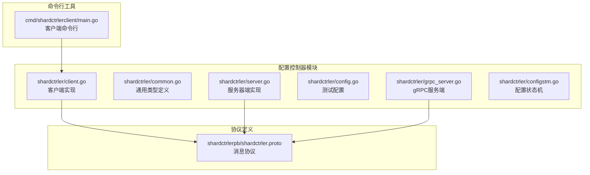

**图表来源**
- [shardctrler/client.go](file://shardctrler/client.go#L1-L215)
- [shardctrlerpb/shardctrler.proto](file://shardctrlerpb/shardctrler.proto#L1-L55)

**章节来源**
- [shardctrler/client.go](file://shardctrler/client.go#L1-L215)
- [shardctrler/common.go](file://shardctrler/common.go#L1-L141)
- [shardctrler/server.go](file://shardctrler/server.go#L1-L344)

## 核心组件

### 客户端核心结构

配置控制器客户端的核心结构包括以下关键组件：

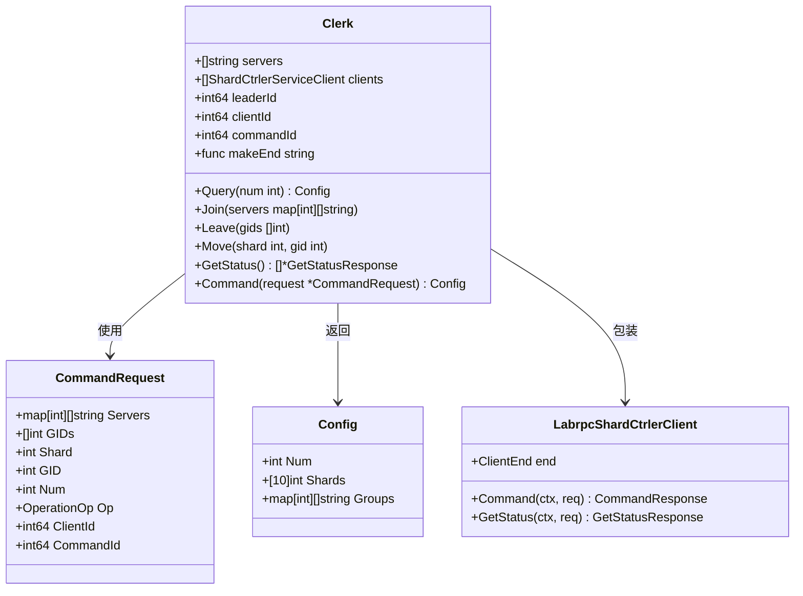

**图表来源**
- [shardctrler/client.go](file://shardctrler/client.go#L21-L54)
- [shardctrler/common.go](file://shardctrler/common.go#L108-L141)

### 配置状态机

配置控制器实现了两种配置状态机：

1. **内存状态机**：用于测试和开发环境
2. **LevelDB 状态机**：用于生产环境，提供持久化存储

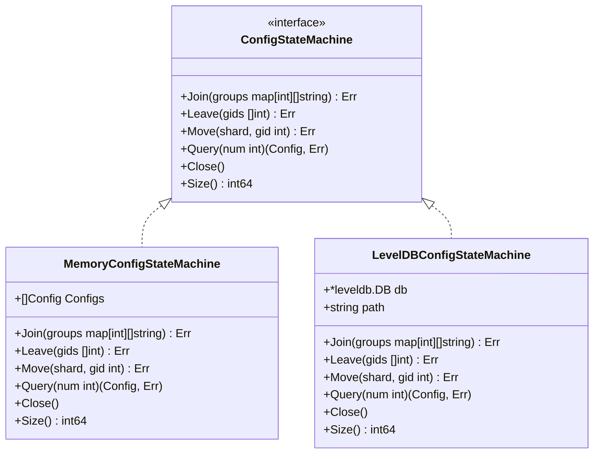

**图表来源**
- [shardctrler/configstm.go](file://shardctrler/configstm.go#L7-L14)
- [shardctrler/server.go](file://shardctrler/server.go#L28-L44)

**章节来源**
- [shardctrler/client.go](file://shardctrler/client.go#L21-L54)
- [shardctrler/configstm.go](file://shardctrler/configstm.go#L7-L167)
- [shardctrler/server.go](file://shardctrler/server.go#L28-L44)

## 架构概览

配置控制器客户端采用分层架构设计，实现了清晰的关注点分离：

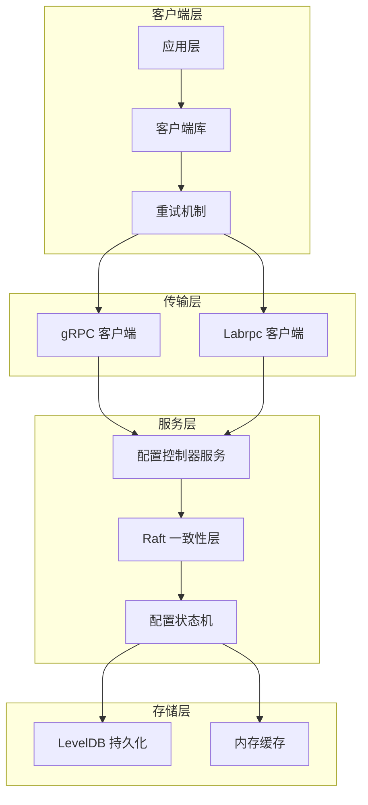

**图表来源**
- [shardctrler/client.go](file://shardctrler/client.go#L165-L197)
- [shardctrler/server.go](file://shardctrler/server.go#L179-L215)
- [shardctrler/grpc_server.go](file://shardctrler/grpc_server.go#L18-L58)

### 数据流处理

配置操作的数据流遵循以下模式：

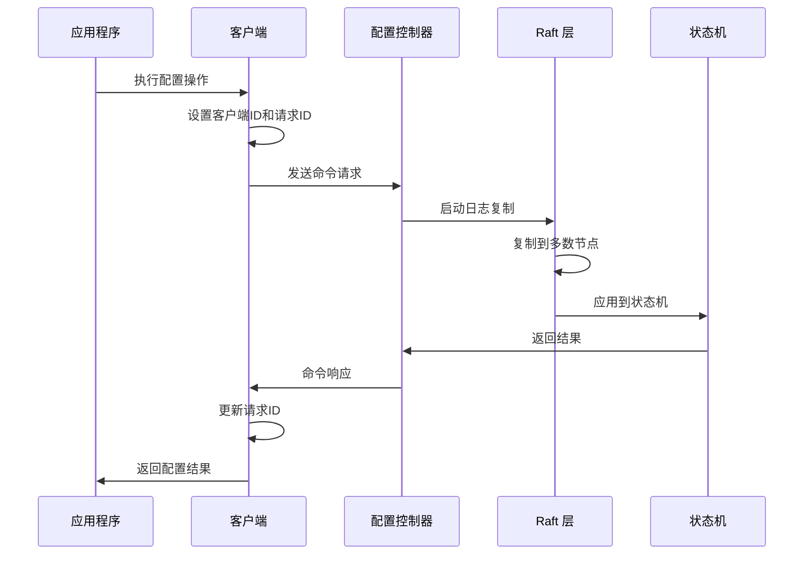

**图表来源**
- [shardctrler/client.go](file://shardctrler/client.go#L159-L197)
- [shardctrler/server.go](file://shardctrler/server.go#L179-L215)

## 详细组件分析

### 客户端重试机制

配置控制器客户端实现了智能的重试机制，确保在领导者变更或网络分区情况下仍能成功执行配置操作：

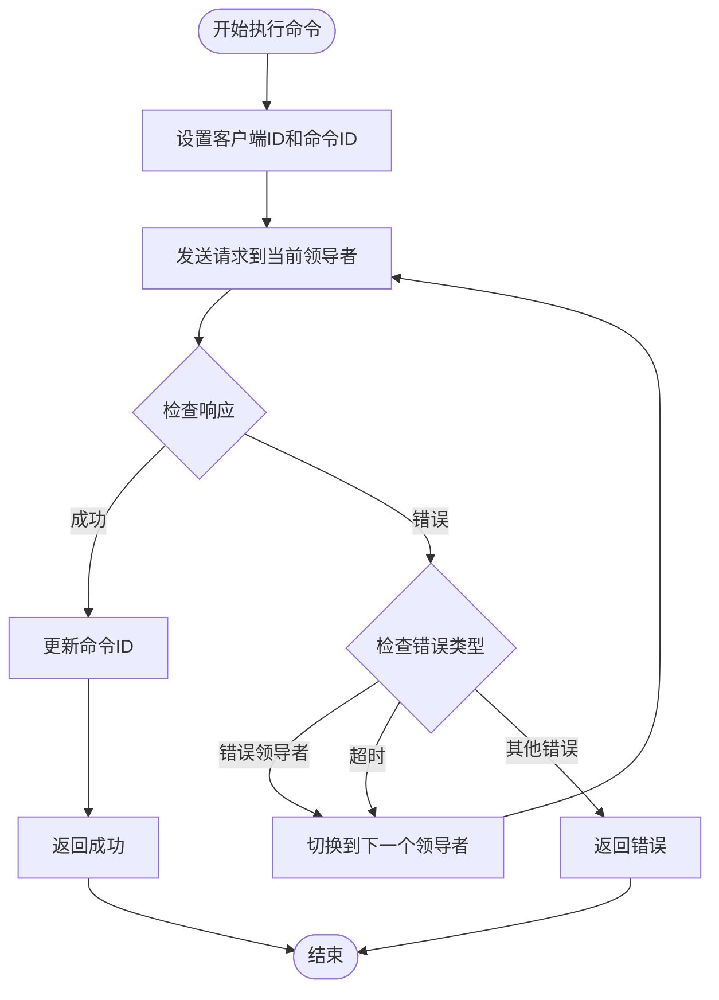

**图表来源**
- [shardctrler/client.go](file://shardctrler/client.go#L159-L197)

### 配置操作实现

#### Join 操作（节点加入）

Join 操作负责向集群添加新的分片组：

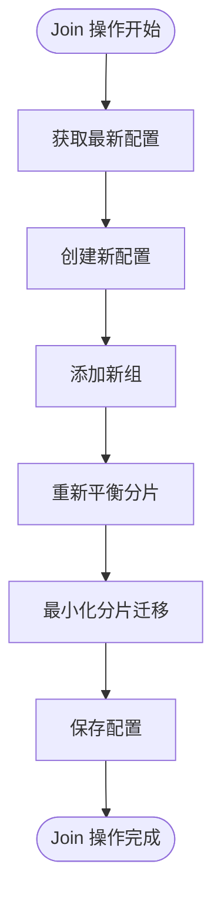

**图表来源**
- [shardctrler/server.go](file://shardctrler/server.go#L84-L112)
- [shardctrler/configstm.go](file://shardctrler/configstm.go#L26-L54)

#### Leave 操作（节点离开）

Leave 操作负责从集群中移除分片组：

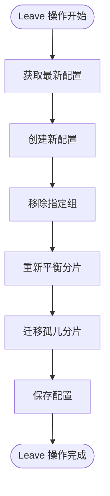

**图表来源**
- [shardctrler/server.go](file://shardctrler/server.go#L114-L143)
- [shardctrler/configstm.go](file://shardctrler/configstm.go#L56-L86)

#### Move 操作（分片迁移）

Move 操作负责将特定分片从一个组迁移到另一个组：

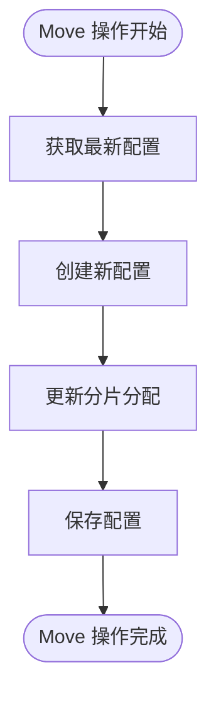

**图表来源**
- [shardctrler/server.go](file://shardctrler/server.go#L145-L151)
- [shardctrler/configstm.go](file://shardctrler/configstm.go#L88-L94)

#### Query 操作（配置查询）

Query 操作负责获取指定版本的配置信息：

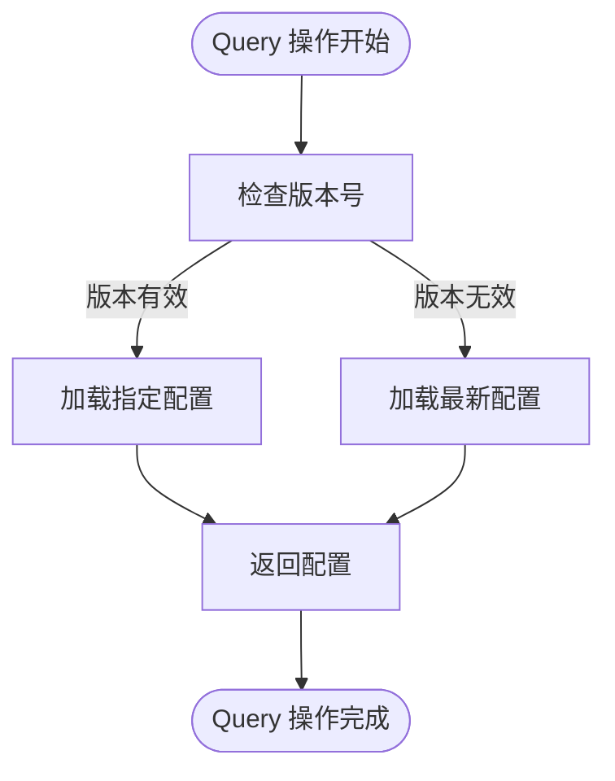

**图表来源**
- [shardctrler/server.go](file://shardctrler/server.go#L153-L159)
- [shardctrler/configstm.go](file://shardctrler/configstm.go#L96-L101)

**章节来源**
- [shardctrler/client.go](file://shardctrler/client.go#L125-L139)
- [shardctrler/server.go](file://shardctrler/server.go#L84-L159)

### 错误处理和重试策略

配置控制器客户端实现了完善的错误处理机制：

| 错误类型 | 描述 | 处理策略 |
|---------|------|----------|
| OK | 操作成功 | 直接返回结果 |
| ErrWrongLeader | 当前节点不是领导者 | 切换到下一个领导者并重试 |
| ErrTimeout | 操作超时 | 切换到下一个领导者并重试 |

**章节来源**
- [shardctrler/common.go](file://shardctrler/common.go#L88-L106)
- [shardctrler/client.go](file://shardctrler/client.go#L190-L196)

## 依赖关系分析

配置控制器客户端的依赖关系如下：

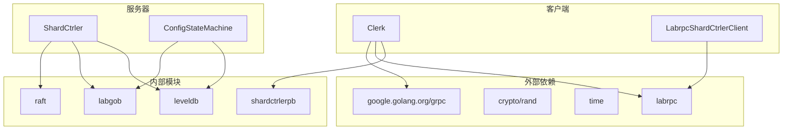

**图表来源**
- [shardctrler/client.go](file://shardctrler/client.go#L7-L19)
- [shardctrler/server.go](file://shardctrler/server.go#L3-L15)

### 超时设置

配置控制器客户端使用了合理的超时设置来平衡性能和可靠性：

| 组件 | 超时值 | 用途 |
|------|--------|------|
| ExecuteTimeout | 500ms | 单个命令执行超时 |
| GetStatus 调用 | 100ms | 状态查询超时 |

**章节来源**
- [shardctrler/common.go](file://shardctrler/common.go#L45-L47)
- [shardctrler/client.go](file://shardctrler/client.go#L144-L144)

## 性能考虑

### 并发处理

配置控制器客户端支持并发操作，通过以下机制确保线程安全：

1. **客户端ID和命令ID**：每个客户端都有唯一的客户端ID，命令ID用于防止重复执行
2. **领导者轮询**：自动在多个服务器之间轮询，提高可用性
3. **异步通知**：使用通道进行异步通知，避免阻塞

### 内存管理

客户端实现了智能的内存管理策略：

1. **通知通道清理**：异步清理过期的通知通道，减少内存占用
2. **配置缓存**：仅在必要时缓存配置信息
3. **连接复用**：复用 gRPC 连接，减少资源消耗

### 存储优化

配置状态机采用了多种存储优化技术：

1. **LevelDB 持久化**：生产环境使用 LevelDB 提供高性能持久化
2. **增量配置**：只保存必要的配置变更，而不是完整的历史记录
3. **压缩存储**：使用 labgob 编码器进行高效序列化

## 故障排除指南

### 常见问题诊断

#### 领导者选举问题

当集群出现领导者选举问题时，可以使用以下方法诊断：

1. **检查集群状态**：使用 `GetStatus` 方法获取所有节点的状态
2. **验证网络连接**：确认所有节点之间的网络连接正常
3. **检查日志**：查看配置控制器的日志输出

#### 配置不一致问题

如果发现配置不一致，可以采取以下措施：

1. **强制查询最新配置**：使用 `Query(-1)` 获取最新配置
2. **检查分片分布**：验证分片是否均匀分布在各个组中
3. **重新平衡集群**：执行 Join 或 Leave 操作重新平衡分片

### 调试工具

配置控制器客户端提供了内置的调试功能：

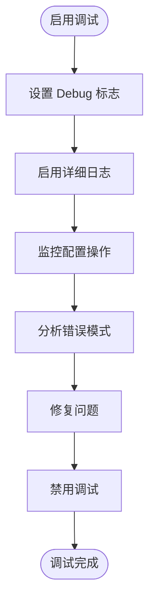

**图表来源**
- [shardctrler/common.go](file://shardctrler/common.go#L47-L54)

**章节来源**
- [shardctrler/client.go](file://shardctrler/client.go#L141-L157)
- [shardctrler/server.go](file://shardctrler/server.go#L319-L322)

## 结论

配置控制器客户端是 eRaft 分布式系统中的核心组件，提供了可靠的集群配置管理功能。通过采用 Raft 一致性算法和 gRPC 通信协议，客户端实现了高可用性和容错能力。

客户端的主要优势包括：

1. **简单易用**：提供直观的 API 接口，支持多种部署模式
2. **高可用性**：自动领导者切换和重试机制
3. **性能优化**：智能缓存和异步处理
4. **可扩展性**：支持动态扩缩容和负载均衡

在实际使用中，建议遵循以下最佳实践：

1. **合理设置超时时间**：根据网络环境调整超时参数
2. **监控集群状态**：定期检查集群健康状况
3. **备份配置信息**：定期备份配置状态机数据
4. **测试重试逻辑**：在开发环境中充分测试重试机制

## 附录

### 使用示例

#### 基本使用模式

```go
// 创建客户端
ck := shardctrler.MakeClerk([]string{"127.0.0.1:50051","127.0.0.1:50052","127.0.0.1:50053"})

// 查询当前配置
config := ck.Query(-1)
fmt.Printf("当前配置: %+v\n", config)

// 添加新组
groups := map[int][]string{
    100: []string{"server1:50051", "server2:50052"},
    200: []string{"server3:50053", "server4:50054"},
}
ck.Join(groups)

// 移除组
ck.Leave([]int{100, 200})

// 迁移分片
ck.Move(5, 300)
```

#### 命令行工具使用

配置控制器还提供了命令行工具，支持通过命令行执行配置操作：

```bash
# 添加节点组
./shardctrlerclient -cluster "127.0.0.1:50051,127.0.0.1:50052" join 100=server1:50051,server2:50052 200=server3:50053,server4:50054

# 移除节点组
./shardctrlerclient -cluster "127.0.0.1:50051,127.0.0.1:50052" leave 100 200

# 迁移分片
./shardctrlerclient -cluster "127.0.0.1:50051,127.0.0.1:50052" move 5 300

# 查询配置
./shardctrlerclient -cluster "127.0.0.1:50051,127.0.0.1:50052" query

# 获取集群状态
./shardctrlerclient -cluster "127.0.0.1:50051,127.0.0.1:50052" status
```

### 最佳实践

1. **错误处理**：始终检查操作返回的错误状态
2. **超时设置**：根据网络延迟调整超时参数
3. **重试策略**：实现指数退避的重试策略
4. **监控告警**：建立集群健康监控和告警机制
5. **备份恢复**：定期备份配置状态机数据
6. **容量规划**：根据业务需求规划集群规模