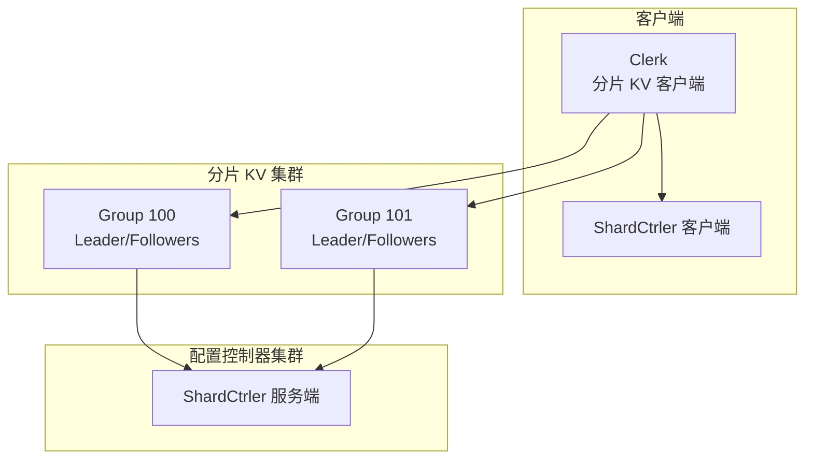
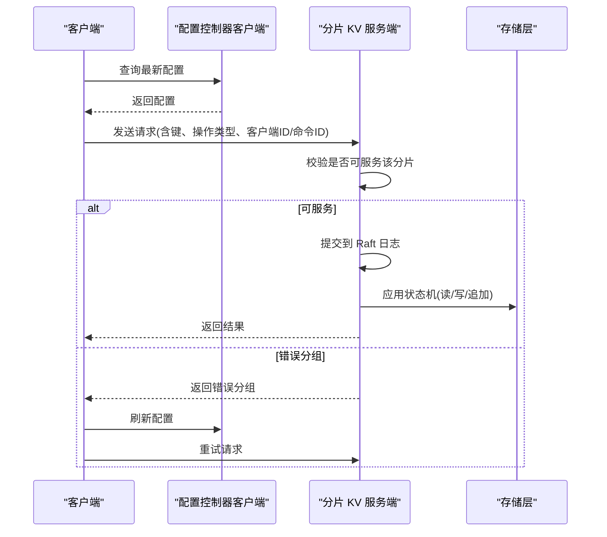
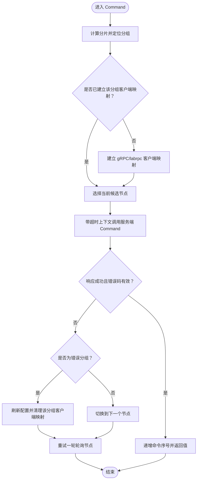
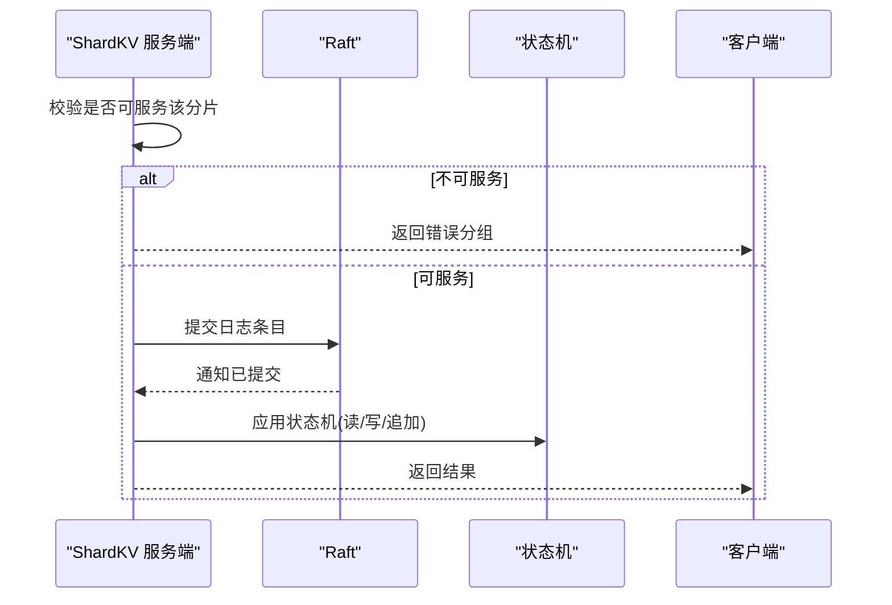
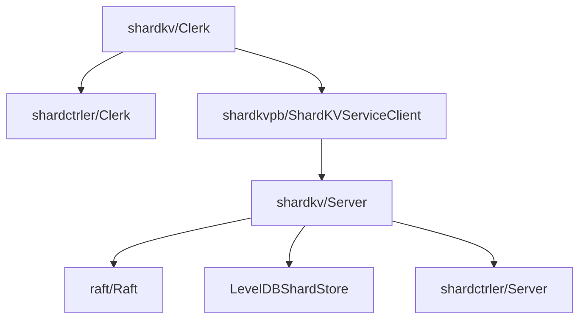

# 分片 KV 客户端

<cite>
**本文引用的文件**
- [shardkv/client.go](file://shardkv/client.go)
- [shardkv/common.go](file://shardkv/common.go)
- [shardkv/config.go](file://shardkv/config.go)
- [shardkv/server.go](file://shardkv/server.go)
- [shardkvpb/shardkv.proto](file://shardkvpb/shardkv.proto)
- [shardctrler/client.go](file://shardctrler/client.go)
- [shardctrler/server.go](file://shardctrler/server.go)
- [cmd/shardkvclient/main.go](file://cmd/shardkvclient/main.go)
- [wiki/Sharding-Mechanism.md](file://wiki/Sharding-Mechanism.md)
- [README.md](file://README.md)
</cite>

## 目录
1. [简介](#简介)
2. [项目结构](#项目结构)
3. [核心组件](#核心组件)
4. [架构总览](#架构总览)
5. [详细组件分析](#详细组件分析)
6. [依赖关系分析](#依赖关系分析)
7. [性能考量](#性能考量)
8. [故障排查指南](#故障排查指南)
9. [结论](#结论)
10. [附录](#附录)

## 简介
本文件面向分片 KV 客户端，系统性阐述其核心功能、API 设计、初始化流程、服务器连接与分片路由机制，并深入解析 Get、Put、Append 等基本操作的实现细节与错误处理。文档还覆盖重试策略、超时配置、连接管理、高可用部署、负载均衡与故障恢复、客户端缓存策略、并发控制、事务支持以及与分片 KV 服务器的通信协议与数据一致性保障。

## 项目结构
该仓库采用按领域模块划分的组织方式：
- shardkv：分片 KV 客户端与服务端实现
- shardctrler：配置控制器（负责维护分片到组的映射）
- shardkvpb：分片 KV 的 gRPC 协议定义
- cmd：命令行入口（客户端与服务端）
- wiki：系统设计与机制说明文档
- 其他子模块：raft、labrpc、labgob 等支撑组件

图表来源
- [shardkv/client.go](file://shardkv/client.go#L151-L310)
- [shardctrler/client.go](file://shardctrler/client.go#L21-L60)
- [shardkv/server.go](file://shardkv/server.go#L759-L799)

章节来源
- [README.md](file://README.md#L1-L139)

## 核心组件
- 分片 KV 客户端（Clerk）：负责路由请求到正确的分组，执行重试与错误处理，暴露 Get/Put/Append 等高层 API。
- 分片 KV 服务端（ShardKV）：基于 Raft 实现状态机，维护分片状态、迁移与 GC 流程，提供 gRPC 接口。
- 配置控制器客户端（ShardCtrler Clerk）：向配置控制器查询最新配置，参与分片路由决策。
- 配置控制器服务端（ShardCtrler）：维护分片到组的映射，支持 Join/Leave/Move/Query 操作。

章节来源
- [shardkv/client.go](file://shardkv/client.go#L151-L310)
- [shardkv/server.go](file://shardkv/server.go#L76-L199)
- [shardctrler/client.go](file://shardctrler/client.go#L21-L60)
- [shardctrler/server.go](file://shardctrler/server.go#L17-L344)

## 架构总览
分片 KV 客户端通过 ShardCtrler 查询当前配置，确定目标键所在的分组，再将请求发送至该分组的某个节点。若返回“错误分组”或节点不可用，则进行轮询重试或刷新配置后重试。服务端通过 Raft 保证日志复制与状态机一致性，周期性检测配置变更并执行数据迁移与垃圾回收。

图表来源
- [shardkv/client.go](file://shardkv/client.go#L206-L265)
- [shardkv/server.go](file://shardkv/server.go#L110-L127)
- [shardctrler/client.go](file://shardctrler/client.go#L125-L197)

## 详细组件分析

### 客户端初始化与连接管理
- 初始化
  - 通过构造函数创建 Clerk，内部持有配置控制器客户端与本地缓存（分组到节点的客户端映射、每个分组的领导者索引、客户端唯一标识与命令序号）。
  - 首次查询配置以建立初始路由信息。
- 连接管理
  - 对于每个分组，客户端在首次访问时为该组的每个节点建立 gRPC 或 labrpc 客户端实例。
  - 支持动态刷新：当配置变更导致分组成员变化时，删除旧客户端映射并重建。
- 路由与选择
  - 使用键到分片的映射函数定位目标分片，再根据配置获取对应分组的服务器列表。
  - 在同一分组内轮询选择下一个节点作为领导者候选，避免单点故障。

章节来源
- [shardkv/client.go](file://shardkv/client.go#L165-L188)
- [shardkv/client.go](file://shardkv/client.go#L215-L230)
- [shardkv/client.go](file://shardkv/client.go#L260-L264)

### 基本操作：Get/Put/Append
- Get
  - 将请求封装为命令，调用通用 Command 方法。
- Put/Append
  - 将请求封装为命令，调用通用 Command 方法。
- 通用 Command 流程
  - 计算分片并定位目标分组。
  - 若未建立该分组的客户端映射则建立之。
  - 以超时上下文向当前候选节点发送请求。
  - 成功条件：返回值有效且错误码为成功或“键不存在”。
  - 错误分组：刷新配置并重试；同一轮中轮询不同节点。
  - 超时或网络错误：等待短暂时间后重试，直至成功或达到重试边界。
  - 成功后递增命令序号，确保幂等性。

图表来源
- [shardkv/client.go](file://shardkv/client.go#L206-L265)

章节来源
- [shardkv/client.go](file://shardkv/client.go#L194-L204)
- [shardkv/client.go](file://shardkv/client.go#L206-L265)

### 服务端处理与一致性
- 服务端在收到请求后先检查是否可服务该分片（当前配置下该分组拥有该分片且状态允许），否则直接返回“错误分组”。
- 对于重复请求（基于客户端ID与命令ID），直接返回上次响应，避免重复应用。
- 将操作编码为 Raft 日志条目提交，Leader 节点在超时时间内等待应用结果并通过通知通道返回给客户端。
- 服务端周期性监控配置变更、执行数据迁移（拉取新分片数据）、执行垃圾回收（通知旧主删除分片）。

图表来源
- [shardkv/server.go](file://shardkv/server.go#L110-L127)
- [shardkv/server.go](file://shardkv/server.go#L248-L326)

章节来源
- [shardkv/server.go](file://shardkv/server.go#L110-L127)
- [shardkv/server.go](file://shardkv/server.go#L248-L326)

### 分片路由与配置变更
- 键到分片映射：使用首字符哈希取模确定分片。
- 配置查询：客户端定期或在遇到“错误分组”时从配置控制器查询最新配置。
- 数据迁移：当配置变更导致某分组获得新分片时，该分组会从旧主拉取数据并提交插入日志；完成后通知旧主删除该分片数据，确保一致性。

章节来源
- [shardkv/client.go](file://shardkv/client.go#L29-L36)
- [shardkv/client.go](file://shardkv/client.go#L260-L264)
- [shardkv/server.go](file://shardkv/server.go#L549-L570)
- [shardkv/server.go](file://shardkv/server.go#L572-L643)
- [shardkv/server.go](file://shardkv/server.go#L645-L696)
- [wiki/Sharding-Mechanism.md](file://wiki/Sharding-Mechanism.md#L1-L21)

### 通信协议与数据模型
- gRPC 服务定义：Command、GetShardsData、DeleteShardsData、GetStatus。
- 请求/响应消息：CommandRequest、CommandResponse、ShardOperationRequest、ShardOperationResponse、OperationContext、ShardData、GetStatusRequest/Response。
- 服务端接口：提供与客户端一致的 RPC 方法，用于分片数据拉取与删除、状态查询。

章节来源
- [shardkvpb/shardkv.proto](file://shardkvpb/shardkv.proto#L1-L66)
- [shardkv/server.go](file://shardkv/server.go#L159-L217)

### 并发控制与通知机制
- 客户端侧：每个命令提交后通过 Raft 通知通道等待结果，超时则视为失败。
- 服务端侧：应用协程从 Raft 通道接收已提交日志，解码后应用到状态机，仅在当前任期且为 Leader 时通知对应通道。
- 通知通道生命周期：应用完成后异步清理，降低内存占用。

章节来源
- [shardkv/server.go](file://shardkv/server.go#L129-L157)
- [shardkv/server.go](file://shardkv/server.go#L248-L326)

### 事务支持与幂等性
- 客户端通过客户端ID与命令ID组合实现请求幂等，服务端在状态机层面记录每个客户端的最大已应用命令ID，重复请求直接返回上次响应。
- 服务端在提交日志前校验重复请求，避免重复应用。

章节来源
- [shardkv/common.go](file://shardkv/common.go#L93-L100)
- [shardkv/server.go](file://shardkv/server.go#L221-L224)
- [shardkv/server.go](file://shardkv/server.go#L333-L342)

### 错误处理与重试策略
- 错误类型：成功、键不存在、错误分组、错误领导者、过期配置、超时、未就绪。
- 重试策略：
  - “错误分组”：刷新配置并清理该分组客户端映射，重新路由。
  - “错误领导者”：在同一分组内轮询下一个节点。
  - 超时或网络错误：等待短暂时间后重试，直至成功。
- 超时配置：客户端与配置控制器均使用统一的执行超时常量。

章节来源
- [shardkv/common.go](file://shardkv/common.go#L38-L68)
- [shardkv/client.go](file://shardkv/client.go#L246-L257)
- [shardctrler/client.go](file://shardctrler/client.go#L182-L196)

### 高可用部署与负载均衡
- 多副本：每个分组内部多节点（Leader/Follower）提供高可用。
- 负载均衡：客户端在同一分组内轮询节点，避免热点集中在单一节点。
- 动态扩容/缩容：通过配置控制器的 Join/Leave/Move 操作调整分片分配，触发自动迁移。

章节来源
- [shardkv/client.go](file://shardkv/client.go#L252-L257)
- [shardctrler/server.go](file://shardctrler/server.go#L84-L151)
- [README.md](file://README.md#L130-L139)

### 客户端缓存策略
- 配置缓存：客户端持有最近一次查询到的配置，遇到“错误分组”时主动刷新。
- 客户端映射缓存：为每个分组缓存节点级客户端实例，避免重复建立连接。
- 清理策略：配置变更时清理该分组的客户端映射并重建。

章节来源
- [shardkv/client.go](file://shardkv/client.go#L173-L174)
- [shardkv/client.go](file://shardkv/client.go#L263-L264)
- [shardkv/client.go](file://shardkv/client.go#L271-L272)

### 命令行工具与基准测试
- shardkvclient：支持 get/put/append/status/bench 等命令，便于快速验证与压测。
- 基准测试：生成随机键值对进行批量写入，统计吞吐。

章节来源
- [cmd/shardkvclient/main.go](file://cmd/shardkvclient/main.go#L14-L95)

## 依赖关系分析

图表来源
- [shardkv/client.go](file://shardkv/client.go#L151-L188)
- [shardkv/server.go](file://shardkv/server.go#L759-L799)
- [shardctrler/client.go](file://shardctrler/client.go#L36-L60)
- [shardctrler/server.go](file://shardctrler/server.go#L324-L343)

章节来源
- [shardkv/client.go](file://shardkv/client.go#L151-L188)
- [shardkv/server.go](file://shardkv/server.go#L759-L799)
- [shardctrler/client.go](file://shardctrler/client.go#L36-L60)
- [shardctrler/server.go](file://shardctrler/server.go#L324-L343)

## 性能考量
- 连接复用：客户端为每个分组缓存节点级客户端，减少 gRPC 连接开销。
- 超时控制：统一的执行超时常量，避免长时间阻塞。
- 通知通道异步清理：降低内存占用，提升吞吐。
- Raft 快照：当 Raft 状态超过阈值时触发快照，减少日志大小。
- 迁移与 GC：服务端周期性检测并执行数据迁移与垃圾回收，保持系统健康。

章节来源
- [shardkv/common.go](file://shardkv/common.go#L21-L27)
- [shardkv/server.go](file://shardkv/server.go#L147-L156)
- [shardkv/server.go](file://shardkv/server.go#L463-L485)
- [shardkv/server.go](file://shardkv/server.go#L724-L731)

## 故障排查指南
- 常见错误与处理
  - 错误分组：刷新配置并重试；检查配置控制器是否返回最新配置。
  - 错误领导者：在同一分组内轮询节点；确认节点角色状态。
  - 超时：检查网络延迟与服务端负载；适当增加超时或优化迁移。
  - 未就绪：等待配置更新完成后再试。
- 状态查询
  - 使用客户端 status 命令查看各节点状态、任期、已应用/提交索引与存储大小。
- 配置控制器状态
  - 使用 shardctrlerclient status 查看配置控制器状态，确认其健康与配置一致性。

章节来源
- [shardkv/common.go](file://shardkv/common.go#L38-L68)
- [shardkv/client.go](file://shardkv/client.go#L267-L309)
- [shardctrler/client.go](file://shardctrler/client.go#L141-L157)
- [cmd/shardkvclient/main.go](file://cmd/shardkvclient/main.go#L54-L66)

## 结论
分片 KV 客户端通过与配置控制器协作，实现了动态路由与高可用访问；服务端基于 Raft 提供强一致与持久化存储，并通过周期性监控实现自动迁移与垃圾回收。客户端在错误处理、重试与连接管理方面具备完善的机制，适合在生产环境中部署与运维。建议结合监控指标与基准测试持续优化性能与稳定性。

## 附录
- 关键 API 与数据结构参考
  - 客户端接口：Command、GetShardsData、DeleteShardsData、GetStatus
  - 请求/响应消息：CommandRequest、CommandResponse、ShardOperationRequest、ShardOperationResponse、OperationContext、ShardData、GetStatusRequest/Response
  - 错误类型：OK、ErrNoKey、ErrWrongGroup、ErrWrongLeader、ErrOutDated、ErrTimeout、ErrNotReady
  - 操作类型：OpPut、OpAppend、OpGet

章节来源
- [shardkvpb/shardkv.proto](file://shardkvpb/shardkv.proto#L1-L66)
- [shardkv/common.go](file://shardkv/common.go#L38-L187)