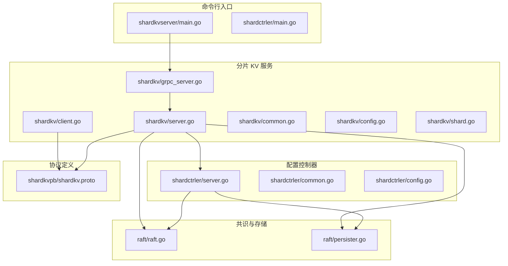
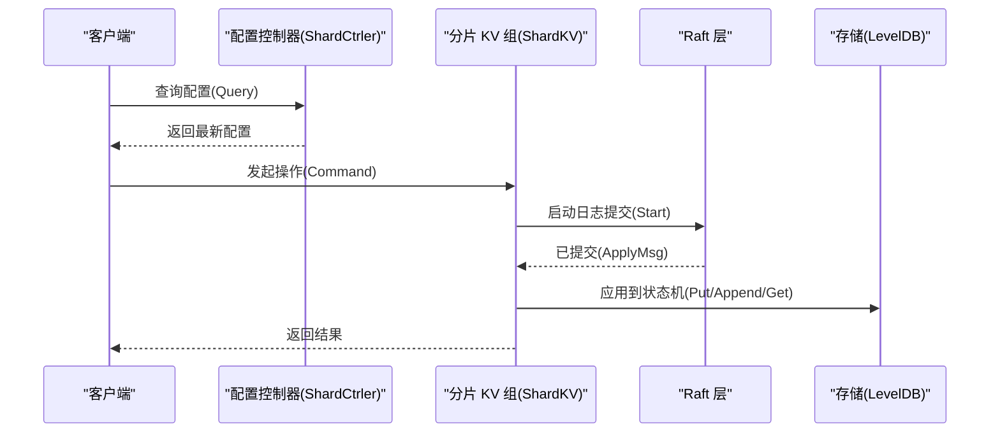
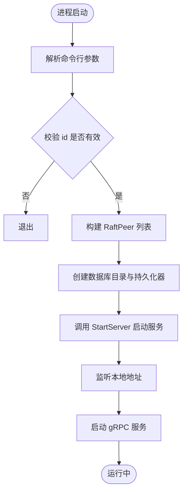
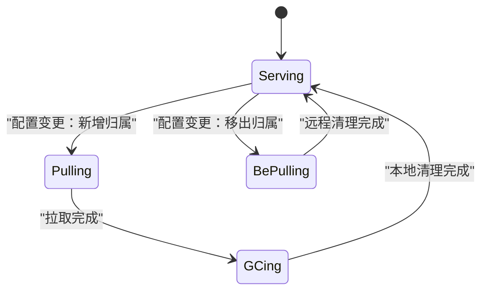
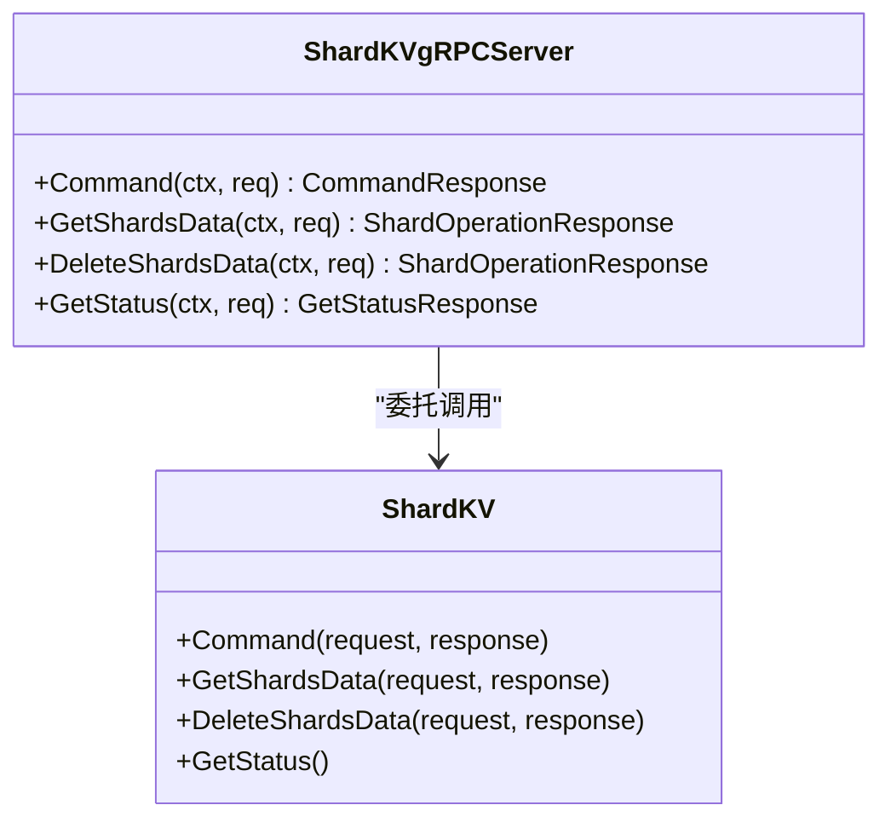
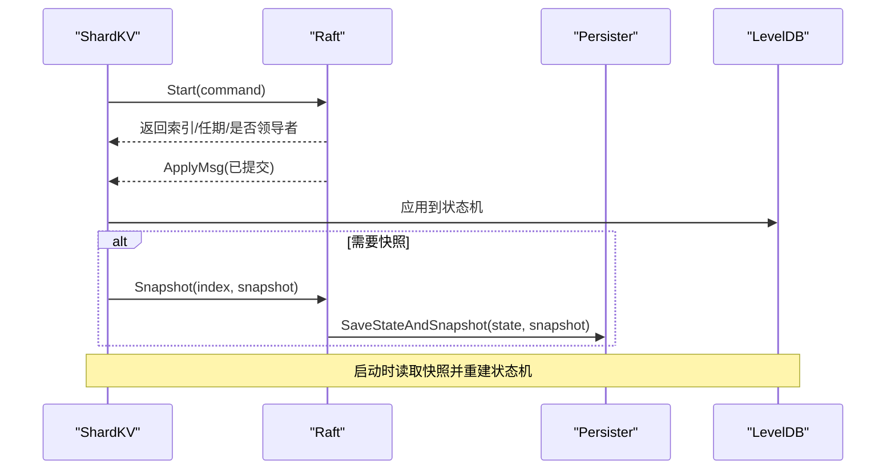
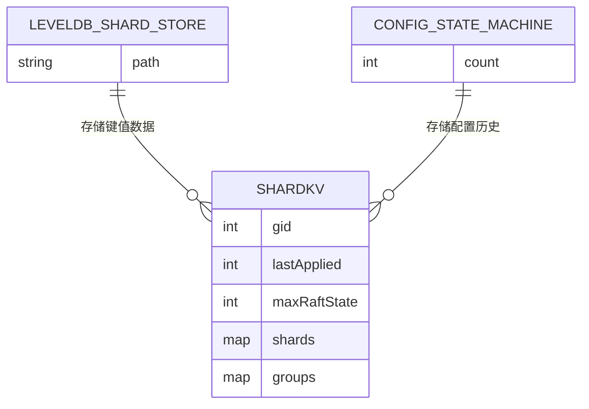
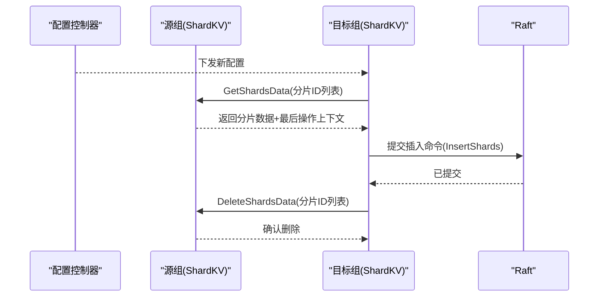
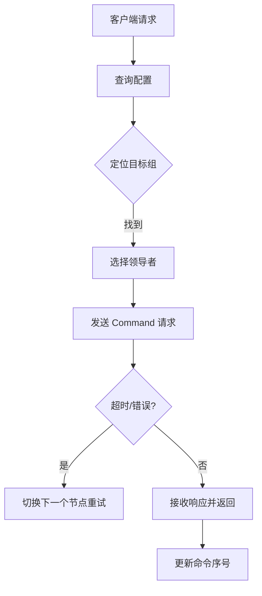
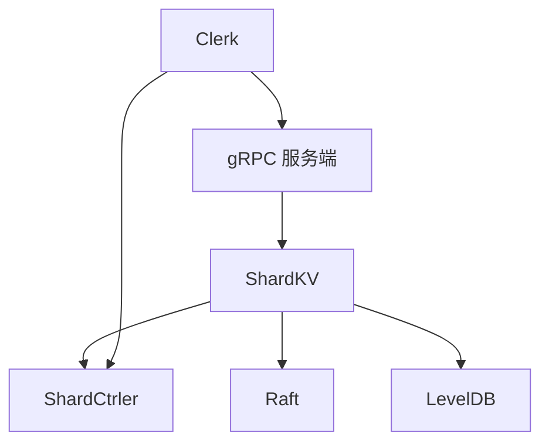

# 分片 KV 服务器

## 目录
1. [简介](#简介)
2. [项目结构](#项目结构)
3. [核心组件](#核心组件)
4. [架构总览](#架构总览)
5. [详细组件分析](#详细组件分析)
6. [依赖关系分析](#依赖关系分析)
7. [性能考量](#性能考量)
8. [故障排查指南](#故障排查指南)
9. [结论](#结论)
10. [附录](#附录)

## 简介
本文件面向分片 KV 服务器（ShardKV）的实现，系统基于 Raft 共识算法，使用 gRPC 提供服务接口，并以 LevelDB 作为持久化存储引擎。系统通过配置控制器（ShardCtrler）动态管理分片到副本组的映射，实现分片的自动迁移与负载均衡。本文从启动流程、配置管理、节点 ID 分配、集群地址解析、分片配置加载、gRPC 服务初始化、Raft 集成、存储引擎配置、数据持久化与快照管理、日志压缩、分片路由策略、数据迁移与负载均衡、客户端连接与并发控制、事务支持以及与配置控制器的通信协议等方面进行深入解析。

## 项目结构
仓库采用按功能域划分的模块化组织方式：
- cmd：可执行程序入口，包括 shardkvserver、shardctrler 等
- shardkv：分片 KV 服务实现，包含服务端、gRPC 适配器、客户端、配置与通用类型
- shardctrler：配置控制器实现，负责维护分片到组的映射
- raft：Raft 共识算法实现，含持久化、网络适配等
- shardkvpb：ShardKV 的 protobuf 定义
- labrpc、labgob：测试与实验环境下的 RPC 和编解码工具
- wiki：系统设计与机制说明文档

图表来源
- [cmd/shardkvserver/main.go](file://cmd/shardkvserver/main.go#L1-L59)
- [shardkv/server.go](file://shardkv/server.go#L759-L799)
- [shardkv/grpc_server.go](file://shardkv/grpc_server.go#L1-L98)
- [shardkv/client.go](file://shardkv/client.go#L1-L310)
- [shardctrler/server.go](file://shardctrler/server.go#L324-L343)
- [raft/raft.go](file://raft/raft.go#L37-L116)
- [raft/persister.go](file://raft/persister.go#L17-L111)
- [shardkvpb/shardkv.proto](file://shardkvpb/shardkv.proto#L1-L66)

章节来源
- [README.md](file://README.md#L1-L139)

## 核心组件
- 分片 KV 服务端（ShardKV）
  - 负责键值操作、分片状态机、配置变更应用、分片迁移与垃圾回收、通知通道管理、快照与恢复
- 配置控制器（ShardCtrler）
  - 维护分片到组的映射，提供 Join/Leave/Move/Query 操作，基于 Raft 保证一致性
- Raft 共识层
  - 提供日志复制、领导者选举、快照与持久化
- 存储引擎（LevelDB）
  - 用于持久化键值数据与配置状态机
- gRPC 服务
  - 对外暴露 KV 操作、分片拉取/删除、状态查询等 RPC 接口
- 客户端（Clerk）
  - 通过配置控制器查询当前配置，定位目标组与领导者，发起请求并处理重试与错误

章节来源
- [shardkv/server.go](file://shardkv/server.go#L76-L99)
- [shardctrler/server.go](file://shardctrler/server.go#L17-L26)
- [raft/raft.go](file://raft/raft.go#L37-L116)
- [shardkvpb/shardkv.proto](file://shardkvpb/shardkv.proto#L60-L66)

## 架构总览
系统由三部分组成：
- 配置控制器集群（ShardCtrler）：维护全局配置，提供查询与变更接口
- 分片 KV 组（ShardKV）：每个组内多节点，通过 Raft 保证一致性；每个节点维护本地分片状态与数据
- 客户端（Clerk）：先向配置控制器查询最新配置，再向对应组的领导者发起请求

图表来源
- [shardkv/client.go](file://shardkv/client.go#L165-L188)
- [shardkv/server.go](file://shardkv/server.go#L129-L157)
- [shardctrler/server.go](file://shardctrler/server.go#L179-L215)

## 详细组件分析

### 启动流程与参数解析
- 命令行参数
  - id：节点在组内的索引
  - gid：组 ID
  - cluster：本组节点地址列表（逗号分隔）
  - ctrlers：配置控制器地址列表（逗号分隔）
  - db：LevelDB 数据目录前缀
- 初始化步骤
  - 解析地址列表，校验 id 有效性
  - 构造 RaftPeer 列表（gRPC 客户端）
  - 创建数据库目录与持久化器
  - 启动 ShardKV 服务（StartServer），注册 gRPC 服务
  - 监听本地地址并启动 gRPC 服务

图表来源
- [cmd/shardkvserver/main.go](file://cmd/shardkvserver/main.go#L18-L58)

章节来源
- [cmd/shardkvserver/main.go](file://cmd/shardkvserver/main.go#L18-L58)

### 节点 ID 分配与集群地址解析
- 节点 ID（id）：在本组内的索引，用于确定监听地址与 Raft 成员身份
- 组 ID（gid）：标识副本组，用于配置控制器与跨组通信
- 地址解析：通过 cluster 参数解析本组成员地址；通过 ctrlers 参数解析配置控制器地址
- makeEnd：在测试环境中用于构造 labrpc 客户端端点，便于内部通信

章节来源
- [cmd/shardkvserver/main.go](file://cmd/shardkvserver/main.go#L19-L24)
- [shardkv/server.go](file://shardkv/server.go#L759-L784)
- [shardkv/config.go](file://shardkv/config.go#L255-L265)

### 分片配置加载与应用
- 默认配置：初始为空组映射
- 配置查询：客户端通过配置控制器查询最新配置或指定版本
- 配置应用：ShardKV 在 applier 中接收配置日志条目，更新当前配置与分片状态机
- 分片状态：Serving/Pulling/BePulling/GCing 四种状态，驱动迁移与回收流程

图表来源
- [shardkv/server.go](file://shardkv/server.go#L430-L445)
- [shardkv/common.go](file://shardkv/common.go#L70-L91)

章节来源
- [shardkv/server.go](file://shardkv/server.go#L348-L358)
- [shardctrler/server.go](file://shardctrler/server.go#L153-L159)

### gRPC 服务初始化与接口
- ShardKVService
  - Command：键值操作（PUT/APPEND/GET）
  - GetShardsData：拉取指定分片数据与最后操作上下文
  - DeleteShardsData：删除指定分片数据（远程 GC 后本地确认）
  - GetStatus：查询节点状态（ID、角色、任期、已应用、提交索引、存储大小、组 ID）
- 适配器：gRPC 服务端将 pb 请求转换为内部结构，调用 ShardKV 方法后返回 pb 响应

图表来源
- [shardkv/grpc_server.go](file://shardkv/grpc_server.go#L9-L16)
- [shardkv/grpc_server.go](file://shardkv/grpc_server.go#L18-L97)
- [shardkv/server.go](file://shardkv/server.go#L110-L127)

章节来源
- [shardkvpb/shardkv.proto](file://shardkvpb/shardkv.proto#L60-L66)
- [shardkv/grpc_server.go](file://shardkv/grpc_server.go#L1-L98)

### Raft 服务集成与持久化
- Raft 实例：通过 Start 提交日志，applier 监听 ApplyMsg 并应用到状态机
- 持久化：使用 Persister 将 Raft 状态与快照原子写入磁盘
- 快照：当 Raft 状态大小超过阈值时触发快照，保存状态机与分片状态
- 恢复：启动时读取快照，重建状态机

图表来源
- [shardkv/server.go](file://shardkv/server.go#L248-L326)
- [shardkv/server.go](file://shardkv/server.go#L467-L485)
- [raft/raft.go](file://raft/raft.go#L150-L164)
- [raft/persister.go](file://raft/persister.go#L92-L110)

章节来源
- [shardkv/server.go](file://shardkv/server.go#L759-L799)
- [raft/raft.go](file://raft/raft.go#L85-L116)
- [raft/persister.go](file://raft/persister.go#L28-L54)

### 存储引擎配置与数据模型
- LevelDB 分片存储
  - 键格式：s_{shardID}_{key}，值为字符串
  - 支持 Get/Put/Append/Close/Size
- 配置状态机（LevelDB）
  - 保存配置计数与各配置版本，支持查询最新配置
- 内存状态
  - shardStatus：分片状态数组
  - lastOperations：客户端去重上下文
  - notifyChans：等待响应的通知通道

图表来源
- [shardkv/server.go](file://shardkv/server.go#L25-L60)
- [shardctrler/server.go](file://shardctrler/server.go#L28-L82)
- [shardkv/server.go](file://shardkv/server.go#L76-L99)

章节来源
- [shardkv/server.go](file://shardkv/server.go#L25-L74)
- [shardctrler/server.go](file://shardctrler/server.go#L28-L82)

### 数据持久化、快照管理与日志压缩
- 快照触发条件：maxRaftState 非 -1 且 Raft 状态大小达到阈值
- 快照内容：包含 LevelDB 全量数据、分片状态、最后操作上下文、当前/上一配置
- 日志压缩：通过 Raft 的 Snapshot 机制丢弃已应用的日志，保留快照后的最小日志集
- 恢复：重启时读取快照，重建内存状态与 LevelDB

章节来源
- [shardkv/server.go](file://shardkv/server.go#L463-L485)
- [raft/raft.go](file://raft/raft.go#L120-L164)
- [raft/persister.go](file://raft/persister.go#L92-L110)

### 分片路由策略、数据迁移与负载均衡
- 路由策略：key2shard 映射到 0..NShards-1，根据当前配置决定目标组
- 迁移流程：
  1) 配置更新：配置控制器维护新映射
  2) 检测：ShardKV 定期轮询配置变更
  3) 拉取：将需要新增的分片标记为 Pulling，从原组拉取数据
  4) 插入：收到数据后插入到本地 Raft 日志并应用到 LevelDB
  5) 垃圾回收：本地确认后通知原组删除该分片数据
- 负载均衡：配置控制器在 Join/Leave/Migrate 时重新分配分片，使各组分片数量趋于均衡

图表来源
- [shardkv/server.go](file://shardkv/server.go#L549-L570)
- [shardkv/server.go](file://shardkv/server.go#L572-L643)
- [shardkv/server.go](file://shardkv/server.go#L645-L696)
- [shardkv/grpc_server.go](file://shardkv/grpc_server.go#L34-L84)

章节来源
- [shardkv/server.go](file://shardkv/server.go#L549-L696)
- [shardctrler/server.go](file://shardctrler/server.go#L84-L143)

### 客户端连接处理、并发控制与事务支持
- 客户端 Clerk
  - 通过配置控制器查询最新配置
  - 根据 key2shard 定位目标组与领导者，重试不同节点
  - 为每个客户端分配唯一 clientId，命令序号 commandId 保证幂等
- 并发控制
  - 读锁保护状态访问，避免竞态
  - 通知通道 map[int]chan 用于异步唤醒等待响应的 goroutine
  - 去重：记录每个客户端的最大已应用命令 ID，避免重复执行
- 事务支持
  - 通过 Raft 单条日志提交多个操作，保证原子性
  - 客户端侧通过命令序号实现幂等

图表来源
- [shardkv/client.go](file://shardkv/client.go#L206-L265)
- [shardkv/server.go](file://shardkv/server.go#L110-L127)

章节来源
- [shardkv/client.go](file://shardkv/client.go#L151-L310)
- [shardkv/common.go](file://shardkv/common.go#L93-L100)

### 与配置控制器的通信协议与配置更新机制
- 配置控制器接口
  - Join：加入新的组（gid -> 服务器列表）
  - Leave：离开指定组
  - Move：将某个分片移动到指定组
  - Query：查询指定版本或最新配置
- 配置更新流程
  - 客户端向配置控制器发起 Join/Leave/Move/Query
  - 配置控制器通过 Raft 提交命令，更新状态机并保存新配置
  - 分片 KV 组定期轮询配置变更，应用到本地状态机

章节来源
- [shardctrler/common.go](file://shardctrler/common.go#L108-L140)
- [shardctrler/server.go](file://shardctrler/server.go#L84-L159)
- [shardkv/server.go](file://shardkv/server.go#L549-L570)

## 依赖关系分析
- 组件耦合
  - ShardKV 依赖 Raft 提供一致性与日志提交，依赖 LevelDB 提供持久化
  - ShardKV 依赖配置控制器提供分片映射与配置变更
  - gRPC 服务端适配器将外部请求转换为内部方法调用
- 外部依赖
  - gRPC：服务间通信
  - LevelDB：键值存储
  - labrpc：测试环境下的本地 RPC

图表来源
- [shardkv/server.go](file://shardkv/server.go#L759-L799)
- [shardctrler/server.go](file://shardctrler/server.go#L324-L343)
- [shardkv/grpc_server.go](file://shardkv/grpc_server.go#L1-L98)

章节来源
- [shardkv/server.go](file://shardkv/server.go#L759-L799)
- [shardctrler/server.go](file://shardctrler/server.go#L324-L343)

## 性能考量
- 并发优化
  - 执行路径不持有锁，提升吞吐
  - 异步释放通知通道，减少内存占用
- 快照与日志压缩
  - 达到阈值时触发快照，降低日志长度
  - 通过 Raft 的 Snapshot 机制压缩日志
- 迁移效率
  - 并行拉取/删除任务，提高迁移速度
  - 使用批量写入减少磁盘 I/O

章节来源
- [shardkv/server.go](file://shardkv/server.go#L129-L157)
- [shardkv/server.go](file://shardkv/server.go#L463-L485)
- [shardkv/server.go](file://shardkv/server.go#L572-L696)

## 故障排查指南
- 常见错误
  - ErrWrongGroup：当前节点不负责该分片，需重新查询配置
  - ErrWrongLeader：非领导者节点，需切换到领导者
  - ErrTimeout：请求超时，检查网络与领导者状态
  - ErrOutDated：配置过旧，需重新获取最新配置
- 排查步骤
  - 检查配置控制器状态与日志大小
  - 检查分片 KV 组的领导者与提交进度
  - 查看快照与持久化状态
  - 使用 GetStatus 接口获取节点状态

章节来源
- [shardkv/common.go](file://shardkv/common.go#L38-L68)
- [shardkv/grpc_server.go](file://shardkv/grpc_server.go#L86-L97)
- [shardkv/server.go](file://shardkv/server.go#L105-L108)

## 结论
分片 KV 服务器通过 Raft 实现强一致，结合配置控制器实现动态分片与迁移，利用 gRPC 提供高效的服务接口，并以 LevelDB 保障数据持久化。系统在并发控制、快照与日志压缩、分片路由与迁移方面具备良好的工程实践，适合在生产环境中部署与扩展。

## 附录
- 启动示例与监控
  - 参考 README 的快速开始与监控命令
- 关键常量与时间间隔
  - 执行超时、配置轮询、迁移轮询、GC 轮询、空日志检测间隔

章节来源
- [README.md](file://README.md#L53-L139)
- [shardkv/common.go](file://shardkv/common.go#L21-L27)