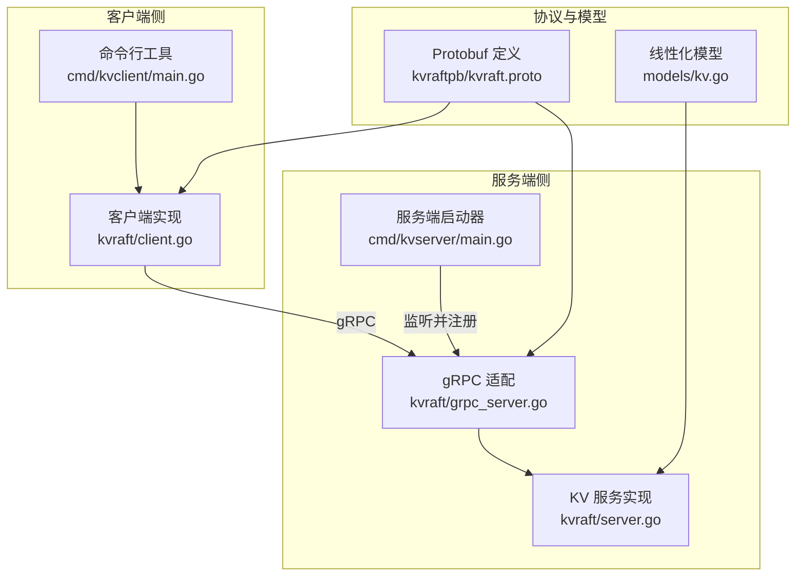
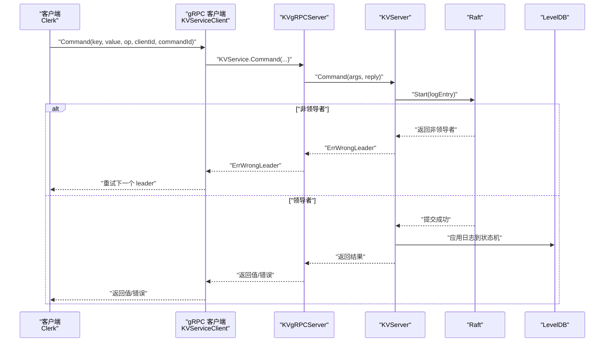
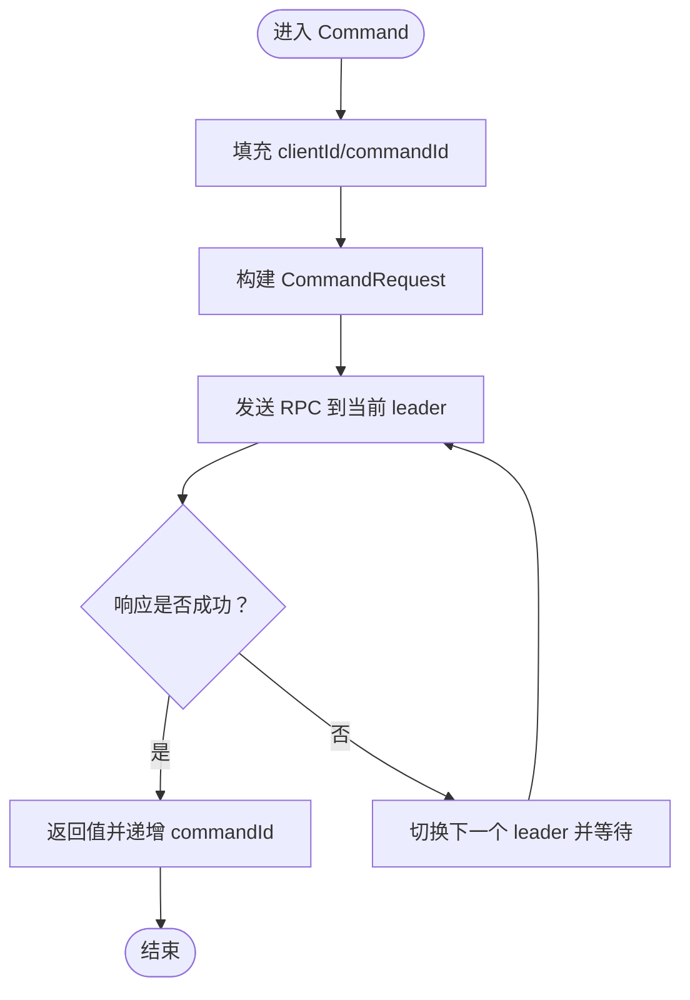
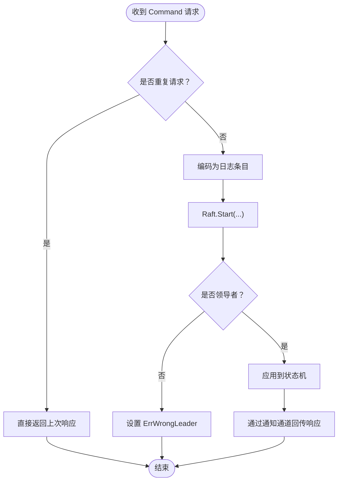
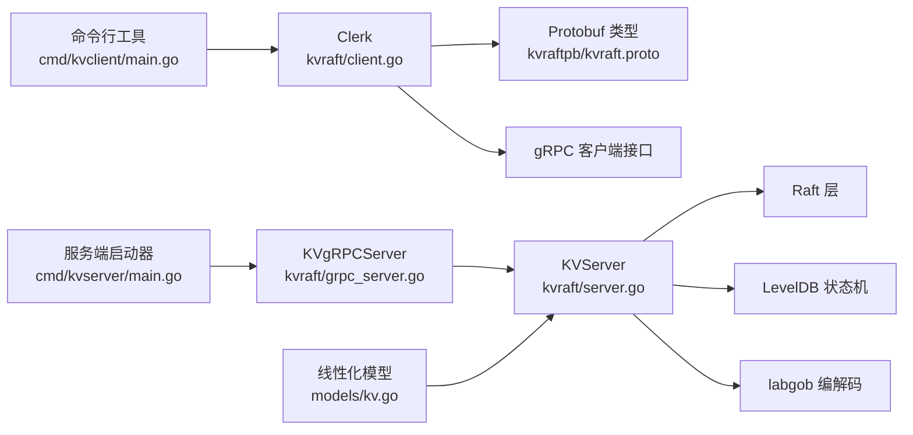

# 单机 KV 客户端

<cite>
**本文引用的文件**
- [cmd/kvclient/main.go](file://cmd/kvclient/main.go)
- [kvraft/client.go](file://kvraft/client.go)
- [kvraft/common.go](file://kvraft/common.go)
- [kvraft/server.go](file://kvraft/server.go)
- [kvraft/grpc_server.go](file://kvraft/grpc_server.go)
- [kvraftpb/kvraft.proto](file://kvraftpb/kvraft.proto)
- [cmd/kvserver/main.go](file://cmd/kvserver/main.go)
- [models/kv.go](file://models/kv.go)
- [kvraft/config.go](file://kvraft/config.go)
- [labrpc/labrpc.go](file://labrpc/labrpc.go)
- [README.md](file://README.md)
- [wiki/Storage-and-RPC.md](file://wiki/Storage-and-RPC.md)
- [kvraft/test_test.go](file://kvraft/test_test.go)
</cite>

## 目录
1. [简介](#简介)
2. [项目结构](#项目结构)
3. [核心组件](#核心组件)
4. [架构总览](#架构总览)
5. [详细组件分析](#详细组件分析)
6. [依赖关系分析](#依赖关系分析)
7. [性能考量](#性能考量)
8. [故障排查指南](#故障排查指南)
9. [结论](#结论)
10. [附录](#附录)

## 简介
本文件面向“单机 KV 客户端”的技术文档，聚焦于单机场景下的简化实现：客户端通过 gRPC 与单节点 KV 服务交互，完成 Get、Put、Append 基本操作；服务端基于 Raft 实现一致性与持久化，使用 LevelDB 作为状态机存储。文档将从系统架构、组件职责、数据与控制流、错误处理、超时与重试、幂等性与重复请求检测、状态机应用机制、通信协议与序列化、以及单机部署与性能测试等方面进行深入说明。

## 项目结构
该仓库采用分层与模块化组织方式：
- cmd/kvclient：单机 KV 客户端命令行工具，提供 get/put/append/status 操作入口
- cmd/kvserver：单机 KV 服务端启动器，负责监听地址、注册 gRPC 服务、启动 Raft 与 KV 服务
- kvraft：KV 客户端与服务端核心逻辑（客户端、服务端、gRPC 适配、通用类型与常量）
- kvraftpb：KV 服务的 Protobuf 定义与生成代码
- models：线性化模型定义（用于正确性验证）
- wiki：系统设计与运行说明文档
- 其他模块：raft、shardkv 等（在本单机场景中不直接参与）

图表来源
- [cmd/kvclient/main.go](file://cmd/kvclient/main.go#L1-L47)
- [kvraft/client.go](file://kvraft/client.go#L1-L144)
- [cmd/kvserver/main.go](file://cmd/kvserver/main.go#L1-L48)
- [kvraft/server.go](file://kvraft/server.go#L1-L342)
- [kvraft/grpc_server.go](file://kvraft/grpc_server.go#L1-L45)
- [kvraftpb/kvraft.proto](file://kvraftpb/kvraft.proto#L1-L41)
- [models/kv.go](file://models/kv.go#L1-L73)

章节来源
- [cmd/kvclient/main.go](file://cmd/kvclient/main.go#L1-L47)
- [cmd/kvserver/main.go](file://cmd/kvserver/main.go#L1-L48)
- [kvraftpb/kvraft.proto](file://kvraftpb/kvraft.proto#L1-L41)

## 核心组件
- 客户端 Clerk
  - 负责构造请求、选择当前 leader、发送 RPC、处理响应与错误、维护 clientId/commandId 幂等性
  - 提供 Get/Put/Append 方法，内部统一调用 Command
  - 支持 labrpc 模式与 gRPC 模式的两种客户端适配
- 服务端 KVServer
  - 封装 Raft 层，接收客户端请求，转换为日志条目提交到 Raft
  - 应用阶段将日志应用到状态机（LevelDB），并处理重复请求与快照
  - 提供 GetStatus 查询节点状态
- gRPC 适配 KVgRPCServer
  - 将 KVServer 的 Command/GetStatus 暴露为 gRPC 服务方法
- Protobuf 定义
  - 统一的请求/响应消息格式，支持序列化与跨语言传输
- 线性化模型
  - 定义键分区、初始状态、步进函数与操作描述，用于正确性验证

章节来源
- [kvraft/client.go](file://kvraft/client.go#L16-L144)
- [kvraft/server.go](file://kvraft/server.go#L88-L342)
- [kvraft/grpc_server.go](file://kvraft/grpc_server.go#L9-L45)
- [kvraftpb/kvraft.proto](file://kvraftpb/kvraft.proto#L13-L40)
- [models/kv.go](file://models/kv.go#L20-L73)

## 架构总览
单机 KV 客户端在单节点上运行，客户端通过 gRPC 连接到本地服务端，服务端内部运行 Raft 与状态机。客户端请求经由 gRPC 到达 KVgRPCServer，再由 KVServer 提交到 Raft 日志，最终应用到 LevelDB。

图表来源
- [kvraft/client.go](file://kvraft/client.go#L121-L143)
- [kvraft/grpc_server.go](file://kvraft/grpc_server.go#L18-L32)
- [kvraft/server.go](file://kvraft/server.go#L102-L139)

## 详细组件分析

### 客户端连接与请求发送
- 连接建立
  - 客户端启动时为每个服务器地址创建 gRPC 连接，并生成对应的 KVServiceClient
  - 使用不安全凭据（开发用途），生产环境建议替换为 TLS
- 请求发送
  - Get/Put/Append 内部统一调用 Command，填充 clientId/commandId
  - 使用带超时的上下文向当前 leader 发送 Command RPC
  - 若返回 ErrWrongLeader 或 ErrTimeout，则轮询下一个 leader 并短暂休眠避免紧循环
- 响应处理
  - 成功后递增 commandId，返回值
  - 失败或错误时继续重试直到成功

图表来源
- [kvraft/client.go](file://kvraft/client.go#L121-L143)

章节来源
- [kvraft/client.go](file://kvraft/client.go#L30-L46)
- [kvraft/client.go](file://kvraft/client.go#L121-L143)

### 服务端处理流程与状态机应用
- 重复请求检测
  - 服务端维护每个 clientId 的最大已应用 commandId 与最后响应
  - 对非 Get 请求，若请求的 commandId 已被应用则直接返回上次响应，避免重复执行
- 提交与应用
  - 将命令编码为日志条目并通过 Raft Start 提交
  - 在应用阶段，根据操作类型调用状态机（LevelDB）执行 Get/Put/Append
  - 领导者且当前任期匹配时，通过通知通道将响应回传给客户端
- 快照与恢复
  - 当 Raft 状态大小超过阈值时触发快照，保存 KV 映射与 lastOperations
  - 从快照恢复时重建状态机与重复请求上下文

图表来源
- [kvraft/server.go](file://kvraft/server.go#L102-L139)
- [kvraft/server.go](file://kvraft/server.go#L177-L236)
- [kvraft/server.go](file://kvraft/server.go#L242-L279)

章节来源
- [kvraft/server.go](file://kvraft/server.go#L98-L146)
- [kvraft/server.go](file://kvraft/server.go#L177-L236)
- [kvraft/server.go](file://kvraft/server.go#L242-L279)

### 通信协议与数据序列化
- Protobuf 定义
  - CommandRequest：包含 key、value、op（PUT/APPEND/GET）、clientId、commandId
  - CommandResponse：包含 err（OK/ErrNoKey/ErrWrongLeader/ErrTimeout）与 value
  - GetStatusRequest/GetStatusResponse：用于查询节点状态
  - KVService：提供 Command 与 GetStatus 两个 RPC 方法
- 序列化
  - 客户端与服务端均使用 Protobuf 编解码，保证跨语言与高效二进制传输
- 线性化模型
  - 键分区、初始状态为空字符串、步进函数按操作类型更新状态，便于正确性验证

章节来源
- [kvraftpb/kvraft.proto](file://kvraftpb/kvraft.proto#L13-L40)
- [models/kv.go](file://models/kv.go#L20-L73)

### 幂等性处理与重复请求检测
- 客户端侧
  - 每个 Clerk 维护 clientId 与 commandId，每次请求自增 commandId
  - 通过唯一标识（clientId, commandId）确保重复请求不会被重复执行
- 服务端侧
  - 记录每个 clientId 的 MaxAppliedCommandId 与 LastResponse
  - 非 Get 操作若发现重复请求，直接返回缓存响应，避免重复应用

章节来源
- [kvraft/client.go](file://kvraft/client.go#L16-L22)
- [kvraft/server.go](file://kvraft/server.go#L98-L108)
- [kvraft/server.go](file://kvraft/server.go#L143-L146)

### 错误处理与超时配置
- 错误类型
  - OK、ErrNoKey、ErrWrongLeader、ErrTimeout
- 超时与重试
  - 客户端执行超时为固定常量，超过后判定 ErrTimeout 并切换 leader
  - 服务端应用阶段同样存在超时判断，超时返回 ErrTimeout
- 状态查询
  - GetStatus 返回节点 Id、状态、任期、已应用索引、提交索引与存储大小

章节来源
- [kvraft/common.go](file://kvraft/common.go#L49-L70)
- [kvraft/common.go](file://kvraft/common.go#L9)
- [kvraft/client.go](file://kvraft/client.go#L100-L113)
- [kvraft/server.go](file://kvraft/server.go#L126-L131)
- [kvraft/grpc_server.go](file://kvraft/grpc_server.go#L34-L44)

### 单机部署与基本使用
- 启动服务端
  - 指定节点 id、服务器地址列表、数据库路径
  - 为除自身外的其他节点创建 Raft gRPC 客户端，注册 Raft 与 KV 服务
- 启动客户端
  - 指定服务器地址列表、操作类型（get/put/append/status）、键值
  - 支持批量状态查看，显示各节点 Id、角色、任期、已应用、提交索引与存储大小

章节来源
- [cmd/kvserver/main.go](file://cmd/kvserver/main.go#L16-L47)
- [cmd/kvclient/main.go](file://cmd/kvclient/main.go#L11-L46)

### 性能测试与调试
- 性能测试
  - 可参考分布式场景下的基准测试工具与指标，单机场景下可自行构造压力测试
- 调试方法
  - 开启 Debug 输出以观察请求/响应与应用过程
  - 使用 GetStatus 查看节点状态，定位异常
  - 在测试框架中可利用线性化模型检查一致性

章节来源
- [kvraft/common.go](file://kvraft/common.go#L13-L18)
- [kvraft/grpc_server.go](file://kvraft/grpc_server.go#L34-L44)
- [models/kv.go](file://models/kv.go#L20-L73)

## 依赖关系分析
- 客户端依赖
  - gRPC 客户端接口（KVServiceClient）
  - Protobuf 类型（CommandRequest/Response）
  - labrpc（在测试或兼容模式下使用）
- 服务端依赖
  - Raft 层（Start、GetState、GetRaftStateSize、Snapshot、CondInstallSnapshot）
  - LevelDB 状态机（Get/Put/Append/Size/Close）
  - labgob（日志与快照编解码）
- 协议与模型
  - kvraftpb 提供强类型消息定义
  - models 提供线性化模型

图表来源
- [kvraft/client.go](file://kvraft/client.go#L3-L14)
- [kvraft/server.go](file://kvraft/server.go#L3-L15)
- [kvraft/grpc_server.go](file://kvraft/grpc_server.go#L3-L7)
- [cmd/kvclient/main.go](file://cmd/kvclient/main.go#L3-L8)
- [cmd/kvserver/main.go](file://cmd/kvserver/main.go#L3-L13)
- [models/kv.go](file://models/kv.go#L1-L8)

章节来源
- [kvraft/client.go](file://kvraft/client.go#L3-L14)
- [kvraft/server.go](file://kvraft/server.go#L3-L15)
- [kvraft/grpc_server.go](file://kvraft/grpc_server.go#L3-L7)
- [cmd/kvclient/main.go](file://cmd/kvclient/main.go#L3-L8)
- [cmd/kvserver/main.go](file://cmd/kvserver/main.go#L3-L13)
- [models/kv.go](file://models/kv.go#L1-L8)

## 性能考量
- 存储与 RPC
  - 使用 LevelDB 作为状态机，具备高吞吐与持久化能力
  - gRPC 基于 HTTP/2，支持多路复用，适合并发请求
- 超时与重试
  - 客户端与服务端均设置超时，避免长时间阻塞
  - 重试策略通过轮询下一个 leader 实现，减少单点失败影响
- 快照与内存占用
  - 达到阈值时进行快照，降低 Raft 状态与日志大小，减少内存与磁盘压力

章节来源
- [wiki/Storage-and-RPC.md](file://wiki/Storage-and-RPC.md#L5-L15)
- [kvraft/server.go](file://kvraft/server.go#L238-L258)

## 故障排查指南
- 常见错误
  - ErrWrongLeader：当前节点非领导者，客户端会自动切换 leader
  - ErrTimeout：请求或应用阶段超时，建议检查网络与磁盘性能
  - ErrNoKey：Get 操作键不存在
- 排查步骤
  - 使用 status 命令查看节点状态（Id、State、Term、LastApplied、CommitIndex、StorageSize）
  - 检查服务端日志输出（Debug 打开时）
  - 确认 gRPC 地址与端口可达，证书配置正确
- 测试辅助
  - 使用线性化模型验证操作序列的正确性
  - 在测试框架中记录操作时间窗，辅助定位延迟问题

章节来源
- [kvraft/common.go](file://kvraft/common.go#L49-L70)
- [kvraft/client.go](file://kvraft/client.go#L100-L113)
- [kvraft/grpc_server.go](file://kvraft/grpc_server.go#L34-L44)
- [models/kv.go](file://models/kv.go#L20-L73)

## 结论
单机 KV 客户端在简化场景下实现了与分布式版本一致的核心语义：通过 gRPC 与 Raft 交互，结合 LevelDB 状态机与幂等性机制，保障了线性一致性与高可用特性。其设计清晰、职责明确，既可用于教学演示，也可作为生产环境的最小可行实现进行扩展。

## 附录

### API 接口与参数说明
- KVService.Command
  - 请求：key、value、op（PUT/APPEND/GET）、clientId、commandId
  - 响应：err（OK/ErrNoKey/ErrWrongLeader/ErrTimeout）、value
- KVService.GetStatus
  - 请求：空
  - 响应：id、state、term、last_applied、commit_index、storage_size

章节来源
- [kvraftpb/kvraft.proto](file://kvraftpb/kvraft.proto#L13-L40)

### 基本使用示例（单机）
- 启动服务端
  - ./output/kvserver -id 0 -addrs "localhost:5001" -db "kv-data"
- 客户端操作
  - 获取：./output/kvclient -addrs "localhost:5001" -op get -key mykey
  - 写入：./output/kvclient -addrs "localhost:5001" -op put -key mykey -value myvalue
  - 追加：./output/kvclient -addrs "localhost:5001" -op append -key mykey -value extra
  - 状态：./output/kvclient -addrs "localhost:5001" -op status

章节来源
- [cmd/kvserver/main.go](file://cmd/kvserver/main.go#L16-L47)
- [cmd/kvclient/main.go](file://cmd/kvclient/main.go#L11-L46)

### 单机部署与运行说明
- 依赖与构建
  - 使用 make build 生成所有二进制
- 文档与参考
  - 项目整体说明与运行指南参见根目录 README 与 wiki 文档

章节来源
- [README.md](file://README.md#L43-L49)
- [README.md](file://README.md#L51-L129)
- [wiki/Storage-and-RPC.md](file://wiki/Storage-and-RPC.md#L1-L19)