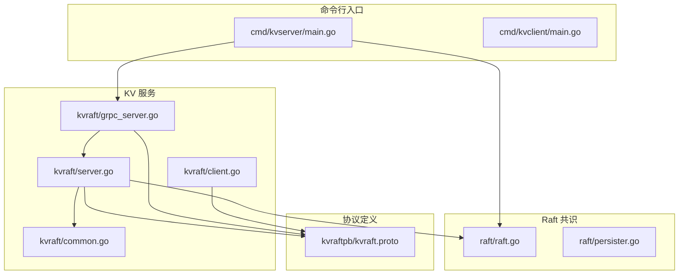
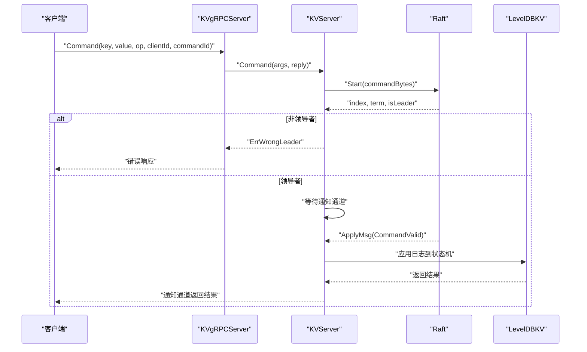
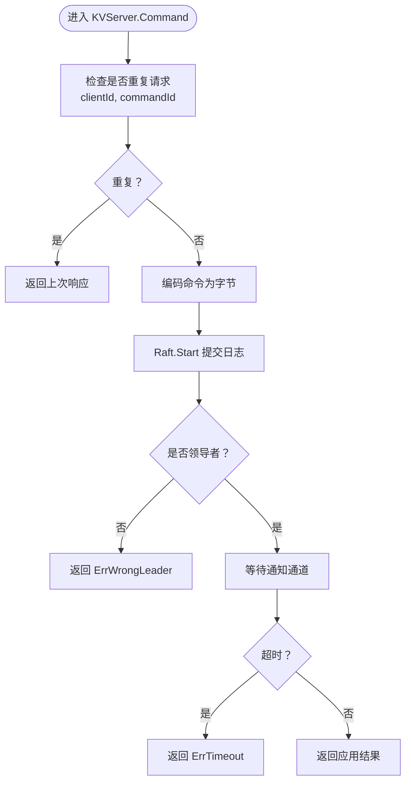
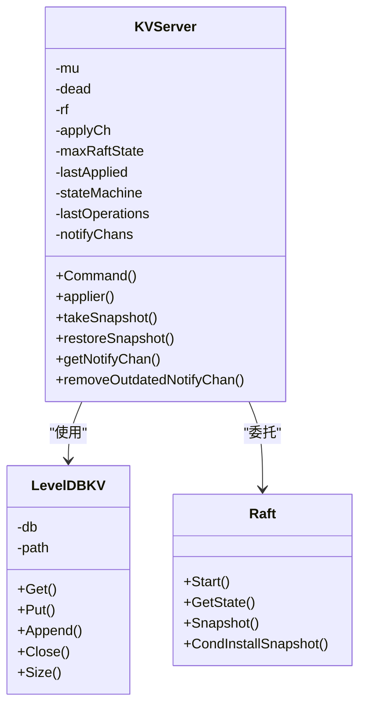
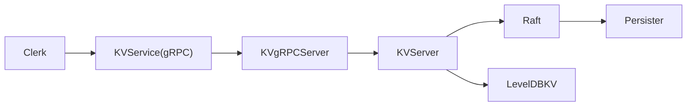

# 单机 KV 服务器

<cite>
**本文引用的文件**
- [cmd/kvserver/main.go](file://cmd/kvserver/main.go)
- [cmd/kvclient/main.go](file://cmd/kvclient/main.go)
- [kvraft/server.go](file://kvraft/server.go)
- [kvraft/grpc_server.go](file://kvraft/grpc_server.go)
- [kvraft/client.go](file://kvraft/client.go)
- [kvraft/common.go](file://kvraft/common.go)
- [kvraftpb/kvraft.proto](file://kvraftpb/kvraft.proto)
- [raft/raft.go](file://raft/raft.go)
- [raft/persister.go](file://raft/persister.go)
- [models/kv.go](file://models/kv.go)
- [README.md](file://README.md)
- [wiki/Architecture.md](file://wiki/Architecture.md)
- [wiki/Raft-Consensus.md](file://wiki/Raft-Consensus.md)
</cite>

## 目录
1. [简介](#简介)
2. [项目结构](#项目结构)
3. [核心组件](#核心组件)
4. [架构总览](#架构总览)
5. [详细组件分析](#详细组件分析)
6. [依赖关系分析](#依赖关系分析)
7. [性能考量](#性能考量)
8. [故障排查指南](#故障排查指南)
9. [结论](#结论)
10. [附录](#附录)

## 简介
本文件面向“单机 KV 服务器”的完整技术文档，聚焦于单机场景下的简化一致性实现：以 Raft 作为共识层，通过 gRPC 提供 KV API，使用 LevelDB 作为持久化存储，结合快照与日志压缩实现可扩展的状态机。文档覆盖启动参数与运行模式、gRPC 服务注册与客户端连接、请求路由与幂等性、状态机与日志处理、持久化与快照、与 Raft 的集成方式、以及部署与性能优化建议。

## 项目结构
仓库采用按功能域分层的组织方式：
- cmd/*：命令行入口（kvserver、kvclient）
- kvraft/*：单机 KV 服务核心逻辑（状态机、gRPC 适配、客户端）
- kvraftpb/*：KV 服务的 protobuf 定义与生成代码
- raft/*：Raft 实现（共识、日志、快照、持久化）
- shardkv/*、shardctrler/*：分布式分片 KV 与配置控制器（用于对比理解单机简化版）
- models/*：模型校验工具（Kv 模型）
- wiki/*：架构与实现说明文档

图表来源
- [cmd/kvserver/main.go](file://cmd/kvserver/main.go#L16-L47)
- [kvraft/server.go](file://kvraft/server.go#L318-L341)
- [kvraft/grpc_server.go](file://kvraft/grpc_server.go#L14-L44)
- [kvraftpb/kvraft.proto](file://kvraftpb/kvraft.proto#L1-L41)
- [raft/raft.go](file://raft/raft.go#L36-L60)
- [raft/persister.go](file://raft/persister.go#L17-L32)

章节来源
- [README.md](file://README.md#L1-L139)
- [wiki/Architecture.md](file://wiki/Architecture.md#L1-L29)

## 核心组件
- 启动入口与运行模式
  - 单机 KV 服务器入口在命令行中通过参数指定节点 ID、监听地址列表与数据目录，构建 Raft 对象与 KV 服务实例，并注册 gRPC 服务。
  - 运行模式为单节点 Raft（简化版），不涉及多节点通信；但保留了与 Raft 的完整接口契约，便于后续扩展到多节点。
- KV 服务核心
  - KVServer：封装状态机、Raft 接口、应用器 goroutine、通知通道、去重上下文等；负责将客户端请求转换为 Raft 日志条目并提交，再异步应用到状态机。
  - LevelDBKV：基于 LevelDB 的 KV 存储实现，支持 Get/Put/Append/Close/Size。
- gRPC 适配
  - KVgRPCServer：将 KVServer 的 Command/GetStatus 方法暴露为 gRPC 服务，完成请求/响应的类型转换。
- 客户端
  - Clerk：支持 gRPC 客户端与 labrpc 客户端两种模式；负责为每个请求分配唯一 (clientId, commandId)，并进行领导者切换与超时重试。
- 常量与类型
  - OperationOp、Err、CommandRequest/Response、OperationContext 等统一定义请求与错误语义。

章节来源
- [cmd/kvserver/main.go](file://cmd/kvserver/main.go#L16-L47)
- [kvraft/server.go](file://kvraft/server.go#L88-L100)
- [kvraft/server.go](file://kvraft/server.go#L17-L23)
- [kvraft/server.go](file://kvraft/server.go#L25-L86)
- [kvraft/grpc_server.go](file://kvraft/grpc_server.go#L9-L16)
- [kvraft/common.go](file://kvraft/common.go#L20-L91)
- [kvraft/client.go](file://kvraft/client.go#L16-L46)

## 架构总览
单机 KV 服务器采用“单节点 Raft + gRPC + LevelDB”的简化架构：
- 客户端通过 gRPC 调用 KVService.Command 发起读写请求；
- 请求经 KVgRPCServer 转换后交由 KVServer 处理；
- KVServer 将命令封装为字节并通过 Raft.Start 提交到日志；
- 应用器 goroutine 从 applyCh 获取已提交日志，去重后应用到 LevelDB；
- 客户端通过通知通道接收结果或超时返回。

图表来源
- [kvraft/grpc_server.go](file://kvraft/grpc_server.go#L18-L32)
- [kvraft/server.go](file://kvraft/server.go#L102-L139)
- [raft/raft.go](file://raft/raft.go#L10-L17)

## 详细组件分析

### 启动参数与运行模式
- 参数
  - -id：当前节点 ID（用于选择监听地址）
  - -addrs：逗号分隔的地址列表（形如 localhost:5001,localhost:5002,localhost:5003）
  - -db：LevelDB 数据目录路径
- 运行模式
  - 单机模式：仅初始化本地 Raft，不与其他节点建立连接；仍遵循 Raft 的领导者选举与日志复制流程，但只有一条日志链。
  - 服务注册：同时注册 RaftService 与 KVService 到同一 gRPC 服务器，便于统一端口管理。

章节来源
- [cmd/kvserver/main.go](file://cmd/kvserver/main.go#L17-L20)
- [cmd/kvserver/main.go](file://cmd/kvserver/main.go#L22-L32)
- [cmd/kvserver/main.go](file://cmd/kvserver/main.go#L34-L46)

### gRPC 服务注册与客户端连接
- 服务注册
  - 在 gRPC 服务器上注册 RaftService 与 KVService，分别对应 Raft 的内部 RPC 与 KV 的对外 API。
- 客户端连接
  - 客户端通过 gRPC 连接任一节点地址；默认向当前记录的领导者发起请求；若收到 ErrWrongLeader 或 ErrTimeout，则轮询下一个地址重试。
  - 支持 labrpc 模式（测试环境）与 gRPC 模式（生产环境）。

章节来源
- [cmd/kvserver/main.go](file://cmd/kvserver/main.go#L40-L41)
- [kvraft/grpc_server.go](file://kvraft/grpc_server.go#L18-L32)
- [kvraft/client.go](file://kvraft/client.go#L30-L46)
- [kvraft/client.go](file://kvraft/client.go#L121-L143)

### 请求路由与幂等性处理
- 请求路由
  - KVgRPCServer 将 gRPC 请求转换为 KVServer.Command 的内部结构，调用后直接返回结果。
- 幂等性与重复请求检测
  - KVServer 维护每个 clientId 的最大已应用 commandId 与最后一次响应；若新请求的 commandId 不大于该值，则直接复用上次响应，避免重复执行。
  - 应用器在 applyCh 中再次检查重复请求，确保跨 goroutine 的一致性。

图表来源
- [kvraft/server.go](file://kvraft/server.go#L102-L139)
- [kvraft/server.go](file://kvraft/server.go#L142-L146)

章节来源
- [kvraft/server.go](file://kvraft/server.go#L102-L146)
- [kvraft/common.go](file://kvraft/common.go#L24-L27)

### 状态机实现与日志处理
- 状态机
  - LevelDBKV：封装 leveldb，提供 Get/Put/Append/Close/Size；Append 会先读取旧值再拼接新值。
- 日志处理
  - KVServer.applier：专用应用器 goroutine，从 applyCh 读取已提交消息；区分 CommandValid 与 SnapshotValid 分支处理。
  - 去重：在应用前再次检查重复请求，避免重复写入。
  - 快照：当 Raft 状态大小超过阈值时触发 takeSnapshot，将 KVMap 与 lastOperations 写入快照；恢复时重建状态机与去重上下文。

图表来源
- [kvraft/server.go](file://kvraft/server.go#L88-L100)
- [kvraft/server.go](file://kvraft/server.go#L25-L86)
- [raft/raft.go](file://raft/raft.go#L10-L17)

章节来源
- [kvraft/server.go](file://kvraft/server.go#L176-L236)
- [kvraft/server.go](file://kvraft/server.go#L242-L279)
- [kvraft/server.go](file://kvraft/server.go#L292-L304)

### 持久化存储与快照
- Raft 持久化
  - Persister：保存 Raft 状态与快照，支持原子写入；单机模式下以文件形式存储。
- KV 快照
  - takeSnapshot：遍历 LevelDB，序列化 KV 映射与 lastOperations，调用 Raft.Snapshot 触发日志裁剪。
  - restoreSnapshot：反序列化快照并回放到 LevelDB，恢复 lastOperations。

章节来源
- [raft/persister.go](file://raft/persister.go#L71-L98)
- [kvraft/server.go](file://kvraft/server.go#L242-L279)

### 与 Raft 的集成方式与状态机复制机制
- 集成点
  - KVServer 通过 raft.Make 初始化 Raft，传入 peers/me/persister/applyCh；peers 在单机模式下为空或指向本地 gRPC 适配器。
  - KVServer 作为状态机，接收 ApplyMsg 并应用到 LevelDB；同时维护去重上下文与通知通道。
- 复制机制
  - 单机模式下，Raft 仍维护日志与提交索引，但只有一条日志链；快照用于日志压缩与状态恢复。
  - 通过 applyCh 异步应用，提升吞吐；通过通知通道将结果返回给客户端。

章节来源
- [kvraft/server.go](file://kvraft/server.go#L318-L341)
- [raft/raft.go](file://raft/raft.go#L108-L164)

### 客户端交互模式与错误处理策略
- 交互模式
  - Clerk 为每个客户端生成唯一 clientId；每次请求递增 commandId；默认向当前领导者发送请求。
  - 若收到 ErrWrongLeader 或 ErrTimeout，自动轮询下一个地址重试，并短暂退避。
- 错误处理
  - ErrWrongLeader：切换领导者并重试。
  - ErrTimeout：超时重试，避免阻塞。
  - Offline：客户端查询各节点状态时，若 RPC 失败则标记为 Offline。

章节来源
- [kvraft/client.go](file://kvraft/client.go#L121-L143)
- [kvraft/client.go](file://kvraft/client.go#L100-L113)

## 依赖关系分析
- 组件耦合
  - KVServer 与 Raft：强耦合（通过 applyCh 与 Start 接口）；KVServer 作为状态机实现者。
  - KVServer 与 LevelDBKV：组合关系；KVServer 通过接口抽象访问状态机。
  - KVgRPCServer 与 KVServer：组合关系；gRPC 层负责协议转换。
  - Clerk 与 KVService：依赖关系；通过 gRPC 客户端调用。
- 外部依赖
  - gRPC：用于服务间通信与客户端连接。
  - LevelDB：持久化存储。
  - labgob：序列化/反序列化（Raft 与 KV 快照）。

图表来源
- [kvraft/client.go](file://kvraft/client.go#L30-L46)
- [kvraft/grpc_server.go](file://kvraft/grpc_server.go#L14-L32)
- [kvraft/server.go](file://kvraft/server.go#L318-L341)
- [raft/persister.go](file://raft/persister.go#L28-L32)

章节来源
- [kvraftpb/kvraft.proto](file://kvraftpb/kvraft.proto#L37-L40)
- [kvraft/common.go](file://kvraft/common.go#L20-L91)

## 性能考量
- 并发与吞吐
  - 应用器 goroutine 与客户端 goroutine 解耦，避免锁持有时间过长。
  - 通知通道按索引映射，避免全局锁竞争。
- 去重与幂等
  - 客户端侧与服务端侧双重去重，减少重复写入开销。
- 快照与日志压缩
  - 当 Raft 状态大小达到阈值时触发快照，降低日志长度与恢复时间。
- I/O 优化
  - LevelDB 的批量写入与迭代器使用，减少磁盘扫描成本。
- 超时与重试
  - 客户端超时与领导者切换策略，提升可用性与稳定性。

章节来源
- [kvraft/server.go](file://kvraft/server.go#L176-L236)
- [kvraft/server.go](file://kvraft/server.go#L238-L258)
- [kvraft/common.go](file://kvraft/common.go#L9-L18)

## 故障排查指南
- 常见问题
  - ErrWrongLeader：确认客户端领导者 ID 是否正确更新；检查网络连通性。
  - ErrTimeout：增大 ExecuteTimeout 或检查服务端负载；确认应用器 goroutine 正常运行。
  - Offline：检查 gRPC 服务是否启动、端口是否被占用、防火墙设置。
- 诊断手段
  - 使用 GetStatus 查询节点状态（ID、角色、任期、已应用、提交索引、存储大小）。
  - 查看调试输出（DPrintf）定位日志提交与应用阶段。
- 快照与恢复
  - 若快照损坏，可通过重新启动并加载快照修复；注意 lastOperations 与 lastApplied 的一致性。

章节来源
- [kvraft/grpc_server.go](file://kvraft/grpc_server.go#L34-L44)
- [kvraft/server.go](file://kvraft/server.go#L171-L174)
- [kvraft/common.go](file://kvraft/common.go#L13-L18)

## 结论
单机 KV 服务器在保持与 Raft 完整接口一致的前提下，通过 gRPC 提供简洁的 KV API，并以 LevelDB 作为持久化引擎。其核心优势在于：
- 以单节点 Raft 实现强一致与可恢复能力；
- 通过快照与日志压缩控制存储增长；
- 通过去重与异步应用提升吞吐与可用性；
- 为后续扩展到多节点集群奠定基础。

## 附录

### 单机部署指南
- 启动步骤
  - 准备 LevelDB 数据目录（例如 kvserver-data）
  - 启动单机 KV 服务：指定 -id、-addrs、-db
  - 使用 kvclient 进行读写与状态查询
- 示例命令
  - 启动：./output/kvserver -id 0 -addrs "localhost:5001,localhost:5002,localhost:5003" -db "kvserver-data"
  - 客户端读取：./output/kvclient -addrs "localhost:5001,localhost:5002,localhost:5003" -op get -key mykey
  - 客户端写入：./output/kvclient -addrs "localhost:5001,localhost:5002,localhost:5003" -op put -key mykey -value myvalue
  - 状态查询：./output/kvclient -addrs "localhost:5001,localhost:5002,localhost:5003" -op status

章节来源
- [cmd/kvserver/main.go](file://cmd/kvserver/main.go#L17-L20)
- [cmd/kvclient/main.go](file://cmd/kvclient/main.go#L11-L46)

### 键值操作 API
- Command
  - 输入：key、value、op（PUT/APPEND/GET）、clientId、commandId
  - 输出：value、err
- GetStatus
  - 输入：空
  - 输出：节点 ID、角色、任期、已应用索引、提交索引、存储大小

章节来源
- [kvraftpb/kvraft.proto](file://kvraftpb/kvraft.proto#L13-L24)
- [kvraftpb/kvraft.proto](file://kvraftpb/kvraft.proto#L26-L35)
- [kvraft/grpc_server.go](file://kvraft/grpc_server.go#L18-L32)
- [kvraft/grpc_server.go](file://kvraft/grpc_server.go#L34-L44)

### 与 Raft 的集成与扩展
- 集成要点
  - 通过 Start 提交命令，通过 applyCh 异步应用；通过 Snapshot/CondInstallSnapshot 实现日志裁剪与恢复。
- 扩展到多节点
  - 为每个非本地节点创建 gRPC 客户端；在 KVServer 启动时传入 peers 列表；其余逻辑保持不变。

章节来源
- [raft/raft.go](file://raft/raft.go#L10-L17)
- [raft/raft.go](file://raft/raft.go#L118-L164)
- [cmd/kvserver/main.go](file://cmd/kvserver/main.go#L22-L29)

### 模型验证与正确性
- 使用 models/kv.go 中的 KvModel 对历史操作进行分区与状态演进验证，确保单键操作满足一致性要求。

章节来源
- [models/kv.go](file://models/kv.go#L20-L72)