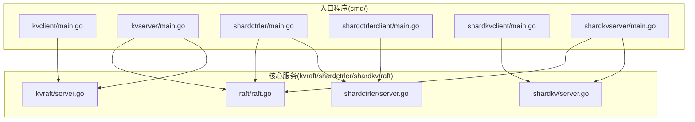
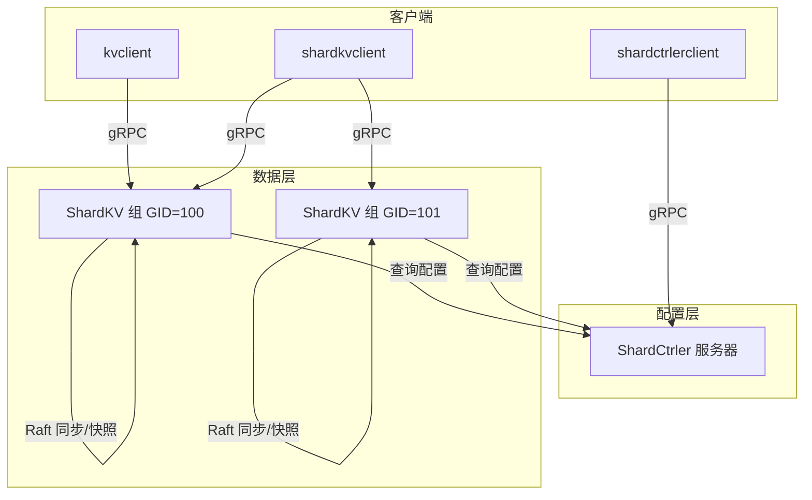
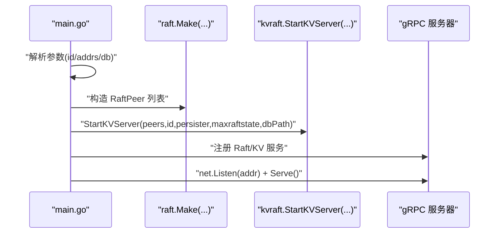
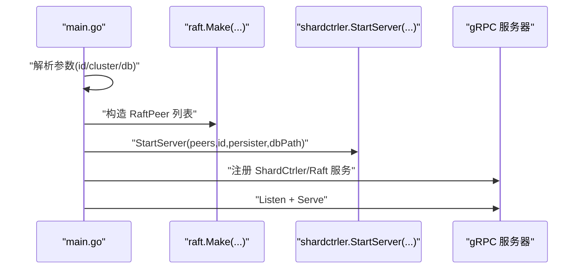
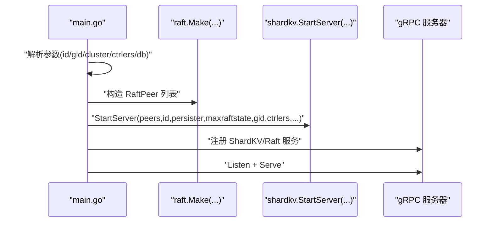
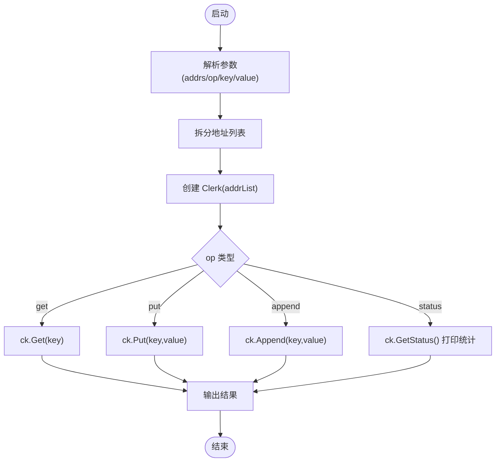
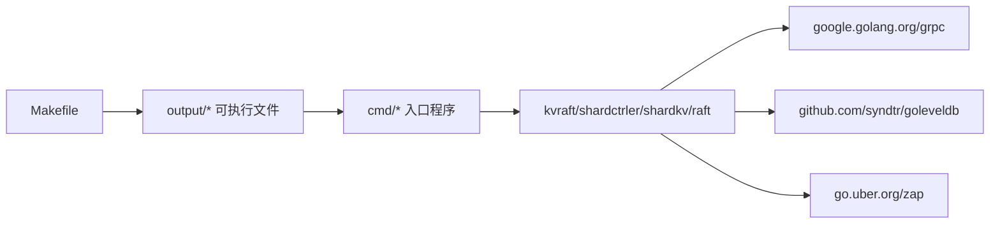

# 应用程序入口点

<cite>
**本文引用的文件**
- [cmd/kvclient/main.go](file://cmd/kvclient/main.go)
- [cmd/kvserver/main.go](file://cmd/kvserver/main.go)
- [cmd/shardctrler/main.go](file://cmd/shardctrler/main.go)
- [cmd/shardctrlerclient/main.go](file://cmd/shardctrlerclient/main.go)
- [cmd/shardkvclient/main.go](file://cmd/shardkvclient/main.go)
- [cmd/shardkvserver/main.go](file://cmd/shardkvserver/main.go)
- [kvraft/server.go](file://kvraft/server.go)
- [shardctrler/server.go](file://shardctrler/server.go)
- [shardkv/server.go](file://shardkv/server.go)
- [raft/raft.go](file://raft/raft.go)
- [README.md](file://README.md)
- [Makefile](file://Makefile)
- [go.mod](file://go.mod)
- [Dockerfile](file://Dockerfile)
</cite>

## 目录
1. [简介](#简介)
2. [项目结构](#项目结构)
3. [核心组件](#核心组件)
4. [架构总览](#架构总览)
5. [详细组件分析](#详细组件分析)
6. [依赖分析](#依赖分析)
7. [性能考虑](#性能考虑)
8. [故障排查指南](#故障排查指南)
9. [结论](#结论)
10. [附录](#附录)

## 简介
本文件聚焦于应用程序入口点，系统性梳理各可执行程序的功能、参数配置与启动流程；对比配置控制器服务器（ShardCtrler）、分片 KV 服务器（ShardKV）与单机 KV 服务器（KV）的实现差异；解释客户端程序的使用方法、参数传递与错误处理；给出完整的启动脚本、配置文件与环境变量说明；提供集群部署指南、服务发现与健康检查机制；覆盖进程管理、日志配置与监控集成；阐明组件间依赖关系与通信协议，并为系统管理员提供运维与排障建议。

## 项目结构
- 入口程序位于 cmd/ 下，每个子目录对应一个独立可执行程序：
  - kvclient：单机 KV 客户端
  - kvserver：单机 KV 服务器（基于 Raft）
  - shardctrler：配置控制器服务器（管理分片映射）
  - shardctrlerclient：配置控制器客户端（用于注册/迁移等操作）
  - shardkvclient：分片 KV 客户端
  - shardkvserver：分片 KV 服务器（多副本 Raft 组）
- 核心业务逻辑位于 kvraft、shardctrler、shardkv 与 raft 模块中，入口程序通过调用这些模块的构造函数与 gRPC 服务注册完成启动。

图表来源
- [cmd/kvserver/main.go](file://cmd/kvserver/main.go#L16-L47)
- [cmd/shardctrler/main.go](file://cmd/shardctrler/main.go#L18-L56)
- [cmd/shardkvserver/main.go](file://cmd/shardkvserver/main.go#L18-L58)
- [kvraft/server.go](file://kvraft/server.go#L318-L341)
- [shardctrler/server.go](file://shardctrler/server.go#L324-L343)
- [shardkv/server.go](file://shardkv/server.go#L759-L799)
- [raft/raft.go](file://raft/raft.go#L689-L725)

章节来源
- [Makefile](file://Makefile#L29-L36)
- [README.md](file://README.md#L43-L139)

## 核心组件
- 单机 KV 服务器（kvserver）：基于 Raft 的单机键值存储，持久化到 LevelDB，对外暴露 gRPC 服务。
- 配置控制器（shardctrler）：维护分片到组的映射，支持 join/leave/move/query 等配置变更命令。
- 分片 KV 服务器（shardkvserver）：按分片存储数据，周期性从配置控制器拉取最新配置，执行数据迁移与回收。
- 客户端：
  - kvclient：对单机 KV 进行 get/put/append/status 操作。
  - shardctrlerclient：对配置控制器进行 join/leave/move/query/status 操作。
  - shardkvclient：对分片 KV 进行 get/put/append/status/bench 操作。

章节来源
- [cmd/kvserver/main.go](file://cmd/kvserver/main.go#L16-L47)
- [cmd/shardctrler/main.go](file://cmd/shardctrler/main.go#L18-L56)
- [cmd/shardkvserver/main.go](file://cmd/shardkvserver/main.go#L18-L58)
- [cmd/kvclient/main.go](file://cmd/kvclient/main.go#L11-L46)
- [cmd/shardctrlerclient/main.go](file://cmd/shardctrlerclient/main.go#L12-L92)
- [cmd/shardkvclient/main.go](file://cmd/shardkvclient/main.go#L14-L95)

## 架构总览
系统采用三层架构：
- 配置层：ShardCtrler 集群维护全局配置（分片到组映射）。
- 数据层：ShardKV 多组集群按分片存储数据，组内通过 Raft 保证一致性。
- 客户端层：KV/分片 KV 客户端通过 gRPC 与服务交互，客户端内部负责重试、超时与状态查询。

图表来源
- [cmd/kvclient/main.go](file://cmd/kvclient/main.go#L11-L46)
- [cmd/shardkvclient/main.go](file://cmd/shardkvclient/main.go#L14-L95)
- [cmd/shardctrlerclient/main.go](file://cmd/shardctrlerclient/main.go#L12-L92)
- [shardkv/server.go](file://shardkv/server.go#L759-L799)
- [shardctrler/server.go](file://shardctrler/server.go#L324-L343)

## 详细组件分析

### 单机 KV 服务器（kvserver）
- 功能：启动 Raft 节点，挂载 gRPC 服务，监听本地地址。
- 关键流程：
  - 解析参数：节点 id、节点列表、数据库路径。
  - 构造 RaftPeer 列表（除自身外的其他节点）。
  - 创建 Raft 持久化器与 KV 服务器实例。
  - 注册 Raft 与 KV 的 gRPC 服务，启动监听。

图表来源
- [cmd/kvserver/main.go](file://cmd/kvserver/main.go#L16-L47)
- [kvraft/server.go](file://kvraft/server.go#L318-L341)
- [raft/raft.go](file://raft/raft.go#L689-L725)

章节来源
- [cmd/kvserver/main.go](file://cmd/kvserver/main.go#L16-L47)
- [kvraft/server.go](file://kvraft/server.go#L318-L341)

### 配置控制器服务器（shardctrler）
- 功能：维护分片配置（默认初始配置），支持 join/leave/move/query 命令，持久化到 LevelDB。
- 关键流程：
  - 解析参数：节点 id、集群地址列表、数据库路径。
  - 构造 RaftPeer 列表与持久化器。
  - 启动 ShardCtrler 服务，注册 gRPC 服务（含 Raft 内部服务）。

图表来源
- [cmd/shardctrler/main.go](file://cmd/shardctrler/main.go#L18-L56)
- [shardctrler/server.go](file://shardctrler/server.go#L324-L343)
- [raft/raft.go](file://raft/raft.go#L689-L725)

章节来源
- [cmd/shardctrler/main.go](file://cmd/shardctrler/main.go#L18-L56)
- [shardctrler/server.go](file://shardctrler/server.go#L324-L343)

### 分片 KV 服务器（shardkvserver）
- 功能：按分片存储数据，周期性检测配置变化并执行迁移/回收，支持跨组 gRPC 拉取与删除数据。
- 关键流程：
  - 解析参数：组内 id、组 id、本组地址列表、配置控制器地址列表、数据库路径。
  - 构造 RaftPeer 列表与持久化器。
  - 启动 ShardKV 服务，注册 gRPC 服务（含 Raft 内部服务）。

图表来源
- [cmd/shardkvserver/main.go](file://cmd/shardkvserver/main.go#L18-L58)
- [shardkv/server.go](file://shardkv/server.go#L759-L799)
- [raft/raft.go](file://raft/raft.go#L689-L725)

章节来源
- [cmd/shardkvserver/main.go](file://cmd/shardkvserver/main.go#L18-L58)
- [shardkv/server.go](file://shardkv/server.go#L759-L799)

### 客户端程序

#### 单机 KV 客户端（kvclient）
- 参数：-addrs（逗号分隔地址列表）、-op（get/put/append/status）、-key/-value。
- 行为：根据操作类型调用 KV 服务，打印结果或状态表格。

图表来源
- [cmd/kvclient/main.go](file://cmd/kvclient/main.go#L11-L46)

章节来源
- [cmd/kvclient/main.go](file://cmd/kvclient/main.go#L11-L46)

#### 配置控制器客户端（shardctrlerclient）
- 参数：-cluster（配置控制器地址列表）。
- 子命令：
  - join <gid>=<server1>,...：加入新组
  - leave <gid1> ...：移除组
  - move <shard> <gid>：移动指定分片到某组
  - query [num]：查询配置
  - status：查看控制器集群状态

章节来源
- [cmd/shardctrlerclient/main.go](file://cmd/shardctrlerclient/main.go#L12-L92)

#### 分片 KV 客户端（shardkvclient）
- 参数：-ctrlers（配置控制器地址列表）。
- 子命令：
  - get/put/append：读写数据
  - status：查看所有节点状态
  - bench <num>：基准测试

章节来源
- [cmd/shardkvclient/main.go](file://cmd/shardkvclient/main.go#L14-L95)

### 实现差异对比

#### 配置控制器服务器 vs 分片 KV 服务器 vs 单机 KV 服务器
- 一致性模型
  - 配置控制器：Raft，维护配置状态机。
  - 分片 KV：Raft，维护分片数据状态机，周期性从配置控制器拉取配置。
  - 单机 KV：Raft，维护键值状态机。
- 存储后端
  - 配置控制器：LevelDB 存储配置历史与计数。
  - 分片 KV：LevelDB 存储按分片组织的数据。
  - 单机 KV：LevelDB 存储键值数据。
- 服务注册
  - 配置控制器：注册 ShardCtrlerService 与 RaftService。
  - 分片 KV：注册 ShardKVService 与 RaftService。
  - 单机 KV：注册 KVService 与 RaftService。
- 配置交互
  - 分片 KV：定期向配置控制器查询最新配置，触发迁移与回收。
  - 配置控制器：直接应用 join/leave/move/query 命令。
  - 单机 KV：无配置控制器交互。

章节来源
- [shardctrler/server.go](file://shardctrler/server.go#L324-L343)
- [shardkv/server.go](file://shardkv/server.go#L759-L799)
- [kvraft/server.go](file://kvraft/server.go#L318-L341)
- [cmd/shardctrler/main.go](file://cmd/shardctrler/main.go#L46-L51)
- [cmd/shardkvserver/main.go](file://cmd/shardkvserver/main.go#L50-L52)
- [cmd/kvserver/main.go](file://cmd/kvserver/main.go#L39-L42)

## 依赖分析
- 构建与运行
  - Makefile 提供构建目标，生成 output/ 下的可执行文件。
  - go.mod 声明 grpc 与 zap 等依赖。
  - Dockerfile 提供基础镜像与工具链安装。
- 组件耦合
  - 入口程序仅负责参数解析与服务注册，核心逻辑在 kvraft/shardctrler/shardkv/raft 中。
  - gRPC 作为统一传输层，贯穿客户端与服务端。
- 外部依赖
  - google.golang.org/grpc：gRPC 服务与客户端。
  - github.com/syndtr/goleveldb：持久化存储。
  - go.uber.org/zap：日志记录。

图表来源
- [Makefile](file://Makefile#L29-L36)
- [go.mod](file://go.mod#L7-L21)

章节来源
- [Makefile](file://Makefile#L29-L36)
- [go.mod](file://go.mod#L7-L21)
- [Dockerfile](file://Dockerfile#L1-L9)

## 性能考虑
- 快照与日志裁剪
  - KV/分片 KV 在 Raft 状态大小超过阈值时触发快照，减少日志长度，提升稳定性。
- 并发与通知
  - 应用线程与复制线程分离，避免阻塞；通过通道通知客户端响应，降低内存占用。
- 迁移与回收
  - 分片 KV 通过周期性监控推进配置更新、拉取数据与回收旧数据，避免长时间不一致。
- 空条目保活
  - 当前任期无日志时追加空条目，避免提交停滞。

章节来源
- [kvraft/server.go](file://kvraft/server.go#L238-L258)
- [shardkv/server.go](file://shardkv/server.go#L463-L485)
- [shardkv/server.go](file://shardkv/server.go#L718-L722)

## 故障排查指南
- 常见问题定位
  - 节点未就绪：检查 Raft 状态（leader/follower/candidate）与 term、commitIndex、lastApplied。
  - 配置不一致：确认分片 KV 是否已拉取最新配置，控制器是否返回正确配置。
  - 数据迁移失败：检查源组与目标组的 gRPC 连接、权限与网络连通性。
- 日志与监控
  - 使用 status 命令查看节点状态与存储大小；结合日志输出定位异常。
- 建议步骤
  - 先验证配置控制器可用性，再验证分片 KV 组状态，最后验证客户端请求路径。
  - 若出现 ErrWrongGroup/ErrWrongLeader，需重试或等待领导者切换。

章节来源
- [cmd/kvclient/main.go](file://cmd/kvclient/main.go#L31-L42)
- [cmd/shardkvclient/main.go](file://cmd/shardkvclient/main.go#L54-L66)
- [shardkv/server.go](file://shardkv/server.go#L110-L127)

## 结论
本文档从入口程序入手，系统阐述了 eRaft 的启动流程、组件职责与差异、客户端使用方式、部署与运维要点。通过 Raft 与 gRPC 的组合，系统实现了高可用、可扩展的分布式键值存储与分片管理能力。建议在生产环境中结合健康检查、日志聚合与监控告警，确保集群稳定运行。

## 附录

### 启动脚本与示例
- 构建
  - make build
- 快速开始（参考 README）
  - 启动配置控制器集群（3 节点）
  - 启动两个分片 KV 组（每组 3 节点）
  - 使用 shardctrlerclient 注册组
  - 使用 shardkvclient 进行读写与基准测试
  - 使用 status 查看集群状态

章节来源
- [README.md](file://README.md#L51-L139)

### 参数与配置清单
- 单机 KV 服务器（kvserver）
  - -id：节点 id
  - -addrs：逗号分隔的节点地址列表
  - -db：LevelDB 数据目录
- 配置控制器服务器（shardctrler）
  - -id：节点 id
  - -cluster：控制器集群地址列表
  - -db：LevelDB 数据目录
- 分片 KV 服务器（shardkvserver）
  - -id：组内节点 id
  - -gid：组 id
  - -cluster：本组节点地址列表
  - -ctrlers：配置控制器地址列表
  - -db：LevelDB 数据目录
- 客户端
  - kvclient：-addrs, -op, -key, -value
  - shardctrlerclient：-cluster，子命令 join/leave/move/query/status
  - shardkvclient：-ctrlers，子命令 get/put/append/status/bench

章节来源
- [cmd/kvserver/main.go](file://cmd/kvserver/main.go#L17-L19)
- [cmd/shardctrler/main.go](file://cmd/shardctrler/main.go#L19-L22)
- [cmd/shardkvserver/main.go](file://cmd/shardkvserver/main.go#L19-L24)
- [cmd/kvclient/main.go](file://cmd/kvclient/main.go#L12-L15)
- [cmd/shardctrlerclient/main.go](file://cmd/shardctrlerclient/main.go#L13-L14)
- [cmd/shardkvclient/main.go](file://cmd/shardkvclient/main.go#L15-L16)

### 服务发现与健康检查
- 服务发现
  - 通过 -cluster/-ctrlers/-addrs 显式配置节点地址；生产环境可结合 DNS 或服务注册中心。
- 健康检查
  - status 命令输出节点角色、任期、已应用/提交索引与存储大小，用于判断健康状况。
  - 建议在负载均衡器或网关层增加 TCP/HTTP 探针，探测 gRPC 端口。

章节来源
- [cmd/kvclient/main.go](file://cmd/kvclient/main.go#L31-L42)
- [cmd/shardkvclient/main.go](file://cmd/shardkvclient/main.go#L54-L66)
- [cmd/shardctrlerclient/main.go](file://cmd/shardctrlerclient/main.go#L76-L88)

### 进程管理与日志
- 进程管理
  - 建议使用 systemd 或容器编排平台管理进程生命周期，设置重启策略与资源限制。
- 日志
  - 使用 zap 记录调试信息；生产环境建议集中收集与分级存储。

章节来源
- [go.mod](file://go.mod#L8-L9)