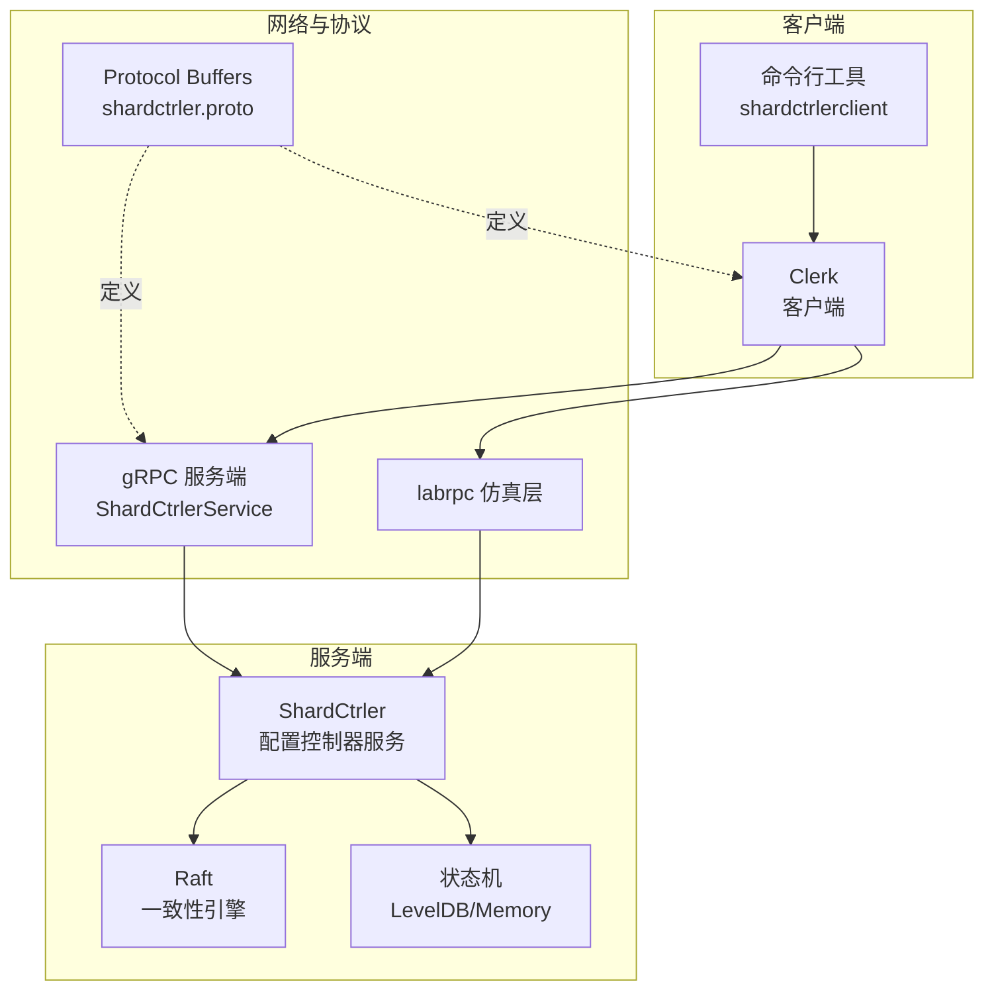
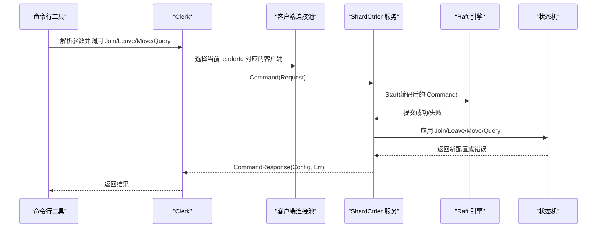
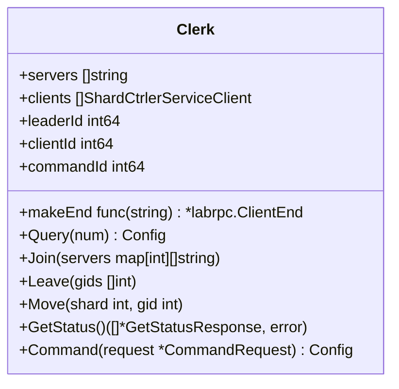
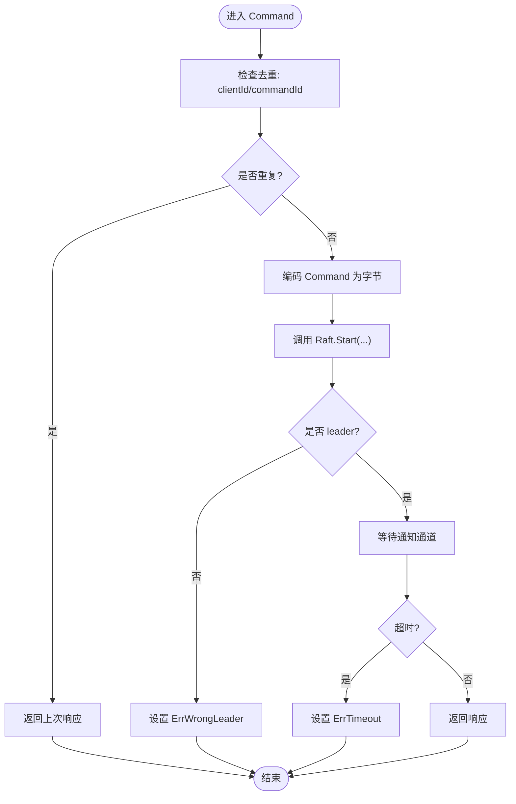
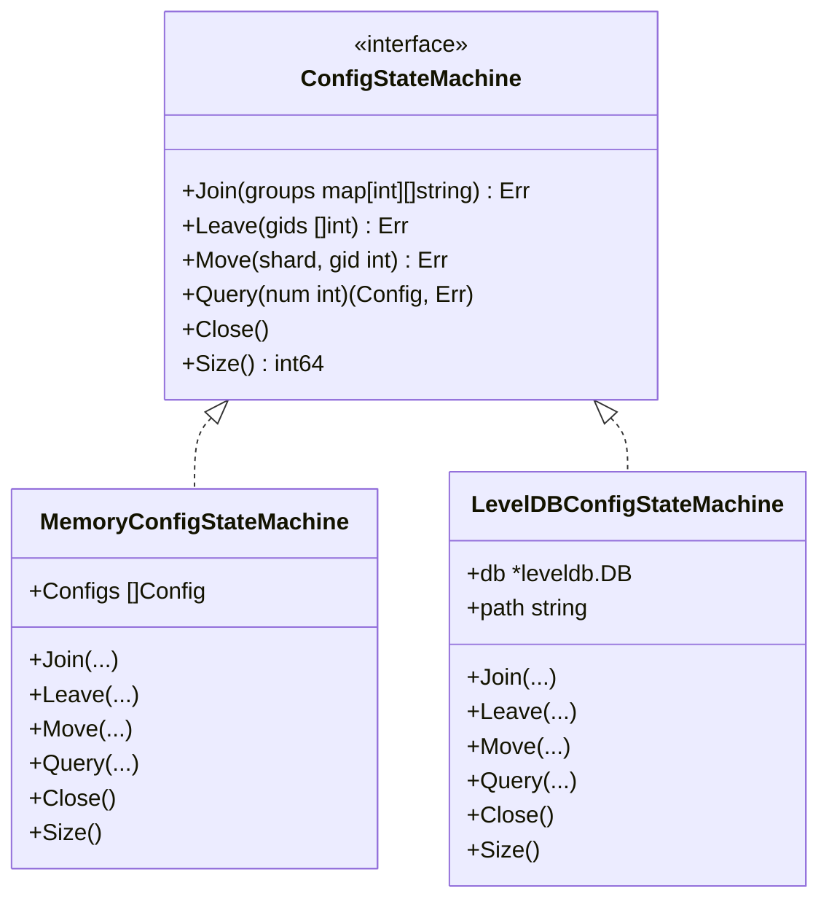
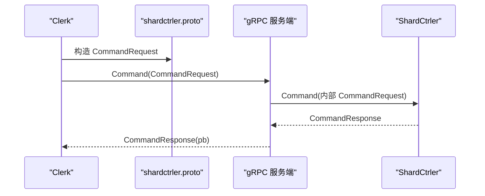
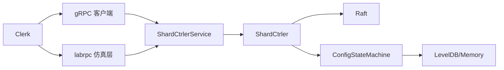

# 配置控制器客户端

<cite>
**本文引用的文件列表**
- [shardctrler/client.go](file://shardctrler/client.go)
- [shardctrler/common.go](file://shardctrler/common.go)
- [shardctrler/config.go](file://shardctrler/config.go)
- [shardctrler/server.go](file://shardctrler/server.go)
- [shardctrler/grpc_server.go](file://shardctrler/grpc_server.go)
- [shardctrler/configstm.go](file://shardctrler/configstm.go)
- [shardctrlerpb/shardctrler.proto](file://shardctrlerpb/shardctrler.proto)
- [cmd/shardctrlerclient/main.go](file://cmd/shardctrlerclient/main.go)
- [shardctrler/test_test.go](file://shardctrler/test_test.go)
- [labrpc/labrpc.go](file://labrpc/labrpc.go)
</cite>

## 目录
1. [简介](#简介)
2. [项目结构](#项目结构)
3. [核心组件](#核心组件)
4. [架构总览](#架构总览)
5. [详细组件分析](#详细组件分析)
6. [依赖关系分析](#依赖关系分析)
7. [性能考量](#性能考量)
8. [故障排查指南](#故障排查指南)
9. [结论](#结论)
10. [附录](#附录)

## 简介
本文件面向配置控制器客户端，系统性阐述其功能定位、API 接口、使用方法、命令行参数解析、服务器连接配置与请求构建方式，并深入分析 Join、Leave、Move、Query 等配置管理操作的实现细节。文档还覆盖错误处理、重试机制与超时配置，最佳实践（包括批量操作与原子性保障）、连接池管理、负载均衡与故障转移策略，以及与配置控制器服务器之间的通信协议与数据序列化机制。

## 项目结构
配置控制器客户端位于 shardctrler 包中，配合 shardctrlerpb 协议定义、labrpc 网络仿真层、以及 Raft 分布式一致性引擎共同工作。命令行工具用于演示与测试。



图表来源
- [shardctrler/client.go](file://shardctrler/client.go#L1-L215)
- [shardctrler/grpc_server.go](file://shardctrler/grpc_server.go#L1-L71)
- [shardctrler/server.go](file://shardctrler/server.go#L1-L344)
- [shardctrlerpb/shardctrler.proto](file://shardctrlerpb/shardctrler.proto#L1-L55)
- [cmd/shardctrlerclient/main.go](file://cmd/shardctrlerclient/main.go#L1-L103)

章节来源
- [shardctrler/client.go](file://shardctrler/client.go#L1-L215)
- [shardctrler/grpc_server.go](file://shardctrler/grpc_server.go#L1-L71)
- [shardctrler/server.go](file://shardctrler/server.go#L1-L344)
- [shardctrlerpb/shardctrler.proto](file://shardctrlerpb/shardctrler.proto#L1-L55)
- [cmd/shardctrlerclient/main.go](file://cmd/shardctrlerclient/main.go#L1-L103)

## 核心组件
- Clerk：客户端主体，负责向配置控制器提交配置变更请求，维护客户端标识与命令序号，执行重试与故障转移。
- ShardCtrler：服务端主控，封装 Raft 一致性引擎与状态机，处理客户端请求并返回配置结果。
- ConfigStateMachine：抽象状态机接口，支持内存与 LevelDB 实现；负责 Join/Leave/Move/Query 的具体逻辑。
- gRPC 服务端：将内部请求转换为内部结构，调用 ShardCtrler.Command 并返回响应。
- 命令行工具：解析命令行参数，构造 Clerk 并执行 Join/Leave/Move/Query/Status 操作。

章节来源
- [shardctrler/client.go](file://shardctrler/client.go#L21-L215)
- [shardctrler/server.go](file://shardctrler/server.go#L17-L344)
- [shardctrler/configstm.go](file://shardctrler/configstm.go#L7-L167)
- [shardctrler/grpc_server.go](file://shardctrler/grpc_server.go#L9-L71)
- [cmd/shardctrlerclient/main.go](file://cmd/shardctrlerclient/main.go#L12-L103)

## 架构总览
客户端通过 gRPC 或 labrpc 两种路径与服务端交互：
- gRPC 路径：直接连接服务端地址，发送 Command 请求，等待响应。
- labrpc 路径：在测试环境中通过 labrpc 仿真网络进行 RPC 调用。



图表来源
- [shardctrler/client.go](file://shardctrler/client.go#L159-L197)
- [shardctrler/server.go](file://shardctrler/server.go#L179-L215)
- [shardctrler/grpc_server.go](file://shardctrler/grpc_server.go#L18-L58)

## 详细组件分析

### 客户端 Clerk
- 连接管理：维护服务器地址列表与对应的 gRPC 客户端；支持通过 labrpc 仿真层桥接。
- 命令执行：为每次请求分配唯一 (clientId, commandId)，在超时时间内尝试当前 leader，失败则轮询下一个节点。
- 查询与状态：提供 Query 获取最新或历史配置；GetStatus 收集各节点状态信息。



图表来源
- [shardctrler/client.go](file://shardctrler/client.go#L21-L197)

章节来源
- [shardctrler/client.go](file://shardctrler/client.go#L36-L197)

### 服务端 ShardCtrler
- 状态机：维护 ConfigStateMachine，支持 Join/Leave/Move/Query。
- 去重与通知：记录每个客户端的最大已应用 commandId，避免重复执行；通过通道通知客户端响应。
- 超时与错误：在指定超时内等待 Raft 提交与应用，否则返回 ErrTimeout；非 leader 返回 ErrWrongLeader。



图表来源
- [shardctrler/server.go](file://shardctrler/server.go#L179-L215)

章节来源
- [shardctrler/server.go](file://shardctrler/server.go#L17-L344)

### 配置状态机 ConfigStateMachine
- 内存实现：维护 Config 列表，按顺序生成新版本配置。
- LevelDB 实现：持久化保存配置版本，支持重启后恢复。
- Join/Leave/Move/Query：根据负载均衡策略调整分片分布，确保均衡性。



图表来源
- [shardctrler/configstm.go](file://shardctrler/configstm.go#L7-L167)

章节来源
- [shardctrler/configstm.go](file://shardctrler/configstm.go#L1-L167)

### 通信协议与序列化
- Protocol Buffers 定义：Config、CommandRequest/Response、GetStatusRequest/Response、ShardCtrlerService。
- gRPC 服务端：将 pb 层请求转换为内部结构，调用 ShardCtrler.Command，再将内部响应转换为 pb 响应。
- labrpc 路径：通过 LabrpcShardCtrlerClient 将内部结构映射到 labrpc 调用。



图表来源
- [shardctrlerpb/shardctrler.proto](file://shardctrlerpb/shardctrler.proto#L24-L54)
- [shardctrler/grpc_server.go](file://shardctrler/grpc_server.go#L18-L58)
- [shardctrler/client.go](file://shardctrler/client.go#L159-L197)

章节来源
- [shardctrlerpb/shardctrler.proto](file://shardctrlerpb/shardctrler.proto#L1-L55)
- [shardctrler/grpc_server.go](file://shardctrler/grpc_server.go#L1-L71)

### 命令行参数解析与使用
- 参数：-cluster 指定服务端地址列表，空格分隔；支持 join、leave、move、query、status 子命令。
- join：形如 “gid=server1,server2,...”，可多次传入以一次添加多个组。
- leave：传入一个或多个 gid。
- move：传入 shard 与目标 gid。
- query：可选参数 num，不传或传 -1 表示查询最新配置。
- status：查询各节点状态。

章节来源
- [cmd/shardctrlerclient/main.go](file://cmd/shardctrlerclient/main.go#L12-L103)

### 配置管理操作实现细节

#### Join（加入复制组）
- 输入：map[gid][]servers，表示新增的组及其成员服务器。
- 处理：复制上一版本配置，合并新组；计算当前分片到组的映射，反复迁移分片使最大最小组分片数差不超过 1；生成新配置并持久化。
- 结果：返回新配置，Num 自增。

章节来源
- [shardctrler/server.go](file://shardctrler/server.go#L84-L112)
- [shardctrler/configstm.go](file://shardctrler/configstm.go#L26-L54)

#### Leave（移除复制组）
- 输入：[]gid，表示要删除的组。
- 处理：从 Groups 中删除对应组；收集被移除组的分片，若仍有组存在，则将这些孤儿分片重新分配到最少分片的组中；生成新配置并持久化。
- 结果：返回新配置，Num 自增。

章节来源
- [shardctrler/server.go](file://shardctrler/server.go#L114-L143)
- [shardctrler/configstm.go](file://shardctrler/configstm.go#L56-L86)

#### Move（移动单个分片）
- 输入：shard 与目标 gid。
- 处理：直接更新该分片的目标组，生成新配置并持久化。
- 结果：返回新配置，Num 自增。

章节来源
- [shardctrler/server.go](file://shardctrler/server.go#L145-L151)
- [shardctrler/configstm.go](file://shardctrler/configstm.go#L88-L94)

#### Query（查询配置）
- 输入：num，-1 或负数表示查询最新配置。
- 处理：从状态机读取最新或指定版本配置。
- 结果：返回对应配置。

章节来源
- [shardctrler/server.go](file://shardctrler/server.go#L153-L159)
- [shardctrler/configstm.go](file://shardctrler/configstm.go#L96-L101)

### 错误处理、重试机制与超时配置
- 错误类型：OK、ErrWrongLeader、ErrTimeout。
- 重试策略：当返回 ErrWrongLeader 或 ErrTimeout 时，切换到下一个服务器地址继续尝试。
- 超时控制：客户端侧使用 ExecuteTimeout；服务端侧在等待通知通道时也设置超时。
- 去重：客户端为每个请求分配唯一 (clientId, commandId)，服务端基于 clientId 记录最大已应用 commandId，避免重复执行。

章节来源
- [shardctrler/common.go](file://shardctrler/common.go#L88-L106)
- [shardctrler/common.go](file://shardctrler/common.go#L45)
- [shardctrler/client.go](file://shardctrler/client.go#L182-L196)
- [shardctrler/server.go](file://shardctrler/server.go#L199-L207)
- [shardctrler/server.go](file://shardctrler/server.go#L182-L188)

### 连接池管理、负载均衡与故障转移
- 连接池：Clerk 维护与各服务器的 gRPC 客户端；在 labrpc 模式下动态创建 LabrpcShardCtrlerClient。
- 负载均衡：Join/Leave/Move 操作内部通过 Group2Shards 与 GetGIDWithMinimumShards/GetGIDWithMaximumShards 实现均衡策略。
- 故障转移：客户端在每次请求失败时轮询下一个服务器地址，实现快速故障转移。

章节来源
- [shardctrler/client.go](file://shardctrler/client.go#L36-L60)
- [shardctrler/configstm.go](file://shardctrler/configstm.go#L109-L156)

### 使用方法与最佳实践
- 单次操作原子性：每个 Join/Leave/Move/Query 在 Raft 层作为一条日志提交，保证原子性与线性一致。
- 批量操作：可通过多次调用组合实现批量 Join/Leave；Move 可循环批量移动多个分片。
- 最佳实践：
  - 使用 -cluster 指定所有可用服务端地址，确保故障转移生效。
  - 在高并发场景下，合理设置客户端超时与重试间隔，避免过度重试导致拥塞。
  - 历史查询：通过 query num 获取历史配置快照，结合测试验证一致性。

章节来源
- [cmd/shardctrlerclient/main.go](file://cmd/shardctrlerclient/main.go#L12-L103)
- [shardctrler/test_test.go](file://shardctrler/test_test.go#L80-L182)

## 依赖关系分析
- 客户端依赖：gRPC 客户端、labrpc 仿真层、shardctrlerpb 协议。
- 服务端依赖：Raft 引擎、labgob 编解码、LevelDB/内存状态机。
- 测试依赖：labrpc 网络仿真、raft 测试框架。



图表来源
- [shardctrler/client.go](file://shardctrler/client.go#L36-L60)
- [shardctrler/grpc_server.go](file://shardctrler/grpc_server.go#L18-L58)
- [shardctrler/server.go](file://shardctrler/server.go#L324-L343)

章节来源
- [shardctrler/client.go](file://shardctrler/client.go#L1-L215)
- [shardctrler/server.go](file://shardctrler/server.go#L1-L344)
- [shardctrler/grpc_server.go](file://shardctrler/grpc_server.go#L1-L71)

## 性能考量
- 超时与重试：客户端侧 ExecuteTimeout 控制单次请求上限；服务端侧等待通知通道也有超时保护，避免阻塞。
- 去重优化：服务端基于 clientId 记录最大已应用 commandId，避免重复应用日志，提升吞吐。
- 状态机选择：LevelDB 实现具备持久化能力，适合生产环境；内存实现适合测试与快速验证。
- 负载均衡：Join/Leave/Move 内部均衡策略减少分片倾斜，提高整体性能。

[本节为通用性能建议，无需特定文件来源]

## 故障排查指南
- 常见错误：
  - ErrWrongLeader：当前节点不是 leader，客户端会自动轮询下一个节点。
  - ErrTimeout：请求在 ExecuteTimeout 内未得到响应，需检查网络与服务端健康状况。
- 排查步骤：
  - 使用 status 子命令查看各节点角色、任期、提交索引与存储大小。
  - 检查 -cluster 地址是否正确且可达。
  - 观察服务端日志输出，确认 Raft 状态与应用进度。
- 测试辅助：使用测试框架提供的 make_config 与 shutdown/start 服务器能力，模拟分区与重启场景。

章节来源
- [shardctrler/common.go](file://shardctrler/common.go#L88-L106)
- [shardctrler/common.go](file://shardctrler/common.go#L45)
- [cmd/shardctrlerclient/main.go](file://cmd/shardctrlerclient/main.go#L76-L88)
- [shardctrler/config.go](file://shardctrler/config.go#L233-L263)

## 结论
配置控制器客户端通过清晰的 API 设计与稳健的错误处理机制，实现了 Join、Leave、Move、Query 等配置管理操作。借助 Raft 一致性与状态机，客户端能够以原子性与线性一致的方式完成配置变更。客户端支持 gRPC 与 labrpc 两种通信路径，具备良好的可测试性与可扩展性。在生产环境中，建议采用 LevelDB 状态机与合理的超时与重试策略，确保高可用与高性能。

[本节为总结性内容，无需特定文件来源]

## 附录

### API 定义概览
- CommandRequest：包含 Join/Leave/Move/Query 的参数字段与操作类型。
- CommandResponse：返回 Err 与 Config。
- ShardCtrlerService：提供 Command 与 GetStatus 两个 RPC。

章节来源
- [shardctrlerpb/shardctrler.proto](file://shardctrlerpb/shardctrler.proto#L24-L54)

### 数据模型
```mermaid
erDiagram
CONFIG {
int Num
int[10] Shards
map<int, string[]> Groups
}
```

图表来源
- [shardctrlerpb/shardctrler.proto](file://shardctrlerpb/shardctrler.proto#L7-L15)
- [shardctrler/common.go](file://shardctrler/common.go#L29-L43)