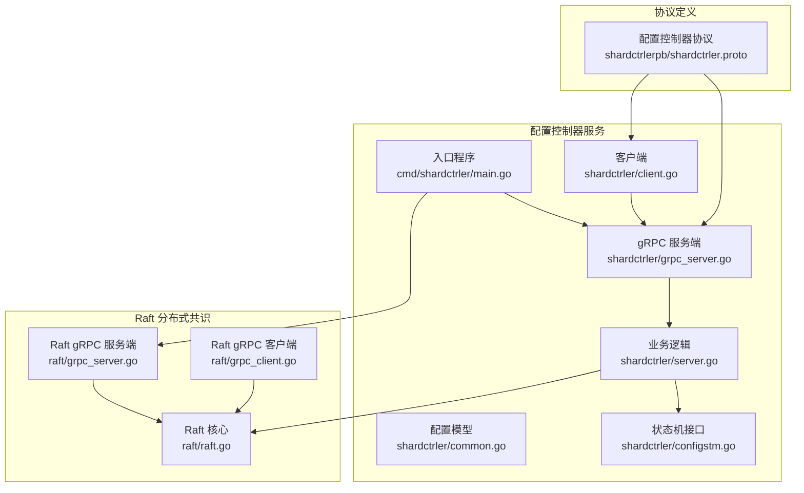
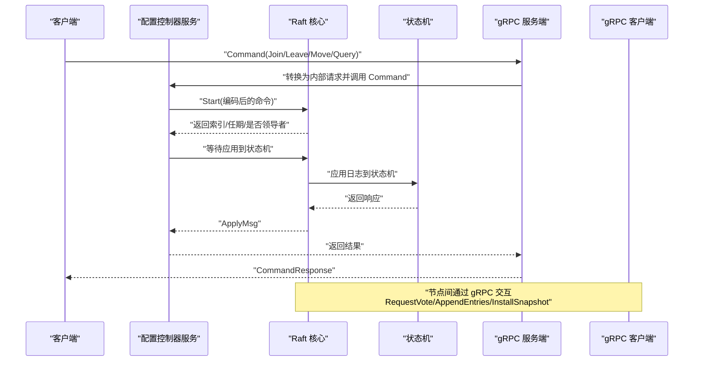
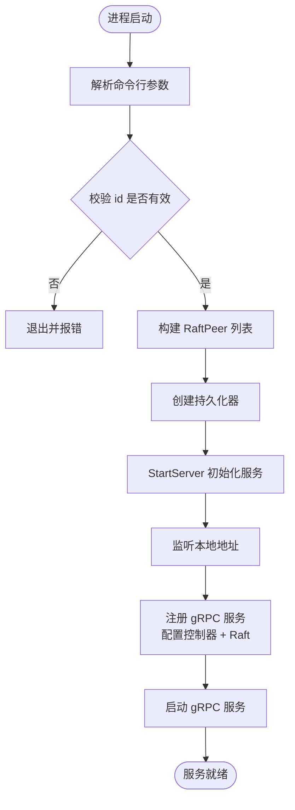
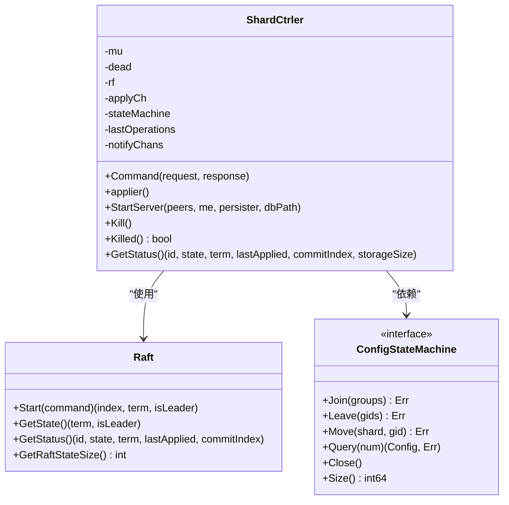
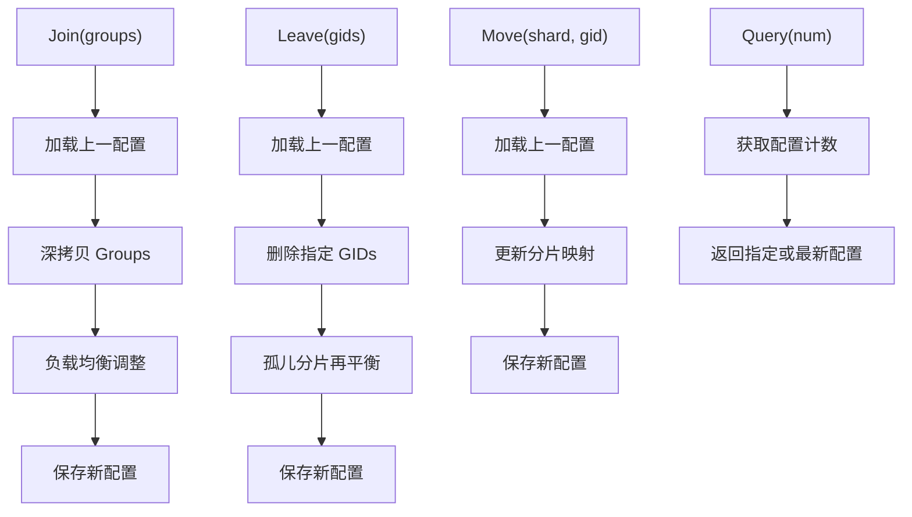
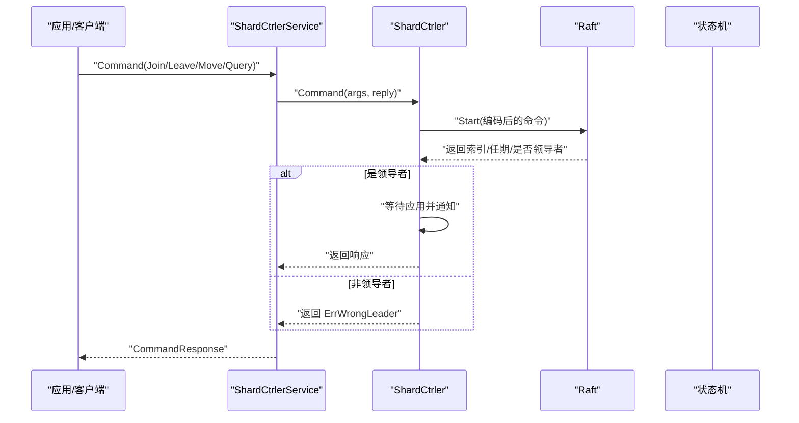
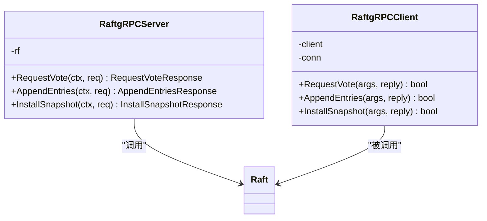
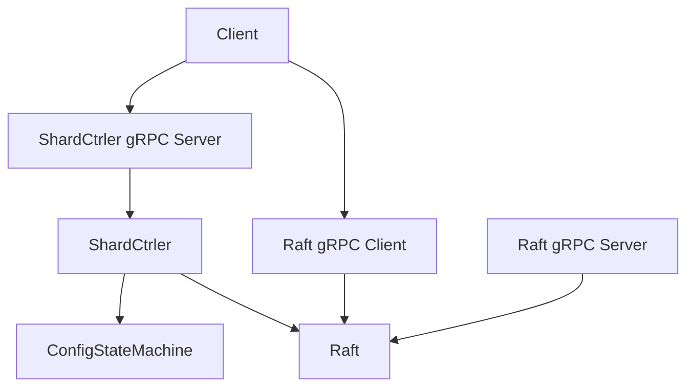

# 配置控制器服务器

<cite>
**本文档引用的文件**
- [cmd/shardctrler/main.go](file://cmd/shardctrler/main.go)
- [shardctrler/server.go](file://shardctrler/server.go)
- [shardctrler/config.go](file://shardctrler/config.go)
- [shardctrler/grpc_server.go](file://shardctrler/grpc_server.go)
- [shardctrler/common.go](file://shardctrler/common.go)
- [shardctrler/configstm.go](file://shardctrler/configstm.go)
- [shardctrler/client.go](file://shardctrler/client.go)
- [shardctrlerpb/shardctrler.proto](file://shardctrlerpb/shardctrler.proto)
- [raft/raft.go](file://raft/raft.go)
- [raft/grpc_server.go](file://raft/grpc_server.go)
- [raft/grpc_client.go](file://raft/grpc_client.go)
- [raft/config.go](file://raft/config.go)
- [README.md](file://README.md)
</cite>

## 目录
1. [简介](#简介)
2. [项目结构](#项目结构)
3. [核心组件](#核心组件)
4. [架构总览](#架构总览)
5. [详细组件分析](#详细组件分析)
6. [依赖关系分析](#依赖关系分析)
7. [性能考虑](#性能考虑)
8. [故障排查指南](#故障排查指南)
9. [结论](#结论)
10. [附录](#附录)

## 简介
本文件为配置控制器服务器（ShardCtrler）的详细技术文档，面向需要部署、运维或扩展该系统的工程师与研究者。内容覆盖：
- 功能职责：负责分片键值存储系统的配置管理，维护“配置”（Config）序列，支持 Join/Leave/Move/Query 操作，确保跨节点一致性与可恢复性。
- 启动参数与配置：命令行参数解析、集群地址配置、数据库路径设置。
- 服务注册与通信：gRPC 服务注册、Raft 服务集成、节点间通信机制。
- 启动流程、错误处理与日志记录：从进程启动到服务就绪的完整流程，以及常见问题定位方法。
- 集群部署与运维：节点发现、故障转移、状态监控。
- 配置管理 API：Join/Leave/Move/Query 的实现细节与交互模式。
- 与分片 KV 服务器的协同：配置同步与迁移触发机制。

## 项目结构
配置控制器位于独立模块中，采用“入口程序 + 业务逻辑 + gRPC 接口 + Raft 集成”的分层设计。核心目录与文件如下：
- 入口程序：cmd/shardctrler/main.go
- 业务逻辑：shardctrler/server.go、shardctrler/config.go、shardctrler/configstm.go、shardctrler/common.go
- gRPC 接口：shardctrler/grpc_server.go、shardctrlerpb/shardctrler.proto
- Raft 集成：raft/raft.go、raft/grpc_server.go、raft/grpc_client.go
- 客户端：shardctrler/client.go
- 文档：README.md

图表来源
- [cmd/shardctrler/main.go](file://cmd/shardctrler/main.go#L18-L56)
- [shardctrler/server.go](file://shardctrler/server.go#L17-L344)
- [shardctrler/grpc_server.go](file://shardctrler/grpc_server.go#L9-L71)
- [shardctrler/common.go](file://shardctrler/common.go#L26-L141)
- [shardctrler/configstm.go](file://shardctrler/configstm.go#L7-L167)
- [shardctrler/client.go](file://shardctrler/client.go#L21-L215)
- [raft/raft.go](file://raft/raft.go#L37-L106)
- [raft/grpc_server.go](file://raft/grpc_server.go#L9-L73)
- [raft/grpc_client.go](file://raft/grpc_client.go#L14-L107)
- [shardctrlerpb/shardctrler.proto](file://shardctrlerpb/shardctrler.proto#L1-L55)

章节来源
- [cmd/shardctrler/main.go](file://cmd/shardctrler/main.go#L18-L56)
- [shardctrler/server.go](file://shardctrler/server.go#L17-L344)
- [shardctrler/grpc_server.go](file://shardctrler/grpc_server.go#L9-L71)
- [shardctrler/common.go](file://shardctrler/common.go#L26-L141)
- [shardctrler/configstm.go](file://shardctrler/configstm.go#L7-L167)
- [shardctrler/client.go](file://shardctrler/client.go#L21-L215)
- [raft/raft.go](file://raft/raft.go#L37-L106)
- [raft/grpc_server.go](file://raft/grpc_server.go#L9-L73)
- [raft/grpc_client.go](file://raft/grpc_client.go#L14-L107)
- [shardctrlerpb/shardctrler.proto](file://shardctrlerpb/shardctrler.proto#L1-L55)

## 核心组件
- 配置控制器主程序：解析命令行参数、初始化 Raft 客户端、创建持久化器、启动 gRPC 服务并注册配置控制器与 Raft 服务。
- 配置控制器服务：封装 Raft 层、状态机、去重请求、通知通道等，提供 Command 方法与状态查询。
- 状态机：支持内存与 LevelDB 两种实现，负责 Join/Leave/Move/Query 的具体执行与持久化。
- gRPC 接口：将内部请求转换为内部结构，调用服务 Command 并返回结果；同时提供 GetStatus 查询。
- Raft 集成：通过 gRPC 客户端与服务端实现节点间通信，保证日志复制与一致性。
- 客户端：支持 gRPC 与 labrpc 两种模式，提供 Join/Leave/Move/Query 调用与状态查询。

章节来源
- [cmd/shardctrler/main.go](file://cmd/shardctrler/main.go#L18-L56)
- [shardctrler/server.go](file://shardctrler/server.go#L17-L344)
- [shardctrler/grpc_server.go](file://shardctrler/grpc_server.go#L9-L71)
- [shardctrler/configstm.go](file://shardctrler/configstm.go#L7-L167)
- [raft/raft.go](file://raft/raft.go#L37-L106)
- [raft/grpc_server.go](file://raft/grpc_server.go#L9-L73)
- [raft/grpc_client.go](file://raft/grpc_client.go#L14-L107)
- [shardctrler/client.go](file://shardctrler/client.go#L21-L215)

## 架构总览
配置控制器采用“Raft + gRPC + 状态机”的架构。客户端通过 gRPC 调用配置控制器的 Command 接口，请求被提交到 Raft 日志，由 Raft 复制到多数节点后提交，应用到状态机并返回结果。Raft 服务也通过 gRPC 对外暴露，供其他节点进行投票、追加日志与安装快照。

图表来源
- [shardctrler/grpc_server.go](file://shardctrler/grpc_server.go#L18-L58)
- [shardctrler/server.go](file://shardctrler/server.go#L179-L215)
- [raft/grpc_server.go](file://raft/grpc_server.go#L18-L73)
- [raft/grpc_client.go](file://raft/grpc_client.go#L28-L106)

章节来源
- [shardctrler/grpc_server.go](file://shardctrler/grpc_server.go#L18-L58)
- [shardctrler/server.go](file://shardctrler/server.go#L179-L215)
- [raft/grpc_server.go](file://raft/grpc_server.go#L18-L73)
- [raft/grpc_client.go](file://raft/grpc_client.go#L28-L106)

## 详细组件分析

### 命令行参数与启动流程
- 参数解析
  - -id：节点标识，用于选择监听地址与持久化目录。
  - -cluster：集群地址列表，逗号分隔，每个地址对应一个 Raft peer。
  - -db：LevelDB 数据库路径前缀，实际路径为 dbPath_id。
- 启动步骤
  - 解析参数并校验 id 有效性。
  - 将集群地址转换为 RaftPeer 列表（gRPC 客户端）。
  - 创建持久化器（文件持久化），并以 id 为后缀生成节点专属数据库目录。
  - 调用 StartServer 初始化 ShardCtrler，内部创建 Raft 实例、状态机、应用协程。
  - 监听本地地址，注册配置控制器 gRPC 服务与 Raft gRPC 服务。
  - 启动 gRPC 服务器并进入服务循环。

图表来源
- [cmd/shardctrler/main.go](file://cmd/shardctrler/main.go#L18-L56)
- [shardctrler/server.go](file://shardctrler/server.go#L324-L343)

章节来源
- [cmd/shardctrler/main.go](file://cmd/shardctrler/main.go#L18-L56)
- [shardctrler/server.go](file://shardctrler/server.go#L324-L343)

### 配置控制器服务（ShardCtrler）
- 结构体字段
  - mu：读写锁，保护并发访问。
  - dead：原子整型，标记服务是否已杀死。
  - rf：Raft 实例指针。
  - applyCh：Raft 应用消息通道。
  - stateMachine：配置状态机接口（LevelDB 或内存实现）。
  - lastOperations：客户端去重映射（clientId -> 最大已应用命令ID与上次响应）。
  - notifyChans：按日志索引维护通知通道，用于异步通知客户端。
- 关键方法
  - Command：对非查询请求进行去重判断，提交到 Raft，等待应用并返回；查询请求直接返回最新配置。
  - applier：专用应用协程，从 applyCh 读取已提交日志，反序列化为命令，应用到状态机，并向对应通知通道发送响应。
  - StartServer：注册命令类型，创建 Raft 实例，启动应用协程。
  - Kill/Killed：安全关闭与存活检测。
  - GetStatus：返回节点状态、任期、最后应用与提交索引、存储大小等信息。

图表来源
- [shardctrler/server.go](file://shardctrler/server.go#L17-L344)
- [raft/raft.go](file://raft/raft.go#L37-L106)
- [shardctrler/configstm.go](file://shardctrler/configstm.go#L7-L14)

章节来源
- [shardctrler/server.go](file://shardctrler/server.go#L17-L344)
- [raft/raft.go](file://raft/raft.go#L37-L106)
- [shardctrler/configstm.go](file://shardctrler/configstm.go#L7-L14)

### 状态机实现（LevelDB 与内存）
- LevelDBConfigStateMachine
  - 使用 LevelDB 存储配置历史与计数，启动时若为空则初始化默认配置。
  - 提供 Join/Leave/Move/Query 的具体实现，维护分片到组的映射与组到服务器列表的映射。
  - 支持查询最新配置、指定编号配置，以及统计存储大小。
- MemoryConfigStateMachine
  - 内存实现，便于测试与快速验证，不涉及持久化。
  - 逻辑与 LevelDB 实现一致，仅在内存中维护配置数组。

图表来源
- [shardctrler/configstm.go](file://shardctrler/configstm.go#L26-L101)
- [shardctrler/server.go](file://shardctrler/server.go#L84-L159)

章节来源
- [shardctrler/configstm.go](file://shardctrler/configstm.go#L26-L101)
- [shardctrler/server.go](file://shardctrler/server.go#L84-L159)

### gRPC 服务与客户端
- 配置控制器 gRPC 服务
  - Command：接收外部请求，转换为内部结构，调用 ShardCtrler.Command，再将结果转换为 gRPC 响应。
  - GetStatus：查询节点状态（ID、状态、任期、最后应用、提交索引、存储大小）。
- 客户端
  - 支持 gRPC 与 labrpc 两种模式，自动轮询领导者节点。
  - 提供 Join/Leave/Move/Query 方法，内部封装超时控制与领导者切换。

图表来源
- [shardctrler/grpc_server.go](file://shardctrler/grpc_server.go#L18-L58)
- [shardctrler/server.go](file://shardctrler/server.go#L179-L215)
- [shardctrler/client.go](file://shardctrler/client.go#L159-L197)

章节来源
- [shardctrler/grpc_server.go](file://shardctrler/grpc_server.go#L18-L58)
- [shardctrler/server.go](file://shardctrler/server.go#L179-L215)
- [shardctrler/client.go](file://shardctrler/client.go#L159-L197)

### Raft 服务集成与节点通信
- Raft gRPC 服务端
  - 将内部请求结构转换为 Raft 请求，调用 Raft 的 RequestVote/AppendEntries/InstallSnapshot，再将响应转换回 gRPC 结构。
- Raft gRPC 客户端
  - 通过 gRPC 连接其他节点，发送投票、日志追加与快照安装请求，处理超时与失败。
- 节点间通信
  - 每个节点维护 RaftPeer 列表，通过 gRPC 客户端向其他节点发送 RPC。
  - 通过心跳与选举定时器维持一致性，日志复制与冲突处理由 Raft 协议保证。

图表来源
- [raft/grpc_server.go](file://raft/grpc_server.go#L18-L73)
- [raft/grpc_client.go](file://raft/grpc_client.go#L28-L106)
- [raft/raft.go](file://raft/raft.go#L166-L200)

章节来源
- [raft/grpc_server.go](file://raft/grpc_server.go#L18-L73)
- [raft/grpc_client.go](file://raft/grpc_client.go#L28-L106)
- [raft/raft.go](file://raft/raft.go#L166-L200)

### 配置管理 API 与操作细节
- Join(servers)
  - 新增一组 GID 与服务器列表；若 GID 已存在则合并；随后进行负载均衡，使各组分片数量尽可能接近。
- Leave(gids)
  - 删除一组或多组 GID；将这些组拥有的分片标记为“孤儿”，重新分配给剩余组，保持负载均衡。
- Move(shard, gid)
  - 直接将某个分片的归属改为指定 GID，立即生效。
- Query(num)
  - 返回指定编号的配置；若 num 超出范围则返回最新配置。

章节来源
- [shardctrler/configstm.go](file://shardctrler/configstm.go#L26-L101)
- [shardctrler/common.go](file://shardctrler/common.go#L108-L141)

### 与分片 KV 服务器的交互与配置同步
- 配置同步
  - 分片 KV 组的领导者定期向配置控制器查询最新配置，若发现配置变更，则触发数据迁移流程。
- 迁移流程
  - 当某组成为新拥有者时，切换其状态为“拉取中”，开始从旧拥有者拉取数据。
  - 数据到达后，写入本地 Raft 日志并应用到存储，完成后通知旧拥有者进行垃圾回收。
- 自动化
  - Move/Join/Leave 会生成新的配置编号，分片 KV 组检测到编号变化后自动执行迁移。

章节来源
- [README.md](file://README.md#L130-L139)

## 依赖关系分析
- 组件耦合
  - ShardCtrler 依赖 Raft 与 ConfigStateMachine，二者通过接口解耦，便于替换实现。
  - gRPC 服务端与客户端分别依赖内部结构与 protobuf 定义，形成清晰边界。
- 外部依赖
  - gRPC：用于节点间通信与对外 API。
  - LevelDB：持久化配置状态。
  - labgob：日志与快照的序列化工具。
- 可能的循环依赖
  - 未发现直接循环依赖；各模块职责明确，接口清晰。

图表来源
- [shardctrler/server.go](file://shardctrler/server.go#L324-L343)
- [raft/grpc_server.go](file://raft/grpc_server.go#L18-L73)
- [raft/grpc_client.go](file://raft/grpc_client.go#L28-L106)
- [shardctrler/grpc_server.go](file://shardctrler/grpc_server.go#L18-L58)
- [shardctrler/client.go](file://shardctrler/client.go#L159-L197)

章节来源
- [shardctrler/server.go](file://shardctrler/server.go#L324-L343)
- [raft/grpc_server.go](file://raft/grpc_server.go#L18-L73)
- [raft/grpc_client.go](file://raft/grpc_client.go#L28-L106)
- [shardctrler/grpc_server.go](file://shardctrler/grpc_server.go#L18-L58)
- [shardctrler/client.go](file://shardctrler/client.go#L159-L197)

## 性能考虑
- 去重与通知优化
  - 使用 lastOperations 映射避免重复提交，减少 Raft 日志压力。
  - 通知通道按索引维护，应用完成后异步清理，降低内存占用。
- 超时与重试
  - 客户端侧设置超时时间，遇到 ErrWrongLeader 或 ErrTimeout 自动轮询下一个节点。
- 负载均衡策略
  - Join/Leave/Move 后进行最小/最大分片组的迭代调整，尽量保持均衡，降低热点风险。
- 存储与快照
  - Raft 层支持快照与日志修剪，配合 LevelDB 存储配置，控制整体存储开销。

章节来源
- [shardctrler/server.go](file://shardctrler/server.go#L179-L215)
- [shardctrler/server.go](file://shardctrler/server.go#L272-L313)
- [shardctrler/configstm.go](file://shardctrler/configstm.go#L37-L101)
- [shardctrler/client.go](file://shardctrler/client.go#L182-L197)

## 故障排查指南
- 启动失败
  - 检查 -id 是否在集群地址列表范围内。
  - 确认 -db 路径存在且有写权限。
  - 查看 gRPC 监听端口是否被占用。
- 无法连接
  - 确认 -cluster 地址正确且可达。
  - 检查防火墙与网络连通性。
- 领导者切换频繁
  - 观察日志中的 ErrWrongLeader，确认客户端轮询逻辑正常。
  - 检查 Raft 心跳与选举超时配置。
- 配置未生效
  - 使用 Query 查询最新配置编号，确认分片 KV 组是否已感知变更。
  - 检查迁移过程中的拉取与应用阶段。
- 日志与调试
  - 开启 Debug 输出查看内部流程。
  - 使用 GetStatus 查询节点状态，核对任期、提交索引与存储大小。

章节来源
- [cmd/shardctrler/main.go](file://cmd/shardctrler/main.go#L24-L27)
- [shardctrler/grpc_server.go](file://shardctrler/grpc_server.go#L60-L70)
- [shardctrler/common.go](file://shardctrler/common.go#L49-L54)
- [shardctrler/client.go](file://shardctrler/client.go#L182-L197)

## 结论
配置控制器服务器通过 Raft 保证配置变更的一致性与高可用，结合 gRPC 提供简洁稳定的 API，支撑分片 KV 系统的动态扩缩容与迁移。其模块化设计便于替换状态机实现与扩展功能，适合在生产环境中作为配置中心稳定运行。

## 附录
- 部署与运维
  - 启动 3 个配置控制器节点，使用相同 -cluster 地址列表但不同的 -id 与 -db。
  - 使用 shardctrlerclient 注册分片 KV 组，随后即可进行数据读写。
  - 通过 status 命令监控节点健康状态。
- 协议参考
  - 配置控制器 gRPC 接口定义见 shardctrlerpb/shardctrler.proto。

章节来源
- [README.md](file://README.md#L53-L128)
- [shardctrlerpb/shardctrler.proto](file://shardctrlerpb/shardctrler.proto#L51-L55)