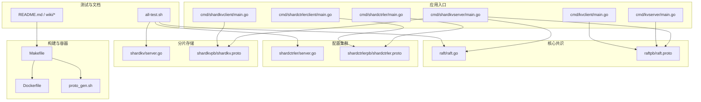
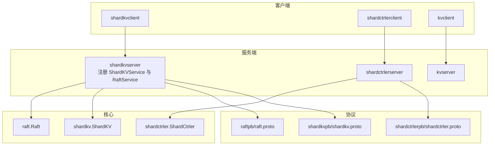
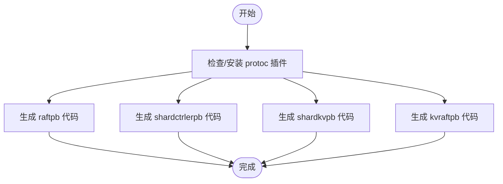
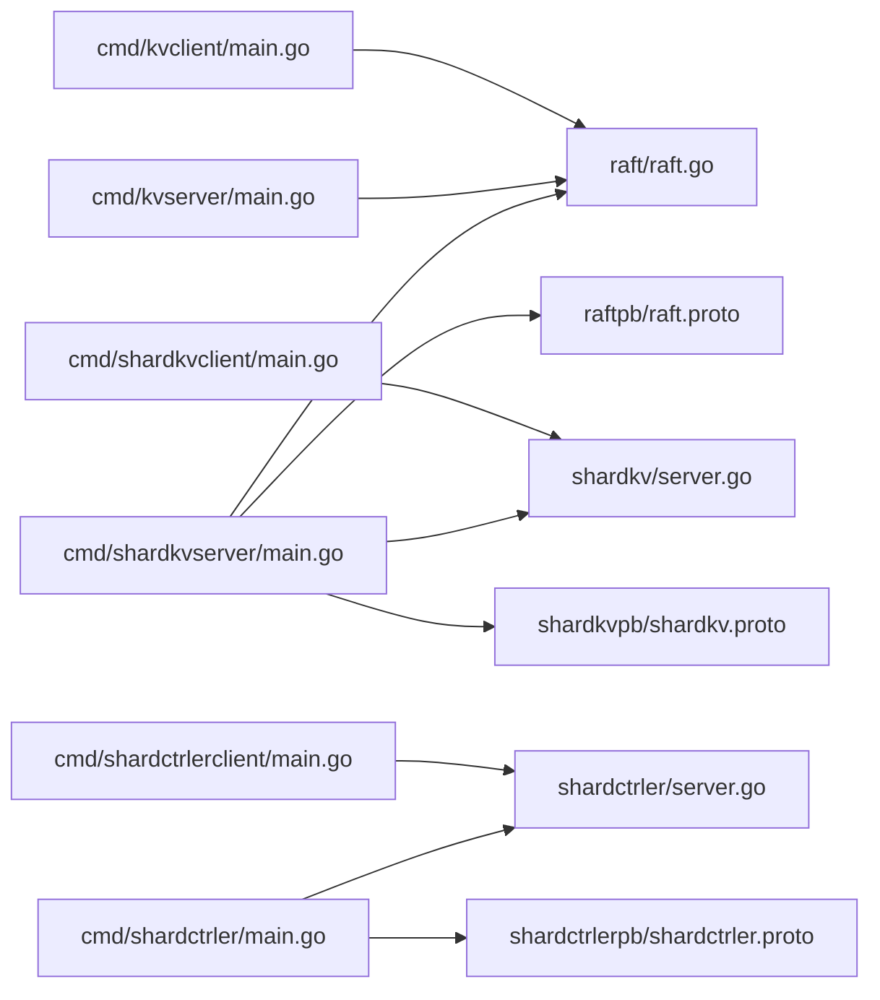

# 开发工具与配置

<cite>
**本文引用的文件**
- [README.md](file://README.md)
- [Dockerfile](file://Dockerfile)
- [Makefile](file://Makefile)
- [go.mod](file://go.mod)
- [proto_gen.sh](file://proto_gen.sh)
- [all-test.sh](file://all-test.sh)
- [CONTRIBUTING.md](file://CONTRIBUTING.md)
- [raft.proto](file://raftpb/raft.proto)
- [shardctrler.proto](file://shardctrlerpb/shardctrler.proto)
- [shardkv.proto](file://shardkvpb/shardkv.proto)
- [cmd/shardkvserver/main.go](file://cmd/shardkvserver/main.go)
- [raft/raft.go](file://raft/raft.go)
- [shardkv/server.go](file://shardkv/server.go)
- [shardctrler/server.go](file://shardctrler/server.go)
- [Architecture.md](file://wiki/Architecture.md)
- [Storage-and-RPC.md](file://wiki/Storage-and-RPC.md)
</cite>

## 目录
1. [简介](#简介)
2. [项目结构](#项目结构)
3. [核心组件](#核心组件)
4. [架构总览](#架构总览)
5. [详细组件分析](#详细组件分析)
6. [依赖分析](#依赖分析)
7. [性能考虑](#性能考虑)
8. [故障排查指南](#故障排查指南)
9. [结论](#结论)
10. [附录](#附录)

## 简介
本文件面向开发者，系统梳理 eRaft 的开发工具与配置体系，覆盖构建系统、依赖管理、编译流程、容器化与镜像构建、Protocol Buffers 代码生成、开发环境与 IDE 配置、调试工具、代码规范与静态分析、持续集成与自动化测试、发布流程、依赖版本管理与安全更新、兼容性维护，以及效率提升技巧与常见问题排查。

## 项目结构
仓库采用按功能域分层的模块化组织方式：命令行入口位于 cmd/，核心共识算法在 raft/，分片配置与存储在 shardctrler/ 与 shardkv/，协议定义在各 pb 目录，构建与容器化通过 Makefile 与 Dockerfile 统一管理，测试脚本与文档位于根目录与 wiki/。

图表来源
- [Makefile](file://Makefile#L29-L37)
- [Dockerfile](file://Dockerfile#L1-L9)
- [proto_gen.sh](file://proto_gen.sh#L1-L10)
- [cmd/shardkvserver/main.go](file://cmd/shardkvserver/main.go#L18-L58)
- [raft/raft.go](file://raft/raft.go#L1-L200)
- [shardkv/server.go](file://shardkv/server.go#L1-L200)
- [shardctrler/server.go](file://shardctrler/server.go#L1-L200)
- [raft.proto](file://raftpb/raft.proto#L1-L58)
- [shardctrler.proto](file://shardctrlerpb/shardctrler.proto#L1-L55)
- [shardkv.proto](file://shardkvpb/shardkv.proto#L1-L66)
- [all-test.sh](file://all-test.sh#L1-L8)
- [README.md](file://README.md#L43-L139)

章节来源
- [Makefile](file://Makefile#L29-L37)
- [Dockerfile](file://Dockerfile#L1-L9)
- [proto_gen.sh](file://proto_gen.sh#L1-L10)
- [README.md](file://README.md#L43-L139)

## 核心组件
- 构建系统与编译流程
  - 使用 Makefile 统一构建所有二进制，输出到 output/ 目录；支持 image、build-dev、all-test、run-test、clean、网络与演示运行等目标。
  - Dockerfile 基于 Ubuntu 22.04，安装 make 与 wget，并下载指定版本的 Go 工具链以保证可复现性。
- 依赖管理
  - go.mod 指定模块名、Go 版本与工具链版本，并声明核心依赖（zap、grpc、protobuf）及间接依赖。
- 协议与代码生成
  - proto_gen.sh 负责安装 protoc 插件并调用 protoc 编译 raftpb、shardctrlerpb、shardkvpb、kvraftpb 的 .proto 文件，生成 Go 代码。
- 测试与覆盖率
  - all-test.sh 与 Makefile 中的 all-test 目标分别提供快速测试入口；Makefile 提供覆盖率生成与查看目标。
- 运行与演示
  - README.md 提供本地快速启动与演示步骤；Makefile 提供 docker 网络创建、演示节点运行与停止等目标。

章节来源
- [Makefile](file://Makefile#L29-L84)
- [Dockerfile](file://Dockerfile#L1-L9)
- [go.mod](file://go.mod#L1-L22)
- [proto_gen.sh](file://proto_gen.sh#L1-L10)
- [all-test.sh](file://all-test.sh#L1-L8)
- [README.md](file://README.md#L43-L139)

## 架构总览
下图展示从应用入口到共识层、配置层与存储层的整体交互关系，以及 gRPC/Protobuf 在其中的作用。

图表来源
- [cmd/shardkvserver/main.go](file://cmd/shardkvserver/main.go#L18-L58)
- [raft/raft.go](file://raft/raft.go#L1-L200)
- [shardkv/server.go](file://shardkv/server.go#L1-L200)
- [shardctrler/server.go](file://shardctrler/server.go#L1-L200)
- [raft.proto](file://raftpb/raft.proto#L1-L58)
- [shardctrler.proto](file://shardctrlerpb/shardctrler.proto#L1-L55)
- [shardkv.proto](file://shardkvpb/shardkv.proto#L1-L66)

## 详细组件分析

### 构建系统与编译流程
- Makefile 目标说明
  - build：编译所有服务端与客户端二进制至 output/。
  - image：基于 Dockerfile 构建镜像，默认镜像名为 eraft/eraftbook:$(IMAGE_VERSION)。
  - build-dev：在容器中执行脚本进行开发构建。
  - all-test/run-test：在容器中运行测试或测试网络。
  - clean：清理 output/。
  - 网络与演示：创建自定义子网并运行一组演示容器。
  - 覆盖率：生成与查看测试覆盖率报告。
- Dockerfile 镜像构建
  - 基础镜像：ubuntu:22.04。
  - 安装依赖：make、wget。
  - 下载并解压指定版本的 Go 工具链，确保构建一致性。
- 代码生成与 Protobuf
  - proto_gen.sh 安装 protoc-gen-go 与 protoc-gen-go-grpc 插件，随后对四个 .proto 文件执行编译，生成对应的 Go 代码与 gRPC 服务桩。

图表来源
- [proto_gen.sh](file://proto_gen.sh#L1-L10)

章节来源
- [Makefile](file://Makefile#L29-L84)
- [Dockerfile](file://Dockerfile#L1-L9)
- [proto_gen.sh](file://proto_gen.sh#L1-L10)

### 依赖管理与版本控制
- Go 模块与工具链
  - go.mod 指定模块名、Go 版本与工具链版本，确保跨平台一致的编译环境。
  - 依赖项包括 zap 日志、grpc 与 protobuf，以及若干间接依赖。
- 版本策略建议
  - 优先使用 go mod tidy 保持依赖整洁。
  - 对关键依赖采用语义化版本约束，避免破坏性更新引入。
  - 定期运行 go list -m all 与 go mod graph 检视依赖树。

章节来源
- [go.mod](file://go.mod#L1-L22)

### 容器化与镜像构建
- 多阶段构建建议
  - 当前 Dockerfile 仅安装构建所需工具与 Go 工具链，未体现多阶段优化。
  - 推荐思路：基础阶段安装构建工具与 Go；产物阶段仅复制二进制与最小运行时，减少镜像体积与攻击面。
- 镜像命名与缓存
  - Makefile 中 IMAGE_VERSION 可用于版本化镜像标签，便于 CI/CD 回溯。
- 网络与演示
  - Makefile 提供自定义子网创建与演示容器编排，便于本地验证端到端流程。

章节来源
- [Dockerfile](file://Dockerfile#L1-L9)
- [Makefile](file://Makefile#L58-L74)

### Protocol Buffers 代码生成与接口定义
- 接口定义
  - raftpb/raft.proto：定义 Raft 三类 RPC 请求/响应与 RaftService。
  - shardctrlerpb/shardctrler.proto：定义配置相关消息与 ShardCtrlerService。
  - shardkvpb/shardkv.proto：定义分片 KV 操作消息与 ShardKVService。
- 生成流程
  - proto_gen.sh 安装插件并调用 protoc，输出 Go 代码与 gRPC 服务桩。
- 版本管理
  - .proto 文件变更需同步生成 Go 代码；建议在变更后执行 gofmt 与 go vet，确保一致性与可读性。

章节来源
- [raft.proto](file://raftpb/raft.proto#L1-L58)
- [shardctrler.proto](file://shardctrlerpb/shardctrler.proto#L1-L55)
- [shardkv.proto](file://shardkvpb/shardkv.proto#L1-L66)
- [proto_gen.sh](file://proto_gen.sh#L1-L10)

### 开发环境设置与 IDE 配置
- Go 工具链与编辑器
  - 使用 Dockerfile 中的 Go 版本作为本地开发参考，确保与 CI 一致。
  - 在 IDE 中启用 gofmt、go vet、golint 或 gopls，实现保存即格式化与静态检查。
- 调试工具
  - 使用 Delve（dlv）进行断点调试；结合 Makefile 的容器化测试目标在隔离环境中定位问题。
- 代码风格
  - CONTRIBUTING.md 提供了代码风格与格式化建议，遵循 Google C++ 风格规范（项目内亦有对应链接与命令示例）。

章节来源
- [Dockerfile](file://Dockerfile#L7-L9)
- [CONTRIBUTING.md](file://CONTRIBUTING.md#L24-L41)

### 持续集成、自动化测试与发布
- 自动化测试
  - all-test.sh 与 Makefile 的 all-test 目标提供统一测试入口；可扩展为 CI 步骤。
  - 覆盖率生成与查看：Makefile 提供 gen-test-coverage 与 view-test-coverage 目标。
- 发布流程建议
  - 基于 Makefile 的 image 目标产出镜像；结合 CI 触发构建与推送。
  - 使用语义化版本管理镜像标签，配合 IMAGE_VERSION 实现可追溯发布。

章节来源
- [all-test.sh](file://all-test.sh#L1-L8)
- [Makefile](file://Makefile#L45-L84)

### 依赖版本管理、安全更新与兼容性维护
- 版本策略
  - 使用 go.mod 锁定依赖版本；对关键依赖定期评估升级风险。
- 安全更新
  - 关注 go.uber.org/zap、google.golang.org/grpc、google.golang.org/protobuf 的安全通告，及时升级。
- 兼容性
  - .proto 升级遵循向后兼容原则；必要时引入新字段并保持默认值，避免破坏现有序列化。

章节来源
- [go.mod](file://go.mod#L7-L21)

### 效率提升技巧
- 并行构建与测试
  - 利用 Makefile 的多目标并行能力；在 CI 中并行执行不同模块的测试。
- 代码生成自动化
  - 将 proto_gen.sh 集成到 pre-commit 钩子，确保每次提交前生成最新代码。
- 容器化开发
  - 使用 build-dev 目标在容器中统一开发环境，减少“在我机器上能跑”的差异。

章节来源
- [Makefile](file://Makefile#L41-L44)
- [proto_gen.sh](file://proto_gen.sh#L1-L10)

## 依赖分析
下图展示应用入口与核心模块之间的依赖关系，以及 gRPC/Protobuf 在其中的桥接作用。

图表来源
- [cmd/shardkvserver/main.go](file://cmd/shardkvserver/main.go#L18-L58)
- [raft/raft.go](file://raft/raft.go#L1-L200)
- [shardkv/server.go](file://shardkv/server.go#L1-L200)
- [shardctrler/server.go](file://shardctrler/server.go#L1-L200)
- [raft.proto](file://raftpb/raft.proto#L1-L58)
- [shardctrler.proto](file://shardctrlerpb/shardctrler.proto#L1-L55)
- [shardkv.proto](file://shardkvpb/shardkv.proto#L1-L66)

章节来源
- [cmd/shardkvserver/main.go](file://cmd/shardkvserver/main.go#L18-L58)
- [raft/raft.go](file://raft/raft.go#L1-L200)
- [shardkv/server.go](file://shardkv/server.go#L1-L200)
- [shardctrler/server.go](file://shardctrler/server.go#L1-L200)

## 性能考虑
- 存储与 RPC 层
  - 使用 LevelDB 作为持久化存储，具备高吞吐与低延迟特性；gRPC 提供 HTTP/2 多路复用，适合高并发场景。
- 并发与锁粒度
  - Raft 与 ShardKV 在关键路径上尽量减少持有互斥锁的时间，提高吞吐。
- 快照与日志修剪
  - Raft 支持 CondInstallSnapshot 与 Snapshot，降低日志膨胀带来的性能与存储压力。
- 网络与容器
  - 本地演示使用自定义子网，减少网络开销；生产部署建议使用更高效的网络模型与资源隔离。

章节来源
- [Storage-and-RPC.md](file://wiki/Storage-and-RPC.md#L1-L19)
- [raft/raft.go](file://raft/raft.go#L108-L164)
- [shardkv/server.go](file://shardkv/server.go#L129-L157)

## 故障排查指南
- 构建失败
  - 确认 Dockerfile 中 Go 版本与 go.mod 的工具链版本一致；在容器中执行构建以排除宿主差异。
- 代码生成异常
  - 检查 proto_gen.sh 是否成功安装插件；确认 .proto 文件语法正确且路径无误。
- 测试失败
  - 使用 Makefile 的 run-test 或 all-test.sh 定位问题；结合覆盖率报告分析热点区域。
- 运行时错误
  - 查看日志输出与状态查询接口（如 GetStatus），核对节点角色、任期与提交索引等关键指标。
- 端到端验证
  - 参考 README.md 的快速启动步骤，逐步验证配置集群与分片 KV 集群的连通性与数据一致性。

章节来源
- [Dockerfile](file://Dockerfile#L7-L9)
- [proto_gen.sh](file://proto_gen.sh#L1-L10)
- [all-test.sh](file://all-test.sh#L1-L8)
- [README.md](file://README.md#L51-L139)

## 结论
本文件从工具链、构建与容器化、协议生成、测试与发布、依赖管理与安全更新等多个维度，系统化梳理了 eRaft 的开发工具与配置。建议在团队内统一 Makefile 与 Dockerfile 的使用，固化 proto_gen.sh 的生成流程，完善 CI/CD 中的测试与覆盖率策略，并建立依赖版本与安全更新的定期审计机制，以保障系统的稳定性与可维护性。

## 附录
- 快速开始与演示
  - 参考 README.md 的构建与快速启动章节，按步骤启动配置集群与分片 KV 集群，并使用客户端进行读写与基准测试。
- 文档与架构
  - wiki/Architecture.md 与 wiki/Storage-and-RPC.md 提供高层架构与存储/RPC 设计说明，有助于理解各组件职责与交互。

章节来源
- [README.md](file://README.md#L43-L139)
- [Architecture.md](file://wiki/Architecture.md#L1-L29)
- [Storage-and-RPC.md](file://wiki/Storage-and-RPC.md#L1-L19)