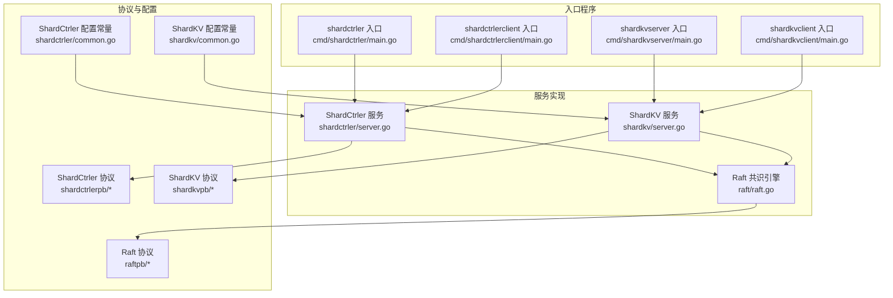
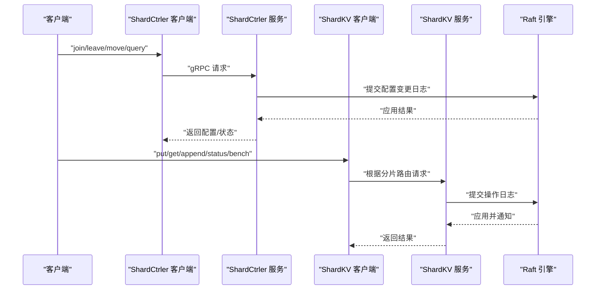
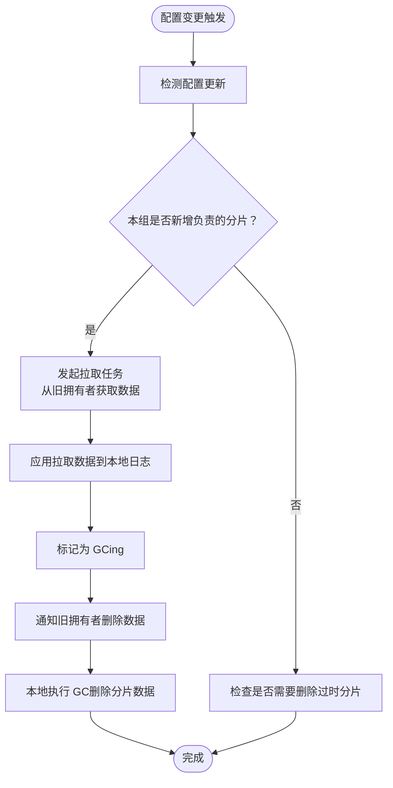
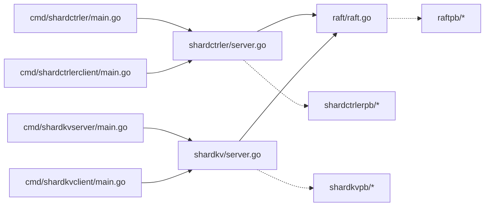

# 快速开始

## 目录
1. [简介](#简介)
2. [项目结构](#项目结构)
3. [核心组件](#核心组件)
4. [架构总览](#架构总览)
5. [详细组件分析](#详细组件分析)
6. [依赖分析](#依赖分析)
7. [性能考虑](#性能考虑)
8. [故障排除指南](#故障排除指南)
9. [结论](#结论)
10. [附录](#附录)

## 简介
本指南面向首次接触 eRaft 的用户，帮助你在最短时间内完成环境准备、编译构建，并成功启动一个可运行的分布式分片键值存储集群。你将学习如何：
- 安装与构建系统
- 启动配置控制器集群（ShardCtrler）
- 启动两个 ShardKV 分片组（Group 100 与 101）
- 注册分片组并进行数据读写与基准测试
- 查看集群状态与监控
- 理解组件职责与交互流程

## 项目结构
eRaft 采用模块化设计，核心目录与文件如下：
- cmd/*：各二进制入口程序，负责解析参数、初始化 gRPC 服务端并启动对应服务
- shardkv、shardctrler、raft：核心业务与共识层实现
- shardkvpb、shardctrlerpb、raftpb：gRPC 协议定义与生成代码
- labrpc、labgob：用于测试的 RPC 适配与序列化工具
- wiki：官方文档，涵盖架构、一致性、分片机制等

图表来源
- [cmd/shardctrler/main.go](file://cmd/shardctrler/main.go#L1-L57)
- [cmd/shardkvserver/main.go](file://cmd/shardkvserver/main.go#L1-L59)
- [cmd/shardctrlerclient/main.go](file://cmd/shardctrlerclient/main.go#L1-L103)
- [cmd/shardkvclient/main.go](file://cmd/shardkvclient/main.go#L1-L106)
- [shardctrler/server.go](file://shardctrler/server.go#L1-L344)
- [shardkv/server.go](file://shardkv/server.go#L1-L800)
- [raft/raft.go](file://raft/raft.go#L1-L200)
- [shardctrler/common.go](file://shardctrler/common.go#L1-L141)
- [shardkv/common.go](file://shardkv/common.go#L1-L229)

章节来源
- [README.md](file://README.md#L1-L139)
- [Makefile](file://Makefile#L29-L36)
- [go.mod](file://go.mod#L1-L22)

## 核心组件
- 配置控制器（ShardCtrler）：维护分片到副本组的映射，支持 join/leave/move/query 操作，基于 Raft 保证一致性和高可用。
- 分片键值服务（ShardKV）：在每个副本组内提供键值读写能力，按分片路由请求；周期性检查配置变更并执行数据迁移与垃圾回收。
- Raft 共识引擎：提供日志复制、领导者选举、快照与提交进度保障。
- gRPC 服务：为客户端与节点间通信提供高效通道。

章节来源
- [shardctrler/server.go](file://shardctrler/server.go#L1-L344)
- [shardkv/server.go](file://shardkv/server.go#L1-L800)
- [raft/raft.go](file://raft/raft.go#L1-L200)

## 架构总览
下图展示了从客户端到服务端的典型调用链路，以及配置控制器与分片组之间的协调关系。

图表来源
- [cmd/shardctrlerclient/main.go](file://cmd/shardctrlerclient/main.go#L1-L103)
- [cmd/shardkvclient/main.go](file://cmd/shardkvclient/main.go#L1-L106)
- [shardctrler/server.go](file://shardctrler/server.go#L179-L215)
- [shardkv/server.go](file://shardkv/server.go#L110-L157)
- [raft/raft.go](file://raft/raft.go#L108-L164)

## 详细组件分析

### 环境要求与安装
- 操作系统：Linux/macOS/Windows（推荐 Linux）
- 编译器与工具链：Go 1.24+（go.mod 指定 go 1.24.0）
- 构建工具：GNU Make
- 可选：Docker（用于容器化构建或演示）

建议步骤
- 安装 Go（版本满足 go.mod 要求）
- 克隆仓库后进入根目录
- 使用 make 命令构建所有二进制，产物位于 output/ 目录

章节来源
- [go.mod](file://go.mod#L1-L22)
- [Makefile](file://Makefile#L29-L36)
- [Dockerfile](file://Dockerfile#L1-L9)

### 构建过程
- 执行 make build 将生成以下可执行文件：
  - shardctrlerserver、shardctrlerclient
  - shardkvserver、shardkvclient
- 也可使用 make image 在 Docker 中构建镜像（如需容器化开发环境）

章节来源
- [Makefile](file://Makefile#L29-L36)

### 第一步：启动配置控制器集群（ShardCtrler）
- 启动 3 个 ShardCtrler 节点，监听本地不同端口
- 参数说明
  - -id：节点编号（0/1/2）
  - -cluster：集群成员地址列表（逗号分隔）
  - -db：该节点的 LevelDB 数据目录前缀
- 建议在 3 个终端中分别执行三条命令，每个终端启动一个节点

章节来源
- [cmd/shardctrler/main.go](file://cmd/shardctrler/main.go#L18-L55)
- [README.md](file://README.md#L53-L66)

### 第二步：启动 ShardKV 分片组
- 启动两个分片组（GID 100 与 101），每组 3 个节点
- 参数说明
  - -id：节点编号（0/1/2）
  - -gid：组 ID（例如 100 或 101）
  - -cluster：本组内部成员地址列表
  - -ctrlers：配置控制器集群地址列表
  - -db：该节点的 LevelDB 数据目录前缀
- 建议在 6 个终端中分别启动两组内的三个节点

章节来源
- [cmd/shardkvserver/main.go](file://cmd/shardkvserver/main.go#L18-L57)
- [README.md](file://README.md#L68-L86)

### 第三步：注册分片组
- 使用 shardctrlerclient 的 join 命令向配置控制器注册两个分片组
- 语法
  - join <gid>=<server1>,<server2>...
- 示例
  - 注册 GID 100：join 100=localhost:6001,localhost:6002,localhost:6003
  - 注册 GID 101：join 101=localhost:7001,localhost:7002,localhost:7003

章节来源
- [cmd/shardctrlerclient/main.go](file://cmd/shardctrlerclient/main.go#L26-L42)
- [README.md](file://README.md#L88-L98)

### 第四步：数据操作与监控
- 写入数据：shardkvclient put <key> <value>
- 读取数据：shardkvclient get <key>
- 追加数据：shardkvclient append <key> <value>
- 基准测试：shardkvclient bench <num_requests>
- 查看状态：shardkvclient status、shardctrlerclient status

章节来源
- [cmd/shardkvclient/main.go](file://cmd/shardkvclient/main.go#L28-L94)
- [README.md](file://README.md#L100-L128)

### 组件职责与交互
- ShardCtrler
  - 负责维护配置历史（含分片到组的映射）
  - 提供 join/leave/move/query 接口
  - 通过 Raft 保证配置变更的一致性
- ShardKV
  - 根据当前配置决定是否能服务某一分片
  - 若需要，从其他组拉取数据（Pulling → GCing）
  - 定期清理已迁移走的数据（GCing → Serving）
- Raft
  - 提交日志、推进提交索引、处理快照
  - 为上层提供线性一致的执行语义

图表来源
- [shardkv/server.go](file://shardkv/server.go#L549-L696)
- [shardkv/server.go](file://shardkv/server.go#L360-L405)

章节来源
- [shardctrler/server.go](file://shardctrler/server.go#L84-L151)
- [shardkv/server.go](file://shardkv/server.go#L549-L696)

## 依赖分析
- 外部依赖
  - gRPC：用于节点间与客户端通信
  - zap：日志库
  - goleveldb：持久化存储
- 模块依赖
  - cmd/* 依赖 shardkv、shardctrler、raft 层
  - shardkv 与 shardctrler 均依赖 raft 以获得一致性
  - 协议层（shardkvpb、shardctrlerpb、raftpb）由各自服务注册到 gRPC

图表来源
- [cmd/shardctrler/main.go](file://cmd/shardctrler/main.go#L1-L57)
- [cmd/shardkvserver/main.go](file://cmd/shardkvserver/main.go#L1-L59)
- [cmd/shardctrlerclient/main.go](file://cmd/shardctrlerclient/main.go#L1-L103)
- [cmd/shardkvclient/main.go](file://cmd/shardkvclient/main.go#L1-L106)
- [shardctrler/server.go](file://shardctrler/server.go#L1-L344)
- [shardkv/server.go](file://shardkv/server.go#L1-L800)
- [raft/raft.go](file://raft/raft.go#L1-L200)

章节来源
- [go.mod](file://go.mod#L7-L21)

## 性能考虑
- 快照与日志压缩：当 Raft 状态大小超过阈值时触发快照，减少日志长度，提升稳定性
- 并发模型：分片组内使用独立的 applier、监控 goroutine，避免阻塞
- 定时器策略：配置轮询、迁移轮询、GC 轮询与空日志探测定时器，平衡吞吐与一致性
- 存储层：LevelDB 作为底层存储，注意磁盘 I/O 与快照写入对性能的影响

章节来源
- [shardkv/server.go](file://shardkv/server.go#L463-L485)
- [shardkv/server.go](file://shardkv/server.go#L787-L796)
- [shardkv/common.go](file://shardkv/common.go#L21-L27)

## 故障排除指南
- 无法启动节点
  - 检查端口占用与网络连通性
  - 确认 -cluster 与 -ctrlers 地址正确且可达
- 客户端无响应或超时
  - 使用 status 命令查看节点角色与提交进度
  - 确保配置控制器已至少有一个可用节点
- 数据迁移异常
  - 确认分片组已注册且配置已生效
  - 观察日志中的 Pulling/GCing 状态变化
- 常见错误码
  - ErrWrongGroup：当前节点不负责该分片，客户端应重试并刷新配置
  - ErrWrongLeader：当前节点非领导者，客户端应重定向至领导者
  - ErrTimeout：请求在超时时间内未得到响应
  - ErrOutDated：配置或迁移版本落后

章节来源
- [shardkv/common.go](file://shardkv/common.go#L38-L68)
- [shardctrler/common.go](file://shardctrler/common.go#L88-L106)
- [shardkv/server.go](file://shardkv/server.go#L110-L127)
- [shardkv/server.go](file://shardkv/server.go#L549-L570)

## 结论
通过以上步骤，你已经成功启动了 eRaft 的配置控制器集群与两个 ShardKV 分片组，并完成了基本的数据操作与监控。建议进一步阅读官方 Wiki 以深入理解一致性算法、分片机制与性能优化策略。

## 附录

### 命令清单与参数速查
- 启动配置控制器（3 节点）
  - shardctrlerserver -id 0/1/2 -cluster "<addr1>,<addr2>,<addr3>" -db "<path>"
- 启动分片组（GID 100 与 101，每组 3 节点）
  - shardkvserver -id 0/1/2 -gid 100/101 -cluster "<组内地址列表>" -ctrlers "<配置控制器地址列表>" -db "<path>"
- 注册分片组
  - shardctrlerclient join <gid>=<server1>,<server2>,<server3>
- 客户端操作
  - shardkvclient put/get/append/status/bench

章节来源
- [README.md](file://README.md#L53-L128)
- [cmd/shardctrler/main.go](file://cmd/shardctrler/main.go#L18-L55)
- [cmd/shardkvserver/main.go](file://cmd/shardkvserver/main.go#L18-L57)
- [cmd/shardctrlerclient/main.go](file://cmd/shardctrlerclient/main.go#L26-L91)
- [cmd/shardkvclient/main.go](file://cmd/shardkvclient/main.go#L28-L94)