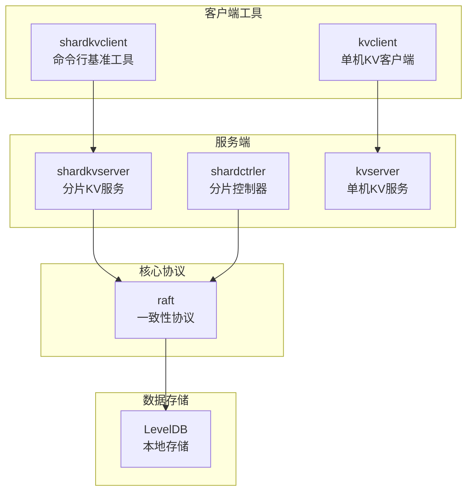
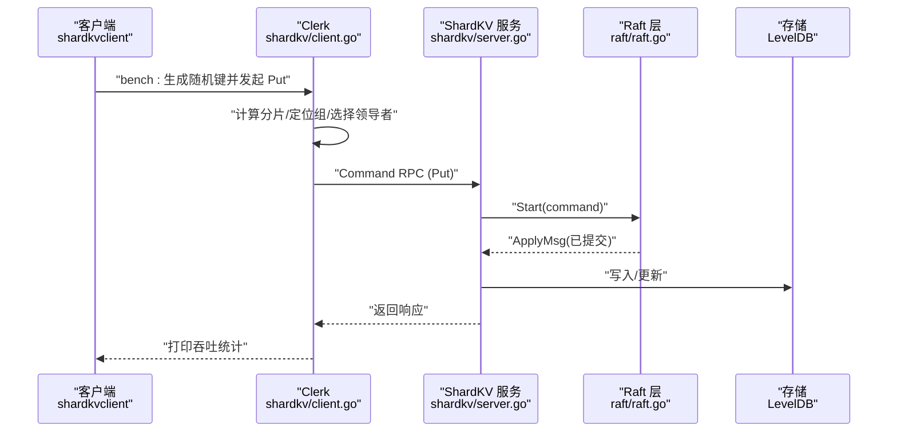
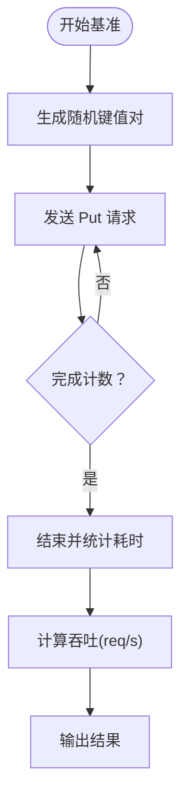
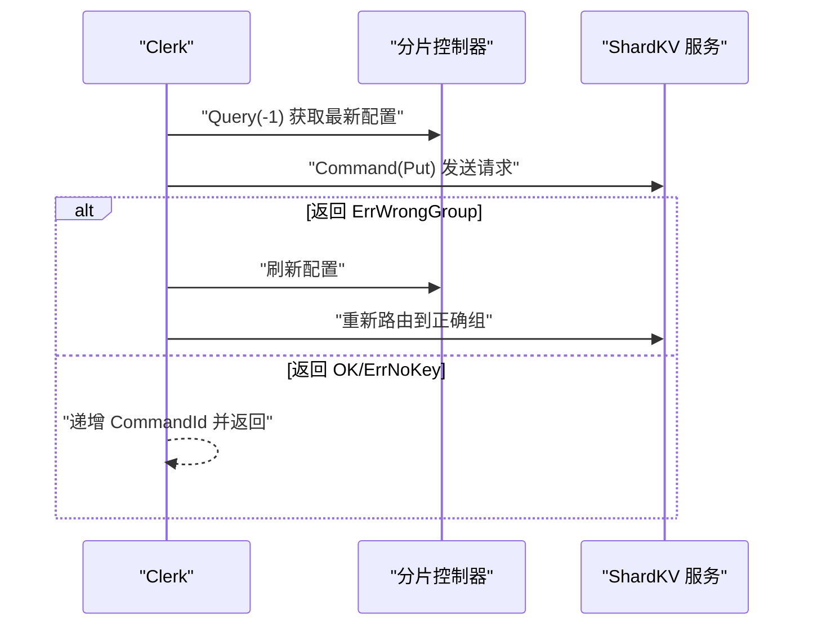
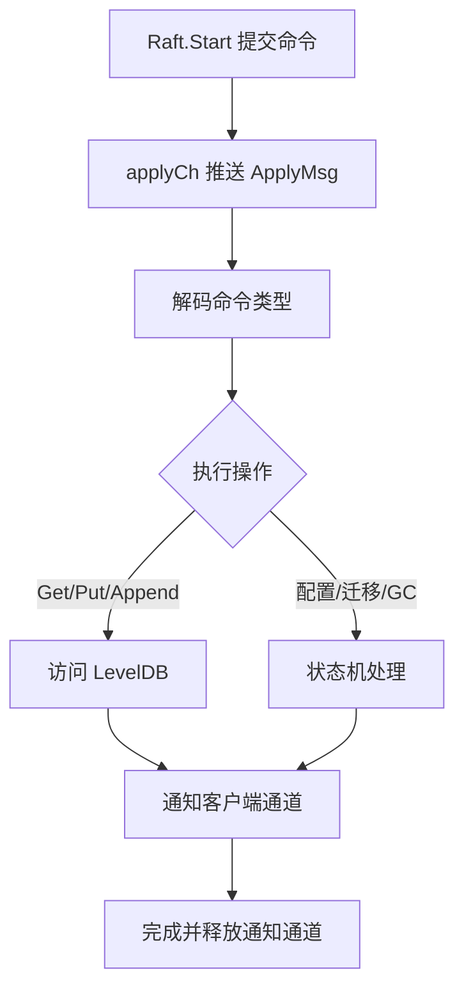
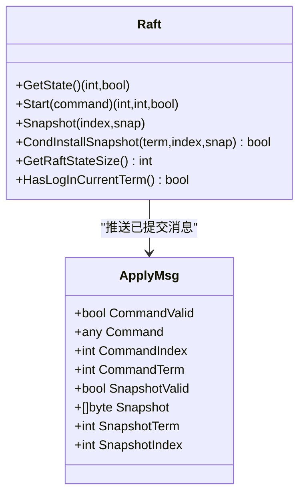
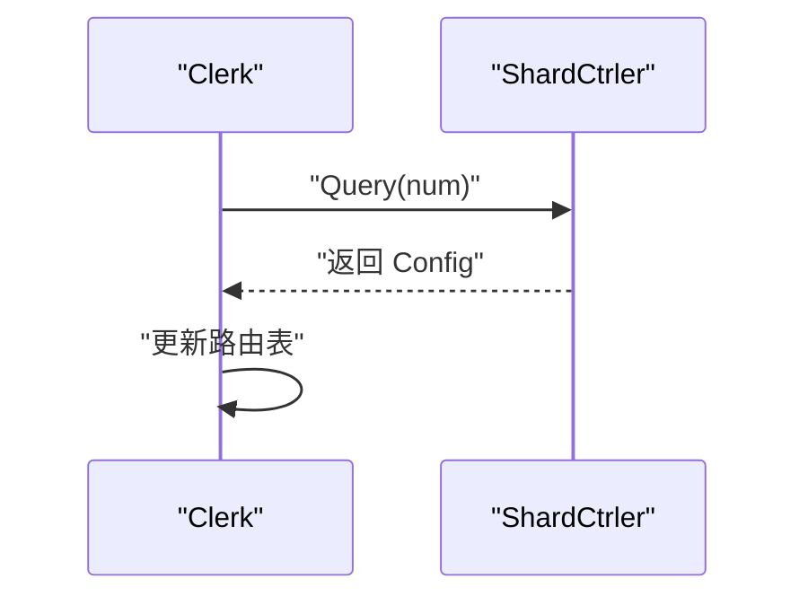
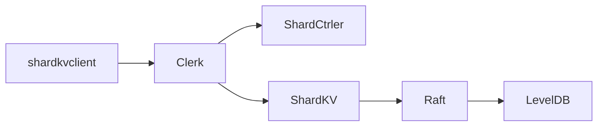

# 性能基准测试

<cite>
**本文引用的文件**
- [wiki/Benchmark.md](file://wiki/Benchmark.md)
- [cmd/shardkvclient/main.go](file://cmd/shardkvclient/main.go)
- [shardkv/client.go](file://shardkv/client.go)
- [shardkv/server.go](file://shardkv/server.go)
- [raft/raft.go](file://raft/raft.go)
- [raft/config.go](file://raft/config.go)
- [shardctrler/config.go](file://shardctrler/config.go)
- [shardkv/common.go](file://shardkv/common.go)
- [shardctrler/common.go](file://shardctrler/common.go)
- [models/kv.go](file://models/kv.go)
- [Makefile](file://Makefile)
</cite>

## 目录
1. [简介](#简介)
2. [项目结构](#项目结构)
3. [核心组件](#核心组件)
4. [架构总览](#架构总览)
5. [详细组件分析](#详细组件分析)
6. [依赖关系分析](#依赖关系分析)
7. [性能考量](#性能考量)
8. [故障排查指南](#故障排查指南)
9. [结论](#结论)
10. [附录](#附录)

## 简介
本文件面向 eRaft 分布式键值存储系统的性能基准测试，目标是帮助读者建立可重复、可扩展的性能评测体系，识别系统瓶颈，提出优化策略，并给出容量规划与运维建议。内容覆盖吞吐量测试、延迟测量、资源利用率分析、不同规模集群的扩展性评估、监控与趋势分析、与同类系统的对比解读以及系统管理员的监控与诊断指南。

## 项目结构
eRaft 采用分层模块化组织：客户端工具（命令行）、KV 存储层（kvraft）、分片控制器（shardctrler）、分片键值服务（shardkv）以及底层一致性协议（raft）。构建与测试通过 Makefile 和脚本完成。

图示来源
- [Makefile](file://Makefile#L29-L36)
- [cmd/shardkvclient/main.go](file://cmd/shardkvclient/main.go#L14-L95)
- [shardkv/server.go](file://shardkv/server.go#L759-L799)
- [raft/raft.go](file://raft/raft.go#L689-L725)

章节来源
- [Makefile](file://Makefile#L29-L36)

## 核心组件
- 基准测试工具：shardkvclient 的 bench 命令用于生成随机键进行顺序写入，统计总耗时与平均吞吐（req/s），并报告典型本地环境下的吞吐范围。
- 客户端：Clerk 负责路由请求到正确的分片组，自动重试与领导者切换；支持 gRPC 与 labrpc 两种后端。
- 服务端：ShardKV 将请求转换为 Raft 日志条目，提交后在状态机应用，同时维护分片迁移与 GC 的周期任务。
- 一致性协议：Raft 提供日志复制、提交推进、快照与领导者心跳等机制，是吞吐与延迟的关键约束。
- 配置与监控：分片控制器负责配置变更，ShardKV 内置定时器驱动配置查询、分片拉取与回收。

章节来源
- [wiki/Benchmark.md](file://wiki/Benchmark.md#L1-L26)
- [cmd/shardkvclient/main.go](file://cmd/shardkvclient/main.go#L67-L95)
- [shardkv/client.go](file://shardkv/client.go#L165-L310)
- [shardkv/server.go](file://shardkv/server.go#L101-L158)
- [raft/raft.go](file://raft/raft.go#L581-L608)

## 架构总览
下图展示从客户端到服务端再到存储的完整链路，标注了关键性能路径与潜在瓶颈点。

图示来源
- [cmd/shardkvclient/main.go](file://cmd/shardkvclient/main.go#L77-L91)
- [shardkv/client.go](file://shardkv/client.go#L206-L265)
- [shardkv/server.go](file://shardkv/server.go#L129-L157)
- [raft/raft.go](file://raft/raft.go#L581-L591)

## 详细组件分析

### 基准测试工具与吞吐量测试
- 工具行为：随机生成键（首字母分布均匀以跨分片）并顺序发送 Put 请求，记录开始时间与完成时间，计算 req/s。
- 指标输出：总请求数、总耗时、平均吞吐（req/s）。
- 观察性能：在本地 3 节点每组环境下，典型吞吐约 150–300 req/s，受磁盘 I/O 与共识延迟影响。

图示来源
- [cmd/shardkvclient/main.go](file://cmd/shardkvclient/main.go#L77-L91)
- [wiki/Benchmark.md](file://wiki/Benchmark.md#L13-L16)

章节来源
- [wiki/Benchmark.md](file://wiki/Benchmark.md#L8-L26)
- [cmd/shardkvclient/main.go](file://cmd/shardkvclient/main.go#L67-L95)

### 客户端路由与领导者选择
- 分片路由：根据 key 的首字符映射到分片，再由配置查询对应 GID 与服务器列表。
- 领导者选择：轮询当前组内的服务器，直到成功或遍历完所有节点；若返回 ErrWrongGroup，则刷新配置并重试。
- 超时控制：每个 RPC 使用固定超时，避免阻塞导致吞吐下降。

图示来源
- [shardkv/client.go](file://shardkv/client.go#L194-L265)
- [shardctrler/common.go](file://shardctrler/common.go#L31-L43)

章节来源
- [shardkv/client.go](file://shardkv/client.go#L165-L310)
- [shardctrler/common.go](file://shardctrler/common.go#L31-L43)

### 服务端执行与状态机应用
- 执行流程：将请求编码为命令，通过 Raft.Start 提交；在领导者侧等待通知通道返回；非领导者直接返回错误。
- 应用阶段：applier 从 applyCh 读取已提交日志，解码命令类型并执行相应操作（Get/Put/Append），必要时更新去重上下文。
- 快照与 GC：当 Raft 状态大小超过阈值触发快照；定期检测当前任期空条目以推进提交，避免活锁。

图示来源
- [shardkv/server.go](file://shardkv/server.go#L129-L157)
- [shardkv/server.go](file://shardkv/server.go#L248-L326)
- [shardkv/server.go](file://shardkv/server.go#L463-L485)
- [shardkv/server.go](file://shardkv/server.go#L718-L722)

章节来源
- [shardkv/server.go](file://shardkv/server.go#L101-L158)
- [shardkv/server.go](file://shardkv/server.go#L248-L326)
- [shardkv/server.go](file://shardkv/server.go#L463-L485)
- [shardkv/server.go](file://shardkv/server.go#L718-L722)

### Raft 协议与性能约束
- 日志复制与提交：领导者批量复制日志，跟随者通过 AppendEntries 追加；提交索引基于多数派推进。
- 心跳与选举：稳定心跳维持领导地位；选举超时触发重新选举，可能造成短暂延迟。
- 快照：当 Raft 状态过大时触发快照，减少日志长度，降低恢复与复制成本。
- 并发模型：独立的 applier 与 replicator goroutine 并行工作，提升吞吐。

图示来源
- [raft/raft.go](file://raft/raft.go#L64-L74)
- [raft/raft.go](file://raft/raft.go#L581-L591)
- [raft/raft.go](file://raft/raft.go#L150-L164)
- [raft/raft.go](file://raft/raft.go#L268-L274)

章节来源
- [raft/raft.go](file://raft/raft.go#L581-L608)
- [raft/raft.go](file://raft/raft.go#L637-L664)
- [raft/raft.go](file://raft/raft.go#L689-L725)

### 分片控制器与配置变更
- 配置查询：客户端定期查询最新配置，确保路由正确。
- 变更驱动：当状态机检测到所有分片处于 Serving 状态时，尝试提交新的配置变更命令。
- 网络分区：提供分区构造函数，便于测试网络异常下的行为。

图示来源
- [shardkv/server.go](file://shardkv/server.go#L549-L570)
- [shardctrler/config.go](file://shardctrler/config.go#L306-L317)

章节来源
- [shardkv/server.go](file://shardkv/server.go#L549-L570)
- [shardctrler/config.go](file://shardctrler/config.go#L306-L317)

## 依赖关系分析
- 组件耦合：ShardKV 依赖 Raft 提供的日志复制与提交；客户端依赖分片控制器获取路由信息；存储层使用 LevelDB。
- 外部依赖：gRPC 用于跨进程通信；labrpc 用于测试网络模拟；LevelDB 作为持久化存储。
- 潜在环依赖：未发现直接循环导入；各层职责清晰，接口边界明确。

图示来源
- [shardkv/client.go](file://shardkv/client.go#L165-L310)
- [shardkv/server.go](file://shardkv/server.go#L759-L799)
- [raft/raft.go](file://raft/raft.go#L689-L725)

章节来源
- [shardkv/client.go](file://shardkv/client.go#L165-L310)
- [shardkv/server.go](file://shardkv/server.go#L759-L799)
- [raft/raft.go](file://raft/raft.go#L689-L725)

## 性能考量
- 吞吐量测试
  - 方法：使用 shardkvclient bench 命令，随机键跨分片分布，顺序写入 Put。
  - 指标：总请求数、总耗时、平均吞吐（req/s）。
  - 场景：单机多核、SSD、网络可靠条件下，观察典型吞吐范围。
- 延迟测量
  - 客户端侧：记录每次 RPC 的往返时间，统计 P50/P95/P99。
  - 服务端侧：Raft 提交延迟（心跳间隔、复制批大小）、存储写入延迟（LevelDB 同步写）。
- 资源利用率
  - CPU：goroutine 数量、CPU 利用率、上下文切换。
  - 内存：Raft 日志大小、快照大小、通知通道数量。
  - 磁盘：IOPS、吞吐、队列深度；快照频率与大小。
  - 网络：RPC 次数、字节数、重传率。
- 扩展性评估
  - 节点规模：增加副本数（3/5 节点）对延迟与吞吐的影响。
  - 分片数量：NShards 增大带来的路由与复制开销。
  - 客户端并发：线程/连接数与背压策略。
- 容量规划
  - 快照阈值：根据 Raft 状态大小动态调整，平衡日志长度与恢复时间。
  - 存储容量：按峰值写入速率与保留周期估算磁盘需求。
  - 网络带宽：复制流量与分片迁移流量的峰值评估。

[本节为通用性能指导，不直接分析具体文件]

## 故障排查指南
- 基准测试无响应或超时
  - 检查客户端是否正确解析命令行参数与目标地址。
  - 确认分片控制器可达且返回有效配置。
  - 查看服务端日志中 ApplyMsg 推送与应用情况。
- 吞吐骤降
  - 观察 Raft 是否频繁选举（心跳超时）或日志过长。
  - 检查磁盘 I/O 是否饱和（慢查询、慢写）。
  - 确认快照是否按期触发，避免日志膨胀。
- 数据不一致或丢弃
  - 核对 ApplyMsg 的 CommandIndex 与 CommandTerm，确保仅处理当前任期内的日志。
  - 检查快照安装逻辑，避免旧快照覆盖新状态。
- 监控与诊断
  - 使用 status 命令查看节点角色、任期、提交/已应用索引、存储大小。
  - 结合测试框架中的统计（RPC 数、字节数、命令数）定位异常。

章节来源
- [cmd/shardkvclient/main.go](file://cmd/shardkvclient/main.go#L54-L66)
- [shardkv/server.go](file://shardkv/server.go#L105-L108)
- [raft/raft.go](file://raft/raft.go#L637-L664)

## 结论
eRaft 的性能主要受三方面限制：磁盘 I/O（LevelDB 同步写）、共识延迟（Raft 心跳与复制）、网络开销（跨分片请求与迁移）。通过合理的快照策略、批量复制与分片路由优化，可在本地与容器环境中实现稳定的吞吐与低延迟。建议在生产部署前完成容量规划与压力测试，持续监控关键指标并迭代优化。

[本节为总结性内容，不直接分析具体文件]

## 附录

### 测试与构建
- 构建产物：shardkvclient、shardkvserver、shardctrler、kvclient、kvserver。
- 测试运行：统一测试入口与覆盖率生成脚本。

章节来源
- [Makefile](file://Makefile#L29-L36)
- [Makefile](file://Makefile#L45-L50)
- [Makefile](file://Makefile#L76-L84)

### 模型验证与正确性
- 线性一致性模型：KvModel 将历史按键分区，定义初始状态与步进规则，可用于验证历史序列的线性一致性。

章节来源
- [models/kv.go](file://models/kv.go#L20-L72)