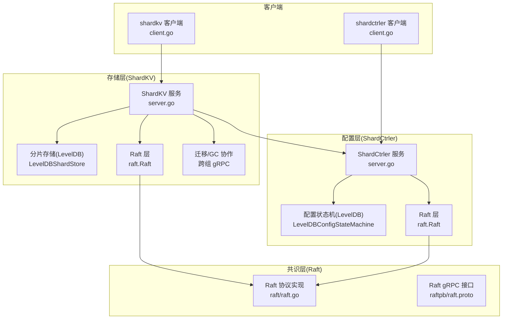
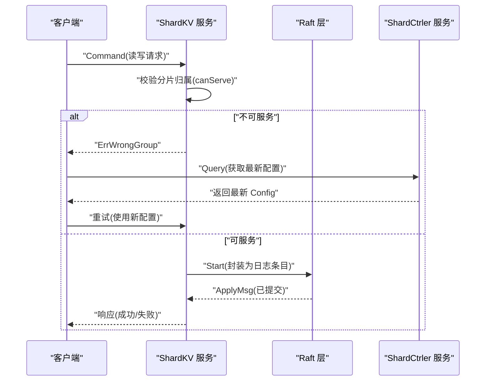
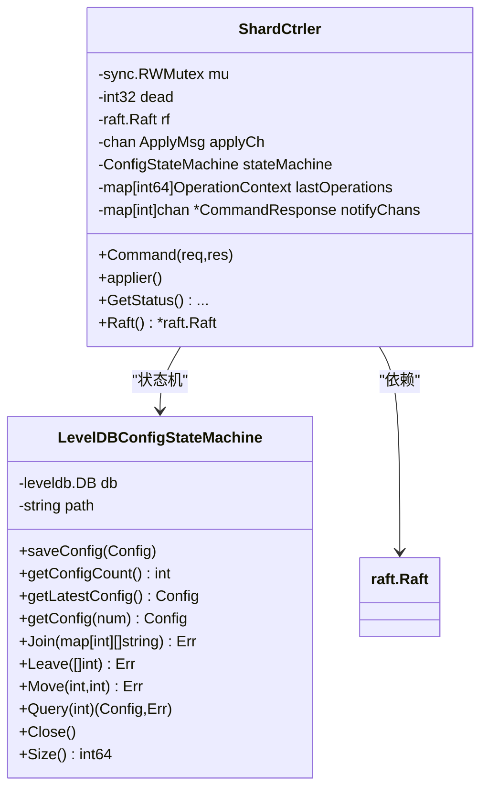
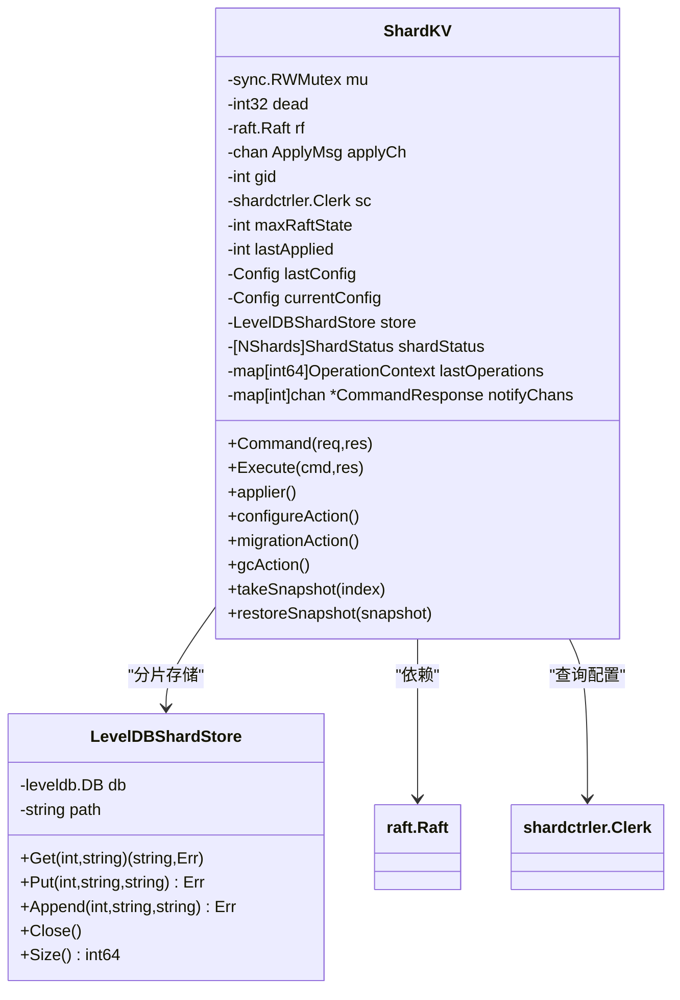
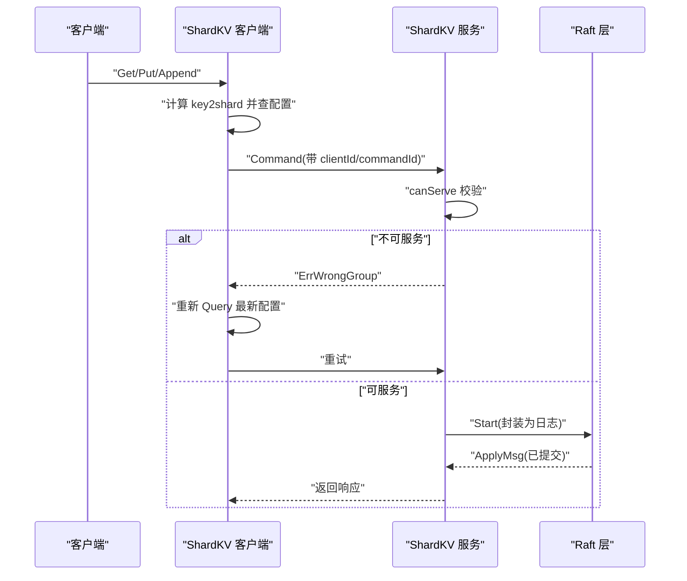
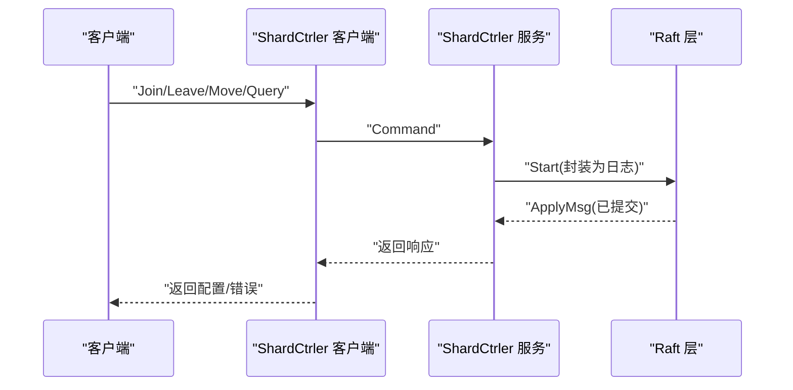
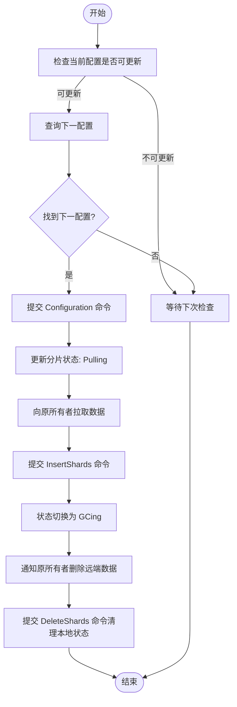
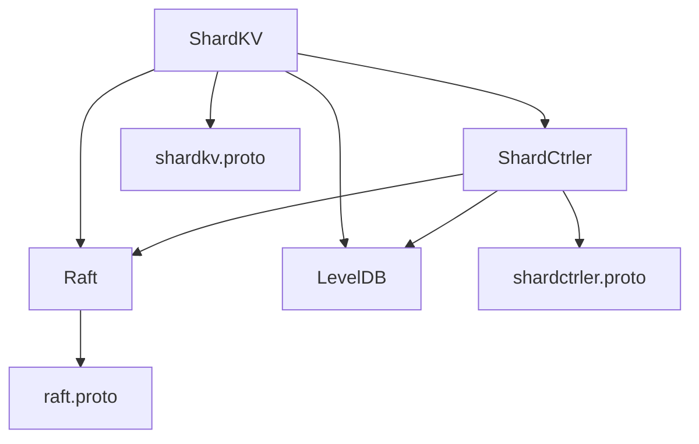

# 分层架构设计

<cite>
**本文档引用的文件**
- [README.md](file://README.md)
- [Architecture.md](file://wiki/Architecture.md)
- [raft.go](file://raft/raft.go)
- [raft.proto](file://raftpb/raft.proto)
- [server.go](file://shardctrler/server.go)
- [common.go](file://shardctrler/common.go)
- [config.go](file://shardctrler/config.go)
- [client.go](file://shardctrler/client.go)
- [shardctrler.proto](file://shardctrlerpb/shardctrler.proto)
- [server.go](file://shardkv/server.go)
- [common.go](file://shardkv/common.go)
- [config.go](file://shardkv/config.go)
- [client.go](file://shardkv/client.go)
- [shardkv.proto](file://shardkvpb/shardkv.proto)
- [main.go](file://cmd/shardkvserver/main.go)
</cite>

## 目录
1. [引言](#引言)
2. [项目结构](#项目结构)
3. [核心组件](#核心组件)
4. [架构总览](#架构总览)
5. [详细组件分析](#详细组件分析)
6. [依赖关系分析](#依赖关系分析)
7. [性能考量](#性能考量)
8. [故障排查指南](#故障排查指南)
9. [结论](#结论)
10. [附录](#附录)

## 引言
本文件面向 eRaft 分布式键值存储系统的三层架构设计，系统由共识层（Raft）、配置层（ShardCtrler）与存储层（ShardKV）组成。共识层提供强一致性的日志复制与领导选举；配置层负责维护分片到副本组的映射以及动态加入/离开/迁移等操作；存储层在每个副本组内以分片为单位存储键值数据，并通过 Raft 保证组内强一致。本文档从代码级视角解析各层内部组件、接口定义、交互流程、数据传递机制与错误处理策略，并给出扩展点与定制化建议。

## 项目结构
- 顶层命令行入口位于 cmd/ 下，分别启动配置集群与数据节点。
- 共识层 raft/ 实现 Raft 协议，提供日志复制、心跳与快照。
- 配置层 shardctrler/ 基于 Raft 维护配置状态机，支持 Join/Leave/Move/Query。
- 存储层 shardkv/ 基于 Raft 的分片键值存储，负责数据分片、迁移与垃圾回收。
- RPC/Proto 定义位于 shardkvpb/、shardctrlerpb/、raftpb/ 中，统一 gRPC 接口契约。
- 测试配置位于 shardkv/config.go 与 shardctrler/config.go，便于自动化测试。



图表来源
- [server.go](file://shardkv/server.go#L76-L99)
- [server.go](file://shardctrler/server.go#L17-L26)
- [raft.go](file://raft/raft.go#L37-L60)
- [shardkv.proto](file://shardkvpb/shardkv.proto#L60-L65)
- [shardctrler.proto](file://shardctrlerpb/shardctrler.proto#L51-L54)

章节来源
- [README.md](file://README.md#L1-L139)
- [Architecture.md](file://wiki/Architecture.md#L1-L29)

## 核心组件
- 共识层（Raft）
  - 关键接口：Start、GetState、GetRaftStateSize、Snapshot、CondInstallSnapshot、ApplyMsg 通道。
  - 内部组件：Raft 结构体、持久化器 Persister、复制器/应用器 goroutine、定时器与状态切换。
  - 数据结构：日志条目数组、提交索引/已应用索引、nextIndex/matchIndex、投票记录。
- 配置层（ShardCtrler）
  - 关键接口：Join、Leave、Move、Query；Command RPC；状态查询。
  - 内部组件：ShardCtrler 服务、配置状态机（LevelDB）、去重上下文、通知通道。
  - 数据结构：Config（含 Num、Shards、Groups），操作上下文 OperationContext。
- 存储层（ShardKV）
  - 关键接口：Get/Put/Append、分片拉取/删除、配置更新、状态查询。
  - 内部组件：ShardKV 服务、分片存储（LevelDB）、分片状态机、迁移/GC 协作、监控 goroutine。
  - 数据结构：分片状态 ShardStatus（Serving/Pulling/BePulling/GCing）、命令类型 Command/CommandType。

章节来源
- [raft.go](file://raft/raft.go#L37-L106)
- [server.go](file://shardctrler/server.go#L17-L26)
- [common.go](file://shardctrler/common.go#L31-L43)
- [server.go](file://shardkv/server.go#L76-L99)
- [common.go](file://shardkv/common.go#L70-L91)

## 架构总览
三层架构自下而上协同工作：
- 共识层（Raft）：为配置层与存储层提供强一致的日志复制与领导选举，确保跨节点状态收敛。
- 配置层（ShardCtrler）：维护全局分片映射与副本组列表，对外暴露 Join/Leave/Move/Query 操作，供存储层查询最新配置。
- 存储层（ShardKV）：按分片存储键值数据，依据配置层的映射决定是否可服务某 key；当配置变更时，自动触发迁移与垃圾回收，维持数据一致性。



图表来源
- [server.go](file://shardkv/server.go#L110-L127)
- [server.go](file://shardkv/server.go#L248-L326)
- [client.go](file://shardkv/client.go#L206-L265)
- [client.go](file://shardkv/client.go#L165-L188)

章节来源
- [Architecture.md](file://wiki/Architecture.md#L1-L29)
- [README.md](file://README.md#L100-L116)

## 详细组件分析

### 共识层（Raft）组件分析
- 类图（基于实际代码结构）

```mermaid
classDiagram
class Raft {
+int currentTerm
+int votedFor
+[]Entry logs
+int commitIndex
+int lastApplied
+[]int nextIndex
+[]int matchIndex
+chan ApplyMsg applyCh
+GetState() (int,bool)
+Start(command) (int,int,bool)
+Snapshot(index,snapshot)
+CondInstallSnapshot(term,index,snapshot) bool
+GetRaftStateSize() int
+HasLogInCurrentTerm() bool
}
class Persister {
+SaveRaftState(data)
+SaveStateAndSnapshot(state,snapshot)
+ReadRaftState() []byte
+ReadSnapshot() []byte
}
class ApplyMsg {
+bool CommandValid
+interface{} Command
+int CommandTerm
+int CommandIndex
+bool SnapshotValid
+[]byte Snapshot
+int SnapshotTerm
+int SnapshotIndex
}
Raft --> Persister : "持久化"
Raft --> ApplyMsg : "发送到上层"
```

图表来源
- [raft.go](file://raft/raft.go#L37-L60)
- [raft.go](file://raft/raft.go#L82-L116)
- [raft.go](file://raft/raft.go#L581-L591)
- [raft.go](file://raft/raft.go#L638-L664)

- 处理逻辑与流程
  - 日志复制与提交：Leader 通过 AppendEntries 批量复制；Follower 校验冲突后回退 nextIndex；Leader 基于 matchIndex 计算新的 commitIndex 并广播心跳。
  - 快照：Leader 在需要时通过 InstallSnapshot 将本地快照发给落后节点；Follower 收到后通过 CondInstallSnapshot 触发上层应用快照。
  - 应用器：applier goroutine 保证每个已提交日志仅应用一次，避免重复执行与乱序。

- 错误处理策略
  - 请求/响应参数校验：Term 过小直接拒绝；日志不匹配时返回冲突项；过期快照直接丢弃。
  - 超时与重试：客户端侧对 ErrWrongLeader/ErrTimeout 进行轮询与重试。

章节来源
- [raft.go](file://raft/raft.go#L166-L241)
- [raft.go](file://raft/raft.go#L243-L275)
- [raft.go](file://raft/raft.go#L423-L449)
- [raft.go](file://raft/raft.go#L638-L664)

### 配置层（ShardCtrler）组件分析
- 类图（基于实际代码结构）



图表来源
- [server.go](file://shardctrler/server.go#L17-L26)
- [server.go](file://shardctrler/server.go#L28-L44)
- [server.go](file://shardctrler/server.go#L324-L343)

- 处理逻辑与流程
  - 去重与通知：客户端请求携带 (clientId, commandId)，服务端根据 lastOperations 判断是否重复；通过 notifyChans 将结果异步通知调用方。
  - 状态机：Join/Leave/Move/Query 通过状态机落盘并生成新配置；Query 可返回历史配置。
  - 应用器：applier 从 applyCh 读取已提交日志，反序列化为 Command，调用状态机执行并回写响应。

- 错误处理策略
  - 重复请求：若 MaxAppliedCommandId 已覆盖则直接返回上次响应。
  - 超时：Command 调用设置超时，超时返回 ErrTimeout。
  - 非领导者：Start 返回非领导者时，客户端收到 ErrWrongLeader。

章节来源
- [server.go](file://shardctrler/server.go#L179-L215)
- [server.go](file://shardctrler/server.go#L272-L313)
- [common.go](file://shardctrler/common.go#L56-L86)

### 存储层（ShardKV）组件分析
- 类图（基于实际代码结构）



图表来源
- [server.go](file://shardkv/server.go#L76-L99)
- [server.go](file://shardkv/server.go#L25-L36)
- [server.go](file://shardkv/server.go#L759-L799)

- 处理逻辑与流程
  - 分片路由：根据 key2shard 映射到 shardID，再由当前配置判断 gid 是否拥有该分片所有权。
  - 配置同步：周期性检查配置变更，若发现下一版本可用则提交 Configuration 命令更新本地配置。
  - 迁移与 GC：
    - Pulling：检测到成为新所有者，向原所有者发起 GetShardsData 拉取数据，提交 InsertShards 命令并进入 GCing。
    - GCing：确认数据接收后，向原所有者发起 DeleteShardsData 删除远端数据，本地提交 DeleteShards 命令清理状态。
  - 快照：当 Raft 状态大小超过阈值时，遍历 LevelDB 生成全量快照并调用 Raft.Snapshot。

- 错误处理策略
  - 分片归属：canServe 不满足时返回 ErrWrongGroup，客户端需重新查询配置并重试。
  - 跨组 RPC：迁移/GC 使用 gRPC 或 labrpc 两种客户端适配，失败时轮询其他节点或重试。
  - 超时：Command 设置超时，超时返回 ErrTimeout。

章节来源
- [server.go](file://shardkv/server.go#L110-L127)
- [server.go](file://shardkv/server.go#L549-L570)
- [server.go](file://shardkv/server.go#L572-L643)
- [server.go](file://shardkv/server.go#L645-L696)
- [server.go](file://shardkv/server.go#L463-L485)
- [server.go](file://shardkv/server.go#L487-L516)

### API/服务组件交互序列
- 客户端到存储层（读写）交互



图表来源
- [client.go](file://shardkv/client.go#L206-L265)
- [server.go](file://shardkv/server.go#L110-L127)
- [server.go](file://shardkv/server.go#L248-L326)

- 配置层 RPC 交互



图表来源
- [client.go](file://shardctrler/client.go#L125-L139)
- [server.go](file://shardctrler/server.go#L179-L215)
- [server.go](file://shardctrler/server.go#L272-L313)

### 复杂逻辑流程（迁移与垃圾回收）
- 迁移流程（Pulling → GCing）



图表来源
- [server.go](file://shardkv/server.go#L549-L570)
- [server.go](file://shardkv/server.go#L572-L643)
- [server.go](file://shardkv/server.go#L645-L696)
- [server.go](file://shardkv/server.go#L360-L405)

## 依赖关系分析
- 层间依赖
  - ShardKV 依赖 ShardCtrler 提供配置；依赖 Raft 提供强一致日志复制。
  - ShardCtrler 依赖 Raft 提供强一致日志复制；依赖 LevelDB 存储配置。
  - Raft 依赖 Persister 进行状态与快照持久化；依赖网络层进行 RPC 通信。
- 组件耦合与内聚
  - 各层内部高内聚：Raft 专注共识；ShardCtrler 专注配置；ShardKV 专注分片存储与迁移。
  - 层间低耦合：通过 gRPC 接口与 ApplyMsg 通道解耦，便于替换实现与扩展。
- 外部依赖
  - gRPC：统一跨进程/跨机器通信接口。
  - LevelDB：作为持久化存储引擎。
  - labrpc：测试环境下的模拟网络。



图表来源
- [shardkv.proto](file://shardkvpb/shardkv.proto#L60-L65)
- [shardctrler.proto](file://shardctrlerpb/shardctrler.proto#L51-L54)
- [raft.proto](file://raftpb/raft.proto#L53-L57)

章节来源
- [server.go](file://shardkv/server.go#L759-L799)
- [server.go](file://shardctrler/server.go#L324-L343)
- [raft.go](file://raft/raft.go#L689-L725)

## 性能考量
- 日志与快照
  - ShardKV 在达到阈值时进行快照，减少日志长度与恢复时间；ShardCtrler 也采用快照降低 Raft 状态体积。
- 并发与批处理
  - Raft 复制器 goroutine 使用条件变量批量复制；应用器 goroutine 串行化应用，避免竞争。
- 网络与 RPC
  - 客户端侧对 ErrWrongLeader/ErrTimeout 进行轮询与重试，提升可用性；gRPC 与 labrpc 双栈适配，便于测试与生产部署。
- 存储层优化
  - 分片键值存储按 shardID 前缀组织，扫描效率较高；迁移阶段采用增量拉取与批量写入，减少阻塞。

[本节为通用指导，无需列出具体文件来源]

## 故障排查指南
- 常见错误与定位
  - ErrWrongGroup：表示当前节点不持有该 key 对应的分片，需重新查询配置并重试。
  - ErrWrongLeader：客户端轮询不同 leader；检查集群健康与网络连通。
  - ErrTimeout：请求超时，检查网络延迟、服务负载与超时配置。
  - ErrOutDated：配置或迁移命令过期，通常由并发迁移导致，重试即可。
- 快照与日志
  - 若出现快照过大或日志增长过快，调整 maxRaftState 阈值；检查是否有大量空日志导致状态膨胀。
- 迁移问题
  - 若迁移卡住，检查源/目标节点状态、网络连通与权限；确认分片状态机是否正确推进（Pulling/GCing）。
- 配置问题
  - 配置查询异常或不一致，检查 ShardCtrler 集群健康与 Raft 成员；必要时手动触发配置更新。

章节来源
- [common.go](file://shardkv/common.go#L38-L68)
- [server.go](file://shardkv/server.go#L110-L127)
- [server.go](file://shardkv/server.go#L549-L570)

## 结论
eRaft 的三层架构清晰分离了共识、配置与存储职责，通过 Raft 提供强一致基础，ShardCtrler 维护动态分片映射，ShardKV 实现分片键值存储与自动迁移。整体设计具备良好的扩展性与可维护性：可在不改变上层接口的前提下替换存储引擎、优化复制策略或引入新的配置算法。建议在生产环境中结合监控指标（日志大小、快照频率、迁移耗时、配置更新延迟）持续优化参数与部署策略。

[本节为总结性内容，无需列出具体文件来源]

## 附录
- 配置选项与参数
  - ShardKV
    - maxRaftState：触发快照的 Raft 状态大小阈值；-1 表示禁用快照。
    - 各类监控间隔：配置检查、迁移检查、GC 检查、空日志探测。
  - ShardCtrler
    - 执行超时：Command 请求的客户端侧超时。
  - Raft
    - 心跳与选举超时：由随机化选举超时与稳定心跳超时控制。
- 命令与响应类型
  - ShardKV：Operation（Put/Append/Get）、Configuration、InsertShards、DeleteShards、EmptyEntry。
  - ShardCtrler：Join/Leave/Move/Query，返回 Config 与 Err。
- 入口程序
  - ShardKV 服务端：解析 -id/-gid/-cluster/-ctrlers/-db 参数，启动 gRPC 服务与 Raft。
  - ShardCtrler 服务端：解析 -id/-cluster/-db 参数，启动 gRPC 服务与 Raft。

章节来源
- [common.go](file://shardkv/common.go#L21-L27)
- [common.go](file://shardkv/common.go#L102-L141)
- [common.go](file://shardctrler/common.go#L56-L86)
- [main.go](file://cmd/shardkvserver/main.go#L18-L58)