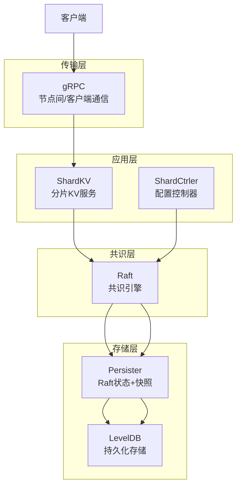
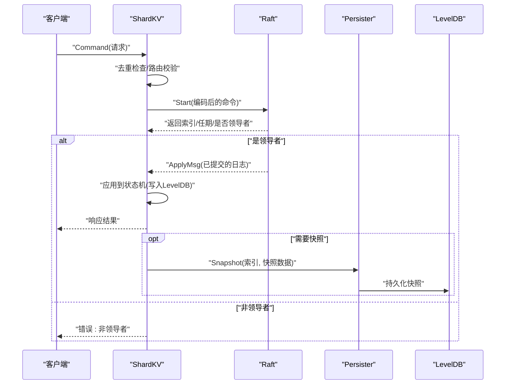
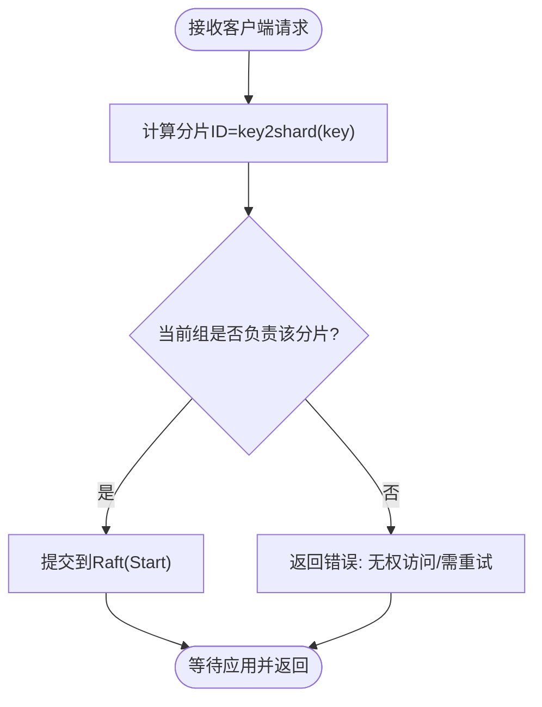
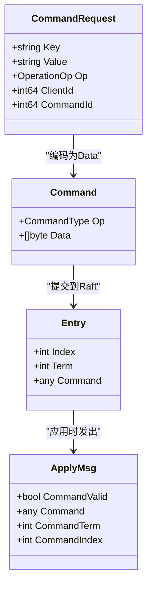
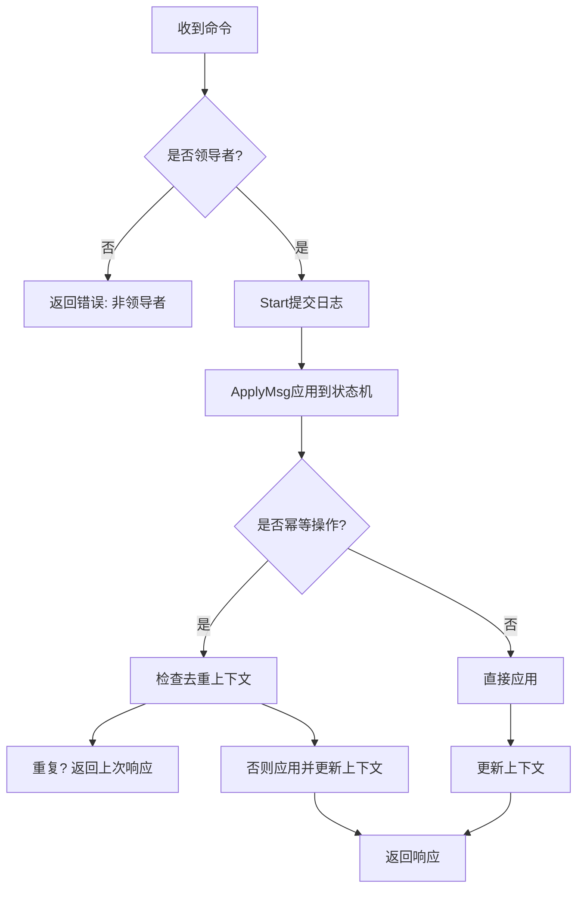
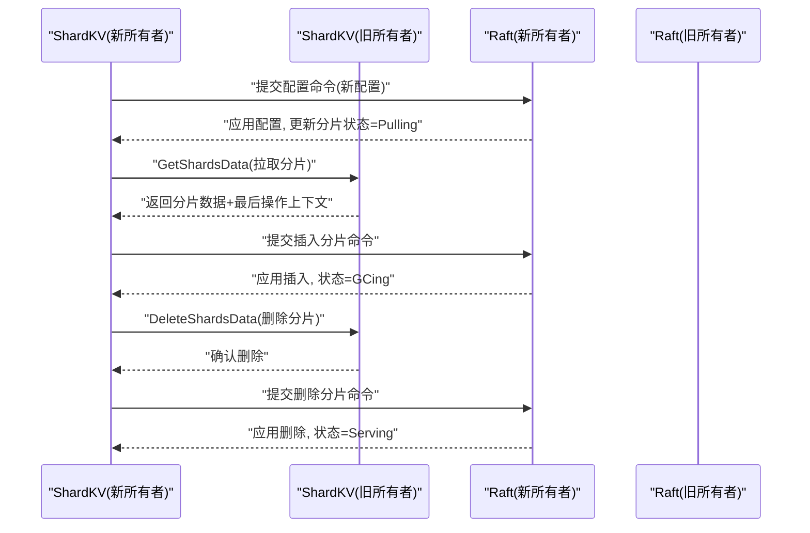
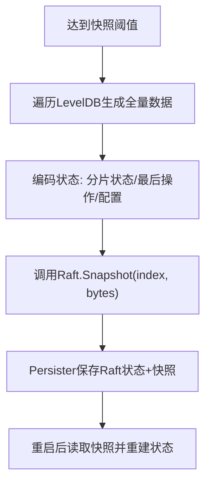
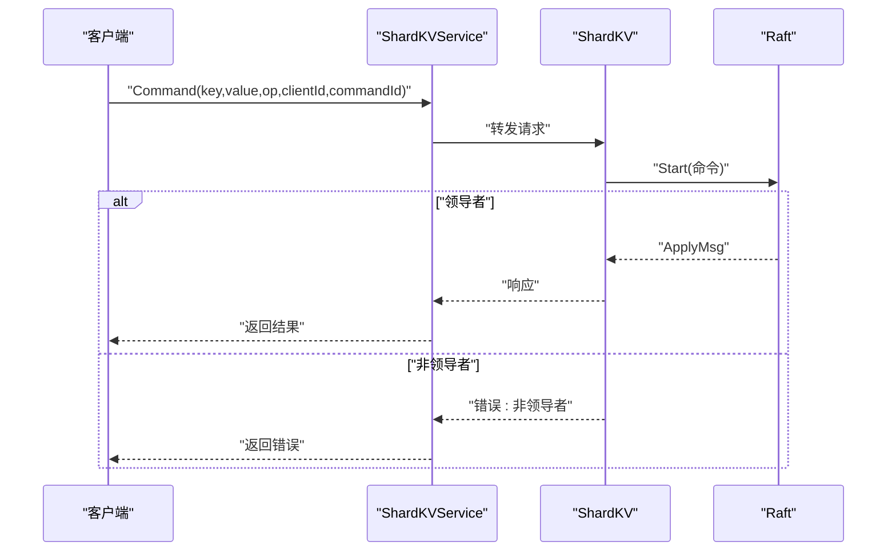
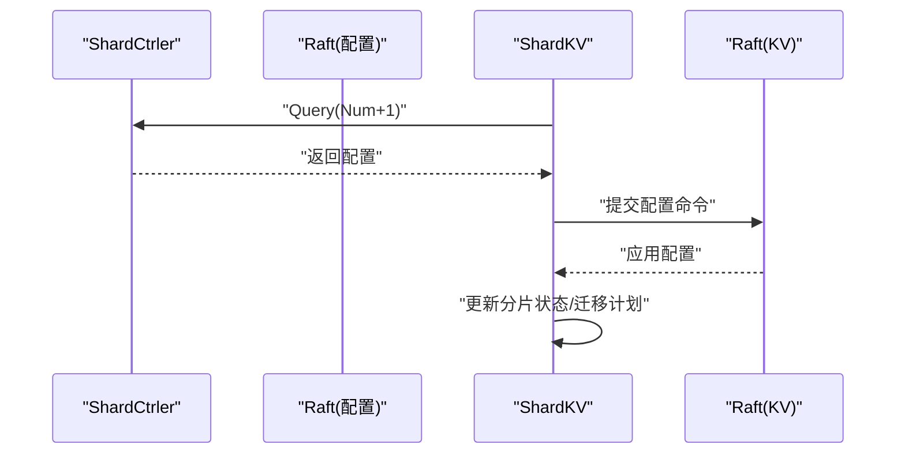
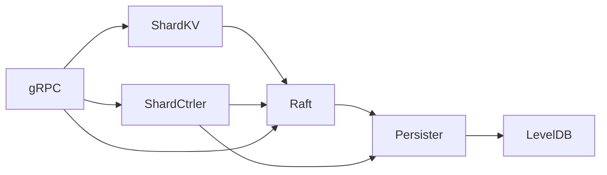

# 数据流设计

**本文引用的文件**
- [README.md](file://README.md)
- [shardkv/server.go](file://shardkv/server.go)
- [raft/raft.go](file://raft/raft.go)
- [shardctrler/server.go](file://shardctrler/server.go)
- [shardkv/common.go](file://shardkv/common.go)
- [shardctrler/common.go](file://shardctrler/common.go)
- [raft/persister.go](file://raft/persister.go)
- [shardkvpb/shardkv.proto](file://shardkvpb/shardkv.proto)
- [shardctrlerpb/shardctrler.proto](file://shardctrlerpb/shardctrler.proto)
- [cmd/shardkvserver/main.go](file://cmd/shardkvserver/main.go)
- [cmd/shardctrler/main.go](file://cmd/shardctrler/main.go)

## 目录
1. [引言](#引言)
2. [项目结构](#项目结构)
3. [核心组件](#核心组件)
4. [架构总览](#架构总览)
5. [详细组件分析](#详细组件分析)
6. [依赖关系分析](#依赖关系分析)
7. [性能考量](#性能考量)
8. [故障排查指南](#故障排查指南)
9. [结论](#结论)
10. [附录](#附录)

## 引言
本文件面向 eRaft 分布式分片键值存储系统，聚焦“数据流设计”。我们将从客户端请求进入系统开始，追踪数据在各层之间的流转路径，覆盖以下主题：
- 客户端请求到最终数据落盘的完整链路
- 数据路由策略、分片计算与负载均衡
- 关键数据结构的演进：从原始请求到 Raft 日志条目再到持久化存储
- 一致性保障与冲突解决策略
- 性能优化：缓存与批量处理
- 备份、快照与恢复的数据流

## 项目结构
eRaft 采用模块化分层组织：
- 应用层：ShardKV（分片 KV）、ShardCtrler（配置控制器）
- 共识层：Raft 实现
- 存储层：LevelDB 持久化
- 传输层：gRPC（节点间与客户端交互）
- 命令与协议：基于 protobuf 的命令模型与 RPC 接口

图示来源
- [shardkv/server.go](file://shardkv/server.go#L76-L99)
- [shardctrler/server.go](file://shardctrler/server.go#L17-L26)
- [raft/raft.go](file://raft/raft.go#L37-L60)
- [raft/persister.go](file://raft/persister.go#L17-L22)

章节来源
- [README.md](file://README.md#L6-L21)
- [shardkv/server.go](file://shardkv/server.go#L76-L99)
- [shardctrler/server.go](file://shardctrler/server.go#L17-L26)
- [raft/raft.go](file://raft/raft.go#L37-L60)
- [raft/persister.go](file://raft/persister.go#L17-L22)

## 核心组件
- ShardKV：每个分片组内的 KV 服务，负责：
  - 客户端请求路由与重复检测
  - 将操作封装为 Raft 命令提交
  - 在领导者上执行并通知等待的客户端
  - 迁移/回收任务的发起与执行
  - 快照与恢复
- ShardCtrler：配置控制器，维护分片到组的映射，提供查询与变更接口
- Raft：提供复制日志、提交与应用的一致性保障
- Persister：原子保存 Raft 状态与快照
- LevelDB：键值数据持久化

章节来源
- [shardkv/server.go](file://shardkv/server.go#L76-L99)
- [shardctrler/server.go](file://shardctrler/server.go#L17-L26)
- [raft/raft.go](file://raft/raft.go#L37-L60)
- [raft/persister.go](file://raft/persister.go#L17-L22)

## 架构总览
下图展示从客户端到持久化的整体数据流。

图示来源
- [shardkv/server.go](file://shardkv/server.go#L110-L157)
- [raft/raft.go](file://raft/raft.go#L581-L591)
- [raft/raft.go](file://raft/raft.go#L638-L664)
- [raft/persister.go](file://raft/persister.go#L90-L98)
- [shardkv/server.go](file://shardkv/server.go#L467-L485)

章节来源
- [shardkv/server.go](file://shardkv/server.go#L110-L157)
- [raft/raft.go](file://raft/raft.go#L581-L591)
- [raft/raft.go](file://raft/raft.go#L638-L664)
- [raft/persister.go](file://raft/persister.go#L90-L98)
- [shardkv/server.go](file://shardkv/server.go#L467-L485)

## 详细组件分析

### 数据路由与分片计算
- 分片计算：使用键到分片的映射函数，将 key 映射到 [0, NShards-1] 的分片编号
- 路由校验：在 ShardKV 中，先根据 key 计算 shardID，再通过当前配置判断本组是否负责该 shard；若不负责则返回错误，提示客户端重新拉取最新配置
- 负载均衡：通过配置控制器动态调整分片到组的映射，实现跨组迁移与负载均衡

图示来源
- [shardkv/server.go](file://shardkv/server.go#L110-L127)
- [shardkv/common.go](file://shardkv/common.go#L21-L27)

章节来源
- [shardkv/server.go](file://shardkv/server.go#L110-L127)
- [shardkv/common.go](file://shardkv/common.go#L21-L27)

### 关键数据结构演进
- 原始请求：CommandRequest（含操作类型、键、值、客户端标识等）
- 编码后命令：Command（包含操作类型与序列化后的请求体）
- Raft 日志条目：Entry（包含索引、任期、命令）
- 应用阶段：ApplyMsg（携带命令、索引、任期），交由状态机应用
- 持久化存储：LevelDB（键空间包含分片前缀与键）

图示来源
- [shardkv/common.go](file://shardkv/common.go#L189-L204)
- [shardkv/common.go](file://shardkv/common.go#L102-L109)
- [raft/raft.go](file://raft/raft.go#L546-L553)
- [raft/raft.go](file://raft/raft.go#L649-L656)

章节来源
- [shardkv/common.go](file://shardkv/common.go#L189-L204)
- [shardkv/common.go](file://shardkv/common.go#L102-L109)
- [raft/raft.go](file://raft/raft.go#L546-L553)
- [raft/raft.go](file://raft/raft.go#L649-L656)

### 一致性与冲突解决
- 一致性保障：Raft 提供线性一致读写，仅领导者可提交日志，提交后按序应用到状态机
- 冲突解决：
  - 客户端幂等：通过客户端标识与命令号进行去重，避免重复应用
  - 配置更新：严格按配置号递增顺序应用，拒绝过期配置
  - 迁移期间状态机：通过分片状态机（Serving/Pulling/BePulling/GCing）确保迁移前后一致性

图示来源
- [shardkv/server.go](file://shardkv/server.go#L110-L157)
- [shardkv/server.go](file://shardkv/server.go#L328-L345)
- [shardkv/server.go](file://shardkv/server.go#L348-L358)

章节来源
- [shardkv/server.go](file://shardkv/server.go#L110-L157)
- [shardkv/server.go](file://shardkv/server.go#L328-L345)
- [shardkv/server.go](file://shardkv/server.go#L348-L358)

### 迁移与回收的数据流
- 配置变更：ShardCtrler 维护配置，ShardKV 定期轮询最新配置并提交配置命令
- 拉取数据：当某组成为新所有者，状态变更为 Pulling，发起拉取任务，从旧所有者批量获取分片数据并应用
- 回收垃圾：确认迁移完成后，向旧所有者发起删除任务，本地状态切换为 GCing 并清理对应分片

图示来源
- [shardkv/server.go](file://shardkv/server.go#L549-L570)
- [shardkv/server.go](file://shardkv/server.go#L572-L643)
- [shardkv/server.go](file://shardkv/server.go#L645-L696)
- [shardkv/server.go](file://shardkv/server.go#L360-L405)

章节来源
- [shardkv/server.go](file://shardkv/server.go#L549-L570)
- [shardkv/server.go](file://shardkv/server.go#L572-L643)
- [shardkv/server.go](file://shardkv/server.go#L645-L696)
- [shardkv/server.go](file://shardkv/server.go#L360-L405)

### 快照与恢复
- 触发条件：当 Raft 状态大小超过阈值时触发快照
- 快照内容：包含全部键值、分片状态、最后操作上下文、当前/上一配置
- 恢复流程：重启后读取快照，重建内存状态与 LevelDB

图示来源
- [shardkv/server.go](file://shardkv/server.go#L463-L485)
- [raft/raft.go](file://raft/raft.go#L150-L164)
- [raft/persister.go](file://raft/persister.go#L90-L98)
- [shardkv/server.go](file://shardkv/server.go#L487-L516)

章节来源
- [shardkv/server.go](file://shardkv/server.go#L463-L485)
- [raft/raft.go](file://raft/raft.go#L150-L164)
- [raft/persister.go](file://raft/persister.go#L90-L98)
- [shardkv/server.go](file://shardkv/server.go#L487-L516)

### 客户端与服务端交互
- 客户端通过 gRPC 调用 ShardKVService.Command 发送请求
- 服务端在领导者上处理，非领导者直接返回错误
- 超时控制：客户端等待超时返回错误

图示来源
- [shardkvpb/shardkv.proto](file://shardkvpb/shardkv.proto#L60-L65)
- [shardkv/server.go](file://shardkv/server.go#L110-L157)

章节来源
- [shardkvpb/shardkv.proto](file://shardkvpb/shardkv.proto#L60-L65)
- [shardkv/server.go](file://shardkv/server.go#L110-L157)

### 配置管理与查询
- ShardCtrler 维护配置历史，支持 Join/Leave/Move/Query
- ShardKV 定期查询下一配置，提交配置命令以更新本地状态

图示来源
- [shardctrler/common.go](file://shardctrler/common.go#L108-L140)
- [shardkv/server.go](file://shardkv/server.go#L549-L570)
- [shardctrler/server.go](file://shardctrler/server.go#L153-L159)

章节来源
- [shardctrler/common.go](file://shardctrler/common.go#L108-L140)
- [shardkv/server.go](file://shardkv/server.go#L549-L570)
- [shardctrler/server.go](file://shardctrler/server.go#L153-L159)

## 依赖关系分析
- ShardKV 依赖 Raft 提供一致性与日志复制，依赖 Persister 保存 Raft 状态与快照，依赖 LevelDB 存储键值数据
- ShardCtrler 同样依赖 Raft 与 Persister，内部维护配置状态机
- gRPC 作为统一传输层，既承载客户端到服务端的请求，也承载节点间的 Raft RPC

图示来源
- [shardkv/server.go](file://shardkv/server.go#L76-L99)
- [shardctrler/server.go](file://shardctrler/server.go#L17-L26)
- [raft/raft.go](file://raft/raft.go#L37-L60)
- [raft/persister.go](file://raft/persister.go#L17-L22)

章节来源
- [shardkv/server.go](file://shardkv/server.go#L76-L99)
- [shardctrler/server.go](file://shardctrler/server.go#L17-L26)
- [raft/raft.go](file://raft/raft.go#L37-L60)
- [raft/persister.go](file://raft/persister.go#L17-L22)

## 性能考量
- 批量复制与心跳：Raft 使用心跳维持领导地位，复制器批量发送日志条目
- 快照与日志裁剪：当 Raft 状态过大时触发快照，减少日志长度，降低恢复时间
- 内存通知通道：为每个已提交索引分配通知通道，避免阻塞客户端请求
- 迁移并发：多分片并行拉取与回收，提升迁移吞吐
- 读路径优化：Get 操作直接从内存上下文与 LevelDB 读取，避免不必要的共识

章节来源
- [raft/raft.go](file://raft/raft.go#L353-L366)
- [raft/raft.go](file://raft/raft.go#L638-L664)
- [shardkv/server.go](file://shardkv/server.go#L463-L485)
- [shardkv/server.go](file://shardkv/server.go#L572-L643)
- [shardkv/server.go](file://shardkv/server.go#L549-L570)

## 故障排查指南
- 非领导者返回：客户端收到“非领导者”错误时，应重试或从配置控制器获取最新领导者
- 超时问题：客户端等待响应超时，可能由于网络分区或领导者繁忙，建议重试与指数退避
- 配置过期：应用配置时返回“过期”，说明已有更新配置被应用，需重新查询
- 迁移异常：若拉取/回收失败，检查源/目标节点可达性与权限，确认分片状态机正确推进

章节来源
- [shardkv/server.go](file://shardkv/server.go#L110-L157)
- [shardkv/server.go](file://shardkv/server.go#L348-L358)
- [shardkv/server.go](file://shardkv/server.go#L572-L643)
- [shardkv/server.go](file://shardkv/server.go#L645-L696)

## 结论
eRaft 通过清晰的分层与严格的共识协议，实现了从客户端请求到持久化存储的可靠数据流。分片路由与配置控制器协同，提供了动态负载均衡与平滑迁移能力；Raft 的快照与日志裁剪机制有效控制了系统开销；幂等与状态机状态机共同保障了数据一致性与冲突解决。整体设计兼顾了可用性、一致性与性能。

## 附录
- 启动与运行参考：README 中的快速启动与迁移流程
- 协议定义：shardkv.proto 与 shardctrler.proto 描述了 RPC 接口与消息格式

章节来源
- [README.md](file://README.md#L51-L139)
- [shardkvpb/shardkv.proto](file://shardkvpb/shardkv.proto#L1-L66)
- [shardctrlerpb/shardctrler.proto](file://shardctrlerpb/shardctrler.proto#L1-L55)