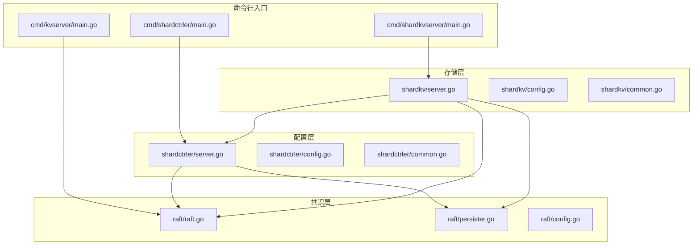
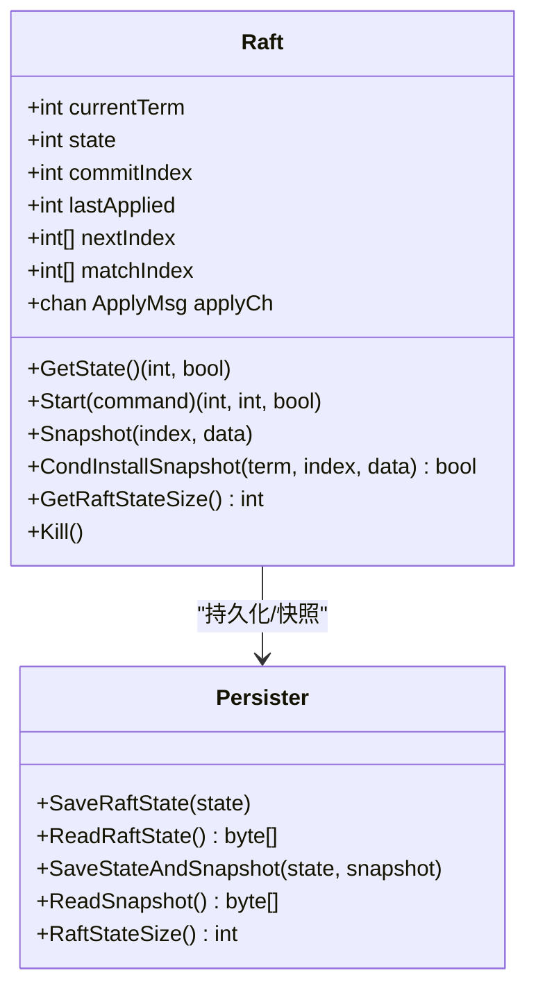
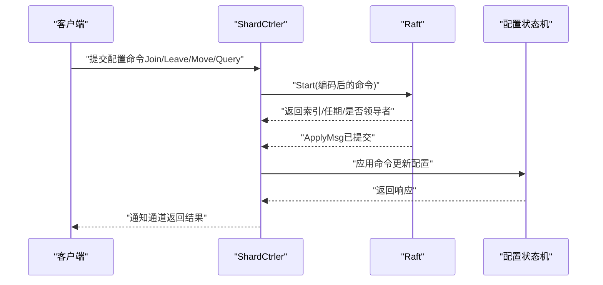
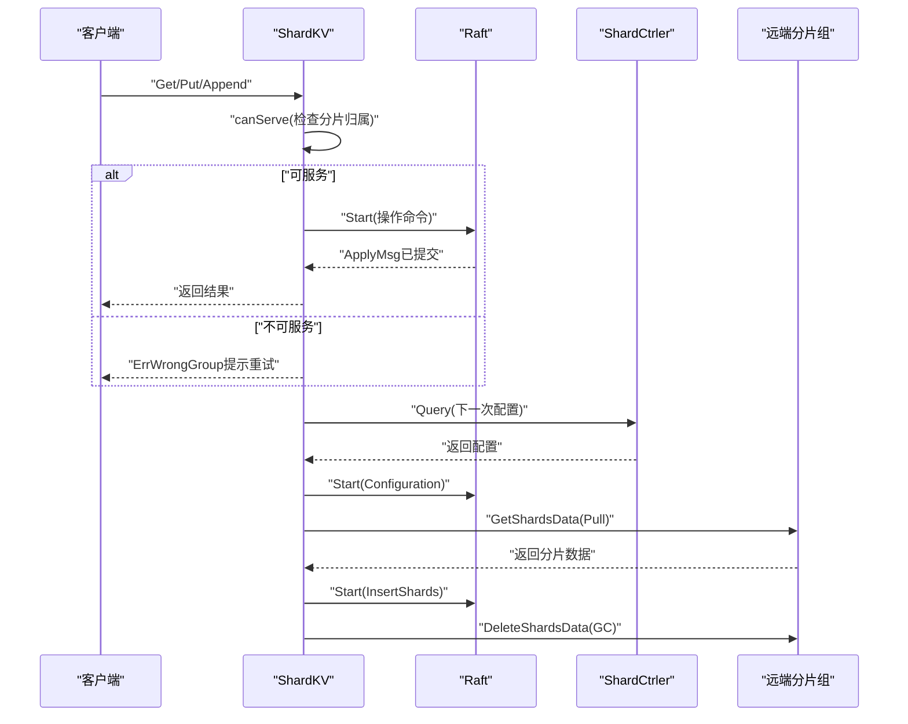
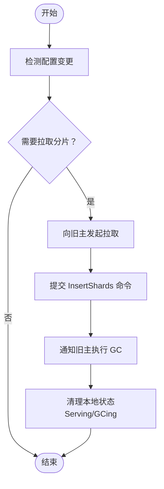
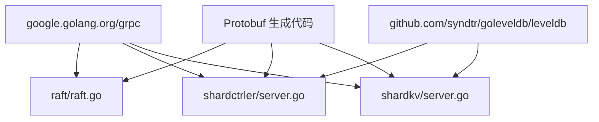

# 整体架构概览

**本文档引用的文件**
- [README.md](file://README.md)
- [Architecture.md](file://wiki/Architecture.md)
- [Sharding-Mechanism.md](file://wiki/Sharding-Mechanism.md)
- [Raft-Consensus.md](file://wiki/Raft-Consensus.md)
- [raft.go](file://raft/raft.go)
- [config.go](file://raft/config.go)
- [persister.go](file://raft/persister.go)
- [server.go](file://shardctrler/server.go)
- [common.go](file://shardctrler/common.go)
- [config.go](file://shardctrler/config.go)
- [server.go](file://shardkv/server.go)
- [common.go](file://shardkv/common.go)
- [config.go](file://shardkv/config.go)
- [main.go（ShardCtrler）](file://cmd/shardctrler/main.go)
- [main.go（ShardKV）](file://cmd/shardkvserver/main.go)
- [main.go（KVServer）](file://cmd/kvserver/main.go)
- [go.mod](file://go.mod)

## 目录
1. [引言](#引言)
2. [项目结构](#项目结构)
3. [核心组件](#核心组件)
4. [架构总览](#架构总览)
5. [详细组件分析](#详细组件分析)
6. [依赖关系分析](#依赖关系分析)
7. [性能考量](#性能考量)
8. [故障排查指南](#故障排查指南)
9. [结论](#结论)
10. [附录](#附录)

## 引言
本文件面向 eRaft 分布式分片键值存储系统，提供整体架构概览与深入分析。eRaft 采用三层架构设计：共识层（Raft）、配置层（ShardCtrler）、存储层（ShardKV）。系统通过 gRPC 实现节点间高效通信，使用 LevelDB 作为持久化存储引擎，并以动态分片与配置管理实现水平扩展。

## 项目结构
仓库采用按功能模块划分的目录组织方式，主要模块包括：
- 共识层：raft 及其 gRPC 适配、持久化组件
- 配置层：shardctrler，负责分片映射与配置变更
- 存储层：shardkv，负责数据读写与分片迁移
- 命令行入口：cmd 下的各服务启动器
- 文档：wiki 下的架构、一致性、分片机制等说明
- 工具与模型：models、porcupine 等用于正确性验证



图表来源
- [main.go（ShardCtrler）](file://cmd/shardctrler/main.go#L1-L57)
- [main.go（ShardKV）](file://cmd/shardkvserver/main.go#L1-L59)
- [main.go（KVServer）](file://cmd/kvserver/main.go#L1-L48)
- [raft.go](file://raft/raft.go#L1-L726)
- [persister.go](file://raft/persister.go#L1-L111)
- [server.go（ShardCtrler）](file://shardctrler/server.go#L1-L344)
- [server.go（ShardKV）](file://shardkv/server.go#L1-L800)

章节来源
- [README.md](file://README.md#L1-L139)
- [Architecture.md](file://wiki/Architecture.md#L1-L29)

## 核心组件
- 共识层（Raft）
  - 提供标准 Raft 算法实现，支持领导者选举、日志复制、安全性与持久化，集成快照以控制日志增长。
  - 关键接口：Start、GetState、Snapshot、InstallSnapshot。
  - 并发模型：独立的 applier 与 replicator 协程，提升吞吐与实时性。
- 配置层（ShardCtrler）
  - 维护分片到组的映射（Config），支持 Join、Leave、Move、Query 操作。
  - 使用 Raft 保证配置变更的一致性，并以 LevelDB 持久化配置状态机。
- 存储层（ShardKV）
  - 每个分片组内部运行 Raft，数据按逻辑分片分布。
  - 支持 Put/Append/Get 操作，自动检测配置变更并执行分片拉取与垃圾回收。
  - 通过 gRPC 与 ShardCtrler 交互，周期性轮询最新配置。

章节来源
- [Raft-Consensus.md](file://wiki/Raft-Consensus.md#L1-L21)
- [raft.go](file://raft/raft.go#L1-L726)
- [server.go（ShardCtrler）](file://shardctrler/server.go#L1-L344)
- [server.go（ShardKV）](file://shardkv/server.go#L1-L800)

## 架构总览
eRaft 的三层架构协同工作：
- 共识层（Raft）：为上层提供强一致的日志复制与状态机执行能力。
- 配置层（ShardCtrler）：维护全局分片映射，协调分片归属与迁移。
- 存储层（ShardKV）：按分片存储数据，处理客户端请求，执行配置同步与数据迁移。

```mermaid
graph TD
Client["客户端"] --> SC["配置集群ShardCtrler"]
Client --> SKV1["分片组 1ShardKV"]
Client --> SKV2["分片组 2ShardKV"]
SKV1 --> SC
SKV2 --> SC
SKV1 < --> SKV2["分片迁移Pull/GC"]
```

图表来源
- [Architecture.md](file://wiki/Architecture.md#L18-L29)
- [README.md](file://README.md#L100-L139)

## 详细组件分析

### 共识层（Raft）类图


图表来源
- [raft.go](file://raft/raft.go#L37-L106)
- [raft.go](file://raft/raft.go#L581-L608)
- [raft.go](file://raft/raft.go#L690-L725)
- [persister.go](file://raft/persister.go#L17-L111)

章节来源
- [raft.go](file://raft/raft.go#L1-L726)
- [persister.go](file://raft/persister.go#L1-L111)

### 配置层（ShardCtrler）组件流程
- 配置状态机：基于 LevelDB 的持久化状态机，保存配置历史与计数。
- 客户端请求：通过 Raft 提交 Join/Leave/Move/Query 命令，异步通知客户端。
- 配置变更：均衡策略自动调整分片分配，确保各组负载均衡。



图表来源
- [server.go（ShardCtrler）](file://shardctrler/server.go#L179-L215)
- [server.go（ShardCtrler）](file://shardctrler/server.go#L272-L313)
- [server.go（ShardCtrler）](file://shardctrler/server.go#L250-L264)

章节来源
- [server.go（ShardCtrler）](file://shardctrler/server.go#L1-L344)
- [common.go（ShardCtrler）](file://shardctrler/common.go#L1-L141)

### 存储层（ShardKV）组件流程
- 请求处理：检查是否可服务当前分片，若不可则返回错误提示客户端重试。
- 配置同步：周期性查询最新配置，提交 Configuration 命令更新本地状态。
- 数据迁移：当新配置生效时，触发 Pull（从旧主拉取）与 GC（通知旧主删除）流程。
- 快照与恢复：根据 Raft 状态大小触发快照，重启后恢复状态与数据。



图表来源
- [server.go（ShardKV）](file://shardkv/server.go#L110-L157)
- [server.go（ShardKV）](file://shardkv/server.go#L248-L326)
- [server.go（ShardKV）](file://shardkv/server.go#L549-L570)
- [server.go（ShardKV）](file://shardkv/server.go#L572-L643)
- [server.go（ShardKV）](file://shardkv/server.go#L645-L696)

章节来源
- [server.go（ShardKV）](file://shardkv/server.go#L1-L800)
- [common.go（ShardKV）](file://shardkv/common.go#L1-L229)

### 分片机制与状态流转
- 分片状态：
  - Serving：正常提供服务
  - Pulling：正在从旧主拉取数据
  - BePulling：等待其他组完成拉取
  - GCing：等待旧主删除数据
- 迁移步骤：检测 → 拉取 → 插入日志 → 通知 GC → 清理状态



图表来源
- [Sharding-Mechanism.md](file://wiki/Sharding-Mechanism.md#L8-L21)
- [server.go（ShardKV）](file://shardkv/server.go#L430-L445)
- [server.go（ShardKV）](file://shardkv/server.go#L360-L405)

章节来源
- [Sharding-Mechanism.md](file://wiki/Sharding-Mechanism.md#L1-L21)
- [server.go（ShardKV）](file://shardkv/server.go#L1-L800)

## 依赖关系分析
- 外部依赖
  - gRPC：节点间 RPC 通信
  - LevelDB：持久化存储与快照
  - Protobuf：序列化与跨语言兼容
- 内部模块耦合
  - ShardKV 依赖 ShardCtrler 获取配置；两者共享分片常量与命令类型定义
  - 三层均依赖 Raft 提供一致性保障
  - 各模块通过 gRPC 服务暴露接口，便于横向扩展



图表来源
- [go.mod](file://go.mod#L7-L21)
- [main.go（ShardCtrler）](file://cmd/shardctrler/main.go#L13-L16)
- [main.go（ShardKV）](file://cmd/shardkvserver/main.go#L13-L16)
- [main.go（KVServer）](file://cmd/kvserver/main.go#L9-L14)

章节来源
- [go.mod](file://go.mod#L1-L22)

## 性能考量
- 并发与吞吐
  - Raft 独立的 applier 与 replicator 协程，避免阻塞，提高日志复制与应用效率。
  - ShardKV 在不持有锁的情况下提交请求，减少锁竞争。
- 日志与快照
  - 通过快照压缩日志，降低磁盘占用与恢复时间。
  - ShardKV 在达到阈值时主动触发快照，避免日志无限增长。
- 网络与序列化
  - gRPC 提供高效的二进制序列化与多路复用，适合高并发场景。

章节来源
- [Raft-Consensus.md](file://wiki/Raft-Consensus.md#L12-L21)
- [raft.go](file://raft/raft.go#L638-L678)
- [server.go（ShardKV）](file://shardkv/server.go#L463-L485)

## 故障排查指南
- 常见错误与定位
  - ErrWrongGroup：客户端访问了非当前拥有分片的数据，需重新查询配置并重试。
  - ErrWrongLeader：请求发送至非领导者节点，客户端应重定向至领导者。
  - ErrOutDated：配置或分片数据过期，需等待最新配置生效。
  - ErrTimeout：请求超时，检查网络连通性与服务健康状况。
- 排查步骤
  - 查看各节点状态：使用 status 命令获取 Raft 状态、提交索引、最后应用索引等。
  - 检查配置一致性：确认 ShardCtrler 集群健康，配置变更是否被所有分片组接收。
  - 观察迁移过程：Pull/GC 是否成功，分片状态是否回到 Serving。

章节来源
- [common.go（ShardKV）](file://shardkv/common.go#L38-L68)
- [server.go（ShardKV）](file://shardkv/server.go#L105-L108)
- [README.md](file://README.md#L118-L128)

## 结论
eRaft 通过清晰的三层架构实现了高可用、可扩展且强一致的分布式键值存储系统。共识层提供稳定的基础能力，配置层统一管理分片映射，存储层在分片维度进行水平扩展并自动完成数据迁移。结合 gRPC 与 LevelDB，系统在性能与可靠性之间取得良好平衡，适合生产环境部署与演进。

## 附录

### 系统边界与外部依赖
- 系统边界
  - 内部：共识层、配置层、存储层三部分通过 Raft 与 gRPC 协同
  - 外部：客户端通过 shardkvclient/shardctrlerclient 访问服务
- 外部依赖
  - gRPC、Protobuf、LevelDB

章节来源
- [README.md](file://README.md#L14-L21)
- [go.mod](file://go.mod#L7-L21)

### 部署拓扑与网络架构
- 配置集群（ShardCtrler）：3 节点，提供配置管理与查询
- 分片组（ShardKV）：多个组，每组 3 节点，按分片分布数据
- 客户端：通过 shardkvclient/shardctrlerclient 与服务交互
- 网络：gRPC 服务监听各节点端口，节点间通过 gRPC 通信

章节来源
- [README.md](file://README.md#L51-L98)
- [main.go（ShardCtrler）](file://cmd/shardctrler/main.go#L18-L56)
- [main.go（ShardKV）](file://cmd/shardkvserver/main.go#L18-L58)