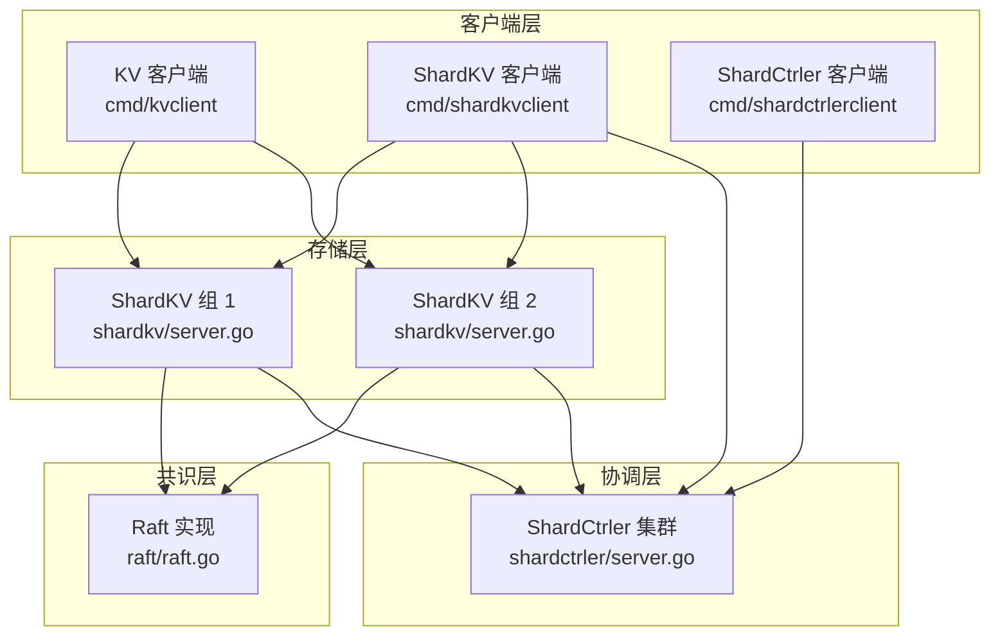
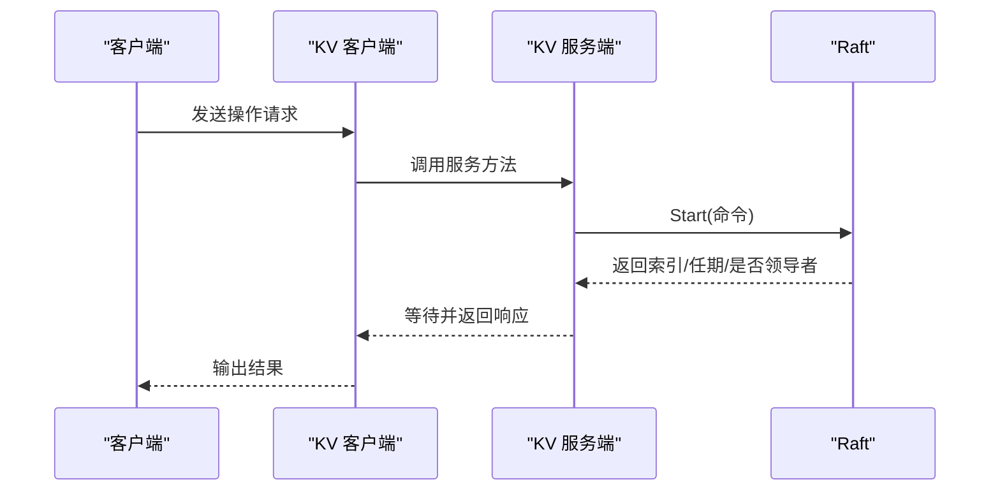
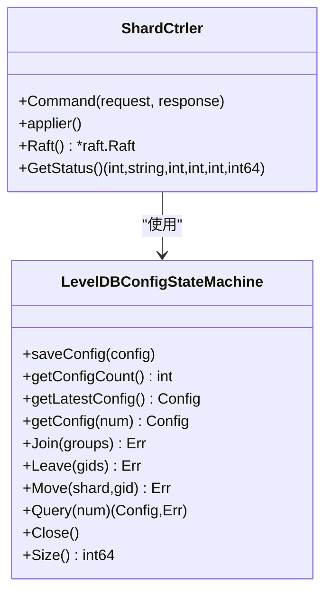
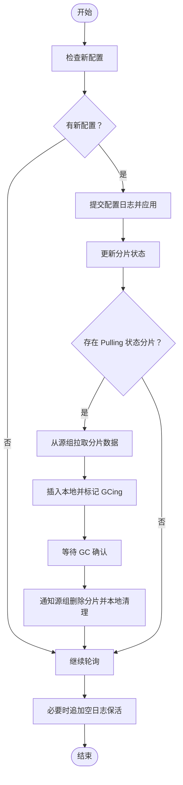
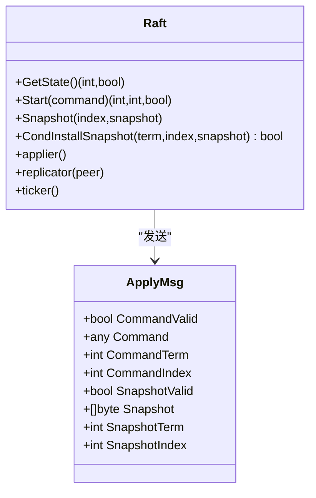
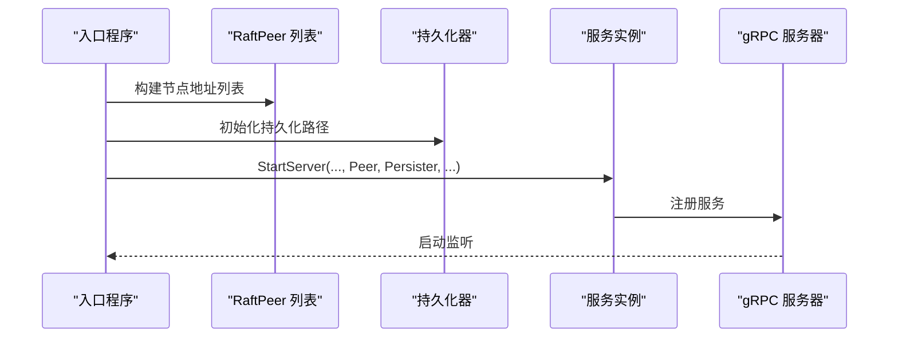
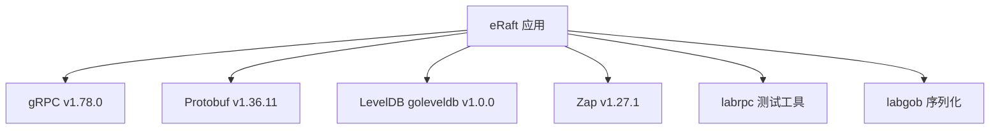

# 架构设计

<cite>
**本文引用的文件**
- [README.md](file://README.md)
- [go.mod](file://go.mod)
- [cmd/kvserver/main.go](file://cmd/kvserver/main.go)
- [cmd/kvclient/main.go](file://cmd/kvclient/main.go)
- [cmd/shardkvserver/main.go](file://cmd/shardkvserver/main.go)
- [cmd/shardctrler/main.go](file://cmd/shardctrler/main.go)
- [wiki/Architecture.md](file://wiki/Architecture.md)
- [kvraft/server.go](file://kvraft/server.go)
- [shardkv/server.go](file://shardkv/server.go)
- [shardctrler/server.go](file://shardctrler/server.go)
- [raft/raft.go](file://raft/raft.go)
- [models/kv.go](file://models/kv.go)
- [shardctrler/common.go](file://shardctrler/common.go)
- [shardkv/common.go](file://shardkv/common.go)
- [kvraft/common.go](file://kvraft/common.go)
- [raft/config.go](file://raft/config.go)
- [shardctrler/config.go](file://shardctrler/config.go)
- [shardkv/config.go](file://shardkv/config.go)
</cite>

## 目录
1. [引言](#引言)
2. [项目结构](#项目结构)
3. [核心组件](#核心组件)
4. [架构总览](#架构总览)
5. [详细组件分析](#详细组件分析)
6. [依赖分析](#依赖分析)
7. [性能考量](#性能考量)
8. [故障排查指南](#故障排查指南)
9. [结论](#结论)
10. [附录](#附录)

## 引言
本文件面向 eRaft 分布式分片键值存储系统，提供全面的架构设计文档。系统以三层架构为核心：客户端层、协调层（ShardCtrler）、存储层（ShardKV）。通过 Raft 共识算法保证强一致性和高可用；使用 gRPC 实现节点间与客户端的高效通信；采用 LevelDB 作为持久化存储引擎；通过动态分片与迁移机制实现水平扩展与负载均衡。

## 项目结构
仓库采用按功能域划分的模块化组织方式，核心目录与职责如下：
- cmd/*：各组件入口程序（服务端与客户端）
- kvraft：单机键值服务（Raft + LevelDB）
- shardkv：分片键值服务（ShardKV，多副本组）
- shardctrler：配置控制器（管理分片映射与迁移）
- raft：Raft 共识算法实现
- models：时序模型（用于正确性验证）
- wiki：系统设计与实现说明文档
- labrpc、labgob：测试与仿真工具



图表来源
- [cmd/kvclient/main.go](file://cmd/kvclient/main.go#L1-L47)
- [cmd/shardkvserver/main.go](file://cmd/shardkvserver/main.go#L1-L59)
- [cmd/shardctrler/main.go](file://cmd/shardctrler/main.go#L1-L57)
- [shardkv/server.go](file://shardkv/server.go#L759-L799)
- [shardctrler/server.go](file://shardctrler/server.go#L324-L343)
- [raft/raft.go](file://raft/raft.go#L689-L726)

章节来源
- [README.md](file://README.md#L1-L139)
- [wiki/Architecture.md](file://wiki/Architecture.md#L1-L29)

## 核心组件
- 客户端层
  - KV 客户端：对单机键值服务进行读写与状态查询。
  - ShardKV 客户端：对分片键值服务进行读写、状态查询与迁移控制。
  - ShardCtrler 客户端：向配置控制器提交 join/leave/move/query 操作。
- 协调层（ShardCtrler）
  - 负责维护分片到副本组的映射（Config），并支持动态调整。
- 存储层（ShardKV）
  - 每个副本组内部运行 Raft，负责数据分片的存储与一致性。
  - 支持配置变更检测、分片拉取（Pull）、垃圾回收（GC）与空日志保活。
- 共识层（Raft）
  - 提供日志复制、领导者选举、快照与提交推进等能力。

章节来源
- [cmd/kvclient/main.go](file://cmd/kvclient/main.go#L1-L47)
- [cmd/shardkvserver/main.go](file://cmd/shardkvserver/main.go#L1-L59)
- [cmd/shardctrler/main.go](file://cmd/shardctrler/main.go#L1-L57)
- [shardkv/server.go](file://shardkv/server.go#L759-L799)
- [shardctrler/server.go](file://shardctrler/server.go#L324-L343)
- [raft/raft.go](file://raft/raft.go#L689-L726)

## 架构总览
系统采用三层架构，强调“配置集中、存储分散、客户端透明”的设计理念：
- 配置层（ShardCtrler）：统一管理分片映射与副本组生命周期，客户端通过配置控制器查询最新配置。
- 存储层（ShardKV）：每个副本组内运行 Raft，负责对应分片的数据读写与状态同步。
- 客户端层：屏蔽底层拓扑细节，自动重试与路由到正确的副本组。

```mermaid
graph TB
Client["客户端"] --> SC["ShardCtrler 集群"]
Client --> SKV1["ShardKV 组 1"]
Client --> SKV2["ShardKV 组 2"]
SKV1 --> SC
SKV2 --> SC
SKV1 < --> SKV2["分片迁移"]
```

图表来源
- [wiki/Architecture.md](file://wiki/Architecture.md#L18-L28)

章节来源
- [wiki/Architecture.md](file://wiki/Architecture.md#L1-L29)

## 详细组件分析

### 客户端层组件
- KV 客户端（cmd/kvclient）
  - 功能：支持 get/put/append/status 操作，连接多个 KV 服务器节点。
  - 关键流程：根据参数构造请求，调用客户端库执行操作，并打印结果或状态。
- ShardKV 客户端（cmd/shardkvclient）
  - 功能：对分片键值服务进行读写、状态查询与迁移控制。
  - 关键流程：解析命令行参数，构造请求，调用客户端库执行操作。
- ShardCtrler 客户端（cmd/shardctrlerclient）
  - 功能：向配置控制器提交 join/leave/move/query 请求。
  - 关键流程：解析子命令与参数，调用客户端库发送 RPC 并输出结果。



图表来源
- [cmd/kvclient/main.go](file://cmd/kvclient/main.go#L11-L46)
- [kvraft/server.go](file://kvraft/server.go#L102-L139)
- [raft/raft.go](file://raft/raft.go#L581-L591)

章节来源
- [cmd/kvclient/main.go](file://cmd/kvclient/main.go#L1-L47)
- [cmd/shardkvserver/main.go](file://cmd/shardkvserver/main.go#L1-L59)
- [cmd/shardctrler/main.go](file://cmd/shardctrler/main.go#L1-L57)

### 协调层组件（ShardCtrler）
- 职责
  - 维护 Config（分片到组的映射、组到服务器列表）。
  - 支持 Join/Leave/Move/Query 操作，生成新的配置并由 Raft 保证一致性。
- 数据结构与接口
  - Config：包含 Num、Shards、Groups。
  - 操作类型：Join、Leave、Move、Query。
- 状态机
  - 基于 LevelDB 的配置状态机，保存历史配置并支持查询指定版本。



图表来源
- [shardctrler/server.go](file://shardctrler/server.go#L17-L343)
- [shardctrler/common.go](file://shardctrler/common.go#L26-L141)

章节来源
- [shardctrler/server.go](file://shardctrler/server.go#L1-L344)
- [shardctrler/common.go](file://shardctrler/common.go#L1-L141)

### 存储层组件（ShardKV）
- 职责
  - 每个副本组内部运行 Raft，负责一组分片的数据存储。
  - 处理客户端请求、应用日志到状态机、执行配置变更、触发分片迁移与 GC。
- 关键流程
  - 配置轮询：周期检查新配置并提交配置日志。
  - 迁移拉取：当发现需要拉取其他组的分片时，从源组获取数据并插入本地。
  - 垃圾回收：确认迁移完成后通知源组删除对应分片数据。
  - 空日志保活：在当前任期内追加空日志以避免提交停滞。
- 状态机
  - LevelDB 分片存储，键格式包含分片号前缀，便于快速迭代与清理。



图表来源
- [shardkv/server.go](file://shardkv/server.go#L549-L796)

章节来源
- [shardkv/server.go](file://shardkv/server.go#L1-L800)
- [shardkv/common.go](file://shardkv/common.go#L1-L229)

### 共识层组件（Raft）
- 职责
  - 提供领导者选举、日志复制、提交推进、快照与安装快照等核心能力。
  - 通过 ApplyMsg 将已提交日志传递给上层状态机。
- 关键机制
  - 心跳与选举定时器驱动状态切换。
  - 日志匹配与冲突回退，基于 matchIndex 推进 commitIndex。
  - 快照与增量日志结合，控制 Raft 状态大小。



图表来源
- [raft/raft.go](file://raft/raft.go#L37-L726)

章节来源
- [raft/raft.go](file://raft/raft.go#L1-L726)

### 客户端与服务端启动流程
- KV 服务端（cmd/kvserver）
  - 解析参数，构建 RaftPeer 列表，初始化持久化器，启动 gRPC 服务并注册 KV 与 Raft 服务。
- ShardKV 服务端（cmd/shardkvserver）
  - 解析参数，构建组内 RaftPeer 列表，初始化持久化器，启动 gRPC 服务并注册 ShardKV 与 Raft 服务。
- ShardCtrler 服务端（cmd/shardctrler）
  - 解析参数，构建 RaftPeer 列表，初始化持久化器，启动 gRPC 服务并注册 ShardCtrler 与 Raft 服务。



图表来源
- [cmd/kvserver/main.go](file://cmd/kvserver/main.go#L16-L47)
- [cmd/shardkvserver/main.go](file://cmd/shardkvserver/main.go#L18-L58)
- [cmd/shardctrler/main.go](file://cmd/shardctrler/main.go#L18-L56)

章节来源
- [cmd/kvserver/main.go](file://cmd/kvserver/main.go#L1-L48)
- [cmd/shardkvserver/main.go](file://cmd/shardkvserver/main.go#L1-L59)
- [cmd/shardctrler/main.go](file://cmd/shardctrler/main.go#L1-L57)

## 依赖分析
- 技术栈与版本
  - Go 版本：1.24.0（toolchain go1.24.12）
  - gRPC：v1.78.0
  - Protobuf：v1.36.11
  - 日志与指标：zap v1.27.1
  - LevelDB：goleveldb v1.0.0
- 外部依赖与集成点
  - gRPC：服务端与客户端之间通信协议。
  - LevelDB：持久化存储后端。
  - labrpc：测试网络仿真与 RPC 通道。
  - labgob：日志与快照序列化。



图表来源
- [go.mod](file://go.mod#L1-L22)

章节来源
- [go.mod](file://go.mod#L1-L22)

## 性能考量
- 日志与快照
  - 当 Raft 状态大小超过阈值时触发快照，减少日志长度，提升稳定性与恢复速度。
- 并发与锁
  - 使用读写锁隔离共享状态访问，避免长时间持有互斥锁阻塞复制与应用。
- 追加空日志
  - 在当前任期内定期追加空日志，避免因无新日志导致提交停滞。
- 迁移与 GC
  - 拉取与 GC 分离，降低迁移期间的写放大与锁竞争。

章节来源
- [kvraft/server.go](file://kvraft/server.go#L238-L258)
- [shardkv/server.go](file://shardkv/server.go#L463-L485)
- [shardkv/server.go](file://shardkv/server.go#L718-L722)

## 故障排查指南
- 常见错误与处理
  - 错误类型：ErrWrongLeader、ErrTimeout、ErrWrongGroup、ErrOutDated、ErrNotReady。
  - 排查要点：确认领导者身份、超时设置、分片归属与配置版本。
- 监控与诊断
  - 通过客户端 status 命令查看节点角色、任期、已提交与已应用索引、存储大小等。
- 快照与日志
  - 若日志过大或状态异常，检查快照触发阈值与快照内容是否正确恢复。

章节来源
- [shardkv/common.go](file://shardkv/common.go#L38-L68)
- [shardkv/server.go](file://shardkv/server.go#L105-L108)
- [shardctrler/common.go](file://shardctrler/common.go#L88-L106)

## 结论
eRaft 通过清晰的三层架构与 Raft 共识算法，实现了高可用、可扩展且易于运维的分布式分片键值存储系统。配置层集中管理分片映射，存储层按组分片并具备自动迁移与 GC 能力，客户端层提供透明访问。配合快照、并发优化与空日志保活等机制，系统在复杂网络环境下仍能保持一致性与性能。

## 附录
- 系统上下文与组件分解
  - 参考 wiki 中的高层组件图与分层说明。
- 测试与验证
  - 使用 models/kv.go 的时序模型进行正确性验证。
  - 测试配置位于 raft/config.go、shardctrler/config.go、shardkv/config.go。

章节来源
- [wiki/Architecture.md](file://wiki/Architecture.md#L1-L29)
- [models/kv.go](file://models/kv.go#L1-L73)
- [raft/config.go](file://raft/config.go#L1-L594)
- [shardctrler/config.go](file://shardctrler/config.go#L1-L364)
- [shardkv/config.go](file://shardkv/config.go#L1-L396)