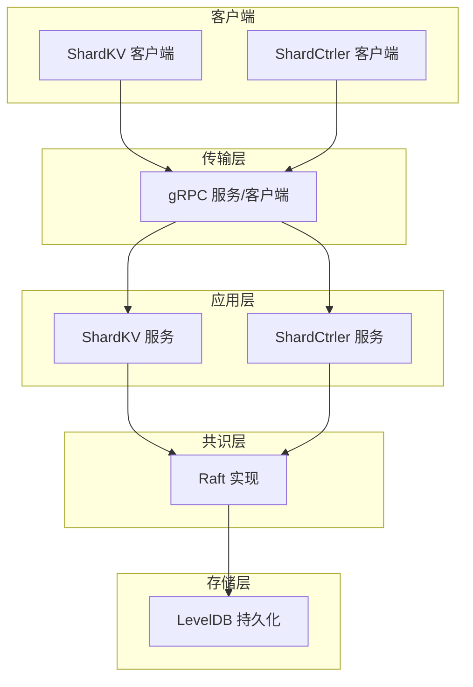
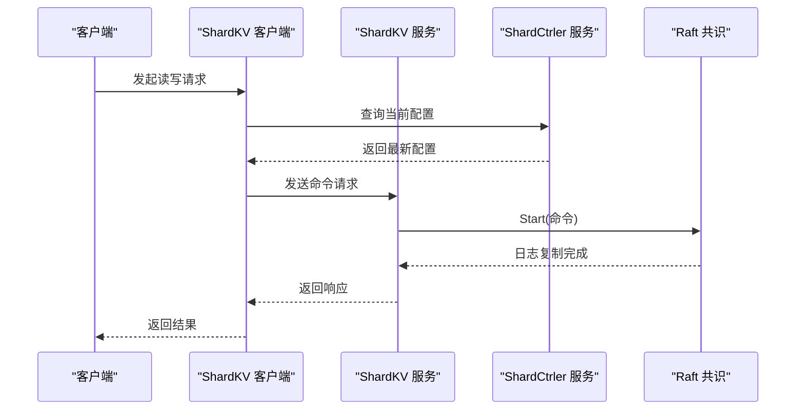
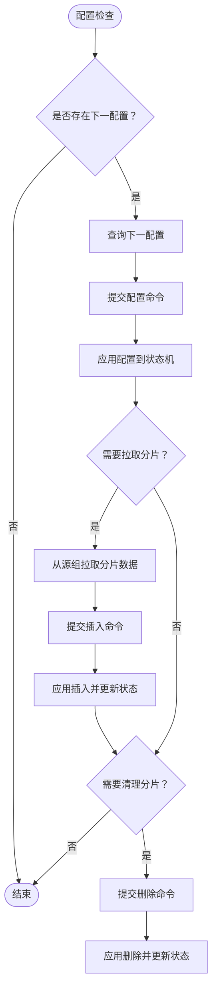
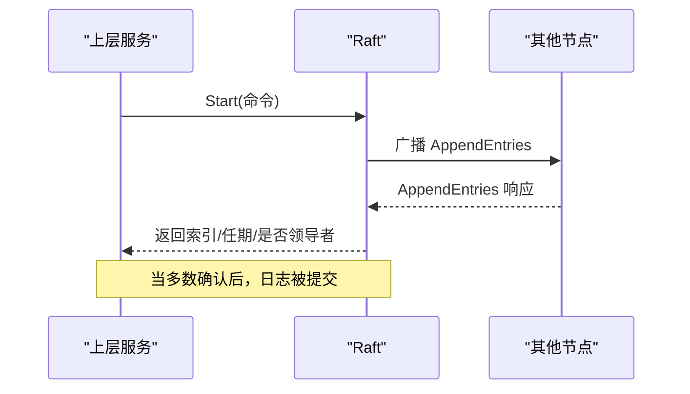
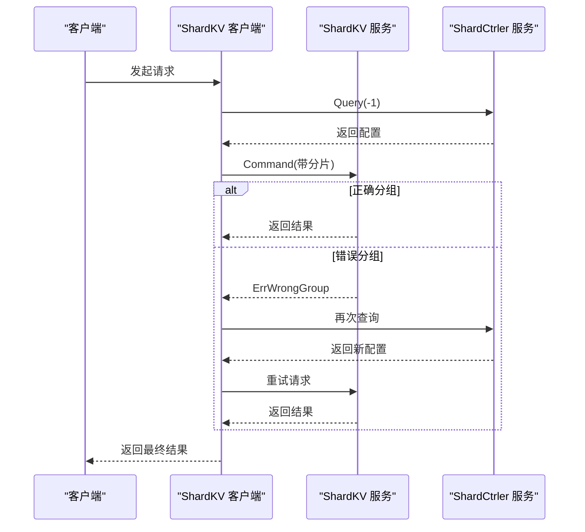
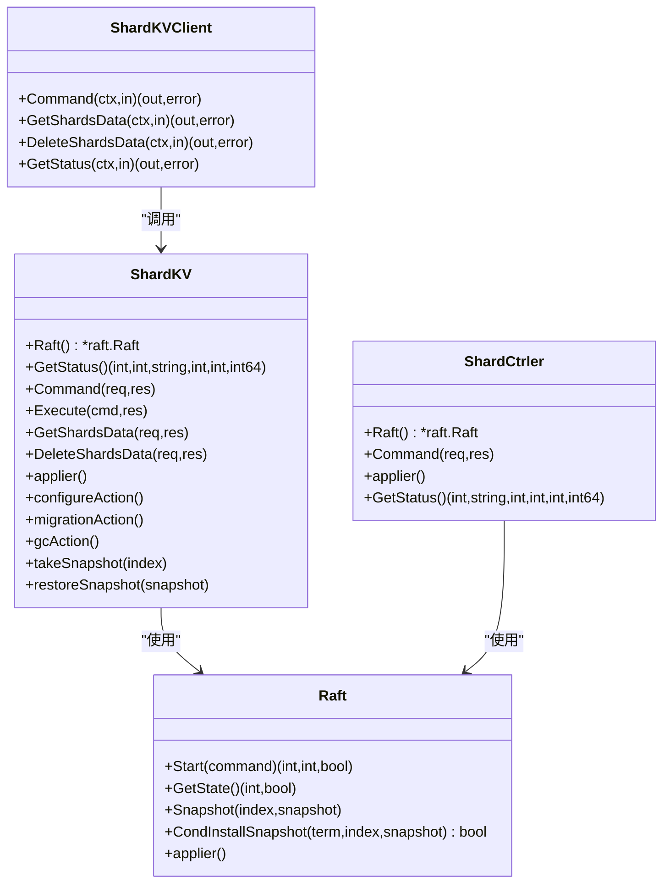
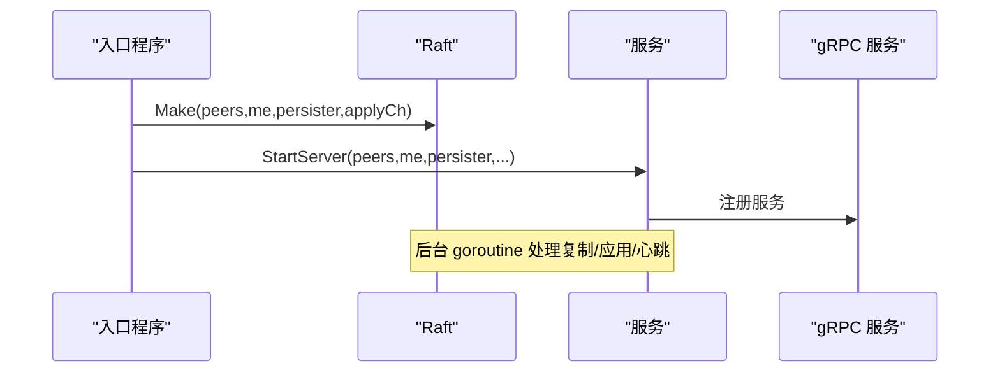
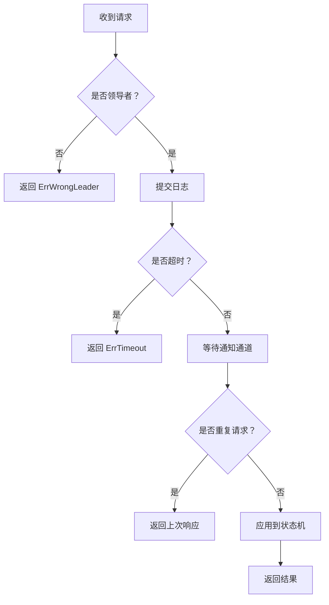
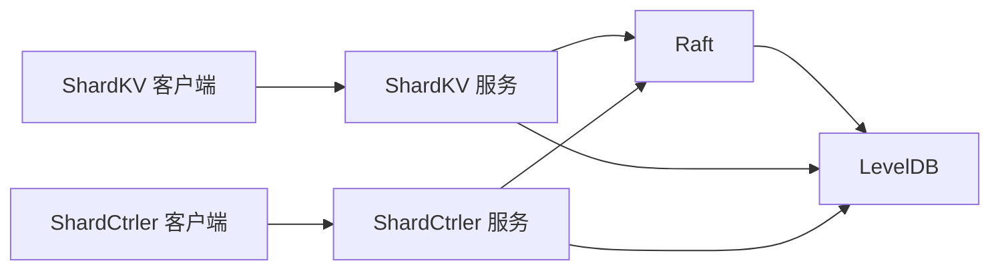

# 组件交互关系

<cite>
**本文档引用的文件**
- [shardkv/server.go](file://shardkv/server.go)
- [shardkv/common.go](file://shardkv/common.go)
- [shardkv/client.go](file://shardkv/client.go)
- [shardkv/config.go](file://shardkv/config.go)
- [shardkv/grpc_server.go](file://shardkv/grpc_server.go)
- [shardkv/shard.go](file://shardkv/shard.go)
- [shardctrler/server.go](file://shardctrler/server.go)
- [shardctrler/common.go](file://shardctrler/common.go)
- [shardctrler/client.go](file://shardctrler/client.go)
- [shardctrler/config.go](file://shardctrler/config.go)
- [shardctrler/grpc_server.go](file://shardctrler/grpc_server.go)
- [raft/raft.go](file://raft/raft.go)
- [raft/rpc.go](file://raft/rpc.go)
- [raft/grpc_client.go](file://raft/grpc_client.go)
- [raft/grpc_server.go](file://raft/grpc_server.go)
- [raft/persister.go](file://raft/persister.go)
- [shardkvpb/shardkv.proto](file://shardkvpb/shardkv.proto)
- [shardctrlerpb/shardctrler.proto](file://shardctrlerpb/shardctrler.proto)
- [raftpb/raft.proto](file://raftpb/raft.proto)
- [cmd/shardkvserver/main.go](file://cmd/shardkvserver/main.go)
- [cmd/shardctrler/main.go](file://cmd/shardctrler/main.go)
- [cmd/kvserver/main.go](file://cmd/kvserver/main.go)
</cite>

## 目录
1. [简介](#简介)
2. [项目结构](#项目结构)
3. [核心组件](#核心组件)
4. [架构总览](#架构总览)
5. [详细组件分析](#详细组件分析)
6. [依赖关系分析](#依赖关系分析)
7. [性能考虑](#性能考虑)
8. [故障排查指南](#故障排查指南)
9. [结论](#结论)

## 简介
本文件面向 eRaft 分布式键值存储系统，聚焦于组件交互关系与数据流。重点阐述以下方面：
- ShardKV 与 ShardCtrler 的配置查询与数据迁移交互
- Raft 共识算法在各组件中的应用与状态同步
- 客户端与服务端的通信协议与错误传播
- 生命周期管理、状态同步、快照与故障恢复机制
- 时序图与交互图，帮助读者快速把握系统运行时行为

## 项目结构
系统采用分层与按功能模块划分的组织方式：
- 应用层：ShardKV（分片键值服务）、ShardCtrler（分片控制器）
- 共识层：Raft 实现（提供日志复制、选举、快照等能力）
- 传输层：gRPC 协议（节点间 RPC 与客户端到服务端通信）
- 存储层：LevelDB（持久化状态机与 Raft 快照）
- 工具与测试：labrpc（仿真网络）、测试配置与工具函数

图表来源
- [shardkv/server.go](file://shardkv/server.go#L76-L799)
- [shardctrler/server.go](file://shardctrler/server.go#L17-L343)
- [raft/raft.go](file://raft/raft.go#L37-L725)

章节来源
- [shardkv/server.go](file://shardkv/server.go#L76-L799)
- [shardctrler/server.go](file://shardctrler/server.go#L17-L343)
- [raft/raft.go](file://raft/raft.go#L37-L725)

## 核心组件
- ShardKV：负责分片键值数据的读写、配置变更应用、跨组数据迁移与垃圾回收、状态机与快照管理。
- ShardCtrler：负责维护全局配置（分片到组的映射）并提供查询接口；通过 Raft 保证配置变更的一致性。
- Raft：提供一致性共识、日志复制、领导者心跳、冲突检测与快照安装等能力。
- gRPC：作为统一的 RPC 传输层，支撑节点间通信与客户端访问。
- 客户端：ShardKV 客户端根据配置选择正确的组进行请求；ShardCtrler 客户端用于配置变更与查询。

章节来源
- [shardkv/common.go](file://shardkv/common.go#L21-L229)
- [shardctrler/common.go](file://shardctrler/common.go#L26-L141)
- [raft/raft.go](file://raft/raft.go#L37-L164)

## 架构总览
下图展示了 eRaft 的高层交互：客户端通过 ShardKV 客户端定位到对应组，ShardKV 通过 Raft 进行日志复制与提交，ShardCtrler 提供配置查询与变更，ShardKV 在配置变更后执行数据迁移与清理。

图表来源
- [shardkv/client.go](file://shardkv/client.go#L165-L265)
- [shardctrler/client.go](file://shardctrler/client.go#L125-L197)
- [shardkv/server.go](file://shardkv/server.go#L109-L157)
- [raft/raft.go](file://raft/raft.go#L581-L591)

## 详细组件分析

### ShardKV 与 ShardCtrler 的配置查询与数据迁移交互
- 配置查询：ShardKV 定期检查当前配置是否需要更新，若存在未应用的下一配置，则通过 ShardCtrler 客户端查询并提交配置变更命令。
- 数据迁移：
  - 拉取阶段（Pulling → GCing）：从源组拉取分片数据与最后操作上下文，写入本地并更新状态。
  - 垃圾回收阶段（GCing → Serving）：删除源组中已被接管的分片数据，确保一致性。
- 状态机与快照：ShardKV 将分片状态、最后操作上下文与配置信息纳入快照，支持崩溃恢复。

图表来源
- [shardkv/server.go](file://shardkv/server.go#L549-L570)
- [shardkv/server.go](file://shardkv/server.go#L572-L643)
- [shardkv/server.go](file://shardkv/server.go#L645-L696)
- [shardkv/server.go](file://shardkv/server.go#L348-L383)

章节来源
- [shardkv/server.go](file://shardkv/server.go#L549-L570)
- [shardkv/server.go](file://shardkv/server.go#L572-L643)
- [shardkv/server.go](file://shardkv/server.go#L645-L696)
- [shardkv/server.go](file://shardkv/server.go#L348-L383)

### Raft 共识算法在不同组件中的应用
- 日志复制与提交：ShardKV/ ShardCtrler 通过 Raft.Start 提交命令，Raft 将日志复制到多数节点后提交。
- 状态同步：Raft 的 applyCh 将已提交日志推送到上层状态机，确保一致性。
- 快照：当 Raft 状态大小超过阈值时，ShardKV/ ShardCtrler 触发快照，减少日志长度并提升性能。
- 节点间通信：Raft 通过 gRPC 客户端实现节点间 RequestVote、AppendEntries、InstallSnapshot RPC。

图表来源
- [raft/raft.go](file://raft/raft.go#L581-L591)
- [raft/raft.go](file://raft/raft.go#L353-L366)
- [raft/raft.go](file://raft/raft.go#L166-L241)

章节来源
- [raft/raft.go](file://raft/raft.go#L581-L591)
- [raft/raft.go](file://raft/raft.go#L353-L366)
- [raft/raft.go](file://raft/raft.go#L166-L241)

### 客户端与服务端的通信协议
- 协议定义：使用 gRPC，消息类型由 .proto 文件定义，包括命令请求/响应、分片操作请求/响应、状态查询等。
- 客户端路由：ShardKV 客户端根据 key2shard 计算分片，再依据配置选择目标组的服务器；若返回 ErrWrongGroup，则重新查询配置并重试。
- 错误传播：客户端对 ErrWrongLeader、ErrTimeout 等进行重试或切换领导者；服务端在非领导者或超时情况下返回相应错误码。

图表来源
- [shardkv/client.go](file://shardkv/client.go#L165-L265)
- [shardctrler/client.go](file://shardctrler/client.go#L125-L197)
- [shardkvpb/shardkv.proto](file://shardkvpb/shardkv.proto#L13-L24)
- [shardkvpb/shardkv.proto](file://shardkvpb/shardkv.proto#L26-L45)

章节来源
- [shardkv/client.go](file://shardkv/client.go#L165-L265)
- [shardctrler/client.go](file://shardctrler/client.go#L125-L197)
- [shardkvpb/shardkv.proto](file://shardkvpb/shardkv.proto#L13-L24)
- [shardkvpb/shardkv.proto](file://shardkvpb/shardkv.proto#L26-L45)

### 组件类关系与交互图
下图展示核心组件的类关系与交互：ShardKV/ ShardCtrler 依赖 Raft，二者通过 gRPC 对外提供服务；客户端通过 gRPC 或 labrpc 与服务端交互。

图表来源
- [shardkv/server.go](file://shardkv/server.go#L76-L108)
- [shardkv/server.go](file://shardkv/server.go#L109-L157)
- [shardkv/server.go](file://shardkv/server.go#L248-L326)
- [shardkv/server.go](file://shardkv/server.go#L549-L570)
- [shardkv/server.go](file://shardkv/server.go#L572-L643)
- [shardkv/server.go](file://shardkv/server.go#L645-L696)
- [shardctrler/server.go](file://shardctrler/server.go#L17-L34)
- [shardctrler/server.go](file://shardctrler/server.go#L179-L215)
- [shardctrler/server.go](file://shardctrler/server.go#L272-L313)
- [raft/raft.go](file://raft/raft.go#L581-L591)
- [raft/raft.go](file://raft/raft.go#L120-L144)
- [raft/raft.go](file://raft/raft.go#L638-L664)

章节来源
- [shardkv/server.go](file://shardkv/server.go#L76-L108)
- [shardkv/server.go](file://shardkv/server.go#L109-L157)
- [shardkv/server.go](file://shardkv/server.go#L248-L326)
- [shardkv/server.go](file://shardkv/server.go#L549-L570)
- [shardkv/server.go](file://shardkv/server.go#L572-L643)
- [shardkv/server.go](file://shardkv/server.go#L645-L696)
- [shardctrler/server.go](file://shardctrler/server.go#L17-L34)
- [shardctrler/server.go](file://shardctrler/server.go#L179-L215)
- [shardctrler/server.go](file://shardctrler/server.go#L272-L313)
- [raft/raft.go](file://raft/raft.go#L581-L591)
- [raft/raft.go](file://raft/raft.go#L120-L144)
- [raft/raft.go](file://raft/raft.go#L638-L664)

### 生命周期管理与状态同步机制
- 启动流程：入口程序解析参数，构造 RaftPeer 列表，初始化持久化器，启动服务并注册 gRPC 服务。
- 状态同步：通过 Raft 的 applyCh 将已提交日志推送至状态机，确保一致性；同时维护 lastApplied 防止回滚。
- 快照与恢复：当 Raft 状态大小超过阈值时触发快照；服务重启后从快照恢复状态机与元数据。

图表来源
- [cmd/shardkvserver/main.go](file://cmd/shardkvserver/main.go#L18-L58)
- [cmd/shardctrler/main.go](file://cmd/shardctrler/main.go#L18-L56)
- [raft/raft.go](file://raft/raft.go#L689-L725)
- [shardkv/server.go](file://shardkv/server.go#L759-L799)
- [shardctrler/server.go](file://shardctrler/server.go#L324-L343)

章节来源
- [cmd/shardkvserver/main.go](file://cmd/shardkvserver/main.go#L18-L58)
- [cmd/shardctrler/main.go](file://cmd/shardctrler/main.go#L18-L56)
- [raft/raft.go](file://raft/raft.go#L689-L725)
- [shardkv/server.go](file://shardkv/server.go#L759-L799)
- [shardctrler/server.go](file://shardctrler/server.go#L324-L343)

### 错误传播、异常处理与故障恢复
- 错误传播：客户端对 ErrWrongLeader、ErrTimeout 进行重试或切换领导者；服务端在非领导者或超时场景返回相应错误码。
- 异常处理：ShardKV 在 apply 时检查重复请求与过期配置，避免重复执行；在配置变更时严格校验顺序。
- 故障恢复：通过快照与持久化 Raft 状态，崩溃后可从最近快照恢复；InstallSnapshot RPC 支持落后节点追赶。

图表来源
- [shardkv/server.go](file://shardkv/server.go#L109-L157)
- [shardkv/server.go](file://shardkv/server.go#L328-L345)
- [shardkv/common.go](file://shardkv/common.go#L40-L68)

章节来源
- [shardkv/server.go](file://shardkv/server.go#L109-L157)
- [shardkv/server.go](file://shardkv/server.go#L328-L345)
- [shardkv/common.go](file://shardkv/common.go#L40-L68)

## 依赖关系分析
- 组件耦合：ShardKV/ ShardCtrler 与 Raft 强耦合，通过 Start/applyCh 实现日志复制与状态机驱动。
- 外部依赖：gRPC 提供跨语言、跨进程通信；LevelDB 提供高性能键值存储与快照能力。
- 可能的循环依赖：无直接循环依赖，服务通过接口与 gRPC 间接交互。

图表来源
- [shardkv/server.go](file://shardkv/server.go#L76-L799)
- [shardctrler/server.go](file://shardctrler/server.go#L17-L343)
- [raft/raft.go](file://raft/raft.go#L37-L725)

章节来源
- [shardkv/server.go](file://shardkv/server.go#L76-L799)
- [shardctrler/server.go](file://shardctrler/server.go#L17-L343)
- [raft/raft.go](file://raft/raft.go#L37-L725)

## 性能考虑
- 日志与快照：通过快照减少日志长度，提高性能；合理设置 maxRaftState 阈值平衡内存与 IO。
- 并发与锁：状态机操作尽量避免持有锁，通过通知通道异步通知客户端，减少阻塞。
- 心跳与空条目：定期提交空条目以推进提交索引，避免“活锁”问题。
- 存储：LevelDB 批量写入与迭代优化，减少磁盘 IO。

## 故障排查指南
- 常见错误码与含义：
  - OK：成功
  - ErrWrongGroup：请求的分片不在当前组，需重新查询配置
  - ErrWrongLeader：非领导者，需重试或切换领导者
  - ErrOutDated：配置过期，需重新获取
  - ErrTimeout：请求超时
  - ErrNotReady：配置尚未就绪
- 排查步骤：
  - 检查客户端是否正确处理 ErrWrongGroup 并重新查询配置
  - 查看服务端日志中 apply 流程与重复请求判断逻辑
  - 确认快照与恢复流程是否正常
  - 使用 GetStatus 接口检查节点状态与提交进度

章节来源
- [shardkv/common.go](file://shardkv/common.go#L40-L68)
- [shardkv/server.go](file://shardkv/server.go#L248-L326)
- [shardkv/server.go](file://shardkv/server.go#L487-L516)

## 结论
eRaft 通过清晰的分层设计与强一致的 Raft 共识，实现了分片键值服务与配置控制器的协同工作。ShardKV 与 ShardCtrler 的交互以配置为中心，辅以数据迁移与垃圾回收保障一致性；客户端通过 gRPC 与 labrpc 实现灵活接入。整体架构具备良好的扩展性与可维护性，适合进一步演进为生产级分布式系统。