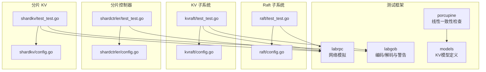
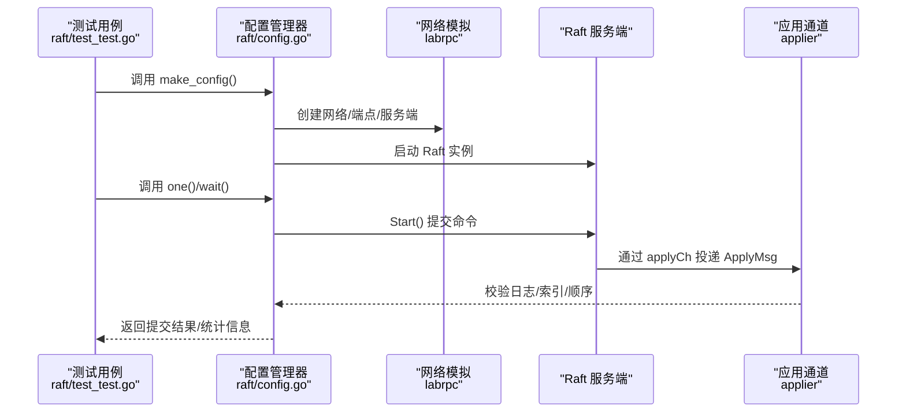
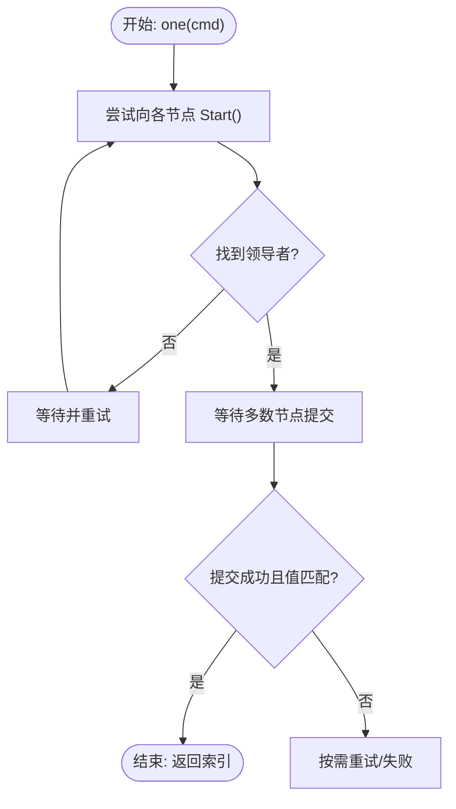
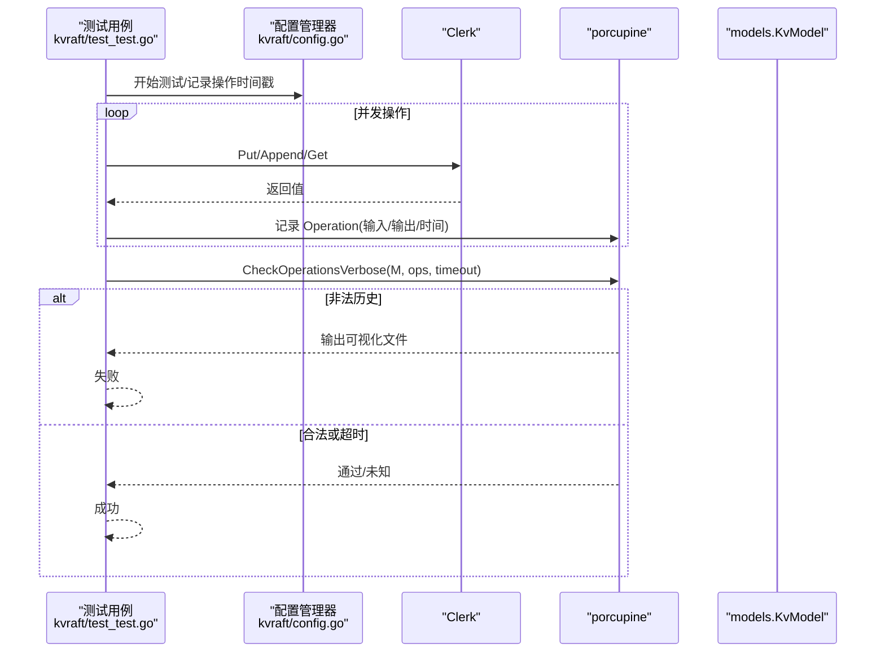
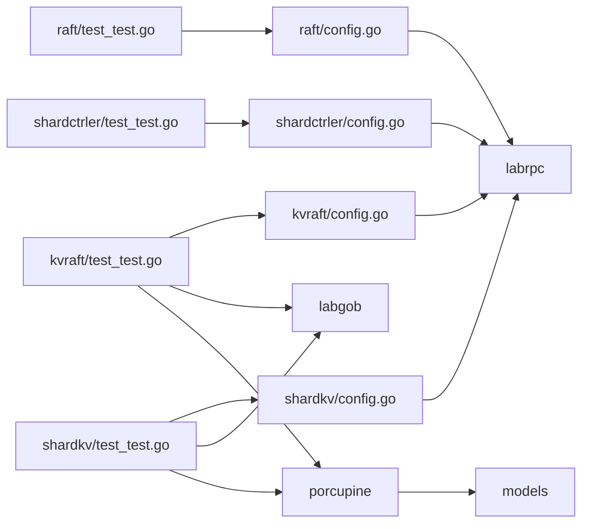

# 单元测试

**本文引用的文件**
- [raft/test_test.go](file://raft/test_test.go)
- [raft/config.go](file://raft/config.go)
- [kvraft/test_test.go](file://kvraft/test_test.go)
- [kvraft/config.go](file://kvraft/config.go)
- [shardctrler/test_test.go](file://shardctrler/test_test.go)
- [shardctrler/config.go](file://shardctrler/config.go)
- [shardkv/test_test.go](file://shardkv/test_test.go)
- [shardkv/config.go](file://shardkv/config.go)
- [labrpc/labrpc.go](file://labrpc/labrpc.go)
- [labgob/labgob.go](file://labgob/labgob.go)
- [models/kv.go](file://models/kv.go)
- [porcupine/porcupine.go](file://porcupine/porcupine.go)

## 目录
1. [引言](#引言)
2. [项目结构](#项目结构)
3. [核心组件](#核心组件)
4. [架构总览](#架构总览)
5. [详细组件分析](#详细组件分析)
6. [依赖关系分析](#依赖关系分析)
7. [性能考量](#性能考量)
8. [故障排查指南](#故障排查指南)
9. [结论](#结论)
10. [附录](#附录)

## 引言
本技术文档面向 eRaft 项目的单元测试体系，系统阐述测试用例设计原则、测试框架架构与模拟对象使用方法，覆盖 Raft、KV、分片控制器（ShardCtrler）与分片 KV（ShardKV）系统的测试策略。内容包括测试配置管理、断言机制、错误处理、线性一致性校验、测试隔离与依赖管理、覆盖率统计建议、边界条件与异常场景测试以及性能回归测试方法。目标是帮助开发者编写高质量的单元测试，确保在复杂网络与并发条件下系统行为正确。

## 项目结构
eRaft 采用模块化组织，每个子系统（raft、kvraft、shardctrler、shardkv）均配有独立的测试入口与配置管理器，底层通过 labrpc 提供可插拔的网络模拟层，labgob 负责序列化安全检查，models 与 porcupine 提供线性一致性模型与验证工具。

图示来源
- [raft/test_test.go](file://raft/test_test.go#L1-L120)
- [raft/config.go](file://raft/config.go#L67-L107)
- [kvraft/test_test.go](file://kvraft/test_test.go#L209-L385)
- [kvraft/config.go](file://kvraft/config.go#L367-L398)
- [shardctrler/test_test.go](file://shardctrler/test_test.go#L80-L122)
- [shardctrler/config.go](file://shardctrler/config.go#L339-L363)
- [shardkv/test_test.go](file://shardkv/test_test.go#L27-L96)
- [shardkv/config.go](file://shardkv/config.go#L350-L395)
- [labrpc/labrpc.go](file://labrpc/labrpc.go#L143-L168)
- [labgob/labgob.go](file://labgob/labgob.go#L24-L58)
- [models/kv.go](file://models/kv.go#L20-L72)
- [porcupine/porcupine.go](file://porcupine/porcupine.go#L5-L21)

章节来源
- [raft/test_test.go](file://raft/test_test.go#L1-L120)
- [kvraft/test_test.go](file://kvraft/test_test.go#L209-L385)
- [shardctrler/test_test.go](file://shardctrler/test_test.go#L80-L122)
- [shardkv/test_test.go](file://shardkv/test_test.go#L27-L96)

## 核心组件
- 测试用例设计原则
  - 可重复性：通过随机种子初始化与确定性网络行为保证测试可复现。
  - 隔离性：每个测试独立创建/销毁网络、服务器与客户端，避免状态泄漏。
  - 完整性：覆盖正常路径、异常路径（断连、分区、崩溃重启、不可靠网络）、边界条件（多数派/少数派、空日志、快照触发点）。
  - 断言明确：对领导选举、提交一致性、RPC 计数、字节总量、快照大小等进行量化断言。
- 测试框架架构
  - 配置管理器（config）：统一创建/连接/断开服务器、客户端，统计 RPC/字节/命令数量，提供超时控制。
  - 网络模拟（labrpc）：支持可靠/不可靠、长延迟、消息重排、连接启用/禁用，用于构造极端网络场景。
  - 序列化安全（labgob）：在 RPC 编解码前进行字段命名检查与默认值覆盖风险提示。
  - 线性一致性（porcupine + models）：对历史操作进行分区与线性化校验，输出可视化报告。
- 模拟对象使用方法
  - 使用配置管理器提供的 make_config 创建测试环境，按需调用 connect/disconnect/partition 控制网络拓扑。
  - 使用 Clerk 发起请求，等待提交或根据返回值判定重试策略。
  - 使用 Snapshot 触发与校验，结合 LogSize/SnapshotSize 断言日志修剪与快照大小约束。

章节来源
- [raft/config.go](file://raft/config.go#L67-L107)
- [kvraft/config.go](file://kvraft/config.go#L367-L398)
- [shardkv/config.go](file://shardkv/config.go#L350-L395)
- [labrpc/labrpc.go](file://labrpc/labrpc.go#L143-L168)
- [labgob/labgob.go](file://labgob/labgob.go#L70-L115)
- [porcupine/porcupine.go](file://porcupine/porcupine.go#L5-L21)
- [models/kv.go](file://models/kv.go#L20-L72)

## 架构总览
下图展示测试执行的关键流程：测试用例通过配置管理器启动服务器与客户端，利用 labrpc 构造网络拓扑，Raft/KV 组件在应用通道中提交命令，最终由断言与统计函数完成验证。

图示来源
- [raft/test_test.go](file://raft/test_test.go#L24-L53)
- [raft/config.go](file://raft/config.go#L502-L549)
- [labrpc/labrpc.go](file://labrpc/labrpc.go#L87-L126)

章节来源
- [raft/test_test.go](file://raft/test_test.go#L24-L53)
- [raft/config.go](file://raft/config.go#L502-L549)

## 详细组件分析

### Raft 测试策略
- 设计要点
  - 初始选举与重选：断言唯一领导者存在、任期单调递增、无故障时领导者稳定。
  - 多轮选举：随机断开多数节点，验证领导者重选与 quorum 判定。
  - 基本共识：Start() 返回索引与预期一致，nCommitted() 统一提交。
  - RPC 字节数与 RPC 数量：限制每条命令仅发送一次，RPC 总数与字节总量上限断言。
  - 故障恢复与持久化：崩溃重启后仍能达成共识；断连后恢复能追平日志。
  - 不可靠网络与分区：RPC 可能丢失/延迟；分区后少数派无法提交；分区修复后能继续推进。
- 关键断言与统计
  - checkOneLeader()/checkNoLeader()：领导者存在性与唯一性。
  - checkTerms()：所有节点任期一致。
  - rpcCount()/rpcTotal()/bytesTotal()：RPC 计数与字节统计。
  - LogSize()：最大 Raft 日志大小。
- 典型流程图（RPC 字节数统计）

图示来源
- [raft/test_test.go](file://raft/test_test.go#L149-L178)
- [raft/test_test.go](file://raft/test_test.go#L502-L549)
- [raft/config.go](file://raft/config.go#L502-L549)

章节来源
- [raft/test_test.go](file://raft/test_test.go#L24-L53)
- [raft/test_test.go](file://raft/test_test.go#L149-L178)
- [raft/test_test.go](file://raft/test_test.go#L586-L630)
- [raft/test_test.go](file://raft/test_test.go#L772-L799)
- [raft/config.go](file://raft/config.go#L374-L432)
- [raft/config.go](file://raft/config.go#L502-L549)

### KV 测试策略
- 设计要点
  - 基础功能：单客户端/多客户端并发 Put/Append/Get，断言值正确性与顺序。
  - 不可靠网络：RPC 丢包/延迟，验证幂等与最终一致性。
  - 分区与重启：分区期间少数派写入应被拒绝；修复后能继续推进。
  - 快照与日志修剪：设置 maxraftstate 限制日志大小，断言快照大小合理。
  - 线性一致性：使用 porcupine 对历史操作进行线性化校验，生成可视化报告。
- 关键断言与统计
  - check()/checkClntAppends()/checkConcurrentAppends()：值与顺序校验。
  - LogSize()/SnapshotSize()：日志与快照大小断言。
  - GenericTestSpeed()：操作速率断言（心跳间隔内完成足够操作）。
- 线性一致性校验流程

图示来源
- [kvraft/test_test.go](file://kvraft/test_test.go#L366-L384)
- [porcupine/porcupine.go](file://porcupine/porcupine.go#L19-L21)
- [models/kv.go](file://models/kv.go#L20-L72)

章节来源
- [kvraft/test_test.go](file://kvraft/test_test.go#L420-L469)
- [kvraft/test_test.go](file://kvraft/test_test.go#L593-L646)
- [kvraft/test_test.go](file://kvraft/test_test.go#L683-L715)
- [kvraft/config.go](file://kvraft/config.go#L87-L109)
- [porcupine/porcupine.go](file://porcupine/porcupine.go#L19-L21)

### 分片控制器（ShardCtrler）测试策略
- 设计要点
  - 基本 Join/Leave/Move：验证组加入/离开后的分片分配均衡性（每组分片数差不超过 1）。
  - 历史查询：对旧配置号查询应返回对应历史配置。
  - 并发 Join/Leave：多个客户端并发操作，最终配置符合预期。
  - 最小迁移：Join/Leave 后尽量减少分片迁移次数。
- 关键断言
  - check()/check_same_config()：组数量、分片归属、历史配置一致性。
  - Num/Groups/Shards 结构断言。

章节来源
- [shardctrler/test_test.go](file://shardctrler/test_test.go#L80-L122)
- [shardctrler/test_test.go](file://shardctrler/test_test.go#L252-L380)
- [shardctrler/config.go](file://shardctrler/config.go#L339-L363)

### 分片 KV（ShardKV）测试策略
- 设计要点
  - 静态分片：未发生配置变化时，数据正确性与可用性。
  - 加入/离开：验证加入新组后数据可访问；离开旧组后仍可读写。
  - 快照与迁移：开启快照后，日志修剪与快照大小受控；迁移过程中数据一致性。
  - 并发配置变更：在迁移期间并发 Put/Append，验证一致性与正确性。
  - 不可靠网络：RPC 丢包/延迟下的正确性与恢复能力。
  - 线性一致性：对历史操作进行线性化校验，必要时生成可视化报告。
- 关键断言
  - checklogs()：日志大小与快照状态断言。
  - ShutdownGroup()/StartGroup()：组级启停验证。
  - 线性一致性校验与可视化。

章节来源
- [shardkv/test_test.go](file://shardkv/test_test.go#L27-L96)
- [shardkv/test_test.go](file://shardkv/test_test.go#L151-L217)
- [shardkv/test_test.go](file://shardkv/test_test.go#L305-L380)
- [shardkv/test_test.go](file://shardkv/test_test.go#L455-L558)
- [shardkv/test_test.go](file://shardkv/test_test.go#L560-L663)
- [shardkv/config.go](file://shardkv/config.go#L95-L110)
- [shardkv/config.go](file://shardkv/config.go#L350-L395)

## 依赖关系分析
- 组件耦合
  - 测试用例依赖配置管理器（make_config），配置管理器依赖 labrpc 网络与各子系统服务。
  - KV/分片 KV 测试依赖 porcupine 线性一致性检查与 models 模型。
  - labgob 在编解码阶段提供字段命名与默认值覆盖风险提示，降低测试中的隐性错误。
- 外部依赖
  - testing 包用于测试生命周期与断言。
  - crypto/rand 与 math/big 用于随机种子与随机字符串生成。
  - labrpc 提供网络模拟与 RPC 统计。
  - labgob 提供编码/解码与警告。
  - porcupine 提供线性一致性检查与可视化。

图示来源
- [raft/test_test.go](file://raft/test_test.go#L1-L18)
- [kvraft/test_test.go](file://kvraft/test_test.go#L1-L16)
- [shardctrler/test_test.go](file://shardctrler/test_test.go#L1-L7)
- [shardkv/test_test.go](file://shardkv/test_test.go#L1-L15)
- [raft/config.go](file://raft/config.go#L11-L27)
- [kvraft/config.go](file://kvraft/config.go#L3-L21)
- [shardctrler/config.go](file://shardctrler/config.go#L3-L18)
- [shardkv/config.go](file://shardkv/config.go#L3-L21)
- [labrpc/labrpc.go](file://labrpc/labrpc.go#L52-L63)
- [labgob/labgob.go](file://labgob/labgob.go#L10-L18)
- [porcupine/porcupine.go](file://porcupine/porcupine.go#L3-L39)
- [models/kv.go](file://models/kv.go#L3-L8)

章节来源
- [raft/config.go](file://raft/config.go#L11-L27)
- [kvraft/config.go](file://kvraft/config.go#L3-L21)
- [shardctrler/config.go](file://shardctrler/config.go#L3-L18)
- [shardkv/config.go](file://shardkv/config.go#L3-L21)
- [labrpc/labrpc.go](file://labrpc/labrpc.go#L52-L63)
- [labgob/labgob.go](file://labgob/labgob.go#L10-L18)
- [porcupine/porcupine.go](file://porcupine/porcupine.go#L3-L39)
- [models/kv.go](file://models/kv.go#L3-L8)

## 性能考量
- RPC 计数与字节统计
  - 通过 rpcTotal()/rpcCount()/bytesTotal() 获取全局与单节点统计，用于评估网络效率与实现健壮性。
  - 在 Raft 测试中对 RPC 数量施加上限断言，在 KV 测试中对操作速率进行断言。
- 日志修剪与快照
  - 设置 maxraftstate 控制日志大小，结合 LogSize()/SnapshotSize() 断言修剪与快照大小。
  - 在高负载场景下，合理触发快照以避免日志无限增长。
- 并发与超时
  - 使用 wait()/nCommitted() 控制等待策略，避免死等；在不可靠网络下适当放宽等待时间。
  - 使用 begin()/end() 输出性能指标，便于回归对比。

章节来源
- [raft/config.go](file://raft/config.go#L352-L366)
- [raft/config.go](file://raft/config.go#L554-L581)
- [kvraft/config.go](file://kvraft/config.go#L400-L433)
- [kvraft/test_test.go](file://kvraft/test_test.go#L387-L418)
- [shardkv/config.go](file://shardkv/config.go#L95-L110)

## 故障排查指南
- 常见问题与定位
  - 领导者不存在/多领导者：使用 checkOneLeader()/checkNoLeader() 快速定位选举异常。
  - 提交不一致：使用 nCommitted()/wait() 检查多数节点是否达成一致，核对索引与值。
  - RPC 丢失/延迟：通过 labrpc.Reliable()/LongDelays() 控制网络行为，逐步缩小范围。
  - 序列化错误：关注 labgob 的字段命名与默认值覆盖警告，修正结构体字段首字母大写与初始化。
  - 线性化失败：使用 porcupine 生成可视化报告，定位冲突操作序列。
- 错误处理方法
  - 在配置管理器中统一捕获 applyErr，避免锁持有导致阻塞。
  - 对超时场景使用原子计数与条件变量，确保测试不会无限等待。
  - 对崩溃/重启场景，先断开连接再删除服务器，再重新启用连接与持久化状态。

章节来源
- [raft/config.go](file://raft/config.go#L162-L181)
- [raft/config.go](file://raft/config.go#L422-L432)
- [labgob/labgob.go](file://labgob/labgob.go#L70-L115)
- [porcupine/porcupine.go](file://porcupine/porcupine.go#L19-L21)

## 结论
eRaft 的测试体系通过统一的配置管理器与 labrpc 网络模拟，实现了对 Raft、KV、分片控制器与分片 KV 的全面覆盖。借助线性一致性检查与严格的断言机制，能够在复杂网络与并发条件下验证系统正确性。遵循本文的设计原则与实践建议，可进一步提升测试质量与稳定性，保障系统在生产环境中的可靠性。

## 附录
- 测试编写指南
  - 明确测试目标与前置条件，使用 make_config 初始化环境。
  - 合理构造网络拓扑（连接/断开/分区），覆盖正常与异常路径。
  - 使用断言函数（checkOneLeader/checkTerms/nCommitted 等）进行量化验证。
  - 对性能敏感场景，记录并断言 RPC 数量、字节总量与操作速率。
  - 对线性一致性要求高的模块，使用 porcupine 进行校验并生成可视化报告。
- 测试数据准备
  - 使用随机种子与随机字符串生成器，确保测试可复现且覆盖边界。
  - 在 KV/分片 KV 中，构造并发写入与配置变更交错场景。
- 测试结果分析
  - 使用 begin()/end() 输出性能指标，结合日志与可视化报告定位问题。
  - 对失败用例，优先检查领导者状态、提交一致性与网络可靠性。