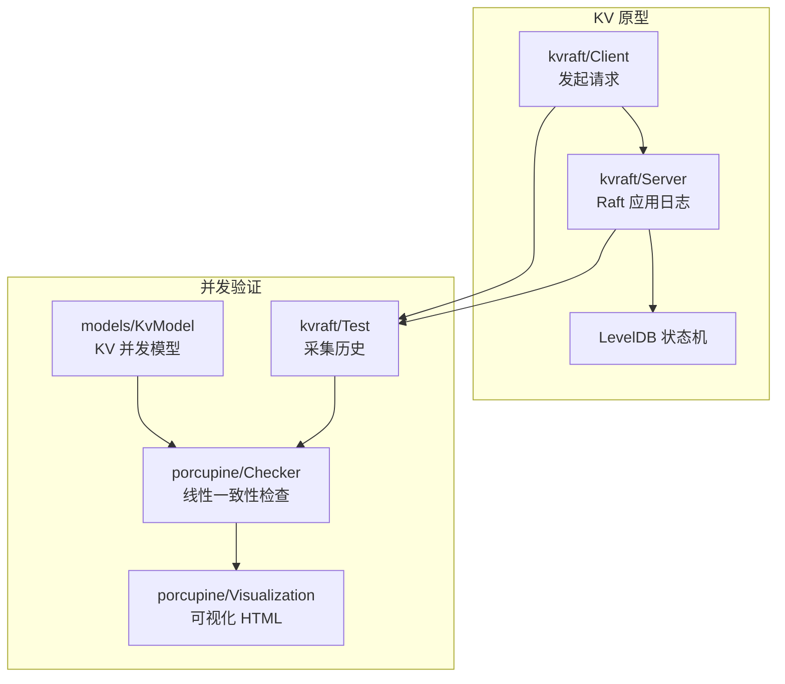
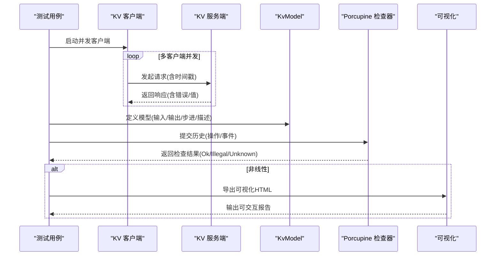
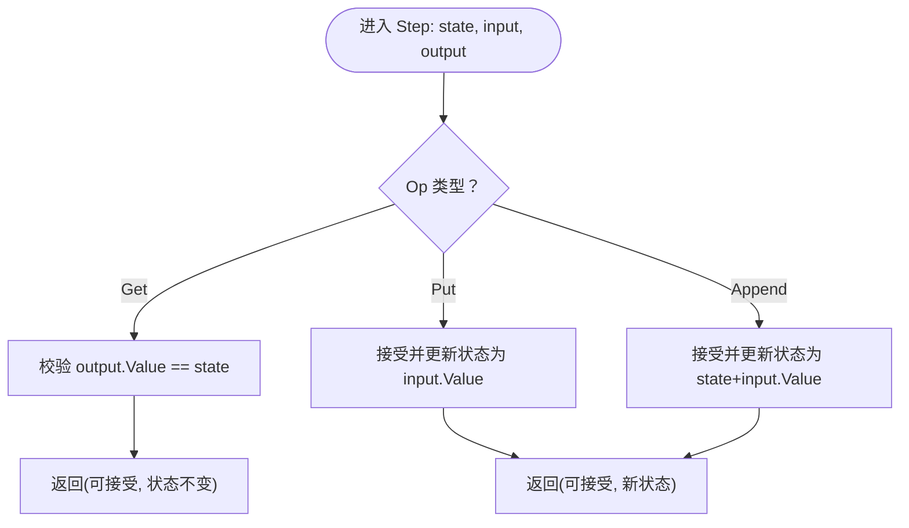
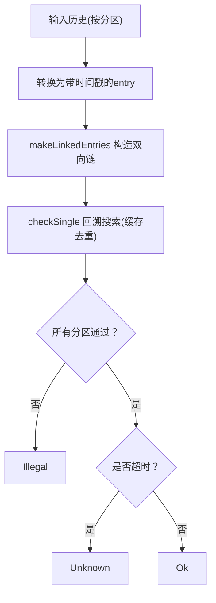
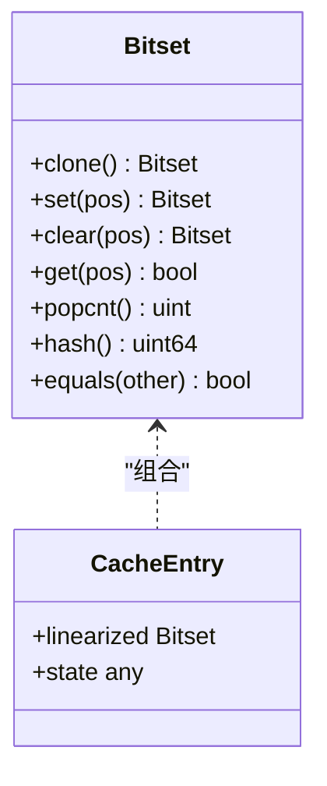
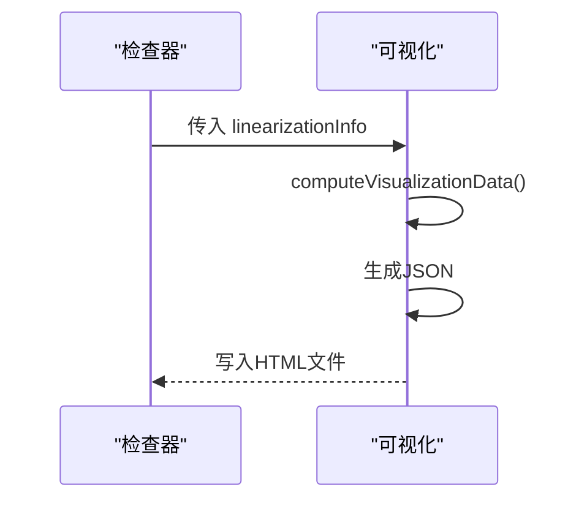
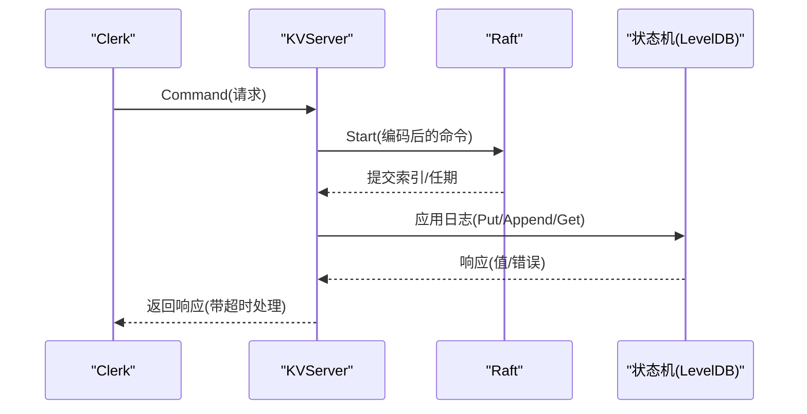
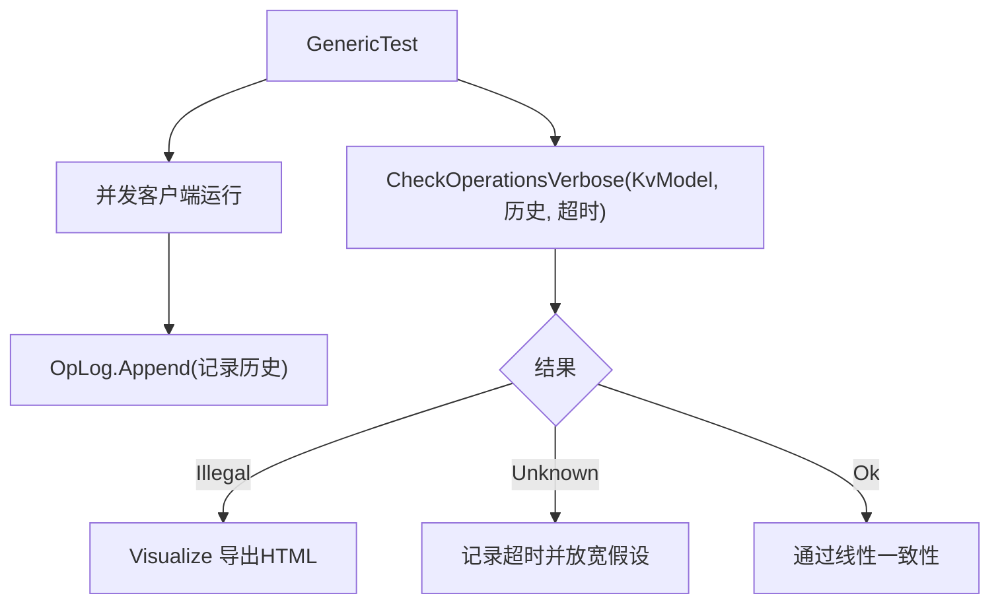
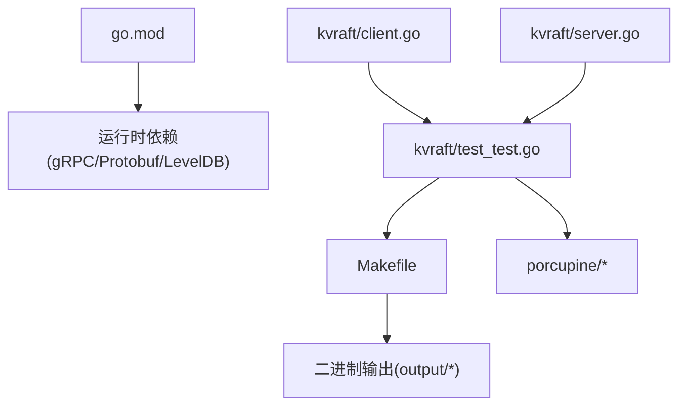

# 并发验证

**本文引用的文件**
- [models/kv.go](file://models/kv.go)
- [porcupine/model.go](file://porcupine/model.go)
- [porcupine/checker.go](file://porcupine/checker.go)
- [porcupine/porcupine.go](file://porcupine/porcupine.go)
- [porcupine/bitset.go](file://porcupine/bitset.go)
- [porcupine/visualization.go](file://porcupine/visualization.go)
- [kvraft/client.go](file://kvraft/client.go)
- [kvraft/server.go](file://kvraft/server.go)
- [kvraft/common.go](file://kvraft/common.go)
- [kvraft/test_test.go](file://kvraft/test_test.go)
- [go.mod](file://go.mod)
- [Makefile](file://Makefile)
- [README.md](file://README.md)

## 目录
1. [简介](#简介)
2. [项目结构](#项目结构)
3. [核心组件](#核心组件)
4. [架构总览](#架构总览)
5. [详细组件分析](#详细组件分析)
6. [依赖关系分析](#依赖关系分析)
7. [性能考量](#性能考量)
8. [故障排查指南](#故障排查指南)
9. [结论](#结论)
10. [附录](#附录)

## 简介
本文件面向 eRaft 的并发验证系统，系统性阐述基于线性一致性（Linearizability）的并发正确性验证方法论与实现。内容覆盖：
- 并发正确性验证的理论基础与线性一致性语义
- 状态空间探索与模型检查流程（基于事件/操作历史）
- KV 并发模型设计与冲突检测机制
- 并发验证工具的安装配置、验证规则定义与结果可视化
- 并发缺陷发现与修复最佳实践（竞态、死锁、内存一致性）
- 在分布式系统中的应用与局限性
- 持续集成中的集成策略

## 项目结构
eRaft 将并发验证能力内置于独立模块 porcupine，并通过 kvraft 测试用例采集客户端-服务端交互的历史，驱动线性一致性检查。

图示来源
- [kvraft/client.go](file://kvraft/client.go#L121-L143)
- [kvraft/server.go](file://kvraft/server.go#L102-L139)
- [models/kv.go](file://models/kv.go#L20-L72)
- [porcupine/checker.go](file://porcupine/checker.go#L360-L368)
- [porcupine/visualization.go](file://porcupine/visualization.go#L89-L109)

章节来源
- [README.md](file://README.md#L1-L139)
- [Makefile](file://Makefile#L29-L36)

## 核心组件
- KV 并发模型（KvModel）：定义输入/输出类型、初始状态、步进函数与描述函数，用于判定历史是否满足线性一致性。
- 线性一致性检查器（Checker）：将操作历史转换为事件序列，按键分区并行检查，支持超时与部分线性化信息返回。
- 可视化模块（Visualization）：将检查结果转为 JSON 并渲染为 HTML，便于定位非法步骤与最长合法前缀。
- KV 客户端与服务端：提供真实并发场景下的调用/返回时间戳与响应，作为历史输入。
- 测试框架（kvraft/test_test.go）：封装并发测试、历史采集、线性一致性检查与可视化落盘。

章节来源
- [models/kv.go](file://models/kv.go#L10-L72)
- [porcupine/model.go](file://porcupine/model.go#L27-L49)
- [porcupine/checker.go](file://porcupine/checker.go#L269-L348)
- [porcupine/visualization.go](file://porcupine/visualization.go#L33-L109)
- [kvraft/client.go](file://kvraft/client.go#L121-L143)
- [kvraft/server.go](file://kvraft/server.go#L102-L139)
- [kvraft/test_test.go](file://kvraft/test_test.go#L24-L41)
- [kvraft/test_test.go](file://kvraft/test_test.go#L366-L382)

## 架构总览
并发验证流水线从 KV 客户端/服务端运行时采集历史，经模型与检查器并行分区验证，最终生成可视化报告。

图示来源
- [kvraft/test_test.go](file://kvraft/test_test.go#L44-L92)
- [models/kv.go](file://models/kv.go#L20-L72)
- [porcupine/checker.go](file://porcupine/checker.go#L360-L368)
- [porcupine/visualization.go](file://porcupine/visualization.go#L89-L109)

## 详细组件分析

### KV 并发模型（KvModel）
- 输入/输出建模：KvInput(Op/Key/Value)，KvOutput(Value)；区分 Get/Put/Append 三类操作。
- 初始状态：单键值字符串；通过按键分区，保证每个分区内部线性一致。
- 步进函数（Step）：对 Get/Put/Append 执行语义校验，返回是否可接受与新状态。
- 描述函数：将输入/输出映射为可读字符串，辅助可视化与调试。
- 分区函数（Partition）：按 Key 将历史拆分为多个子历史，分别检查。

图示来源
- [models/kv.go](file://models/kv.go#L43-L56)

章节来源
- [models/kv.go](file://models/kv.go#L10-L72)

### 线性一致性检查器（Checker）
- 历史表示：Operation（含 Input/Output/Call/Return/ClientId），或 Event（按调用/返回拆分）。
- 转换与排序：将 Operation 转为带时间戳的 entry 序列，按时间升序排列。
- 并行分区：默认按键分区；每分区独立搜索最长合法前缀，多分区并行加速。
- 搜索策略：回溯树剪枝（缓存已访问的线性化位集与状态等价性），避免重复探索。
- 结果判定：任一分区非法则整体非法；超时返回 Unknown（可能误报）。

图示来源
- [porcupine/checker.go](file://porcupine/checker.go#L43-L55)
- [porcupine/checker.go](file://porcupine/checker.go#L116-L133)
- [porcupine/checker.go](file://porcupine/checker.go#L174-L248)
- [porcupine/checker.go](file://porcupine/checker.go#L269-L348)

章节来源
- [porcupine/model.go](file://porcupine/model.go#L5-L49)
- [porcupine/checker.go](file://porcupine/checker.go#L269-L348)
- [porcupine/porcupine.go](file://porcupine/porcupine.go#L5-L39)

### 缓存与位集（Bitset）
- 位集（bitset）：以位向量记录“哪些事件已被线性化”，支持克隆、哈希、计数与比较。
- 缓存（cacheEntry）：记录“线性化位集”与“当前状态”的组合，用于去重，避免重复状态空间探索。

图示来源
- [porcupine/bitset.go](file://porcupine/bitset.go#L5-L73)
- [porcupine/checker.go](file://porcupine/checker.go#L135-L147)

章节来源
- [porcupine/bitset.go](file://porcupine/bitset.go#L10-L73)
- [porcupine/checker.go](file://porcupine/checker.go#L135-L147)

### 可视化与报告（Visualization）
- 数据转换：将线性化信息与历史事件映射为 JSON，包含每个分区的历史矩形、部分线性化序列与最大线性化索引。
- HTML 渲染：提供交互式 SVG 图，展示调用-返回时间线、有效/无效线性化路径、悬停提示与“跳转到首个错误”功能。

图示来源
- [porcupine/visualization.go](file://porcupine/visualization.go#L33-L109)

章节来源
- [porcupine/visualization.go](file://porcupine/visualization.go#L89-L109)
- [porcupine/visualization.go](file://porcupine/visualization.go#L291-L898)

### KV 客户端与服务端（并发历史采集）
- 客户端：记录每次请求的开始/结束时间戳，构造 Operation；通过 gRPC 或 labrpc 访问服务端。
- 服务端：在 Raft 日志提交后应用到状态机，按索引通知对应客户端通道；并发处理多请求，确保线性一致性。

图示来源
- [kvraft/client.go](file://kvraft/client.go#L121-L143)
- [kvraft/server.go](file://kvraft/server.go#L102-L139)
- [kvraft/server.go](file://kvraft/server.go#L177-L236)

章节来源
- [kvraft/client.go](file://kvraft/client.go#L89-L143)
- [kvraft/server.go](file://kvraft/server.go#L102-L139)
- [kvraft/common.go](file://kvraft/common.go#L9-L92)

### 测试与验证（kvraft/test_test.go）
- 历史采集：OpLog 以互斥保护记录所有 Operation（含 Call/Return 时间戳与客户端标识）。
- 并发测试：多客户端并发 Put/Append/Get，模拟网络分区、崩溃与不可靠网络。
- 线性一致性检查：调用 Porcupine 接口，超时时间内判定 Ok/Illegal/Unknown；非法时导出可视化报告。

图示来源
- [kvraft/test_test.go](file://kvraft/test_test.go#L24-L41)
- [kvraft/test_test.go](file://kvraft/test_test.go#L44-L92)
- [kvraft/test_test.go](file://kvraft/test_test.go#L366-L382)

章节来源
- [kvraft/test_test.go](file://kvraft/test_test.go#L209-L385)

## 依赖关系分析
- 运行时依赖：gRPC、Protobuf、LevelDB。
- 构建与测试：Makefile 提供一键编译；测试覆盖 raft、kvraft、shardctrler、shardkv。
- 并发验证模块：独立于业务逻辑，仅依赖标准库与 Go 工具链。

图示来源
- [go.mod](file://go.mod#L7-L21)
- [Makefile](file://Makefile#L29-L36)
- [kvraft/test_test.go](file://kvraft/test_test.go#L14-L15)

章节来源
- [go.mod](file://go.mod#L1-L22)
- [Makefile](file://Makefile#L29-L36)

## 性能考量
- 并行分区：按键分区并行检查，显著提升大规模并发历史的验证速度。
- 剪枝优化：通过位集与状态等价性缓存减少重复探索，降低指数级复杂度。
- 超时控制：允许设置超时，避免长时间阻塞；超时返回 Unknown（可能误报），需结合业务容忍度使用。
- I/O 与序列化：历史采集与可视化 JSON 生成存在开销，建议在 CI 中按需启用。

## 故障排查指南
- 非线性历史（Illegal）：导出可视化 HTML，定位首个非法步骤与最长合法前缀；优先检查服务端状态机 Apply 顺序与重复请求去重逻辑。
- 超时（Unknown）：适当增大超时或缩小并发规模；确认客户端/服务端时间戳采集是否准确。
- 竞态与死锁：关注客户端/服务端锁粒度与持有时间；确保通知通道及时释放，避免内存泄漏。
- 内存一致性：确认并发读写共享状态的可见性；避免因缓存导致的过期值读取。

章节来源
- [kvraft/server.go](file://kvraft/server.go#L177-L236)
- [kvraft/server.go](file://kvraft/server.go#L281-L290)
- [kvraft/test_test.go](file://kvraft/test_test.go#L366-L382)

## 结论
eRaft 的并发验证体系以线性一致性为核心，结合 KV 并发模型、并行检查与可视化报告，形成从采集到诊断的完整闭环。该方案适用于分布式系统的关键路径验证，尤其在强一致性要求的场景中具有高价值。实践中需平衡性能与准确性，合理设置超时与分区策略，并将验证集成至持续集成流程以尽早发现并发缺陷。

## 附录

### 安装与运行
- 构建：执行构建命令生成所有二进制。
- 运行：参考项目自述文件中的快速入门与集群监控说明。

章节来源
- [README.md](file://README.md#L43-L128)
- [Makefile](file://Makefile#L29-L36)

### 验证规则定义与使用
- 定义模型：在 KvModel 中指定 Partition/Init/Step/DescribeOperation/DescribeState。
- 采集历史：在测试中记录 Operation（含 Call/Return 时间戳与客户端标识）。
- 执行检查：调用 CheckOperationsVerbose 并设置超时；非法时导出可视化报告。

章节来源
- [models/kv.go](file://models/kv.go#L20-L72)
- [kvraft/test_test.go](file://kvraft/test_test.go#L44-L92)
- [porcupine/porcupine.go](file://porcupine/porcupine.go#L19-L21)
- [porcupine/visualization.go](file://porcupine/visualization.go#L102-L109)

### 集成到持续集成
- 在 CI 中添加测试阶段，运行 kvraft 并发测试，收集历史并进行线性一致性检查。
- 对非法历史自动导出可视化报告，便于审阅与回归。
- 对 Unknown（超时）结果设置告警阈值，避免忽略潜在问题。

章节来源
- [kvraft/test_test.go](file://kvraft/test_test.go#L366-L382)
- [Makefile](file://Makefile#L46-L49)