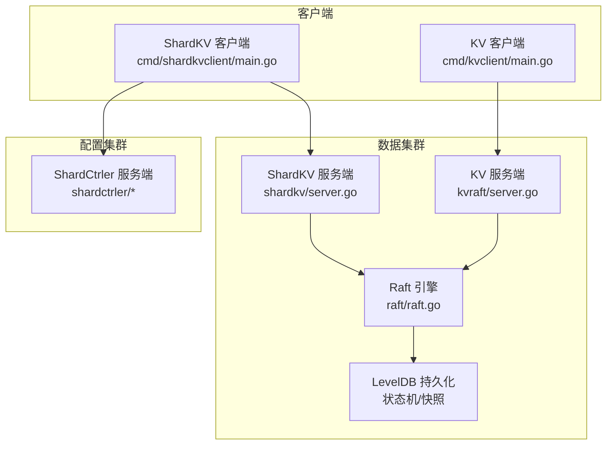
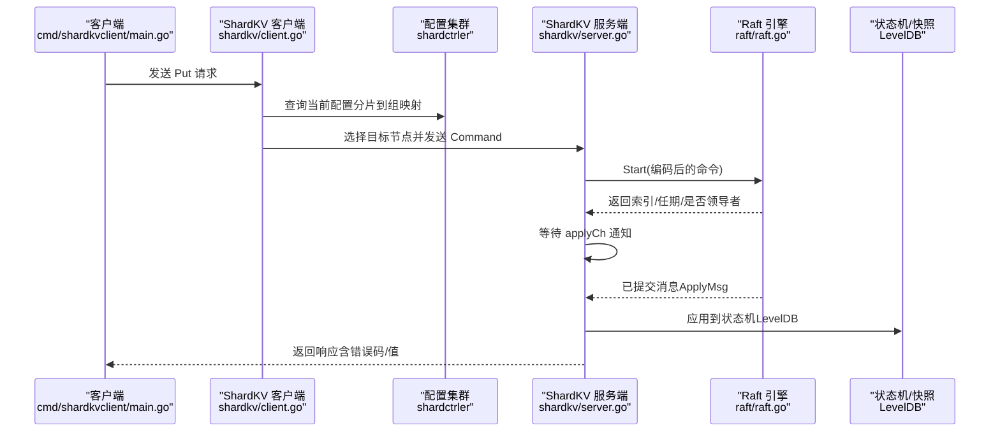
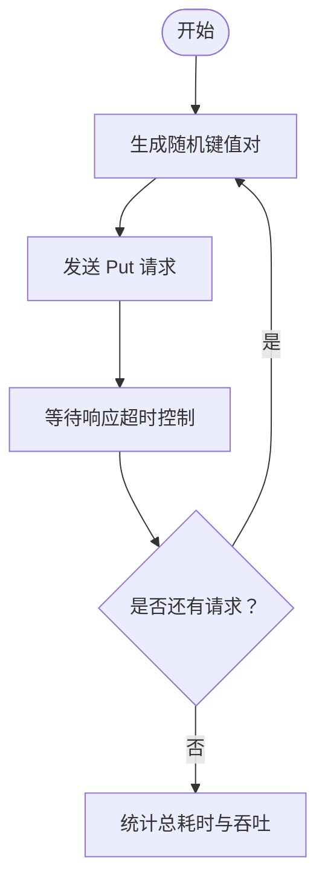
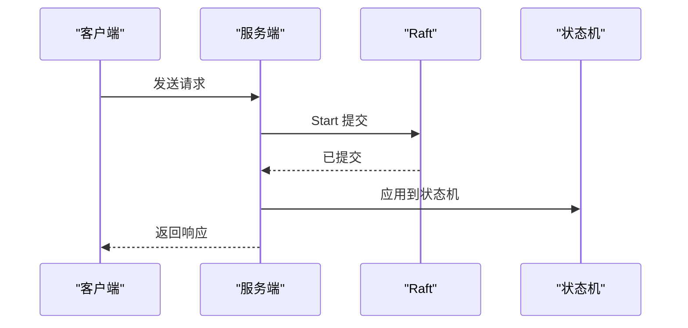
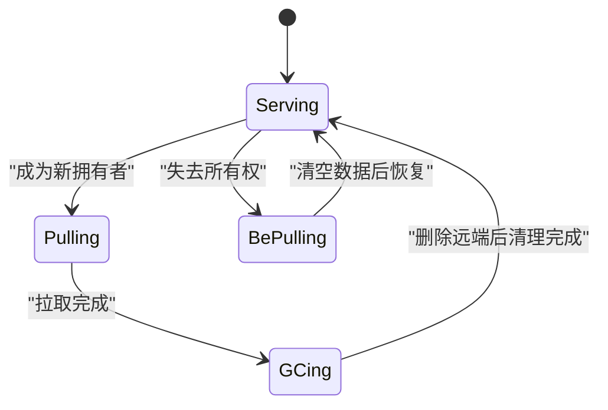
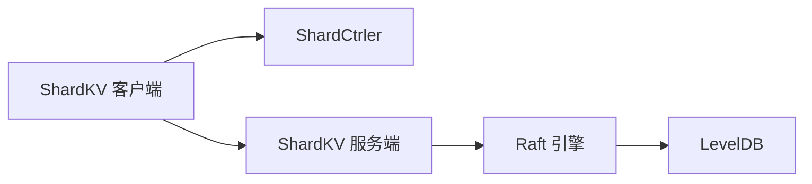

# 性能基准测试

<cite>
**本文引用的文件**
- [README.md](file://README.md)
- [Benchmark.md](file://wiki/Benchmark.md)
- [cmd/shardkvclient/main.go](file://cmd/shardkvclient/main.go)
- [shardkv/client.go](file://shardkv/client.go)
- [shardkv/server.go](file://shardkv/server.go)
- [shardkv/common.go](file://shardkv/common.go)
- [kvraft/client.go](file://kvraft/client.go)
- [kvraft/server.go](file://kvraft/server.go)
- [kvraft/common.go](file://kvraft/common.go)
- [raft/raft.go](file://raft/raft.go)
- [raft/config.go](file://raft/config.go)
- [shardctrler/config.go](file://shardctrler/config.go)
</cite>

## 目录
1. [简介](#简介)
2. [项目结构](#项目结构)
3. [核心组件](#核心组件)
4. [架构总览](#架构总览)
5. [详细组件分析](#详细组件分析)
6. [依赖关系分析](#依赖关系分析)
7. [性能考量与优化建议](#性能考量与优化建议)
8. [故障排查指南](#故障排查指南)
9. [结论](#结论)
10. [附录：测试流程与实践](#附录测试流程与实践)

## 简介
本文件面向 eRaft 的性能基准测试，系统性阐述测试设计原则、指标定义、环境要求与实施方法，并覆盖吞吐量、延迟与资源利用率三类测试；同时提供工具使用、数据生成、结果分析技巧，以及针对 CPU、内存、网络 I/O 的瓶颈识别与优化建议。文档还给出不同规模集群的测试策略、压力与稳定性测试方法，以及建立性能基线与回归测试流程的最佳实践。

## 项目结构
eRaft 是一个基于 Raft 的分布式分片键值存储系统，包含以下关键模块：
- 配置协调器（ShardCtrler）：负责分片到组的映射管理与动态变更
- 分片键值服务（ShardKV）：按分片提供读写能力，支持迁移与垃圾回收
- 单机键值服务（KVServer）：用于单集群场景下的对比与验证
- Raft 共识引擎：提供日志复制、领导者选举与快照机制
- gRPC 传输层：跨节点与客户端通信
- LevelDB 存储：持久化状态机与 Raft 日志

图示来源
- [cmd/shardkvclient/main.go](file://cmd/shardkvclient/main.go#L1-L106)
- [shardkv/server.go](file://shardkv/server.go#L759-L799)
- [kvraft/server.go](file://kvraft/server.go#L318-L341)
- [raft/raft.go](file://raft/raft.go#L37-L60)

章节来源
- [README.md](file://README.md#L1-L139)

## 核心组件
- 基准测试工具
  - ShardKV 客户端内置 bench 命令，用于生成随机键并顺序发送 Put 请求，统计总耗时与平均吞吐（req/s）
- 客户端与服务端交互
  - 客户端通过 gRPC 调用服务端接口；ShardKV 客户端会先查询配置集群以确定目标分片与所在组，再向对应组的节点发起请求
- Raft 与状态机
  - 服务端将命令提交到 Raft，由 Raft 决定提交索引；应用线程从 applyCh 取出已提交条目，应用到状态机（LevelDB），并通过通知通道返回给等待的客户端
- 快照与日志裁剪
  - 当 Raft 状态大小达到阈值时触发快照，减少日志长度，降低恢复成本

章节来源
- [Benchmark.md](file://wiki/Benchmark.md#L1-L26)
- [cmd/shardkvclient/main.go](file://cmd/shardkvclient/main.go#L67-L95)
- [shardkv/client.go](file://shardkv/client.go#L206-L265)
- [shardkv/server.go](file://shardkv/server.go#L129-L157)
- [kvraft/server.go](file://kvraft/server.go#L102-L139)

## 架构总览
下图展示一次写入请求在 eRaft 中的关键路径与性能相关点：

图示来源
- [cmd/shardkvclient/main.go](file://cmd/shardkvclient/main.go#L77-L91)
- [shardkv/client.go](file://shardkv/client.go#L206-L265)
- [shardkv/server.go](file://shardkv/server.go#L129-L157)
- [raft/raft.go](file://raft/raft.go#L108-L116)

## 详细组件分析

### 吞吐量测试（Write Throughput）
- 测试目标
  - 在固定时间内尽可能多地完成写入操作，评估系统在不同规模集群下的写入能力
- 测试工具与流程
  - 使用内置 bench 命令生成随机键并顺序发送 Put 请求，记录总耗时与吞吐（req/s）
  - 关键参数：请求总数、客户端并发度（可扩展）、网络与磁盘条件
- 数据生成策略
  - 随机首字母分布于 a-z，确保请求均匀分布在所有分片与组中，避免热点
- 指标采集
  - 总耗时、平均吞吐（req/s）、成功/失败计数、错误类型分布
- 影响因素
  - Raft 提交延迟、状态机写入（LevelDB）、网络往返时间、分片迁移与 GC 的阶段性开销

图示来源
- [cmd/shardkvclient/main.go](file://cmd/shardkvclient/main.go#L77-L91)
- [shardkv/common.go](file://shardkv/common.go#L21-L27)

章节来源
- [Benchmark.md](file://wiki/Benchmark.md#L8-L16)
- [cmd/shardkvclient/main.go](file://cmd/shardkvclient/main.go#L67-L95)

### 延迟测试（Latency）
- 测量对象
  - 端到端延迟（P50/P95/P99）、提交延迟（从提交到应用）、状态机写入延迟
- 方法
  - 在 bench 命令中增加每请求的计时，分别统计发送时刻与收到响应时刻
  - 对不同分片/组进行分桶统计，观察是否存在显著差异
- 关键路径延迟点
  - 客户端重试与领导者切换、Raft 复制与提交、状态机应用与通知

图示来源
- [shardkv/server.go](file://shardkv/server.go#L129-L157)
- [kvraft/server.go](file://kvraft/server.go#L102-L139)

章节来源
- [shardkv/common.go](file://shardkv/common.go#L21-L27)
- [kvraft/common.go](file://kvraft/common.go#L9)

### 资源利用率测试（CPU/内存/网络）
- CPU 使用率
  - 观察领导者与跟随者在高负载下的 CPU 占用，区分日志复制、状态机应用与快照开销
- 内存占用
  - 记录状态机大小（LevelDB 目录大小）、Raft 状态大小、通知通道与去重表规模
- 网络 I/O
  - 统计 gRPC 请求/响应字节数、RPC 次数与连接数，关注分片迁移阶段的批量数据传输

章节来源
- [shardkv/server.go](file://shardkv/server.go#L105-L108)
- [kvraft/server.go](file://kvraft/server.go#L171-L174)
- [raft/raft.go](file://raft/raft.go#L76-L80)

### 分片迁移与 GC 对性能的影响
- 迁移阶段
  - Pulling → GCing 的状态转换涉及远程拉取与本地插入，可能带来短暂延迟与带宽占用
- GC 阶段
  - 删除远端过期分片，需确保一致性与幂等性
- 监控与控制
  - 通过配置监控、迁移监控与 GC 监控周期，平衡吞吐与一致性

图示来源
- [shardkv/server.go](file://shardkv/server.go#L430-L445)
- [shardkv/server.go](file://shardkv/server.go#L572-L643)
- [shardkv/server.go](file://shardkv/server.go#L645-L696)

章节来源
- [shardkv/server.go](file://shardkv/server.go#L549-L570)
- [shardkv/common.go](file://shardkv/common.go#L21-L27)

## 依赖关系分析
- 客户端到服务端
  - ShardKV 客户端依赖配置集群查询分片归属，再向对应组的节点发起请求
- 服务端到共识
  - 服务端通过 Raft.Start 提交命令，应用线程从 applyCh 获取已提交消息并应用到状态机
- 状态机与持久化
  - LevelDB 作为状态机，Raft 提供快照与日志裁剪，降低恢复成本

图示来源
- [shardkv/client.go](file://shardkv/client.go#L206-L265)
- [shardkv/server.go](file://shardkv/server.go#L129-L157)
- [raft/raft.go](file://raft/raft.go#L37-L60)

章节来源
- [shardkv/client.go](file://shardkv/client.go#L151-L188)
- [shardkv/server.go](file://shardkv/server.go#L318-L341)

## 性能考量与优化建议

### CPU 使用率分析
- 识别热点
  - 高频率的领导者选举或心跳超时可能导致 CPU 抖动
  - 应用线程阻塞在状态机写入或快照序列化上
- 优化建议
  - 调整 Raft 超时参数与心跳间隔，避免频繁重选
  - 批量化状态机写入（如批量写入 LevelDB），减少系统调用次数
  - 将非关键路径异步化，降低主路径阻塞

### 内存泄漏检测
- 关注点
  - 通知通道 map 与 lastOperations 映射随时间增长
  - 快照与日志裁剪是否及时生效
- 检测手段
  - 定期采样内存指标，观察增长趋势
  - 对比快照前后状态机大小与 Raft 状态大小

章节来源
- [shardkv/server.go](file://shardkv/server.go#L281-L290)
- [shardkv/server.go](file://shardkv/server.go#L463-L465)
- [kvraft/server.go](file://kvraft/server.go#L281-L290)
- [kvraft/server.go](file://kvraft/server.go#L238-L240)

### 网络 I/O 优化
- gRPC 与连接复用
  - 客户端与服务端共享连接可降低握手开销
- 批量与压缩
  - 在允许范围内启用压缩，减少传输体积
- 负载均衡
  - 客户端轮询领导者，避免单点过载

章节来源
- [shardkv/client.go](file://shardkv/client.go#L215-L230)
- [shardkv/server.go](file://shardkv/server.go#L589-L642)

### 不同规模集群的测试策略
- 小型集群（1 组 × 3 节点）
  - 主要验证一致性与基础吞吐
- 中型集群（2 组 × 3 节点）
  - 观察跨组写入与配置变更影响
- 大型集群（≥3 组 × 3 节点）
  - 关注分片迁移与 GC 的阶段性延迟，评估整体吞吐与尾延迟

章节来源
- [README.md](file://README.md#L51-L98)

### 压力与稳定性测试
- 压力测试
  - 逐步提升并发与请求速率，观察吞吐与延迟拐点
- 稳定性测试
  - 长时间运行（如 10 分钟以上），监控错误率、重启次数与日志堆积
- 故障注入
  - 模拟网络分区、节点宕机与磁盘只读，评估恢复时间与数据一致性

章节来源
- [raft/config.go](file://raft/config.go#L339-L363)
- [shardctrler/config.go](file://shardctrler/config.go#L339-L363)

### 性能基线与回归测试
- 建立基线
  - 在标准硬件与网络条件下，记录不同规模集群的吞吐、延迟与资源占用基线
- 回归测试
  - 将每次改动前后的指标与基线对比，若偏离超出阈值则阻断发布
- 自动化
  - 将 bench 流程集成到 CI，定期执行并生成报告

章节来源
- [Benchmark.md](file://wiki/Benchmark.md#L18-L26)

## 故障排查指南
- 常见问题
  - 错误类型：ErrWrongGroup、ErrWrongLeader、ErrTimeout、ErrOutDated
  - 现象：客户端频繁重试、延迟升高、吞吐骤降
- 排查步骤
  - 检查配置集群状态与分片映射是否正确
  - 查看服务端日志与状态（GetStatus）确认领导者身份与提交进度
  - 关注快照与日志裁剪是否按预期触发
- 工具与接口
  - 使用 status 命令查看节点角色、任期、已提交与应用进度、存储大小

章节来源
- [shardkv/client.go](file://shardkv/client.go#L267-L309)
- [shardkv/server.go](file://shardkv/server.go#L105-L108)
- [kvraft/client.go](file://kvraft/client.go#L100-L113)
- [kvraft/server.go](file://kvraft/server.go#L171-L174)

## 结论
eRaft 的性能基准测试应围绕吞吐、延迟与资源利用率三大维度展开，结合内置 bench 工具与状态查询接口，形成可重复、可量化的测试方案。通过分层剖析客户端、服务端、Raft 与状态机的协作路径，定位瓶颈并针对性优化，可在保证一致性前提下持续提升系统性能。建议建立稳定的基线与回归流程，确保版本演进中的性能可控。

## 附录：测试流程与实践

### 吞吐量测试（ShardKV）
- 步骤
  - 启动配置集群与数据集群
  - 使用 bench 命令指定请求总数，观察输出的总耗时与吞吐
- 注意事项
  - 随机键分布确保跨分片与跨组均匀
  - 控制客户端超时，避免因网络抖动导致误判

章节来源
- [README.md](file://README.md#L114-L116)
- [Benchmark.md](file://wiki/Benchmark.md#L8-L16)
- [cmd/shardkvclient/main.go](file://cmd/shardkvclient/main.go#L77-L91)

### 延迟测量（端到端）
- 方法
  - 在客户端侧记录发送时间，在收到响应后计算延迟，按分位统计
- 关注点
  - 领导者切换与配置变更期间的尖峰延迟
  - 分片迁移阶段的阶段性延迟

章节来源
- [shardkv/client.go](file://shardkv/client.go#L206-L265)
- [shardkv/common.go](file://shardkv/common.go#L21-L27)

### 资源监控（CPU/内存/网络）
- 指标采集
  - CPU 使用率、内存 RSS、磁盘 I/O、网络字节统计
- 采样频率
  - 每秒采样，长测程（10 分钟以上）记录峰值与均值

章节来源
- [shardkv/server.go](file://shardkv/server.go#L105-L108)
- [kvraft/server.go](file://kvraft/server.go#L171-L174)

### 快照与日志裁剪验证
- 触发条件
  - 当 Raft 状态大小达到阈值时自动触发快照
- 效果观测
  - 提升恢复速度、降低日志长度与磁盘占用

章节来源
- [shardkv/server.go](file://shardkv/server.go#L463-L465)
- [shardkv/server.go](file://shardkv/server.go#L238-L240)
- [kvraft/server.go](file://kvraft/server.go#L238-L240)