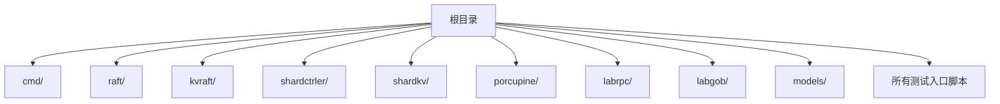
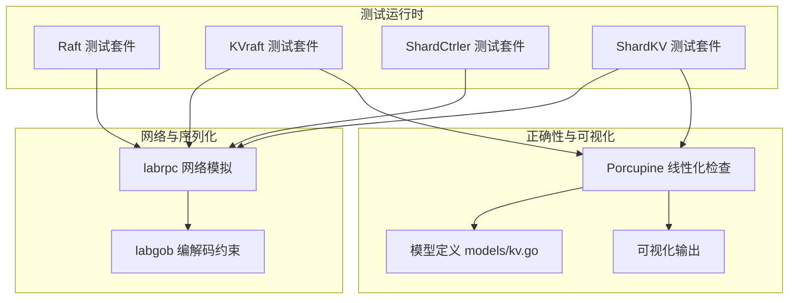
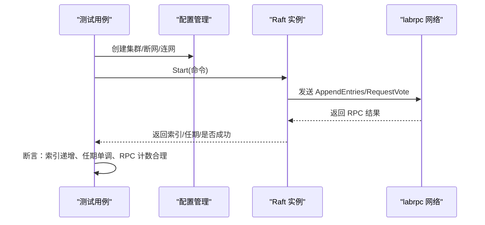
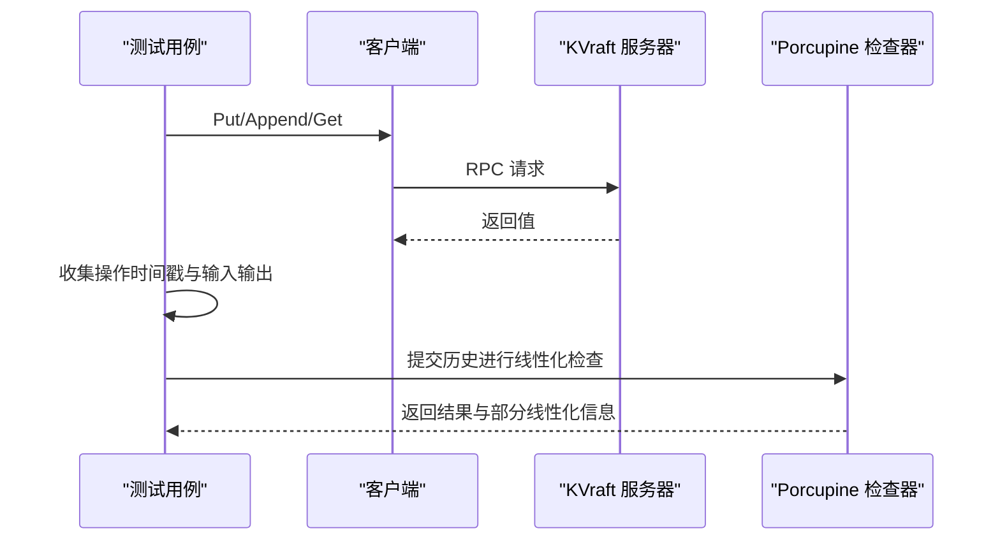
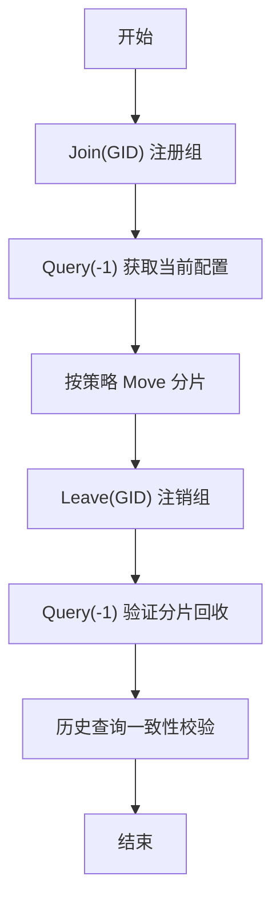
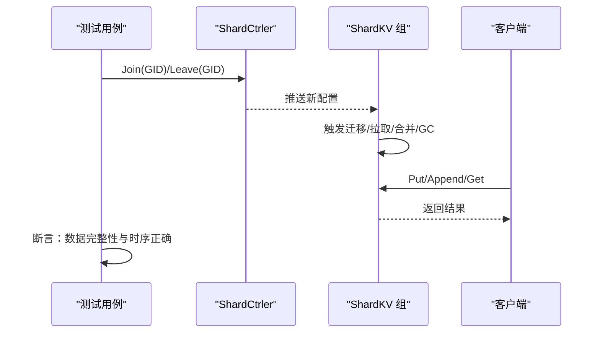
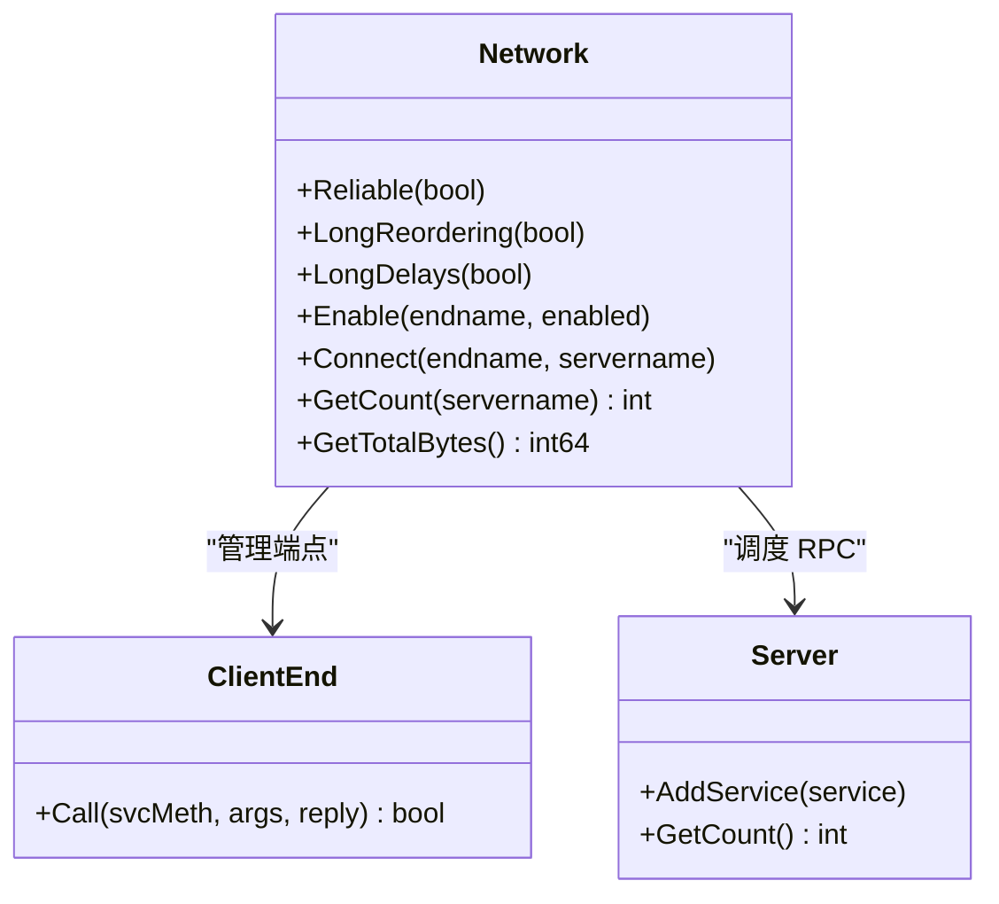
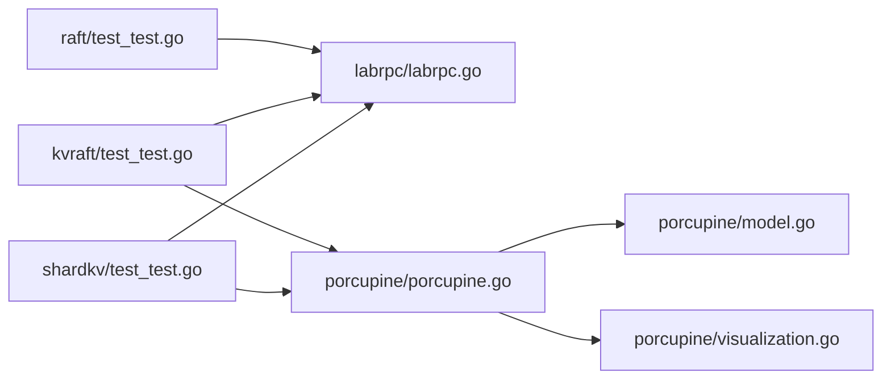
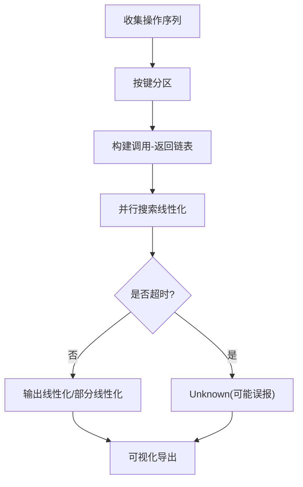

# 测试框架

<cite>
**本文引用的文件**
- [README.md](file://README.md)
- [all-test.sh](file://all-test.sh)
- [raft/test_test.go](file://raft/test_test.go)
- [kvraft/test_test.go](file://kvraft/test_test.go)
- [shardkv/test_test.go](file://shardkv/test_test.go)
- [shardctrler/test_test.go](file://shardctrler/test_test.go)
- [porcupine/porcupine.go](file://porcupine/porcupine.go)
- [porcupine/checker.go](file://porcupine/checker.go)
- [porcupine/model.go](file://porcupine/model.go)
- [porcupine/visualization.go](file://porcupine/visualization.go)
- [porcupine/bitset.go](file://porcupine/bitset.go)
- [models/kv.go](file://models/kv.go)
- [labrpc/labrpc.go](file://labrpc/labrpc.go)
- [labgob/labgob.go](file://labgob/labgob.go)
- [labrpc/test_test.go](file://labrpc/test_test.go)
- [go.mod](file://go.mod)
</cite>

## 目录
1. [简介](#简介)
2. [项目结构](#项目结构)
3. [核心组件](#核心组件)
4. [架构总览](#架构总览)
5. [详细组件分析](#详细组件分析)
6. [依赖关系分析](#依赖关系分析)
7. [性能与稳定性测试](#性能与稳定性测试)
8. [并发正确性验证](#并发正确性验证)
9. [测试环境搭建与数据准备](#测试环境搭建与数据准备)
10. [测试结果分析与可视化](#测试结果分析与可视化)
11. [故障排查指南](#故障排查指南)
12. [结论](#结论)

## 简介
本文件系统化梳理 eRaft 的测试框架，覆盖单元测试、集成测试、并发正确性验证、线性一致性（线性化）检查、性能与稳定性测试、测试环境搭建、测试数据准备、结果分析与可视化、以及常见问题排查。目标是帮助开发者高效编写高质量测试，确保 Raft、KV、分片控制与分片存储等模块在复杂网络与并发场景下的正确性与鲁棒性。

## 项目结构
仓库采用按功能域划分的模块化组织方式，测试集中在各子模块目录中，并辅以通用的并发正确性检查工具（Porcupine）与网络模拟层（labrpc/labgob）。顶层脚本提供批量执行测试的能力。

图示来源
- [README.md](file://README.md#L1-L139)
- [all-test.sh](file://all-test.sh#L1-L8)

章节来源
- [README.md](file://README.md#L1-L139)
- [all-test.sh](file://all-test.sh#L1-L8)

## 核心组件
- Raft 模块测试：覆盖选举、日志复制、持久化、网络分区与恢复、可靠性与不可靠网络下的共识正确性。
- KVraft 模块测试：覆盖单键/多键操作、并发客户端、快照与重启、线性一致性检查。
- 分片控制器（ShardCtrler）测试：覆盖组加入/离开、迁移最小化、并发配置变更、历史配置查询。
- 分片存储（ShardKV）测试：覆盖静态分片、动态迁移、并发写入与配置变更、快照与崩溃恢复。
- 并发正确性检查（Porcupine）：线性化检查、分区模型、可视化工具。
- 网络模拟（labrpc）：可靠/不可靠网络、延迟、丢包、重排、连接断开与统计。
- 编码约束（labgob）：强制字段大写，避免 RPC 序列化错误。

章节来源
- [raft/test_test.go](file://raft/test_test.go#L1-L1085)
- [kvraft/test_test.go](file://kvraft/test_test.go#L1-L716)
- [shardctrler/test_test.go](file://shardctrler/test_test.go#L1-L381)
- [shardkv/test_test.go](file://shardkv/test_test.go#L1-L942)
- [porcupine/porcupine.go](file://porcupine/porcupine.go#L1-L40)
- [porcupine/checker.go](file://porcupine/checker.go#L1-L369)
- [porcupine/model.go](file://porcupine/model.go#L1-L78)
- [porcupine/visualization.go](file://porcupine/visualization.go#L1-L898)
- [porcupine/bitset.go](file://porcupine/bitset.go#L1-L73)
- [labrpc/labrpc.go](file://labrpc/labrpc.go#L1-L515)
- [labgob/labgob.go](file://labgob/labgob.go#L1-L178)

## 架构总览
测试体系由“被测模块 + 测试用例 + 网络模拟 + 正确性检查 + 可视化”构成，形成从单元到集成再到线性一致性的完整闭环。

图示来源
- [raft/test_test.go](file://raft/test_test.go#L1-L1085)
- [kvraft/test_test.go](file://kvraft/test_test.go#L1-L716)
- [shardkv/test_test.go](file://shardkv/test_test.go#L1-L942)
- [porcupine/porcupine.go](file://porcupine/porcupine.go#L1-L40)
- [porcupine/model.go](file://porcupine/model.go#L1-L78)
- [porcupine/visualization.go](file://porcupine/visualization.go#L1-L898)
- [labrpc/labrpc.go](file://labrpc/labrpc.go#L1-L515)
- [labgob/labgob.go](file://labgob/labgob.go#L1-L178)

## 详细组件分析

### Raft 测试策略与断言
- 初始选举与任期保持：验证无故障情况下领导者稳定、任期单调递增。
- 多轮选举与分区：随机断开节点，验证多数派选举、无多数派时无领导者。
- 并发 Start()：多协程同时提交命令，校验索引顺序与幂等性。
- 落盘与重启：崩溃后重启，确认已提交日志不丢失。
- 不可靠网络：RPC 丢包/延迟/重排，验证达成一致。
- 性能上限：RPC 计数与空闲期 RPC 增量限制。

图示来源
- [raft/test_test.go](file://raft/test_test.go#L1-L1085)
- [labrpc/labrpc.go](file://labrpc/labrpc.go#L1-L515)

章节来源
- [raft/test_test.go](file://raft/test_test.go#L24-L122)
- [raft/test_test.go](file://raft/test_test.go#L265-L364)
- [raft/test_test.go](file://raft/test_test.go#L586-L770)
- [labrpc/labrpc.go](file://labrpc/labrpc.go#L221-L312)

### KVraft 测试策略与线性一致性
- 单客户端/多客户端并发：Put/Append/Get 组合，校验顺序与幂等。
- 不可靠网络与崩溃重启：验证持久化与快照。
- 分区场景：网络分裂下多数派可继续服务，少数派阻塞但最终一致。
- 快照与日志修剪：日志大小与快照大小上限检查。
- 线性一致性检查：使用 Porcupine 对操作序列进行分区线性化验证，支持超时与可视化。

图示来源
- [kvraft/test_test.go](file://kvraft/test_test.go#L1-L716)
- [porcupine/porcupine.go](file://porcupine/porcupine.go#L1-L40)
- [porcupine/checker.go](file://porcupine/checker.go#L360-L369)
- [models/kv.go](file://models/kv.go#L1-L73)

章节来源
- [kvraft/test_test.go](file://kvraft/test_test.go#L209-L385)
- [kvraft/test_test.go](file://kvraft/test_test.go#L387-L418)
- [kvraft/test_test.go](file://kvraft/test_test.go#L593-L715)
- [porcupine/porcupine.go](file://porcupine/porcupine.go#L1-L40)
- [porcupine/checker.go](file://porcupine/checker.go#L360-L369)
- [models/kv.go](file://models/kv.go#L20-L72)

### ShardCtrler 测试策略
- 基本 Join/Leave：验证组注册与分片分配平衡。
- 历史配置查询：对任意历史版本配置的一致性校验。
- Move 迁移：按需移动分片，确保 Num 递增且迁移最小化。
- 并发 Join/Leave：多客户端并发变更，保证最终一致性。

图示来源
- [shardctrler/test_test.go](file://shardctrler/test_test.go#L80-L250)

章节来源
- [shardctrler/test_test.go](file://shardctrler/test_test.go#L80-L250)

### ShardKV 测试策略
- 静态分片：未迁移时数据正确性与可用性。
- 动态迁移：Join/Leave 引发的数据迁移与 GC。
- 并发写入与配置变更：多客户端并发 Append/Put 与配置变更交错。
- 不可靠网络与崩溃：验证迁移过程中的容错与一致性。
- 挑战性测试：强制快照与严格内存控制，验证存储清理效果。

图示来源
- [shardkv/test_test.go](file://shardkv/test_test.go#L1-L942)

章节来源
- [shardkv/test_test.go](file://shardkv/test_test.go#L26-L96)
- [shardkv/test_test.go](file://shardkv/test_test.go#L98-L149)
- [shardkv/test_test.go](file://shardkv/test_test.go#L151-L217)
- [shardkv/test_test.go](file://shardkv/test_test.go#L305-L380)
- [shardkv/test_test.go](file://shardkv/test_test.go#L455-L663)

### 网络模拟与编码约束
- labrpc：支持可靠/不可靠网络、长延迟、消息重排、丢弃请求/回复、连接断开、RPC 统计。
- labgob：强制 RPC 参数/返回值字段首字母大写，避免序列化异常；提供默认值检查警告。

图示来源
- [labrpc/labrpc.go](file://labrpc/labrpc.go#L128-L384)

章节来源
- [labrpc/labrpc.go](file://labrpc/labrpc.go#L1-L515)
- [labgob/labgob.go](file://labgob/labgob.go#L1-L178)
- [labrpc/test_test.go](file://labrpc/test_test.go#L1-L598)

## 依赖关系分析
- 测试依赖 labrpc 提供的网络模拟能力，统一管理端点、服务器、连接与可靠性开关。
- KVraft 与 ShardKV 测试通过 Porcupine 将操作序列转换为线性化检查任务，模型来自 models/kv.go。
- Porcupine 内部使用位集缓存、并行检查与超时控制，支持可视化输出。

图示来源
- [raft/test_test.go](file://raft/test_test.go#L1-L1085)
- [kvraft/test_test.go](file://kvraft/test_test.go#L1-L716)
- [shardkv/test_test.go](file://shardkv/test_test.go#L1-L942)
- [labrpc/labrpc.go](file://labrpc/labrpc.go#L1-L515)
- [porcupine/porcupine.go](file://porcupine/porcupine.go#L1-L40)
- [porcupine/model.go](file://porcupine/model.go#L1-L78)
- [porcupine/visualization.go](file://porcupine/visualization.go#L1-L898)

章节来源
- [go.mod](file://go.mod#L1-L22)

## 性能与稳定性测试
- 性能测试：通过批量 Append 操作测量吞吐与延迟，断言每操作平均耗时不超过心跳间隔阈值。
- 稳定性测试：长时间并发写入 + 配置变更 + 网络分区 + 崩溃重启，验证系统不出现数据丢失或不一致。
- 日志与快照修剪：在快照模式下检查日志大小与快照大小上限，确保资源占用可控。

章节来源
- [kvraft/test_test.go](file://kvraft/test_test.go#L387-L418)
- [kvraft/test_test.go](file://kvraft/test_test.go#L648-L681)
- [shardkv/test_test.go](file://shardkv/test_test.go#L665-L746)

## 并发正确性验证
- 线性化检查：将客户端操作序列按键分区，使用模型 Step 验证每个调用-返回对与状态变迁一致。
- 并行检查：对每个分区并行搜索最长线性化前缀，支持超时与部分线性化信息收集。
- 可视化：生成 HTML 文件展示历史事件、部分线性化与非法扩展，辅助定位问题。

图示来源
- [porcupine/checker.go](file://porcupine/checker.go#L174-L248)
- [porcupine/checker.go](file://porcupine/checker.go#L269-L348)
- [porcupine/visualization.go](file://porcupine/visualization.go#L89-L109)

章节来源
- [porcupine/porcupine.go](file://porcupine/porcupine.go#L1-L40)
- [porcupine/checker.go](file://porcupine/checker.go#L1-L369)
- [porcupine/visualization.go](file://porcupine/visualization.go#L1-L898)
- [porcupine/bitset.go](file://porcupine/bitset.go#L1-L73)
- [models/kv.go](file://models/kv.go#L1-L73)

## 测试环境搭建与数据准备
- 环境要求：Go 工具链与依赖（见 go.mod），确保 grpc/protobuf/zap 等依赖可用。
- 启动方式：使用顶层脚本批量运行各模块测试，或直接 go test 指定目录。
- 数据准备：测试内部通过配置构造器生成客户端、服务器与网络拓扑，无需外部数据文件。

章节来源
- [go.mod](file://go.mod#L1-L22)
- [all-test.sh](file://all-test.sh#L1-L8)

## 测试结果分析与可视化
- 线性化检查结果：Ok/Illegal/Unknown，Unknown 表示超时（可能误报）。
- 可视化输出：生成 HTML 文件，展示每个分区的历史事件、最长线性化与非法扩展，便于人工审查。
- 部分线性化：记录每个事件作为结尾的最长线性化集合，辅助定位冲突点。

章节来源
- [porcupine/porcupine.go](file://porcupine/porcupine.go#L1-L40)
- [porcupine/visualization.go](file://porcupine/visualization.go#L89-L109)
- [porcupine/checker.go](file://porcupine/checker.go#L306-L347)

## 故障排查指南
- RPC 丢包/延迟：启用不可靠网络，观察多数派是否仍能推进提交。
- 客户端端点未启用：Call 返回 false，检查 Enable 状态。
- 字段命名错误：labgob 警告非大写字母字段，可能导致序列化失败。
- 超时与死锁：Porcupine 并行检查支持超时，必要时放宽时限或减少并发。
- 线性化失败：结合可视化 HTML 定位非法扩展，核对模型 Step 与分区函数。

章节来源
- [labrpc/labrpc.go](file://labrpc/labrpc.go#L174-L312)
- [labgob/labgob.go](file://labgob/labgob.go#L70-L177)
- [porcupine/visualization.go](file://porcupine/visualization.go#L1-L898)

## 结论
eRaft 的测试框架通过 labrpc 提供可控的网络环境、Porcupine 提供严格的线性一致性验证、以及覆盖选举、复制、快照、分片迁移等关键路径的测试用例，形成了从单元到集成再到正确性的完整测试闭环。建议在开发过程中优先编写线性化检查用例，配合可视化工具快速定位问题，并在回归阶段引入压力与稳定性测试，确保系统在真实复杂场景下的鲁棒性。