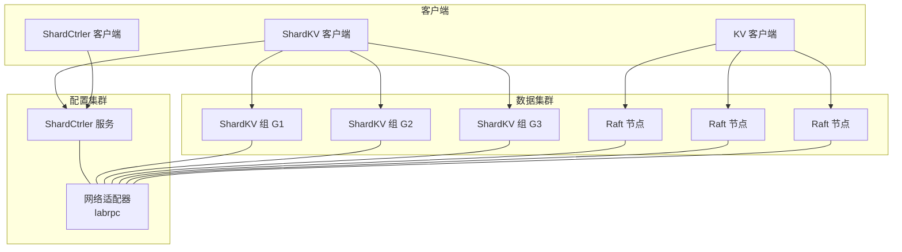
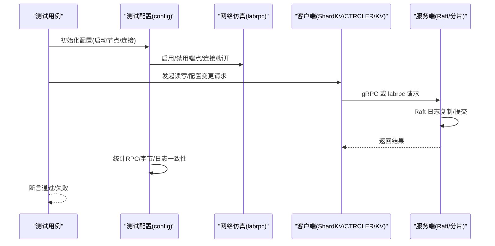
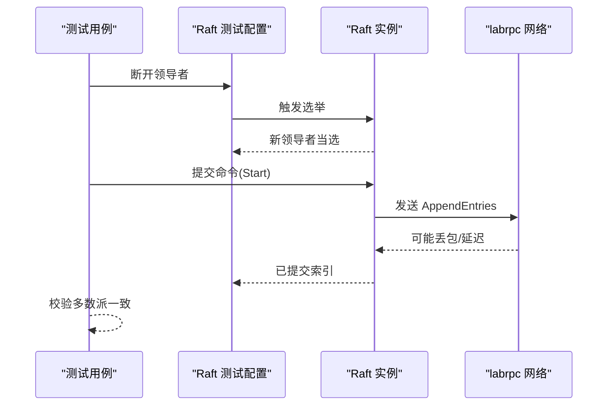
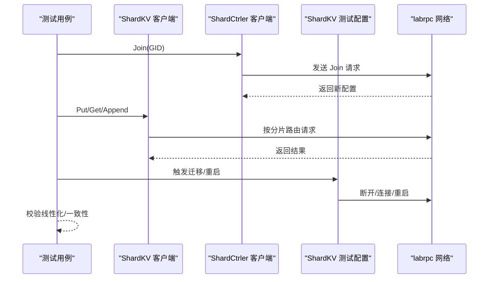
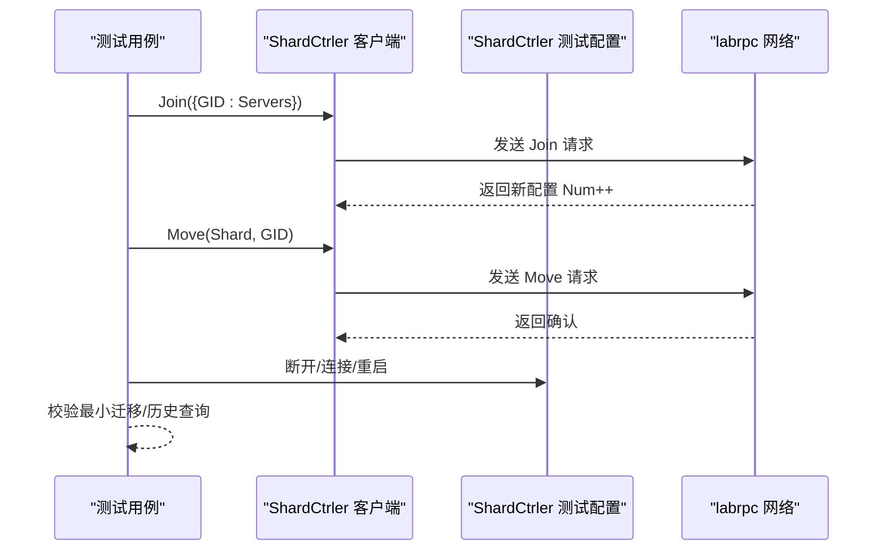
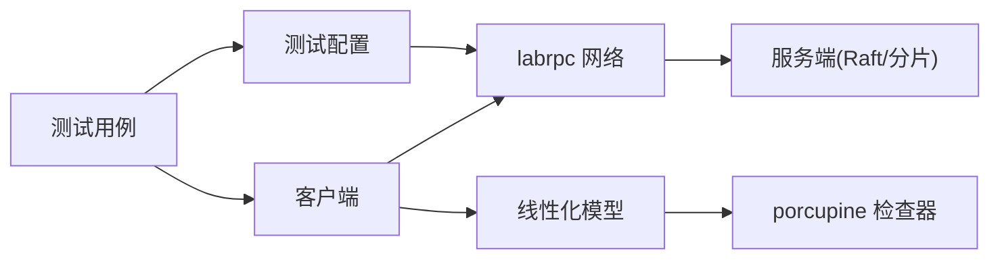

# 集成测试

**本文引用的文件**
- [README.md](file://README.md)
- [Makefile](file://Makefile)
- [all-test.sh](file://all-test.sh)
- [raft/test_test.go](file://raft/test_test.go)
- [raft/config.go](file://raft/config.go)
- [shardkv/test_test.go](file://shardkv/test_test.go)
- [shardkv/config.go](file://shardkv/config.go)
- [shardctrler/test_test.go](file://shardctrler/test_test.go)
- [shardctrler/config.go](file://shardctrler/config.go)
- [labrpc/labrpc.go](file://labrpc/labrpc.go)
- [porcupine/porcupine.go](file://porcupine/porcupine.go)
- [porcupine/checker.go](file://porcupine/checker.go)
- [shardkv/client.go](file://shardkv/client.go)
- [shardctrler/client.go](file://shardctrler/client.go)
- [kvraft/client.go](file://kvraft/client.go)

## 目录
1. [引言](#引言)
2. [项目结构](#项目结构)
3. [核心组件](#核心组件)
4. [架构总览](#架构总览)
5. [详细组件分析](#详细组件分析)
6. [依赖关系分析](#依赖关系分析)
7. [性能考量](#性能考量)
8. [故障排查指南](#故障排查指南)
9. [结论](#结论)
10. [附录](#附录)

## 引言
本文件面向 eRaft 的集成测试，系统化阐述多组件协同测试的实施方法、测试环境搭建与测试数据管理策略；解释分布式系统集成测试的关键挑战（如网络分区、节点故障、数据一致性）及对应的解决方案；给出测试脚本使用、批量测试执行与测试结果汇总的方法；总结集成测试设计原则、测试场景覆盖与自动化流程；并提供性能集成测试、负载测试与稳定性测试的实施策略，以及可靠集成测试环境与测试数据准备方法。

## 项目结构
eRaft 是一个基于 Raft 的分布式分片键值存储系统，包含以下关键模块：
- 分布式共识层：raft
- 分片配置层：shardctrler
- 分片数据层：shardkv
- 独立 KV 模块：kvraft
- 测试支撑：labrpc（模拟网络）、porcupine（线性化检查）
- 构建与运行：Makefile、all-test.sh、命令行工具

图表来源
- [shardkv/client.go](file://shardkv/client.go#L151-L310)
- [shardctrler/client.go](file://shardctrler/client.go#L21-L215)
- [kvraft/client.go](file://kvraft/client.go#L16-L144)
- [labrpc/labrpc.go](file://labrpc/labrpc.go#L128-L384)

章节来源
- [README.md](file://README.md#L1-L139)
- [Makefile](file://Makefile#L29-L50)

## 核心组件
- 测试配置与网络仿真
  - raft/config.go：统一的 Raft 测试配置，负责启动/断开/重启节点、统计 RPC 数量与字节数、检查日志一致性等。
  - shardkv/config.go：分片 KV 的测试配置，负责创建配置集群与多个数据组，管理客户端连接与服务器启停。
  - shardctrler/config.go：配置控制器的测试配置，支持分区、连接/断开客户端、领导者选择等。
  - labrpc/labrpc.go：通道式 RPC，可模拟丢包、延迟、重排序、断开等网络行为，用于构造复杂网络场景。
- 客户端与一致性检查
  - shardkv/client.go：分片 KV 客户端，负责根据分片映射路由请求到对应组，并处理错误与领导者切换。
  - shardctrler/client.go：配置控制器客户端，负责查询/加入/离开/迁移等配置变更操作。
  - kvraft/client.go：独立 KV 客户端（非分片），用于单集群 Raft 基础功能验证。
  - porcupine/porcupine.go、porcupine/checker.go：线性化检查工具，对并发历史进行分区并判定是否线性化，辅助验证强一致语义。
- 测试用例
  - raft/test_test.go：Raft 单元与集成测试，覆盖选举、一致性、持久化、不可靠网络、崩溃恢复等。
  - shardkv/test_test.go：分片 KV 集成测试，覆盖静态分片、加入/离开、快照、配置变更并发、线性化检查等。
  - shardctrler/test_test.go：配置控制器集成测试，覆盖基本配置、并发变更、最小迁移等。

章节来源
- [raft/config.go](file://raft/config.go#L67-L107)
- [shardkv/config.go](file://shardkv/config.go#L350-L395)
- [shardctrler/config.go](file://shardctrler/config.go#L339-L363)
- [labrpc/labrpc.go](file://labrpc/labrpc.go#L174-L384)
- [shardkv/client.go](file://shardkv/client.go#L151-L310)
- [shardctrler/client.go](file://shardctrler/client.go#L21-L215)
- [kvraft/client.go](file://kvraft/client.go#L16-L144)
- [porcupine/porcupine.go](file://porcupine/porcupine.go#L5-L40)
- [porcupine/checker.go](file://porcupine/checker.go#L174-L369)

## 架构总览
下图展示集成测试中各组件的交互关系与控制流，强调“测试配置”作为编排者，“labrpc”作为网络抽象层，“客户端”作为业务入口，“Raft/分片”作为数据与一致性核心。

图表来源
- [raft/config.go](file://raft/config.go#L502-L549)
- [shardkv/config.go](file://shardkv/config.go#L350-L395)
- [labrpc/labrpc.go](file://labrpc/labrpc.go#L221-L312)
- [shardkv/client.go](file://shardkv/client.go#L206-L265)
- [shardctrler/client.go](file://shardctrler/client.go#L159-L197)

## 详细组件分析

### Raft 集成测试（网络分区、领导者选举、持久化）
- 关键能力
  - 选举与重选：断开/连接领导者，验证新领导者产生与任期稳定。
  - 不可靠网络：随机丢包/延迟/重排序，验证在异常网络下的正确性。
  - 崩溃与重启：节点崩溃后重启，验证持久化与恢复。
  - 并发 Start()：多客户端并发提交，验证一致性与索引分配。
- 典型流程（序列图）

图表来源
- [raft/test_test.go](file://raft/test_test.go#L24-L89)
- [raft/config.go](file://raft/config.go#L374-L404)
- [labrpc/labrpc.go](file://labrpc/labrpc.go#L221-L312)

章节来源
- [raft/test_test.go](file://raft/test_test.go#L24-L89)
- [raft/test_test.go](file://raft/test_test.go#L586-L706)
- [raft/test_test.go](file://raft/test_test.go#L708-L770)
- [raft/test_test.go](file://raft/test_test.go#L772-L800)
- [raft/config.go](file://raft/config.go#L374-L432)

### 分片 KV 集成测试（配置变更、迁移、并发与线性化）
- 关键能力
  - 静态分片：不进行迁移，验证跨分片读写。
  - 加入/离开：动态扩缩容，验证配置更新与数据迁移。
  - 快照与日志大小限制：验证持久化状态上限。
  - 并发配置变更与重启：验证迁移过程中的正确性。
  - 线性化检查：使用 porcupine 对并发历史进行线性化判定。
- 典型流程（序列图）

图表来源
- [shardkv/test_test.go](file://shardkv/test_test.go#L27-L96)
- [shardkv/test_test.go](file://shardkv/test_test.go#L98-L149)
- [shardkv/test_test.go](file://shardkv/test_test.go#L151-L217)
- [shardkv/test_test.go](file://shardkv/test_test.go#L219-L303)
- [shardkv/test_test.go](file://shardkv/test_test.go#L305-L380)
- [shardkv/test_test.go](file://shardkv/test_test.go#L382-L453)
- [shardkv/test_test.go](file://shardkv/test_test.go#L455-L663)
- [shardkv/test_test.go](file://shardkv/test_test.go#L665-L746)
- [shardkv/test_test.go](file://shardkv/test_test.go#L748-L800)
- [shardkv/config.go](file://shardkv/config.go#L318-L346)
- [shardctrler/test_test.go](file://shardctrler/test_test.go#L80-L250)
- [porcupine/porcupine.go](file://porcupine/porcupine.go#L5-L40)
- [porcupine/checker.go](file://porcupine/checker.go#L360-L369)

章节来源
- [shardkv/test_test.go](file://shardkv/test_test.go#L27-L96)
- [shardkv/test_test.go](file://shardkv/test_test.go#L98-L149)
- [shardkv/test_test.go](file://shardkv/test_test.go#L151-L217)
- [shardkv/test_test.go](file://shardkv/test_test.go#L219-L303)
- [shardkv/test_test.go](file://shardkv/test_test.go#L305-L380)
- [shardkv/test_test.go](file://shardkv/test_test.go#L382-L453)
- [shardkv/test_test.go](file://shardkv/test_test.go#L455-L663)
- [shardkv/test_test.go](file://shardkv/test_test.go#L665-L746)
- [shardkv/test_test.go](file://shardkv/test_test.go#L748-L800)
- [shardkv/config.go](file://shardkv/config.go#L318-L346)
- [shardctrler/test_test.go](file://shardctrler/test_test.go#L80-L250)
- [porcupine/porcupine.go](file://porcupine/porcupine.go#L5-L40)
- [porcupine/checker.go](file://porcupine/checker.go#L360-L369)

### 配置控制器集成测试（最小迁移、并发变更）
- 关键能力
  - 基本 Join/Leave/Move：验证配置正确更新与最小迁移。
  - 并发 Join/Leave：多客户端并发变更，验证最终一致性。
  - 历史查询：验证历史配置可查询且一致。
- 典型流程（序列图）

图表来源
- [shardctrler/test_test.go](file://shardctrler/test_test.go#L80-L250)
- [shardctrler/config.go](file://shardctrler/config.go#L319-L337)
- [shardctrler/client.go](file://shardctrler/client.go#L125-L197)

章节来源
- [shardctrler/test_test.go](file://shardctrler/test_test.go#L80-L250)
- [shardctrler/config.go](file://shardctrler/config.go#L319-L337)
- [shardctrler/client.go](file://shardctrler/client.go#L125-L197)

### 网络仿真与挑战应对
- 挑战
  - 网络分区：少数派无法选出领导者，需等待超时或最小集合重新连通。
  - 不可靠网络：丢包、延迟、重排序导致请求/响应不确定性。
  - 节点故障：崩溃/重启影响持久化状态与领导者任期。
- 应对
  - 使用 labrpc 的 Reliable/LongReordering/LongDelays 控制网络行为。
  - 在测试配置中提供断开/连接、重启、崩溃等操作接口。
  - 通过统计 RPC 数量、字节数与日志一致性校验正确性。

章节来源
- [labrpc/labrpc.go](file://labrpc/labrpc.go#L174-L384)
- [raft/config.go](file://raft/config.go#L307-L350)
- [shardkv/config.go](file://shardkv/config.go#L160-L206)
- [shardctrler/config.go](file://shardctrler/config.go#L153-L165)

### 数据一致性验证与线性化检查
- 方法
  - 记录客户端操作的时间戳与输入/输出，形成历史事件。
  - 使用 porcupine 将历史按分区（例如按客户端或按时间窗口）切分。
  - 并行检查每个子历史是否可线性化，若全部可线性化则整体线性化。
- 场景
  - 并发 Put/Append/Get 与配置变更交错执行。
  - 迁移期间的读写一致性。
  - 最小迁移策略下的配置变更。

章节来源
- [porcupine/porcupine.go](file://porcupine/porcupine.go#L5-L40)
- [porcupine/checker.go](file://porcupine/checker.go#L174-L369)
- [shardkv/test_test.go](file://shardkv/test_test.go#L560-L663)

## 依赖关系分析
- 组件耦合
  - 测试配置依赖 labrpc 网络仿真，以控制节点间通信。
  - 客户端通过 gRPC 或 labrpc 与服务端交互，服务端内部依赖 Raft 实现一致性。
  - 线性化检查工具独立于业务逻辑，仅依赖模型定义。
- 外部依赖
  - gRPC：客户端与服务端之间的高效通信。
  - labgob：RPC 参数编码，确保跨进程传输安全。
- 循环依赖
  - 未发现直接循环依赖；客户端与服务端通过接口解耦。

图表来源
- [shardkv/client.go](file://shardkv/client.go#L151-L310)
- [shardctrler/client.go](file://shardctrler/client.go#L21-L215)
- [kvraft/client.go](file://kvraft/client.go#L16-L144)
- [labrpc/labrpc.go](file://labrpc/labrpc.go#L128-L384)
- [porcupine/checker.go](file://porcupine/checker.go#L360-L369)

章节来源
- [shardkv/client.go](file://shardkv/client.go#L151-L310)
- [shardctrler/client.go](file://shardctrler/client.go#L21-L215)
- [kvraft/client.go](file://kvraft/client.go#L16-L144)
- [labrpc/labrpc.go](file://labrpc/labrpc.go#L128-L384)
- [porcupine/checker.go](file://porcupine/checker.go#L360-L369)

## 性能考量
- RPC 统计与优化
  - 通过测试配置统计每轮测试的 RPC 数量与字节数，评估网络开销。
  - 控制网络可靠性参数，观察在高丢包/高延迟下的吞吐与延迟表现。
- 日志与快照
  - 设置快照间隔与最大 Raft 状态大小，避免日志无限增长。
  - 在分片 KV 测试中检查快照与持久化状态大小，确保符合预期。
- 并发与资源
  - 并发 Start() 与配置变更时，注意 goroutine 泄漏与锁竞争。
  - 合理设置客户端超时，避免长时间阻塞导致测试超时。

章节来源
- [raft/config.go](file://raft/config.go#L554-L581)
- [shardkv/config.go](file://shardkv/config.go#L96-L110)
- [shardkv/test_test.go](file://shardkv/test_test.go#L151-L217)

## 故障排查指南
- 常见问题
  - 无领导者：检查网络连接与分区，确认多数派可达。
  - 任期变化频繁：可能由于网络抖动或领导者不稳定，需延长等待时间。
  - 日志不一致：检查应用通道与日志索引一致性，定位冲突项。
  - 线性化失败：分析并发历史，确认是否存在竞态或迁移未完成。
- 排查步骤
  - 使用测试配置提供的统计接口查看 RPC/字节数与已提交条目数。
  - 手动断开/连接特定节点，复现分区场景并观察行为。
  - 启用详细日志与超时控制，逐步缩小问题范围。

章节来源
- [raft/config.go](file://raft/config.go#L374-L432)
- [shardkv/test_test.go](file://shardkv/test_test.go#L560-L663)

## 结论
eRaft 的集成测试通过统一的测试配置与 labrpc 网络仿真，实现了对 Raft、分片配置与分片数据的多组件协同验证。借助线性化检查工具，能够有效验证强一致语义；通过网络分区、节点故障与并发场景的覆盖，显著提升了系统的鲁棒性与可维护性。建议在持续集成中引入批量测试与覆盖率统计，进一步提升测试效率与质量。

## 附录

### 测试脚本使用与批量执行
- 构建与运行
  - 使用构建脚本生成所有二进制，便于快速部署与测试。
  - 使用一键测试脚本运行所有模块的单元与集成测试。
- 示例
  - 构建：执行构建目标，生成 output 目录下的可执行文件。
  - 批量测试：执行 all-test.sh，依次运行 raft、kvraft、shardctrler、shardkv 的测试套件。

章节来源
- [Makefile](file://Makefile#L29-L50)
- [all-test.sh](file://all-test.sh#L1-L8)

### 测试环境搭建与数据准备
- 环境要求
  - 支持 gRPC 与 labrpc 的网络仿真。
  - 为每个测试用例准备临时目录，隔离持久化状态与快照。
- 数据准备
  - 使用测试配置初始化多个分片组与配置控制器。
  - 通过客户端注册分组、发起读写与配置变更，生成测试数据与历史记录。

章节来源
- [shardkv/config.go](file://shardkv/config.go#L350-L395)
- [shardctrler/config.go](file://shardctrler/config.go#L339-L363)
- [shardkv/client.go](file://shardkv/client.go#L165-L188)
- [shardctrler/client.go](file://shardctrler/client.go#L36-L60)

### 测试场景覆盖与自动化流程
- 设计原则
  - 全面覆盖：选举、一致性、持久化、不可靠网络、崩溃重启、配置变更、迁移、并发与线性化。
  - 可重复：使用确定性随机种子与稳定的网络仿真参数。
  - 可度量：统计 RPC 数量、字节数、提交条目数与耗时。
- 自动化流程
  - 使用测试配置统一编排节点生命周期与网络状态。
  - 通过客户端并发生成历史，使用线性化检查器自动判定正确性。
  - 输出测试报告与覆盖率，便于回归与性能对比。

章节来源
- [raft/test_test.go](file://raft/test_test.go#L24-L89)
- [shardkv/test_test.go](file://shardkv/test_test.go#L27-L96)
- [shardctrler/test_test.go](file://shardctrler/test_test.go#L80-L250)
- [porcupine/porcupine.go](file://porcupine/porcupine.go#L5-L40)