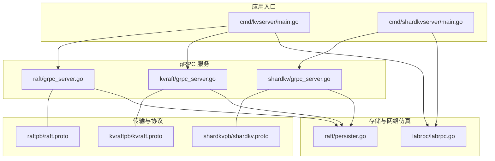
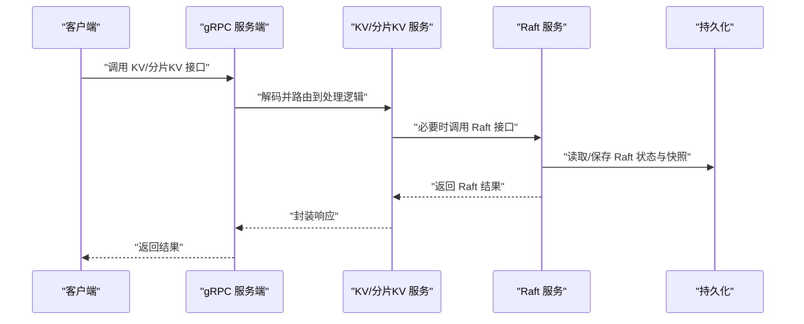
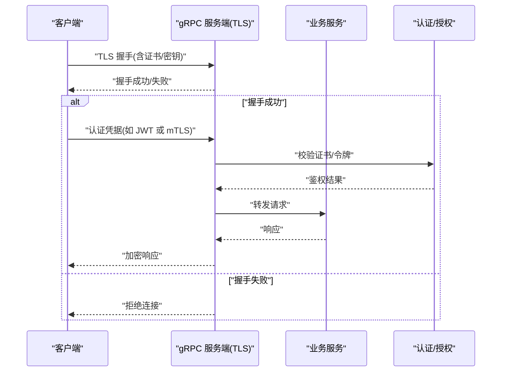
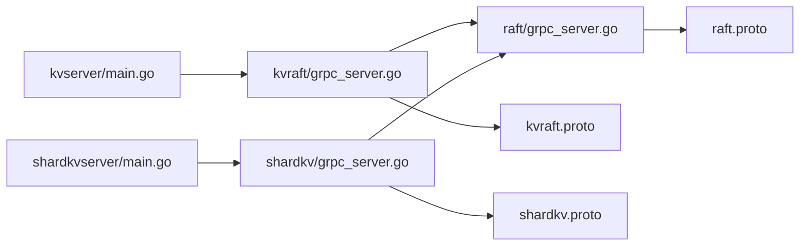

# 安全配置

<cite>
**本文引用的文件**
- [cmd/kvserver/main.go](file://cmd/kvserver/main.go)
- [cmd/shardkvserver/main.go](file://cmd/shardkvserver/main.go)
- [raft/grpc_server.go](file://raft/grpc_server.go)
- [raft/grpc_client.go](file://raft/grpc_client.go)
- [kvraft/grpc_server.go](file://kvraft/grpc_server.go)
- [shardkv/grpc_server.go](file://shardkv/grpc_server.go)
- [raft/persister.go](file://raft/persister.go)
- [labrpc/labrpc.go](file://labrpc/labrpc.go)
- [raft/config.go](file://raft/config.go)
- [kvraft/config.go](file://kvraft/config.go)
- [labgob/labgob.go](file://labgob/labgob.go)
- [raftpb/raft.proto](file://raftpb/raft.proto)
- [kvraftpb/kvraft.proto](file://kvraftpb/kvraft.proto)
- [shardkvpb/shardkv.proto](file://shardkvpb/shardkv.proto)
</cite>

## 目录
1. [简介](#简介)
2. [项目结构](#项目结构)
3. [核心组件](#核心组件)
4. [架构总览](#架构总览)
5. [详细组件分析](#详细组件分析)
6. [依赖关系分析](#依赖关系分析)
7. [性能与安全权衡](#性能与安全权衡)
8. [故障排查指南](#故障排查指南)
9. [结论](#结论)
10. [附录：安全配置模板与最佳实践](#附录安全配置模板与最佳实践)

## 简介
本指南面向 eRaft 系统的安全加固与运维，聚焦于网络传输安全、访问控制、数据保护、防火墙与端口控制、审计与合规、安全加固与事件响应，并提供多安全等级的部署模板与最佳实践。当前代码库以 gRPC 作为节点间通信协议，Raft 服务与 KV/ShardKV 服务通过 gRPC 暴露；客户端通过 gRPC 与服务端交互。在默认实现中，gRPC 使用明文传输（不启用 TLS），因此需要在生产环境中进行安全增强。

## 项目结构
eRaft 采用分层与模块化组织：
- 应用入口：各子系统入口位于 cmd/*，负责解析参数、初始化 Raft/KV 组件、启动 gRPC 服务端。
- 传输层：基于 gRPC 的 Raft 与 KV/ShardKV 服务，消息定义位于对应的 pb 目录。
- 存储与持久化：Raft 状态与快照通过文件持久化，支持原子写入。
- 测试与仿真：labrpc 提供可配置的网络仿真，便于测试可靠性与分区场景。

图表来源
- [cmd/kvserver/main.go](file://cmd/kvserver/main.go#L16-L47)
- [cmd/shardkvserver/main.go](file://cmd/shardkvserver/main.go#L18-L58)
- [raft/grpc_server.go](file://raft/grpc_server.go#L9-L74)
- [kvraft/grpc_server.go](file://kvraft/grpc_server.go#L9-L45)
- [shardkv/grpc_server.go](file://shardkv/grpc_server.go#L9-L98)
- [raftpb/raft.proto](file://raftpb/raft.proto#L53-L57)
- [kvraftpb/kvraft.proto](file://kvraftpb/kvraft.proto#L37-L40)
- [shardkvpb/shardkv.proto](file://shardkvpb/shardkv.proto#L60-L65)
- [raft/persister.go](file://raft/persister.go#L28-L54)
- [labrpc/labrpc.go](file://labrpc/labrpc.go#L128-L172)

章节来源
- [cmd/kvserver/main.go](file://cmd/kvserver/main.go#L16-L47)
- [cmd/shardkvserver/main.go](file://cmd/shardkvserver/main.go#L18-L58)
- [raft/grpc_server.go](file://raft/grpc_server.go#L9-L74)
- [kvraft/grpc_server.go](file://kvraft/grpc_server.go#L9-L45)
- [shardkv/grpc_server.go](file://shardkv/grpc_server.go#L9-L98)
- [raft/persister.go](file://raft/persister.go#L28-L54)
- [labrpc/labrpc.go](file://labrpc/labrpc.go#L128-L172)

## 核心组件
- gRPC 服务端与客户端
  - 服务端：RaftService、KVService、ShardKVService 在各自模块中注册到 gRPC 服务器。
  - 客户端：RaftgRPCClient 使用明文凭证发起请求，存在中间人风险。
- 持久化与快照
  - 文件持久化 Raft 状态与快照，支持原子写入，避免状态与快照错配。
- 网络仿真
  - labrpc 提供可靠/不可靠、延迟、重排序等网络特性，用于测试一致性与容错。

章节来源
- [raft/grpc_server.go](file://raft/grpc_server.go#L9-L74)
- [kvraft/grpc_server.go](file://kvraft/grpc_server.go#L9-L45)
- [shardkv/grpc_server.go](file://shardkv/grpc_server.go#L9-L98)
- [raft/grpc_client.go](file://raft/grpc_client.go#L14-L26)
- [raft/persister.go](file://raft/persister.go#L28-L54)
- [labrpc/labrpc.go](file://labrpc/labrpc.go#L128-L172)

## 架构总览
下图展示节点间通信与数据流：客户端通过 gRPC 调用 KV/ShardKV 服务，后者转发到 Raft 服务或内部状态机；Raft 通过 RaftgRPCClient 向对等节点发送投票、追加日志与安装快照请求。

图表来源
- [cmd/kvserver/main.go](file://cmd/kvserver/main.go#L34-L46)
- [cmd/shardkvserver/main.go](file://cmd/shardkvserver/main.go#L45-L57)
- [kvraft/grpc_server.go](file://kvraft/grpc_server.go#L18-L32)
- [shardkv/grpc_server.go](file://shardkv/grpc_server.go#L18-L32)
- [raft/grpc_server.go](file://raft/grpc_server.go#L18-L58)
- [raft/grpc_client.go](file://raft/grpc_client.go#L28-L44)
- [raft/persister.go](file://raft/persister.go#L71-L82)

## 详细组件分析

### gRPC 传输层安全（TLS 与双向认证）
- 当前实现
  - 服务端：使用默认 gRPC 服务器，未启用 TLS。
  - 客户端：使用明文凭证建立连接，未校验对端证书。
- 风险
  - 明文传输易被窃听与篡改；无对端身份验证，易受中间人攻击。
- 建议
  - 服务端启用 TLS 并配置证书链与私钥；开启双向认证（mTLS）以强制客户端出示证书。
  - 客户端使用受信 CA 验证服务端证书，并携带客户端证书与私钥。
  - 强制最小 TLS 版本与密码套件，禁用过时算法。
  - 在 gRPC 选项中设置证书与私钥路径，替换明文凭证。

图表来源
- [raft/grpc_client.go](file://raft/grpc_client.go#L19-L26)
- [cmd/kvserver/main.go](file://cmd/kvserver/main.go#L39-L41)
- [cmd/shardkvserver/main.go](file://cmd/shardkvserver/main.go#L50-L52)

章节来源
- [raft/grpc_client.go](file://raft/grpc_client.go#L19-L26)
- [cmd/kvserver/main.go](file://cmd/kvserver/main.go#L39-L41)
- [cmd/shardkvserver/main.go](file://cmd/shardkvserver/main.go#L50-L52)

### 访问控制与身份认证
- 当前实现
  - 未内置用户身份认证与权限模型；gRPC 服务直接暴露。
- 建议
  - 在 gRPC 层引入拦截器：基于令牌（如 JWT）或 mTLS 进行认证与授权。
  - 对敏感接口（如安装快照、跨分片迁移）实施细粒度权限控制。
  - 将客户端标识与命令 ID 关联，防止重放攻击。

章节来源
- [kvraft/grpc_server.go](file://kvraft/grpc_server.go#L18-L32)
- [shardkv/grpc_server.go](file://shardkv/grpc_server.go#L18-L32)
- [raft/grpc_server.go](file://raft/grpc_server.go#L18-L31)

### 数据保护与密钥管理
- 存储侧
  - Raft 状态与快照以二进制形式写入磁盘，建议：
    - 仅授予运行账户读写权限；
    - 使用只读挂载或独立卷存放持久化目录；
    - 定期备份并校验完整性。
- 传输侧
  - 强制启用 TLS；对日志与快照数据进行加密存储（如使用文件系统级加密）。
- 密钥管理
  - 使用硬件安全模块（HSM）或密钥管理服务（KMS）生成与轮换证书与会话密钥；
  - 严格限制密钥访问权限与审计日志。

章节来源
- [raft/persister.go](file://raft/persister.go#L48-L54)

### 防火墙与端口访问控制
- 入站规则
  - 仅开放 gRPC 服务端口给已知对等节点与管理网段；
  - 对外仅暴露必要的监控与健康检查端口。
- 出站规则
  - 限制客户端与 RaftgRPCClient 的出站目标，避免误连至不受信节点。
- 网络隔离
  - 不同分片组置于不同子网，通过 ACL 控制跨组通信。

章节来源
- [cmd/kvserver/main.go](file://cmd/kvserver/main.go#L35-L38)
- [cmd/shardkvserver/main.go](file://cmd/shardkvserver/main.go#L45-L48)
- [raft/grpc_client.go](file://raft/grpc_client.go#L19-L26)

### 审计与合规
- 建议
  - 启用 gRPC 服务端访问日志与错误统计；
  - 记录关键操作（投票、提交、快照安装）的时间戳、参与者与结果；
  - 配置集中式日志收集与告警，满足合规性要求。

章节来源
- [labrpc/labrpc.go](file://labrpc/labrpc.go#L167-L172)

### 安全加固与事件响应
- 加固建议
  - 及时更新依赖与运行时；定期扫描容器镜像与主机基线；
  - 禁用不必要的服务与端口；最小权限原则运行进程。
- 事件响应
  - 建立快速隔离、取证与恢复流程；对异常流量与失败登录进行告警与封禁。

章节来源
- [raft/config.go](file://raft/config.go#L290-L294)
- [kvraft/config.go](file://kvraft/config.go#L67-L72)

## 依赖关系分析
- 服务注册
  - KV 与 ShardKV 服务在各自入口中注册到 gRPC 服务器。
- 服务间调用
  - KV/ShardKV 服务内部可能调用 Raft 服务接口，RaftgRPCClient 通过明文 gRPC 发起请求。
- 协议定义
  - gRPC 方法由 .proto 文件定义，服务端与客户端按约定实现。

图表来源
- [cmd/kvserver/main.go](file://cmd/kvserver/main.go#L39-L41)
- [cmd/shardkvserver/main.go](file://cmd/shardkvserver/main.go#L50-L52)
- [kvraft/grpc_server.go](file://kvraft/grpc_server.go#L14-L16)
- [shardkv/grpc_server.go](file://shardkv/grpc_server.go#L14-L16)
- [raft/grpc_server.go](file://raft/grpc_server.go#L9-L12)
- [raftpb/raft.proto](file://raftpb/raft.proto#L53-L57)
- [kvraftpb/kvraft.proto](file://kvraftpb/kvraft.proto#L37-L40)
- [shardkvpb/shardkv.proto](file://shardkvpb/shardkv.proto#L60-L65)

章节来源
- [cmd/kvserver/main.go](file://cmd/kvserver/main.go#L39-L41)
- [cmd/shardkvserver/main.go](file://cmd/shardkvserver/main.go#L50-L52)
- [kvraft/grpc_server.go](file://kvraft/grpc_server.go#L14-L16)
- [shardkv/grpc_server.go](file://shardkv/grpc_server.go#L14-L16)
- [raft/grpc_server.go](file://raft/grpc_server.go#L9-L12)
- [raftpb/raft.proto](file://raftpb/raft.proto#L53-L57)
- [kvraftpb/kvraft.proto](file://kvraftpb/kvraft.proto#L37-L40)
- [shardkvpb/shardkv.proto](file://shardkvpb/shardkv.proto#L60-L65)

## 性能与安全权衡
- TLS 开销
  - 首次握手与加密/解密会带来 CPU 与延迟开销；可通过会话复用与合适的密码套件降低影响。
- 日志与快照
  - 频繁快照与日志压缩可减少存储压力，但需平衡恢复时间与资源消耗。
- 网络仿真
  - 测试阶段可利用 labrpc 的不可靠网络模拟，生产环境应关闭仿真特性。

章节来源
- [labrpc/labrpc.go](file://labrpc/labrpc.go#L181-L193)
- [raft/config.go](file://raft/config.go#L183-L236)

## 故障排查指南
- 常见问题
  - gRPC 连接失败：检查服务端监听地址与防火墙策略；确认客户端目标地址正确。
  - 认证失败：核对证书链、私钥权限与 CA 信任链；确保双向认证配置一致。
  - 性能异常：评估 TLS 密码套件与会话复用；检查磁盘 I/O 与快照频率。
- 排查步骤
  - 启用详细日志与指标采集；
  - 使用抓包工具验证 TLS 握手与证书链；
  - 核对持久化目录权限与磁盘空间。

章节来源
- [raft/grpc_client.go](file://raft/grpc_client.go#L19-L26)
- [cmd/kvserver/main.go](file://cmd/kvserver/main.go#L35-L38)
- [cmd/shardkvserver/main.go](file://cmd/shardkvserver/main.go#L45-L48)

## 结论
eRaft 当前以明文 gRPC 为基础，具备良好的扩展性与教学价值。生产部署必须补齐 TLS 与双向认证、访问控制、数据加密与密钥管理、严格的防火墙与端口控制、完善的审计与合规能力，并制定安全加固与事件响应流程。通过分层安全设计与持续改进，可在保证一致性的同时满足企业级安全要求。

## 附录：安全配置模板与最佳实践

### 网络与传输安全模板
- 服务端 TLS 配置要点
  - 启用 TLS 并设置证书链与私钥；
  - 启用双向认证（mTLS），限定受信客户端证书；
  - 最小 TLS 版本与密码套件白名单。
- 客户端 TLS 配置要点
  - 使用受信 CA 验证服务端证书；
  - 配置客户端证书与私钥；
  - 限制出站目标与超时策略。

章节来源
- [raft/grpc_client.go](file://raft/grpc_client.go#L19-L26)
- [cmd/kvserver/main.go](file://cmd/kvserver/main.go#L39-L41)
- [cmd/shardkvserver/main.go](file://cmd/shardkvserver/main.go#L50-L52)

### 访问控制与权限模板
- 基于令牌的认证
  - 在 gRPC 拦截器中校验 JWT，提取角色与权限；
  - 对高危操作（如安装快照、跨分片迁移）实施额外审批。
- 基于 mTLS 的认证
  - 强制双向认证，结合证书 SAN 与 CN 实施细粒度授权。

章节来源
- [kvraft/grpc_server.go](file://kvraft/grpc_server.go#L18-L32)
- [shardkv/grpc_server.go](file://shardkv/grpc_server.go#L18-L32)

### 数据保护与密钥管理模板
- 存储加密
  - 使用文件系统级加密或数据库透明加密；
  - 仅授予运行账户读写权限，定期轮换密钥。
- 传输加密
  - 强制 TLS；对日志与快照进行加密存储。

章节来源
- [raft/persister.go](file://raft/persister.go#L48-L54)

### 防火墙与端口控制模板
- 入站规则
  - 仅开放 gRPC 端口给对等节点与管理网段；
  - 对外仅暴露监控与健康检查端口。
- 出站规则
  - 限制 RaftgRPCClient 出站目标，避免误连。

章节来源
- [cmd/kvserver/main.go](file://cmd/kvserver/main.go#L35-L38)
- [cmd/shardkvserver/main.go](file://cmd/shardkvserver/main.go#L45-L48)
- [raft/grpc_client.go](file://raft/grpc_client.go#L19-L26)

### 审计与合规模板
- 日志与指标
  - 启用 gRPC 访问日志与错误统计；
  - 记录关键操作与异常事件。
- 合规
  - 集中式日志收集与告警；
  - 定期审计证书与密钥轮换记录。

章节来源
- [labrpc/labrpc.go](file://labrpc/labrpc.go#L167-L172)

### 安全加固与事件响应模板
- 加固
  - 更新依赖与运行时；扫描容器与主机基线；最小权限运行。
- 响应
  - 快速隔离、取证与恢复；异常流量与失败登录告警与封禁。

章节来源
- [raft/config.go](file://raft/config.go#L290-L294)
- [kvraft/config.go](file://kvraft/config.go#L67-L72)