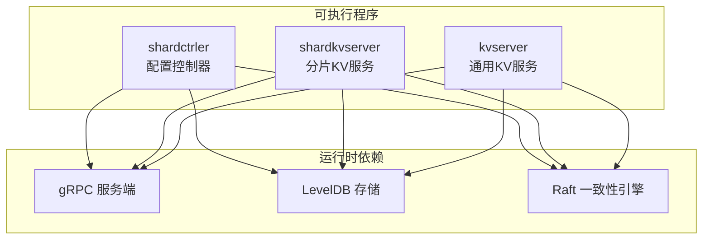
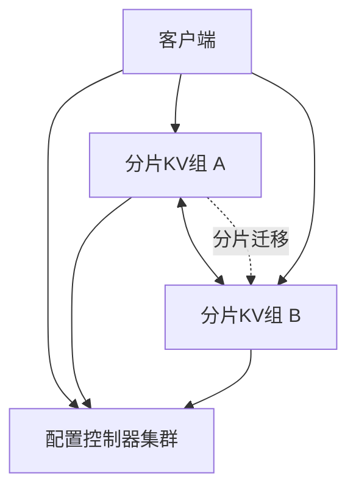
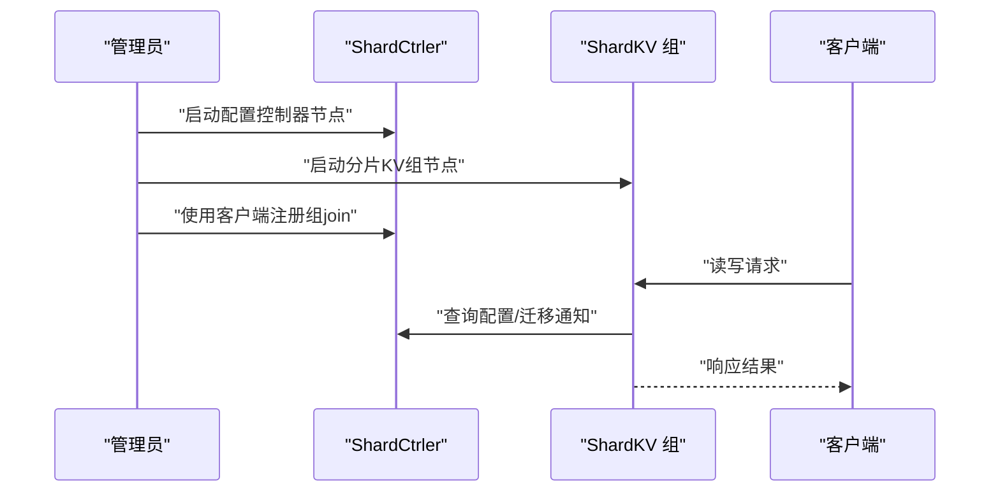
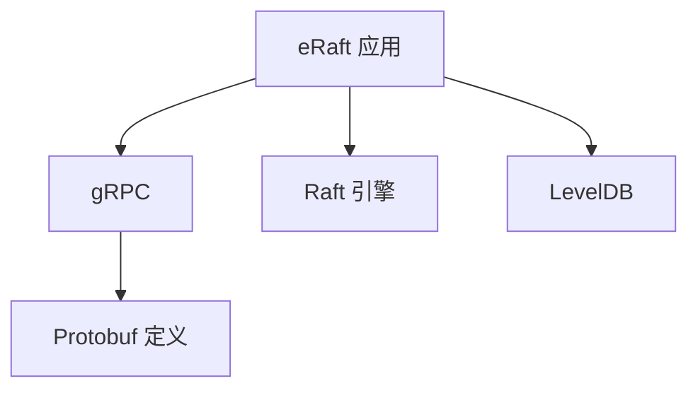

# 生产环境部署

**本文引用的文件**
- [README.md](file://README.md)
- [Dockerfile](file://Dockerfile)
- [Makefile](file://Makefile)
- [cmd/shardctrler/main.go](file://cmd/shardctrler/main.go)
- [cmd/shardkvserver/main.go](file://cmd/shardkvserver/main.go)
- [cmd/kvserver/main.go](file://cmd/kvserver/main.go)
- [raft/config.go](file://raft/config.go)
- [shardkv/config.go](file://shardkv/config.go)
- [shardctrler/config.go](file://shardctrler/config.go)
- [kvraft/config.go](file://kvraft/config.go)
- [wiki/Architecture.md](file://wiki/Architecture.md)
- [go.mod](file://go.mod)

## 目录
1. [简介](#简介)
2. [项目结构](#项目结构)
3. [核心组件](#核心组件)
4. [架构总览](#架构总览)
5. [详细组件分析](#详细组件分析)
6. [依赖关系分析](#依赖关系分析)
7. [性能考量](#性能考量)
8. [故障排查指南](#故障排查指南)
9. [结论](#结论)
10. [附录](#附录)

## 简介
本指南面向 eRaft 分布式分片键值存储系统的生产环境部署，覆盖物理服务器与虚拟机部署、容器化（Docker）与 Kubernetes（K8s）集群部署、集群初始化流程（配置控制器启动、分片组配置、节点加入）、负载均衡与高可用设计、SSL/TLS 证书管理、部署验证与健康检查，以及不同规模的部署模板与最佳实践。

## 项目结构
eRaft 采用模块化组织，核心由三类可执行程序组成：配置控制器（ShardCtrler）、分片键值服务（ShardKV）、通用 KV 服务（KV），均通过 gRPC 提供服务接口，并使用 Raft 保证一致性。

图表来源
- [cmd/shardctrler/main.go](file://cmd/shardctrler/main.go#L18-L55)
- [cmd/shardkvserver/main.go](file://cmd/shardkvserver/main.go#L18-L57)
- [cmd/kvserver/main.go](file://cmd/kvserver/main.go#L16-L46)

章节来源
- [README.md](file://README.md#L43-L139)
- [go.mod](file://go.mod#L7-L21)

## 核心组件
- 配置控制器（ShardCtrler）
  - 职责：维护分片到副本组的映射，支持 Join/Leave/Move/Query 操作；作为分片元数据中心协调迁移。
  - 启动参数：节点 ID、集群地址列表、数据库目录。
  - 服务注册：gRPC 暴露配置控制器服务与 Raft 内部通信服务。
- 分片键值服务（ShardKV）
  - 职责：存储实际键值数据，每个副本组内运行多副本 Raft，按分片提供服务。
  - 启动参数：组内节点 ID、组 ID、组内集群地址、配置控制器地址、数据库路径。
  - 服务注册：gRPC 暴露分片 KV 服务与 Raft 内部通信服务。
- 通用 KV 服务（KV）
  - 职责：单体 Raft 实现的 KV 服务，便于对比或小规模场景。
  - 启动参数：节点 ID、节点地址列表、数据库路径。
  - 服务注册：gRPC 暴露 KV 服务与 Raft 内部通信服务。

章节来源
- [cmd/shardctrler/main.go](file://cmd/shardctrler/main.go#L18-L55)
- [cmd/shardkvserver/main.go](file://cmd/shardkvserver/main.go#L18-L57)
- [cmd/kvserver/main.go](file://cmd/kvserver/main.go#L16-L46)

## 架构总览
eRaft 三层架构：共识层（Raft）、配置层（ShardCtrler）、存储层（ShardKV）。客户端通过 ShardKV 访问数据，ShardKV 定期向 ShardCtrler 查询最新配置，必要时进行分片迁移以保持一致性与负载均衡。

图表来源
- [wiki/Architecture.md](file://wiki/Architecture.md#L18-L28)

章节来源
- [wiki/Architecture.md](file://wiki/Architecture.md#L1-L29)

## 详细组件分析

### 物理服务器与虚拟机部署（裸金属/VM）
- 系统要求
  - 操作系统：Linux（推荐 Ubuntu/RedHat/CentOS）。
  - 运行时：Go 1.24+（项目 go.mod 指定）。
  - 存储：每台机器具备足够的磁盘空间用于 LevelDB 数据目录。
  - 网络：各节点间可互相访问 gRPC 端口；客户端可访问对外服务端口。
- 依赖安装
  - 使用 Makefile 构建二进制：执行构建目标生成 output/ 下的可执行文件。
  - Dockerfile 中展示了基于 Ubuntu 22.04 的构建镜像，包含安装工具链与 Go 的过程，可用于本地构建或 CI。
- 环境配置
  - ShardCtrler：准备 3 节点集群，指定各节点监听地址与数据库目录。
  - ShardKV：为每个副本组准备 3 节点，指定组内地址列表、配置控制器地址、数据库路径。
  - KV：单体 Raft 场景下，准备 3 节点，指定节点地址列表与数据库目录。
- 启动顺序
  - 先启动 ShardCtrler 集群，再启动 ShardKV 副本组，最后通过客户端注册组信息。
  - 参考快速入门中的启动步骤与命令行参数。

章节来源
- [Makefile](file://Makefile#L29-L36)
- [Dockerfile](file://Dockerfile#L1-L9)
- [README.md](file://README.md#L51-L128)
- [cmd/shardctrler/main.go](file://cmd/shardctrler/main.go#L18-L55)
- [cmd/shardkvserver/main.go](file://cmd/shardkvserver/main.go#L18-L57)
- [cmd/kvserver/main.go](file://cmd/kvserver/main.go#L16-L46)

### 容器化部署（Docker）
- 镜像构建
  - 基于 Dockerfile 构建镜像，包含必要的构建工具与 Go 运行时。
  - Makefile 提供 image 目标，使用宿主机网络以便容器间互联。
- 容器编排
  - 使用 Makefile 中的 run-demo 目标演示如何在自定义网络中启动多个节点，展示容器间通信方式。
  - 建议在生产中使用 Docker Compose 或 K8s 管理容器生命周期与网络。
- 网络配置
  - 建议为 ShardCtrler 与每个 ShardKV 组分别创建独立子网，确保跨组隔离与低延迟互连。
  - 将数据库目录挂载为持久卷，避免容器重启丢失数据。

章节来源
- [Dockerfile](file://Dockerfile#L1-L9)
- [Makefile](file://Makefile#L38-L71)

### Kubernetes 集群部署
- 部署策略
  - 使用 Deployment 管理 ShardCtrler 与 ShardKV 副本组的有状态副本。
  - 使用 Headless Service 为每个副本组提供稳定的 DNS 名称与 Pod IP，便于 Raft 成员发现。
  - 使用普通 Service 对外暴露客户端接入端口（如需要），或通过 Ingress/NLB 暴露。
- 关键资源建议
  - ConfigMap：存放启动参数（如 -cluster/-ctrlers/-db 等），通过环境变量或挂载注入。
  - PersistentVolume/PersistentVolumeClaim：为每个 Pod 提供持久化存储。
  - StatefulSet：更严格的有状态管理（可选），适合需要稳定存储序号与网络标识的场景。
- 示例清单（概念性说明）
  - Deployment：定义 ShardCtrler 与 ShardKV 组的副本数与容器镜像。
  - Service：Headless Service 用于成员发现；可选的 ClusterIP/LoadBalancer 用于客户端接入。
  - ConfigMap：集中管理启动参数与配置项。
  - PVC：绑定持久卷，确保数据不丢失。
- 注意事项
  - 确保 Pod 间网络互通与 DNS 解析正常。
  - 为每个副本组设置合适的亲和性与反亲和性，避免同组副本被调度到同一节点。
  - 为配置控制器与分片 KV 组分别规划独立命名空间或标签，便于运维与隔离。

（本节为概念性说明，未直接分析具体源码文件）

### 集群初始化步骤
- 启动配置控制器（ShardCtrler）
  - 准备 3 个节点，指定 -id 与 -cluster 列表，-db 指向各自的数据目录。
  - 确保各节点可互相访问监听地址。
- 启动分片 KV 组（ShardKV）
  - 为每个组准备 3 个节点，指定 -id、-gid、-cluster（组内地址）、-ctrlers（配置控制器地址）、-db。
  - 确保组内节点可互相访问，且能连接配置控制器。
- 注册分片组
  - 使用 shardctrlerclient 的 join 命令将组注册到配置控制器，提供组内节点地址。
- 数据读写与监控
  - 使用 shardkvclient 执行 put/get/append/bench 等操作。
  - 使用 status 命令检查各节点状态。

图表来源
- [README.md](file://README.md#L53-L128)

章节来源
- [README.md](file://README.md#L53-L128)

### 负载均衡与高可用设计
- 负载均衡
  - 在客户端侧或边缘层（如反向代理/网关）对 ShardKV 组进行轮询或哈希路由，降低热点。
  - 通过配置控制器的 Query 接口动态感知分片归属变化，及时更新路由表。
- 高可用
  - 每个副本组至少 3 节点，满足多数派容错。
  - 配置控制器同样采用多副本，避免单点故障。
  - 使用持久卷与定期快照保障数据安全。
- 网络分区处理
  - Raft 层自动处理领导者选举与日志复制，应用层无需额外干预。
  - 建议在 K8s 中启用 PodDisruptionBudget，限制不可用窗口。

（本节为概念性说明，未直接分析具体源码文件）

### SSL/TLS 证书管理
- 传输加密
  - 在生产中为 gRPC 服务启用 TLS，使用受信 CA 签发的服务端证书与客户端证书。
  - 证书与密钥应妥善保管，定期轮换。
- 客户端认证
  - 可启用双向 TLS（mTLS），要求客户端也提供证书，提升安全性。
- 部署建议
  - 使用外部证书管理服务（如 HashiCorp Vault、Cert Manager）自动化证书签发与续期。
  - 在 K8s 中通过 Secret 管理证书，避免明文配置。

（本节为概念性说明，未直接分析具体源码文件）

### 部署验证与健康检查
- 健康检查
  - gRPC 服务端可暴露健康检查端点，结合探针（Liveness/Readiness）实现自动恢复与流量切换。
  - 通过 status 命令检查节点状态，确认领导者存在与日志进度。
- 性能验证
  - 使用 bench 命令进行基准测试，评估吞吐与延迟。
  - 结合系统指标（CPU/内存/磁盘 IO/网络）与 Raft 日志大小进行综合评估。

章节来源
- [README.md](file://README.md#L118-L128)

## 依赖关系分析
- 语言与工具链
  - Go 版本：项目使用 Go 1.24，工具链版本略高于主版本。
  - gRPC 与 Protobuf：用于服务定义与跨进程通信。
- 存储后端
  - LevelDB：作为持久化存储引擎，需确保磁盘性能与容量满足业务需求。
- 测试与开发辅助
  - labrpc：用于测试网络模拟，生产环境无需此依赖。

图表来源
- [go.mod](file://go.mod#L7-L21)

章节来源
- [go.mod](file://go.mod#L1-L22)

## 性能考量
- Raft 参数调优
  - 心跳间隔与选举超时：根据网络 RTT 调整，确保快速收敛同时避免频繁选举。
  - 日志压缩与快照：合理设置快照周期，减少日志体积与恢复时间。
- 存储优化
  - 使用高性能磁盘（SSD）与合适的文件系统（ext4/xfs），开启写缓存与预读。
  - 为 LevelDB 设置合适的缓存大小与并发度。
- 网络优化
  - 同一副本组尽量部署在同一可用区或低延迟交换机内。
  - 控制器与数据组之间建立专用网络，避免带宽争用。
- 并发与资源
  - 合理设置 GOMAXPROCS，避免 CPU 抢占导致尾延迟升高。
  - 监控内存占用，防止 GC 抖动影响性能。

（本节为通用指导，未直接分析具体源码文件）

## 故障排查指南
- 常见问题定位
  - 无法连接：检查 -cluster 与 -ctrlers 地址是否可达，防火墙与安全组规则。
  - 无领导者：查看日志中领导者变更频率，确认多数派节点在线。
  - 数据不一致：检查日志进度与快照状态，必要时重建从节点。
- 工具与命令
  - 使用 status 命令查看节点状态与配置版本。
  - 使用 bench 命令进行压力测试，识别瓶颈。
- 日志与指标
  - 开启详细日志级别，收集 gRPC 错误码与 Raft 事件。
  - 结合系统指标与应用指标（QPS/延迟/错误率）进行根因分析。

章节来源
- [README.md](file://README.md#L118-L128)

## 结论
eRaft 通过清晰的三层架构与 Raft 一致性机制，提供了高可用、可扩展的分布式键值存储能力。生产部署应重点关注：节点拓扑与网络隔离、持久化与备份策略、TLS 加密与身份认证、健康检查与自动恢复、以及性能与容量规划。结合本文提供的部署流程与最佳实践，可在不同规模环境中稳定落地。

## 附录
- 不同规模部署模板建议
  - 小型（开发/测试）：单机或最小化集群（3 节点配置控制器 + 1 组 3 节点），使用 Docker Compose 或 Minikube。
  - 中型（预生产/小型生产）：3 节点配置控制器 + 2-3 组 3 节点，跨可用区部署，启用 TLS 与持久卷。
  - 大型（生产）：多副本配置控制器 + 多组副本，分片跨区域分布，引入负载均衡与自动扩缩容，强化监控与告警。
- 最佳实践清单
  - 固定端口与服务名，统一配置管理。
  - 严格证书轮换与密钥管理。
  - 定期备份与演练恢复。
  - 持续监控与容量预警。
  - 文档化变更流程与回滚预案。

（本节为通用指导，未直接分析具体源码文件）