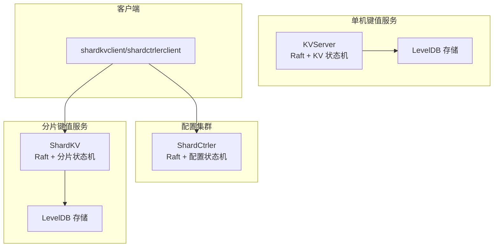
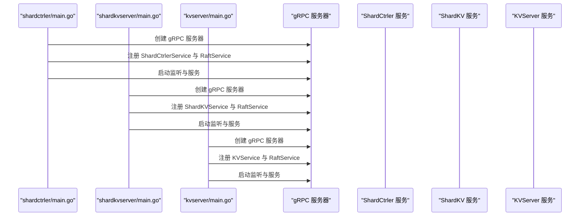
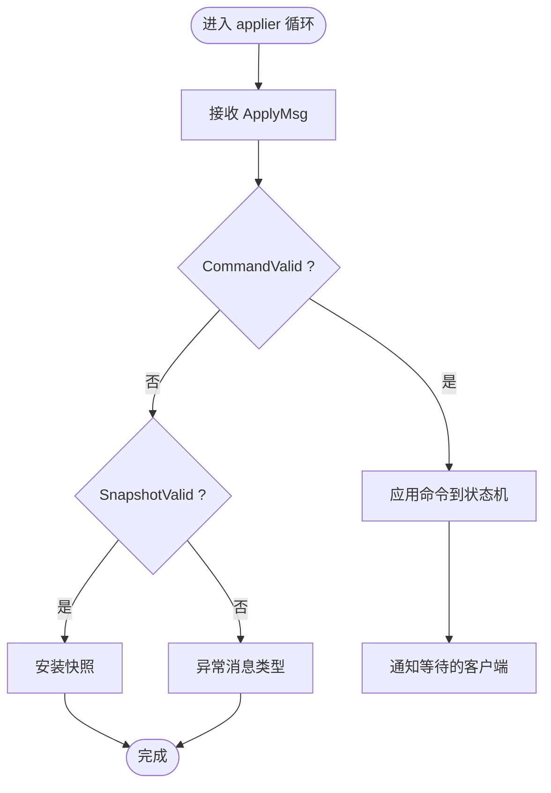
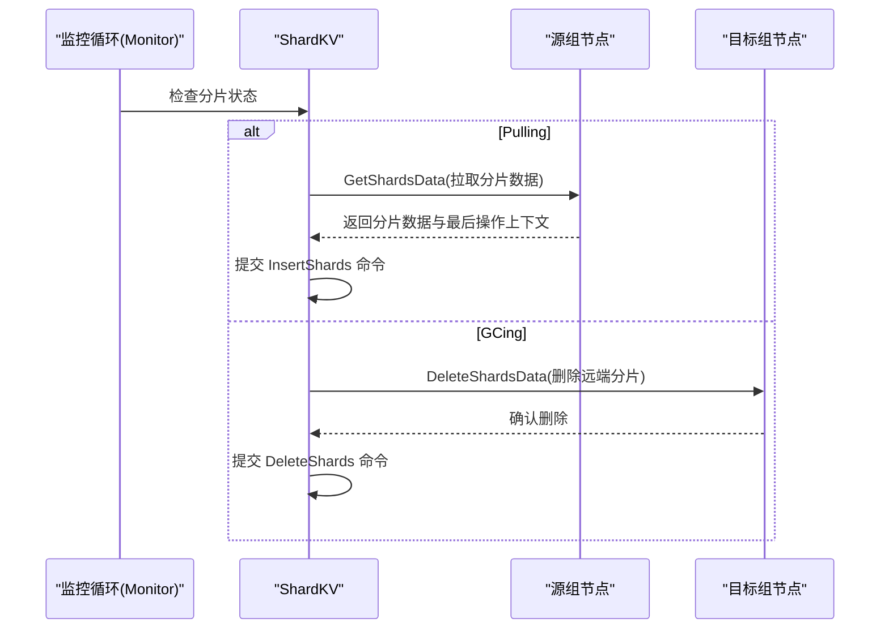
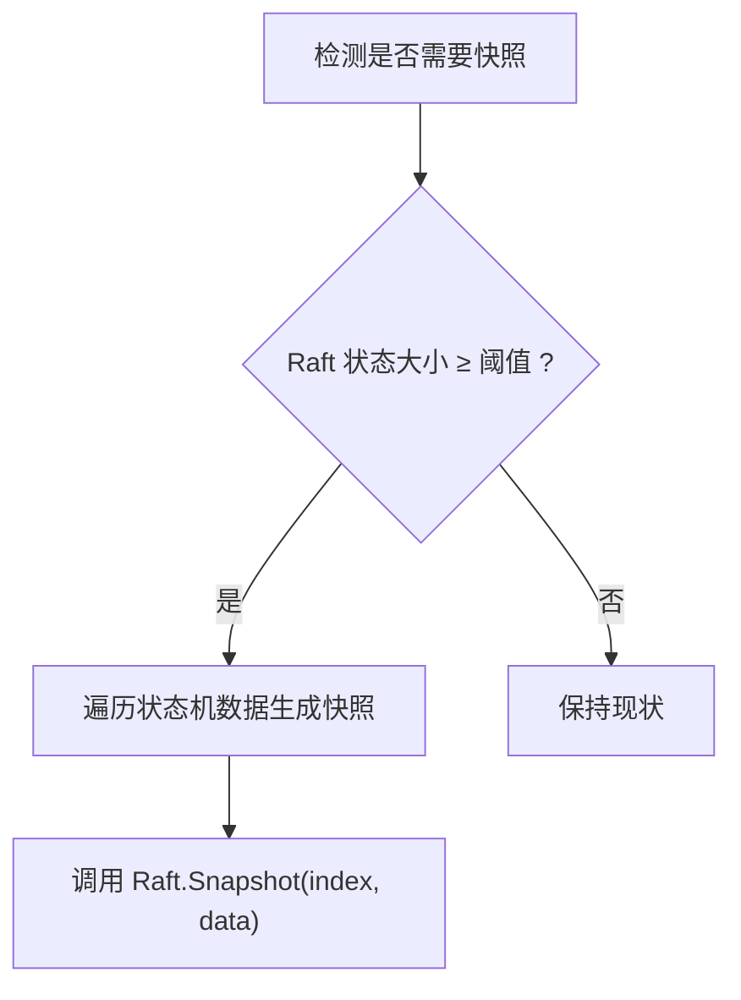
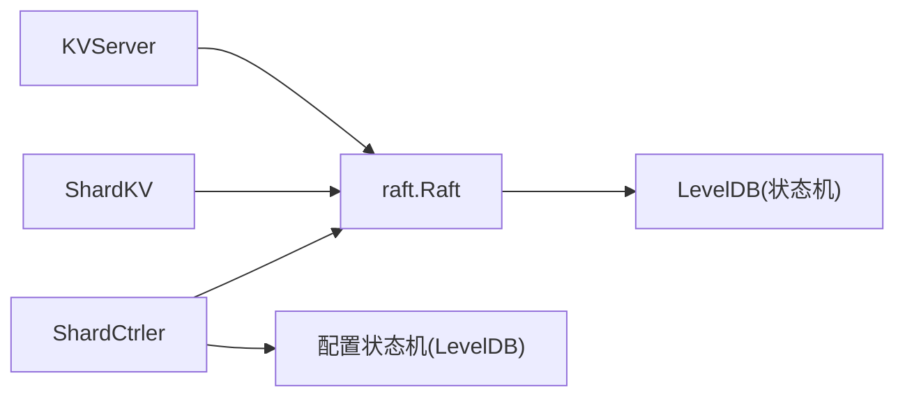

# 监控与日志管理

**本文引用的文件**
- [README.md](file://README.md)
- [cmd/kvserver/main.go](file://cmd/kvserver/main.go)
- [cmd/shardkvserver/main.go](file://cmd/shardkvserver/main.go)
- [cmd/shardctrler/main.go](file://cmd/shardctrler/main.go)
- [raft/raft.go](file://raft/raft.go)
- [raft/util.go](file://raft/util.go)
- [raft/config.go](file://raft/config.go)
- [kvraft/server.go](file://kvraft/server.go)
- [kvraft/common.go](file://kvraft/common.go)
- [shardkv/server.go](file://shardkv/server.go)
- [shardkv/common.go](file://shardkv/common.go)
- [shardctrler/server.go](file://shardctrler/server.go)
- [shardkvpb/shardkv_grpc.pb.go](file://shardkvpb/shardkv_grpc.pb.go)

## 目录
1. [简介](#简介)
2. [项目结构](#项目结构)
3. [核心组件](#核心组件)
4. [架构总览](#架构总览)
5. [详细组件分析](#详细组件分析)
6. [依赖关系分析](#依赖关系分析)
7. [性能考量](#性能考量)
8. [故障排查指南](#故障排查指南)
9. [结论](#结论)
10. [附录](#附录)

## 简介
本文件面向 eRaft 分布式键值存储系统，提供监控与日志管理的完整方案。内容覆盖系统指标采集（Raft 节点状态、分片分布、存储使用率、网络延迟）、日志配置与分类（结构化日志格式、日志级别、日志轮转）、Prometheus 监控集成（自定义指标暴露、Grafana 仪表板与告警）、分布式追踪（请求链路与性能瓶颈分析）、健康检查端点与探针、日志聚合与分析（ELK Stack）以及性能监控最佳实践与容量规划。

## 项目结构
eRaft 由三类核心组件构成：
- 配置集群（ShardCtrler）：负责分片配置管理与一致性，基于 Raft。
- 分片键值服务（ShardKV）：按分片提供数据读写，内部以 Raft 组维护副本。
- 单机键值服务（KVServer）：用于演示与测试，同样基于 Raft。

各组件均通过 gRPC 暴露服务接口，并在启动时注册 Raft 与业务服务。

图表来源
- [cmd/shardctrler/main.go](file://cmd/shardctrler/main.go#L18-L56)
- [cmd/shardkvserver/main.go](file://cmd/shardkvserver/main.go#L18-L58)
- [cmd/kvserver/main.go](file://cmd/kvserver/main.go#L16-L47)
- [shardctrler/server.go](file://shardctrler/server.go#L324-L343)
- [shardkv/server.go](file://shardkv/server.go#L759-L799)
- [kvraft/server.go](file://kvraft/server.go#L318-L341)

章节来源
- [README.md](file://README.md#L1-L139)
- [cmd/shardctrler/main.go](file://cmd/shardctrler/main.go#L18-L56)
- [cmd/shardkvserver/main.go](file://cmd/shardkvserver/main.go#L18-L58)
- [cmd/kvserver/main.go](file://cmd/kvserver/main.go#L16-L47)

## 核心组件
- Raft 层：提供节点状态查询、快照大小、日志条目应用等能力，是所有上层服务（KV、ShardKV、ShardCtrler）的共识基础。
- KVServer：单机键值服务，封装 Raft 并提供 Get/Put/Append 操作。
- ShardKV：分片键值服务，按分片管理数据，支持配置变更、迁移与垃圾回收。
- ShardCtrler：配置控制器，维护分片到组的映射，提供 Join/Leave/Move/Query 接口。

章节来源
- [raft/raft.go](file://raft/raft.go#L64-L80)
- [kvraft/server.go](file://kvraft/server.go#L88-L100)
- [shardkv/server.go](file://shardkv/server.go#L76-L99)
- [shardctrler/server.go](file://shardctrler/server.go#L17-L26)

## 架构总览
下图展示服务启动流程与 gRPC 注册关系，体现监控与日志的关键接入点。

图表来源
- [cmd/shardctrler/main.go](file://cmd/shardctrler/main.go#L46-L55)
- [cmd/shardkvserver/main.go](file://cmd/shardkvserver/main.go#L50-L57)
- [cmd/kvserver/main.go](file://cmd/kvserver/main.go#L39-L46)

## 详细组件分析

### Raft 节点状态与指标采集
- 节点状态：当前角色（Follower/Candidate/Leader）、任期、最后提交索引、最后应用索引。
- 快照与日志：Raft 状态大小用于评估日志膨胀与触发快照。
- 应用器：从 applyCh 取出已提交日志并应用到状态机，是观测提交进度与吞吐的关键路径。

图表来源
- [raft/raft.go](file://raft/raft.go#L637-L664)
- [kvraft/server.go](file://kvraft/server.go#L177-L236)
- [shardkv/server.go](file://shardkv/server.go#L247-L326)
- [shardctrler/server.go](file://shardctrler/server.go#L271-L313)

章节来源
- [raft/raft.go](file://raft/raft.go#L64-L80)
- [raft/raft.go](file://raft/raft.go#L637-L664)
- [kvraft/server.go](file://kvraft/server.go#L171-L174)
- [shardkv/server.go](file://shardkv/server.go#L105-L108)
- [shardctrler/server.go](file://shardctrler/server.go#L319-L322)

### 分片分布与迁移状态
- 分片状态：Serving/Pulling/BePulling/GCing，反映当前节点对某分片的处理阶段。
- 迁移动作：拉取（Pull）与垃圾回收（GC），由监控循环周期性检查并执行。
- 配置变更：周期性查询最新配置，提交配置命令推进分片布局演进。

图表来源
- [shardkv/server.go](file://shardkv/server.go#L549-L570)
- [shardkv/server.go](file://shardkv/server.go#L572-L643)
- [shardkv/server.go](file://shardkv/server.go#L645-L696)

章节来源
- [shardkv/server.go](file://shardkv/server.go#L430-L445)
- [shardkv/server.go](file://shardkv/server.go#L549-L570)
- [shardkv/server.go](file://shardkv/server.go#L572-L643)
- [shardkv/server.go](file://shardkv/server.go#L645-L696)

### 存储使用率与快照
- 存储统计：LevelDB 目录大小 + Raft 状态大小，作为整体占用指标。
- 快照触发：当 Raft 状态大小超过阈值时触发快照，压缩日志并持久化状态机快照。

图表来源
- [kvraft/server.go](file://kvraft/server.go#L238-L240)
- [kvraft/server.go](file://kvraft/server.go#L242-L258)
- [shardkv/server.go](file://shardkv/server.go#L463-L465)
- [shardkv/server.go](file://shardkv/server.go#L467-L485)

章节来源
- [kvraft/server.go](file://kvraft/server.go#L74-L86)
- [shardkv/server.go](file://shardkv/server.go#L62-L74)
- [shardctrler/server.go](file://shardctrler/server.go#L165-L177)
- [kvraft/server.go](file://kvraft/server.go#L238-L258)
- [shardkv/server.go](file://shardkv/server.go#L463-L485)

### 日志配置与分类
- 日志开关：通过 Debug 常量控制是否输出调试日志；DPrintf/DPrintf 类函数用于统一格式化输出。
- 日志级别：系统未定义显式的日志级别枚举，建议在生产环境关闭 Debug，仅保留必要级别（如 Info/Warn/Error）。
- 结构化日志：当前采用字符串格式化输出，建议引入结构化日志库（如 JSON）并在统一入口封装。

章节来源
- [raft/util.go](file://raft/util.go#L11-L19)
- [kvraft/common.go](file://kvraft/common.go#L11-L18)
- [shardkv/common.go](file://shardkv/common.go#L29-L36)

### 网络延迟与 RPC 性能
- RPC 计数与字节统计：测试框架中提供 RPC 数量与传输字节数统计，可用于评估网络负载与延迟影响。
- 建议：在生产环境中记录每类 RPC 的耗时直方图，结合 gRPC 指标导出 Prometheus。

章节来源
- [raft/config.go](file://raft/config.go#L551-L581)

## 依赖关系分析
- ShardKV 依赖 Raft、ShardCtrler 客户端、LevelDB。
- ShardCtrler 依赖 Raft、LevelDB。
- KVServer 依赖 Raft、LevelDB。
- 所有服务均通过 gRPC 暴露业务与 Raft 服务。

图表来源
- [kvraft/server.go](file://kvraft/server.go#L318-L341)
- [shardkv/server.go](file://shardkv/server.go#L759-L799)
- [shardctrler/server.go](file://shardctrler/server.go#L324-L343)

章节来源
- [kvraft/server.go](file://kvraft/server.go#L88-L100)
- [shardkv/server.go](file://shardkv/server.go#L76-L99)
- [shardctrler/server.go](file://shardctrler/server.go#L17-L26)

## 性能考量
- 快照频率：根据 Raft 状态大小阈值动态触发，避免日志无限增长。
- 监控周期：配置/迁移/GC 的监控间隔可调，需平衡及时性与开销。
- 空日志填充：定期提交空日志以避免当前任期提交停滞（Live Lock）。

章节来源
- [shardkv/server.go](file://shardkv/server.go#L463-L465)
- [shardkv/server.go](file://shardkv/server.go#L718-L722)
- [shardkv/common.go](file://shardkv/common.go#L21-L27)

## 故障排查指南
- 调试日志：开启 Debug 输出可定位状态机应用、配置变更与迁移过程中的问题。
- 异常消息：ApplyMsg 类型异常会直接 panic，需检查上层命令编码/解码一致性。
- 快照恢复：若快照解码失败，状态机初始化为空，需检查快照数据完整性。

章节来源
- [raft/util.go](file://raft/util.go#L11-L19)
- [kvraft/server.go](file://kvraft/server.go#L231-L233)
- [shardkv/server.go](file://shardkv/server.go#L314-L323)

## 结论
eRaft 已具备完善的 Raft 应用与状态机框架，便于扩展监控与日志体系。通过统一的日志格式、指标采集与 Prometheus 集成，可实现对节点状态、分片分布、存储与网络的全面可观测性；配合健康检查与探针，可进一步提升运维效率与系统稳定性。

## 附录

### 指标采集清单
- Raft 节点状态：节点 ID、角色、任期、最后提交索引、最后应用索引。
- 存储使用：状态机数据大小 + Raft 状态大小。
- 分片状态：各分片的 Serving/Pulling/BePulling/GCing 数量。
- 配置信息：当前配置号、分片到组映射。
- 网络指标：RPC 数量、传输字节数、请求耗时（建议新增）。

章节来源
- [raft/raft.go](file://raft/raft.go#L64-L80)
- [kvraft/server.go](file://kvraft/server.go#L171-L174)
- [shardkv/server.go](file://shardkv/server.go#L105-L108)
- [shardctrler/server.go](file://shardctrler/server.go#L319-L322)

### Prometheus 监控集成方案
- 自定义指标暴露：在各服务中注册指标（如节点状态、存储大小、分片状态计数、RPC 计数等），并通过 HTTP 端点导出。
- Grafana 仪表板：创建面板展示节点状态变化、分片分布热力图、存储使用趋势、配置变更历史。
- 告警规则：针对“无 Leader”“分片迁移超时”“存储使用率过高”“RPC 延迟异常”等场景设置阈值告警。

[本节为通用实践说明，不直接分析具体文件]

### 分布式追踪实现
- 链路跟踪：为每个请求生成 TraceID，贯穿 gRPC 调用链，记录关键事件时间戳。
- 性能瓶颈：结合直方图与 P99 延迟，定位慢 RPC 与阻塞点（如 applyCh 等待、快照写入）。

[本节为通用实践说明，不直接分析具体文件]

### 健康检查端点与探针
- HTTP 健康检查：提供 /healthz 端点返回 OK，结合存活探针（Liveness Probe）与就绪探针（Readiness Probe）保障滚动更新与自动恢复。

[本节为通用实践说明，不直接分析具体文件]

### 日志聚合与分析（ELK Stack）
- 收集：在各节点部署 Filebeat/Fluent Bit 收集 gRPC 与应用日志。
- 处理：Logstash/Fluentd 进行解析与过滤，输出到 Elasticsearch。
- 展示：Kibana 构建仪表板，结合告警规则进行实时监控。

[本节为通用实践说明，不直接分析具体文件]

### 性能监控最佳实践与容量规划
- 最佳实践：启用结构化日志、限制日志级别、定期快照、合理设置监控周期与告警阈值。
- 容量规划：依据存储使用率增长曲线与 RPC 吞吐，预估节点规模与磁盘配额。

[本节为通用实践说明，不直接分析具体文件]