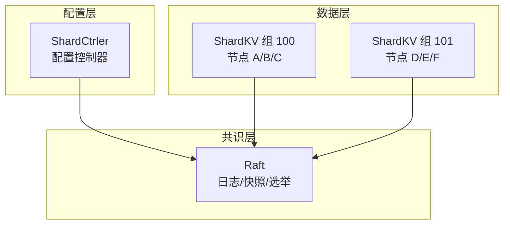
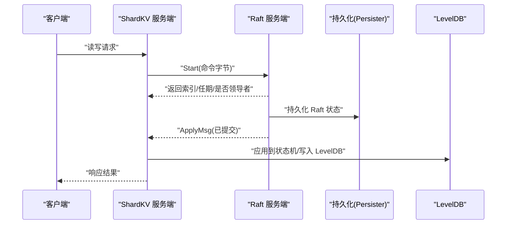
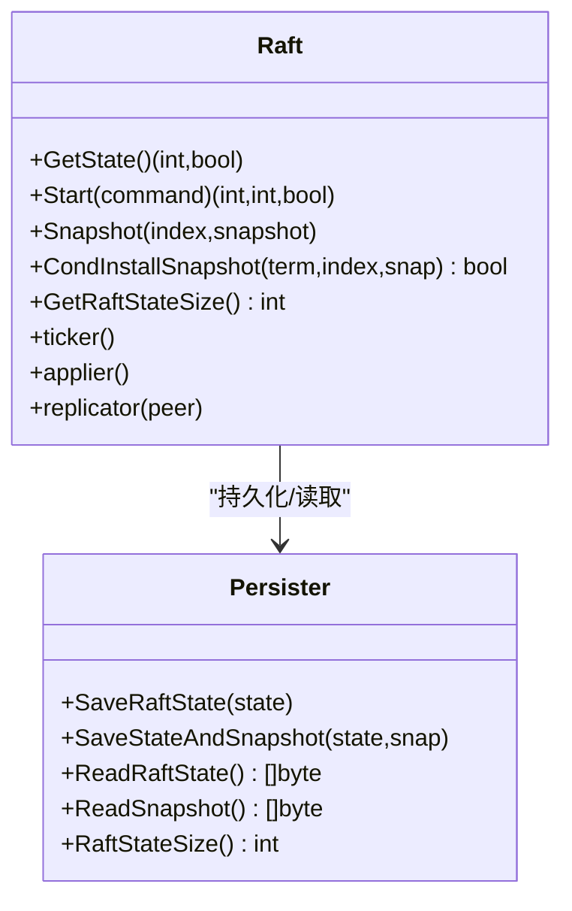
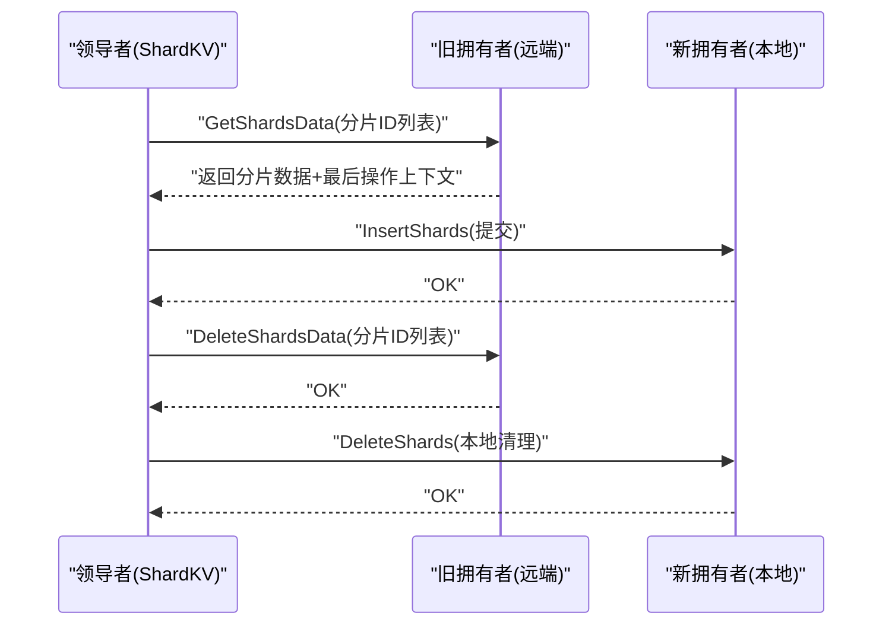
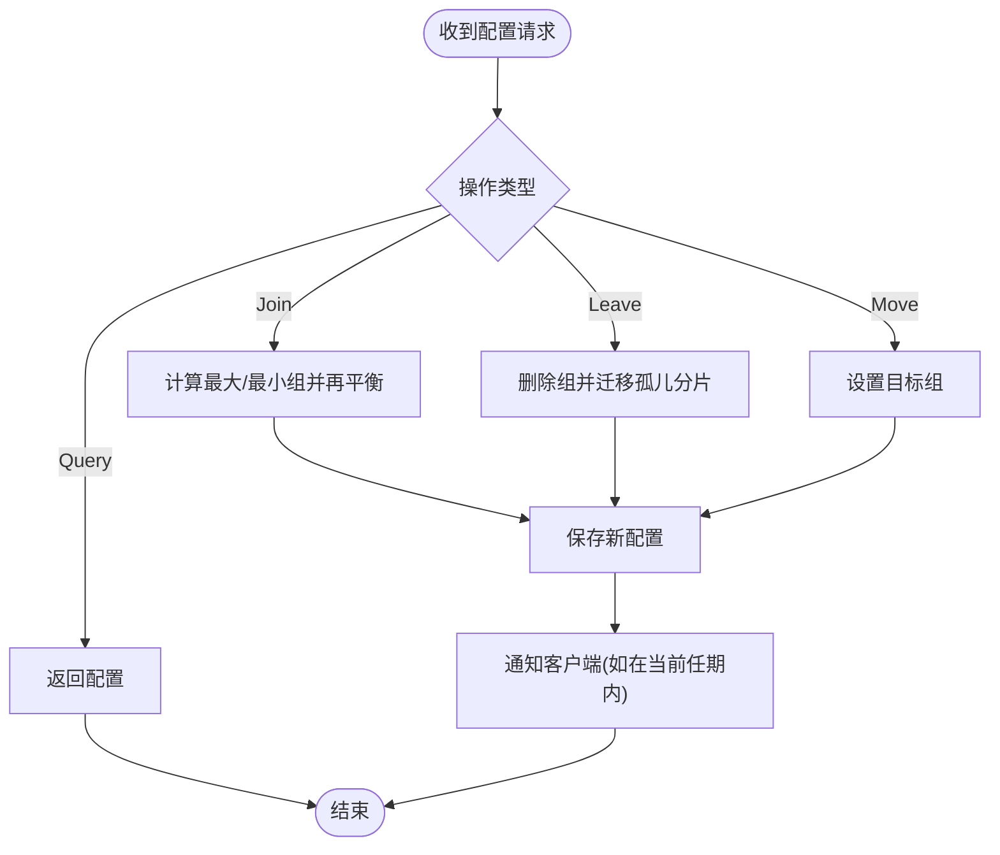
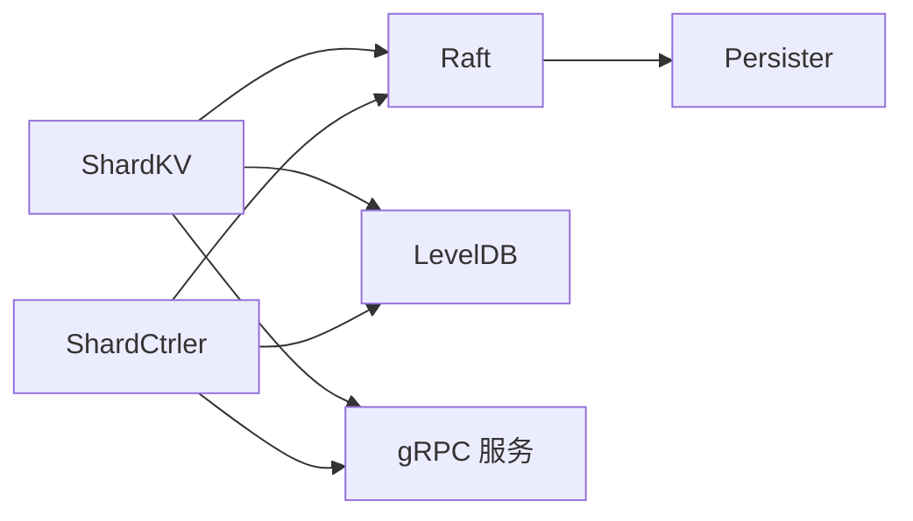

# 维护与故障排查

**本文引用的文件**
- [README.md](file://README.md)
- [Home.md](file://wiki/Home.md)
- [Raft 核心实现（raft.go）](file://raft/raft.go)
- [Raft 持久化（persister.go）](file://raft/persister.go)
- [Raft 配置与定时器（util.go）](file://raft/util.go)
- [ShardKV 服务端（server.go）](file://shardkv/server.go)
- [ShardKV 公共常量与类型（common.go）](file://shardkv/common.go)
- [ShardCtrler 服务端（server.go）](file://shardctrler/server.go)
- [ShardCtrler 公共常量与类型（common.go）](file://shardctrler/common.go)
- [KV 服务入口（cmd/kvserver/main.go）](file://cmd/kvserver/main.go)
- [ShardKV 服务入口（cmd/shardkvserver/main.go）](file://cmd/shardkvserver/main.go)
- [Raft 测试配置（raft/config.go）](file://raft/config.go)
- [ShardCtrler 测试配置（shardctrler/config.go）](file://shardctrler/config.go)
- [构建与测试脚本（Makefile）](file://Makefile)
- [全量测试脚本（all-test.sh）](file://all-test.sh)
- [协议生成脚本（proto_gen.sh）](file://proto_gen.sh)

## 目录
1. [简介](#简介)
2. [项目结构](#项目结构)
3. [核心组件](#核心组件)
4. [架构总览](#架构总览)
5. [详细组件分析](#详细组件分析)
6. [依赖关系分析](#依赖关系分析)
7. [性能考量](#性能考量)
8. [故障排查指南](#故障排查指南)
9. [结论](#结论)
10. [附录](#附录)

## 简介
本文件面向 eRaft 运维团队，提供系统维护与故障排查的完整指南。内容覆盖日常维护任务（数据备份、系统巡检、性能调优）、常见故障类型与诊断流程（节点故障、网络分区、磁盘空间不足、配置错误）、故障恢复方案（节点重启、数据修复、配置回滚、集群重建）、扩容缩容操作（新增节点、数据迁移、负载均衡调整）、紧急响应流程（报警、影响评估、快速修复）、调试工具使用（日志分析、性能分析、网络诊断）、运维自动化与监控告警配置，以及故障案例与经验总结。

## 项目结构
eRaft 是一个基于 Raft 的分布式分片键值存储系统，采用 gRPC 作为跨节点通信协议，并以 LevelDB 作为持久化存储引擎。系统由三类核心组件构成：
- 配置控制器（ShardCtrler）：负责维护分片到副本组的映射，提供 join/leave/move/query 等配置变更接口。
- 分片键值服务（ShardKV）：每个副本组内运行多个节点，负责实际数据的读写、分片迁移与垃圾回收。
- 基础共识层（Raft）：提供日志复制、领导者选举、快照与提交推进等能力。

图表来源
- [ShardKV 服务端（server.go）](file://shardkv/server.go#L759-L799)
- [ShardCtrler 服务端（server.go）](file://shardctrler/server.go#L324-L343)
- [Raft 核心实现（raft.go）](file://raft/raft.go#L689-L725)

章节来源
- [README.md](file://README.md#L1-L139)
- [Home.md](file://wiki/Home.md#L1-L20)

## 核心组件
- Raft 共识引擎
  - 负责日志复制、领导者选举、心跳与选举超时、快照与日志裁剪、提交推进与应用。
  - 关键状态字段：当前任期、投票给谁、日志数组、提交索引、已应用索引、nextIndex/matchIndex、状态机（跟随者/候选人/领导者）。
  - 关键机制：随机选举超时、稳定心跳周期、多数派复制、基于 matchIndex 的提交推进。
- ShardKV 数据层
  - 基于 Raft 的状态机，负责处理读写请求、配置更新、分片拉取与垃圾回收、空日志保活、快照与恢复。
  - 关键状态：当前/上一配置、分片状态（Serving/Pulling/BePulling/GCing）、最后操作上下文、通知通道。
  - 关键流程：配置轮询、迁移检测与拉取、远程删除触发本地清理。
- ShardCtrler 配置层
  - 基于 Raft 的状态机，维护分片到组的映射，提供 join/leave/move/query 接口。
  - 关键状态：配置计数、最新配置、历史配置存储。
  - 关键算法：负载均衡再分配（最大最小分片组迭代调整）。

章节来源
- [Raft 核心实现（raft.go）](file://raft/raft.go#L36-L106)
- [Raft 配置与定时器（util.go）](file://raft/util.go#L84-L95)
- [ShardKV 服务端（server.go）](file://shardkv/server.go#L76-L108)
- [ShardKV 公共常量与类型（common.go）](file://shardkv/common.go#L21-L27)
- [ShardCtrler 服务端（server.go）](file://shardctrler/server.go#L17-L31)
- [ShardCtrler 公共常量与类型（common.go）](file://shardctrler/common.go#L26-L43)

## 架构总览
eRaft 的运行时架构如下：
- 客户端通过 shardkvclient/shardctrlerclient 与对应 gRPC 服务交互。
- 每个 ShardKV 组内的节点通过 gRPC 与 Raft 服务互通，执行日志复制与快照安装。
- ShardCtrler 通过 Raft 维护全局配置；ShardKV 组定期查询配置并驱动分片迁移与 GC。

图表来源
- [ShardKV 服务端（server.go）](file://shardkv/server.go#L129-L157)
- [Raft 核心实现（raft.go）](file://raft/raft.go#L581-L591)
- [Raft 持久化（persister.go）](file://raft/persister.go#L71-L82)

章节来源
- [ShardKV 服务端（server.go）](file://shardkv/server.go#L759-L799)
- [Raft 核心实现（raft.go）](file://raft/raft.go#L689-L725)

## 详细组件分析

### Raft 组件分析
- 角色与状态
  - 跟随者：接收心跳/日志，超时触发选举。
  - 候选人：发起选举，等待投票结果。
  - 领导者：发送心跳与日志，推进复制与提交。
- 日志与快照
  - 日志持久化与裁剪，快照保存 Raft 状态与用户快照。
  - 条件安装快照（CondInstallSnapshot）保证一致性窗口。
- 提交推进
  - 基于 matchIndex 的多数派推进，仅允许当前任期内的日志被提交。
- 应用与复制
  - 单独的 applier goroutine 保证每条日志只应用一次。
  - 复制器 goroutine 批量复制，必要时回退冲突索引。

图表来源
- [Raft 核心实现（raft.go）](file://raft/raft.go#L64-L106)
- [Raft 持久化（persister.go）](file://raft/persister.go#L71-L110)

章节来源
- [Raft 核心实现（raft.go）](file://raft/raft.go#L36-L106)
- [Raft 持久化（persister.go）](file://raft/persister.go#L17-L110)

### ShardKV 组件分析
- 状态机与配置
  - 当前/上一配置、分片状态机（Serving/Pulling/BePulling/GCing）、最后操作上下文用于去重。
- 请求处理
  - 非领导者直接返回错误；重复请求直接返回上次响应；不可服务的分片返回错误。
  - 写操作通过 Raft 同步复制，读操作直接从本地状态机返回。
- 迁移与 GC
  - 拉取阶段：从旧拥有者批量拉取分片数据与最后操作上下文。
  - 垃圾回收阶段：通知旧拥有者删除过期数据，本地清理未完成的拉取状态。
- 快照与恢复
  - 将 LevelDB 全量数据编码为快照，结合 Raft 状态进行原子保存与恢复。

图表来源
- [ShardKV 服务端（server.go）](file://shardkv/server.go#L159-L217)
- [ShardKV 服务端（server.go）](file://shardkv/server.go#L572-L696)

章节来源
- [ShardKV 服务端（server.go）](file://shardkv/server.go#L105-L157)
- [ShardKV 服务端（server.go）](file://shardkv/server.go#L347-L405)
- [ShardKV 公共常量与类型（common.go）](file://shardkv/common.go#L70-L91)

### ShardCtrler 组件分析
- 配置管理
  - Join：加入新组并重新平衡分片。
  - Leave：移除组并将分片迁移到其他组。
  - Move：手动迁移单一分片。
  - Query：查询指定编号或最新配置。
- 状态机
  - 基于 LevelDB 存储配置历史，支持查询最新配置。
- 去重与通知
  - 客户端幂等：根据最后操作上下文避免重复执行。

图表来源
- [ShardCtrler 服务端（server.go）](file://shardctrler/server.go#L84-L151)
- [ShardCtrler 公共常量与类型（common.go）](file://shardctrler/common.go#L108-L140)

章节来源
- [ShardCtrler 服务端（server.go）](file://shardctrler/server.go#L179-L215)
- [ShardCtrler 服务端（server.go）](file://shardctrler/server.go#L250-L313)

## 依赖关系分析
- 组件耦合
  - ShardKV 依赖 Raft 实现日志复制与快照；依赖 ShardCtrler 获取配置。
  - ShardCtrler 依赖 Raft 实现配置变更的一致性；依赖 LevelDB 存储配置历史。
  - Raft 依赖 Persister 进行状态与快照的持久化。
- 外部依赖
  - gRPC：节点间通信与客户端接入。
  - LevelDB：键值数据与配置的持久化存储。
- 可能的循环依赖
  - 代码层面未见循环导入；ShardKV 与 ShardCtrler 通过 RPC 交互，不直接相互导入。

图表来源
- [ShardKV 服务端（server.go）](file://shardkv/server.go#L759-L799)
- [ShardCtrler 服务端（server.go）](file://shardctrler/server.go#L324-L343)
- [Raft 持久化（persister.go）](file://raft/persister.go#L17-L110)

章节来源
- [ShardKV 服务端（server.go）](file://shardkv/server.go#L759-L799)
- [ShardCtrler 服务端（server.go）](file://shardctrler/server.go#L324-L343)
- [Raft 持久化（persister.go）](file://raft/persister.go#L17-L110)

## 性能考量
- 快照与日志裁剪
  - 当 Raft 状态大小超过阈值时触发快照，减少日志长度与恢复时间。
  - 建议：根据磁盘与内存资源设定合理的 maxRaftState 阈值，定期评估快照频率。
- 提交推进与复制
  - 基于 matchIndex 的多数派推进，确保高吞吐下的安全性。
  - 建议：保持多数节点在线，避免因少数节点落后导致提交停滞。
- 空日志保活
  - 领导者在当前任期内周期性提交空日志，防止“活锁”导致提交停滞。
  - 建议：监控空日志提交间隔，异常升高可能指示网络或节点问题。
- 磁盘 I/O
  - LevelDB 写放大与 Compaction 对性能影响较大，建议：
    - 使用 SSD；
    - 合理设置缓存与压缩参数；
    - 定期检查磁盘空间与 IOPS。
- 网络延迟
  - 心跳与选举超时对网络抖动敏感，建议：
    - 降低跨机房部署；
    - 使用低延迟网络；
    - 避免高负载与丢包。

章节来源
- [ShardKV 服务端（server.go）](file://shardkv/server.go#L463-L484)
- [ShardKV 公共常量与类型（common.go）](file://shardkv/common.go#L21-L27)
- [Raft 配置与定时器（util.go）](file://raft/util.go#L84-L95)

## 故障排查指南

### 日常维护任务
- 数据备份策略
  - 快照备份：定期触发快照，结合持久化目录打包归档。
  - 磁盘级备份：对 LevelDB 数据目录与 Raft 状态目录进行周期性快照。
  - 建议：至少保留最近 7 天的增量快照与 1 份全量快照。
- 系统巡检清单
  - 集群健康：确认所有节点可互相连通，gRPC 端口开放。
  - Raft 状态：检查领导者存在、任期递增、提交进度正常。
  - 分片状态：确认各组分片状态均为 Serving，无 Pulling/GCing 长时间停留。
  - 磁盘空间：监控磁盘使用率，预留至少 30% 可用空间。
  - 日志级别：生产环境关闭 Debug 输出，避免 I/O 放大。
- 性能调优方法
  - 调整快照阈值：根据日志增长速率与恢复时间目标优化 maxRaftState。
  - 网络优化：缩短跨机房距离，减少丢包与延迟。
  - 存储优化：SSD + 合理的 LevelDB 参数；避免过度写入。

章节来源
- [ShardKV 服务端（server.go）](file://shardkv/server.go#L463-L484)
- [Raft 持久化（persister.go）](file://raft/persister.go#L71-L110)

### 常见故障类型与诊断流程
- 节点故障
  - 症状：该节点无法参与多数派，集群无法提交；日志复制停滞。
  - 诊断：检查 gRPC 是否可达、进程是否存活、日志中是否有连接失败。
  - 处理：优先恢复节点；若长时间不可恢复，执行 Leave 或配置变更让出分片。
- 网络分区
  - 症状：领导者心跳超时，频繁选举；配置更新阻塞。
  - 诊断：使用网络分区工具模拟与验证；检查分区两侧的领导者状态。
  - 处理：尽快恢复网络；必要时强制隔离少数派以维持一致性。
- 磁盘空间不足
  - 症状：写入失败、快照失败、节点崩溃。
  - 诊断：检查磁盘使用率与 inode；观察快照与日志大小。
  - 处理：清理旧快照与日志；扩大磁盘；调整快照阈值。
- 配置错误
  - 症状：分片状态异常、读写返回错误、迁移卡住。
  - 诊断：检查配置编号与映射；确认 ShardCtrler 正常运行。
  - 处理：修正配置（Join/Leave/Move），必要时回滚到上一有效配置。

章节来源
- [ShardKV 服务端（server.go）](file://shardkv/server.go#L110-L127)
- [ShardKV 服务端（server.go）](file://shardkv/server.go#L347-L358)
- [ShardCtrler 服务端（server.go）](file://shardctrler/server.go#L84-L151)

### 故障恢复方案
- 节点重启
  - 步骤：停止进程 → 恢复磁盘空间 → 启动服务 → 等待 Raft 恢复 → 观察日志与状态。
  - 注意：重启后会加载上次持久化的 Raft 状态与快照，确保目录权限正确。
- 数据修复
  - 快照修复：从其他节点拷贝快照与 Raft 状态，重启后自动恢复。
  - 分片修复：通过 ShardCtrler 的 Move 或 Join/Leave 触发重新分配与迁移。
- 配置回滚
  - 使用 ShardCtrler 的 Query 获取上一配置，确保一致性窗口内提交。
- 集群重建
  - 清理旧状态与快照 → 重新初始化 ShardCtrler → 注册初始组 → 启动 ShardKV 组 → 触发首次配置。

章节来源
- [Raft 持久化（persister.go）](file://raft/persister.go#L34-L54)
- [ShardCtrler 服务端（server.go）](file://shardctrler/server.go#L153-L159)

### 扩容缩容操作
- 新节点添加
  - 在 ShardCtrler 中执行 Join，系统自动再平衡分片。
  - ShardKV 组内新增节点会自动参与 Raft 选举与日志复制。
- 数据迁移
  - 领导者检测到配置变化后，进入 Pulling 状态并从旧拥有者拉取数据。
  - 完成后进入 GCing，通知旧拥有者删除过期数据。
- 负载均衡调整
  - 通过 Move 手动迁移热点分片，或等待 Join/Leave 自动再平衡。

章节来源
- [ShardKV 服务端（server.go）](file://shardkv/server.go#L430-L445)
- [ShardKV 服务端（server.go）](file://shardkv/server.go#L572-L696)
- [ShardCtrler 服务端（server.go）](file://shardctrler/server.go#L84-L151)

### 紧急响应流程
- 故障报警
  - 监控项：Leader 存在性、日志提交速率、分片状态、磁盘使用率、gRPC 错误率。
  - 告警阈值：Leader 缺失超时、提交停滞、分片长时间处于非 Serving。
- 影响评估
  - 评估范围：受影响的分片、读写延迟、可用性级别。
  - 优先级：数据一致性优先，其次可用性，最后性能。
- 快速修复
  - 立即：恢复网络与磁盘空间；重启故障节点；回滚配置。
  - 后续：分析日志与快照，优化参数与容量规划。

章节来源
- [ShardKV 服务端（server.go）](file://shardkv/server.go#L105-L108)
- [ShardCtrler 服务端（server.go）](file://shardctrler/server.go#L319-L322)

### 调试工具使用指南
- 日志分析
  - 开启 Debug 输出（开发环境），收集节点日志，定位状态切换与复制异常。
  - 关注：领导者切换、冲突回退、快照安装、配置更新。
- 性能分析
  - 使用 pprof 收集 CPU/内存/阻塞分析，识别热点函数与阻塞点。
  - 结合 Raft 定时器与复制器 goroutine 行为，判断是否存在复制风暴或心跳异常。
- 网络诊断
  - 使用 telnet/nc 验证 gRPC 端口连通性。
  - 使用抓包工具分析 RPC 调用与超时原因。

章节来源
- [Raft 配置与定时器（util.go）](file://raft/util.go#L12-L19)
- [Raft 核心实现（raft.go）](file://raft/raft.go#L616-L635)

### 运维自动化与监控告警
- 自动化脚本
  - 构建与测试：使用 Makefile 一键编译与测试。
  - 协议生成：使用 proto_gen.sh 生成 gRPC 代码。
  - 全量测试：使用 all-test.sh 并行执行所有模块测试。
- 监控告警
  - 指标：Leader 存在性、日志提交速率、分片状态分布、磁盘使用率、快照大小。
  - 告警：Leader 缺失、提交停滞、分片异常、磁盘不足、网络异常。

章节来源
- [构建与测试脚本（Makefile）](file://Makefile#L29-L50)
- [全量测试脚本（all-test.sh）](file://all-test.sh#L1-L8)
- [协议生成脚本（proto_gen.sh）](file://proto_gen.sh#L1-L10)

### 故障案例与经验总结
- 案例 1：网络分区导致频繁选举
  - 现象：日志提交停滞，领导者反复切换。
  - 处理：恢复网络分区，等待多数派恢复；必要时隔离少数派。
- 案例 2：磁盘空间不足引发写入失败
  - 现象：写入报错，节点崩溃重启。
  - 处理：清理旧快照与日志，扩容磁盘，调整快照阈值。
- 案例 3：配置错误导致分片状态异常
  - 现象：部分分片不可服务，读写返回错误。
  - 处理：修正配置（Join/Leave/Move），等待迁移完成。

章节来源
- [ShardKV 服务端（server.go）](file://shardkv/server.go#L110-L127)
- [ShardKV 服务端（server.go）](file://shardkv/server.go#L347-L358)
- [ShardCtrler 服务端（server.go）](file://shardctrler/server.go#L84-L151)

## 结论
eRaft 通过 Raft 提供强一致性的日志复制与领导者选举，结合分片与动态配置实现了高可用与可扩展的键值存储。运维侧应重点关注快照与日志裁剪、磁盘与网络资源、配置一致性与迁移过程中的状态监控。通过完善的备份策略、巡检清单、性能调优与自动化脚本，可显著提升系统的稳定性与可维护性。

## 附录
- 快速启动与监控参考
  - 启动顺序与命令示例可参考项目 README 的“快速开始”与“集群监控”章节。
- 服务入口参数
  - ShardKV 服务入口支持 -id/-gid/-cluster/-ctrlers/-db 参数，便于多组与多节点部署。
  - KV 服务入口支持 -id/-addrs/-db 参数，便于单组 Raft 测试。

章节来源
- [README.md](file://README.md#L51-L128)
- [ShardKV 服务入口（cmd/shardkvserver/main.go）](file://cmd/shardkvserver/main.go#L18-L58)
- [KV 服务入口（cmd/kvserver/main.go）](file://cmd/kvserver/main.go#L16-L47)