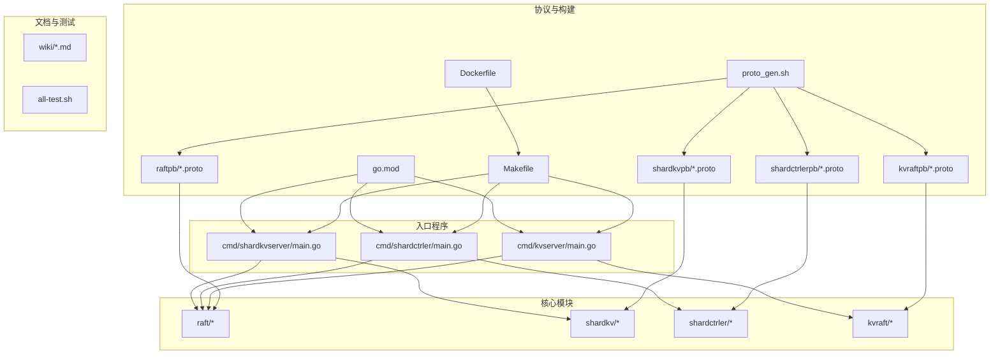
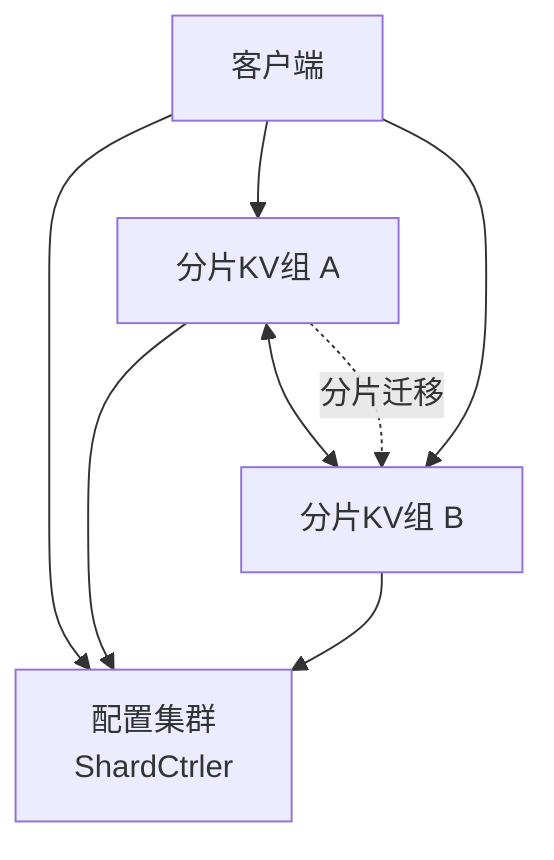
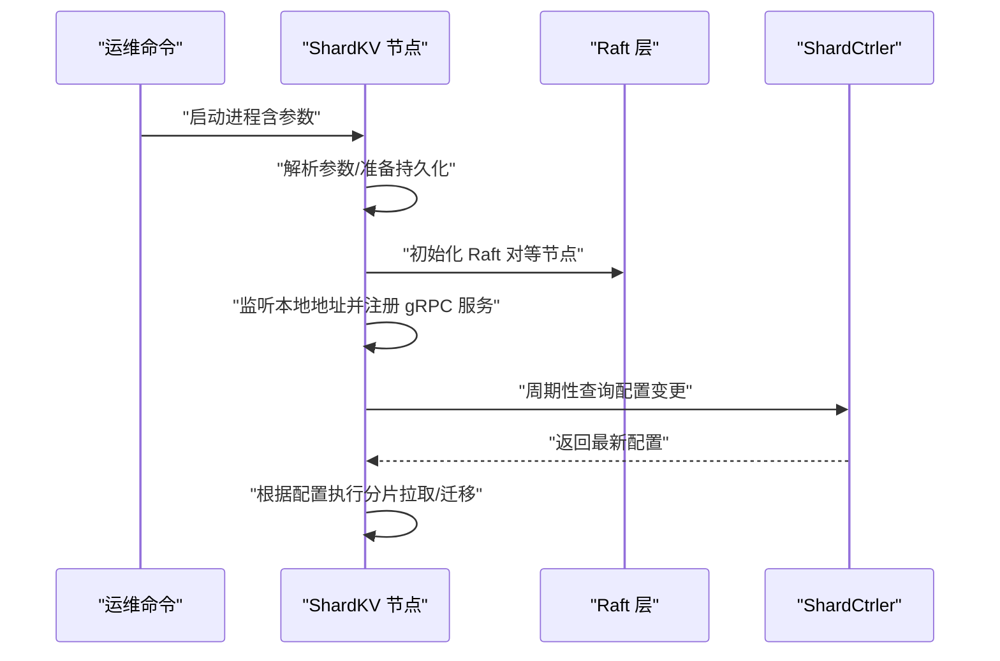
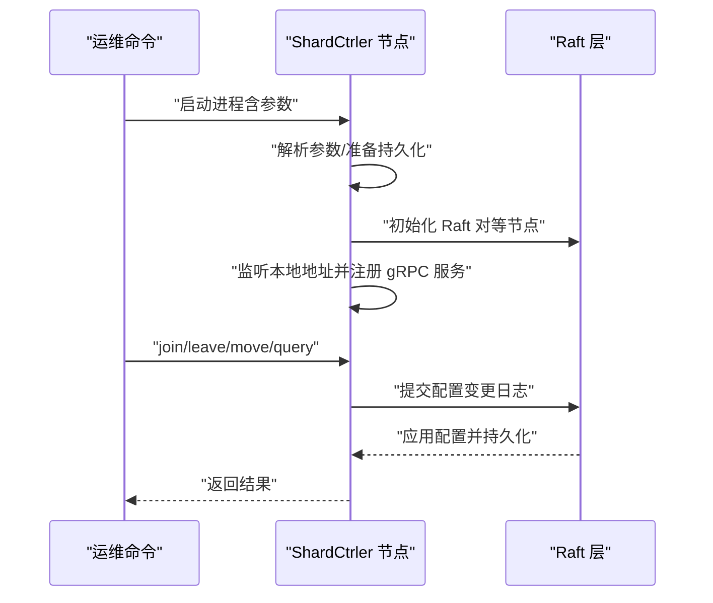
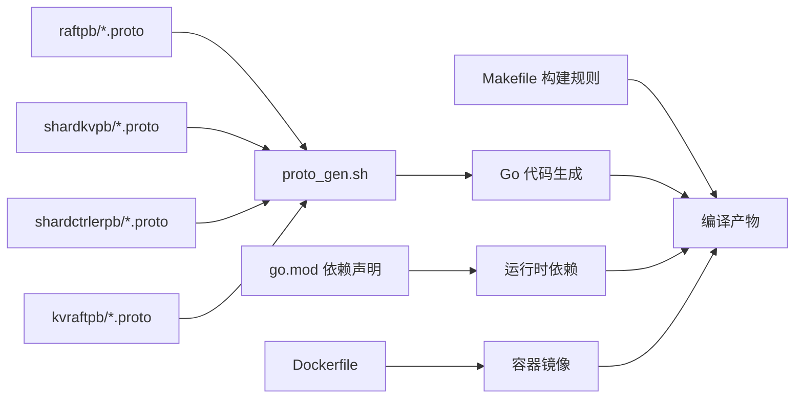

# 部署与运维

**本文引用的文件**
- [README.md](file://README.md)
- [Dockerfile](file://Dockerfile)
- [Makefile](file://Makefile)
- [cmd/shardkvserver/main.go](file://cmd/shardkvserver/main.go)
- [cmd/shardctrler/main.go](file://cmd/shardctrler/main.go)
- [cmd/kvserver/main.go](file://cmd/kvserver/main.go)
- [raft/config.go](file://raft/config.go)
- [shardkv/config.go](file://shardkv/config.go)
- [shardctrler/config.go](file://shardctrler/config.go)
- [kvraft/config.go](file://kvraft/config.go)
- [wiki/Architecture.md](file://wiki/Architecture.md)
- [wiki/Benchmark.md](file://wiki/Benchmark.md)
- [go.mod](file://go.mod)
- [proto_gen.sh](file://proto_gen.sh)
- [all-test.sh](file://all-test.sh)

## 目录
1. [简介](#简介)
2. [项目结构](#项目结构)
3. [核心组件](#核心组件)
4. [架构总览](#架构总览)
5. [详细组件分析](#详细组件分析)
6. [依赖关系分析](#依赖关系分析)
7. [性能考量](#性能考量)
8. [故障排查指南](#故障排查指南)
9. [结论](#结论)
10. [附录](#附录)

## 简介
本文件面向生产环境的部署与运维，围绕 eRaft 分布式分片键值存储系统，提供从单机到容器化、Kubernetes 集成的部署建议；解释监控、日志与告警的落地方式；给出扩缩容、滚动升级与故障恢复策略；覆盖安全、访问控制与数据加密要点；并提供性能监控、资源调度与容量管理方法，以及备份恢复、灾难演练与业务连续性保障路径。

## 项目结构
仓库采用按功能模块划分的组织方式：入口程序位于 cmd/*，核心共识与分片逻辑在 raft/*、shardkv/*、shardctrler/*、kvraft/*，协议通过 proto 文件生成 pb 代码，测试与构建脚本集中在根目录。

图表来源
- [cmd/shardkvserver/main.go](file://cmd/shardkvserver/main.go#L1-L59)
- [cmd/shardctrler/main.go](file://cmd/shardctrler/main.go#L1-L57)
- [cmd/kvserver/main.go](file://cmd/kvserver/main.go#L1-L48)
- [raft/config.go](file://raft/config.go#L1-L594)
- [shardkv/config.go](file://shardkv/config.go#L1-L396)
- [shardctrler/config.go](file://shardctrler/config.go#L1-L364)
- [kvraft/config.go](file://kvraft/config.go#L1-L434)
- [proto_gen.sh](file://proto_gen.sh#L1-L10)
- [go.mod](file://go.mod#L1-L22)
- [Makefile](file://Makefile#L1-L84)
- [Dockerfile](file://Dockerfile#L1-L9)
- [wiki/Architecture.md](file://wiki/Architecture.md#L1-L29)

章节来源
- [README.md](file://README.md#L1-L139)
- [Makefile](file://Makefile#L1-L84)
- [Dockerfile](file://Dockerfile#L1-L9)
- [go.mod](file://go.mod#L1-L22)

## 核心组件
- 入口程序与参数
  - ShardKV 节点：支持节点 id、组 id、组内地址列表、控制器地址列表、数据库路径等参数，启动 gRPC 服务并注册 ShardKV 与 Raft 服务端。
  - ShardCtrler 节点：支持节点 id、集群地址列表、数据库路径等参数，启动 gRPC 服务并注册 ShardCtrler 与 Raft 服务端。
  - KVServer（单租户 Raft KV）：支持节点 id、地址列表、数据库路径等参数，启动 gRPC 服务并注册 Raft 与 KV 服务端。
- 存储与持久化
  - 使用 LevelDB 作为后端存储，Raft 日志与快照通过文件持久化器保存。
- 协议与生成
  - 通过 proto 文件生成 gRPC 代码，构建脚本统一安装 protoc 插件并执行生成。

章节来源
- [cmd/shardkvserver/main.go](file://cmd/shardkvserver/main.go#L1-L59)
- [cmd/shardctrler/main.go](file://cmd/shardctrler/main.go#L1-L57)
- [cmd/kvserver/main.go](file://cmd/kvserver/main.go#L1-L48)
- [raft/config.go](file://raft/config.go#L1-L594)
- [proto_gen.sh](file://proto_gen.sh#L1-L10)

## 架构总览
eRaft 由三层组成：共识层（Raft）、配置层（ShardCtrler）、存储层（ShardKV）。客户端通过 ShardCtrler 查询当前配置，再向对应 ShardKV 组发起读写请求；ShardKV 组内部通过 Raft 保证强一致。

图表来源
- [wiki/Architecture.md](file://wiki/Architecture.md#L1-L29)

## 详细组件分析

### ShardKV 组件（分片存储）
- 启动流程
  - 解析参数：节点 id、组 id、组内地址列表、控制器地址列表、数据库路径。
  - 构建 Raft 对等节点（gRPC 客户端），初始化持久化器，启动 ShardKV 服务。
  - 监听本地地址，注册 ShardKV 与 Raft 的 gRPC 服务端。
- 运维要点
  - 每个节点独立的数据库目录，避免跨节点共享状态。
  - 组内节点地址列表必须与实际监听地址一一对应，避免通信失败。
  - 控制器地址列表用于查询配置与参与迁移决策。

图表来源
- [cmd/shardkvserver/main.go](file://cmd/shardkvserver/main.go#L1-L59)
- [shardkv/config.go](file://shardkv/config.go#L1-L396)

章节来源
- [cmd/shardkvserver/main.go](file://cmd/shardkvserver/main.go#L1-L59)
- [shardkv/config.go](file://shardkv/config.go#L1-L396)

### ShardCtrler 组件（配置管理）
- 启动流程
  - 解析参数：节点 id、集群地址列表、数据库路径。
  - 构建 Raft 对等节点，初始化持久化器，启动 ShardCtrler 服务。
  - 监听本地地址，注册 ShardCtrler 与 Raft 的 gRPC 服务端。
- 运维要点
  - 保持最小奇数节点（如 3）以满足多数派要求。
  - 数据库路径需可写且具备足够空间，避免快照与日志增长导致磁盘耗尽。

图表来源
- [cmd/shardctrler/main.go](file://cmd/shardctrler/main.go#L1-L57)
- [shardctrler/config.go](file://shardctrler/config.go#L1-L364)

章节来源
- [cmd/shardctrler/main.go](file://cmd/shardctrler/main.go#L1-L57)
- [shardctrler/config.go](file://shardctrler/config.go#L1-L364)

### KVServer 组件（单租户 Raft KV）
- 启动流程
  - 解析参数：节点 id、地址列表、数据库路径。
  - 构建 Raft 对等节点，初始化持久化器，启动 KV 服务。
  - 监听本地地址，注册 Raft 与 KV 的 gRPC 服务端。
- 运维要点
  - 适用于非分片场景或测试验证，生产建议优先使用 ShardKV。

章节来源
- [cmd/kvserver/main.go](file://cmd/kvserver/main.go#L1-L48)
- [kvraft/config.go](file://kvraft/config.go#L1-L434)

### Raft 持久化与快照
- 关键点
  - 使用文件持久化器保存 Raft 状态与快照，避免内存态丢失。
  - 测试配置中包含定期快照与日志大小检查，生产应结合磁盘容量与 I/O 性能设置阈值。
- 建议
  - 定期校验快照与日志大小，防止磁盘膨胀。
  - 在升级前确保快照可用，升级后验证日志回放正确性。

章节来源
- [raft/config.go](file://raft/config.go#L1-L594)

## 依赖关系分析
- 构建与运行时依赖
  - gRPC 与 Protobuf：用于服务间通信与序列化。
  - zap：日志库（可在生产中启用结构化日志）。
  - goleveldb：LevelDB 存储引擎。
- 构建链路
  - proto_gen.sh 安装 protoc 插件并生成各模块的 pb 代码。
  - Makefile 编译所有二进制并提供镜像构建与测试网络示例。

图表来源
- [proto_gen.sh](file://proto_gen.sh#L1-L10)
- [go.mod](file://go.mod#L1-L22)
- [Makefile](file://Makefile#L1-L84)
- [Dockerfile](file://Dockerfile#L1-L9)

章节来源
- [go.mod](file://go.mod#L1-L22)
- [proto_gen.sh](file://proto_gen.sh#L1-L10)
- [Makefile](file://Makefile#L1-L84)

## 性能考量
- 基准测试
  - 提供内置基准工具，支持随机键分布与顺序写入，输出总耗时与平均吞吐。
- 观察指标
  - 本地环境下典型吞吐约 150–300 req/s，受磁盘 I/O 与共识延迟影响显著。
- 优化建议
  - 使用 SSD 提升磁盘 I/O。
  - 未来版本可引入日志批处理以提升吞吐。
- 监控建议
  - 结合 gRPC 服务端指标（连接数、请求耗时、错误码）与 Raft 日志/快照大小趋势进行综合评估。

章节来源
- [wiki/Benchmark.md](file://wiki/Benchmark.md#L1-L26)

## 故障排查指南
- 常见问题定位
  - 参数不匹配：节点 id 越界、地址列表与监听地址不一致、数据库路径不可写。
  - 网络分区：使用配置层与存储层的健康检查命令核对连通性。
  - 快照与日志异常：检查持久化目录空间与权限，确认快照是否成功生成与应用。
- 工具与命令
  - 使用内置状态查询命令查看集群与节点状态。
  - 利用基准工具进行压力验证，定位瓶颈。
- 回滚与恢复
  - 升级前保留旧版本二进制与快照；升级失败时回退至上一稳定版本。
  - 通过快照与日志重建节点，确保数据一致性。

章节来源
- [README.md](file://README.md#L118-L139)
- [wiki/Benchmark.md](file://wiki/Benchmark.md#L1-L26)

## 结论
eRaft 提供了清晰的三层架构与完善的分片与配置管理能力。生产部署应重点关注：参数与网络配置的准确性、持久化与快照策略、监控与告警体系、滚动升级与故障恢复流程、安全与访问控制、以及性能与容量规划。遵循本文提供的步骤与建议，可有效降低运维复杂度并提升系统稳定性。

## 附录

### 生产环境部署流程（通用步骤）
- 准备阶段
  - 确认硬件与网络：节点间低延迟、高带宽；磁盘满足快照与日志增长需求。
  - 准备证书与密钥：为 gRPC 服务启用 TLS，并集中管理密钥轮换。
- 配置层（ShardCtrler）
  - 启动 3 节点集群，确保多数派可用。
  - 初始化数据库目录并赋予写权限。
- 存储层（ShardKV）
  - 按组启动多副本节点，每组至少 3 节点。
  - 为每个节点配置独立数据库目录，避免共享状态。
- 客户端接入
  - 使用配置层查询当前配置，向目标分片组发起读写请求。
- 监控与告警
  - 收集 gRPC 请求指标、Raft 日志/快照大小、磁盘使用率、CPU/内存占用。
  - 设置阈值告警与自动恢复预案。

章节来源
- [README.md](file://README.md#L51-L128)

### 容器化部署与 Kubernetes 集成
- 容器镜像
  - 使用根目录构建脚本生成二进制，基于精简基础镜像打包运行时。
  - Dockerfile 中已包含必要的构建工具与运行环境准备。
- Kubernetes 集成
  - 使用 Deployment 管理 ShardCtrler 与 ShardKV 组副本。
  - 使用 Headless Service 暴露组内节点，便于 Raft 互连。
  - 使用 ConfigMap/Secret 管理参数与证书。
  - 使用 PersistentVolume 保障数据持久化。
  - 使用 PodDisruptionBudget 保障升级期间的可用性。
- 参考脚本
  - Makefile 提供镜像构建与测试网络示例，可作为容器化参考。

章节来源
- [Dockerfile](file://Dockerfile#L1-L9)
- [Makefile](file://Makefile#L38-L84)

### 扩缩容、滚动升级与故障恢复
- 扩缩容
  - 加入新组：通过配置层 join 新组，触发分片重平衡。
  - 移除组：通过配置层 leave，确保数据迁移完成后再清理。
- 滚动升级
  - 逐节点停止旧版本，更新二进制后重启，等待成为跟随者并重新加入多数派。
  - 升级前备份快照，升级后验证日志回放与服务可用性。
- 故障恢复
  - 节点故障：替换为新节点，从最近快照恢复并等待日志补齐。
  - 磁盘故障：从其他副本恢复数据，必要时重建快照。
  - 配置异常：回滚到上一个稳定配置，修复后重新提交。

章节来源
- [README.md](file://README.md#L130-L139)
- [shardkv/config.go](file://shardkv/config.go#L317-L346)

### 安全配置、访问控制与数据加密
- 访问控制
  - 限制管理端口仅对可信网段开放；使用防火墙策略隔离配置层与存储层。
  - 为 gRPC 服务启用 TLS 并配置双向认证（mTLS）。
- 数据加密
  - 传输加密：强制启用 TLS；定期轮换证书与私钥。
  - 静态加密：在存储层启用磁盘加密（如 LUKS），并保护密钥材料。
- 最小权限
  - 运维账户仅授予必要操作权限；审计所有管理操作。

章节来源
- [go.mod](file://go.mod#L1-L22)

### 性能监控、资源调度与容量管理
- 指标采集
  - gRPC：请求 QPS、P95/P99 延迟、错误率、连接数。
  - Raft：日志长度、快照大小、提交延迟、心跳间隔。
  - 存储：磁盘 IOPS、队列深度、使用率、inode 使用率。
- 调度与容量
  - 将配置层与存储层节点分别置于不同可用区，避免单点故障。
  - 根据基准测试结果与历史峰值设定资源上限，预留 30%~50% 缓冲。
- 自动化
  - 使用告警平台联动自动化扩缩容与故障转移。

章节来源
- [wiki/Benchmark.md](file://wiki/Benchmark.md#L1-L26)

### 备份恢复、灾难演练与业务连续性
- 备份策略
  - 周期性生成快照并异地归档；定期校验快照完整性与可恢复性。
- 灾难演练
  - 定期进行跨机房切换演练，验证恢复时间与数据一致性。
- 业务连续性
  - 通过多活部署与自动故障转移，确保 RTO/RPO 满足业务要求。

章节来源
- [raft/config.go](file://raft/config.go#L183-L236)

### 运维工具使用与问题排查
- 常用命令
  - 状态查询：检查各节点与配置层状态。
  - 基准测试：评估吞吐与延迟，定位瓶颈。
- 排查流程
  - 确认网络连通性与参数一致性 → 检查持久化与快照 → 分析 gRPC 指标 → 定位具体模块（配置层/存储层） → 实施修复与验证。

章节来源
- [README.md](file://README.md#L118-L139)
- [all-test.sh](file://all-test.sh#L1-L8)