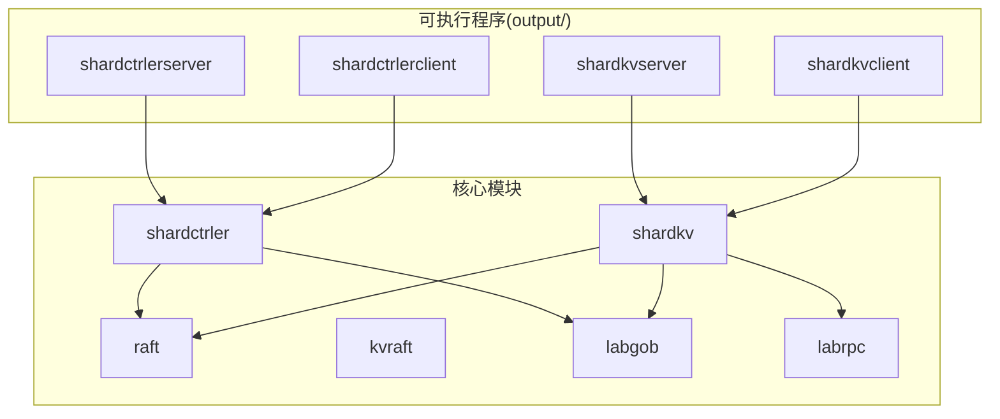
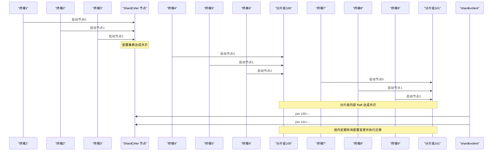
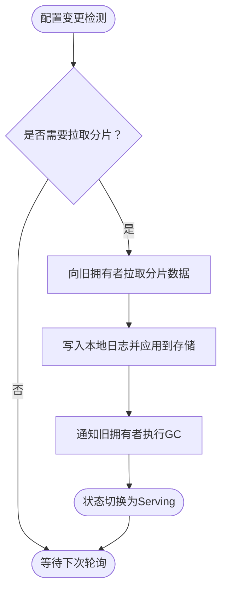
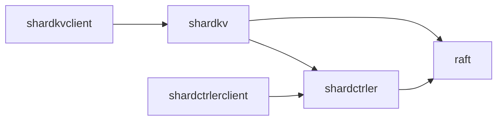

# 快速开始

**本文引用的文件**
- [README.md](file://README.md)
- [Makefile](file://Makefile)
- [go.mod](file://go.mod)
- [cmd/shardctrler/main.go](file://cmd/shardctrler/main.go)
- [cmd/shardkvserver/main.go](file://cmd/shardkvserver/main.go)
- [cmd/shardkvclient/main.go](file://cmd/shardkvclient/main.go)
- [cmd/shardctrlerclient/main.go](file://cmd/shardctrlerclient/main.go)
- [shardkv/server.go](file://shardkv/server.go)
- [shardctrler/server.go](file://shardctrler/server.go)
- [shardkv/common.go](file://shardkv/common.go)
- [shardctrler/common.go](file://shardctrler/common.go)
- [raft/config.go](file://raft/config.go)
- [models/kv.go](file://models/kv.go)

## 目录
1. [简介](#简介)
2. [项目结构](#项目结构)
3. [核心组件](#核心组件)
4. [架构总览](#架构总览)
5. [详细组件分析](#详细组件分析)
6. [依赖关系分析](#依赖关系分析)
7. [性能与容量建议](#性能与容量建议)
8. [故障排查指南](#故障排查指南)
9. [结论](#结论)
10. [附录](#附录)

## 简介
本指南面向首次接触 eRaft 的用户，帮助你在约 30 分钟内完成从零到一的完整体验：启动配置集群（ShardCtrler）、启动两个分片组（ShardKV Group 100 与 101）、向配置集群注册分片组、进行数据读写与基准测试，并掌握集群状态监控与常见问题排查。文档严格基于仓库现有实现，所有命令、参数与端口均来自源码与构建脚本。

## 项目结构
- 顶层通过 Makefile 提供一键编译，生成输出位于 output/ 目录，包含各子系统的二进制。
- 源码按功能域组织：raft、shardctrler、shardkv、kvraft、labrpc、labgob、porcupine、models 等。
- 命令行入口集中在 cmd/ 下，分别对应配置集群服务端、分片组服务端、配置客户端、分片组客户端等。

图表来源
- [Makefile](file://Makefile#L29-L36)
- [cmd/shardctrler/main.go](file://cmd/shardctrler/main.go#L1-L57)
- [cmd/shardkvserver/main.go](file://cmd/shardkvserver/main.go#L1-L59)
- [cmd/shardkvclient/main.go](file://cmd/shardkvclient/main.go#L1-L106)
- [cmd/shardctrlerclient/main.go](file://cmd/shardctrlerclient/main.go#L1-L103)

章节来源
- [Makefile](file://Makefile#L29-L36)
- [README.md](file://README.md#L43-L49)

## 核心组件
- 配置集群（ShardCtrler）：负责维护分片到副本组的映射，提供 join/leave/move/query 等管理能力。
- 分片组（ShardKV）：实际存储键值数据，基于 Raft 保证一致性；周期性从配置集群拉取最新配置，触发分片迁移与回收。
- 客户端工具：
  - shardkvclient：对上层提供 get/put/append/status/bench 等操作。
  - shardctrlerclient：对配置集群进行 join/leave/move/query/status 等操作。

章节来源
- [shardctrler/server.go](file://shardctrler/server.go#L1-L344)
- [shardkv/server.go](file://shardkv/server.go#L1-L800)
- [cmd/shardkvclient/main.go](file://cmd/shardkvclient/main.go#L1-L106)
- [cmd/shardctrlerclient/main.go](file://cmd/shardctrlerclient/main.go#L1-L103)

## 架构总览
下图展示了三阶段的启动流程与交互：配置集群启动 → 分片组启动 → 注册与数据迁移 → 客户端访问。

图表来源
- [README.md](file://README.md#L51-L98)
- [cmd/shardctrler/main.go](file://cmd/shardctrler/main.go#L18-L55)
- [cmd/shardkvserver/main.go](file://cmd/shardkvserver/main.go#L18-L57)
- [cmd/shardkvclient/main.go](file://cmd/shardkvclient/main.go#L14-L95)
- [cmd/shardctrlerclient/main.go](file://cmd/shardctrlerclient/main.go#L12-L91)

## 详细组件分析

### 第一阶段：配置集群启动（Step 1）
- 目标：启动 3 个 ShardCtrler 节点，形成配置管理集群。
- 关键参数
  - -id：节点编号（0/1/2）
  - -cluster：集群成员地址列表（逗号分隔）
  - -db：该节点 LevelDB 数据目录前缀
- 默认端口与目录
  - 成员地址默认使用 localhost:50051,50052,50053
  - 数据目录为 data/sc{id}
- 启动方式
  - 在三个终端分别执行三条命令，分别监听上述端口。

章节来源
- [README.md](file://README.md#L53-L66)
- [cmd/shardctrler/main.go](file://cmd/shardctrler/main.go#L18-L55)

### 第二阶段：分片组启动（Step 2）
- 目标：启动两个分片组（GID 100 与 101），每组 3 个节点。
- 关键参数
  - -id：组内节点编号（0/1/2）
  - -gid：组标识（如 100/101）
  - -cluster：本组成员地址列表（逗号分隔）
  - -ctrlers：配置集群地址列表（逗号分隔）
  - -db：该节点 LevelDB 数据目录前缀（会自动拼接 _{gid}_{id}）
- 默认端口与目录
  - GID 100：localhost:6001,6002,6003
  - GID 101：localhost:7001,7002,7003
  - 数据目录为 data/skv{gid}_{id}
- 启动方式
  - 在六个终端分别启动 GID 100 的三个节点；
  - 在另外六个终端分别启动 GID 101 的三个节点。

章节来源
- [README.md](file://README.md#L68-L86)
- [cmd/shardkvserver/main.go](file://cmd/shardkvserver/main.go#L18-L57)

### 第三阶段：组注册（Step 3）
- 目标：将两个分片组注册到配置集群，使系统进入可服务状态。
- 使用 shardctrlerclient 的 join 子命令，格式为：
  - join <gid>=<addr0>,<addr1>,<addr2>
- 示例
  - 注册 GID 100：join 100=localhost:6001,localhost:6002,localhost:6003
  - 注册 GID 101：join 101=localhost:7001,localhost:7002,localhost:7003

章节来源
- [README.md](file://README.md#L88-L98)
- [cmd/shardctrlerclient/main.go](file://cmd/shardctrlerclient/main.go#L26-L42)

### 数据读写与基准测试
- 读写操作
  - 使用 shardkvclient 进行 get/put/append
  - 示例命令已在 README 中给出
- 基准测试
  - shardkvclient bench <num> 将生成随机键值进行压力测试
  - 输出请求总数、耗时与吞吐

章节来源
- [README.md](file://README.md#L100-L116)
- [cmd/shardkvclient/main.go](file://cmd/shardkvclient/main.go#L67-L91)

### 集群监控
- ShardKV 集群状态
  - shardkvclient status：展示每个 GID-ID 节点的角色、任期、已应用/提交索引与存储大小
- 配置集群状态
  - shardctrlerclient status：展示配置集群节点的状态信息

章节来源
- [README.md](file://README.md#L118-L128)
- [cmd/shardkvclient/main.go](file://cmd/shardkvclient/main.go#L54-L66)
- [cmd/shardctrlerclient/main.go](file://cmd/shardctrlerclient/main.go#L76-L88)

### 分片迁移机制（概念流程）
- 配置更新后，分片组会检测到新配置并执行迁移：
  - 对于需要“拉取”的分片，从旧拥有者拉取数据；
  - 应用到本地 Raft 日志并写入 LevelDB；
  - 确认后通知旧拥有者删除过期数据（GC）。
- 该过程由分片组内部的监控循环周期性检查并推进。

图表来源
- [shardkv/server.go](file://shardkv/server.go#L549-L696)

## 依赖关系分析
- 构建与运行
  - Makefile 提供统一编译入口，生成 output/ 下的可执行文件
  - go.mod 声明了 grpc、protobuf、goleveldb 等依赖
- 组件耦合
  - shardkv 依赖 raft 提供一致性与持久化能力
  - shardctrler 也依赖 raft 实现配置状态机
  - shardkv 通过 gRPC 与 shardctrler 通信以查询最新配置
  - 客户端通过 shardkvclient/shardctrlerclient 与服务端交互

图表来源
- [go.mod](file://go.mod#L7-L21)
- [shardkv/server.go](file://shardkv/server.go#L759-L799)
- [shardctrler/server.go](file://shardctrler/server.go#L324-L343)

章节来源
- [Makefile](file://Makefile#L29-L36)
- [go.mod](file://go.mod#L7-L21)

## 性能与容量建议
- Raft 快照与日志压缩
  - shardkv 支持基于 Raft 状态大小的快照阈值控制（maxRaftState），可在启动参数中设置；-1 表示不启用快照
- 并发与轮询
  - 分片组内部有多个监控循环（配置轮询、迁移轮询、GC 轮询、空日志探测），默认周期在 common.go 中定义
- 压力测试
  - 使用 shardkvclient bench 可快速评估系统吞吐；建议先小规模压测（如 1000 请求）验证链路后再扩大规模

章节来源
- [shardkv/common.go](file://shardkv/common.go#L21-L27)
- [shardkv/server.go](file://shardkv/server.go#L759-L799)
- [cmd/shardkvclient/main.go](file://cmd/shardkvclient/main.go#L67-L91)

## 故障排查指南
- 常见错误与定位
  - ErrWrongGroup：当前节点不负责该分片，需重试或等待配置迁移完成
  - ErrWrongLeader：当前节点非领导者，客户端应重试或等待选举稳定
  - ErrTimeout：请求超时，检查网络连通性、端口占用与客户端重试策略
  - ErrOutDated：配置版本落后，等待配置轮询同步
- 端口与进程
  - 确认各节点监听端口未被占用（配置集群：50051/50052/50053；GID 100：6001/6002/6003；GID 101：7001/7002/7003）
- 数据目录
  - 确保 -db 指定的目录存在且具备读写权限；分片组会自动为每个节点创建 data/skv{gid}_{id} 目录
- 配置同步
  - 注册完成后，等待分片组内部轮询周期（约 50–100ms）检测到新配置并开始迁移
- 监控与诊断
  - 使用 status 命令查看节点角色、任期、已应用/提交索引与存储大小，辅助判断一致性与健康状况

章节来源
- [shardkv/common.go](file://shardkv/common.go#L38-L68)
- [shardctrler/common.go](file://shardctrler/common.go#L88-L106)
- [cmd/shardkvclient/main.go](file://cmd/shardkvclient/main.go#L54-L66)
- [cmd/shardctrlerclient/main.go](file://cmd/shardctrlerclient/main.go#L76-L88)

## 结论
按照本指南的三阶段流程，你可以在本地快速搭建起一个具备分片与动态配置能力的分布式键值系统。通过客户端工具完成数据读写与基准测试，并利用状态监控持续观察系统健康度。遇到问题时，结合错误码与状态输出进行定位，通常可快速恢复。

## 附录

### A. 一键编译与清理
- 编译全部组件：make build
- 清理输出：make clean

章节来源
- [Makefile](file://Makefile#L29-L36)
- [Makefile](file://Makefile#L55-L57)

### B. 端口与数据目录对照表
- 配置集群（ShardCtrler）
  - 成员端口：localhost:50051,50052,50053
  - 数据目录：data/sc{id}
- 分片组 GID 100
  - 成员端口：localhost:6001,6002,6003
  - 数据目录：data/skv100_{id}
- 分片组 GID 101
  - 成员端口：localhost:7001,7002,7003
  - 数据目录：data/skv101_{id}

章节来源
- [README.md](file://README.md#L53-L86)
- [cmd/shardctrler/main.go](file://cmd/shardctrler/main.go#L19-L21)
- [cmd/shardkvserver/main.go](file://cmd/shardkvserver/main.go#L21-L23)

### C. Raft 测试器配置（参考）
- 用于一致性与快照行为的测试器配置位于 raft/config.go，包含网络、可靠性、快照间隔等参数，便于深入理解 Raft 行为。

章节来源
- [raft/config.go](file://raft/config.go#L183-L236)