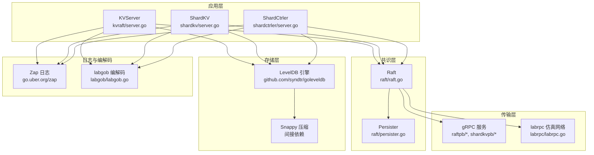
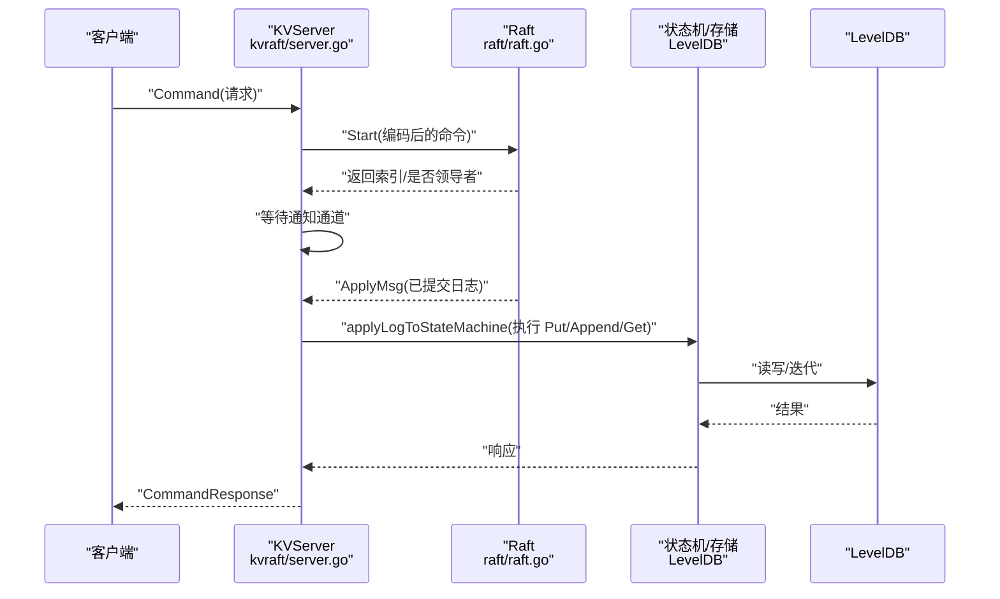
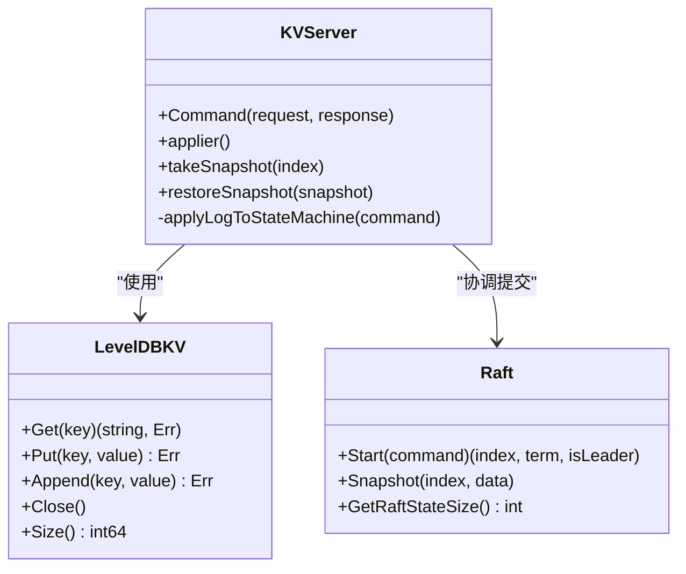
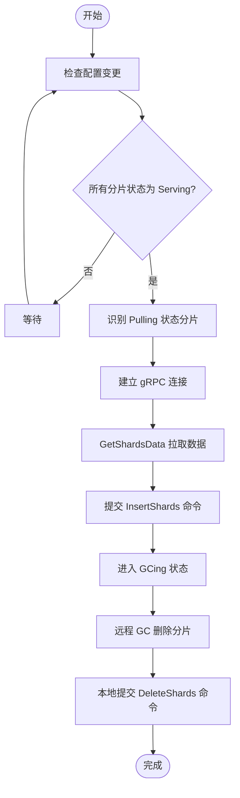
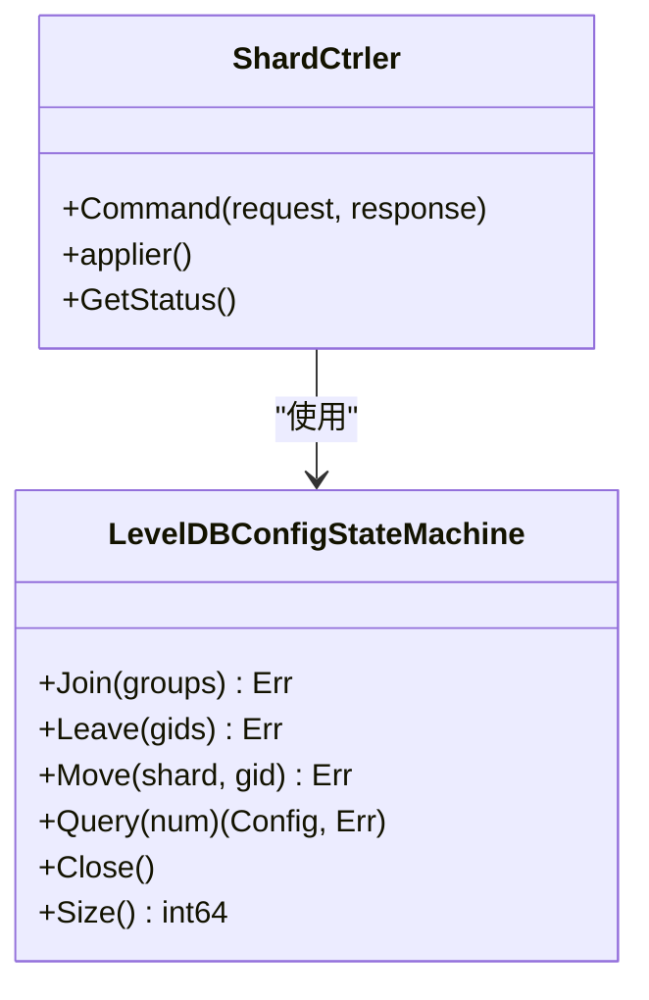
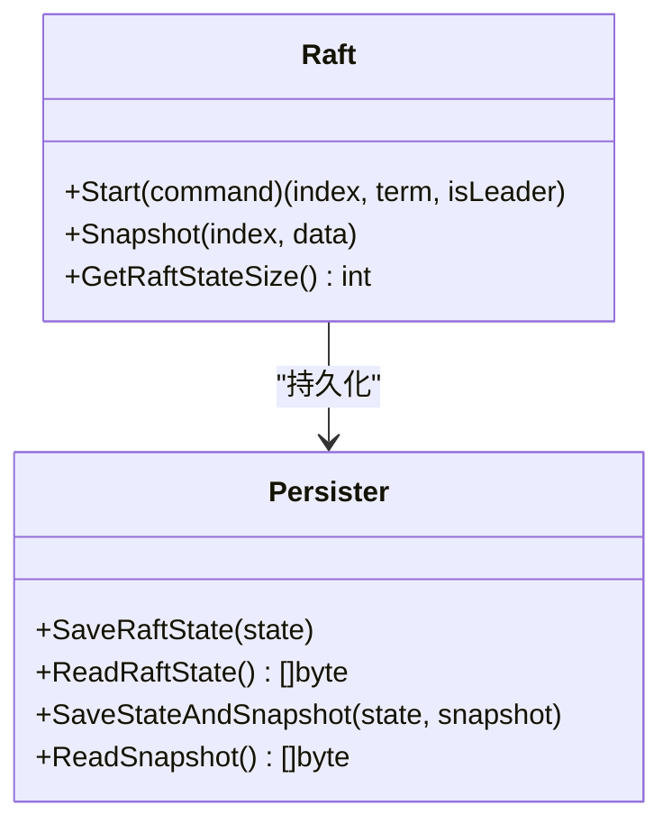
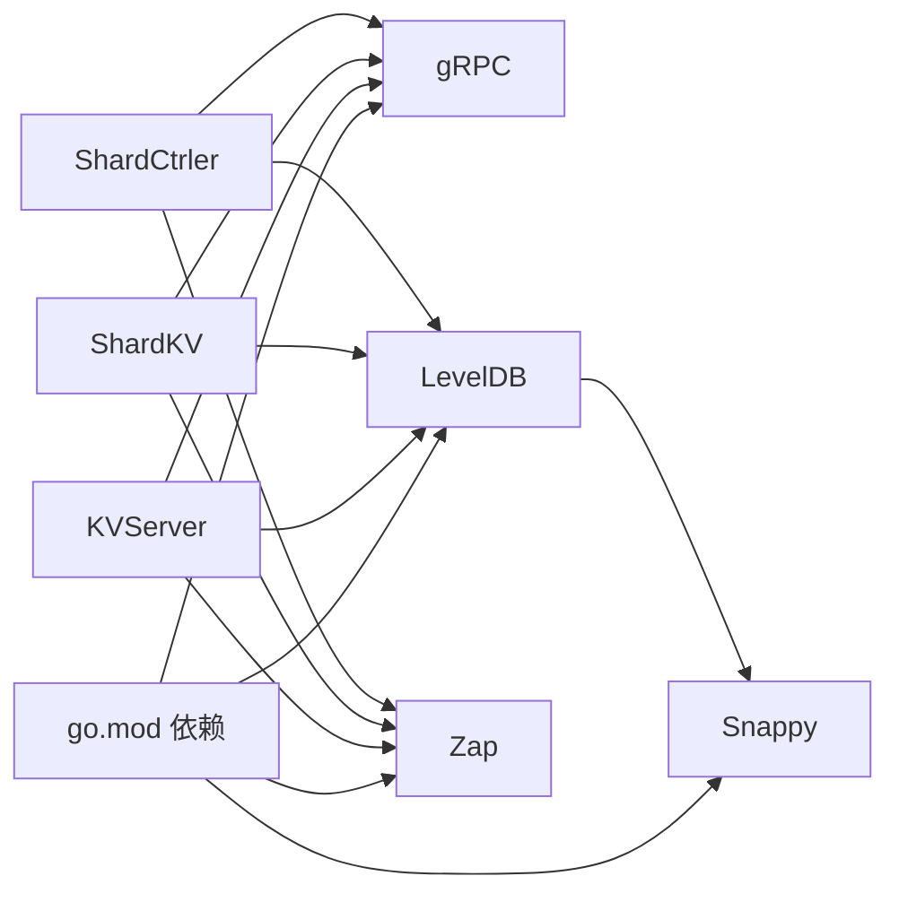

# 技术栈

**本文引用的文件**
- [go.mod](file://go.mod)
- [Makefile](file://Makefile)
- [Dockerfile](file://Dockerfile)
- [proto_gen.sh](file://proto_gen.sh)
- [README.md](file://README.md)
- [raft/persister.go](file://raft/persister.go)
- [kvraft/server.go](file://kvraft/server.go)
- [shardkv/server.go](file://shardkv/server.go)
- [shardctrler/server.go](file://shardctrler/server.go)
- [labrpc/labrpc.go](file://labrpc/labrpc.go)
- [labgob/labgob.go](file://labgob/labgob.go)
- [raftpb/raft.proto](file://raftpb/raft.proto)
- [shardkvpb/shardkv.proto](file://shardkvpb/shardkv.proto)

## 目录
1. [简介](#简介)
2. [项目结构与技术选型概览](#项目结构与技术选型概览)
3. [Go 版本与依赖管理](#go-版本与依赖管理)
4. [核心依赖库详解](#核心依赖库详解)
5. [架构与数据流总览](#架构与数据流总览)
6. [详细组件与依赖分析](#详细组件与依赖分析)
7. [依赖关系与耦合分析](#依赖关系与耦合分析)
8. [性能与可扩展性考量](#性能与可扩展性考量)
9. [故障排查与常见问题](#故障排查与常见问题)
10. [结论](#结论)
11. [附录：环境搭建与构建指南](#附录环境搭建与构建指南)

## 简介
本文件面向 eRaft 项目的开发者与维护者，系统化梳理项目的技术栈与实现细节，重点覆盖以下方面：
- Go 语言版本要求与模块依赖管理
- 核心依赖库：gRPC 通信、LevelDB 存储、Zap 日志、Snappy 压缩、labgob 编解码、labrpc 网络仿真
- 每个技术选择的动机与在系统中的职责
- 版本兼容性与构建工具链（Makefile、Docker）
- 开发环境配置与依赖安装步骤

## 项目结构与技术选型概览
eRaft 是一个基于 Raft 共识算法的分布式键值存储系统，支持分片与动态配置管理。整体采用 Go 语言实现，通过 gRPC 进行节点间通信，使用 LevelDB 作为持久化存储，并以 labgob 作为 RPC 编解码层。项目同时提供基于 channel 的 labrpc 网络仿真层，用于教学与测试。

图表来源
- [kvraft/server.go](file://kvraft/server.go#L1-L342)
- [shardkv/server.go](file://shardkv/server.go#L1-L800)
- [shardctrler/server.go](file://shardctrler/server.go#L1-L344)
- [raft/persister.go](file://raft/persister.go#L1-L111)
- [labrpc/labrpc.go](file://labrpc/labrpc.go#L1-L515)
- [labgob/labgob.go](file://labgob/labgob.go#L1-L178)

章节来源
- [README.md](file://README.md#L8-L21)

## Go 版本与依赖管理
- Go 版本要求
  - 主模块声明使用 Go 1.24.0；工具链版本为 go1.24.12，建议本地开发与 CI 使用一致版本以避免二进制差异。
- 依赖管理
  - 使用标准 go.mod/go.sum 管理直接与间接依赖。
  - 直接依赖包括：zap、grpc、protobuf。
  - 间接依赖包括：LevelDB 驱动（goleveldb）、Snappy 压缩、多错误聚合、网络与系统工具包等。

章节来源
- [go.mod](file://go.mod#L3-L21)

## 核心依赖库详解
- gRPC 通信框架
  - 用途：节点间 RPC 通信（如 Raft 请求投票、追加日志、安装快照），以及 ShardKV 组内迁移与 GC 的 gRPC 调用。
  - 关键文件：raftpb/raft.proto、shardkvpb/shardkv.proto 定义了服务接口；shardkv/server.go 中通过 gRPC 客户端拉取/删除分片数据。
- LevelDB 存储引擎
  - 用途：KVServer、ShardKV、ShardCtrler 的持久化存储后端，负责键值对读写、迭代与批量写入。
  - 关键文件：kvraft/server.go、shardkv/server.go、shardctrler/server.go 中均使用 goleveldb 打开数据库、执行读写与遍历。
- Zap 日志记录
  - 用途：统一的日志输出，便于调试与监控。
  - 关键文件：各服务文件中通过 DPrintf 输出调试信息，底层依赖 zap。
- Snappy 压缩算法
  - 用途：间接依赖，由 goleveldb 使用以优化存储空间与 IO 性能。
  - 关键文件：go.mod 显示 github.com/golang/snappy 为间接依赖。
- labgob 编解码
  - 用途：RPC 参数与状态序列化/反序列化，强制字段大写检查以避免运行时崩溃。
  - 关键文件：labgob/labgob.go 提供编码器/解码器与注册机制；各服务在启动时注册命令结构体。
- labrpc 网络仿真
  - 用途：教学场景下的通道式 RPC，模拟丢包、延迟、重排序与断连，便于测试一致性与容错。
  - 关键文件：labrpc/labrpc.go 实现客户端端点、服务器分发与网络调度。

章节来源
- [raftpb/raft.proto](file://raftpb/raft.proto#L1-L58)
- [shardkvpb/shardkv.proto](file://shardkvpb/shardkv.proto#L1-L66)
- [kvraft/server.go](file://kvraft/server.go#L1-L342)
- [shardkv/server.go](file://shardkv/server.go#L1-L800)
- [shardctrler/server.go](file://shardctrler/server.go#L1-L344)
- [labrpc/labrpc.go](file://labrpc/labrpc.go#L1-L515)
- [labgob/labgob.go](file://labgob/labgob.go#L1-L178)
- [go.mod](file://go.mod#L13-L21)

## 架构与数据流总览
下图展示从客户端到存储层的关键调用路径与数据流，体现 gRPC、Raft、存储与快照的协作方式。

图表来源
- [kvraft/server.go](file://kvraft/server.go#L102-L139)
- [kvraft/server.go](file://kvraft/server.go#L292-L304)

章节来源
- [kvraft/server.go](file://kvraft/server.go#L102-L139)
- [kvraft/server.go](file://kvraft/server.go#L292-L304)

## 详细组件与依赖分析

### KVServer 组件与 LevelDB 集成
- 角色与职责
  - 作为单集群键值服务的实现，围绕 Raft 提供线性一致的读写能力。
  - 使用 LevelDB 作为状态机后端，支持快照与增量日志压缩。
- 关键依赖
  - goleveldb：打开/关闭数据库、Get/Put/迭代、批量写入。
  - labgob：注册命令结构体，序列化/反序列化。
  - zap：日志输出。
- 快照与恢复
  - 通过 KVServer.takeSnapshot/restoreSnapshot 将内存状态与 LevelDB 数据打包为快照，交由 Raft 管理。

图表来源
- [kvraft/server.go](file://kvraft/server.go#L88-L100)
- [kvraft/server.go](file://kvraft/server.go#L25-L86)
- [kvraft/server.go](file://kvraft/server.go#L318-L341)

章节来源
- [kvraft/server.go](file://kvraft/server.go#L88-L100)
- [kvraft/server.go](file://kvraft/server.go#L25-L86)
- [kvraft/server.go](file://kvraft/server.go#L242-L279)
- [kvraft/server.go](file://kvraft/server.go#L318-L341)

### ShardKV 组件与分片迁移流程
- 角色与职责
  - 分片键值服务，按分片维度组织数据，配合 ShardCtrler 管理分片映射。
  - 支持分片拉取（Pulling/GCing 状态机）与远程 GC 协作。
- 关键依赖
  - gRPC：与同组其他节点通信，拉取/删除分片数据。
  - goleveldb：按分片前缀存储键值，支持批量删除。
  - labgob：注册分片操作相关结构体。
- 迁移与 GC 流程
  - 通过 Monitor 循环检测配置变更，触发迁移或 GC；gRPC 客户端根据地址解析选择 insecure 或 labrpc 客户端。

图表来源
- [shardkv/server.go](file://shardkv/server.go#L549-L570)
- [shardkv/server.go](file://shardkv/server.go#L572-L643)
- [shardkv/server.go](file://shardkv/server.go#L645-L696)

章节来源
- [shardkv/server.go](file://shardkv/server.go#L76-L99)
- [shardkv/server.go](file://shardkv/server.go#L549-L570)
- [shardkv/server.go](file://shardkv/server.go#L572-L643)
- [shardkv/server.go](file://shardkv/server.go#L645-L696)

### ShardCtrler 组件与配置状态机
- 角色与职责
  - 管理分片到组的映射（Config），提供 Join/Leave/Move/Query 操作。
  - 使用 LevelDB 保存历史配置，支持查询指定版本。
- 关键依赖
  - goleveldb：键值存储配置版本与计数。
  - labgob：序列化/反序列化配置对象。
- 启动与初始化
  - 若无配置，初始化默认配置；对外提供 Query 接口。

图表来源
- [shardctrler/server.go](file://shardctrler/server.go#L17-L26)
- [shardctrler/server.go](file://shardctrler/server.go#L28-L82)
- [shardctrler/server.go](file://shardctrler/server.go#L324-L343)

章节来源
- [shardctrler/server.go](file://shardctrler/server.go#L17-L26)
- [shardctrler/server.go](file://shardctrler/server.go#L28-L82)
- [shardctrler/server.go](file://shardctrler/server.go#L324-L343)

### Raft 与持久化
- 角色与职责
  - 提供日志复制、领导者选举与安全提交；Persister 负责 Raft 状态与快照的磁盘持久化。
- 关键依赖
  - labgob：序列化/反序列化 Raft 状态与快照。
  - zap：日志输出。
- 快照策略
  - 当 Raft 状态大小超过阈值时触发快照，原子地保存 Raft 状态与用户态快照。

图表来源
- [raft/persister.go](file://raft/persister.go#L17-L22)
- [raft/persister.go](file://raft/persister.go#L71-L98)

章节来源
- [raft/persister.go](file://raft/persister.go#L17-L22)
- [raft/persister.go](file://raft/persister.go#L71-L98)

### labrpc 与 labgob
- labrpc
  - 提供客户端端点与服务器分发，支持可靠/不可靠模式、延迟与丢包模拟。
- labgob
  - 强制 RPC 结构字段大写，防止运行时崩溃；提供注册与编码/解码能力。

章节来源
- [labrpc/labrpc.go](file://labrpc/labrpc.go#L1-L515)
- [labgob/labgob.go](file://labgob/labgob.go#L1-L178)

## 依赖关系与耦合分析
- 直接依赖
  - gRPC：raftpb 与 shardkvpb 定义服务契约，shardkv 通过 gRPC 与同组节点交互。
  - LevelDB：三类服务均依赖其读写与迭代能力。
  - labgob：所有服务在启动时注册命令结构体，确保 RPC 序列化正确。
  - zap：统一日志输出。
- 间接依赖
  - Snappy：由 goleveldb 使用，提升存储效率。
- 耦合度评估
  - 服务层与存储层通过接口抽象（如 KVStateMachine）弱耦合；Raft 层与存储层通过快照接口强耦合但职责清晰。
  - gRPC 与 labrpc 双栈设计，便于测试与生产切换。

图表来源
- [go.mod](file://go.mod#L7-L21)
- [kvraft/server.go](file://kvraft/server.go#L1-L15)
- [shardkv/server.go](file://shardkv/server.go#L1-L23)
- [shardctrler/server.go](file://shardctrler/server.go#L1-L15)

章节来源
- [go.mod](file://go.mod#L7-L21)

## 性能与可扩展性考量
- 存储层
  - LevelDB 的批量写入与迭代适合高吞吐场景；建议合理设置快照阈值以平衡日志长度与 IO。
- 通信层
  - gRPC 在跨主机部署中具备更好的性能与可观测性；labrpc 仅用于教学与单元测试。
- 并发与锁
  - 服务层广泛使用读写锁与通知通道，减少持有锁的时间以提升吞吐。
- 快照与 GC
  - 通过分片迁移与 GC 流程清理过期数据，降低存储膨胀与日志增长。

## 故障排查与常见问题
- 字段命名导致的 RPC 失败
  - labgob 会检查结构体字段是否大写，若小写将报错或警告，需在注册前修正。
- gRPC 连接失败
  - 检查目标地址格式与证书配置；shardkv 在本地回环使用不安全凭证，在非本地使用 labrpc 客户端。
- 快照与日志不一致
  - 确保通过 Persister 原子保存 Raft 状态与用户态快照；检查 lastApplied 是否回退。
- 网络仿真导致的超时
  - labrpc 在不可靠模式下可能丢包/延迟，需适当放宽客户端超时或启用重试。

章节来源
- [labgob/labgob.go](file://labgob/labgob.go#L70-L115)
- [shardkv/server.go](file://shardkv/server.go#L589-L610)
- [raft/persister.go](file://raft/persister.go#L90-L98)

## 结论
eRaft 的技术栈围绕 Go 生态与经典分布式系统组件展开：以 gRPC 作为跨节点通信基石，以 LevelDB 作为高性能存储后端，以 Raft 保证一致性，辅以 labrpc 与 labgob 提升教学与测试体验。该组合在工程上简洁清晰、在教学上易于理解、在实践中具备良好扩展性。

## 附录：环境搭建与构建指南

### 版本与工具链
- Go 版本
  - go.mod 指定 go 1.24.0，toolchain 为 go1.24.12。
- 构建工具
  - Makefile 提供一键构建与测试任务；Dockerfile 提供容器化构建镜像（Ubuntu 22.04 + Go 1.23.0 下载）。
- 协议生成
  - proto_gen.sh 自动安装 protoc 插件并生成 gRPC/Go 代码。

章节来源
- [go.mod](file://go.mod#L3-L5)
- [Makefile](file://Makefile#L29-L36)
- [Dockerfile](file://Dockerfile#L1-L9)
- [proto_gen.sh](file://proto_gen.sh#L1-L10)

### 依赖安装步骤
- 安装 Go
  - 使用 go.mod 指定的版本（1.24.0/1.24.12）进行安装。
- 获取项目依赖
  - 使用 go mod tidy 获取直接与间接依赖。
- 生成 gRPC/Proto 代码
  - 执行 proto_gen.sh 安装插件并生成代码。
- 构建二进制
  - 使用 make build 生成 output/ 目录下的可执行文件。
- 可选：使用 Docker
  - 使用 make image 构建镜像；使用 make build-dev 在容器内执行构建脚本。

章节来源
- [go.mod](file://go.mod#L7-L21)
- [proto_gen.sh](file://proto_gen.sh#L1-L10)
- [Makefile](file://Makefile#L29-L43)

### 开发环境配置要点
- Go 工具链版本与 GOPATH
  - 确保本地 Go 版本与 toolchain 一致；GOPATH/bin 需加入 PATH 以便 protoc-gen-go 等工具可用。
- 本地网络与端口
  - README 提供本地启动示例，注意端口冲突与防火墙设置。
- 快速验证
  - 使用 make all-test 或单模块测试验证依赖与编译链路。

章节来源
- [README.md](file://README.md#L43-L49)
- [Makefile](file://Makefile#L46-L49)