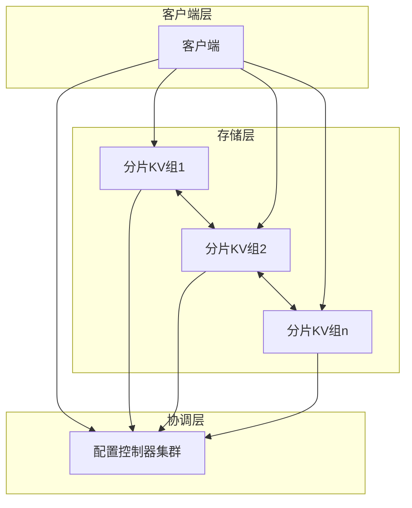
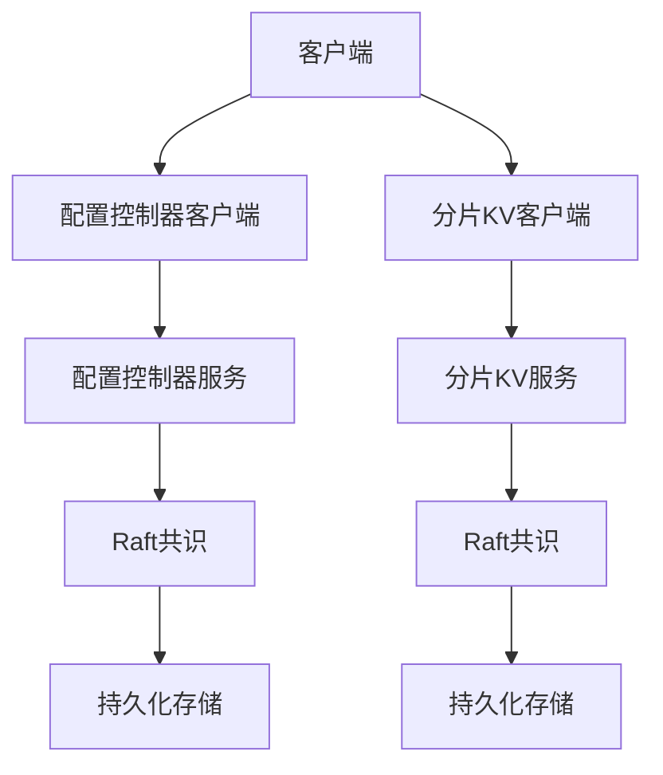
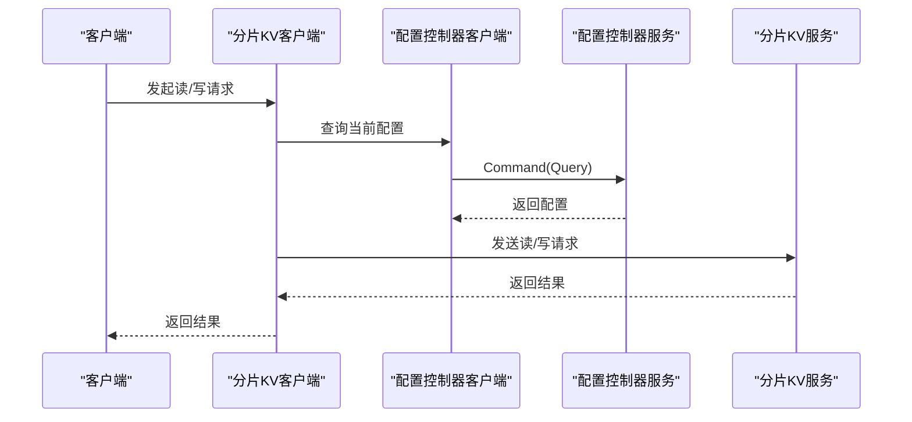
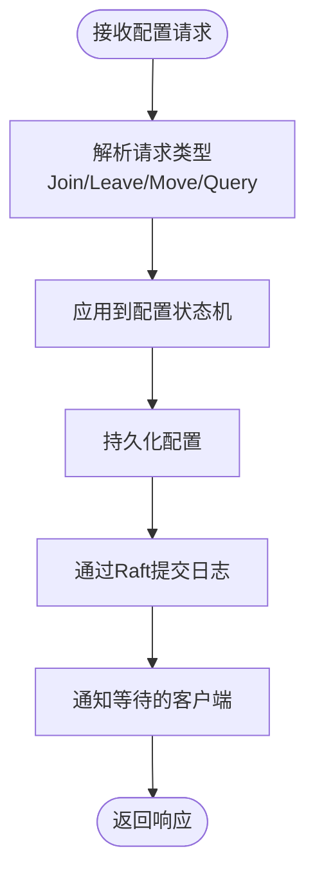
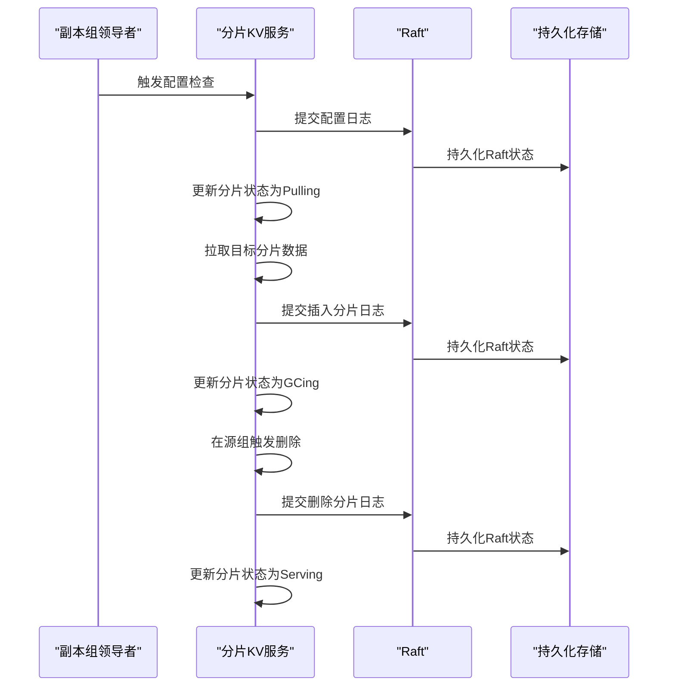
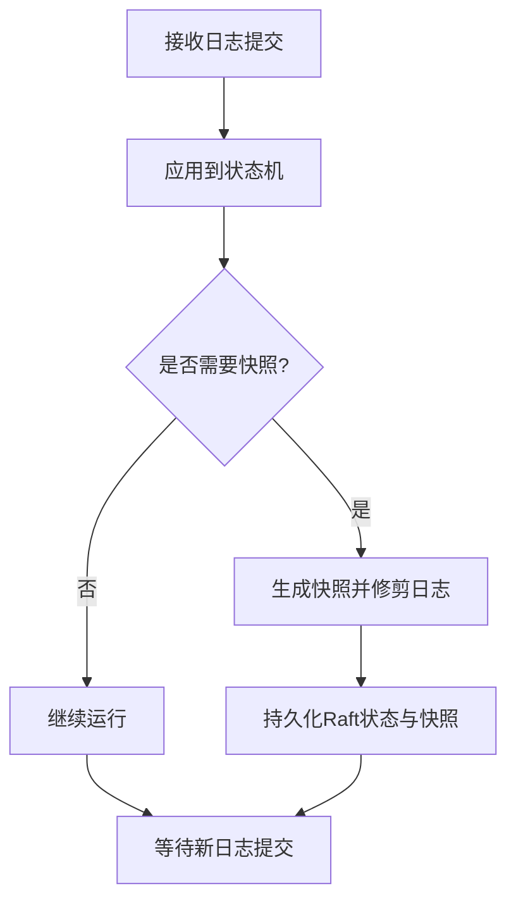
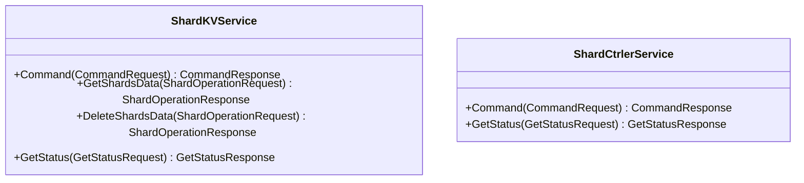
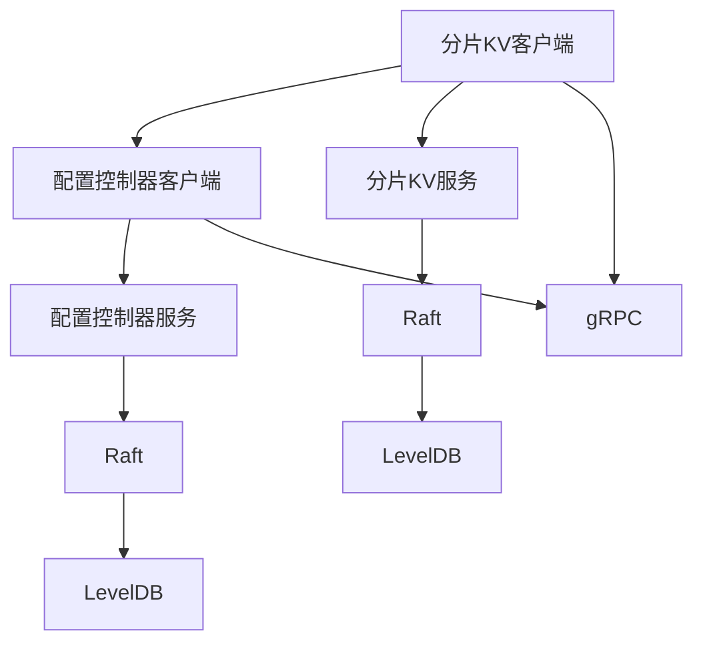

# 架构概览

<cite>
**本文档引用的文件**
- [README.md](file://README.md)
- [Architecture.md](file://wiki/Architecture.md)
- [Raft-Consensus.md](file://wiki/Raft-Consensus.md)
- [Sharding-Mechanism.md](file://wiki/Sharding-Mechanism.md)
- [Storage-and-RPC.md](file://wiki/Storage-and-RPC.md)
- [raft.go](file://raft/raft.go)
- [persister.go](file://raft/persister.go)
- [server.go](file://shardkv/server.go)
- [common.go](file://shardkv/common.go)
- [client.go](file://shardkv/client.go)
- [server.go](file://shardctrler/server.go)
- [common.go](file://shardctrler/common.go)
- [client.go](file://shardctrler/client.go)
- [server.go](file://kvraft/server.go)
- [common.go](file://kvraft/common.go)
- [shardkv.proto](file://shardkvpb/shardkv.proto)
- [shardctrler.proto](file://shardctrlerpb/shardctrler.proto)
- [main.go](file://cmd/shardkvserver/main.go)
</cite>

## 目录
1. [引言](#引言)
2. [项目结构](#项目结构)
3. [核心组件](#核心组件)
4. [架构总览](#架构总览)
5. [详细组件分析](#详细组件分析)
6. [依赖关系分析](#依赖关系分析)
7. [性能考量](#性能考量)
8. [故障排查指南](#故障排查指南)
9. [结论](#结论)
10. [附录](#附录)

## 引言
本文件为 eRaft 分布式分片键值存储系统的架构概览文档。eRaft 基于 Raft 共识算法实现强一致性的存储服务，采用三层架构：客户端层、协调层（配置控制器）、存储层（分片 KV 服务）。系统通过 gRPC 提供高效的服务间通信，并使用 LevelDB 作为持久化存储引擎。本文档旨在帮助开发者理解系统的整体结构、组件职责与交互关系，并提供扩展与排障建议。

## 项目结构
仓库采用按功能域划分的模块化组织方式，主要目录与职责如下：
- cmd/*：各组件的命令行入口程序，负责解析参数、初始化节点与启动 gRPC 服务。
- raft/*：Raft 共识算法实现，包含状态机、日志、快照与持久化。
- shardctrler/*：配置控制器（ShardCtrler）集群，维护分片到副本组的映射。
- shardkv/*：分片 KV 存储服务，每个副本组运行多副本 Raft，负责实际数据读写与分片迁移。
- kvraft/*：单机 KV 服务示例（非分片），用于理解基础 KV 状态机与 Raft 集成。
- shardkvpb/shardctrlerpb：gRPC 协议定义与生成代码。
- wiki/*：系统设计与实现的详细文档索引。

**图表来源**
- [Architecture.md](file://wiki/Architecture.md#L18-L29)

**章节来源**
- [README.md](file://README.md#L1-L139)

## 核心组件
- 客户端层
  - 分片 KV 客户端：负责根据键计算分片，向配置控制器查询当前配置，再向对应副本组发送读写请求。
  - 配置控制器客户端：封装 Join/Leave/Move/Query 操作，支持轮询领导者以提升可用性。
- 协调层（ShardCtrler）
  - 维护配置状态机，保存历史配置；提供 Join/Leave/Move/Query 接口；基于 Raft 实现强一致。
- 存储层（ShardKV）
  - 每个副本组内部运行 Raft，存储分片数据；支持配置变更检测、分片拉取与垃圾回收；提供 Get/Put/Append 以及分片操作 RPC。
- 共识层（Raft）
  - 提供日志复制、领导者选举、快照与持久化能力；为上层提供原子提交与状态机应用接口。
- 协议层（gRPC）
  - 定义 ShardKVService 与 ShardCtrlerService 的 RPC 接口，统一客户端与服务端交互格式。

**章节来源**
- [client.go](file://shardkv/client.go#L151-L200)
- [client.go](file://shardctrler/client.go#L21-L60)
- [server.go](file://shardkv/server.go#L76-L100)
- [server.go](file://shardctrler/server.go#L17-L27)
- [raft.go](file://raft/raft.go#L37-L60)
- [shardkv.proto](file://shardkvpb/shardkv.proto#L60-L66)
- [shardctrler.proto](file://shardctrlerpb/shardctrler.proto#L51-L55)

## 架构总览
eRaft 采用三层架构协同工作：
- 客户端层：负责请求路由与重试策略，先查询配置控制器获取最新配置，再向目标副本组发起读写。
- 协调层：集中管理分片映射，支持动态加入/离开/移动分片，保证全局一致性。
- 存储层：每个副本组内多副本 Raft 保证局部一致性，配合配置控制器实现跨组的数据迁移与均衡。

**图表来源**
- [Architecture.md](file://wiki/Architecture.md#L1-L29)
- [client.go](file://shardkv/client.go#L151-L200)
- [client.go](file://shardctrler/client.go#L21-L60)
- [server.go](file://shardkv/server.go#L76-L100)
- [server.go](file://shardctrler/server.go#L17-L27)

## 详细组件分析

### 客户端层组件
- 分片 KV 客户端
  - 负责键到分片的映射、配置查询、请求重试与领导者切换。
  - 支持 gRPC 与 labrpc 两种传输方式，便于测试与生产环境切换。
- 配置控制器客户端
  - 封装 Join/Leave/Move/Query 操作，自动处理领导者错误与超时重试。

**图表来源**
- [client.go](file://shardkv/client.go#L190-L200)
- [client.go](file://shardctrler/client.go#L125-L140)
- [server.go](file://shardctrler/server.go#L179-L215)

**章节来源**
- [client.go](file://shardkv/client.go#L151-L200)
- [client.go](file://shardctrler/client.go#L21-L60)

### 协调层组件（配置控制器）
- 配置状态机
  - 使用 LevelDB 存储配置历史，支持 Join/Leave/Move/Query。
  - 自动平衡分片分布，确保各副本组负载均衡。
- Raft 集成
  - 所有配置变更通过 Raft 日志提交，保证全局一致。

**图表来源**
- [server.go](file://shardctrler/server.go#L84-L151)
- [server.go](file://shardctrler/server.go#L250-L264)

**章节来源**
- [server.go](file://shardctrler/server.go#L17-L27)
- [server.go](file://shardctrler/server.go#L84-L151)
- [common.go](file://shardctrler/common.go#L26-L43)

### 存储层组件（分片 KV）
- 分片状态机
  - 每个副本组内部运行 Raft，存储分片数据；支持 Get/Put/Append。
  - 维护分片状态（Serving/Pulling/BePulling/GCing），驱动迁移与回收。
- 迁移与回收
  - 周期性检查配置变更，从源组拉取目标分片数据，完成后在本地执行插入并在源组触发删除。
- 快照与持久化
  - 基于 Raft 快照减少日志大小，结合持久化存储提升恢复效率。

**图表来源**
- [server.go](file://shardkv/server.go#L549-L570)
- [server.go](file://shardkv/server.go#L572-L643)
- [server.go](file://shardkv/server.go#L645-L696)
- [server.go](file://shardkv/server.go#L348-L358)
- [server.go](file://shardkv/server.go#L360-L383)
- [server.go](file://shardkv/server.go#L385-L405)

**章节来源**
- [server.go](file://shardkv/server.go#L76-L100)
- [server.go](file://shardkv/server.go#L248-L326)
- [server.go](file://shardkv/server.go#L467-L485)
- [server.go](file://shardkv/server.go#L487-L516)
- [common.go](file://shardkv/common.go#L70-L92)

### 共识层组件（Raft）
- 核心职责
  - 提供领导者选举、日志复制、快照与持久化；向上游提供 ApplyMsg 通道。
- 关键机制
  - 通过条件安装快照（CondInstallSnapshot）与日志修剪（Snapshot）控制存储占用。
  - 通过心跳与空日志条目避免“活锁”导致的提交停滞。

**图表来源**
- [raft.go](file://raft/raft.go#L150-L164)
- [raft.go](file://raft/raft.go#L120-L144)
- [persister.go](file://raft/persister.go#L90-L111)

**章节来源**
- [raft.go](file://raft/raft.go#L37-L60)
- [raft.go](file://raft/raft.go#L150-L164)
- [raft.go](file://raft/raft.go#L120-L144)
- [persister.go](file://raft/persister.go#L71-L111)

### 协议层（gRPC）
- ShardKVService
  - Command：读写请求。
  - GetShardsData：从源组拉取指定分片数据。
  - DeleteShardsData：在源组删除已迁移分片。
  - GetStatus：查询节点状态。
- ShardCtrlerService
  - Command：配置变更请求。
  - GetStatus：查询节点状态。

**图表来源**
- [shardkv.proto](file://shardkvpb/shardkv.proto#L60-L66)
- [shardctrler.proto](file://shardctrlerpb/shardctrler.proto#L51-L55)

**章节来源**
- [shardkv.proto](file://shardkvpb/shardkv.proto#L1-L66)
- [shardctrler.proto](file://shardctrlerpb/shardctrler.proto#L1-L55)

## 依赖关系分析
- 组件耦合
  - 分片 KV 服务依赖 Raft 与配置控制器客户端；配置控制器服务同样依赖 Raft。
  - 客户端通过 gRPC 与服务端交互，支持不同传输后端（gRPC/labrpc）。
- 外部依赖
  - LevelDB：持久化存储。
  - gRPC：服务间通信。
  - labrpc：测试环境下的本地 RPC 抽象。

**图表来源**
- [client.go](file://shardkv/client.go#L151-L200)
- [client.go](file://shardctrler/client.go#L21-L60)
- [server.go](file://shardkv/server.go#L76-L100)
- [server.go](file://shardctrler/server.go#L17-L27)

**章节来源**
- [client.go](file://shardkv/client.go#L151-L200)
- [client.go](file://shardctrler/client.go#L21-L60)
- [server.go](file://shardkv/server.go#L76-L100)
- [server.go](file://shardctrler/server.go#L17-L27)

## 性能考量
- 并发与吞吐
  - 读写路径尽量避免持有锁，减少阻塞；通知通道异步释放以降低内存占用。
- 快照与日志修剪
  - 当 Raft 状态大小超过阈值时触发快照，降低日志长度与恢复时间。
- 迁移与回收
  - 分片迁移采用批量拉取与插入，减少锁持有时间；迁移完成后触发源组删除，避免数据冗余。
- 传输优化
  - 生产环境优先使用 gRPC，测试环境可切换至 labrpc 以简化网络拓扑。

[本节为通用性能指导，不直接分析具体文件]

## 故障排查指南
- 常见错误与定位
  - 错误类型：无此键、错误分组、错误领导者、过期配置、超时、未就绪。
  - 定位方法：检查客户端重试逻辑、领导者切换、配置查询与分片状态。
- 快照与恢复
  - 若节点重启后状态异常，确认快照与 Raft 状态一致性；必要时清理旧快照或调整阈值。
- 迁移问题
  - 若出现数据不一致或迁移卡住，检查分片状态机（Pulling/GCing）与领导者角色；确认源组与目标组的 RPC 可达性。

**章节来源**
- [common.go](file://shardkv/common.go#L38-L68)
- [server.go](file://shardkv/server.go#L487-L516)
- [raft.go](file://raft/raft.go#L120-L144)

## 结论
eRaft 通过清晰的三层架构与 Raft 共识算法，实现了高可用、可扩展的分布式分片键值存储系统。客户端层负责请求路由与重试，协调层集中管理分片映射，存储层在副本组内保证一致性并通过配置控制器实现动态迁移与均衡。借助 gRPC 与 LevelDB，系统在工程实践层面具备良好的可维护性与扩展性。

## 附录
- 启动与监控
  - 配置控制器集群：启动多个节点，注册到同一集群。
  - 分片 KV 组：启动多个副本，注册到配置控制器。
  - 客户端：通过 shardkvclient 或 shardctrlerclient 进行读写与状态查询。
- 运维建议
  - 监控领导者切换频率与配置变更频次，评估负载与迁移压力。
  - 定期检查快照与日志大小，调整快照阈值以平衡恢复时间与存储占用。

**章节来源**
- [README.md](file://README.md#L51-L139)
- [main.go](file://cmd/shardkvserver/main.go#L18-L59)