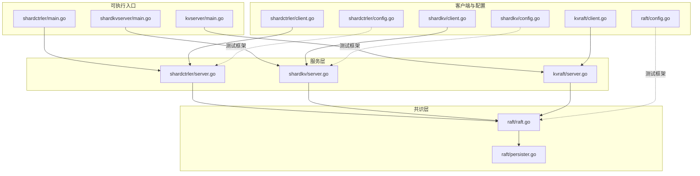
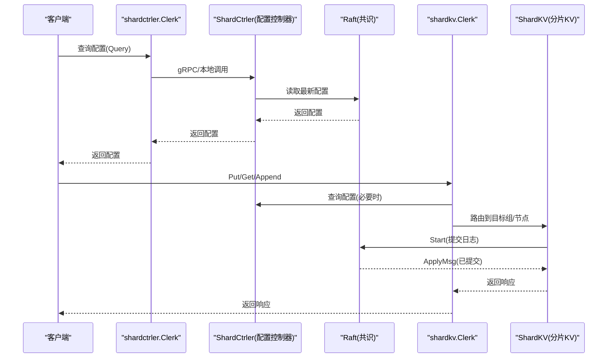
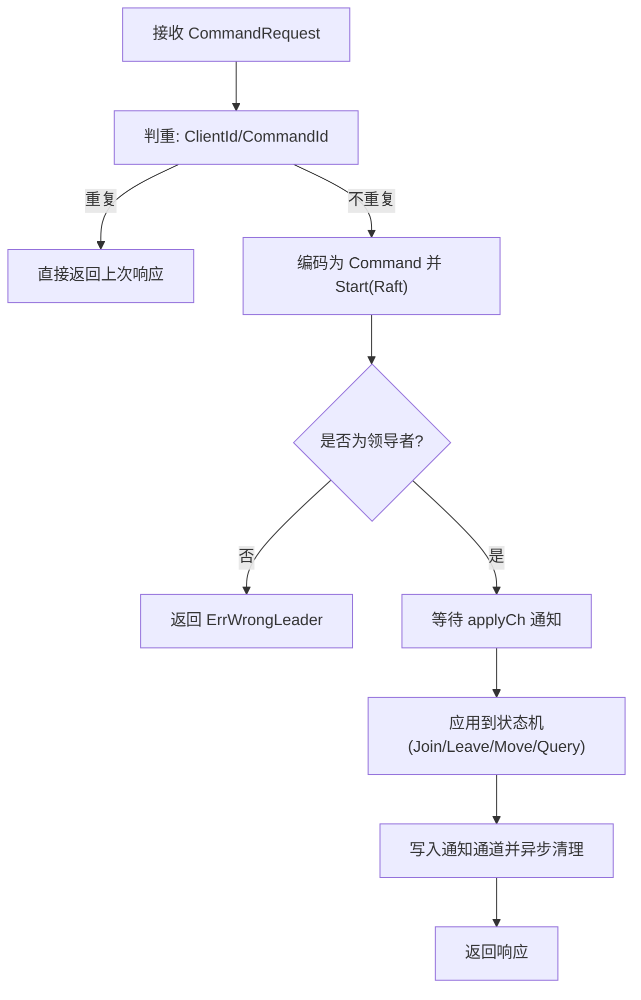
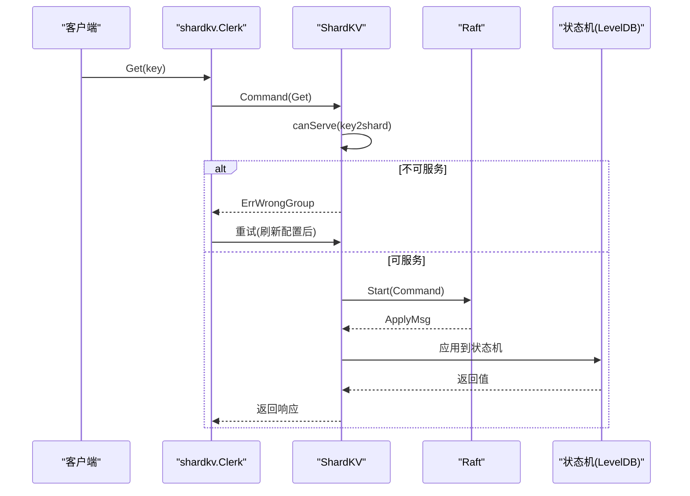
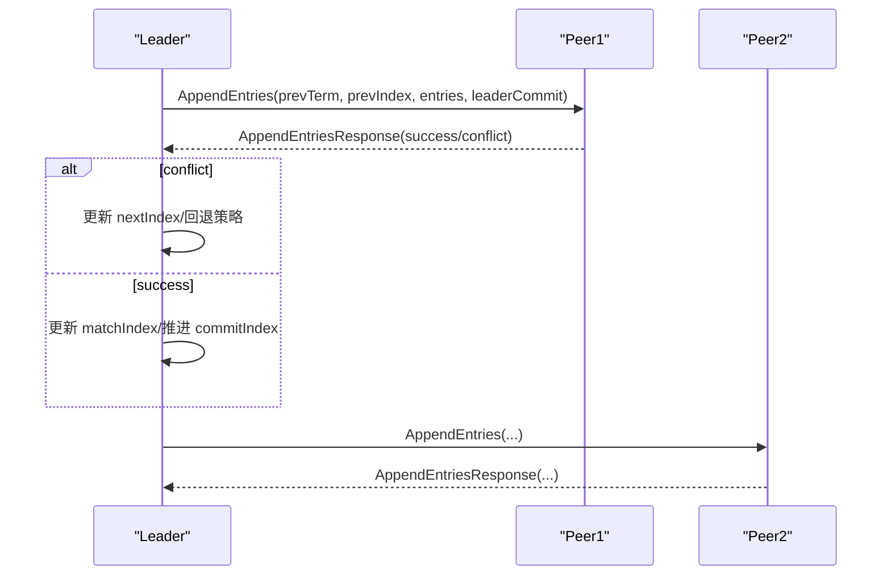
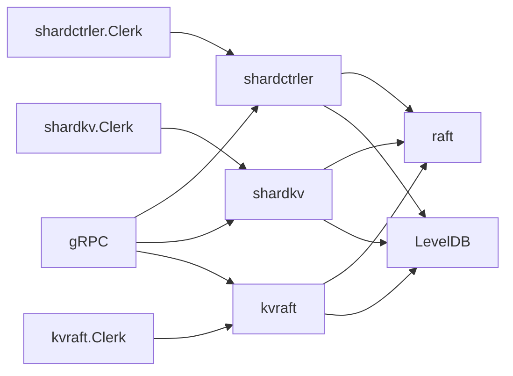

# 系统组件

<cite>
**本文引用的文件**
- [cmd/shardctrler/main.go](file://cmd/shardctrler/main.go)
- [cmd/kvserver/main.go](file://cmd/kvserver/main.go)
- [cmd/shardkvserver/main.go](file://cmd/shardkvserver/main.go)
- [shardctrler/server.go](file://shardctrler/server.go)
- [shardctrler/common.go](file://shardctrler/common.go)
- [shardctrler/client.go](file://shardctrler/client.go)
- [shardkv/server.go](file://shardkv/server.go)
- [shardkv/common.go](file://shardkv/common.go)
- [shardkv/client.go](file://shardkv/client.go)
- [kvraft/server.go](file://kvraft/server.go)
- [kvraft/common.go](file://kvraft/common.go)
- [kvraft/client.go](file://kvraft/client.go)
- [raft/raft.go](file://raft/raft.go)
- [raft/persister.go](file://raft/persister.go)
- [raft/config.go](file://raft/config.go)
- [shardctrler/config.go](file://shardctrler/config.go)
- [shardkv/config.go](file://shardkv/config.go)
</cite>

## 目录
1. [简介](#简介)
2. [项目结构](#项目结构)
3. [核心组件](#核心组件)
4. [架构总览](#架构总览)
5. [详细组件分析](#详细组件分析)
6. [依赖关系分析](#依赖关系分析)
7. [性能考量](#性能考量)
8. [故障排查指南](#故障排查指南)
9. [结论](#结论)
10. [附录](#附录)

## 简介
本文件为 eRaft 项目的系统组件概览文档，面向开发者与测试人员，帮助快速理解项目模块化设计与组件协作方式。重点覆盖以下组件：
- 配置控制器（shardctrler）
- 分片 KV 服务（shardkv）
- 单机 KV 服务（kvraft）
- Raft 共识算法实现（raft）

文档将从职责边界、对外接口、内部实现要点、组件间依赖与协作、启动顺序与配置要求、可执行程序入口与基本使用方法等方面进行系统性说明。

## 项目结构
仓库采用按功能域划分的模块化组织方式，核心目录与职责如下：
- cmd/*：各组件的可执行程序入口，负责解析参数、初始化网络与持久化、启动 gRPC 服务并注册对应服务端。
- shardctrler/*：配置控制器，负责维护分片配置（分片到组的映射），提供 Join/Leave/Move/Query 接口。
- shardkv/*：分片 KV 服务，基于 Raft 实现多副本状态机，按分片路由请求，支持配置变更时的数据迁移与回收。
- kvraft/*：单机 KV 服务，基于 Raft 实现单组内的键值操作，用于对比或基础场景。
- raft/*：Raft 共识算法实现，提供日志复制、选举、快照、提交一致性等能力。
- 其他：proto 定义、测试配置、工具库等。

图表来源
- [cmd/shardctrler/main.go](file://cmd/shardctrler/main.go#L18-L56)
- [cmd/kvserver/main.go](file://cmd/kvserver/main.go#L16-L47)
- [cmd/shardkvserver/main.go](file://cmd/shardkvserver/main.go#L18-L58)
- [shardctrler/server.go](file://shardctrler/server.go#L324-L343)
- [shardkv/server.go](file://shardkv/server.go#L759-L799)
- [kvraft/server.go](file://kvraft/server.go#L318-L341)
- [raft/raft.go](file://raft/raft.go#L689-L725)
- [raft/persister.go](file://raft/persister.go#L24-L32)
- [shardctrler/client.go](file://shardctrler/client.go#L36-L60)
- [shardkv/client.go](file://shardkv/client.go#L165-L188)
- [kvraft/client.go](file://kvraft/client.go#L30-L46)
- [raft/config.go](file://raft/config.go#L67-L107)
- [shardctrler/config.go](file://shardctrler/config.go#L339-L363)
- [shardkv/config.go](file://shardkv/config.go#L350-L395)

章节来源
- [cmd/shardctrler/main.go](file://cmd/shardctrler/main.go#L1-L57)
- [cmd/kvserver/main.go](file://cmd/kvserver/main.go#L1-L48)
- [cmd/shardkvserver/main.go](file://cmd/shardkvserver/main.go#L1-L59)
- [raft/raft.go](file://raft/raft.go#L1-L726)

## 核心组件
本节概述四大核心组件的职责与对外接口。

- 配置控制器（shardctrler）
  - 职责：维护分片配置（分片到组的映射），提供 Join/Leave/Move/Query 接口；通过 Raft 保证配置变更的一致性。
  - 对外接口：gRPC 服务（ShardCtrlerService），客户端封装（Clerk）。
  - 内部实现要点：基于 LevelDB 的配置状态机；去重请求处理；应用线程将已提交日志应用到状态机；对外返回通知通道结果。
  
- 分片 KV 服务（shardkv）
  - 职责：按分片路由键值请求；在配置变更期间执行数据迁移（拉取/删除）；支持快照与恢复。
  - 对外接口：gRPC 服务（ShardKVService），客户端封装（Clerk）。
  - 内部实现要点：按 key2shard 计算分片；canServe 判断当前组是否可服务该分片；状态机包含分片状态（Serving/Pulling/BePulling/GCing）；周期性检查空日志推进提交；迁移/回收任务由监控 goroutine 触发。
  
- 单机 KV 服务（kvraft）
  - 职责：单组内键值操作（Get/Put/Append），通过 Raft 保证一致性。
  - 对外接口：gRPC 服务（KVService），客户端封装（Clerk）。
  - 内部实现要点：LevelDB 状态机；去重请求处理；应用线程将已提交日志应用到状态机；支持基于 Raft 状态大小的快照。
  
- Raft 共识算法实现（raft）
  - 职责：提供领导者选举、日志复制、提交一致性、快照与恢复、心跳与选举定时器等。
  - 对外接口：Start/GetState/Snapshot/CondInstallSnapshot 等；对上层暴露 ApplyMsg 渠道。
  - 内部实现要点：状态机（Follower/Candidate/Leader）切换；日志匹配与提交索引推进；复制器与应用器分离；持久化与快照原子保存。

章节来源
- [shardctrler/server.go](file://shardctrler/server.go#L17-L343)
- [shardkv/server.go](file://shardkv/server.go#L76-L799)
- [kvraft/server.go](file://kvraft/server.go#L88-L341)
- [raft/raft.go](file://raft/raft.go#L37-L725)

## 架构总览
下图展示组件间的高层交互：客户端通过 shardctrler 获取最新配置，再向对应组的 shardkv 发送请求；所有服务均基于 raft 提供一致性保障。

图表来源
- [shardctrler/client.go](file://shardctrler/client.go#L125-L197)
- [shardkv/client.go](file://shardkv/client.go#L206-L265)
- [shardctrler/server.go](file://shardctrler/server.go#L179-L215)
- [shardkv/server.go](file://shardkv/server.go#L110-L157)
- [raft/raft.go](file://raft/raft.go#L581-L591)

## 详细组件分析

### 配置控制器（shardctrler）
- 组件职责
  - 维护配置历史（Config.Num 递增）与分片到组映射（Shards）。
  - 提供 Join/Leave/Move/Query 操作，通过 Raft 日志达成全局一致。
  - 基于 LevelDB 存储配置，支持查询最新配置或指定版本。
- 对外接口
  - gRPC 服务：ShardCtrlerService，提供 Command/GetStatus。
  - 客户端：Clerk，封装请求编号（ClientId/CommandId）与领导者轮转。
- 内部实现要点
  - 去重请求：根据 ClientId/CommandId 判重，避免重复执行。
  - 应用线程：从 applyCh 取出已提交日志，应用到状态机（Join/Leave/Move/Query）。
  - 通知机制：按日志索引维护通知通道，异步通知等待的客户端。
  - 快照：配置状态机支持 Size/Close/路径遍历统计大小。
- 关键流程（Command 执行）

图表来源
- [shardctrler/server.go](file://shardctrler/server.go#L179-L215)
- [shardctrler/server.go](file://shardctrler/server.go#L250-L264)
- [shardctrler/server.go](file://shardctrler/server.go#L272-L313)

章节来源
- [shardctrler/server.go](file://shardctrler/server.go#L17-L343)
- [shardctrler/common.go](file://shardctrler/common.go#L26-L141)
- [shardctrler/client.go](file://shardctrler/client.go#L36-L197)

### 分片 KV 服务（shardkv）
- 组件职责
  - 将键映射到分片，按组路由请求；在配置变更期间执行数据迁移与回收。
  - 维护分片状态机（Serving/Pulling/BePulling/GCing），确保一致性。
- 对外接口
  - gRPC 服务：ShardKVService（Command/GetShardsData/DeleteShardsData/GetStatus）。
  - 客户端：Clerk，自动根据配置选择组内领导者。
- 内部实现要点
  - canServe：判断当前组是否负责该分片且处于可服务状态。
  - 迁移动作：PullTask（从源组拉取分片数据）、GCTask（在源组删除分片并本地更新状态）。
  - 快照：全量遍历 LevelDB 数据、分片状态、最后操作上下文与配置，定期触发。
  - 监控循环：周期性检查新配置、迁移任务与回收任务、空日志推进。
- 关键流程（Get/命令执行）

图表来源
- [shardkv/server.go](file://shardkv/server.go#L110-L157)
- [shardkv/server.go](file://shardkv/server.go#L248-L326)
- [shardkv/server.go](file://shardkv/server.go#L328-L420)

章节来源
- [shardkv/server.go](file://shardkv/server.go#L76-L799)
- [shardkv/common.go](file://shardkv/common.go#L21-L229)
- [shardkv/client.go](file://shardkv/client.go#L151-L310)

### 单机 KV 服务（kvraft）
- 组件职责
  - 单组内的键值存储，提供 Get/Put/Append 操作，通过 Raft 保证一致性。
- 对外接口
  - gRPC 服务：KVService。
  - 客户端：Clerk，封装领导者轮转与超时重试。
- 内部实现要点
  - LevelDB 状态机；去重请求；应用线程将已提交日志应用到状态机；支持基于 Raft 状态大小的快照。
- 关键流程（Command 执行）

图表来源
- [kvraft/server.go](file://kvraft/server.go#L102-L139)
- [kvraft/server.go](file://kvraft/server.go#L177-L236)
- [kvraft/server.go](file://kvraft/server.go#L292-L304)

章节来源
- [kvraft/server.go](file://kvraft/server.go#L88-L341)
- [kvraft/common.go](file://kvraft/common.go#L20-L92)
- [kvraft/client.go](file://kvraft/client.go#L16-L144)

### Raft 共识算法实现（raft）
- 组件职责
  - 提供领导者选举、日志复制、提交一致性、快照与恢复、心跳与选举定时器等。
- 对外接口
  - Start/GetState/Snapshot/CondInstallSnapshot；对上层暴露 ApplyMsg 渠道。
- 内部实现要点
  - 状态机（Follower/Candidate/Leader）切换；日志匹配与提交索引推进；复制器与应用器分离；持久化与快照原子保存。
- 关键流程（领导者广播心跳/追加日志）

图表来源
- [raft/raft.go](file://raft/raft.go#L189-L241)
- [raft/raft.go](file://raft/raft.go#L423-L449)
- [raft/raft.go](file://raft/raft.go#L576-L591)

章节来源
- [raft/raft.go](file://raft/raft.go#L37-L725)
- [raft/persister.go](file://raft/persister.go#L17-L111)

## 依赖关系分析
- 组件耦合与内聚
  - shardctrler 与 shardkv 通过配置控制器解耦：shardkv 仅依赖配置查询与组内通信。
  - 所有服务均依赖 raft 提供一致性与持久化。
  - 客户端通过 gRPC 或 labrpc 与服务交互，支持两种传输模式。
- 外部依赖与集成点
  - gRPC：服务端注册（RegisterXXXServiceServer），客户端通过 insecure 凭证连接。
  - LevelDB：作为状态机与快照存储介质。
  - labrpc：测试环境下的本地 RPC 模拟。
- 循环依赖
  - 未发现直接循环依赖；服务通过接口与客户端交互，避免强耦合。

图表来源
- [shardctrler/server.go](file://shardctrler/server.go#L330-L339)
- [shardkv/server.go](file://shardkv/server.go#L770-L787)
- [kvraft/server.go](file://kvraft/server.go#L324-L337)
- [shardctrler/client.go](file://shardctrler/client.go#L36-L60)
- [shardkv/client.go](file://shardkv/client.go#L165-L188)
- [kvraft/client.go](file://kvraft/client.go#L30-L46)

章节来源
- [shardctrler/server.go](file://shardctrler/server.go#L324-L343)
- [shardkv/server.go](file://shardkv/server.go#L759-L799)
- [kvraft/server.go](file://kvraft/server.go#L318-L341)

## 性能考量
- 快照与日志压缩
  - shardkv/kvraft 在达到阈值时触发快照，减少日志长度与持久化开销。
  - raft 支持 CondInstallSnapshot 与 Snapshot 原子保存，避免状态与快照不同步。
- 去重与通知优化
  - 基于 ClientId/CommandId 的去重避免重复执行；通知通道异步清理降低内存占用。
- 追加空日志
  - shardkv 在当前任期无日志时定期追加空条目，避免提交停滞。
- I/O 与序列化
  - 使用 labgob 编解码命令与状态；LevelDB 遍历全库进行快照，注意在大容量场景下的 I/O 压力。

章节来源
- [shardkv/server.go](file://shardkv/server.go#L463-L485)
- [shardkv/server.go](file://shardkv/server.go#L718-L722)
- [kvraft/server.go](file://kvraft/server.go#L238-L258)
- [raft/raft.go](file://raft/raft.go#L120-L144)
- [raft/raft.go](file://raft/raft.go#L150-L164)

## 故障排查指南
- 常见错误类型
  - ErrWrongLeader：当前节点非领导者，客户端应轮转至下一领导者。
  - ErrTimeout：请求超时，可能因网络延迟或领导者繁忙。
  - ErrWrongGroup：当前组无法服务该分片，需重新查询配置并路由。
  - ErrOutDated：配置或分片迁移过期，需重试最新配置。
- 定位手段
  - 各组件提供 GetStatus 接口，返回节点状态、任期、提交/应用索引与存储大小。
  - raft 提供 GetState/GetRaftStateSize，便于观察一致性状态。
- 建议排查步骤
  - 检查客户端是否正确轮转领导者与刷新配置。
  - 查看服务端日志与 GetStatus 输出，确认当前角色与提交进度。
  - 检查持久化路径与权限，确保快照与 Raft 状态可读写。

章节来源
- [shardkv/common.go](file://shardkv/common.go#L38-L68)
- [shardkv/server.go](file://shardkv/server.go#L105-L108)
- [kvraft/common.go](file://kvraft/common.go#L49-L70)
- [kvraft/server.go](file://kvraft/server.go#L171-L174)
- [raft/raft.go](file://raft/raft.go#L64-L74)
- [raft/raft.go](file://raft/raft.go#L76-L80)

## 结论
eRaft 通过清晰的模块划分与分层设计，实现了从配置管理到分片存储再到共识算法的完整链路。shardctrler 提供稳定的配置一致性，shardkv 在其之上实现跨组的分片路由与迁移，kvraft 则提供单组内的键值能力。Raft 作为通用基础设施，贯穿所有服务，确保了高可用与一致性。建议在生产环境中关注快照策略、领导者轮转与配置刷新的健壮性，并结合 GetStatus 与日志进行持续观测。

## 附录

### 组件启动顺序与配置要求
- 启动顺序
  - 配置控制器（shardctrler）：先启动，提供配置查询服务。
  - 分片 KV 组（shardkv）：启动时连接配置控制器，周期性获取最新配置并执行迁移/回收。
  - 单机 KV（kvraft）：独立运行，适用于对比或简单场景。
- 配置要求
  - shardctrler：通过 -id/-cluster/-db 参数指定节点 ID、集群地址列表与数据库路径。
  - shardkv：通过 -id/-gid/-cluster/-ctrlers/-db 指定组内 ID、组 ID、本组地址列表、配置控制器地址列表与数据库路径。
  - kvserver：通过 -id/-addrs/-db 指定节点 ID、地址列表与数据库路径。

章节来源
- [cmd/shardctrler/main.go](file://cmd/shardctrler/main.go#L18-L39)
- [cmd/shardkvserver/main.go](file://cmd/shardkvserver/main.go#L18-L43)
- [cmd/kvserver/main.go](file://cmd/kvserver/main.go#L16-L32)

### 可执行程序入口与基本使用方法
- shardctrler 服务
  - 入口：cmd/shardctrler/main.go
  - 启动示例：./bin/shardctrler -id=0 -cluster="host1:port1,host2:port2,host3:port3" -db="data/shardctrler"
  - 功能：启动配置控制器，注册 gRPC 服务与 Raft 服务。
- shardkv 服务
  - 入口：cmd/shardkvserver/main.go
  - 启动示例：./bin/shardkvserver -id=0 -gid=100 -cluster="g1host1:g1port1,g1host2:g1port2" -ctrlers="ctrl1:port1,ctrl2:port2" -db="data/shardkv"
  - 功能：启动分片 KV 服务，注册 gRPC 服务与 Raft 服务。
- kvserver 服务
  - 入口：cmd/kvserver/main.go
  - 启动示例：./bin/kvserver -id=0 -addrs="host1:port1,host2:port2,host3:port3" -db="kvserver-data"
  - 功能：启动单机 KV 服务，注册 gRPC 服务与 Raft 服务。

章节来源
- [cmd/shardctrler/main.go](file://cmd/shardctrler/main.go#L18-L56)
- [cmd/shardkvserver/main.go](file://cmd/shardkvserver/main.go#L18-L58)
- [cmd/kvserver/main.go](file://cmd/kvserver/main.go#L16-L47)