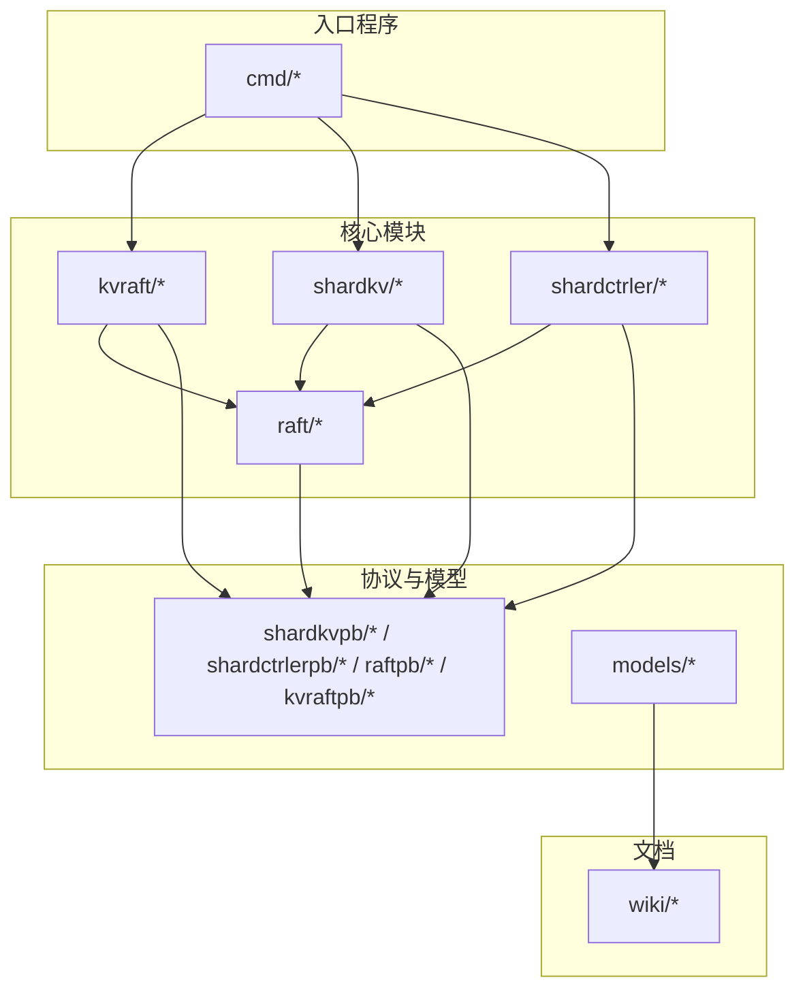
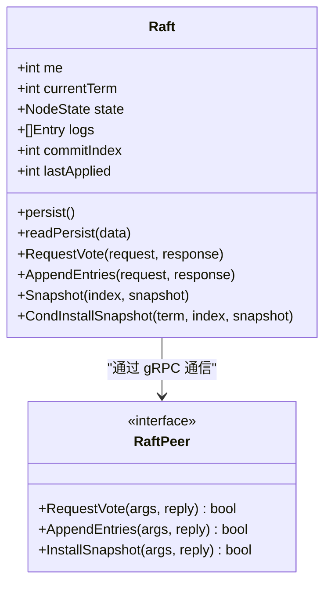
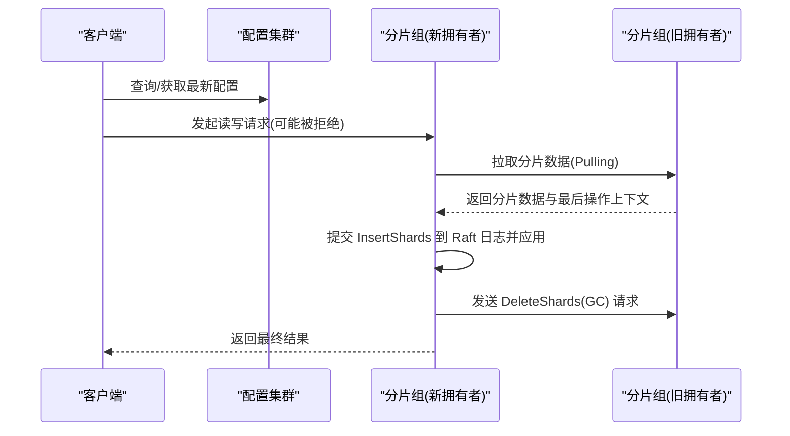
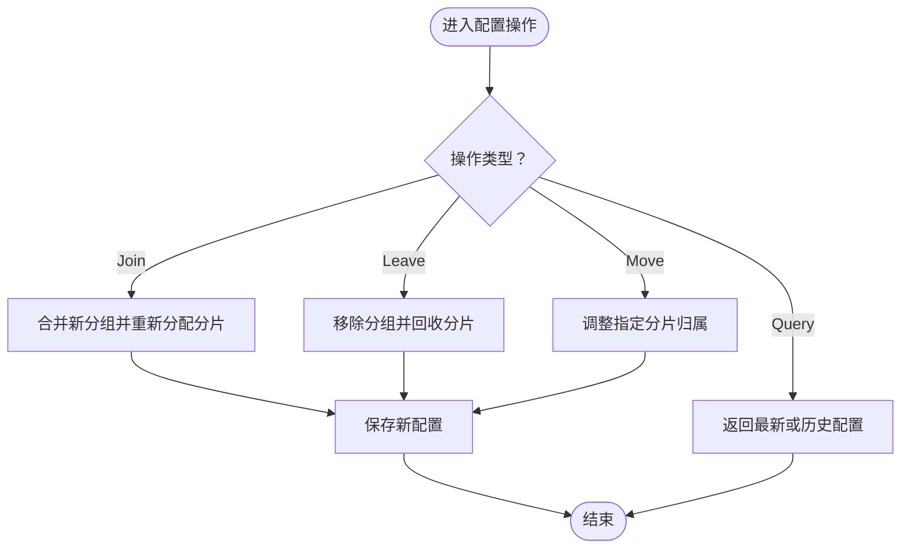
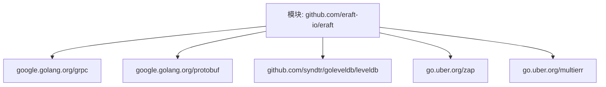

# 项目介绍

**本文引用的文件**
- [README.md](file://README.md)
- [README_cn.md](file://README_cn.md)
- [Home.md](file://wiki/Home.md)
- [Architecture.md](file://wiki/Architecture.md)
- [Raft-Consensus.md](file://wiki/Raft-Consensus.md)
- [Sharding-Mechanism.md](file://wiki/Sharding-Mechanism.md)
- [Storage-and-RPC.md](file://wiki/Storage-and-RPC.md)
- [raft.go](file://raft/raft.go)
- [server.go（ShardKV）](file://shardkv/server.go)
- [server.go（ShardCtrler）](file://shardctrler/server.go)
- [server.go（KVServer）](file://kvraft/server.go)
- [kv.go](file://models/kv.go)
- [main.go（ShardKV 服务端）](file://cmd/shardkvserver/main.go)
- [main.go（KV 服务端）](file://cmd/kvserver/main.go)
- [go.mod](file://go.mod)

## 目录
1. [引言](#引言)
2. [项目结构](#项目结构)
3. [核心组件](#核心组件)
4. [架构总览](#架构总览)
5. [详细组件分析](#详细组件分析)
6. [依赖分析](#依赖分析)
7. [性能考虑](#性能考虑)
8. [故障排查指南](#故障排查指南)
9. [结论](#结论)
10. [附录](#附录)

## 引言
eRaft 是一个基于 Go 语言实现的高性能分布式分片键值存储系统。其核心目标是提供工业级的分布式存储能力，结合现代技术栈（gRPC、LevelDB），在 MIT 6.824 教学实验的基础上进行升级与落地。项目通过三大层面协同工作：共识层（Raft）、配置层（ShardCtrler）与存储层（ShardKV），实现强一致性、高可用与水平扩展。

- 核心价值主张
  - 强一致性与高可用：基于 Raft 共识算法，确保在节点故障与网络分区场景下仍能保持数据一致与服务连续。
  - 动态分片与在线迁移：通过配置集群动态管理分片归属，支持在线加入/离开与手动迁移，保障业务连续性。
  - 工业化基础设施：采用 gRPC 与 LevelDB，兼顾开发效率与生产可用性，提供可扩展、可观测、可维护的系统形态。

- 主要特性
  - 共识：Raft 算法，包含领导者选举、日志复制、快照与安全性保证。
  - 传输：gRPC 提供高效、并发友好的跨节点通信。
  - 存储：LevelDB 作为持久化存储引擎，具备高性能读写与数据持久化能力。
  - 分片：默认将数据划分为固定数量的逻辑分片，由配置集群统一调度与迁移。

- 应用场景
  - 高吞吐、低延迟的键值存储服务
  - 需要强一致性的缓存/配置中心
  - 支持在线扩容与缩容的分布式数据平台
  - 对一致性与可运维性要求较高的业务系统

**章节来源**
- file://README.md#L6-L21
- file://README_cn.md#L6-L21
- file://wiki/Home.md#L13-L15

## 项目结构
仓库采用按“功能域+层次”混合组织方式，主要目录说明如下：
- cmd：各子系统入口程序（服务端与客户端）
- kvraft：单副本键值存储（Raft + LevelDB）
- shardkv：分片键值存储（多副本 Raft + 分片 + LevelDB）
- shardctrler：配置控制器（管理分片到分组的映射）
- raft：Raft 共识算法实现
- shardkvpb/shardctrlerpb/raftpb/kvraftpb：gRPC 与 Protobuf 定义
- wiki：系统设计与实现文档
- models：一致性模型定义（用于正确性验证）



**图示来源**
- [Architecture.md](file://wiki/Architecture.md#L18-L28)
- [main.go（ShardKV 服务端）](file://cmd/shardkvserver/main.go#L1-L59)
- [main.go（KV 服务端）](file://cmd/kvserver/main.go#L1-L48)

**章节来源**
- file://cmd/shardkvserver/main.go#L1-L59
- file://cmd/kvserver/main.go#L1-L48
- file://wiki/Architecture.md#L1-L28

## 核心组件
- 共识层（Raft）
  - 负责在分片组内达成日志顺序一致，提供领导者选举、日志复制、快照与安全性保证。
  - 关键优化：专用应用协程异步应用已提交日志；每对端一个复制协程并行发送心跳与日志；gRPC 通信提升并发与序列化效率。
- 配置层（ShardCtrler）
  - 维护“分片到分组”的映射表，支持加入、离开、移动与查询等操作，驱动分片迁移。
- 存储层（ShardKV）
  - 每个分片组内的多副本通过 Raft 保证一致性；数据按分片维度存储于 LevelDB，支持 Get/Put/Append 等操作。
- 传输层（gRPC + Protobuf）
  - 所有节点间与客户端通信基于 gRPC，消息通过 Protobuf 序列化，具备高并发与类型安全。

**章节来源**
- file://wiki/Raft-Consensus.md#L1-L21
- file://wiki/Sharding-Mechanism.md#L1-L21
- file://wiki/Storage-and-RPC.md#L1-L19
- file://raft/raft.go#L29-L60
- file://shardkv/server.go#L76-L99
- file://shardctrler/server.go#L17-L26

## 架构总览
eRaft 的三层协作关系如下：客户端通过 ShardCtrler 获取当前配置，再向对应 ShardKV 分片组发起读写请求；ShardKV 组内通过 Raft 保证一致性；配置变化触发分片迁移，新拥有者从旧拥有者拉取数据并完成集成与 GC。

```mermaid
graph TD
Client["客户端"] --> SC["配置集群<br/>ShardCtrler"]
Client --> SKV1["分片组 A<br/>ShardKV"]
Client --> SKV2["分片组 B<br/>ShardKV"]
SKV1 --> SC
SKV2 --> SC
SKV1 < --> SKV2["分片迁移<br/>Pulling/插入/删除"]
```

**图示来源**
- [Architecture.md](file://wiki/Architecture.md#L18-L28)
- [Sharding-Mechanism.md](file://wiki/Sharding-Mechanism.md#L8-L14)

**章节来源**
- file://wiki/Architecture.md#L1-L28
- file://wiki/Sharding-Mechanism.md#L1-L21

## 详细组件分析

### Raft 共识组件
- 角色与职责
  - 节点状态：跟随者、候选人、领导者
  - 日志：带索引与任期的条目序列，首个占位条目记录快照边界
  - 复制与提交：领导者向跟随者复制日志，提交后通过应用通道异步应用到状态机
- 关键流程
  - 投票：校验任期与日志新旧，决定是否投票
  - 追加日志：处理任期冲突、日志不一致并返回成功与否
  - 快照：条件安装与日志修剪，配合持久化与状态恢复
- 并发与性能
  - 专用应用协程与每对端复制协程，提升吞吐与响应性
  - gRPC 通信降低序列化开销，提高并发 RPC 处理能力



**图示来源**
- [raft.go](file://raft/raft.go#L30-L60)
- [raft.go](file://raft/raft.go#L166-L200)

**章节来源**
- file://raft/raft.go#L29-L60
- file://raft/raft.go#L166-L200
- file://wiki/Raft-Consensus.md#L12-L21

### ShardKV 存储组件
- 数据模型
  - 每个分片组内维护分片状态（Serving/Pulling/BePulling/GCing），支持按分片键前缀存储
  - 使用 LevelDB 存储键值数据，键格式包含分片标识，便于范围扫描与清理
- 核心流程
  - 命令执行：客户端请求经由 Raft 提交，应用协程异步应用到状态机，返回结果
  - 分片迁移：新拥有者拉取旧拥有者的分片数据，提交 InsertShards 命令并应用到本地 LevelDB；随后通知旧拥有者执行 DeleteShards（GC）
- 并发与一致性
  - 去重请求：基于客户端 ID 与命令 ID 记录最后操作上下文，避免重复执行
  - 错误处理：非领导者直接返回错误；超时控制保障客户端体验



**图示来源**
- [Sharding-Mechanism.md](file://wiki/Sharding-Mechanism.md#L8-L14)
- [server.go（ShardKV）](file://shardkv/server.go#L105-L157)
- [server.go（ShardKV）](file://shardkv/server.go#L159-L193)
- [server.go（ShardKV）](file://shardkv/server.go#L195-L200)

**章节来源**
- file://shardkv/server.go#L76-L99
- file://shardkv/server.go#L105-L157
- file://shardkv/server.go#L159-L193
- file://shardkv/server.go#L195-L200
- file://wiki/Sharding-Mechanism.md#L1-L21

### ShardCtrler 配置组件
- 职责
  - 维护配置计数器与历史配置，支持 Join/Leave/Move/Query 操作
  - 在 Join/Leave 后重新均衡分片分布，尽量保持各组分片数量接近
- 存储
  - 使用 LevelDB 持久化配置与计数器，启动时若为空初始化默认配置
- 流程
  - Join：新增分组并重新分配分片；Leave：移除分组并将分片回收至其他组；Move：手动调整某分片归属；Query：获取最新或指定历史配置



**图示来源**
- [server.go（ShardCtrler）](file://shardctrler/server.go#L84-L112)
- [server.go（ShardCtrler）](file://shardctrler/server.go#L114-L143)
- [server.go（ShardCtrler）](file://shardctrler/server.go#L145-L151)
- [server.go（ShardCtrler）](file://shardctrler/server.go#L153-L159)

**章节来源**
- file://shardctrler/server.go#L17-L26
- file://shardctrler/server.go#L84-L112
- file://shardctrler/server.go#L114-L143
- file://shardctrler/server.go#L145-L151
- file://shardctrler/server.go#L153-L159

### KVServer 单副本组件（对比参考）
- 设计要点
  - 与 ShardKV 类似，但无分片与迁移逻辑，适合教学与小规模场景
  - 通过 Raft 保证单副本一致性，使用 LevelDB 存储键值
- 适用场景
  - 原型验证、教学演示、小规模部署

**章节来源**
- file://kvraft/server.go#L88-L100
- file://kvraft/server.go#L102-L139
- file://kvraft/server.go#L171-L174

### gRPC 与 Protobuf 集成
- 服务端绑定
  - ShardKV/分片组：同时注册 ShardKVService 与 RaftService
  - 配置集群：注册 ShardCtrlerService 与 RaftService
  - 单副本 KV：注册 KVService 与 RaftService
- 传输特性
  - 基于 gRPC 的 HTTP/2 多路复用，支持高并发 RPC
  - Protobuf 定义消息结构，保证类型安全与高效序列化

**章节来源**
- file://cmd/shardkvserver/main.go#L50-L52
- file://cmd/kvserver/main.go#L39-L41
- file://wiki/Storage-and-RPC.md#L11-L15

## 依赖分析
- 语言与工具链
  - Go 版本与工具链声明
- 第三方依赖
  - gRPC 与 Protobuf：提供高效 RPC 与序列化
  - LevelDB：提供高性能持久化存储
  - zap/multierr 等：日志与错误处理辅助



**图示来源**
- [go.mod](file://go.mod#L7-L21)

**章节来源**
- file://go.mod#L1-L22

## 性能考虑
- 共识层优化
  - 应用协程与复制协程并行，减少锁持有时间，提升吞吐
  - 快照与日志修剪降低磁盘占用与回放成本
- 存储层优化
  - LevelDB 的 LSM 结构与 SSTable 适配高并发读写
  - 分片键前缀存储便于范围扫描与清理
- 传输层优化
  - gRPC 的 HTTP/2 多路复用与二进制序列化降低网络与序列化开销
- 可观测性
  - 通过状态接口与日志输出，便于监控与排障

**章节来源**
- file://wiki/Raft-Consensus.md#L12-L21
- file://wiki/Storage-and-RPC.md#L5-L15
- file://shardkv/server.go#L105-L108
- file://shardctrler/server.go#L165-L177

## 故障排查指南
- 常见问题定位
  - 非领导者请求：客户端收到“错误领导者”提示，需重新从配置集群获取最新领导者
  - 超时：命令执行超过超时阈值，建议检查网络、日志复制进度与快照状态
  - 错误分组：当键不再属于当前分片组时，返回“错误分组”，需根据最新配置重试
- 状态检查
  - 使用客户端 status 命令查看分片组与配置集群的当前状态（节点 ID、角色、任期、已应用/已提交索引、存储大小等）
- 迁移相关
  - 若出现分片状态异常（如 Pulling/BePulling/GCing），检查新旧拥有者之间的数据拉取与 GC 是否完成

**章节来源**
- file://shardkv/server.go#L110-L127
- file://shardkv/server.go#L130-L157
- file://README.md#L118-L128
- file://README_cn.md#L118-L128

## 结论
eRaft 将经典的 Raft 共识、gRPC 传输与 LevelDB 存储有机结合，形成一套可扩展、强一致且易于运维的分布式分片键值存储方案。通过配置集群与动态分片机制，系统实现了在线扩容、缩容与迁移，满足高可用与水平扩展需求。对于初学者而言，项目提供了清晰的模块划分与文档；对于有经验的开发者，项目在并发、存储与一致性模型方面均具备深入的技术细节与实践价值。

## 附录
- 快速开始与操作流程
  - 启动配置集群（ShardCtrler）
  - 启动多个 ShardKV 分片组
  - 使用客户端注册分片组
  - 执行读写与基准测试
  - 监控集群状态
- 迁移流程
  - 配置更新 → 变更检测 → 拉取数据 → 插入日志 → 垃圾回收

**章节来源**
- file://README.md#L51-L139
- file://README_cn.md#L51-L139
- file://wiki/Sharding-Mechanism.md#L130-L139