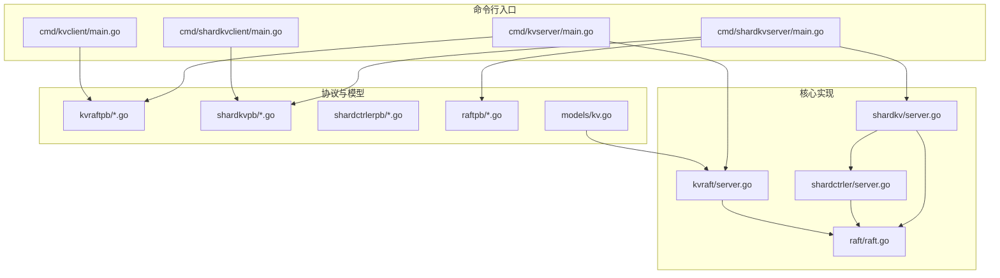
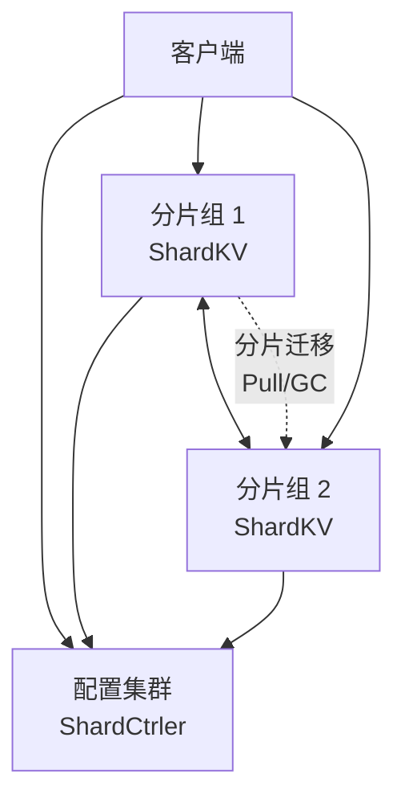
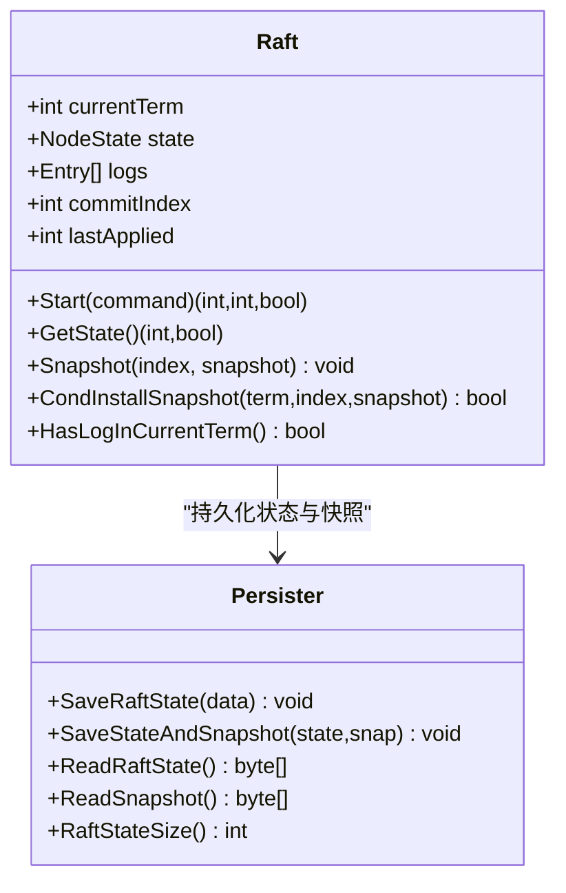
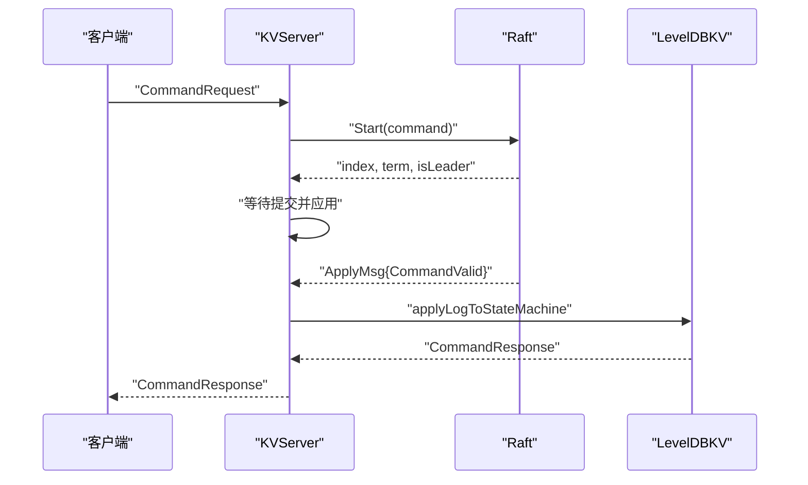
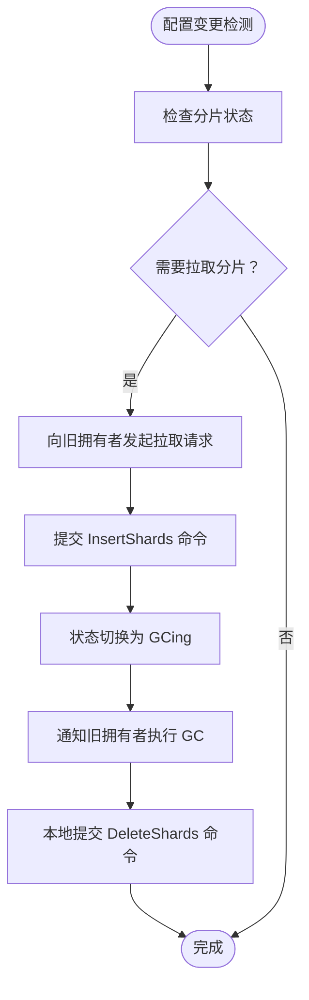
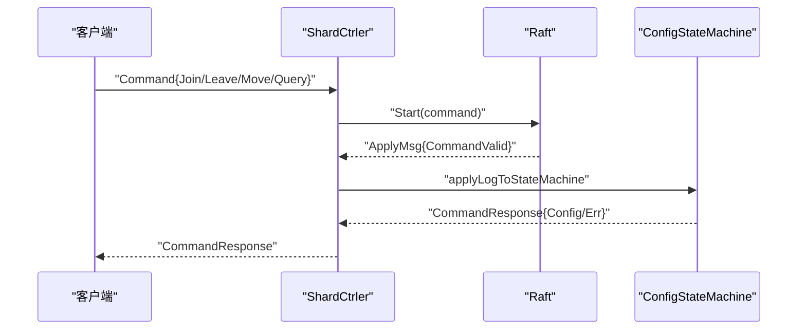
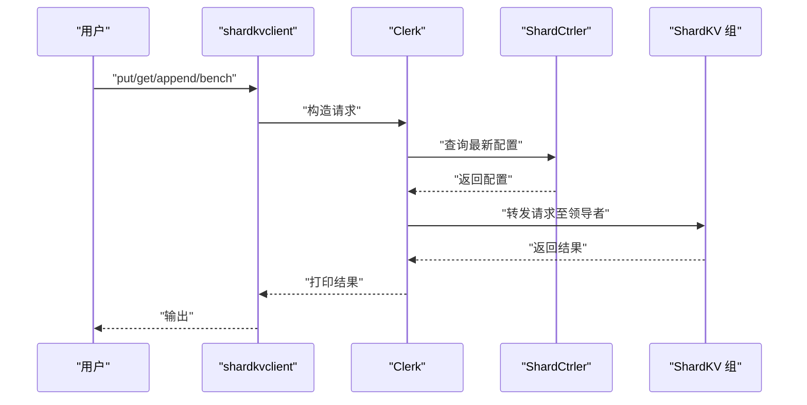
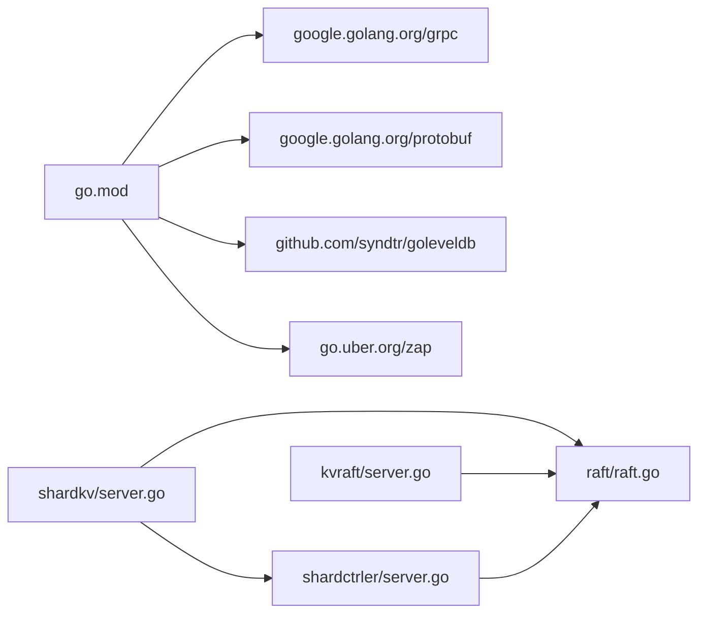

# 项目概述

**本文档引用的文件**
- [README.md](file://README.md)
- [README_cn.md](file://README_cn.md)
- [go.mod](file://go.mod)
- [cmd/kvserver/main.go](file://cmd/kvserver/main.go)
- [cmd/shardkvserver/main.go](file://cmd/shardkvserver/main.go)
- [cmd/kvclient/main.go](file://cmd/kvclient/main.go)
- [cmd/shardkvclient/main.go](file://cmd/shardkvclient/main.go)
- [wiki/Home.md](file://wiki/Home.md)
- [wiki/Architecture.md](file://wiki/Architecture.md)
- [wiki/Raft-Consensus.md](file://wiki/Raft-Consensus.md)
- [wiki/Sharding-Mechanism.md](file://wiki/Sharding-Mechanism.md)
- [kvraft/server.go](file://kvraft/server.go)
- [shardkv/server.go](file://shardkv/server.go)
- [shardctrler/server.go](file://shardctrler/server.go)
- [raft/raft.go](file://raft/raft.go)
- [models/kv.go](file://models/kv.go)

## 目录
1. [引言](#引言)
2. [项目结构](#项目结构)
3. [核心组件](#核心组件)
4. [架构总览](#架构总览)
5. [详细组件分析](#详细组件分析)
6. [依赖分析](#依赖分析)
7. [性能考虑](#性能考虑)
8. [故障排查指南](#故障排查指南)
9. [结论](#结论)
10. [附录](#附录)

## 引言
eRaft 是一个基于 Go 语言实现的高性能分布式分片键值存储系统。它通过 Raft 共识算法、gRPC 通信与 LevelDB 存储相结合，提供强一致性的分布式键值服务，并支持动态分片与在线迁移。项目目标是将 MIT 6.824 教学中的分布式系统核心概念落地为工业级可运行的实现，结合现代技术栈（gRPC、LevelDB）提升开发效率与运行性能。

- 核心特性
  - 共识层：Raft 算法保障强一致与高可用
  - 传输层：gRPC 提供高效、并发友好的节点间与客户端通信
  - 存储层：LevelDB 作为持久化存储引擎
  - 分片层：通过专用配置集群（ShardCtrler）管理分片映射与动态迁移

- 快速开始
  - 启动配置集群（ShardCtrler）
  - 启动多个 ShardKV 组（分片组）
  - 使用客户端进行数据读写与基准测试
  - 通过迁移机制实现动态扩缩容与负载均衡

**章节来源**
- [README.md](file://README.md#L6-L22)
- [README_cn.md](file://README_cn.md#L6-L22)

## 项目结构
仓库采用按功能域划分的模块化组织方式，核心目录与职责如下：
- cmd/*：各组件的命令行入口程序（如 kvserver、shardkvserver、shardctrler 等）
- kvraft/*：单机 Raft 键值存储的实现与 gRPC 适配
- shardkv/*：分片键值存储的实现、分片状态管理与迁移逻辑
- shardctrler/*：配置控制器，维护分片到分组的映射并支持 join/leave/move/query
- raft/*：Raft 共识算法实现（含 gRPC 适配、快照、复制器等）
- shardkvpb/shardctrlerpb/raftpb/kvraftpb：对应 gRPC 协议定义与生成代码
- wiki/*：系统设计与实现说明文档
- models/*：用于正确性验证的模型（Porcupine）

**图表来源**
- [cmd/kvserver/main.go](file://cmd/kvserver/main.go#L16-L47)
- [cmd/shardkvserver/main.go](file://cmd/shardkvserver/main.go#L18-L58)
- [cmd/kvclient/main.go](file://cmd/kvclient/main.go#L11-L46)
- [cmd/shardkvclient/main.go](file://cmd/shardkvclient/main.go#L14-L105)
- [kvraft/server.go](file://kvraft/server.go#L318-L341)
- [shardkv/server.go](file://shardkv/server.go#L759-L799)
- [shardctrler/server.go](file://shardctrler/server.go#L324-L343)
- [raft/raft.go](file://raft/raft.go#L689-L725)
- [models/kv.go](file://models/kv.go#L20-L72)

**章节来源**
- [README.md](file://README.md#L43-L49)
- [go.mod](file://go.mod#L1-L22)

## 核心组件
- Raft 共识引擎
  - 负责节点状态（领导者/候选人/跟随者）、选举、日志复制、提交推进与快照
  - 提供 Start/GetState/Snapshot 等接口，供上层服务调用
- KVRAFT（单机键值服务）
  - 基于 Raft 的状态机，封装 LevelDB 作为持久化存储
  - 支持 Get/Put/Append 操作，带去重与异步应用
- ShardKV（分片键值服务）
  - 在 Raft 基础上扩展分片状态、配置变更、分片拉取与垃圾回收
  - 通过 ShardCtrler 获取最新配置，自动触发迁移
- ShardCtrler（配置控制器）
  - 维护分片到分组的映射，支持 join/leave/move/query
  - 通过 Raft 保证配置变更的一致性
- gRPC 适配层
  - 为 Raft、KV、ShardKV、ShardCtrler 提供统一的 gRPC 接口
  - 客户端通过 Clerk 发起请求，透明路由到正确的分组与领导者

**章节来源**
- [wiki/Raft-Consensus.md](file://wiki/Raft-Consensus.md#L1-L21)
- [kvraft/server.go](file://kvraft/server.go#L88-L100)
- [shardkv/server.go](file://shardkv/server.go#L76-L99)
- [shardctrler/server.go](file://shardctrler/server.go#L17-L26)
- [raft/raft.go](file://raft/raft.go#L37-L60)

## 架构总览
eRaft 由三层协同构成：
- 共识层（Raft）：确保同一组内日志一致与提交推进
- 配置层（ShardCtrler）：维护分片到分组的映射，支持动态扩缩容与手动迁移
- 存储层（ShardKV）：按分片存储键值数据，跨组迁移时进行数据拉取与清理

**图表来源**
- [wiki/Architecture.md](file://wiki/Architecture.md#L18-L28)

**章节来源**
- [wiki/Architecture.md](file://wiki/Architecture.md#L1-L29)

## 详细组件分析

### Raft 共识组件
- 设计要点
  - 多 goroutine 并行：心跳/选举定时器、复制器、应用器、条件变量协调
  - 安全性保障：日志匹配、提交推进仅限当前任期、投票与追加条目严格校验
  - 可靠性增强：快照与日志裁剪、安装快照异步投递到应用通道
- 关键接口
  - Start：提议新日志条目
  - GetState：查询当前任期与是否领导者
  - Snapshot/CondInstallSnapshot：快照截断与恢复
- 性能特征
  - 复制器按节点独立 goroutine 并发复制
  - 应用器异步推送已提交日志，避免阻塞

**图表来源**
- [raft/raft.go](file://raft/raft.go#L37-L106)
- [raft/raft.go](file://raft/raft.go#L581-L608)

**章节来源**
- [raft/raft.go](file://raft/raft.go#L689-L725)
- [wiki/Raft-Consensus.md](file://wiki/Raft-Consensus.md#L12-L21)

### KVRAFT（单机键值服务）
- 数据模型
  - 使用 LevelDB 作为后端存储，键值对直接落盘
  - 通过 labgob 编解码将命令序列化为日志条目
- 核心流程
  - 客户端请求经 Raft 提议并复制到多数节点后提交
  - 应用器异步将已提交命令应用到状态机，返回结果给等待的客户端通道
  - 去重：基于客户端 ID 与命令 ID 记录最后应用的命令，避免重复执行
- 快照策略
  - 当 Raft 状态大小超过阈值时触发快照，保存状态机数据与去重上下文

**图表来源**
- [kvraft/server.go](file://kvraft/server.go#L102-L139)
- [kvraft/server.go](file://kvraft/server.go#L292-L304)
- [kvraft/server.go](file://kvraft/server.go#L177-L236)

**章节来源**
- [kvraft/server.go](file://kvraft/server.go#L17-L86)
- [kvraft/server.go](file://kvraft/server.go#L318-L341)

### ShardKV（分片键值服务）
- 分片与状态
  - 默认 10 个分片，每个分片属于某一分组（GID）
  - 分片状态：Serving/Pulling/BePulling/GCing，控制迁移阶段
- 配置与迁移
  - 定期轮询 ShardCtrler 获取最新配置
  - Pulling：从旧拥有者拉取分片数据；GCing：完成集成后通知旧拥有者删除
- 数据模型
  - LevelDB 中键格式包含分片号前缀，便于按分片范围扫描与清理

**图表来源**
- [shardkv/server.go](file://shardkv/server.go#L549-L570)
- [shardkv/server.go](file://shardkv/server.go#L572-L643)
- [shardkv/server.go](file://shardkv/server.go#L645-L696)

**章节来源**
- [shardkv/server.go](file://shardkv/server.go#L76-L99)
- [shardkv/server.go](file://shardkv/server.go#L430-L445)
- [wiki/Sharding-Mechanism.md](file://wiki/Sharding-Mechanism.md#L8-L21)

### ShardCtrler（配置控制器）
- 功能
  - Join：新增分组并重新平衡分片
  - Leave：移除分组并将分片迁移到其他组
  - Move：手动将指定分片迁移到目标组
  - Query：查询历史或最新配置
- 存储
  - 使用 LevelDB 持久化配置版本与计数器，支持回放与查询

**图表来源**
- [shardctrler/server.go](file://shardctrler/server.go#L179-L215)
- [shardctrler/server.go](file://shardctrler/server.go#L250-L264)
- [shardctrler/server.go](file://shardctrler/server.go#L272-L313)

**章节来源**
- [shardctrler/server.go](file://shardctrler/server.go#L324-L343)
- [shardctrler/server.go](file://shardctrler/server.go#L84-L159)

### 客户端与命令行工具
- kvclient：单机键值服务客户端，支持 get/put/append/status
- shardkvclient：分片键值服务客户端，支持 get/put/append/status/bench
- 启动参数
  - -addrs/-id/-db：指定节点地址列表、节点 ID 与数据库路径
  - -gid/-cluster/-ctrlers：分片组 ID、组内地址列表与配置集群地址列表

**图表来源**
- [cmd/shardkvclient/main.go](file://cmd/shardkvclient/main.go#L14-L105)
- [shardkv/server.go](file://shardkv/server.go#L110-L127)

**章节来源**
- [cmd/kvclient/main.go](file://cmd/kvclient/main.go#L11-L46)
- [cmd/shardkvclient/main.go](file://cmd/shardkvclient/main.go#L14-L105)
- [cmd/kvserver/main.go](file://cmd/kvserver/main.go#L16-L47)
- [cmd/shardkvserver/main.go](file://cmd/shardkvserver/main.go#L18-L58)

## 依赖分析
- 语言与工具链
  - Go 1.24+，使用标准库与第三方依赖（gRPC、Protobuf、LevelDB、Zap 等）
- 外部依赖
  - google.golang.org/grpc：gRPC 通信框架
  - google.golang.org/protobuf：Protobuf 编解码
  - github.com/syndtr/goleveldb：LevelDB 存储
  - go.uber.org/zap：日志记录
- 模块耦合
  - ShardKV 依赖 ShardCtrler 查询配置，依赖 Raft 保证组内一致性
  - KVRAFT 与 ShardKV 均依赖 Raft 与 LevelDB
  - gRPC 协议层与具体实现解耦，便于替换底层传输

**图表来源**
- [go.mod](file://go.mod#L7-L21)

**章节来源**
- [go.mod](file://go.mod#L1-L22)

## 性能考虑
- 并发与吞吐
  - Raft 复制器按节点独立 goroutine 并行复制，提高复制效率
  - 应用器异步推送已提交日志，避免阻塞
  - KV/分片服务在不持有锁的情况下进行网络调用，减少锁竞争
- 存储与快照
  - 当 Raft 状态大小达到阈值时触发快照，降低日志长度与恢复时间
  - LevelDB 迭代器用于快照打包，保证一致性
- 网络与序列化
  - gRPC 提供高效的二进制序列化与连接复用，适合高并发场景
- 迁移与负载均衡
  - 自动分片迁移与均衡策略，避免热点集中，提升整体吞吐

**章节来源**
- [wiki/Raft-Consensus.md](file://wiki/Raft-Consensus.md#L12-L16)
- [kvraft/server.go](file://kvraft/server.go#L238-L258)
- [shardkv/server.go](file://shardkv/server.go#L463-L485)

## 故障排查指南
- 常见问题定位
  - 领导者错误：客户端收到 ErrWrongLeader，需重试或刷新配置
  - 分片不可服务：客户端收到 ErrWrongGroup，表示当前分组不负责该分片，需根据最新配置重定向
  - 超时：客户端在超时时间内未收到响应，可能因网络分区或领导者故障
  - 快照相关：若出现快照索引落后或冲突，检查日志裁剪与快照安装流程
- 命令行工具
  - 使用 status 命令查看各节点角色、任期、已提交/已应用索引与存储大小
  - 使用 bench 命令进行压力测试，观察吞吐与延迟变化
- 日志与调试
  - 通过 Zap 日志输出定位状态转换、复制与应用过程中的异常

**章节来源**
- [cmd/kvclient/main.go](file://cmd/kvclient/main.go#L31-L42)
- [cmd/shardkvclient/main.go](file://cmd/shardkvclient/main.go#L54-L66)
- [shardkv/server.go](file://shardkv/server.go#L119-L124)

## 结论
eRaft 将 Raft 共识、gRPC 通信与 LevelDB 存储有机结合，提供了高可用、可扩展且易于运维的分布式分片键值存储方案。通过配置控制器与自动迁移机制，系统能够动态应对节点增删与负载变化，满足生产环境对一致性与性能的双重需求。对于初学者，建议先从单机 KVRAFT 与命令行工具入手，再逐步理解分片与迁移机制；对于有经验的开发者，可关注快照策略、复制器并发优化与客户端重试机制等细节。

## 附录

### 快速开始（步骤与命令）
- 构建
  - 执行构建命令生成二进制文件
- 启动配置集群（ShardCtrler）
  - 启动 3 个节点，监听不同地址
- 启动 ShardKV 分片组
  - 启动两个分组（GID 100/101），每组 3 个节点
- 注册分片组
  - 使用 shardctrlerclient 将两个分组注册到配置集群
- 数据操作
  - 使用 shardkvclient 进行读写与基准测试
- 集群监控
  - 使用 status 命令查看各节点状态

**章节来源**
- [README.md](file://README.md#L43-L128)
- [README_cn.md](file://README_cn.md#L43-L128)

### 分布式系统基础概念（面向初学者）
- 一致性与可用性
  - 强一致性：Raft 通过领导者与多数派复制保证日志顺序一致
  - 可用性：领导者故障时自动选举，系统持续提供服务
- 分区容忍与分片
  - 分片将数据水平切分，提升吞吐与扩展性
  - 配置控制器统一管理分片映射，支持动态迁移
- 容错与恢复
  - 快照与日志裁剪降低恢复成本
  - 客户端重试与领导者切换保障服务连续性

**章节来源**
- [wiki/Home.md](file://wiki/Home.md#L13-L20)
- [wiki/Architecture.md](file://wiki/Architecture.md#L5-L16)
- [wiki/Sharding-Mechanism.md](file://wiki/Sharding-Mechanism.md#L3-L7)

### 正确性模型（Porcupine）
- 模型定义
  - 输入：get/put/append 操作与键
  - 输出：get 返回值
  - 步进函数：根据操作类型更新状态（覆盖/拼接）
- 用途
  - 对历史操作进行分区与验证，确保最终一致性

**章节来源**
- [models/kv.go](file://models/kv.go#L20-L72)